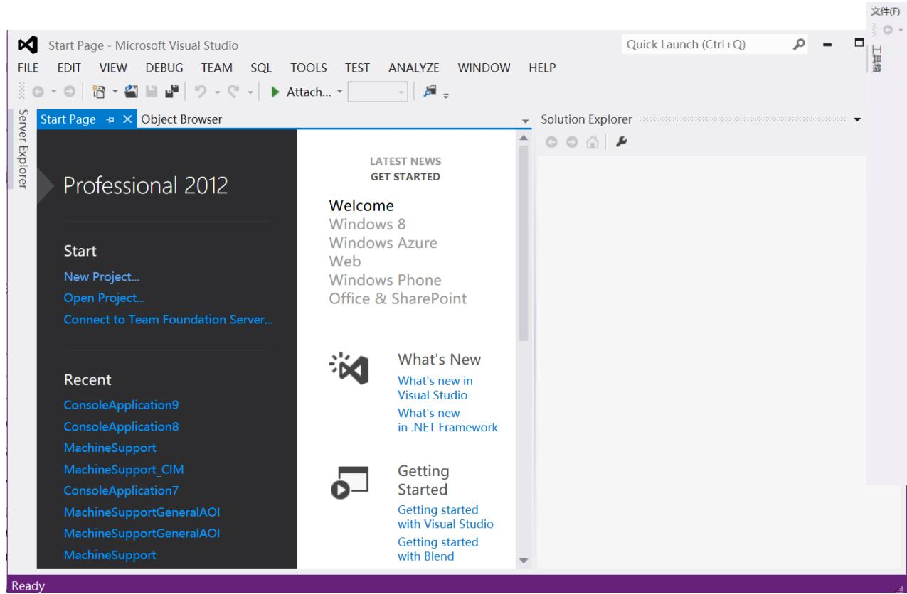
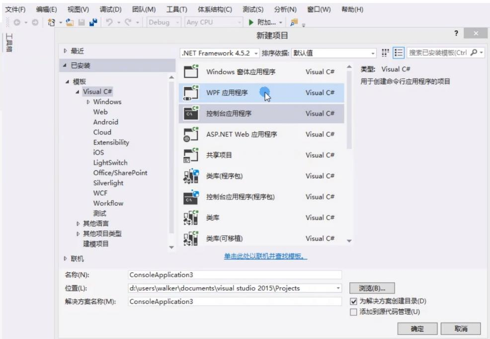
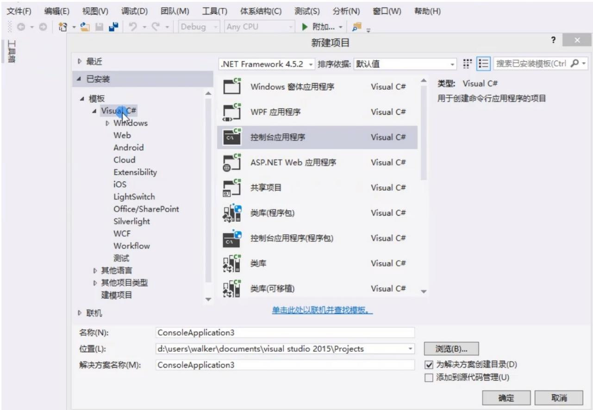
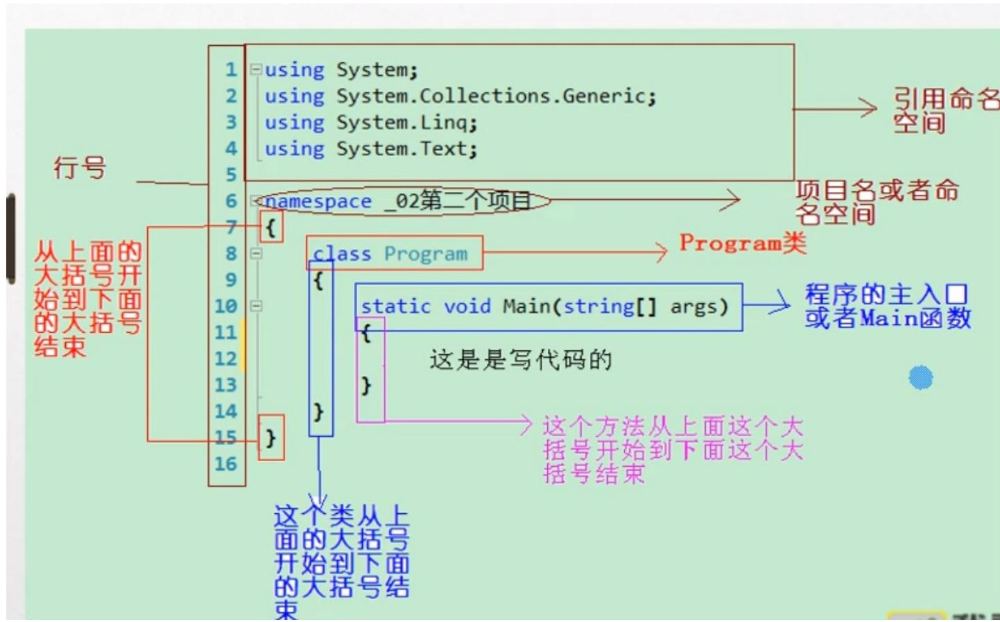

COGNEX

# FASTER FORWA

C# 基础学习一

# 学习内容

1.C#.NET Framework 简介   
2. 变量和表达式

# 参考资料

C# 编程书籍 (C# 入门经典 2012/2015 等 )  
网上 C# 编程视频

# C#.NET Framework 简介

.NET Framework 是 Microsoft 为开发应用程序而创建的最新开发平台，它包括：

$\textcircled{1}$ ：一个庞大的代码库。可以用 C# 等语言通过面向对象编程技术（ OPP ）来使用这些代码。  
$\textcircled{2}$ ：定义了基本的类型，这也被称为公共通用类型系统（ CTS ）。  
$\textcircled{3}$ ：包含了 .NET 公共语言运行库（ CLR ），负责管理 .NET 库开发的所有应用程序的执行

C# 是运行在 .NET CLR （ common language runtime ）上的，用于创建应用程序的一种高级语言，它是以前的语言（例如 $\mathsf { C } { + + } \mathsf { \Gamma } )$ ）的一种演变，可以用于编写任意程序，包括 Wed 应用程序和桌面应用程序。

# Visual Studio 简介

Visual Studio 是微软公司推出的开发环境。是最流行的 Windows 平台应用程序开发环境 .版本有 VS2012/VS2015/VS2019 等等。我们以 VS2012 学习为例。

# VS C# 编写

.NET Framework 编写应用程序，我们主要编写控制台应用程序。

# VS C# 编写

程序结构：

# VS C# 编写

.sln ：解决方案文件  
.csproj ：项目文件  
.cs: 类文件

思考：解决方案文件和项目文件以及类文件之间的关系？

# VS C# 编写

# 标识符，关键字

# 标识符、关键字

标识符是程序编写人员为常量、变量、数据类型、方法、函数、属性、类、程序等定义的名称。  
·例如定义一个字符串变量：string username;  
关键字对于C#编译器而言，具有特定含义的名称，比如程序中的usingclass,static,void都属于关键字。如果错误地将关键字用作标识符，编译器会产生一个错误，我们马上就会知道出错了，所以不必担心

# 标识符的规定

·只能由大写字母、小写字母、数字和下划线_组成  
·必须以字母或者下划线开头  
C语言是区分大小写的，username与Username是不同的标识符  
·如果C#关键字作为标识符就在在标识符前加上“@”  
·标识符的命名最好好辨认（可用英文）

# VS C# 编写

# 命名空间

# 命名空间

在C#中，有时命名空间相当长，输入起来很烦琐，用这种方式指定某个特定的类也是不必要的.

要解决这种问题，可在文件的顶部列出类的命名空间，前面加上using关键字，这样引用一个命名之间后，访问其空间内的方法就会向在其类内访问一样。  
using还有另一个作用，就是给命名空间一个别名．如果命名空间的名称非常长，又要在代码中使用多次，而用户不希望该命名空间的名称包含在using指令中〈例如，避免类名冲突〉，这时就可以给该命名空间指定一个别名，  
·其语法如下：using别名=命名空间

# VS C# 编写

# 命名规范

# 命名规范

目前，在.NET Framework 名称空间中有两种命名约定，称为PascalCase和camelCase  
这两个名称中使用的大小写表示它们的用法。这两种命名约定都应用到由多个单词组成的名称中并指定名称中的每个单词除了第一个字母大写外，其余字母都是小写。在camelCase中，还有一个规则，即第一个单词以小写字母开头。

# 命名规范

·下面是camelCase变量名：

age

firstName

timeOfDeath

·下面是PascalCase变量名：

Age

LastName

WinterOfDiscontent

# 课堂练习

下面哪些命名是正确的：

123Ta;

myFamily;

LastName;

this_specT2;

The&value;

_detaValue;

_In-HSG-Angle;

# 变量

变量是有名称和类型的数据块，变量只有经过声明和初始化后，才能使用，可以把字面值赋予变量，以初始化它们，变量还可在单个步骤中声明和初始化。

计算机存储变量的过程：

1. 声明变量  
2. 给变量赋值   
3. 使用变量

# 变量

# 简单类型

1. 整数： int,short,long 等。  
2. 浮点： double ， float 等。  
3. 字符： char,string 。  
4. 布尔： bool 。

# 课堂练习

请用户输入姓名，性别，年龄，当用户按下某个键后在屏幕上显示：您好， XX ，您的年龄是 XX ，您是 X 生。

# 表达式

把变量和字面值（在使用运算符时，它们称为操作数）与运算符组合起来，就得到了表达式，它是计算的基本构件。

简单的操作包括所有的基本数学操作，如加减乘除，还有专门用于处理布尔值的逻辑运算以及赋值运算。

问题：让用户输入他的数学和语文成绩，计算他的总成绩并显示出来。

# 表达式

# 运算符

按操作数的个数：

一元运算符：处理一个操作数 例如： int $\mathtt { a } = 1 0$ ;  
二元运算符：处理两个操作数 例如： $a + b$ ;  
三元运算符：处理三个操作数 例如：？：；

按运算类型：

数字运算符，赋值运算符，关系运算符，布尔运算符，位运算符，其他运算符。

# 表达式

# 数学运算符

<table><tr><td>运算符</td><td>类别</td><td>示例表达式</td><td>结果</td></tr><tr><td>+</td><td>二元</td><td>var1=var2+var3</td><td>求和</td></tr><tr><td>-</td><td>二元</td><td>var1=var2-var3</td><td>求差</td></tr><tr><td>*</td><td>二元</td><td>var1=var2*var3</td><td>求乘</td></tr><tr><td>/</td><td>二元</td><td>var1=var2/var3</td><td>当var1为double 就是除法，var1 为int,取整</td></tr><tr><td>%</td><td>二元</td><td>var1=var2+var3</td><td>取余数</td></tr><tr><td>+</td><td>一元</td><td>var1=+var2</td><td>乘以1</td></tr><tr><td>-</td><td>一元</td><td>var1=-var2</td><td>乘以-1</td></tr><tr><td>++</td><td>一元</td><td>var1=var2++</td><td>后，先用后加</td></tr><tr><td>++</td><td>一元</td><td>var1=++var2</td><td>前，先加后用</td></tr><tr><td>--</td><td>一元</td><td>var1=var2--</td><td>后，先用后减</td></tr><tr><td>--</td><td>一元</td><td>var1=--var2</td><td>前，先减后用</td></tr></table>

# 表达式

# 赋值运算符

<table><tr><td>运算符</td><td>类别</td><td>示例表达式</td><td>结果</td></tr><tr><td>=</td><td>二元</td><td>var1=var2</td><td>Var2的值赋值给 var1</td></tr><tr><td>+=</td><td>二元</td><td>var1+=var2</td><td>var1=var1+var2</td></tr><tr><td>-</td><td>二元</td><td>var1-=var2</td><td>var1=var1-var2</td></tr><tr><td>*=</td><td>二元</td><td>var1*=var2</td><td>var1=var1*var2</td></tr><tr><td>/=</td><td>二元</td><td>var1/=var2</td><td>var1=var1/var2</td></tr><tr><td>%=</td><td>二元</td><td>var1%=var2</td><td>var1=var1%var2</td></tr></table>

$=$ 简单赋值 其他则为复合赋值

使用这些运算符,特别是在使用长变量名时,更便于阅读

# 表达式

# 关系运算符

<table><tr><td>运算符</td><td>类别</td><td>示例表达式</td><td>结果</td></tr><tr><td>&gt;</td><td>二元</td><td>var1=var2&gt;var3</td><td>如果真的大于，那就返回 true,如果小于，那就返回 false</td></tr><tr><td>&lt;</td><td>二元</td><td>var1=var2&lt;var3</td><td>如果小于，true否则 false</td></tr><tr><td>&gt;=</td><td>二元</td><td>var1=var2&gt;=var3</td><td>如果大于等于，true</td></tr><tr><td>&lt;=</td><td>二元</td><td>var1=var2&lt;=var3</td><td>如果小于等于true</td></tr><tr><td>!=</td><td>不等于</td><td>var1=var2!=var3</td><td>如果不等于true</td></tr><tr><td>==</td><td>等于</td><td>var1=var2===var3</td><td>如果等于true</td></tr></table>

# 表达式

# 布尔运算符

<table><tr><td>运算符</td><td>类别</td><td>示例表达式</td><td>结果</td></tr><tr><td>&amp;&amp;</td><td>二元</td><td>var3=var1&amp;&amp;var2</td><td>同时true结果true</td></tr><tr><td>||</td><td>二元</td><td>var3=var1||var2</td><td>一个true结果true</td></tr><tr><td>!</td><td>一元</td><td>var3=!var1</td><td>Var1为true时false</td></tr><tr><td>^</td><td>二元</td><td>var3=var1^var2</td><td>有且只有一个为true,结果为true</td></tr><tr><td>&amp;</td><td>二元</td><td>var3=var1&amp;var2</td><td>同时true结果true</td></tr><tr><td>|</td><td>二元</td><td>var3=var1||var2</td><td>一个true结果true</td></tr></table>

# 表达式

# 运算符的优先级

表3-10运算符的优先级  

<table><tr><td>优 先 级</td><td>运算符</td></tr><tr><td rowspan="5">优 先 级 由 高 到 低</td><td>++, -- (用作前缀); +, - (一元)</td></tr><tr><td>* ,/,%</td></tr><tr><td>+,-</td></tr><tr><td>\( = , * = , / = , \% = , += , - = \)</td></tr><tr><td>++,--(用作后缀)</td></tr></table>

# 课堂练习

编写一个计算圆面积程序，半径通过键盘录入。

# 课后练习

用户随意输入一个秒数（例如 1367855 秒），编程算出该秒数是几天几小时几分钟几秒。

COGNEX

# FASTER FORWA

Thank You