# 笔试资料 1

1. 机器视觉的概念？  
运用数字图像处理技术，处理数字图像，并应用于工业生产任务。  
2. 机器视觉的四大应用分别是？其中 GIGI 的两个 G 是？

引导、检测、测量、识别、 引导 测量

3. 机器视觉的五大构成部分是？

视野、光源、图像采集、信息传输、视觉工具

视觉工具：用来评价照片

4. 标定工具的作用？

标定工具作用：建立图像和机构的关联关系。

4.1相机的工作原理：通过传感芯片将光信号转换成电信号，进而转换成数字信号传输给计算机。   
5. 视野（FOV)：相机所能看到的现实世界的物理尺寸

工作距离（WD）：被测物到相机镜头的距离

焦距（Focus）：透镜中心到其焦点的距离。

感光器尺寸（CCD/CMOS Size）：感光片成像区域的尺寸（通常由感光片长边决定）

景深（DOF）:被测物体清晰成像的最上表面与最下表面之间的距离

放大倍率（MPAG）：感光器尺寸与FOV之间的比值

曝光时间:光在感光器件表面使其感光的过程，电子感光器件一般称为光电转换即电子快门时间

像素（Pixel)-像元:感光器件上的基本感光单元，既相机识别到的图像上的最小单元

像素深度(Pixel Depth):即每个像素数据的位数， 一般常用的是8Bit，对于数字工业相机机一般还会有10Bit、12Bit等分辨率（Resolution):相机采集图像的像素点数

像素分辨率（mm/pixel):每个像素代表的毫米值

6. 像素分辨率=FOV/分辨率 eg：分辨率为 1600x1200pixel 视野为 64x48mm 像素分辨率= 64/1600=0.04mm  
7. 镜头最大兼容CCD尺寸≥相机芯片尺寸.   
8. 黑白相机的像素深度为_8__bit.灰度等级是_256_,即 0-_255__256 个等级，黑色为__0__,白色为_255__。  
9. 图像传感器是由行列组成的 矩阵式亮度感应元器件 _组成。  
10.相机按照拍照颜色可分为：黑白相机、彩色相机。按照像素排列方式可分为：面阵相机、线阵相机  
11.相机按照芯片类型可分为_CCD _相机和 _CMOS 相机.二者的工作原理都是 _都是利用感光二极管进行光电转换。 。  
12.工业首选的芯片类型是__CMOS___，这两种芯片的各自优势分别是：____，二者的材质分别是_

CMOS的优势：片上集成化、功耗低、价格便宜、速度快。

CCD的优势：图像锐利度高、感光度高、分辨率高、噪点少

二者的工作原理：都是利用感光二极管进行光电转换

CCD：电耦合器件光电传感器

CMOS：互补性金属氧化物半导体，

13.两种快门方式是：全局快门、滚动快门、  
14. 相机常用接口有：CameraLink、Gige、Usb(2.0 3.0 3.1)、1394(a b)：Gige 是康耐视相机在用的接口，CameraLink 传输速度最快 255-680MB/s Gige：100MB/s  
15.镜头就是实现_ _光束变换 的。  
16.镜头的两个组成部分为：__光圈 _对焦环  
17.镜头越厚，焦距越__小__.   
18.影响视野大小的四个因素分别是？分别对视野有什么影响？以及第一幅图画图。

工作距离、镜头焦距、成像面大小、像距

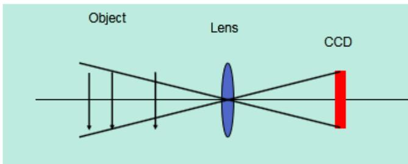  
在同一镜头下：  
WD越大，FOV越大。WD越小，FOV越小

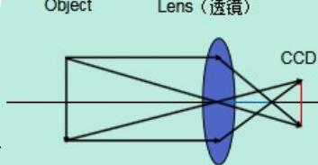  
Object Lens（透镜）

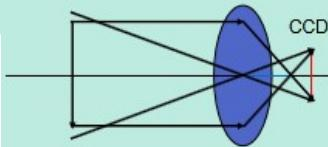

# FOV与CCD的关系

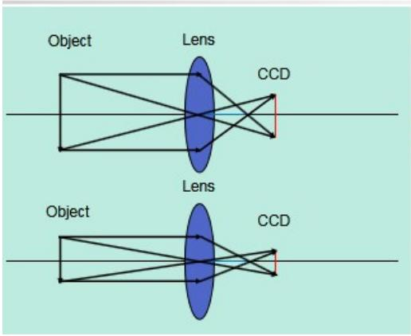

# FOV与像距的关系

#

同一物距，像距下： CCD越大，FOV越大 CCD越小，FOV越小。

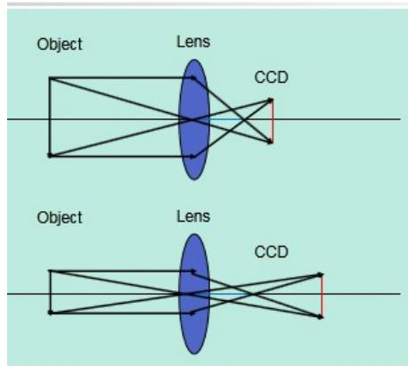

#

同一物距下：焦距越小，FOV越大焦距越大，FOV越小

#

同一物距，CCD尺寸不变：

像距越大，FOV越小； 像距越小，FOV越大。

光圈：是一个用来控制光线透过镜头，进入机身内感光面的光量的装置，它通常是在镜头内。常见的光圈值有f1，f1.4，f2，f2.8，f4，f5.6，f8，f11，f16，f22

例如光圈从f8调整到f5.6，进光量便多一倍，我们也说光圈开大了一级。

19. 光圈越大，光圈值越__小__。

# 20.光圈和光圈值的关系?画图+结论解释

光圈越大，光圈值小，通光量越大，图片越亮光圈越小，光圈值大，通光量越小，图片越暗

21. 影响景深的因素：焦距越_短__，景深越大；光圈越__小_，景深越大；工作距离越_远_，景深越大；相机芯片像元越__大_，景深越大；增加接圈或者扩倍器会使景深变_小___.  
22. 改变图像采集亮度的四个方式：

调整光源亮度、调整光圈值、调整曝光时间、更换大像元相机

23.C型镜头匹配_C_型相机，CS型镜头匹配_CS_型相机；C型镜头 $+ 5 \mathsf { m m }$ 接圈匹配_CS_型相机；CS型镜头 _不匹配_C 型相机.   
24.远心镜头的放大倍率可不可以调节？其优势是什么？，放大倍率=_CCD_ ___FOV_

不可以调节。超低畸变、高分辨率、超宽景深

25.可见光的波长范围是：__380nm _到__780nm _.白光包含所有波长的光线  
26.紫外光（UV）：常用于检测UV胶  
27. 有光线进入到相机里边，即为_亮__,没有光线进入到相机即为__暗__.  
28. 光源按照形状分类可分为： 。

点光、条光、面光、环光、同轴光、非同轴漫射光(也叫Dome光)

# 29.光源的作用？

$\textcircled{1}$ 凸显出缺陷和背景的差异，提高图像对比度  
$\textcircled{2}$ 形成最有利于图像处理的成像效果  
$\cdot$ 照明目标，提高目标亮度，克服环境光干扰，保证图像的稳定性  
30.判断图片质量的三大原则：  
对比度好、均匀性好、色彩还原性好、  
31. LED 光源的优势？(5 个以上)。  
光电转化率高、绿色环保、寿命长、工作电压低、体积小、发热少、亮度高、光束集中稳定、色彩多样、易于调光、启动无延时  
32.光源的__安装角度 _和 安装方向 直接决定图像成像效果。  
33. 图片上的眩光可以通过在光源上加_偏振片__或者改用__偏振___光源来消除。  
34.同轴光含有 $50 \%$ 的镀银镜  
35.同轴光、背光、非同轴漫射光、高角度光（亮场），低角度光（暗场）：

适用同轴光打光的场景：同轴光源能够凸显物体表面不平整，克服表面

反光造成的干扰，主要用于检测物体平整光滑

表面的碰伤、划伤、裂纹和异物。

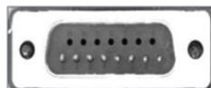

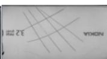

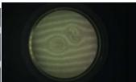

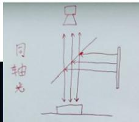

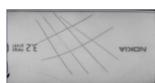

这张图 可用 同轴光或者高角度光

对透明玻璃上的划痕检测： 用同轴光

适用背光源的应用场景：

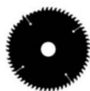

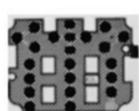

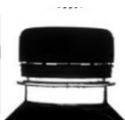

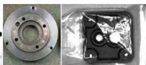

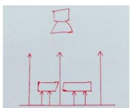

用于轮廓和边缘检测，用于透明物体内不透明物体的检测

适用非同轴漫射光(Dome 光)打光的应用场景：

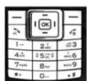

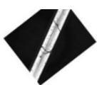

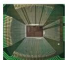

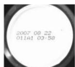

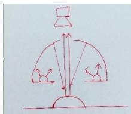

可以避免因弯曲表面导致的打光不均匀。

适合于曲面，表面凹凸，弧形表面检测金属、玻璃表面反光较强的物体表面检测

适用高角度光（亮场）打光的应用场景：

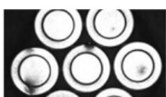

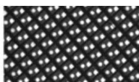

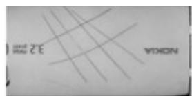

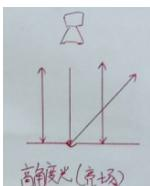

高角度光的优劣势：

# 适用低角度光（暗场）打光的应用场景：

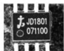

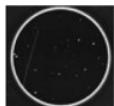

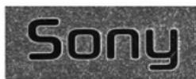

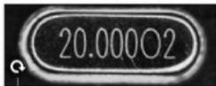

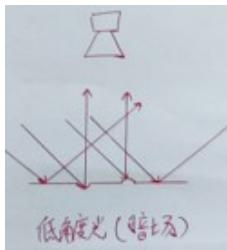

低角度光的优劣势：

优势：对于边缘有倒角、圆角物体轮廓提取、冲压、浇筑、浮雕图案识别与检测，光滑表面划伤、裂痕检测效果比较理想。

缺点：对于透明物体表面的划痕检测效果不理想。

36. 彩色光源的三基色是：RGB red green blue

打物体颜色的相近色，使物体变亮。打物体颜色的互补色，使物体变暗。

37.一个白色瓶子，上面有红色和蓝色的字体，需要对蓝色的字体检测，此时选用__红色__颜色光来进行打光。

38.红外光：特点：穿透力强用途：消除色差场合、需穿透采图场合

39.紫外光：波长范围：10nm~380nm用途：常用于检测UV胶、金属表面划痕、部分农产品腐败等

40.常见的基本码制有__一维线性条码 DataMatrix QR-Code _PDF417

41.DPM是： 直接元件标识 工艺

42.一维线性条码的组成：静区、起始符、数据符、终止符、静区

43.矩阵式二维码的组成：静区、L型寻边区、计时图案、模块/单元、数据区

44. PPM:每个模块上的像素个数（Pixels per Module）

45.Read：正确解码、No-Read：数据没有被提取，多个原因: 时间不够, 没有把握

Misread: 确信的解码，但是数据错误，一般宁可不解也不错解

46.一维码和二维码的不同点和共同点是：

共同点： 都有 静区

5个不同点：

一维码是水平方向，二维码是水平竖直方向

维码存储数据少，二维码存储数据多

一维码体积大，二维码体积小

一维码破损不能读取，二维码破损能够读取

一维码只能表达字母数字符号等、二维码在此基础上可以表达8位二进制数据，可表达图像汉字等。

47.读码过程：泛泛寻找码 精细化提取位置 提取数据（根据灰度级提取信号） 解码

48. CAM-CIC-5000R-24-G:其中 5000 代表__500W 相机_，R 代表__卷帘快门___，24 代表__24 帧/秒___,G 代表__黑白相机__.

49.厂区进入车间要求__无铁 _管控。

50.镜头的畸变类型：__ _枕形畸变 _,_桶形畸变

51.镜头的场畸变类型：径向畸变，切向畸变

52.相机按照像素排列方式分为 _线阵相机 、 _面阵相机_ 。

53. 8704E 卡采用 4-Pin 电源连接器连接 12 V 电源。

54. CogFixtureTool 工具的作用主要为 创建用户坐标系，产生坐标的跟随

55.影响成像质量的因素包括：视野大小、镜头焦距、镜头光圈、光源的类型、光源的安装位置、曝光时间、物距、成像器类型

厂区内要求：不能操作机构软件、不能操作机构机台、不能给手机(任何电子产品)带进车间、不能带金属物品(无铁管控)进车间：比如钥匙、保温杯(塑料玻璃透明的除外。)