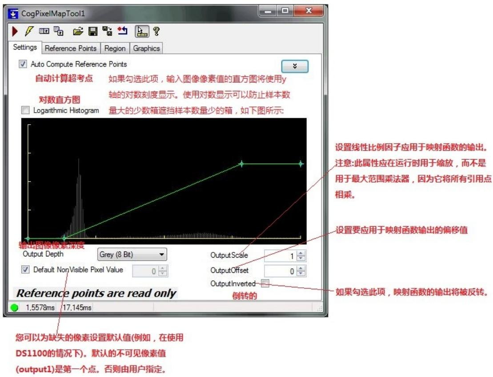
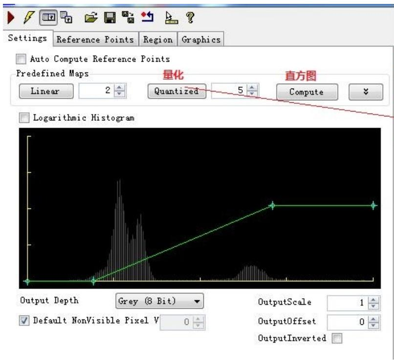
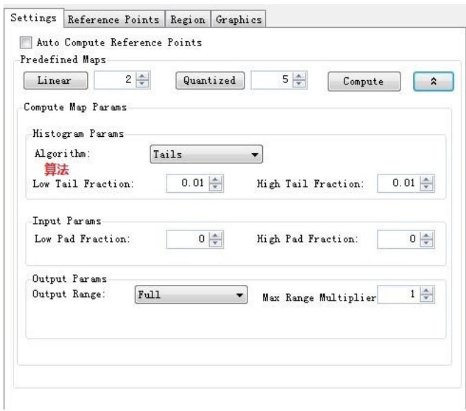
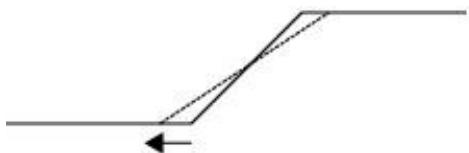
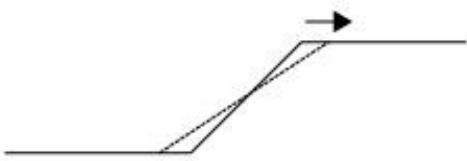
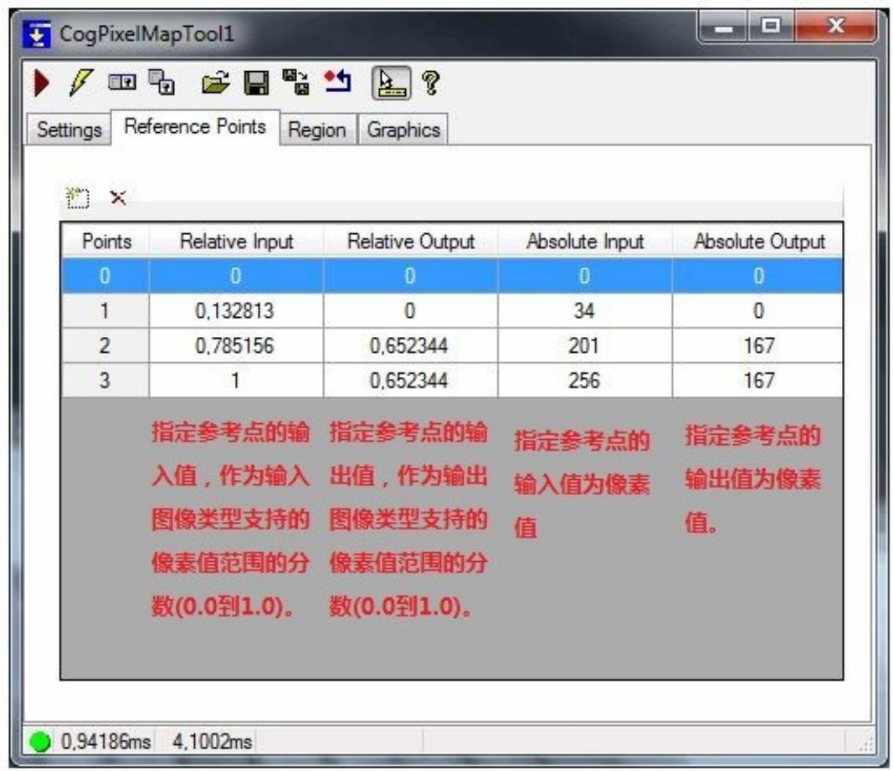

CogPixelMapTool提供了一个图形用户界面，它允许您映射定义输入图像和输出图像之间的像素值映射。

# 1、Settings Tab

您可以使用Settings选项卡中的控件来创建、移动、删除和查看定义此工具像素映射函数的参考点。默认情况下，自动计算参考点将被选中，该工具将自行生成映射。如果要更改映射，请取消选中复选框。

如果未选中“自动计算参考点”，则可以单击并拖动任何参考点图形(一个小叉)来移动参考点。由参考点定义的映射函数用蓝色表示，而由输出标度、偏移量和反转修改的映射函数用绿色表示。该控件强制要求映射函数单调递增(每个后续参考点的x值必须大于或等于前一个点)。

如果自动计算参考点未勾选，则可以使用这些控件通过单击来定义多个参考点。

创建具有指定步骤数的量子化（阶梯）映射函数。

创建的映射不是有用的；这个按钮允许您通过单击创建多个参考点，然后根据需要手动定位这些点。

# Compute Map Parameters

# Algorithm(算法)

指定用于计算将映射到输出范围的输入范围的算法。

MinMax:利用输入图像直方图统计量中的最小值和最大值来填充输出范围。

Tails:利用输入图像直方图统计中的低尾和高尾填充输出范围。

MeanStdDev:使用均值减去标准差的倍数和均值加上标准差的倍数(可能不同)来填充

输出范围。

TypeRange:使用输入类型范围的最小值和最大值(例如 16 位输入图像的 0 和65536)

来填充输出范围。请注意，“适当的”映射，例如，16位范围到8位范围的完整映射是8位的移位(或者，等效为256的除法)，这意味着正确的映射是从65536到256，而不是从 65535 到 255。

# Low tail fraction(底尾部分数)

低尾分数在[0,1]范围内。只有当算法是反面时才使用。低尾分数和高尾分数相加时必须小于等于1。一种性质增加，另一种性质就会减少。

# HighTailFraction(高尾部分数)

高尾分数在[0,1]范围内。只有当算法是反面时才使用。低尾分数和高尾分数相加时必须小于等于1。一种性质增加，另一种性质就会减少。

# LowPadFraction

初始计算的输入范围添加到第一个映射值的初始计算值的部分。这个值通常为负

# HighPadFraction

添加到第二个映射值的初始计算值的初始计算输入范围的百分比。这个值通常是正数

# OutputRange

指定映射中使用的输出范围。

# MaxRangeMultiplier

用于将输入像素转换为输出像素，其中最大像素值被裁剪为图像类型允许的最大值。例如，如果输出图像是 16 位灰度图像，编码为 10，则范围的上限不能大于 1024。当从CogImage16Range 图像映射到 CogImage16Grey 图像时，这个设置特别有用，它允许使用完整的16位范围图像，而不仅仅是图像的一部分。

注意:仅在自动计算参考点被选中时使用。

# Output1Fraction

指定映射中使用的第一个输出像素值。仅当输出范围是特定的相对时才使用。范围值为[0-1]。

# Output2Fraction

指定映射中使用的第二个输出像素值。仅当输出范围是特定的相对时才使用。范围值为[0-1]。

# 2、Reference Points Tab

Reference Points选项卡提供了一个表控件，允许您查看和设置所有引用点的确切值。要添加或删除引用点，请使用表顶部的两个按钮。要修改参考点，单击该值进行修改并输入新值。

注:相对输入和输出值允许您指定参考点作为图像(输入和输出)中像素值范围的一部分。如果输入或输出图像类型改变，绝对(像素值)值将自动调整，以符合您提供的相对值。

注意:控件强制要求映射函数单调递增(每个连续的参考点必须有一个x值大于或等于前一个点)。