# COGNEX

# CHANGE THE

# RULES

# FSE Training

# Content Sharing Introduction

• VS2012 界面讲解  
Machine Support 框架介绍   
Machine Support 的简单调试  
VPP 之间数据流向  
• 3D 相机相关问题讲解

# Universal Framework + Machine Support

# 运行流程

• AssemblyPlus 框架的运行流程如下图所示， Fixture 表示机器部分，其由 SI 控制， Framework 相当于一个视觉服务器，对视觉部分进行处理计算 ( 例如运行 Inspection, 光源配置等），而 Machine Support 则作为 Fixture 和 Framework 的中间桥负责命令的解析和响应，解析 Fixture 传来的指令，然后确定 Framework 中某个 Inspection 的运行，再将处理得到的结果进行打包反馈给 Fixture 。

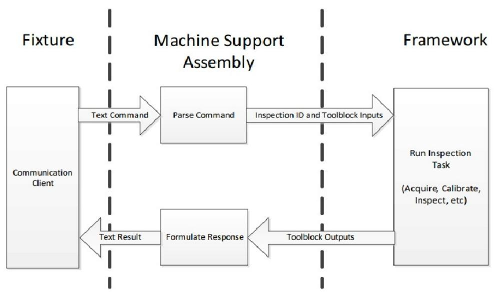

# MachineSupport 作用

<table><tr><td>CognexVisionPro.Comm.xml</td><td>2018-02-08 3:57</td><td>DLL文件</td></tr><tr><td>CognexVisionPro.Vs.TexturedRangel...</td><td>2019-04-13 11:10</td><td>DLL文件</td></tr><tr><td>CognexVPE.Core.dll</td><td>2020-04-07 7:22</td><td>DLL文件</td></tr><tr><td>CognexVPE.ImageGenerator.Control...</td><td>2020-04-07 10:26</td><td>DLL文件</td></tr><tr><td>CognexVPE.InspectPro.CVL.dll</td><td>2020-04-07 7:24</td><td>DLL文件</td></tr><tr><td>Cognex.VSAlignPlusUtilities.dll</td><td>2019-04-13 11:10</td><td>DLL文件</td></tr><tr><td>Cognex.VS.Core.dll</td><td>2020-04-07 7:19</td><td>DLL文件</td></tr><tr><td>Cognex.VS FrameworkCommunicatio...</td><td>2020-09-15 14:31</td><td>DLL文件</td></tr><tr><td>Cognex.VSframeworkSetup.dll</td><td>2020-10-28 20:20</td><td>DLL文件</td></tr><tr><td>Cognex.VS.Interop.dll</td><td>2020-04-07 7:17</td><td>DLL文件</td></tr><tr><td>Cognex.VS.LightController.dll</td><td>2020-09-15 14:31</td><td>DLL文件</td></tr><tr><td>Cognex.VS.MachineSupport.dll</td><td>2021-12-10 16:43</td><td>DLL文件</td></tr><tr><td>Cognex.VS.MachineSupport.pdb</td><td>2021-12-10 16:43</td><td>Program I</td></tr><tr><td>Cognex.VS.ToolBlockUtility.dll</td><td>2020-09-15 14:31</td><td>DLL文件</td></tr><tr><td>Cognex.VS Utility.dll</td><td>2020-09-15 14:31</td><td>DLL文件</td></tr><tr><td>Cognex.VS Utility.xml</td><td>2020-09-15 14:31</td><td>XML文档</td></tr><tr><td>CognexAssemblyPlus.exe</td><td>2020-10-28 20:20</td><td>应用程序</td></tr><tr><td>CommunicationTester.exe</td><td>2018-02-22 6:51</td><td>应用程序</td></tr><tr><td>config.xml</td><td>2021-06-11 20:56</td><td>XML文档</td></tr><tr><td>Configuration_General.ini</td><td>2021-12-10 16:45</td><td>配置设置</td></tr><tr><td>Configuration_NonGeneral.ini</td><td>2021-12-09 19:07</td><td>配置设置</td></tr><tr><td>ICShowCode.ShareTilib.dll</td><td>2019-11-22 11:24</td><td>DLL文件</td></tr></table>

# 运行流程：

 接收并解析指令  
 给指定 Inspection 输入参数赋值  
 运行指定 Inspection  
获取运算结果  
 封装并发送指令

其他功能：定义设备名称、定义 Simulator 、数据保存、数据传递、坐标计算…

# Machine Support 结构

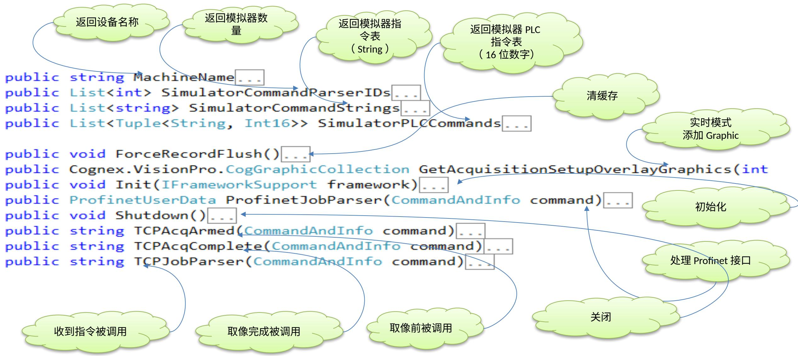

# Machine Support Key function

# Init()

a) Framework Backup （框架备份）  
b) Read Machine support Setting   
c) Framework Custom Menu Setting   
d) Hardware Prepare （硬件准备）

```txt
public void Init() { //allocate resourcee } 
```

# Shutdown()

Shutdown is called once when the framework is closing. Use this function to cleanup anything initialized explicitly in the Init function. Most machines can leave this implementation empty. （当框架关闭时调用Shutdown。使用此函数 可清除在Init函数中显式初始化的任何内容。 大多数机器可以将此实现留空。）

```txt
public void Shutdown()   
{ // If no resources were allocated, there is nothing to clean up } 
```

# Machine Support Key function

} //Define RunJobParameters and add in the List ulong partID $=$ ImageSaveQueue.gOnly.NewPart(CommandData SerialNumber); RunJobParameters rjParams $=$ new RunJobParameters(CommandData.InspectionID, partID); rjParams.Inputs.Add("I_Method", methodID); rjParams.Inputs.Add("InputCommand", command.Command); rjParams.Inputs.Add("ImageID", command.Command.Substring(0,13)+CommandData SerialNumber); vrjParams.Add(rjParams); vCMDatas.Add(CommandData); //DisplayGraphic(CommandData PoseID, CommandData.NozzleID, 1);   
} //RunJob bool success $=$ m_framework.RunJob commanded, LightControlAction.AutoOnAndOff, true, vrjParams.ToArray(); for (int i $= 0$ ;i $<$ vrjParams.Count; i++) { errorCode $=$ (int)vrjParams.ToArray() [i].Outputs["ErrorCode"];

# Machine Support Key function

bool RunJob( CommandAndInfo command, LightControlAction lightControlAction, bool shareLightingSettings, params RunJobParameters[] parameters );

RunJob 是 IFrameworkSupport 接口中重要的方法。 RunJob 同时运行一个或多个检查 job ，使用一组 RunJobParameters 对象来指定要运行的检查、存储输入、和 toolblocks.RunJob 的输出应该总是从IMachineSupport 的主体内部调用 TCPJobParser() 函数。 每次调用 TCPJobParser 只能调用一次。每个 CommandAndInfo 和 RunJobParameters 对象只能用作 RunJob ONCE 的参数。RunJob 的 4 个参数 .

• 第一个是一个 CommandAndInfo 对象， command 。 这不应该被构造 .  
• 第二个是 LightControlAction 。 这几乎总是 LightControlAction.AutoOnAndOff 或LightControlAction.NoAction ，这取决于框架是否应该管理照明。  
• 第三个参数是布尔值， shareLightingSettings 。 RunJob 一次可以运行多个检测工具，每个检测工具可以有自己的光照设置。如果 shareLightingSettings 为 true ，则第一次检查的照明设置将用于所有检查。如果 shareLightingSettings 为 false ，则每次检查都将进行轮流获取图像并使用单独的照明设置。这比共享照明设置慢得多  
• 第四个参数是 RunJobParameters 对象的集合。 每个 RunJobParameters 对象代表一次单独检查的运行。

# Machine Support Key function

用 MessageManager 类向 Log 中增加信息

catch

Failed.");

{ MessageManager.gOnly.Alarm("Image Group }

# DS Camera

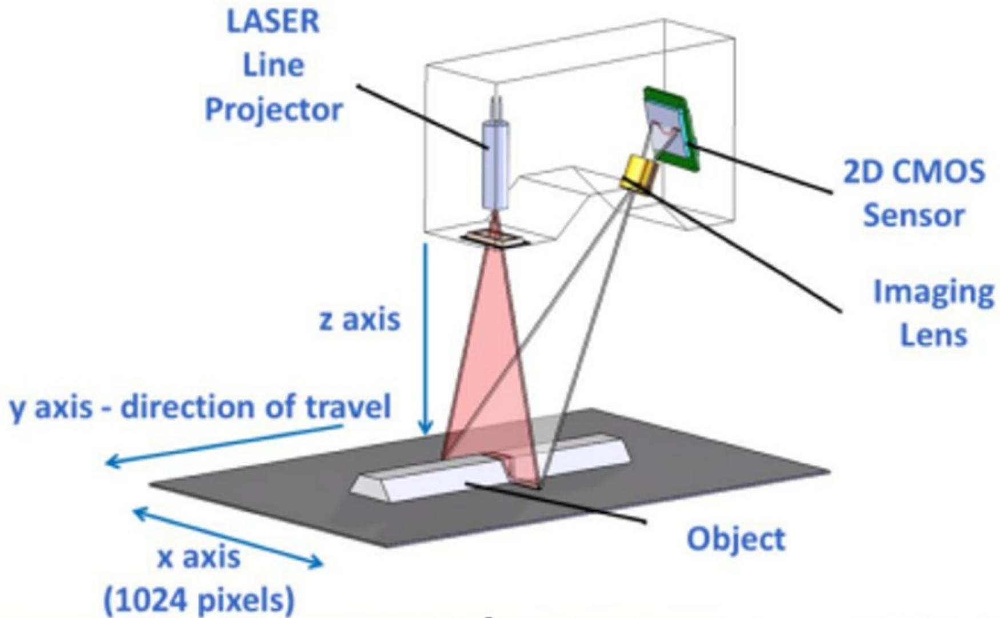

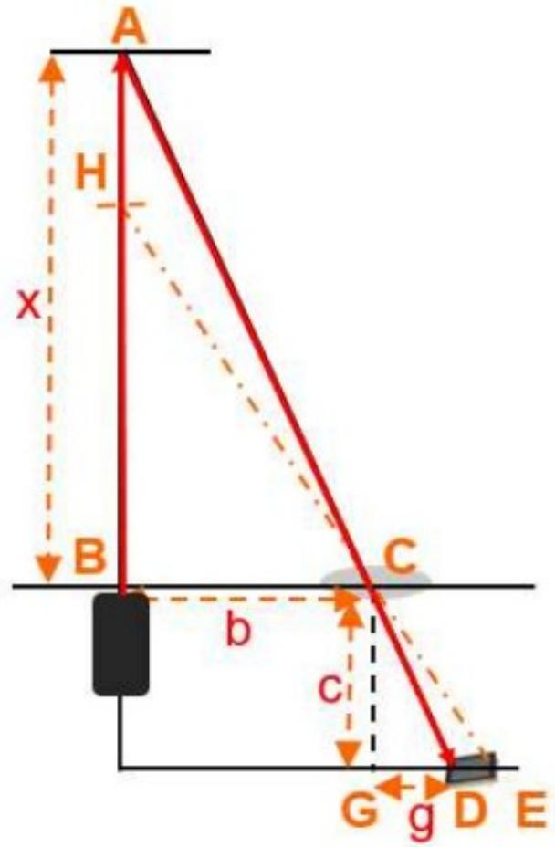

已知：

三角形ABC和CGD，其中

$$
C G = c,
$$

$$
G D = g,
$$

$$
\mathbf {B C} = \mathbf {b},
$$

求AB的长度？

$A B = x \cdot$

$$
\frac {x}{c} = \frac {b}{g} \Rightarrow x = \frac {b * c}{g}
$$

三角测量法

# DS Camera

设置适当的超时·默认（30000ms）

如果启用，则此设置（以ms为单位）应设置为大于以下三个因子的总和：

采集请求和采集开始之间的最大时间(可能是由于使用编码器时启动运动的延退  
扫描零件所需的最长时间（由运动速度和扫描长度控制）；  
扫描完成后完成图像数据传输所需的最长时间。

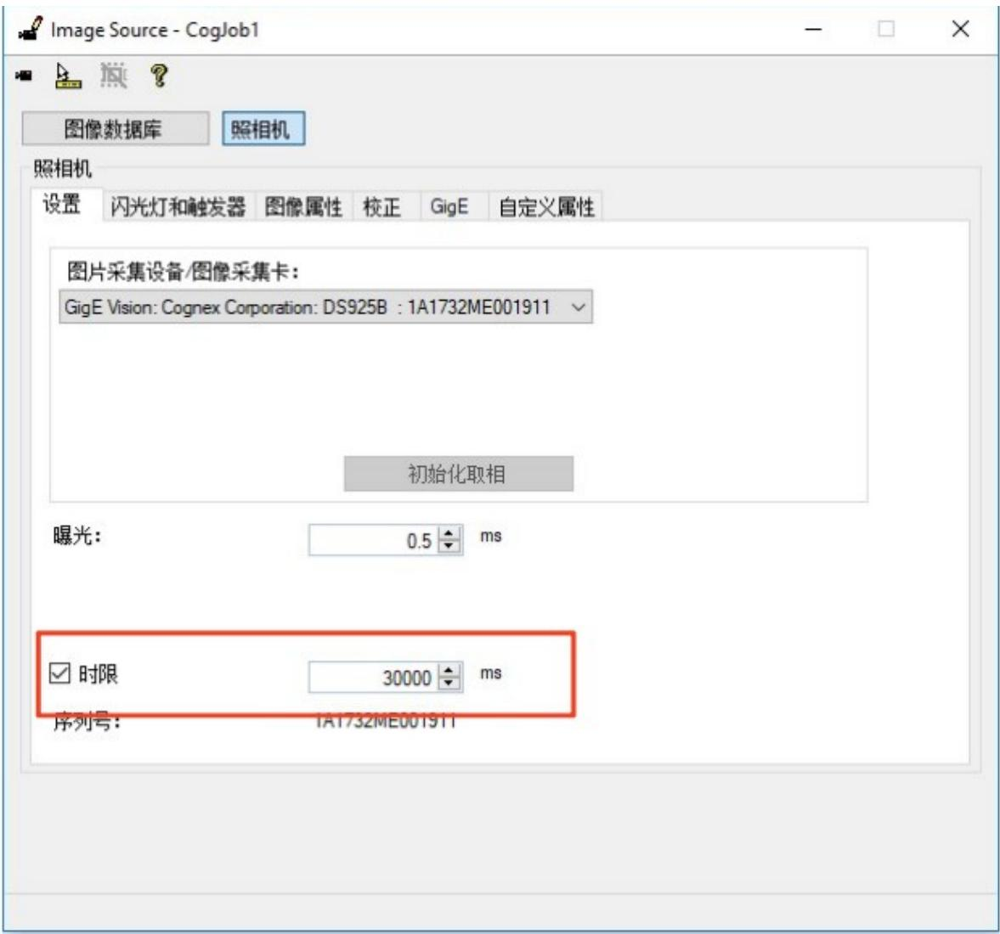

# DS Camera

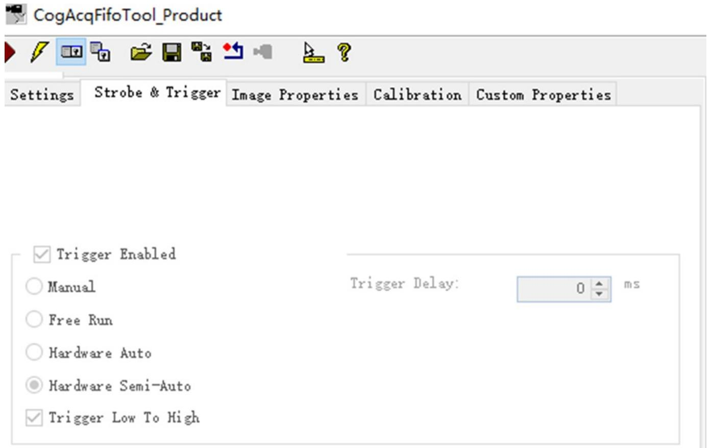

# DS Camera

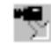

CogAcqFifoTool_Product


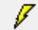

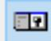

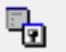


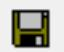

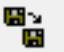


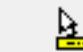

Settings

Strobe & Trigger

Image Properties

Calibration Custom Properties


Output Pixel Format:

# DS Camera

□X-Scale:在X方向的像素分辨率   
□StepsPerLine：采集一个像素需要的脉冲数  
□DistancePerCicle：一个周期内（四个脉冲信号）·平台移动的距离  
□MeasureFiled：相机在Intensity模式下，的一个视野大小，不同的视野对应着不同的采样频率。

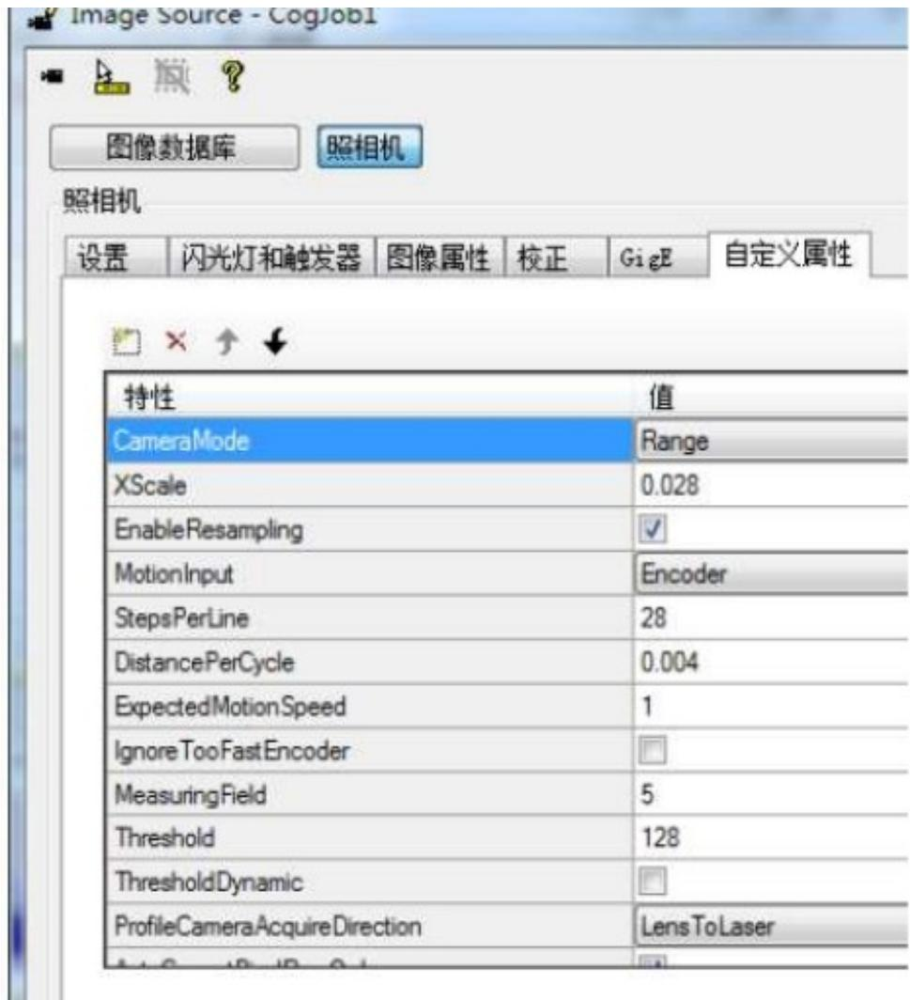

DS910B Series Technical Data   

<table><tr><td>Data</td><td>DS910B</td></tr><tr><td>Measuring Range Z-axis</td><td>8 mm</td></tr><tr><td>Start of Measuring Range</td><td>52.5 mm</td></tr><tr><td>End of Measuring Range</td><td>60.5 mm</td></tr><tr><td>Line Length Midrange (X-axis)</td><td>10 mm</td></tr><tr><td>Linearity1</td><td>± 0.17 % FSO (3 σ)</td></tr><tr><td>Resolution X-axis</td><td>1280 points/profile</td></tr><tr><td>Light Source Laser</td><td>Semiconductor laser, approx. 405 nm, 10° aperture angle, Laser class 2M: laser power 7 mW, reduced 2 mW</td></tr><tr><td>Displays</td><td>1x state / 1x laser on</td></tr><tr><td>Electromagnetic Compatibility (EMC)</td><td>According to: EN 61326-1: 2006-10 DIN EN 55011: 2007-11 (Group 1, Class B) EN 61000-6-2: 2006-03</td></tr></table>

FSO = Full Scale Output | MMR $\Bumpeq$ Midrange

# DS Camera

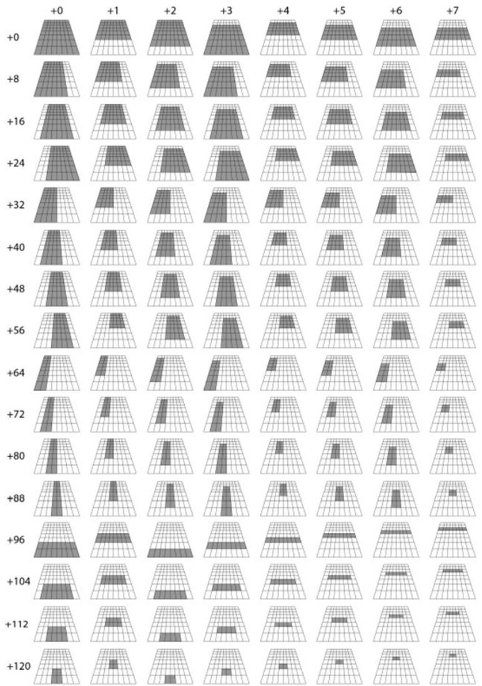

# DS Camera

Maximum Scan Rates for Measuring Fields   

<table><tr><td colspan="9">Maximum Acquiring Rate Depending on the Measuring Field Number</td></tr><tr><td></td><td>+0</td><td>+1</td><td>+2</td><td>+3</td><td>+4</td><td>+5</td><td>+6</td><td>+7</td></tr><tr><td>0</td><td>144Hz</td><td>192Hz</td><td>192Hz</td><td>192Hz</td><td>284Hz</td><td>284Hz</td><td>284Hz</td><td>552Hz</td></tr><tr><td>8</td><td>181Hz</td><td>239Hz</td><td>239Hz</td><td>239Hz</td><td>354Hz</td><td>354Hz</td><td>354Hz</td><td>680Hz</td></tr><tr><td>16</td><td>181Hz</td><td>239Hz</td><td>239Hz</td><td>239Hz</td><td>354Hz</td><td>354Hz</td><td>354Hz</td><td>680Hz</td></tr><tr><td>24</td><td>181Hz</td><td>239Hz</td><td>239Hz</td><td>239Hz</td><td>354Hz</td><td>354Hz</td><td>354Hz</td><td>680Hz</td></tr><tr><td>32</td><td>241Hz</td><td>318Hz</td><td>318Hz</td><td>318Hz</td><td>469Hz</td><td>469Hz</td><td>469Hz</td><td>892Hz</td></tr><tr><td>40</td><td>241Hz</td><td>318Hz</td><td>318Hz</td><td>318Hz</td><td>469Hz</td><td>469Hz</td><td>469Hz</td><td>892Hz</td></tr><tr><td>48</td><td>241Hz</td><td>318Hz</td><td>318Hz</td><td>318Hz</td><td>469Hz</td><td>469Hz</td><td>469Hz</td><td>892Hz</td></tr><tr><td>56</td><td>241Hz</td><td>318Hz</td><td>318Hz</td><td>318Hz</td><td>469Hz</td><td>469Hz</td><td>469Hz</td><td>892Hz</td></tr><tr><td>64</td><td>362Hz</td><td>476Hz</td><td>476Hz</td><td>476Hz</td><td>694Hz</td><td>694Hz</td><td>694Hz</td><td>1200Hz</td></tr><tr><td>72</td><td>362Hz</td><td>476Hz</td><td>476Hz</td><td>476Hz</td><td>694Hz</td><td>694Hz</td><td>694Hz</td><td>1200Hz</td></tr><tr><td>80</td><td>362Hz</td><td>476Hz</td><td>476Hz</td><td>476Hz</td><td>694Hz</td><td>694Hz</td><td>694Hz</td><td>1200Hz</td></tr><tr><td>88</td><td>362Hz</td><td>476Hz</td><td>476Hz</td><td>476Hz</td><td>694Hz</td><td>694Hz</td><td>694Hz</td><td>1200Hz</td></tr><tr><td>96</td><td>552Hz</td><td>552Hz</td><td>1030Hz</td><td>1030Hz</td><td>1030Hz</td><td>1030Hz</td><td>1030Hz</td><td>1030Hz</td></tr><tr><td>104</td><td>680Hz</td><td>680Hz</td><td>1200Hz</td><td>1200Hz</td><td>1200Hz</td><td>1200Hz</td><td>1200Hz</td><td>1200Hz</td></tr><tr><td>112</td><td>892Hz</td><td>892Hz</td><td>1200Hz</td><td>1200Hz</td><td>1200Hz</td><td>1200Hz</td><td>1200Hz</td><td>1200Hz</td></tr><tr><td>120</td><td>1200Hz</td><td>1200Hz</td><td>1200Hz</td><td>1200Hz</td><td>1200Hz</td><td>1200Hz</td><td>1200Hz</td><td>1200Hz</td></tr></table>

# DS Camera

# Recommended Shutter Times

The value ofexposure (inmiliseconds) should be setdepending on the material thatis being scanned.The recommendationsareas follows:

<table><tr><td colspan="2">Recommended shutter times (approximate values)</td></tr><tr><td>Target material</td><td>Shutter Time</td></tr><tr><td>White paper/plastic</td><td>10 - 50μs</td></tr><tr><td>Colored plastic</td><td>50 - 100μs</td></tr><tr><td>Metallic surfaces</td><td>0.1 - 1ms</td></tr><tr><td>Black plastic/rubber</td><td>0.5 - 1ms</td></tr></table>

# DS Camera

DS910B - Measurement Specifications   

<table><tr><td>Specification</td><td>DS910B</td></tr><tr><td>Near Field of View</td><td>9.4 mm</td></tr><tr><td>Far Field of View</td><td>10.7 mm</td></tr><tr><td>Clearance Distance (CD)</td><td>53 mm</td></tr><tr><td>Measurement Range (MR)</td><td>8 mm</td></tr><tr><td>Resolution X</td><td>0.0073 mm - 0.0084 mm</td></tr><tr><td>Resolution Z</td><td>0.001 mm</td></tr></table>

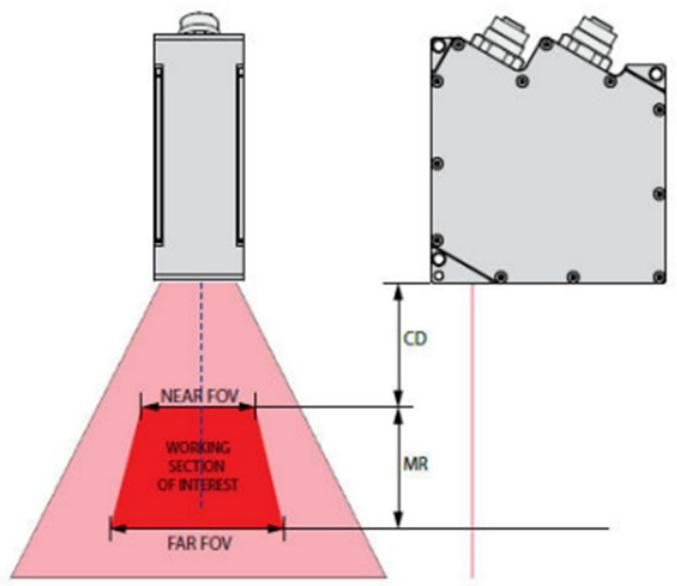

# Work Hard

# Play Hard

# Move Fast!