# 一、Vision Basic

# 1.相机基础知识：

分辨率（Resolution)：相机采集图像的像素点数

像素分辨率（mm/pixel)：每个像素代表的毫米值

快门方式：

全局快门/全域快门(Global Shutter)：让整个感光元器件每行像素全部在同一时间进行曝光，也就是所有像元同时曝光。全局快门曝光时间更短，这样不仅能提升效率，也能根除影像果冻现象。

滚动快门(Rolling Shutter)：感光元件是从第一行、第二行、第三行... 这样按照顺序进行光线感测，一直到整片感光组件从上到下每一行都曝光完成为止。卷帘快门曝光时间更长，另外就是在拍照的时候，假如工业相机有晃动，或者拍摄快速移动的物体，就会看到画面上的果冻现象。

成像质量：受 视野大小、镜头焦距、镜头光圈、光源的类型、光源的安装位置、曝光时间、物距、CCD成像器类型、工作距离、景深等的影响。

# 2.镜头基础知识：

# $\textcircled{1}$ 镜头类型：

广角镜头：焦距小于标准焦距 50mm 的。例如：16mm

景深大，聚焦距离更近

远距照像镜头：焦距大于标准焦距 50mm 的。例如：75mm

景深浅，放大远距离物体

变焦镜头：镜头焦距可调节，焦距有范围，例如：35-70mm

定焦镜头：镜头焦距不可调节。例如： $2 5 \mathsf { m m }$

远心镜头：没有透视形变 即普通镜头导致的近大远小现象

畸变类型：包括径向畸变和切向畸变

径向畸变：桶形畸变，枕形畸变

切向畸变：镜头不完全平行于相机传感器产生的畸变

远心镜头：

优势：超低畸变、高分辨率、 超宽景深

放大倍率：CCD/FOV=倍率

普通镜头和远心镜头：

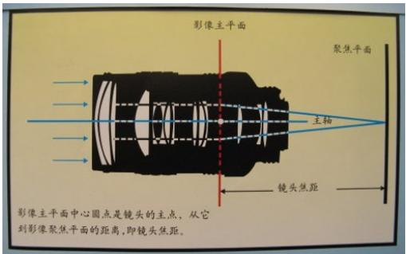

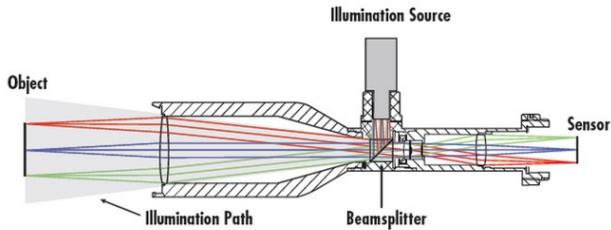

# $\textcircled{2}$ 镜头参数：

光圈：光圈是一个用来控制镜头通光量的装置 ，表示光圈大小我们是用光圈值（F值） ，如F1.4，F2，F2.8

焦距（Focus）：透镜中心到其焦点的距离

景深（DOF）：被测物体清晰成像的最上表面与最下表面之间的距离

光圈和景深的关系：

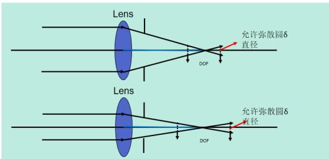  
光圈越大-景深越小，光圈越小-景深越大

# 3.光源：

光源的选择：光源可以做成各种形状，光源的安装角度和安装方向直接决定图象的效果。

改变图像采集亮度的方式有：调整光源亮度、调整光圈值，调整曝光时间，更换大像元相机

偏振光：用于减少眩光或者是镜面反射

低角度光：主要用于边缘有倒角、圆角物体轮廓提取、冲压、浇筑、浮雕图案识别与检测，光滑表面划伤、裂痕检测。

缺点：对于透明物体表面的划痕检测效果不理想效果不理想

高角度光：主要用于表面粗糙程度不同区域的区分、边缘或内部有垂直断差或者比较陡峭（超过 60度）边缘检测或测量。

缺点：对于反光区域相差不大的效果不理想

同轴光：含有 $\cdot$ 度银镜。同轴光源能够凸显物体表面不平整，克服表面反光造成的干扰，主要用于检测物体平整光滑表面的碰伤、划伤、裂纹和异物。

背光：用于轮廓和边缘检测；用于透明物体内不透明物体的检测。

非同轴漫射光应用及光路图：可以避免因弯曲表面导致的打光不均匀

# 彩色光源：

# 相近色和互补色：

打物体颜色的相近色，使物体变亮。

打物体颜色的互补色，使物体变暗。

采用背景色蓝色打光时：蓝色字体变淡，红色字体加深。

# 4.扫码枪介绍

常用扫码枪型号：DM262 、DM302

DM262：电源24V，棕正蓝负

IP 配置：参考相机 Ip 配置，扫码枪端的 IP 用扫码枪软件修改。

扫码枪指示灯：1.电源灯(绿色)2.训练灯(训练绿色/未训练黄色)3.触发指示灯(读上码闪绿色/未读码闪红色)

4. 网线灯(接通为黄色)5.报警灯(报警时红色灯常亮)

备份读码参数：软件导出导入cfg格式配置文件，cdc格式文件

# 5.精度计算

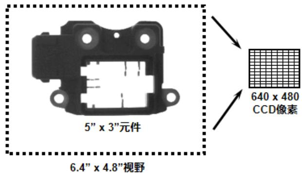  
精度计算

视野为 $\bar { 5 } . 4 \mathsf { m m } ^ { * } 4 . 8 \mathsf { m m }$ 分辨率为 $6 4 0 ^ { * } 4 8 0$

精确度视觉工具 $= \frac { 1 } { 1 0 }$ 像素

视觉精度计算： 单方向视野范围/相机单方向分辨率

相机精度：6.4mm/640像素=0.01mm

测量精度：0.01mm*视觉工具精度=0.01mm*0.1=0.001mm

eg：1.康耐视500w相机拍照，视野为50mm*40mm，所使用的视觉工具精度为¼个像素，求测量精度？（500w相机分辨率为 $2 5 9 2 ^ { * } 1 9 4 4 )$ ）

相机精度:(即像素分辨率) 相机精度=50mm/2592=0.0193mm

测量精度：测量精度 $\cdot$ 相机精度*视觉工具精度=0.0193mm*¼=0.004825mm

# 6.码密度计算

含义：码的每个module(模块)的平均像素值 每个模块占了几个像素

意义：它是判断扫码稳定性的一个重要依据，它不是越大越好也不是越小越好，需要控制在一个合理的范围，

二维码一般建议在5~8，一维码建议在3以上

# 码PMM值计算

1.视野是 $7 8 m m ^ { \star } 5 0 m m$ 中间有个二维码尺寸为 $5 m m ^ { \star } 5 m m$ 二维码是12*12Code

(通俗来讲就是求此二维码每个模块包含几个像素)

用扫码枪DM50X(752*480)的长边计算

$\textcircled{1}$ 先算出视野里每个mm单位所包含的像素个数：  
$7 5 2 / 7 8 \mathsf { m m } = 9 . 6$ 表示每mm有9.6个像素  
$\textcircled{2}$ 再算出每个模块尺寸为多少mm：5/12=0.4166666667mm  
$\textcircled{3}$ 计算码密度：9.6*0.0.4166666667mm $\cdot$

另—种:5mm/78mm*752像素/12=4.017094017094017094017094017094

Fov:60mm*48mm

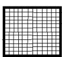  
5mm*5mm

code: 12*12

1200*960

黑色大框是扫码枪或者相机的视野：60mm*48mm，分辨率为1200*960

中间的小框是个二维码尺寸为：5mm*5mm

这个二维码的码值为12*12，也就是说二维码的是有144个模块儿(小格子)组成。

此时计算码密度

1.计算每个像素多长：60mm/1200=0.05mm这是每个小像素点的长宽

2.计算这个二维码长或宽占用了几个像素：5mm/0.05mm=100

3.二维码长边有12个模块儿共计占用100个像素：100/12=8.333

# 二、厂区相关操作

1. 了解各 Inspection 的功能、掌握 Vpp 的调试  
2. 标定流程、结果及分析

$\cdot$ 确认相机的焦距，视野是否调整 OK，镜头及相机是否松动；  
$\textcircled{2}$ 运动机构是否调整 OK；  
$\cdot$ 软件和视觉软件是否正常，通信是否正常；  
$\textcircled{4}$ 标定所使用的工具是否准备 OK，标定工具是否破损，翘曲；  
$\cdot$ Configuration中棋盘格的尺寸与实际是否匹配；  
$\textcircled{6}$ 机器人吸取或放下棋盘格时，棋盘格是否有滑动现象或者吸不起来；  
$\cdot$ 检查标定误差是否在正常范围；

# 3. 标定的异常分析及注意事项

标定误差大：检查机构走位是否准确，旋转角度是否正确并且准确，标定片尺寸、图片清晰度、标定片标定过程中有没有滑动、标定片模糊、曝光是否合适

标定失败：通讯异常、拍照失败、软件损坏、旋转角度错误、旋转顺序错、

# 4.视觉异常分析处理

$\textcircled{1}$ 相机无法拍照或者连接失败：

确认相机网线是否连接正确

如果 VisionPro 可用，打开 Cognex GigE Vision Configuration，查看不拍照的相机是否在左侧的相机列表中。

确认机构是否发送了正确的触发信号。

可能由于主机卡顿，软件卡顿或BUG引起，将计算机关机，约十秒钟后，重新开启计算机

检查相机是否损坏，如坏的话更换相机。

相机配置参数设置不正确，重新查看并配置好正确参数

权限位丢失，检查8704E板卡权限

磁盘已满或者图片删除设置参数不合理，重新设置图片保存参数

# $\textcircled{2}$ 相机蓝屏：

主机 IP 或者相机 IP 有设置错误

巨帧数据包改为 9014、防火墙关闭、ebus 勾选

网口损坏 更换别的网口硬件损坏需更换硬件（网线、相机、图像采集卡）

# $\textcircled{3}$ PMAlign：提高工具运行速度：

算法由 PatMax 改为 Patquick 会加快运行速度

搜索区域越小搜索速度越快 (宽)x(高)x(角度范围)x(缩放范围)

提高接受阈值搜索变快

减小搜素结果数量执行时间稍变快

精细颗粒度越高，时间越短

粗糙颗粒度越高，时间越短

考虑极性稍稍加快速度

提高对比度以便执行更快

# ④PMAlign

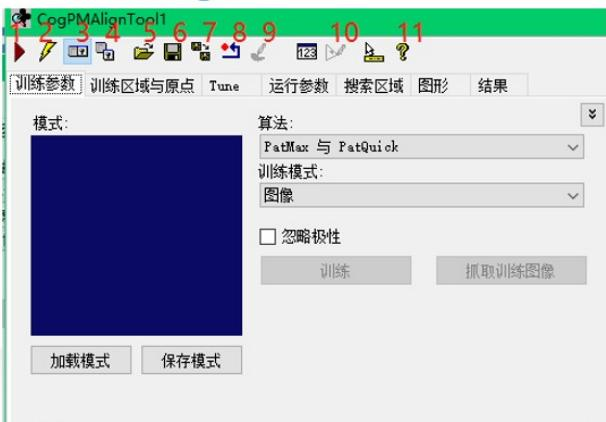  
PMAlign

图上按钮功能分别表示：

1.运行  
2.电子模式  
3.本地显示  
4.浮动显示   
5.打开   
6.保存   
7.另存   
8.复位  
9.图像掩膜编辑器  
10.建模器  
11.帮助

# ⑤Histogram

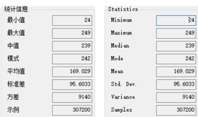

Minimum：最小值灰度最大值 值灰度最大值  
Maximum：最大值灰度最小值 值灰度最小值  
Median:中值值比例刚过50%   
Mode:模式 灰度值占比最  
Mean：平均值灰度平均值 灰度平均值  
Std.Dey.:标准差，灰度标准差 灰度标准差  
Variance:方差 灰度方差 灰度方差   
Samples:示例 区域内总像素数 区域内总像素数

比例刚过50%对应的灰度值   
灰度值占比最高的像毒的灰度值

# 三、VisionPro Tools 应用

# 1. Image Source：

采图方式：加载文件、加载文件夹、相机取像

支持的图像格式：.idb 、.cdb、.bmp、.tif、.jpg、.png

# 2.CogAcqFifo：配置相机取像

$\textcircled{1}$ 选择相机型号 $\cdot$ 选择相机格式(Mono、Mono12、Mono12Packed、YUV422Packed) $\textcircled{3}$ 修改曝光、对比度、亮度、超时期(这几项一般都为默认) $\textcircled{4}$ 触发方式：Manual(手动触发) 、Free Run(自由触发)、Hardware Auto(硬件触发-飞拍项目)、Hardware Semi-Auto(硬件半自动触发)

Hardware Auto：根据电压变化，需设置极性，由低到高或者由高到低去触发，此极性需和光源触发极性一致。

Hardware Semi-Auto：需要机构和视觉各自发送一个触发信号，先硬触发信号，再相机触发信号，

# 3.CogImageFileTool：从 idb 格式文件中读取图片(读取模式) 或者 添加图片(写入模式)

# 操作步骤：

读取模式：不需要输入图像，在工具中选择"打开ImageFile"按钮选择idb格式图片文件点击运行预览，并可以当做图像源给别的工具提供图像。

# 写入模式：

$\textcircled{1}$ 连接图像后 在工具中选择"打开ImageFile"按钮，点开录制模式后点击工具外层的运行，会将外部连接的图像录制进打开的idb格式的文件中  
$\textcircled{2}$ 连接图像后 在工具中选择"创建新的ImageFile"按钮 在需要的路径里创建一个新的idb格式文件，点击工具外层的运行，开始在新创建的idb格式文件中添加图片

# 4.1.CogCalibCheckerboardTool：通过创建一个标定对象来关联图像中的空间和物理空间

作用：校正图形畸变 建立实际坐标与图像坐标的对应关系 直白点： 建立图像和机构的关联关系用棋盘格标定：

棋盘格标定是使用一个棋盘格来计算像素和真实单位之间的转换

可以计算线性或者非线性转换： 非线性转换用于说明光学 和/或 透视扭曲的情况

图像扭曲的产生及分类：

产生：是由于透镜制造精度以及组装工艺的偏差从而导致原始图像失真的现象

分类：线性扭曲：纵向失真(横向压缩) 横向失真(纵向压缩)

非线性扭曲：桶形畸变 枕形畸变

标定流程图：采集表定图像 棋盘格物理尺寸 标定工具计算标定结果 (仅限非线性模式)

棋盘格标定原点获取：校准板有一个原点(比如两个交叉矩形的右下交点)

若没有：没有二维码的 原点则是图像左上角

有二维码的原点则是二维码

# 操作流程：

$\textcircled{1}$ 获取标定片图像：保证曝光合适 焦距清楚 标定片尽量布满视野 标定片不要翘曲  
$\textcircled{2}$ 添加标定工具：CogCalibCheckerBoardTool 工具 连接图像

$\textcircled{3}$ 设置线性或非线性模式 输入标定片 XY 尺寸 $( 0 . 2 5 0 . 5 1 2 \mathrm { { m m } ) }$ 点抓取校正图像 按钮  
$\textcircled{4}$ 修改校正原点(可选项)：可以选择修改校准空间的原点，设置原点空间，X轴旋转，X轴旋转空间，交换左右手使用习惯  
$\textcircled{5}$ 计算标定结果： 点击计算校正按钮，查看非扭曲的校正图像  
$\textcircled{6}$ 查看标定结果：查看磁块各个角的结果 未校正的XY和原始的已校正的XY坐标的差异

查看计算的非线性方程的系数：

纵横比：校正前后XY方向的纵横比 越接近1越好

RMS误差：越接近0越好 这个是像素坐标和标定片坐标差值的方

CheckerBoard 标定的工作原理：采集图像中的顶点-黑白相间的交点

原始校正空间中的顶点，基于所提供的的磁块尺寸信息 比较两组点

将标定结果输出：表示两个图像中一旦计算出转换，只要将校准的输出图像传递给检验工具的输入图像

校正的图像将被传递给该工具

# 4.2.CogCalibNPointToNPointTool：不能校正非线性畸变

操作步骤：连接图像 输入三组像素坐标和三组物理坐标 抓取计算校正

结果：XY 平移 缩放 纵横比 旋转 倾斜 RMS 误差(等同 checkboard)

5.CogCreation：包含创造圆、创造椭圆、创造文本、创造点平分线、创造平行线、创造垂线、创造线、创造线段平分线、创造线段

PS：工具名按照 visionPro 工具集工具顺序排列

操作步骤：连接图像，连接工具需要的XY坐标(起点 终点 圆心)、线段、线、半径、角度等信息给工具后点击运行查看结果

# 6.CogPMAlignTool：图案位置搜索工具 可在图像中找到你训练的特征所在的位置

等信息

基于边缘特征的模板而不是基于像素的模板匹配，比像素格栅表现更快捷准确支持旋转和缩放

三种主要算法：PatMax（精度最高）, PatQuick（速度最快）, PatFlex（细节最佳）

建立模版的三大要素：位置、尺寸、角度

在匹配特征过程中:黄色表示粗糙特征，绿色表示精细特征

在使用模板工具进行模板建立的时候要注意遵循的三项原则 ：特征唯一、对比度明显、形状轮廓明显。

# 操作步骤：

$\cdot$ 输入图像 $\textcircled{2}$ 点击抓取图像，选择训练模式(建模掩膜)，选择合适的算法(patmax patquick)  
$\textcircled{3}$ 切换到当前训练图像，调整训练区域位置及形状，调整训练中心原点

$\textcircled{4}$ 在运行参数选择合适的查找概数(结果数)、接受阈值(允许结果的最低相似度)、是否考虑杂斑、角度及尺寸的缩放  
$\cdot$ 点击训练，运行查看结果

掩膜：分为将不需要的特征掩盖掉，或者将整幅图像掩掉，将需要的特征露出来。

建模：可以自动提取需要的特征或者手动添加具体的特征，需要设置极性 。

# 7.1.Caliper()：能够辨别图像中的边线和边线对子 报告边线对子中的边线位置和边线之间的距离

工作极性方法是： 由暗到明 ，由明到暗 ，任意极性 。

两个工作模式：单个边缘、边缘对

Caliper 工具中： 代表卡尺的 搜索 方向 代表卡尺的 _投影 方向，在抓边过

程中， 投影 方向要与查找的边缘平行。

操作步骤： $\cdot$ 连接图像 $\textcircled{2}$ 定义目标区域(扫描方向与查找方向垂直，投影方向与查找方向平行)$\cdot$ 设置基本参数 选择建立计分标准 测试评价结果其中实心箭头是搜索方向 空心箭头是投影方向

参数设置：边缘模式 极性 对比度阈值 过滤一半像素(设置为过渡像素个数的一半) 最大结果数 边缘对宽度(边缘对模式才有 会影响得分)

输出结果：分数 edge0(结果数的索引) 位置(抓的结果离卡尺中心的距离) xY 计分函数 对比度应用：工具测量元件宽度 测量元件之间的距离

7.2.Find/Fitline：需掌握包含抓圆、抓拐角点、抓椭圆、抓边、拟合圆、拟合椭圆、拟合线工具。

$\textcircled{1}$ 拟合工具操作步骤：连接图像后输入需要的若干组坐标(两点拟合线、三点拟合圆、五点拟合椭圆)  
$\textcircled{2}$ CogFindLineTool：

# 使用和常见参数介绍：

是在图像指定区域运行一系列 Caliper 工具以定位多个边缘点，然后运行

底层的 FitLine 工具将他们拟合成直线。相当于 Caliper 工具+FitLine 工具

要求输入图像

# 基本参数：

卡尺数量：需要找的点的数量

搜索长度：每个搜索卡尺的长度

投影长度：每个搜索卡尺的宽度

搜索方向：每个搜索卡尺从一端到另一端的方向

忽略点数：忽略找到的卡尺数量

极性设置: 由明到暗由暗到明 任何极性

对比度阈值：边缘点所需的最小对比度

过滤一半像素：指定过滤器的半宽

③CogFindCircleTool：

使用和常见参数介绍：比起findline 多出半径限制和角度范围

半径限制：限制搜索圆的半径

角度范围：决定圆的角度

8.CreationTool：创造工具，创造线段、线、平行线、垂线、圆等。

连接图像、连接需要的点、线、角度、长度等。或者打开工具自定义点位置，角度，角度大小等。

9. Measurement：测量工具包含求角度和距离

角度：线线角度、点点角度、

操作步骤： $\textcircled{1}$ 连接图像 $\textcircled{2}$ 输入工具需要的点和角度参数 $\textcircled{3}$ 点击运行查看结果

求距离(最短距离)：圆到圆的距离、线到圆的距离、线到椭圆的距离、点到圆的距离、点到椭圆的距离、点到线的距离、点到点的距离、点到线段的距离、线段到圆的距离、线段到椭圆的距离、线段到线的距离、线段到线段之间的距离

操作步骤： $\cdot$ 连接图像 $\cdot$ 输入工具需要的点、线段、线、圆、椭圆等参数 $\cdot$ 点击运行查看结果

# 10.CogResultsAnalysisTool&DataAnalysis：

结果分析工具可提供一组表达式，

将让工具组在最近运行时间以提供通过警告级别 拒绝级别的结果 表达式中包含各种运算符(加减乘除等)

操作步骤：添加工具后打开工具点击"添加新值输入"后可在外部连接值进来

点击 "添加表达式"可对已经输入进来的值进行运算 并对结果进行判断

DataAnalysis：输入需要判定的值，根据需求勾选拒绝、警告的上限、下限。勾选后设定阈值。不符合要求时会提示得到拒绝的结果

11.CogHistogramTool：灰度直方图工具：用于计算图像中像素的基本统计度量，例如平均灰度值 灰度值中值，标准差 方差等

操作步骤：输入图像 框选需要检测灰度的区域 点击运行查看结果

minimum：最小值 Maximum：最大值Mode：数量最多对应的灰阶值

Mean：灰度均值，即算数平均值 Std.Dev：平均方差 Variance：方差

Samples：图像中 0-255 灰阶像素数量总和

Median：灰度值中值，即累计%首次超过 $\cdot$ 对应的灰阶值

Data：如 8 位图像，0-255 灰阶数据统计表格，GeryLevel 灰阶 Count 对应灰阶像素个数 Cumulative%累计%

12.CogBlobTool：求面积 求个数 求质心坐标 XY

应用场景：对象在尺寸形状方向上有很大差异 在背景中没有明显灰度阴影的对象 对象没有重叠或者连接

不推荐应用场景：低对比度 在两种灰阶范围内不能突出主要特征需要匹配模板

操作步骤： $\cdot$ 连接输入图像 $\cdot$ 选择极性若需要可以选择模式(硬阈值软阈值等并设置相关阈值等参数)

$\cdot$ 调整需要检测的区域 $\textcircled{4}$ 运行查看结果 $\cdot$ 根据实际情况在“测得尺寸”界面筛选出需要保留的

斑点

# 一、上机操作题。 （100 分）

1、如下图，用文件夹中图片dot.idb操作如下试题。

$\textcircled{1}$ 求如下图片中黑色斑点的个数并添加到输出端。（25 分）  
$\textcircled{2}$ 求圆 1 和圆 6 两个斑点的中心距离并添加到输出端。(25 分）

做题步骤： $\cdot$ 多张图像，需要跟随，用左侧三个圆，加上右侧中间圆做模板(这四个圆是每幅图像

共有的特征，可以用掩膜掩去右上角和右下角的圆)。

$\cdot$ 做第一问，斑点工具选择正确极性黑底白点。将count终端输出  
$\cdot$ 两个抓圆工具得来圆1 6的中心，然后用点点测距工具测量圆心1到圆心6的距离并把

Distance 终端输出。

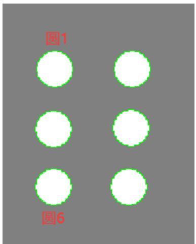

# 2、如下图，用文件夹中图片 bracket_mask.bmp 操作如下试题

$\textcircled{1}$ 求出如下图 P1 和 P2 点的连线，并求出 P1 和 P2 连线中点的坐标，并添加到输出端。 （20  
分）ps：线段才有中点)  
$\textcircled{2}$ 求下图区域 1 和区域 2 的中心点，通过两个中心点创造一条线段。（30）

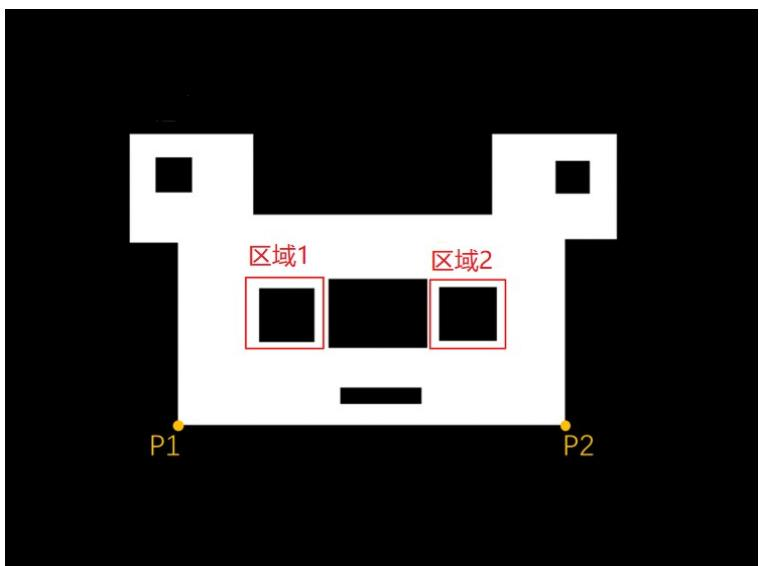

做题步骤：这张图是bmp单张图像，所以可以不用模板 $^ +$ 定位工具

$\cdot$ 和 P2 点可以用三个 findline 抓出三条直线，然后用 intersection 交点工具求出两个交点。  
$\cdot$ 求区域1和区域2的中心（求矩形四条边（findline），四个交点intersection工具，两个对角线 fitline，求中心 intersection 工具）

将两个中心点链接给创造线段工具 CogCreateSegmentTool1 。

# 3、使用 Blob.idb 文件，做出如下实操试题，并保存为 Job 格式。

$\textcircled{1}$ 求如图 Blob 的面积，并用终端输出。（15 分）

$\textcircled{2}$ 求 P 点的坐标，并用终端输出。（15 分）

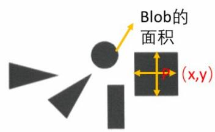

做题步骤： $\cdot$ 加载图片，多张图 用模板工具黑色方块做模板（两张图共有并且一样的特征是方块。）和定位工具。

$\cdot$ 斑点工具，选择极性，筛选面积得到黑色斑点。 用整幅图像筛选就行。  
$\textcircled{3}$ 求中心。参考题目 2 的做题步骤 2。

# 4.、Vision Tools 上机操作题。 （30 分）

1,使用加载的图片文件，完成如下操作题。(作业完成后保存为 Job 格式,命名方式为自己的姓名.)

$\textcircled{1}$ 求出两个零件主体中心点 P 和 Q 点的坐标，并使用终端进行输出。（15 分）  
$\textcircled{2}$ 求 Q 点到 Z 点的距离，并使用终端进行输出。（15 分）

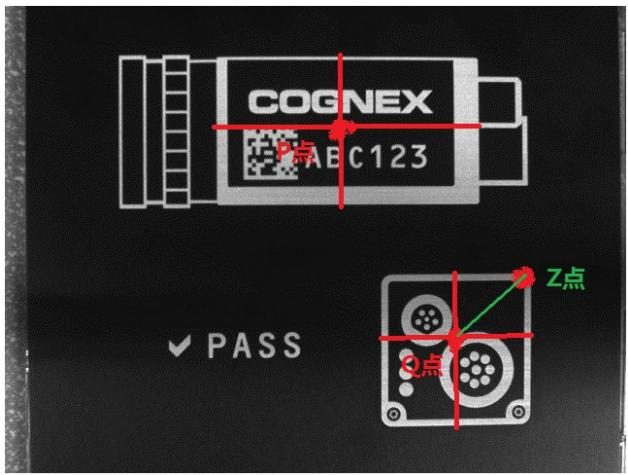

做题步骤： $\cdot$ 分别求出PQ的中心坐标，两个求中心的步骤得来两个中心就行。记得终端输出 P

和Q点的XY坐标。

②Q中心有了，用intersection工具求出右下图案的右上角的交点Z，

用点点测距工具测得点Q到Z的距离。输出终端

# 5.机试试题（100 分）：

（作业保存为 Quickbuild 格式，命名方式为：姓名 $+$ 身份证号。每人作业只收集一份 Quickbuild。）

# 1. 查找 image1 中

$\textcircled{1}$ 找 line1、line2 和两线的交点 B。（10 分）  
$\textcircled{2}$ 使用模板匹配工具找到凹槽最底点 A。（10 分）  
$\textcircled{3}$ 在 A 点做一条和 line2 平行的线，并得到和 line1 的交点 C。（20 分）  
$\textcircled{4}$ 以 A 为原点，AC 为半径做一个圆。（20 分）

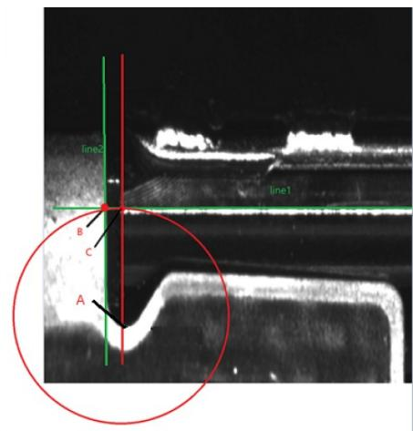

做题步骤： $\cdot$ 单张图 不需要模板。 Findline 工具抓出来 Line1 Line2，并用 intersection 交点工具求得两个直线的交点B。  
$\cdot$ 可以用模板工具将训练中心手动拖动到角点的最低点。

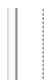

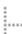

Results.Item[0].GetPose(). TranslationX   
Results.Item[0].GetPose(). TranslationY

模板工具的这两个终端为A点坐标

$\textcircled{3}$ 过点 A 创造一条平行于 line2 的平行线 CogCreateLineParallelTool， 用 intersection 交点工具求line1 和创造的平行线的交点C  
$\cdot$ 先用点点测距工具，求得点AC之间的距离，用创造圆工具以点A为圆心，以AC距离为半径做圆 CreateCircle。

# 6.、Vision Tools 上机操作题。 （30 分）

1、使用加载图片文件，做出如下实操试题。

$\textcircled{1}$ 如下图所示：求托盘的中心点坐标。  
$\textcircled{2}$ 求托盘上的 Mark 点到托盘的 2 个边缘的距离 d1，d2。

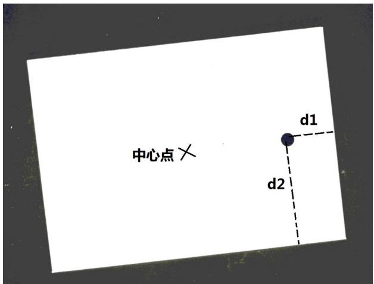

做题步骤： $\textcircled{1}$ 做模板选用斑点加一个矩形拐角，或者一个斑点加一条直线做模板，先检查每个图模板没问题。

$\cdot$ 求中心，  
$\cdot$ 用斑点工具得到斑点的质心 XY或者抓圆工具的圆心 XY 并用点到直线测距工具求得两个距离D1D2

# 7.判断有无脏污

二、请用noisydiscs图片结合Histogram和ResultsAnalysis工具判断圆内有无脏污。

做题步骤： $\cdot$ 多张图但是位置关系没有发生变化，可用模板也可不用模板工具。

$\cdot$ 用Histogram工具测量图片中间白色区域的灰度信息。  
$\cdot$ 添加 ResultAnalysis，将 Histogram 工具的灰度平均值或者是标准差值输出给 ResultAnalysis

工具来判断。

$\cdot$ ResultAnalysis 工具添加表达式，

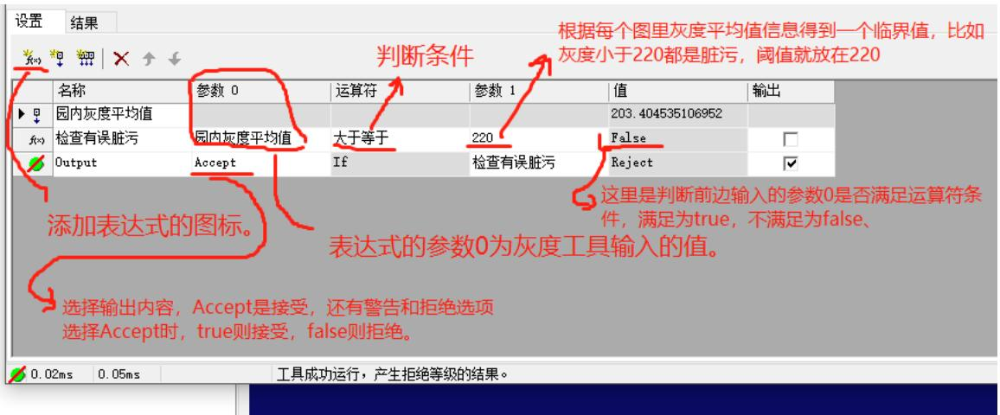

# 一、 掩膜

1. 抓取图像  
2. 调整训练图像和训练区域(只需要框中掩膜露出来的特征就行)

3. 点开图像掩模编辑器

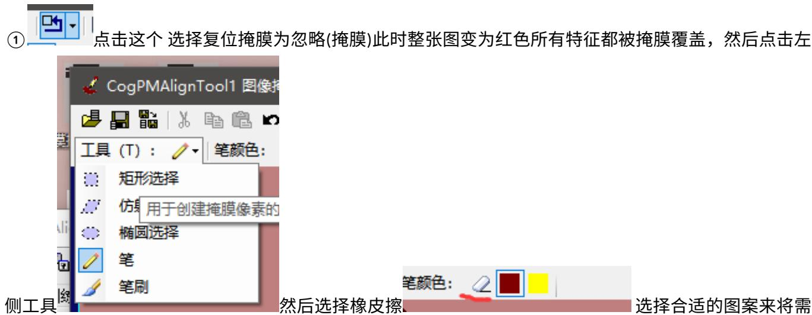

要的特征给擦除出来。

$\textcircled{2}$ 另外一种是直接选用工具选择合适的图案来将不需要的地方给掩盖掉。

4. 点击应用，点确定退出掩膜编辑器  
5. 调整训练区域，接着把模板做完

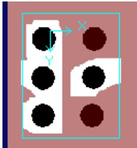

# 二、 建模

1. 抓取训练图像  
2. 将训练模式由“图像”切换为“带图像的形状模型”，在训练区域与原点界面将区域模式的“像素配对限定！框调整掩膜”修改为“像素配对限定框”，此时建模图标亮起 。  
3. 点开建模编辑器： $\textcircled{1}$ 窗口左侧的一些形状可以添加自己需要的特征，线段、圆、多边形等。然后需要双击添忽略极性加的特征设置正确的极性(当忽略极性时，这个极性可以不选择) 。

提取形状 提取形状

$\textcircled{2}$ 也可以选择提取形状 ，在形状提取弹窗内，设定合适的对比度阈值还有周长，即可以自

动提取图案中符合这两个参数的特征，并且自动选好特征的极性。

4.退出建模编辑器，调整训练区域将添加的特征框中。接着把模板做完。

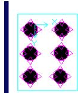

# 四、Dataman

# 1. IP 设定

参考相机 IP 配置原则，eg：网口 IP：192.168.123.123，扫码枪 IP：192.168.123.124. 扫码枪 IP 需在软件里设置。

# 2.打光方式介绍

DM262扫码枪有四个光源，两个普通光源，两个高亮光源，可以不开光源也可以四个光源自由搭配使用，通过训练(调谐)按钮设置自动调节光源，或者是在扫码枪缩略图位置手动开启关闭扫码枪的光源。

# 3.数据格式、读码类型介绍

Symbology Settings(码类型设置)：

General：选择勾选需要解的码的类型

Multicode Settings(多码)： Number of codes 设置允许读取到的码的数量 适用于一幅图里有多个码

allow Partial Results：勾选时可以将解出来的每一个码都输出

# 4.触发模式的介绍(Singal,Burst,Continue 等模式的使用场景)

Singal：拍摄单张图片进行解码，每个setup(通道)会拍一张，可以设置单个setup的超时时间

Burst：拍摄一组图片解码，并在首次成功解码时停止解码，我们可以设定每组图片拍摄数量，还有每次拍照的时间间隔，每次拍照都可以设定一个超时时间

Continue：在触发信号结束之前连续拍照，可以设定每次拍照时间间隔

# 5.PPM值的介绍

含义：码的每个module(模块)的平均像素值 每个模块占了几个像素

意义：它是判断扫码稳定性的一个重要依据，它不是越大越好也不是越小越好，需要控制在一个合理的范围，二维码一般建议在5~8，一维码建议在3以上

# 6. DataMatrix 码的介绍(Verify 相关标准)

DataMatrix的组成：静区、L型寻边区、模块或单元、计时图案、数据区

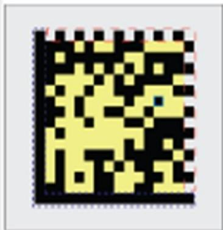

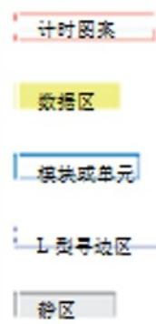

激光镭雕 喷码等方式出来的 DataMatrix 码质量不一，需要专门的仪器检测

Verifier：等级测试仪

等级测试仪是根据ISO15415或AIM DPM等标准来制定的，达到标准就说明这个码具有可读性的，达不到标准就是可能存在读取失败的风险

常见低等级码：L边损坏，对比度不佳，模块化不佳，模块偏离，条码损坏，条码变形eg：喷码机 喷的码需要测定码的质量等级，一般ABCD中 A和B等级为合格