# COGNEX 机器视觉概述

# 目录

机器视觉概念  
机器视觉的四大应用  
视觉技术典型的应用行业  
COGNEX完整的涵盖机器视觉范围   
相机的发展历史

# 机器视觉概念

采用成像技术（通常使用相机）获取被测目标的图像，再经过快速图像处理与图形识别算法，从摄取图像中获取目标的尺寸、方位、光谱、结构、缺陷等信息，从而可以执行产品检验、分类与分组，装配线上的机械手运动引导、零部件的识别与定位，生产过程中质量监控与过程控制反馈等等任务。

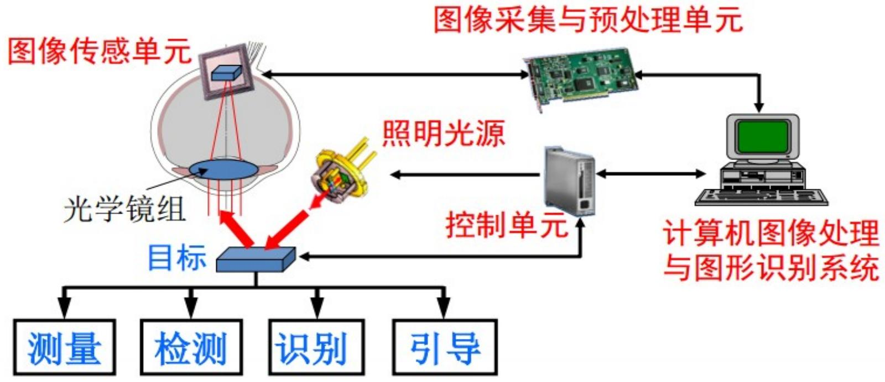

# 机器视觉的四大应用

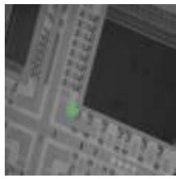

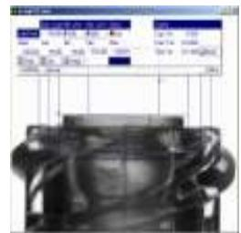

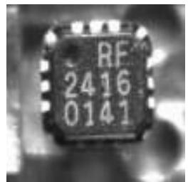

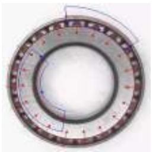

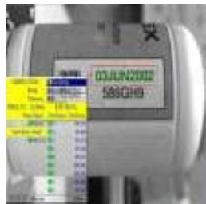

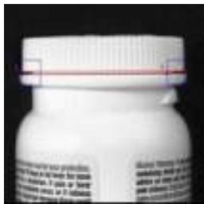

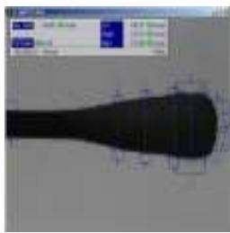

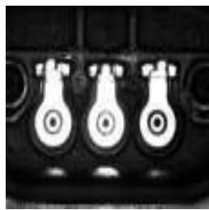

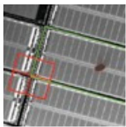

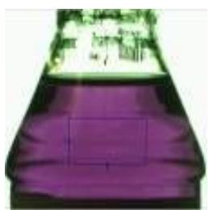

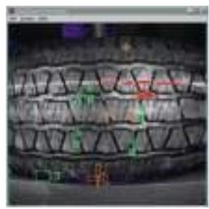

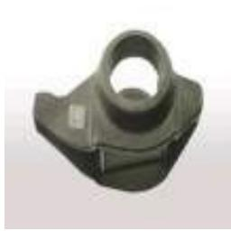

# 引导 Guide

• 实现生产自动化  
• 提供灵活性  
• 提高质量和产量

# 检验 Inspect

• $100 \%$ 检验

– 完整性

–位置的正确性

– 质量

– 流程控制

# 测量 Gauge

• 精确、快速、非接触式测量

# 识别 Identify

• 读取代码、字符或通过色彩、形状或装配识别  
• 控制物料流程、实现可追溯性、收集重要数据

# 1 、视觉引导系统的构成 Guidance

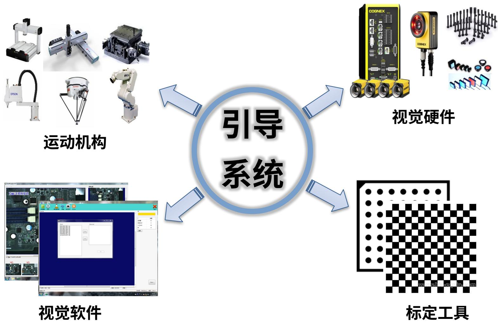

# 视觉引导系统的构成 Guidance

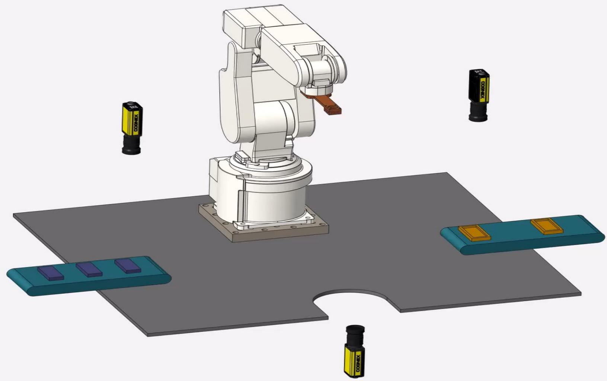

# 视觉引导系统的构成 Guidance

#

# Vision Guided Robotics (VGR)

Pick-and-Place   
-提供x,Y,0   
-2D&3D   
的柔韧性

# ·定位和放置

# Alignment&Placement

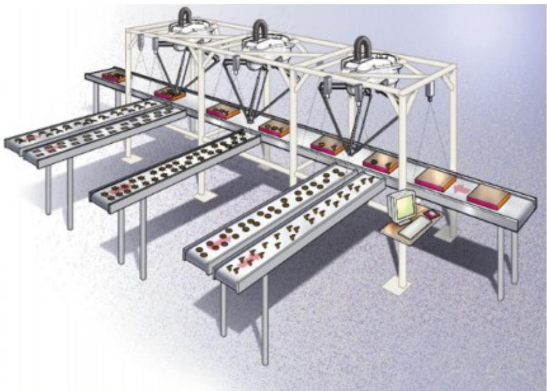

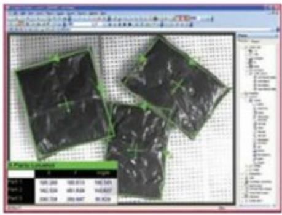

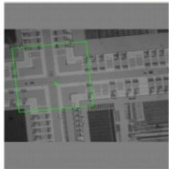

# 组装和质量检测 Inspection

·有/无_Presence/absence   
·检测不合格品_Detectingbad products   
·计数_Counting products   
·表面缺陷_Surface Inspection

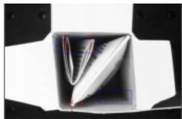

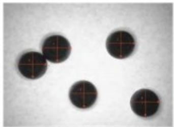

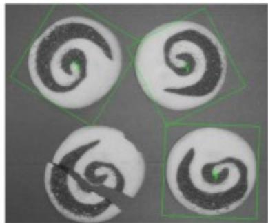

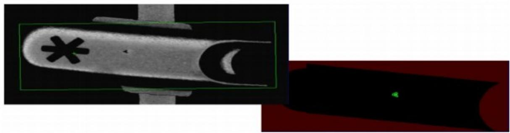

# 尺寸测量类应用 Gauging

精确的尺寸   
自动测量及数据记录  
确保严格的公差   
直径、间隙、套管、螺纹等

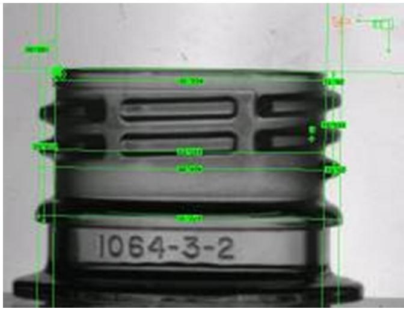

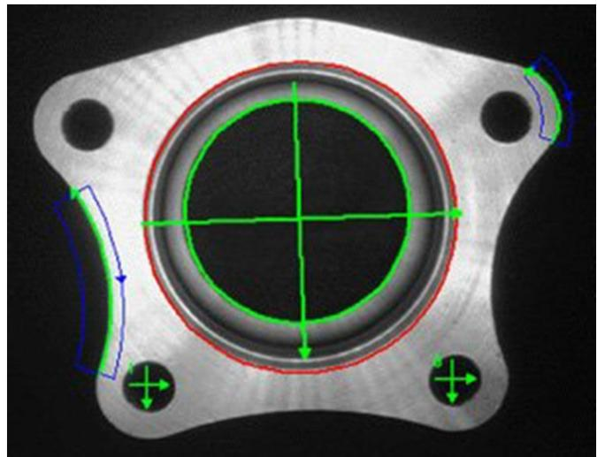

# 测量精度

精度 : 测量值与真实值的差别  
重复度 : 多次测量的数值差  
公差 : 工件大小允许的变化量

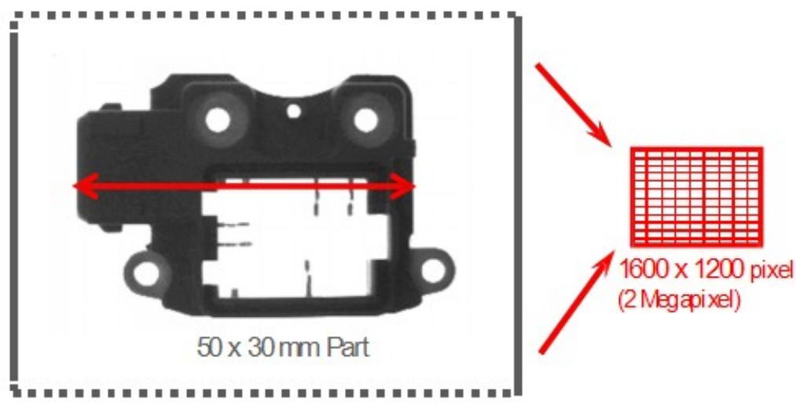  
64x48mmFOV

$$
F O V _ {\text {h o r i z o n t a l}} = 6 4 \mathrm {m m}
$$

$$
\text {A c c u r a c y} _ {\text {V i s i o n}, \text {T o o l}} = \frac {1}{4} \text {p i x e l}
$$

$$
\# \text {P i e x i l s} _ {\text {h o r i z o n t a l}} = 1 6 0 0 \text {p i e x i l s}
$$

$$
\text {A c c u r a c y} _ {\text {h o r i z o n t a l}} = \frac {\text {F O V} \times \text {A c c u r a c y} _ {\text {V i s i o n - T o o l}}}{\# \text {P i x e l s}}
$$

$$
\text {A c c u r a c y} _ {\text {h o r i z o n t a l}} = \frac {6 4 \times (\frac {1}{2}) \text {p i x e l}}{4}
$$

Accuracy 0.02mm

# 识别类应用 Identification

代码读取  
Bar Codes & 2D Matrix   
– 标签码和 DPM 码 Labels & Direct Part Mark   
读取字符   
–OCR / OCV   
模式识别  
– 基于颜色、形状等

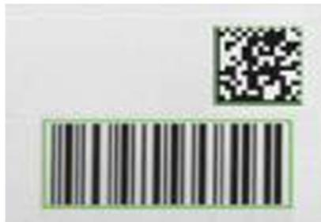

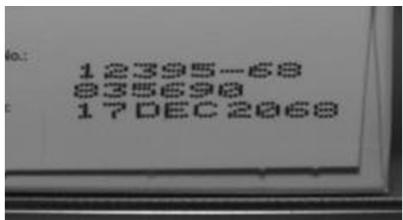

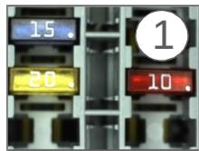

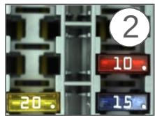

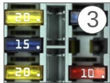

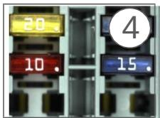

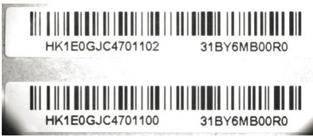

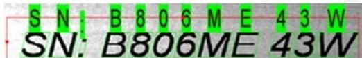  
字符笔划的宽度变化和歪斜

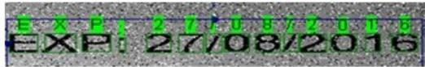  
背景噪声

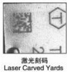

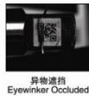

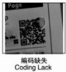

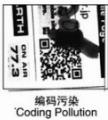

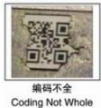

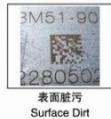

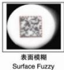

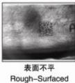

# 典型包装线上的序列化

• OCRMax & 2DMax+ 具有最高的读取率和读取速度  
• 图形用户界面设置和OCRMax自整定可以简化部署  
• 支持用户达到 GS1 & 食品药物管理局对药品的规定

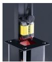  
离线数据阵质量验证

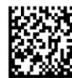

GTIN00012345679995

LOT 10JA28A

EXP12/2012

S/N 1234567890180

读取箱代码，分级代码，验证数据

读取批量代码

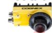

读取批量代码

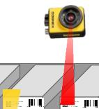

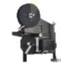  
打印批量代码

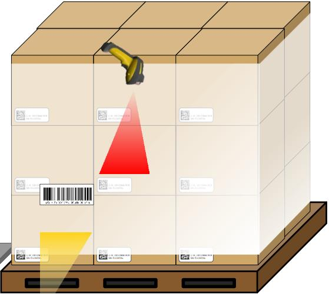

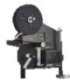  
读取货盘代码

打印箱代码和

可读数据

# 视觉技术典型的应用行业

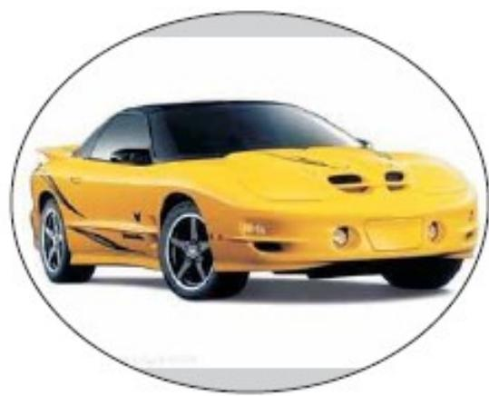  
汽车

  
手机

  
电子电路

  
医疗器械

  
制药

  
饮料食品

# 汽车行业

  
轮胎检 测   
挡风玻璃胶珠安装

  
制动垫检测  
仪表组检 测

  
安全气囊组件检测

  
安全带组件检测

# 电子行业

# 半导体

# 食品和饮料

# 太阳能

# 物流行业

# 医疗 / 医药

# 康耐视产品系列

In-Sight®

视觉系统

坚固耐用的一体化封装系统，具有易于使用的界面，用于配置广泛的应用。

VisionPro®

视觉软件

从PC及相机和图像采集卡运行的强大视觉工具库，供您选择。

Checker $\textsuperscript { \textregistered }$

视觉传感器

通过/未通过高速传感器，成本低廉，适用于元件存在性和测量应用。

DataMan®

条码读码器

适用于高对比度的一维和二维代码读取应用以及直接元件标记验证，提供固定式和手持式两种型号。

# COGNEX 完整的涵盖机器视觉范围

  
性能

# In-Sight 智能相机

# 工业相机

# 3D 相机

# 激光轮廓仪

  
螺丝插入深度检测   
轴承检测   
车座起皱检测   
发动机组活塞头高度检测  
制动垫检测

  
离合器片检测

  
天窗粘接检测

  
胎面轮廓检测

  
齐平度和空隙测量

  
发动机组对齐检测

  
焊接缝检测

  
气囊组件罩空隙检测

# 工业读码器

工业固定式读码器

  
DataMan50/60

  
DataMan150/260

  
DataMan300/503   
DataMan750/8050

工业手持式读码器

  
超值系列

  
DataMan8050X   
中端系列

  
DataMan8500/8600   
高性能

# 相机的发展历史

柯达

express影像网络

1826 1839 年

1888

1969 年

1974 年

1981

2000 年

20 世纪

年

# Thanks