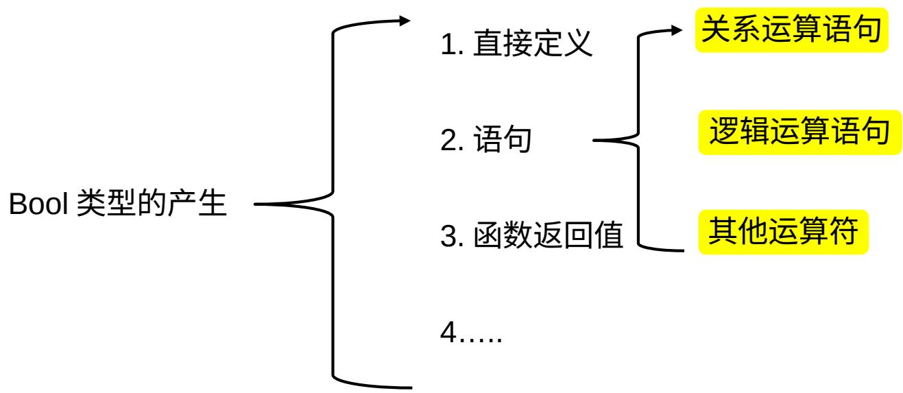

# C# 流程控制

Leon.Lei| 2023/03/08

# 学习目标

 1. 掌握布尔逻辑的含义及用法  
 2. 学习如何控制代码分支  
 3. 熟练使用各种循环语句

# 一 . 布尔逻辑

默认情况下， C# 程序的执行是从上到下，依次执行，有些情况下，我们需要根据不同的条件，选择性执行不同的语句，或者循环执行相同的语句。这两种情况，都用到了对条件的判断，也就是布尔逻辑。

布尔逻辑在 C# 中以（ bool ）类型存在：

bool 类型值只有两个：

 true   
 false



# 一 . 布尔逻辑

关系运算语句：由关系运算符连接的表达式  

<table><tr><td>运算符</td><td>类 别</td><td>示例表达式</td><td>结果</td></tr><tr><td>-</td><td>二元</td><td>var1 = var2 == var3;</td><td>如果 var2 等于 var3, var1 的值就是 true, 否 则为 false</td></tr><tr><td>!=</td><td>二元</td><td>\( \operatorname{var1} = \operatorname{var2}! = \operatorname{var3} \) ;</td><td>如果 var2 不等于 var3, var1 的值就是 true, 否则为 false</td></tr><tr><td>&lt;</td><td>二元</td><td>\( \operatorname{var1} = \operatorname{var2} &lt; \operatorname{var3} \) ;</td><td>如果 var2 小于 var3, var1 的值就是 true, 否 则为 false</td></tr><tr><td>&gt;</td><td>二元</td><td>\( \operatorname{var1} = \operatorname{var2} &gt; \operatorname{var3} \) ;</td><td>如果 var2 大于 var3, var1 的值就是 true, 否 则为 false</td></tr><tr><td>&lt;=</td><td>二元</td><td>\( \operatorname{var1} = \operatorname{var2} &lt;  = \operatorname{var3} \) ;</td><td>如果 var2 小于等于 var3, var1 的值就是 true, 否则为 false</td></tr><tr><td>&gt;=</td><td>二元</td><td>\( \operatorname{var1} = \operatorname{var2} &gt;  = \operatorname{var3} \) ;</td><td>如果 var2 大于等于 var3, var1 的值就是 true, 否则为 false</td></tr></table>

练习：

1. 大象的重量 1500kg ，老鼠的重量 1kg 。 2. 兔子的寿命 3 年，乌龟的寿命三年 .3. 我的年龄 31 ，你的年龄？

试通过程序输出以下结果：

大象的重量 $>$ 老鼠的重量

兔子的寿命 $= =$ 乌龟的寿命

我的年龄 $< =$ 你的年龄

# 一 . 布尔逻辑

逻辑运算语句：由逻辑运算符连接的表达式

<table><tr><td>运算符</td><td>类别</td><td>示例表达式</td><td>结果</td></tr><tr><td>&amp;&amp;</td><td>二元</td><td>Var1 = var2&amp;&amp;val3</td><td>Var2 和 var3 都为 true，结果为 true</td></tr><tr><td>||</td><td>二元</td><td>Var1 = var2||var3</td><td>Var2 和 var3 至少一个为 true，结果为 true</td></tr><tr><td>!</td><td>一元</td><td>Var1 = ! var2</td><td>Var2 为 false，var1 为 true</td></tr></table>

Tips

1.&& 与 & 的区别

&& 更快，更好。

2. 逻辑表达式的结果就是 bool 类型

练习：

编写一个控制台程序，用户输入语文和数学成绩（ 0-100 ），使用逻辑运算符输出以下判断结果：

1. 语文和数学成绩均大于 90 分  
2. 语文和数学成绩至少有一个大于 80 分  
3. 语文是否及格（ ${ > } 6 0 )$

# 一 . 布尔逻辑

运算符优先级  

<table><tr><td>优 先 级</td><td>运算符</td></tr><tr><td rowspan="13">优 先 级 由 高 到 低</td><td>++,-(用作前缀);(),+,-(一元),!,~</td></tr><tr><td>*,/,%</td></tr><tr><td>+,-</td></tr><tr><td>&lt;&lt;,&gt;&gt;</td></tr><tr><td>&lt;,&gt;,&lt;=,&gt;=</td></tr><tr><td>=,!=</td></tr><tr><td>&amp;</td></tr><tr><td>^</td></tr><tr><td>|</td></tr><tr><td>&amp;&amp;</td></tr><tr><td>II</td></tr><tr><td>=, *=, /=, %=, +=, -=, &lt;&lt;=, &gt;&gt;&gt;, &amp;, ^=, |=</td></tr><tr><td>++,-(用作后缀)</td></tr></table>

大致了解即可，程序中最好避免复杂错乱的优先级关系。

# 二 .Goto 语句

强制 C# 在执行到 goto 语句，强制跳转到对应的 label 。

goto语句的用法如下：

goto<labelName>;

标签用下述方式定义：

<labelName>:

int $\ a = 1 0 0$

goto mylabel;

$a + = 1 0 0$

a++:

mylabe1 :|

1T7 /

以上输出为 100

程序中最好避免使用，造成逻辑复杂，难以理解。

# 三 . 分支语句

通过条件语句来控制代码执行不同的分支结构的语句，常用的分支语句包括：

三元运算符  
if 语句   
switch 语句

# 三 . 分支语句

三元运算符语法如下：

< 条件 > ？语句 1 ：语句 2 ；

当条件为真时，执行语句 1 ，否则执行语句 2 ，

例如以下代码，输出 smaller

$$
\mathrm {i n t} \mathrm {a} = 1 0;
$$

$$
\text {s t r i n g} = a > 1 0 0 ? \text {" B i g g e r " : " s m a l l e r " ;}
$$

$$
\text {C o n s o l e . W r i t e L i n e} (\text {r e s u l t});
$$

练习：定义 BlobTool1 的斑点面积 100 ， BlobTool2 的斑点面积 185 ，定义一个变量MaxArea ，

使用三元运算符，完成对 MaxArea 的赋值，使他等于 BlobTool1 和 BlobTool2 的最大值。

# 三 . 分支语句

If语句：最常见的分支结构

if(< 条件语句 1>)

{

语句块 1

}

else if （ (< 条件语句 1>) ）

{

语句块 2

}

Else

{

语句块 3

}

Tips ：

1. 当条件语句被满足时，执行对应的语句块的语句，否则不执行  
2. 如果分支结构过于复杂，建议使用 switch 语句

练习：

编写一个控制台程序，让用户输入年龄，如果用户年龄大于18 ，输出“可以查看”，如果用户年龄大于 10 但是小于等于 18 ，输出“请在家长的陪同下观看”，否则输出“年龄过小，我要报警了” 。

# 三 . 分支语句

# switch 语句：

```txt
switch (<testVar>)  
{  
    case <comparisonVal1>:  
        <code to execute if <testVar> == <comparisonVal1> > break;  
    case <comparisonVal2>:  
        <code to execute if <testVar> == <comparisonVal2> > break;  
    ...  
    case <comparisonValN>:  
        <code to execute if <testVar> == <comparisonValN> > break;  
    default:  
        <code to execute if <testVar> != comparisonVals> break;  
} 
```

Tips:

1. 当 testVar 满足 case 分支时，执行对应的代码块。  
2.Default 语句，当 testVal 不满足所有已知 case 分支条件时执行。  
3. 注意 break 或者 return 的使用。

练习

使用控制台程序，输入一个数学考试成绩 socer ，使用 switch 语句对成绩进行判断

socer $\mathtt { < 6 0 }$ 不及格

70>socer $\mathtt { > 6 0 }$ 及格

80>socer $> 7 0$ 中等

90>socer $\mathtt { > 8 0 }$ 良

100>socer $\mathtt { > 9 0 }$ 优

# 四 . 循环语句

在日常生活和编程中，常常有一种情况，即我们需要对相同的事情，重复执行若干次，如：

打印 1000 份试卷  
 每天早上刷牙洗脸  


循环语句可以很方便的将同一段代码执行多次。在 C# 中，常用的循环语句包括

 do while   
while   
 for   
7 foreach

# 四 . 循环语句

# do while 循环

```txt
do   
{ <code to be looped> } while (<Test>); 
```

```txt
int a = 10;  
do  
{ Console.WriteLine(a.ToString()); a++; } while (a<10); 
```

Tips ：

1.do while 循环至少执行一次  
2.当<Test>条件满足，则继续执行语句块，否则跳出执行。  
3.do while 循环能干的 while 循环都可以做，所以while 循环更好用

如左边代码所示，如果我的原意是a小于10的话将他依次输出，该代码是否满足？如果不满足，应该如何修改？

# 四 . 循环语句

# while 循环

```txt
while(<Test>)   
{ <code to be looped> 
```

```txt
int a = 10;  
while(a<10)  
{ Console.WriteLine(a.ToString()); a++; } 
```

Tips ：

1.while 循环可能一次也不执行  
2.当<Test>条件满足，则继续执行语句块，否则跳出执行。

如左边代码所示，如果我的原意时 a 小于 10 的话将他依次，输出，该代码是否满足？如果不满足，应该如何修改？

# 四 . 循环语句

for 循环

```txt
for(<initialization>;<condition>;<operation>) { <code to loop> } 
```

For 循环三要素

1. 初始化条件  
2.判断条件  
3. 对判断条件的操作

练习

使用 for 循环，计算并输出 1 到 100 的和。

# 五 . 循环中断条件

我们可以使用一些语句，对循环进行更精细的操作， C# 支持以下四种：

1.Break ，立即跳出当前循环  
2.Continue ，跳过当前次循环，继续执行下一次循环  
3.Goto ，跳转到对应的 label  
4.Return 跳出循环，和当前循环所在的函数体

```c
int a = 10;  
while(true)  
{ Console.WriteLine(a.ToString()); a++; if (a > 1000) break; } 
```


# Thank you