# 2021.3.20L3 等级考核试题

# 视觉工程师三级笔试

# 填空题。（每空 1.5 分，共 30 分）

1. 棋盘格标定是使用一个棋盘格板来计算像素和真实单位之间的转换，它可以计算 _线性_ _转换或者 _非线性_ _转换。  
2. 如下图，径向畸变分为两种，异常1是 桶形畸变 _，异常 2 是_ _枕形畸变_。

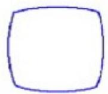  
异常1

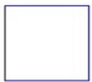  
正常图像

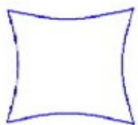  
异常2

3. 标定后的纵横比越接近 1 越好、倾斜越接近于 0 _越好。  
4. 如下图C#代码，最后输出的结果是 100_ _。这里 num 始终为 1， $\yen 100$ 则最大为 99，所以Score 是 $1 + 9 9 = 1 0 0$

static void Main(string[] args)   
{ int num $= 0$ double score $= 0$ num $= 1$ //Console.WriteLine(num); for (int i $=$ num; i $<  100$ .i++) { score $=$ num $^+$ i; } Console.WriteLine(score); Console.ReadKey();   
}

5. 翻译以下自由度：

Translation：_ _偏移_ Rotation：___ _角度

Scaling： _缩放_ Skew： _倾斜

Aspect： _比例

6. CogImageFileTool 的作用是将图像写入到文件中或从文件中读出，它支持的文件类型有  
_idb _cdb _和 bmp 。  
7. CogPMAlignTool 训练模板的方式有两种，分别是 _建模 _和 _掩膜 。  
8. CogBlobTool 的极性在二值分割的情况下才有，它分为两种分别是 _白底黑点_黑底白点_ 。  
9. 假设相机型号为 CAM-CIC-5000R-14-G（相机芯片尺寸为 $1 / 2 . 5 "$ ，芯片大小长边为 $5 . 7 \mathsf { m m }$ ），配合一个  
0.3倍远心镜头，则可算出的视野长边大小为 19 。 $\_$ 视野/芯片 $\equiv$ 放大倍率

# 二、 不定项选择题（每空 2 分，共 10 分）

1. 关于一个 Job 包含内容的说明，下面描述正确的是 （ ABD ）

A、 至少包含一个提供图像的图像源（Image Source）  
B、 包含一些视觉工具集合在此图像上运行  
C、 可以有多个Job同时运行  
D、 Vision Tools 在 Job 中将执行串行的运行方式

2. 下面哪个参数不属于 CogCaliperTool 的极性选择（ A ）

A. Edge Pair B. Dark to Light C. Light to Dark D. Any Polarity

3. 关于标定片本身，下面说法正确的是（ AC ）

A、黑白瓷块必须以交叉图案方式排列  
B、黑白瓷块中间不能有其它图像存在  
C、黑白瓷块必须具有同样的尺寸  
D、瓷块必须为矩形，其纵横比范围是0.9到1.1

4. 关于 CogPMAlignTool 模板训练的技巧，以下说法错误的是（ D ）

A、模板特征要有唯一性  
B、模板的对比度明显

C、模板的形状轮廓明显  
D、模板的特征越多越好

5. CogResultsAnalysisTool 可以使用以下形式的结果（ ABCD ）

A.数值

B.字符串

C.布尔值

D.向量

（结果值的数组）

# 三、判断题。（每题 2 分，共 10 分）

1、 增加标定图像中可见的黑白瓷块数量，可以提高校准的精确度 （ Y ）  
2、 如果没有 Fixture 定位工具，图像空间坐标系原点一定位于图像中心（ X ）  
3、 对于 CogFindCircleTool，一般来说，要提高精确度，可以增加卡尺的的数量，也可以增加卡尺的搜索长度 （ X ）  
4、 Aspect / Skew 是 可 以 通 过 视 觉 标 定 来 进 行 矫 正 的 ， 只 要 不 太 离 谱 ， 不 会 影 响 贴 装 精 度（ X ）  
5、 CogImageConvertTool 工具可以进行图片格式转换，它默认是将彩色图像（16bit、24bit）转换为12bit 的灰色图像 （ X ）8bit

# 四．简答题（每题 10 分，共 50 分）

1、阐述在自动标定过程中造成标定不成功的原因，并给出解决措施（至少三个）。（10 分）

参考：

视觉：标定片尺寸不对(确认尺寸)，清晰度不够(确认焦距)、曝光不合适(优化曝光)、标定片标定过程中滑动(防止机台抖动、吹气等导致标定片滑动)等等

机构： $^ { 9 + 2 }$ 标定旋转角度不对(按照要求的5 10 15等角度旋转。)，轴走位不准确()，轴旋转角度不准确，拍照位置不固定(有偏差)、通讯失败等等。

2、简述CogCaliperTool抓取单个边缘的三种计分方式的含义。（10分）

对比度函数(contrast)、位置函数(Position)、PositionNeg 函数:

对比度:默认当X0>XC时：对比度越高得分越高，达到设定的X0的值时得分为1 超出也为1.当 $\mathsf { X C } { \mathsf { > } } \mathsf { X } 0$ 时

相反，对比度越高，得分越低。

位置函数(Position)：默认XC>X0越靠近卡尺中线位置得分越高， 勾选时 X0>XC 离卡尺中线越远

得分越高。

PositionNeg: 默认 $\mathsf { X C } { \mathsf { > } } \mathsf { X } 0$ 靠近卡尺起始位置得分高 勾选时X0>XC远离卡尺 起始位置得分高

3、如下面代码中，投影图像和筛选算子已知，请写出筛选输出结果并画出其输出曲线图像。（10分）

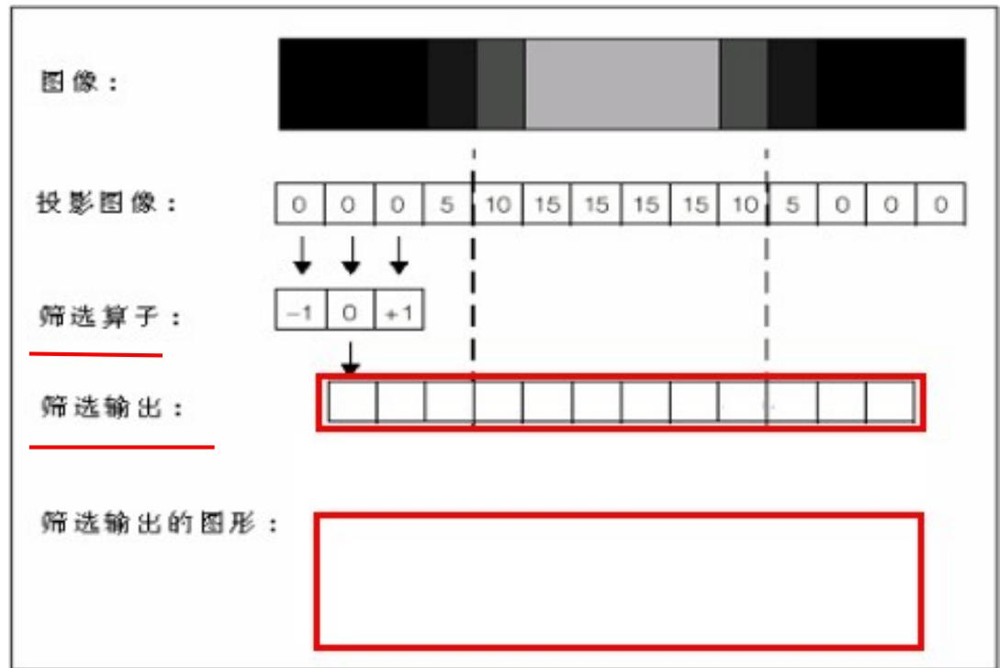

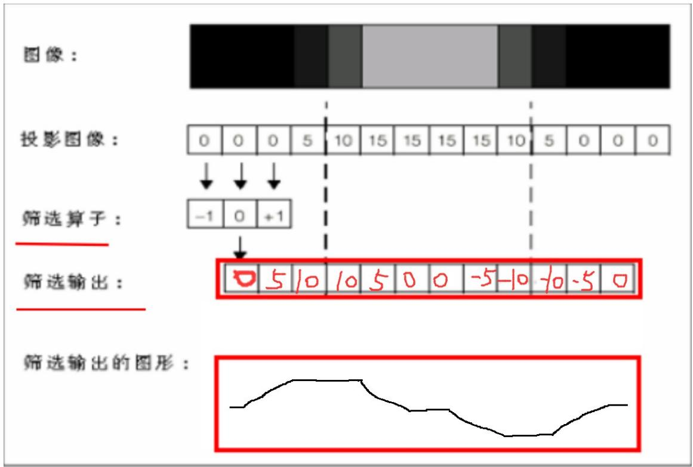

画线，体现出来数字变化就行。中间是 0，线往上走是5 10，往下走对应的-5 -10，横线反映了保持某个值不变。

4、在实际应用中，我们经常使用 CogPMAlignTool 来建立模板，那么当我们建好初步的模板后，可以通过调试哪些参数来减小模板匹配的时间？（至少五个）（10 分）  
答：减小搜索区域、提高接受阈值、减小角度范围、减小缩放范围、减少查找概数、调高对比度阈值、不勾选忽略极性

5、CogBlobTool并不能适用于所有机器视觉应用，请列举CogBlobTool的适用对象具有哪类特征？不适用对象具有哪类特征？（10 分）

适用对象：对象在尺寸、形状、方向上有很大差异（很难或不可能训练模型）

在背景中没有明显灰度阴影的对象（会影响我们对目标的分割）

对象没有重叠或者连接

不适用对象：对比度不明显、图案有重叠部分等

# 视觉工程师三级机试

上机操作（每题为一个 Job，Job 重命名为 1,和 2，作业保存为 Quickbuild 格式，命名方式为：姓名 $^ +$ 身份证号。每人作业只收集一份 Quickbuild。）

1. 请使用 Image1 图片完成以下操作：

$\textcircled{1}$ 如图所示，用 CogPMAlignTool 工具找出每种零件的数量并输出到输出端：

（20 分）

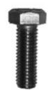

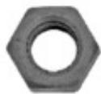

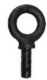

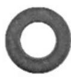

螺丝

螺母

螺栓

垫片

$\textcircled{2}$ 抓取螺栓 1/2/3 圆的中心，连接螺栓 1 和螺栓 2 的中心做 Line1，连接螺栓 2 和螺栓 3 的中心做 Line2，求出 Line1 和 Line2 的角度并输出到输出端。（10 分）  
$\textcircled{3}$ 过螺栓 3 圆的中心作线 1 的垂线 Line3，并求出圆心到交点的距离并输出到输出端。（15 分）

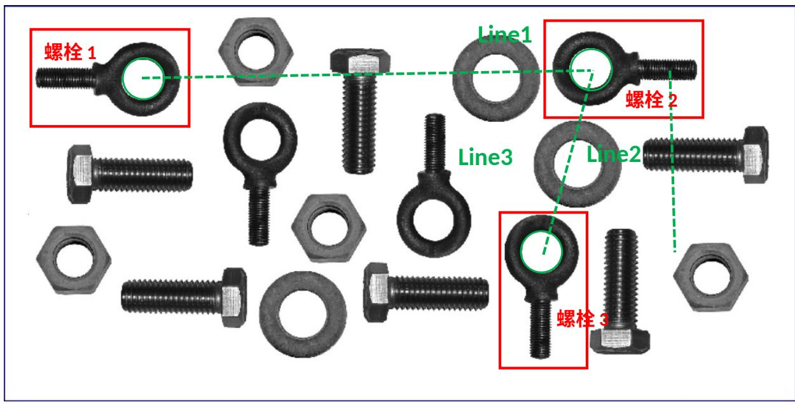

思路：这里输出用 CogToolBlock 收集。

$\textcircled{1}$ 模板工具计数功能，添加四个模板工具做模板，修改概数、角度等参数，匹配到所有结果，输出 Count终端。  
$\textcircled{2}$ 抓圆抓3个，做Line1，应该是用fitline拟合直线，fitline拟合2个线，求夹角并输出。   
$\cdot$ 过圆心做垂线，求圆心到交点距离并输出。

2. 请使用 Image2 图片完成以下操作：

① 如图所示，用 CheckBoard 中图片进行标定（标定片尺寸 0.5mm）（10 分）。  
以 $\textcircled{1}$ 中的输出图片做以下 $\textcircled{2} - \textcircled{6}$ 操作：  
$\textcircled{2}$ 在图中选取稳定特征做模板，建立 Fixtrue 空间。（10 分）  
$\textcircled{4}$ 求出手机屏幕的宽和高并输出到输出端。（10 分）  
$\textcircled{5}$ 求出按键0和按键2的面积，如果按键0的面积大于按键2的面积，则输出按键0的面积，否则输出按键2的面积。（15分）  
$\textcircled{6}$ 求出按键 0 的中心到手机下边沿的距离并输出到输出端（10 分）

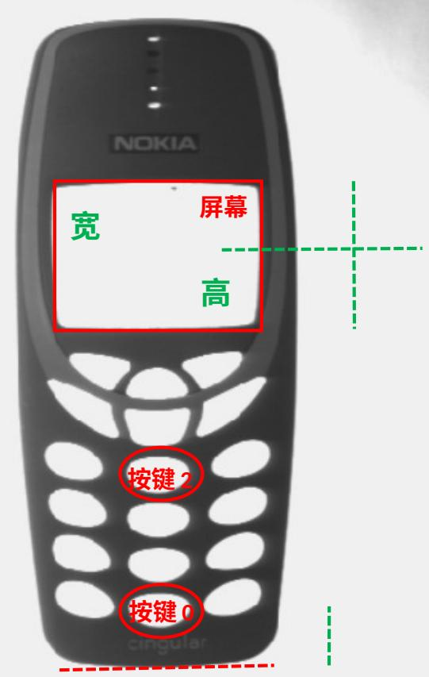

# 思路：

$\textcircled{1}$ 先加载标定片，设定合适参数(抓取校正图像、设置校正模式、自由度、特性搜寻器、基准符号、标定片

# 尺寸、计算校正、运行看结果。)

$\textcircled{2}$ 标定工具运行好之后，加载手机图片，现将图片连进标定工具，标定工具的输出图像给到模板工具，选择合适位置做模板，添加定位工具Fixture建立空间。  
$\cdot$ 直接卡尺工具，边缘对模式，抓取宽高。输出width终端。

$\textcircled{5}$ 斑点工具设定搜索区域，筛选，只保留按键 0 和 2，输出 Area 终端，因为斑点工具默认输出的第 0 个结果就是最大的斑点，直接输出自带的结果 0 的 Area 终端就是 2 个斑点中最大的斑点。  
$\cdot$ 用按键0斑点质心CenterOfmassXY到下边的线测距。

如右图所示，为

CogCalibCheckerboardTool

基本操作步骤：

1.抓取校正图像  
2.选择校正模式  
3.选择特性搜寻器  
4.标明在您的校准版上是否存在一个基准（原点）标志  
5.输入校正板尺寸   
6.计算校正，查看转换结果

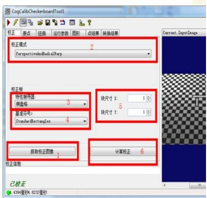

# 2021.3.20 第二套等级考试试题

# 视觉工程师三级笔试

# 三、 填空题。（每空 1.5 分，共 30 分）

1.如下图所示，请解释 CogPMAlignTool 参数的意义

_粗糙 _精细

_弹性 自动边缘阈值

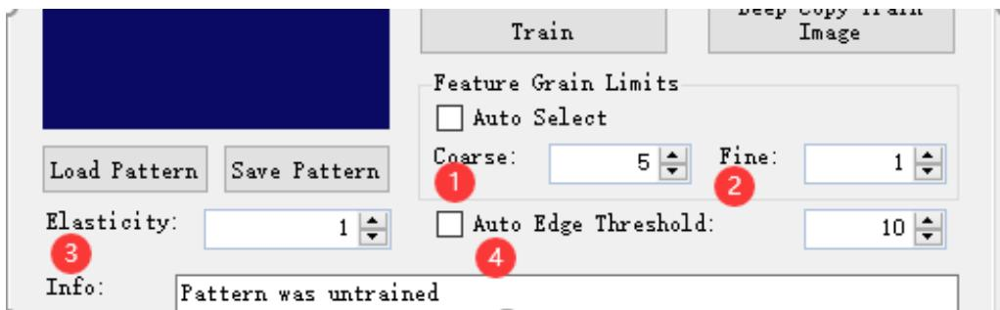

2. CheckBoard 工具进行线线校正模式时候的五种自由度是__平移_ _旋转_、___倾斜___、__缩放__、_纵横比_ _。

3. 我们的 AssemblyPlus 软件自带的和 SI 的通信方式是__TCP_、__Serial 串口__.

4. CogIPOneImageTool 常用的图像处理方法有__乘以常数__、__加/减常数__、_翻转/旋转___、腐蚀等处理（合理即可）

5. 使用 Caliper 工具，在选择单边模式时可使用的三种函数是__对比度 _位置_PositionNeg_ _。

6. 3D 相机设置参数时，X-Scale 代表____X 缩放

StepsPerLine 代表 每行编码器的步数。

Measure Field 代表 _测量场(决定 3D 相机的取像速度和景深大小)__。

# 四、 不定项选择题（每空 2 分，共 10 分）

1.我们相机的触发模式有：（ ACD ）

A、手动

B、自由运行

C、硬件自动

D、硬件半自动

2. 关于 PMAlignTool 中的接受阈值说法正确的是（ ABCD ）

A、范围在0到1  
B、当结果分数为0.8时，提高接受度阈值到0.79，一定还有结果  
C、提高阈值可以减少工具运行时间  
D、降低阈值可能找到多个相似的特征

3.以下选项那些可能是标定失败的原因( ABCD )

A、机械手 XY 方向走点距离不一致  
B、标定图片焦距模糊  
C、打光不均匀   
D、做机械手旋转中心校准时，机械手旋转的角度不精确

4. 使用 CogCopyRegionTool 可对指定区域（ A C ）

A 灰度填充 B 空间变换 C 像素复制 D 数据计算  
5．视场水平方向的长度是9.34*7.8mm，相机水平分辨率是2448*2048，视觉系统的精度是多少？ （ D）9.34/2448=0.00381

A、50Pixel/mm B、262.09mm/Pixel C、500Pixel/mm D、0.0038mm/Pixel

# 三、判断题。（每题 2 分，共 10 分）

6、 CogPMAlignTool 中颗粒度参数的单位是 pixel。 （ Y ）  
7、 CogFindLineTool 与 CogCaliperTool 都可以抓取边缘对。 （ Y ）  
8、 CCD 对比 CMOS 的优势有：噪声高，耗电量低，技术较成熟。 （ X ）  
9、相机型号和打光效果都可以影响视觉检测的精度。 （ Y ）  
10、 使用PMAlign工具匹配特征时图像中的部分特征在视野外，可以设置区域以外计分参数增加特征匹配得分。 （ X ）

# 四．简答题

1. 简述 CheckBorad 标定工具中 Translation、Scaling、Rotation、Skew 的意义。（10 分）

选择线性畸变校正时候的5种自由度中的4种：可以校正图像上这四种类型的线性畸变。

Translation 平移、Scaling 缩放、Rotation 旋转、Skew 倾斜

# 2、简述下面代码中序号 1-5 的含义。（15 分）

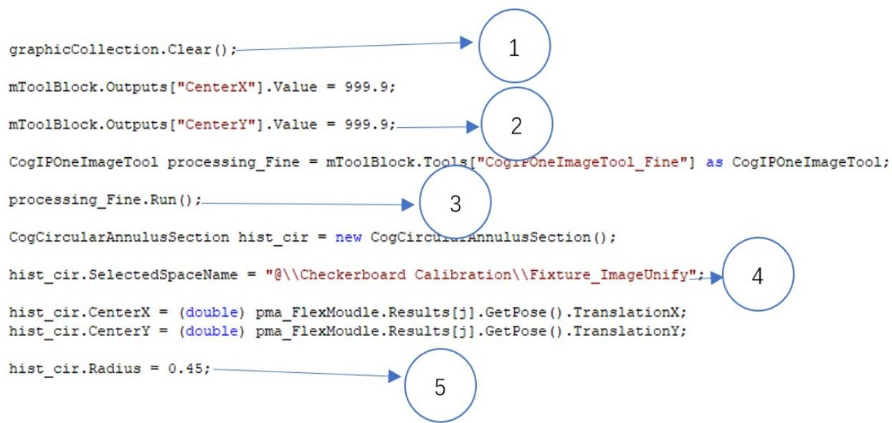

答：

1. 将 graphicCollection 这个集合里东西清空  
2. 赋值，将 CogToolBlock 中输出端的名为 CenterX 的值赋值为 999.9  
3. 运行一下 processing_Fine 这个工具。  
4. 修改 hist_cir 工具的空间名称为”@\\......Fixture_ImageUnify”  
5. 赋值将 hist_cir 的半径值赋值为 0.45

3.相机标定时 RMS 误差过大，请阐述合理的分析排查步骤。（15 分）

视觉：曝光不合适、焦距不合适导致抓取到的Mark点少或不准确导致，校正模式不对导致等。

机构：走位不准确、旋转角度不准确或是不对、取放标定片时候位置抖动等

4.写出至少 5 类造成抓边异常的原因以及对应的解决办法（10 分）

$\cdot$ 即使模板匹配好，但是有些边的位置相对于模板特征而言不太固定，需要合理设置大一些抓边工具的搜索长度，以保证这条边始终在抓边工具的搜索范围以内。  
$\textcircled{2}$ 图片亮度太暗或过曝等，边不存在导致抓边失败，调整合适曝光。  
$\textcircled{3}$ 物料本身边缘对比度不佳，适当降低对比度阈值。  
$\textcircled{4}$ 物料边缘凹凸不平，有凸起，凹陷等，可以适当忽略一些点数，把不稳定的因素排除掉。  
$\cdot$ 图像清晰度变的稍差，或者边缘黑白过滤的像素数比较多，可以适当增加抓边工具的过滤一半像素值。

# 视觉工程师三级机试

上机操作（作业保存为Job格式,将所求结果输出到一个block中，命名方式为：姓名 $^ +$ 身份证号。每人作业只收集一份 Job。）

1. 请使用Image1图片完成以下操作：

求抓取内外 2 个圆，并求 2 个圆的圆心距 cc（20 分）

用 OCR 工具解析下方字幕并输出 ResultString（20 分）。

求大圆与“STABRUCKS”的上边线 L1 的距离 AB（20 分）

过大圆圆心 O 做 L1 的垂线 L2，L2 与小圆相交与点 C 过圆心 O 做 L2 的垂线 L3，L3 与小圆相交与点 D，求∠OCD 的角度 Angle（20 分）

用 CogResultsAnalysisTool 求▲OCD 的面积（面积=1/2 *长*宽）。（20 分）

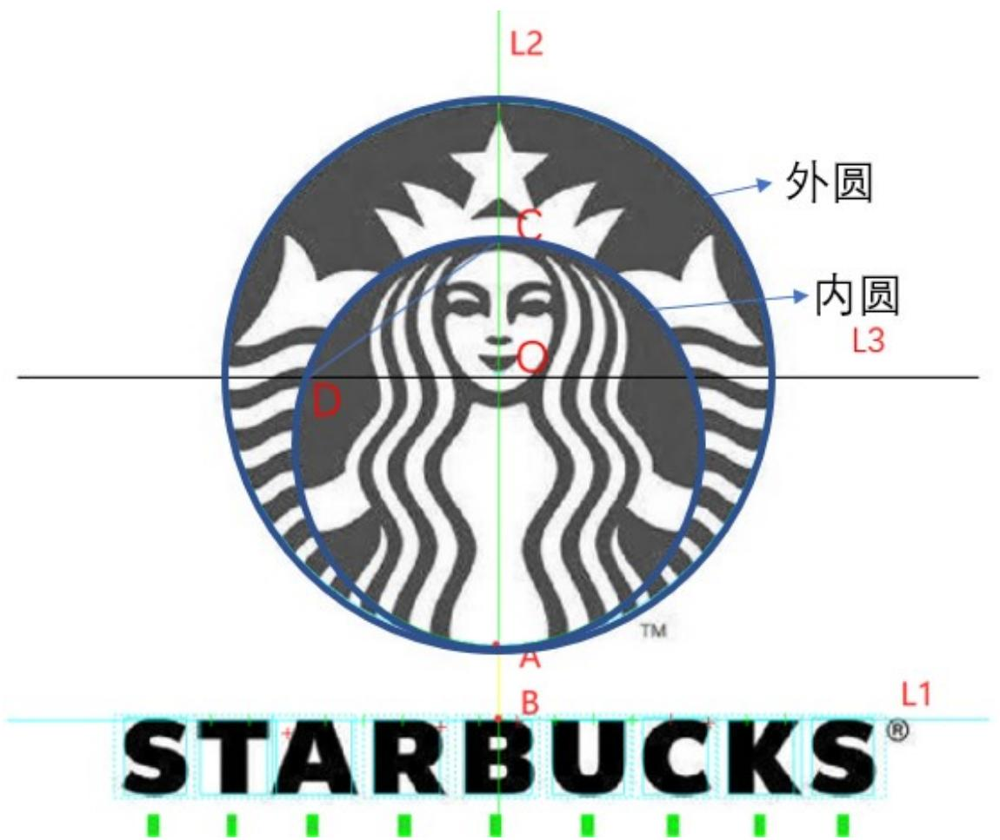

参考机试题文件夹里，有这题答案。

# 2021.等级考核题

# Cognex 高级笔试题

总分(100 分) 姓名 工号

.不定项选择题（每题 2 分，共 10 分）

1.如下图所示，CogCaliperTool 工具说法正确的是（ BC ）

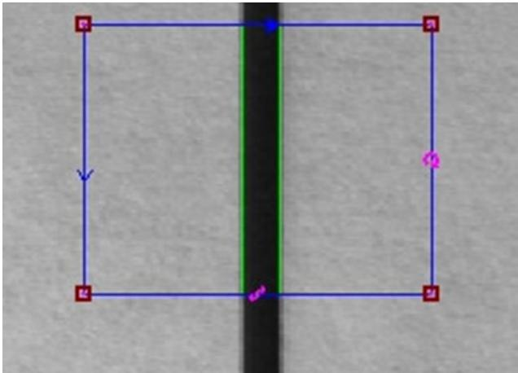

A、水平方向为投影方向

B、垂直方向为投影方向

C、水平方向为扫描方向

D、垂直方向为扫描方向

2. 利用 CogFixture 工具建立空间坐标系需要输入 （ ABD ）

A.X

B.Y

C. Center

D. Angle

3：8704E卡采用4-Pin电源连接器连接 B电源。

A.6V

B.12V

C.18V

D.24V

4．图片保存路径：D:/Cognex/Images/ 软件备份路径 D:/Cognex/Backup 及按要求( B )备份一次。

A.每天

B.每周

C.每半个月

D.每个月

5.PMAlign工具输出结果数据（X,Y,Angle等）是在哪个空间下（ B ）

A、像素空间 B、输入图像空间 C、训练区域选取空间 D、搜索区域选取空间  
6. 图像训练正确顺序为 （ A ）  
A.获取图像 设置训练区域和原点 设置训练参数 训练图像 查看结果  
B.获取图像 训练图像 设置训练参数 查看结果

C. 获取图像 设置训练参数 设置训练区域和原点 训练图像 查看结果  
D. 获取图像 设置训练区域和原点 训练图像 查看结果

7. 图像保存时为什么最好保存为 BMP 格式 （ D ）

A.文件小 B.快门速度保存在图像文件中  
C.转换为 FTP 更容易 D.图像质量不会丢失  
8.LED 光源的优势有哪些 （ABC）

A．寿命长 B.可以频闪 C.多种颜色和形状的选择 D.强度永不衰减

9. 以下什么不是 DataMatrix 代码的特征 （B）

A.静区 B.起始符/终止符和校验符 C.查找特征 D. 计时特征

10.对锯齿边缘轮廓检测，使用下面哪种光源比较合适 （C）

A.带偏振环形光 B.同轴光 C.背光源 D.高角度直向型光源

# 二．判断题（每题2分，共20分）

1.不同颜色的物料，所对应的打光效果也是不一样的。 ( √ ）  
2.做数据时 GRR 要跑 32 片料而 CPK 需要跑 10 片料。 ( × )  
3.如果一个图像的效果太暗，我们可以通过调节光圈来进行设置，光圈的大小对于图像的效果的影响不大（×）  
4.降低接受阈值参数，CogPMAlign 工具运行时间会变长。 ( $\surd$ )  
5.背光源适用于金属物体的表面打光。 （ × ）  
6.CogPMAlignTool 查找概数中，值设置为 1 时，仍然可以找到多个结果。（×）  
7.C 型接口的镜头可以匹配 CS 型接口的相机。 （√）  
8.只需要在镜头前端装上偏振片即可过滤掉产品上的眩光，得到想要的效果图片。（×）  
9. 调机时，相机聚焦需先把光圈调到最大，聚焦完成后在调回正常光圈是为了使聚焦最好. ( √ )  
10. 蓝色特征红色背景(黑白相机)，最佳使用红色光源。 （√）

# 三：简答题（60分）

1：简述查询8704E的信息查询流程，并写出查询到的信息。（15分）

1.在开始菜单的搜索框中输入“cmd”指令；

2.在 cmd 命令行黑色窗口中输入：cogtool –p 会提取出 8704E 卡的所有信息；  
3.输入完成后按回车键，就会显示如下信息：（板卡的SN和最大支持的相机数以及支持的工具名称）

2：相机无法触发，分析原因并写出解决方法？（写出三点即可）（15 分）

1.确认相机是否连接正确  
2.如果 VisionPro 可用，打开 Cognex GigE Vision Configuration，查看不拍照的相机是否在左侧的相机列表中。  
3.确认机构是否发送了正确的触发信号。  
4.可能由于主机卡顿，软件卡顿或BUG引起，将计算机关机，约十秒钟后，重新开启计算机  
5.检查相机是否损坏，如坏的话更换相机。  
6.相机配置参数设置不正确，重新查看并配置好正确参数  
7.权限位丢失，检查8704E板卡权限   
8.磁盘已满或者图片删除设置参数不合理，重新设置图片保存参数

3：在其他条件一定的情况下，说明光圈值与通光量之间的关系，光圈与景深之间的关系。（15 分）

光圈越大，通光量越大；光圈越小，通光量越小。

光圈越小，景深越大；光圈越大，景深越小。

4：简述视觉软件无法正常开启的可能原因及措施（写出三条即可）（15 分）

$\cdot$ 原因：视觉软件所在的文件夹中文件数量或者文件内存出错

措施：替换备份程序

$\cdot$ 原因：VisionPro软件版本号错误或者未安装

措施：卸载旧版本的VisionPro软件后安装正确版本的软件

$\cdot$ 原因：电脑运行卡死

措施：重启主机后再开启软件

# 2021.等级考核题 2

# Cognex 高级笔试题

# 总分(100 分) 姓名 工号

# 一．不定项选择题（每题 2 分，共 20 分）

1.读码器指示灯的含义是（ A ）

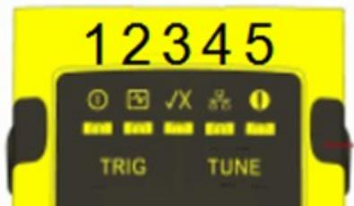

A. 1.电源 2.训练状态 3.解码结果显示 4.通信 5.报警  
B. 1.训练状态 2.电源 3.解码结果显示 4.通信 5.报警  
C. 1.电源 2.解码结果显示 3.训练状态 4.通信 5.报警  
D. 1.解码结果显示 2.训练状态 3.电源 4.通信 5.报警

2.下列关于 RMS 的说法正确的是（ BC ）

A、RMS表示最大误差 B、RMS 越小表示标定结果越好  
C、RMS 表示均方根误差 D、RMS 越大表示标定结果越好  
3． CogPMAlignTool 中有下列哪些参数（ ABCD ）

A.颗粒度 B. 弹性 C. 缩放 D. 边缘阈值

4．图片保存路径：D:/Cognex/Images/ 软件备份路径 D:/Cognex/Backup 及按要求( B )备份一次。

A.每天 B.每周 C.每半个月 D.每个月

5．在cmd命令行黑色窗口中输入 ( B ) 会提取到8704E卡的所有信息。

A.cogtool -f B.cogtool -p C.cogtool -d D.cogtool –r

6. 图像训练正确顺序为 （ A ）

A.获取图像 设置训练区域和原点 设置训练参数 训练图像 查看结果  
B.获取图像 训练图像 设置训练参数 查看结果

C. 获取图像 设置训练参数 设置训练区域和原点 训练图像 查看结果  
D. 获取图像 设置训练区域和原点 训练图像 查看结果

7. 图像保存时为什么最好保存为 BMP 格式 （ D ）

A.文件小 B.快门速度保存在图像文件中  
C.转换为 FTP 更容易 D.图像质量不会丢失  
8.决定视野的因素主要是 （C）

A.镜头和增益 B.工作距离和增益  
C.镜头焦距和工作距离 D.镜头放大倍率和景深

9.下列光圈值中，请问哪个可以得到最大的景深 （ D ）

A.1 B.1.4 C.2.8 D.5.6

10. 以下什么不是 DataMatrix 代码的特征 （B）

A.静区 B.起始符/终止符和校验符 C.查找特征 D. 计时特征

# 三．判断题（每题 2 分，共 10 分）

1.相同参数设置时，图像搜索范围越大，PMAlign工具运行时间越长。 ( $\cdot$ )  
2.调机时，相机聚焦需先把光圈调到最大，聚焦完成后在调回正常光圈是为了使聚焦最好. ( √ )  
3.景深是指在焦距固定，图像清晰时，被测物体离相机的前后变化距离，它受镜头上光圈的影响，光圈大景深大。 （ × ）  
4.Patmax 中的弹性参数只会降低得分中的 fiterror 的值。 （ × ）  
5.Blob工具可以根据对象的大小，形状和位置等进行排序和分类。（ $\cdot$ ）  
6.远心镜头不会产生畸变。（×）  
7. C 型接口的镜头可以匹配 CS 型接口的相机。 （√）  
8. 不同颜色的物料，所对应的打光效果也是不一样的。 ( √ ）  
9. 如果一个图像的效果太暗，我们可以通过调节光圈来进行设置，光圈的大小对于图像的效果的影响不大（×）  
10. 测量金属管表面的商标时，使用同轴光照明效果最佳。（×）

# 三：简答题（60分）

1：写出或画出人类视觉和机器视觉的对比（15 分）

人类视觉VS 机器视觉

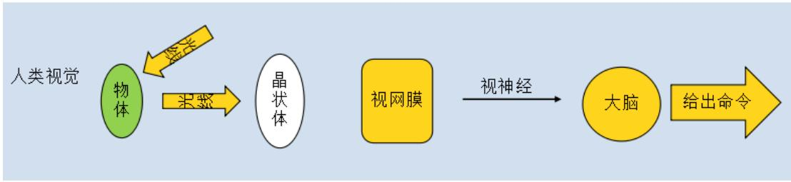

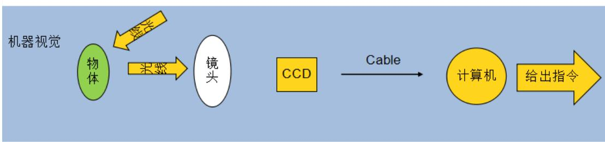

2：相机无法连触发，分析原因并写出解决方法？（写出三点即可）（15 分）

1.确认相机是否连接正确  
2.如果 VisionPro 可用，打开 Cognex GigE Vision Configuration，查看不拍照的相机是否在左侧的相机列表中。  
3.确认机构是否发送了正确的触发信号。  
4.可能由于主机卡顿，软件卡顿或BUG引起，将计算机关机，约十秒钟后，重新开启计算机  
5.检查相机是否损坏，如坏的话更换相机。  
6.相机配置参数设置不正确，重新查看并配置好正确参数  
7.权限位丢失，检查8704E板卡权限   
8.磁盘已满或者图片删除设置参数不合理，重新设置图片保存参数

3：简述相机蓝屏可能原因以及应对措施（写出三条即可）（15 分）

$\cdot$ 原因：Cognex Gige Vision Configuration 文件里对应的相机连接异常

措施：检查Gige中相机IP地址、网关、ebus、防火墙、巨帧数据包、速率和电源选项是否正确，不正确则更正

$\cdot$ 原因：相机没有连接上，网线连接异常

$\textcircled{3}$ 原因：电源线供电异常  
措施：先断24V电源和关闭所有软件2~3分钟，再打开24V电源后，打开Cognex软件后再打开BZ软件  
$\cdot$ 原因：网线、电源线损坏

措施：更换网线、电源线

$\cdot$ 原因：相机损坏

措施：更换相机

$\textcircled{6}$ 原因：8704E板卡没有升级  
措施：考出cogtool信息，发给Group DRI,反馈升级信息，升级板卡  
$\cdot$ 原因：VisionPro占用或程序卡死  
措施：关闭 VisionPro,重启程序   
$\textcircled{8}$ 原因：杀毒软件正在运行  
措施：关闭杀毒软件

4：当扫码枪扫码不稳定时，有哪些处理方法？（写出三点即可）（15 分）

$\cdot$ 精调扫码枪  
$\textcircled{2}$ 调整光纤位置，优化参数  
$\cdot$ 增加扫码通道  
$\textcircled{4}$ 调整扫码枪位置

# 2022.3.13 等级考核题

# 一、填空

1.抓边工具的结果 已使用列表的 True和False分别代表：找到并参与线拟合的点被忽略点数忽略的点或未找到的点  
2.Checkerboard 五种自由度： 平移 旋转 缩放 倾斜 纵横比  
3.PMAlign工具训练模板的特征中，弹性的单位是：像素。弹性 越大 对特征的形变容忍度越大  
4.卡尺工具的三个计分函数分别是：对比度 位置 PositionNeg 。  
5.抓边工具两种边缘模式是：单个边缘 边缘对  
6.CogIPoneImageTool中常用的几种操作：加/减常量 卷积3x3 翻转/旋转 3x3中值 丢失像素 乘以常数 像素映射  
7.CogHistogramTool 工具结果中部分数据含义：

Minimum：最小值 灰度最大值

Maximum：最大值 灰度最小值

Median：中值 比例刚过 $50 \%$ 对应的灰度值

Mode：模式 灰度值占比最高的像素的灰度值

Mean：平均值 灰度平均值

Std. Dev.:标准差 灰度标准差

Variance:方差 灰度方差

Samples:示例 区域内总像素数

# 二、选择

1. 关于卡尺工具说法正确的：  
A. 适当设置忽略点数可以让抓边更少受到图像噪音的干扰  
B. 边缘极性有2种(由暗到明和由明到暗)   
C. 对比度阈值设置要小于目标边缘两侧的灰度值  
D. 过滤一般像素：捕捉的边缘越锐利，此值设置的越高  
2. LineMax工具边缘极性有哪几种  
A. 由暗到明 B。由明到暗C。任意极性 D。混合  
3. Fixture 工具的作用：  
A. 最小灰度值 B。建立坐标空间 C。解码信息 D。斑点面积  
4. 使用 CogCopyRegionTool 可对指定区域进行哪些操作  
A、灰度填充 B、像素复制C、空间转换 D、数据计算  
5. PmAlign 工具输出结果数据(X、Y、Angle)是在那个空间下 B  
A. 像素空间 B、输入图像空间C、训练区域选取空间、D、搜索区域选取空间

# 三、判断题

1. PMAlign工具可以通过建模、掩膜等方法创建模板 Y  
2. Caliper 工具只有对比度、位置和 PositionNeg 三种计分函数 N  
3. CogCalibNpointToNPointTool 可以校正线性畸变和非线性畸变 N   
4. 在Blob工具中，可以通过设置最小面积对斑点结果进行过滤 Y  
5. 图像亮度不够可以通过减小光圈值，增加光源亮度，延长曝光，加大增益等方式进行Y

# 四、简答题

1. PMAlign 工具中结果的 Fit Error(拟合误差)、Coverage(范围)、Clutter(杂斑) 的意义

Fit Error(拟合误差)：测量已找到的样板与已训练样板的特征的匹配度(不考虑缺失的特征)，范围为零(完美拟合)至无穷大(拟合很差)。

Coverage(范围)：在搜索结果中找到的已训练样板中特征的百分比，范围为 0.0~1.0，仅用于PatMax 算法。

Clutter(杂斑)：结果中显示的无关特征数除以已训练模板中的特征数，范围为零至无穷大，仅用于 Patmax 算法。

2. Caliper 工具中，使用对比度计分时，X0X1Y0Y1 分别有什么作用，如下图设置，如果某个边缘对比度为 100，他的得分是多少？

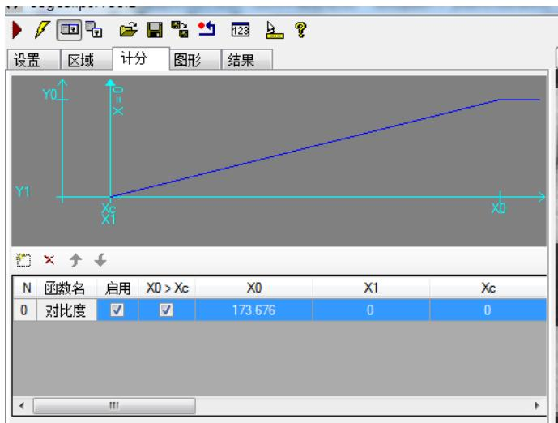

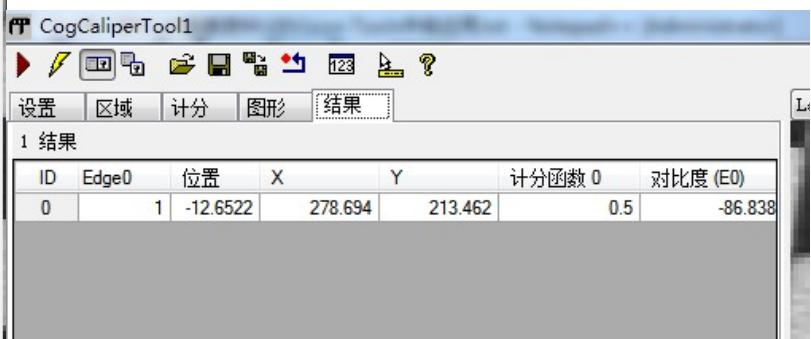

对比度计分时：X0表示最高得分1对应的对比度差值，X1表示最低得分0对应的对比度差值

Y0表示得分为1，Y1表示得分为0。

得分计算方式： 对比度值/设定的X0的值 得分 除出来的值大于1则按1

Eg：X0 设置为 100，

当对比度差值为 $\pm 5 0$ 时得分为0.5，

当对比度差值为 $\cdot$ 时得分为0.8，

当对比度差值为 $\cdot$ 时得分为0.2，

当对比度差值为0时得分为0，

当对比度差值为110时得分为1，

# 3. 下面所示代码片段的 Count 和 Area 分别代表什么意思？

double count $\mathtt { = 0 }$ ;

double area $\mathtt { = 0 }$

CogBlobTool blobtool $=$ mToolBlock.Tools[“CogBlobTool1”] as CogBlobTool;

Foreach(ICogTool tool in mToolBlock.Tools)

mToolBlock.RunTool(tool,ref message,ref result);

count=blobtool.Results.GetBlobs().Count;

area=blobtool.Results.GetBlobs()[0].Area;

Count 表示 CogBlobTool1 结果的斑点个数

Area表示 CogBlobTool1第1个(序号为0)结果的面积，也是最大的斑点的面积。

4.简述相机标定中 MotionScaling、CameraRMS、MotionSkew 的意义。

MotionScaling:XY 缩放误差

CameraRMS：标定误差，指所有的像素点和实际点的距离开平方跟的值 单位是像素MotionSkew：倾斜角度

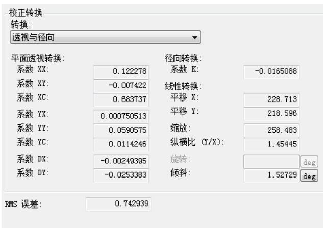

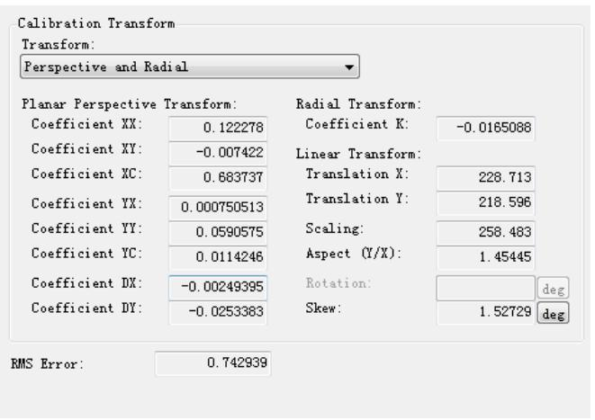

<table><tr><td>Property</td><td>Minimum</td><td>Value</td></tr><tr><td>imageSizeX</td><td>-</td><td>2448</td></tr><tr><td>imageSizeY</td><td>-</td><td>2048</td></tr><tr><td>PixelSizeX</td><td>-</td><td>0.016022</td></tr><tr><td>PixelSizeY</td><td>-</td><td>0.016012</td></tr><tr><td>PixelAspectRatio</td><td>-</td><td>1.000659</td></tr><tr><td>CenterX</td><td>-</td><td>13.258450</td></tr><tr><td>CenterY</td><td>-</td><td>-297.375812</td></tr><tr><td>CameraRotationX</td><td>-</td><td>179 887471</td></tr><tr><td>CameraRotationY</td><td>-</td><td>269 887471</td></tr><tr><td>FovX</td><td>-</td><td>39 799527</td></tr><tr><td>FovY</td><td>-</td><td>33 160427</td></tr><tr><td>CameraRMSError</td><td>-</td><td>0.202935</td></tr><tr><td>MotionScalingX</td><td>-</td><td>1.000066</td></tr><tr><td>MotionScalingY</td><td>-</td><td>1.000722</td></tr><tr><td>MotionAspect</td><td>-</td><td>1.000656</td></tr><tr><td>MotionSkew</td><td>-</td><td>-0.076749</td></tr><tr><td>MotionCapability</td><td>-</td><td>TranslationOnly2Axes</td></tr><tr><td>TrainedSteps</td><td>-</td><td>1</td></tr><tr><td>CalPlatePitchX</td><td>-</td><td>1</td></tr><tr><td>CalPlatePitchY</td><td>-</td><td>1</td></tr></table>

上势证作业

1、请使用以下组图PatMax_Counter_Demo.idb完成以下操作：  
①如下图所示，抓取轴承的滚轮数。（25分）  
②选择合适的工具，判定滚轮数是否有15个。（25分）

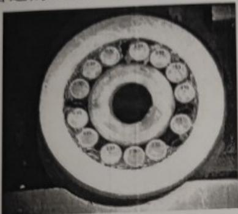

2.请使用图片L3F.idb完成以下操作：

④加下图求出物体和右边框的距离并添加到输出端。（15分）$\textcircled{1}$   
②计算灰色物体的面积和质心并输出到输出端。（15分）  
③检查灰色零件内部是否有黑色孔洞，如果有黑色空洞选择合适的工具将结果 $\textcircled{3}$

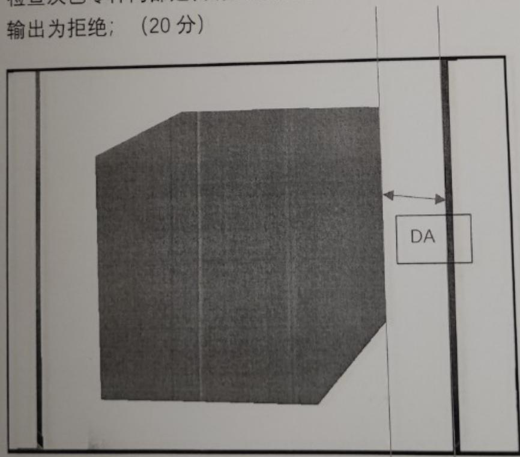

机试2题，没图，解题思路： 做模板，定位。Findline抓2边，Distancelineline测距并输出。斑点工具筛选灰色物体的面积及质心输出。

$\cdot$ 问：斑点工具设定多边形区域获取灰色物体内斑点信息，用结果分析工具根据斑点个数是否 $\cdot$ 来判定结果为拒绝，反正则接受。 也可以histogram工具检测平均灰度值/标准差信息在通过结果分析工具来判定结果为接受、拒绝。

PS：结果分析工具使用方法可以参考 机试题1例子

# 2022.9 等级考核题

1.VisionPro 工具块 4 中运行状态，分别是：__运行___、_警告____、 _禁用__、__接受  
2.DS 相机，图像采样间距越大，图像数据量越___小__、图像质量_越好____、  
3.Cognex Framework 支持和 SI 通信的方式有__TCP___、__IO__、当前 Framework3.3.1.0 版本支持__8__个端口  
4.VisionPro 工具集中拟合线工具的全称是___CogFitLineTool __、创造线段工具全称_CogCreateSegmentTool_  
5.灰度直方图工具经常在项目中被用到，灰度直方图的横轴(X轴)表示_灰阶____、纵轴(Y轴)表示__像素数__  
6.Checkboard 主要矫正_线性____、畸变和__非线性___、畸变。Npoint 标定校正_ _线性__、畸变。  
7.灰度直方图统计哪些信息最大值、最小值、__平均值___、_中值____、_方差____、__标准差___、等。

# 二、不定项选择题

1.调整哪儿些参数可以影响 CogPMAlignTool 运行时间( ABCD )

A.接受阈值 B 缩放 C 查找概数 D 极性

2.下列哪个是 Global Shutter(全局曝光)型号相机（A）

A.5000-20-G B. 5000R-14-G C.10MR-10-G D. 12MR-8-G

3.光学倍率公式正确的是（B）

A. 视野/像素数 B.CCD 芯片尺寸/FOV C.焦距/镜头通光孔径 D. Fov/焦距

4.影响检测精度的因素有？（ABCD）

A.视野 B相机像素 C图像质量 D视觉工具精度

5.一下工具用于测量类的是？AD

A.CogCaliperTool B.CogFitLineTool C. CogCreateLineTool D.CogDistanceSegmentSegmentTool

# 三、判断题

1.关于 Patmax 模式粒度，粗糙模式粒度必须小于等于精细模式粒度（X）  
2.Cognex 相机 CAM-CIC-5000-20-G，一秒内最多拍 20 张图片（Y）  
3.因物料上下表面存在4mm高度差，所以要选用高景深、低畸变远心镜头（Y）  
4.CogFIndCircleTool在其他参数相同的情况下，增加忽略点数可以降低工具的运行时间（Y）  
5.消除图像中细小黑色斑点，可以采用形态学中的开运算（Y）

# 四、简答题

1.硬件触发飞拍过程出现个别图像黑屏现象如何分析？请从现象来整理排查思路，至少4点(15分)黑屏意味着相机拍照了，只是光源未亮、触发不同步或者镜头被遮挡等原因导致。

$\cdot$ 机构运行到某个穴位时，镜头被物体遮挡拍照导致。  
$\textcircled{2}$ 光源未亮导致拍照是黑的。  
$\textcircled{3}$ 光源触发和相机拍照不同步，拍照是黑的。  
$\textcircled{4}$ 光源触发线磨损或松动，导致个别穴位时线接触不良，光源未亮

2.简述 CogPMAlignTOol，CogFindlineTool，CogBlobTool 工具的作用及详细的使用步骤 15 分参考：

CogPMAlignTOol：可以计数、可以做模板匹配。

$\textcircled{1}$ 抓取训练图像，切换到训练图像。  
$\textcircled{2}$ 在训练图像内调整训练区域，框选出需要的特征作为模板，设定中心原点的位置。  
$\cdot$ 根据需求选择是否开启角度、缩放等参数。  
$\cdot$ 点击训练，点击运行查看结果。  
$\textcircled{5}$ 根据需求可以用掩膜、建模等方式做模板，没有结果可以修改、接受阈值、对比度阈值、角度、缩放、概数、极性等参数来获取结果。

CogFindlineTool：可以获取一个线段、一条直线。

$\cdot$ 调整卡尺区域，将抓边工具蓝线和抓取位置重合  
$\cdot$ 设定相应的卡尺数量、搜索长度、投影长度、搜索方向、搜索极性、忽略点数等。

$\textcircled{3}$ 默认对比度计分、也可添加位置等计分。  
$\cdot$ 点击运行查看结果。

CogBlobTool：可以获取斑点的数量、面积等信息。

$\cdot$ 设定搜索区域(全图或部分区域)、  
$\textcircled{2}$ 设定图像分割模式eg：硬阈值固定、动态、软阈值等   
$\cdot$ 设定搜索极性：白底黑点、黑底白点   
$\cdot$ 点击运行查看找到的斑点结果，根据需要做出斑点结果XY面积等的筛选

3.如下图，左边原始图像，转为右边图像，分辨使用了什么形态学操作，并说明形态学调整的作用？

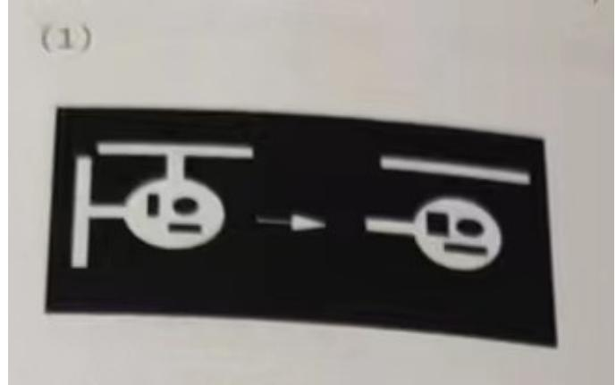

1.水平(宽度)方向腐蚀操作。

以结构元中所有像素灰度值的最低值，替换中心像素的灰度值。

作用：减小斑点，增大空洞。

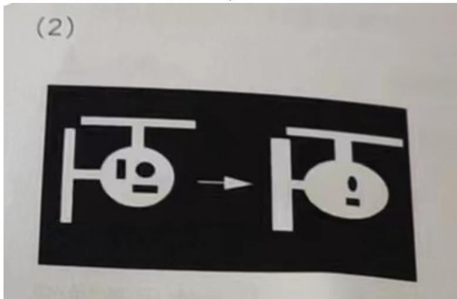

2.水平(宽度)方向膨胀操作

以结构元中所有像素灰度值的最高值，替换中心像素的灰度值。

作用：减小空洞，增大斑点。

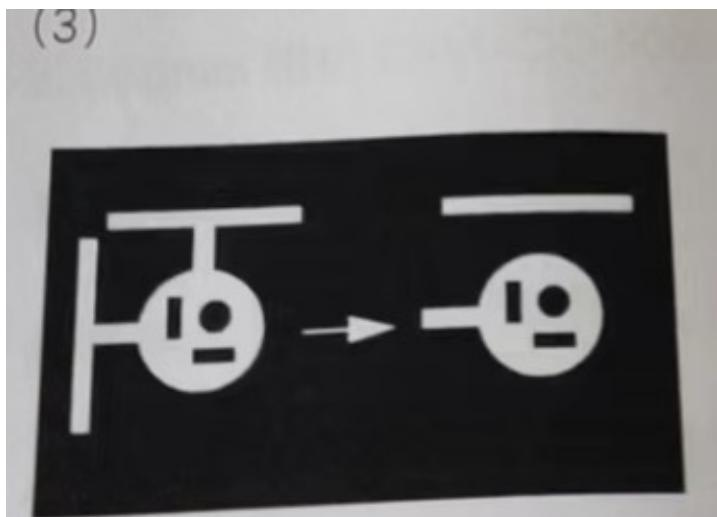

3.水平方向开运算。先进行腐蚀运算，再进行膨胀运算。

作用：维持空洞，去除斑点。

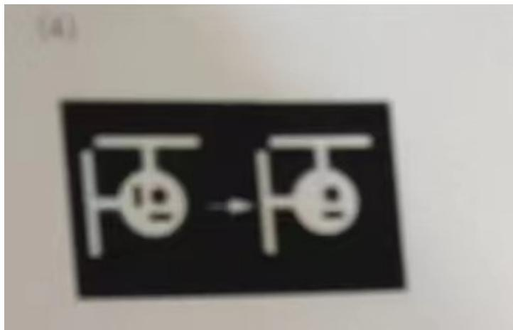

4.水平方向闭运算。先进行膨胀运算，再进行腐蚀运算。

作用：维持斑点，去除空洞。

以上四种处理运算可以下图尝试一下。

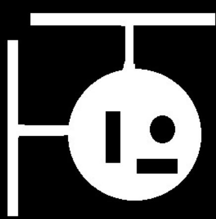

# 4 个机试题

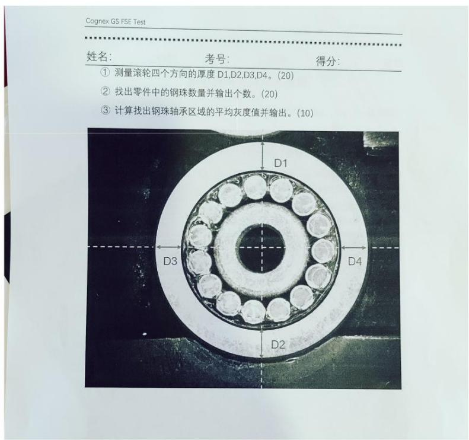

第一问：四个卡尺工具测四个宽度。D1234或者抓圆工具抓取最外层轮廓，用圆心创造两条直线，直线和滚轮的两个边的交点，分别计算距离（点点)。

第二问：PMAlign工具直接求钢珠数量。并输出，输出方式ToolBlock可以，结果分析工具也可以。

第三问：Histogram工具设置搜索区域抓取钢珠轴承区域，测量平均灰度值Mean并输出。

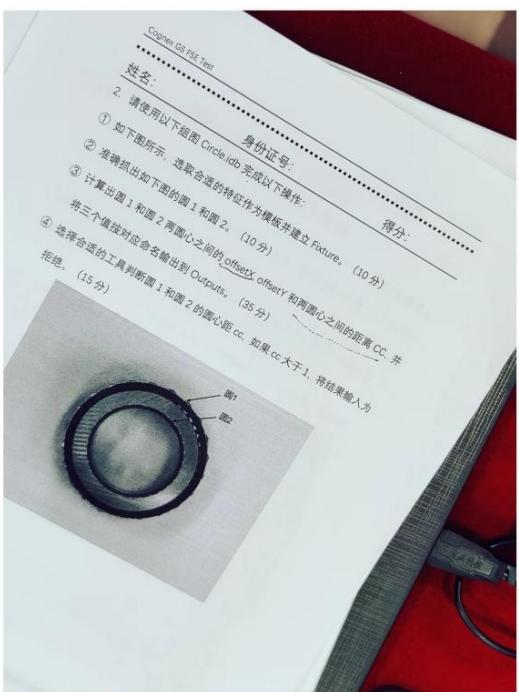

1.抓取特征做模板。  
2.抓两个圆。  
3.OffsetX和offsetY:需要在结果分析工具中，将圆1x-圆2x得到offsetx。圆1y-圆2y得到offsety。  
CC：点点测距工具就行。  
4.还是结果分析工具。添加1个输入端输入圆1圆2的圆心距。添加个表达式，判断这个值是否大于  
1，大于则输出拒绝。

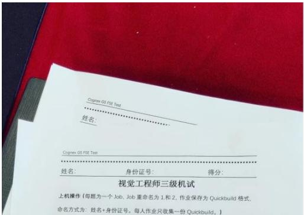

#

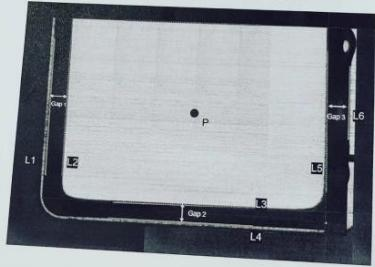

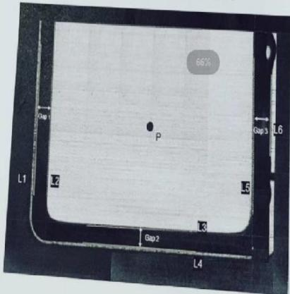

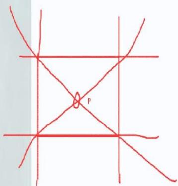

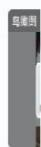

式为：姓名+身份证号。每人作业只收集一份Quickbuild。）

$\textcircled{1}$ 测量金属尺宽度D1 (15)   
$\textcircled{2}$ 测量S1区域镂空的总面积（白底黑孔）(15)  
$\textcircled{3}$ 判断①②的数据，并添加终端输出。（CogDataAnalyol.Sec:D80,S00）（）

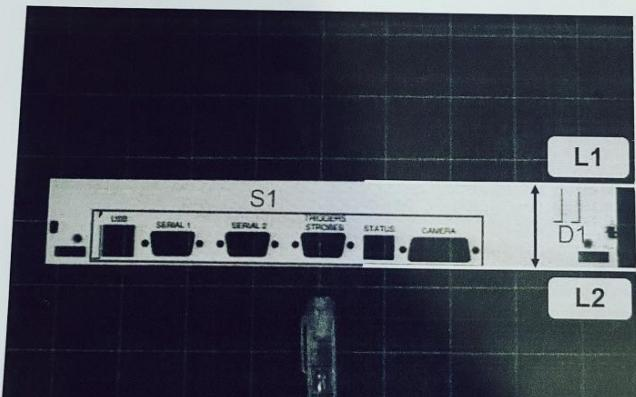

注意保存格式为Cogjob

第一间：卡尺工具测量D1或者两个抓边工具加上测距工具测量。

第二问：斑点工具，框选S1区域，白底黑点极性，输出每个结果的Area然后输入到结果分析工具里相加求总面积。

第三问：添加数据分析工具，设定

Spec: D1 $\mathbf { < 8 0 }$

S>5000

$\textcircled{1}$   
$\textcircled{2}$   
$\textcircled{3}$   
$\textcircled{4}$

要求保存Quickbuild格式，且2个机试题都各自保存一个Cogjob。

在Cogjob2中完成下列操作。

①抓线1圆1，添加Fixture工具，将圆坐标给fixture工具，Line1的角度给Fixture工具。  
$\textcircled{2}$ 抓圆2，测点点距离(圆1圆2圓心之间的。）  
$\textcircled{3}$ 斑点工具检测圆2区域内斑点面积输出Area终端。   
$\textcircled{4}$ 等边三角形，可以Findline抓取3个边，Intersection求三个交点，用点平分线工具得到三个点平分线，任意两个边的交点就是中点(角平分线的交点)。

也可以三个边三个交点工具，然后过顶点做垂线，垂线的交点也是角平分线的交点(中点)

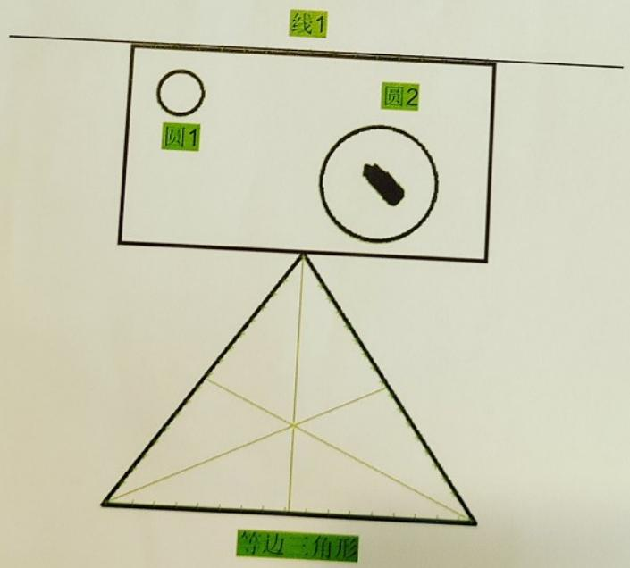

$\textcircled{1}$   
  
$\textcircled{2}$   
$\textcircled{3}$   
$\textcircled{4}$   
$\textcircled{5}$

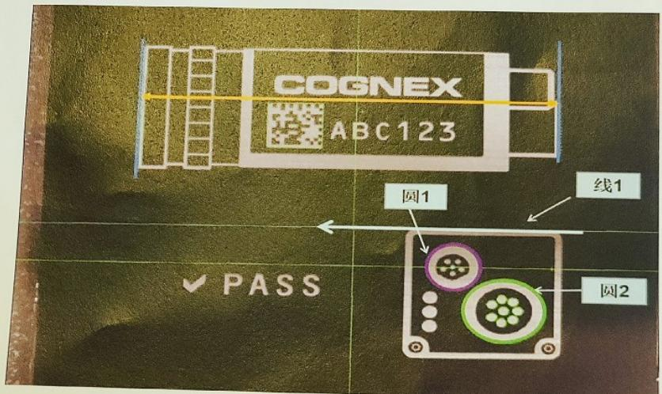

$\textcircled{1}$ ，先加载标定片图片，添加CogCalibCheckBoardTool工具，根据标定片规格设置相应参数完成“标定”。  
$\textcircled{2}$ 加载正常图片，先输入给标定工具，再输出给别的工具用。添加PMAlign工具、Fixture工具。测量相机宽度，按照图上要求需要Findline+Findline+DistanceSegmentSegmentTool测距并输出到CogToolBlock。  
③添加斑点工具，设置搜索区域为圆2位置，黑底白点，筛选出需要的斑点，输出count终端。  
④用ID工具读取二维码内容，并输出string字符串给1CogToolBlock。  
$\textcircled{5}$ Findline抓取Line1，Findcircle抓取圆1，然后添加创造垂线工具，经过圆1圆心X坐标再往左偏移1mm的位置创造垂直于Line1的垂线。

# 2023.12.17 等级考核试题

1. 我们今年使用的视觉软件与机构进行通讯，最常用的是___TCP ___和___IO____，最多支持_ __8____个服务器连接

2.CheckerBoard 线性标定校正的五种自由度是平移、___缩放、纵横比、旋转、倾斜、平移

3.使用Caliper 工具，在选择单边模式时，边缘0极性可选择___由暗到明、由明到暗、任何极性 _3 种方式

4.图中是训练的模板，训练参数粗糙为8，精细为 5，则模板训练的特征中黄色线条长度为 _8 _个像素 绿色线条的长度为_ _5 _个像素

5.经过表达式 $a { = } 2 { + } 1 { > } 5 ? 0 { : } 1$ 的运算，变量 a 的最终值是__1  
6，CogHistogramTool 的 LastRun.Histogram 里面 X 轴代表的是____灰阶_

# Y轴代表的是 _像素数

# 二、不定项选择题， (每空 2 分，共 20.分)

1.关于 CogFindLineTool 工具说法正确的？( AC )

A.适当设置忽略点数可以抓边，更少收到图像噪音干扰。  
B.计分函数只有两种。  
C.对比度阈值设置小于边缘两侧的灰度差。  
D.过滤一半像素，捕捉的边缘越锐利，过滤一般像素的值要设置的越高。

# 2.下面哪些是镜头的配件（AB ）

A. 接圈 B.滤光镜、C.偏振片、D.感光芯片

3.CogCalibCheckerboardTool 作用是 （ BC ）

A.计算灰度、 B。校正畸变 C.建立物理坐标与像素坐标的对应关系。D.建立坐标空间。

4.下列工具，那些可以旋转图像。（ A ）

A.CogIPOneImage B.CogIMAGEConvertTool C.CogBlobTool D.CogCopyRegionTool

5.模板工具运行参数中使用模式粒度限制，当颗粒度较大时（ BCD ）

A.适合精确定位。 B.特征信息粗糙。 C.特征信息少。 D.运行速度相对较快。

6.CogCaliper 工具实体箭头代表（ D ）

A.旋转手柄、B。投影方向。C 极性方向。D.扫描方向。

7.在 CogLineMax 中，边缘极性有哪几种（ ABCD ）

A.明到暗 B。暗到明 C..任意极性、D。混合。

8.CogCalibCheckBoardTool 校正中的基准符号可以选择为( ABC D )

A.None B.StandardRectangle C .DataMatrix D.DotGndAxes

9.软件界面 CameraSetting 可以设定（ ABC ）

A.相机亮度、 B相机对比度。、 C触发方式、 D。曝光时间。

10.现场中影响图像质量的因素有哪些？ （ AB ）

A. 光源亮度、 B.光源的入射角度。 C。机械手的精度。 D。选择的抓取工具。

# 三、判读题

1.通过适当减少卡尺数量，调小搜索区域等方法降低处理时间。（ Y ）

2.CoImageConvertTool 工具可以将彩色图转换为黑白图。（ Y ）

3.模板工具的颗粒度单位是 mm（ X ）

4.在 CogOneImageTool 工具，灰度学形态调整的宽和高只能设定为奇数（ N ）

5.图像亮度不够可以通过调大光圈、增加光源亮度、延长曝光时间等方式进行改善（Y ）

# 四、简答题

1. 简述相机连接失败的可能原因以及措施（至少 4 条）

参考以下几个方面：

硬件坏：网线、相机、板卡、网口

电脑端口：巨帧数据包、防火墙、杀毒软件、eBus选项

相机IP错 未供电 等

2. 现场维护车间设备贴装不稳定，试分析原因并写出找问题过程。（至少3点。）

参考以下几个方面：

拍照时机构未停稳，，拍照坐标不对、，机构轴松动 精度不够导致每次拍照位置都不一样、曝光或打光不合适，抓边不稳定。 模板匹配不稳定，抓边不稳定。

排查相机或镜头是否松动等。

3. 简述下面代码中序号 1-5 的含义。 (15 分)

graphicCollection.Clear();1. 翻译：清除所有的显示（文本、点、圆等等）

mToolBlock.Outputs["CenterX"].Value ${ \ : : = 9 9 9 . 9 }$ ;

mToolBlock.Outputs["CenterX"].Value $= 9 9 9 . 9$ ; 2. 翻译：将输入输出里输出端 centery 的值附为 999.9

CogIPOneImageTool processing_Fin $\mathbf { \tau } =$ mToolBlock.Tonla["CogIPOneImageTool_Fine"]

processing_Fin.Run();3. 翻译：单次运行一下 CogIPONEimage 工具

CogCircularAnnulusSection hist_cir $=$ new CogCircularAnnulusSection();

hist_cir.SelectedSpaceName=” $@$ \\lCheckerboardCalibration\\Fixture_ImageUnify"; 4.

翻译：将 hist_cir 的命名空间改为@\\lCheckerboardCalibration\\Fixture_ImageUnify

hist_cir.CenterX=(double)pma_FlexMoudle.Results[j].Getpose().TranslationX;

hist_cir.CenterY=(double)pma_FlexMoudle.Results[j].Getpose().TranslationY;

hist_cir.Radius $\ d = 0 . 4 5 ; \ d$ . 翻译：将 hist_cir.的半径赋值为 0.45

# 12.7 下午部分笔试题

# 填空题：

1.CogCalibCheckboardTool 工具主要校正__线性_ ___畸变和____非线性_____畸变。

2.使用 Caliper 工具，在选择单边模式时可以使用的三种函数是：____对比度_ _位置 _PositionNeg_

3.下图是一个训练模板，Current.TrainImaeg 中绿色线条长度是___2___个像素，黄色线条长度是 _5__个像素。 粗糙值为

# 5， 精细值为2

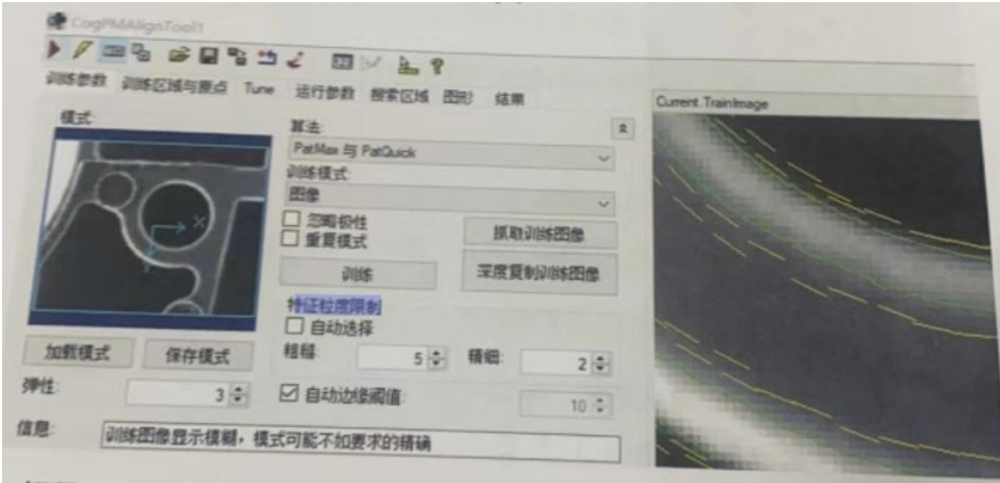

4.解释 CogIpOneImageTool 中参数的含义：

翻转/旋转：翻转和旋转0-270°

加/减常亮：直接在当前图像的灰度值基础上去加减一个值后输出

# 乘以常数：整体变亮变暗等

5.下图得到的结果中，其结果为弧度的是 _double A=CogMisc.DegToRad(5);

double A=CogMisc.DegToRad(5);

double B=CogMisc.RadToDeg(5);

6.像元深度是10位的相机，输出的灰度等级为___1024 _级。Eg： 8 位是 256， 9 位 512，10 位 1024  
7. CogHistogramTool 的 LastRun.Histogram 里面 X 轴方向代表的是_灰阶__,,Y 轴方向代表的是__像素数  
8. 假 设 一 相 机 型 号 为 Cam-CIC-5000R-14-G ， 其 分 辨 率 为 $2 5 9 2 ^ { * } 1 9 4 4$ ， 视 野 为 $4 0 \mathrm { m m } ^ { * } 3 0 \mathrm { m m }$ ， 此 时该相 机 像 素 精 度 为_0.0154mm/pixel__,（带单位）

# 二、不定项选择题

1.影响检测精度的因素有哪些？( ABC )

A.像素精度

B.图像质量

C.视觉工具精度

D.待测工件的大小。

2.使用 CogCopyRegionTool 可以对指定区域( AC )

A.灰度填充

B.空间变换

C.像素复制

D.数据计算。

3.关于镜头的描述，下面那一个是正确的。（ BC ）

A.M放大倍率 $: =$ 像距/视场，B.M放大倍率 $\mathrm { \langle = }$ 芯片尺寸/视场

C.M放大倍率 $:$ 像距/物距，D.M放大倍率 $\mathrm { \langle = }$ 芯片尺寸/物距

4.以下哪些场景不适合 CogBlobTool 工具（ AD ）

A.低对比度

B.特征没有重叠区域

C.图像效果很好

D.背景干扰特征多。

5.下列说法正确的是(

AD

A.CogFindLine 工具可以抓取边缘对。  
B.CogPMAlignTOol 可以一次训练多个模板。

C.CogIPOneImageTool 可以对图像高通滤波处理。  
D.CogIMageConvertTool 可以将彩色图输出转为灰度图。

6.光圈值 $\mathsf { F } \boldsymbol { = }$ （C ）

A.视野/像素数

B.图像上耽搁像素所代表的毫米值

C.焦距/镜头通光孔径

D.光电转换时间

7.CogResultsAnalysi

sTool中有那些运算符(

ABD

A.加减

B.平方根

C.向量相乘

D.大于等于

8.下列说法正确的是（ BD ）

A.CogCaliperTool 抓取单个边缘时可以用 PositionNormNeg 计分方式  
B.CogIPOneImage 可以对图像进行旋转 ${ 1 8 0 ^ { \circ } }$   
C.通过调节镜头的焦距大小，可以控制镜头的入光量。  
D.CogImageFileTool 可以打开 cdb 格式的图像集。

9.下列哪些方式可以使得到的图像更亮（ BCD ）

A.增大光圈值

B.增加光源亮度

C.延长曝光时间

D.增大相机增益

10.现有一相机，芯片长边尺寸 $8 . 4 \mathsf { m m }$ ，分辨率 $2 4 4 8 ^ { \ast } 2 0 4 8$ ，若选用 $3 5 \mathsf { m m }$ 定焦镜头，视野长边要达到 $4 2 \mathsf { m m }$ ，镜头的工作距离约为（ B ）

A.165mm

B.175mm

C.185mm

D.195mm

# 三、判断题

1.CogLineMaxTool 不支持掩膜图像（ N ）  
2.同一物距，CCD 尺寸不变，像距越大，Fov 越小（ Y ）  
3.使用 CogIDTool 不能同时读取不同类型的二维码（ Y ）  
4.CogHistogramTool 工具，使用高斯采样器可以使图像更加锐化（ N ）、  
5.CCD 对比 CMOS 的优势有：噪声低、耗电量高、技术较成熟（ N ）

# 四、简答题

1.写出至少5类造成抓边异常的原因以及对应的解决方法。

$\cdot$ 即使模板匹配好，但是有些边的位置相对于模板特征而言不太固定，需要合理设置大一些抓边工具的搜索长度，以保证这条边始终在抓边工具的搜索范围以内。  
$\textcircled{2}$ 图片亮度太暗或过曝等，边不存在导致抓边失败，调整合适曝光。  
$\textcircled{3}$ 物料本身边缘对比度不佳，适当降低对比度阈值。  
$\cdot$ 物料边缘凹凸不平，有凸起，凹陷等，可以适当忽略一些点数，把不稳定的因素排除掉。  
$\textcircled{5}$ 图像清晰度变的稍差，或者边缘黑白过滤的像素数比较多，可以适当增加抓边工具的过滤一半像素值。

2.通过下列脚本回答问题：”

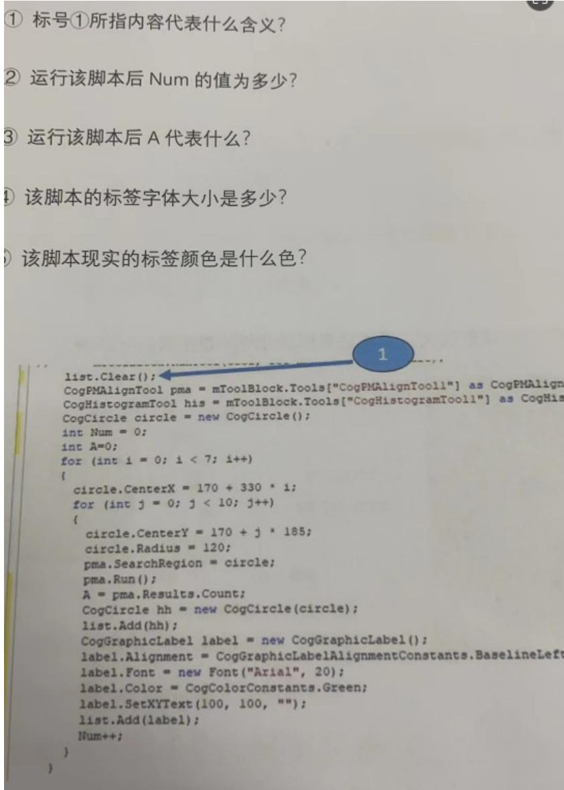

1. 清除 list 集合里所有内容  
2. Num 值为 7  
3. A代表模板工具结果的数量  
4. 字体大小为 20  
5. 标签颜色是绿色。

3.影响景深的因素有哪些？请描述这些因素和景深的关系

焦距越短，景深越大；

光圈F值越大，光圈越小，景深越大；

工作距离越远，景深越大；

相机芯片像元越大景深越大；

接圈和扩倍器使得景深变小。

4.相机标定时RMS误差过大，请阐述合理的分析排查步骤

# 视觉问题：

1>软件数据未配置OK，重新调试，调试OK后重新标定

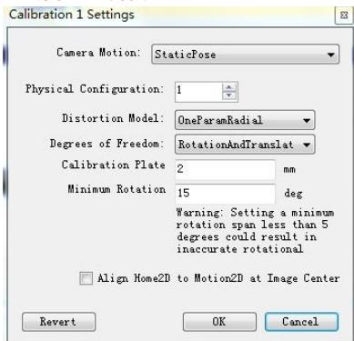

$\cdot$ 相机FOV或者焦距未调试OK，重新调试，OK后重新标定。  
$\cdot$ 图片过曝或者过暗，调节曝光参数，OK后重新标定。

$4 >$ 标定工具有磨损，或者翘边，更换标定工具重新标定。

# 机构原因：

$\harpoonleft$ 机械手走位误差较大，或者旋转角度误差大，让OEM调整后重新标定。  
$^ { 2 > }$ 机台未打地脚或者未測水平，至机台不平整，让OEM改善后重新标定。  
$\cdot$ OEM原因至标定无法正常运行，检查改善后重新标定。

机试题1：

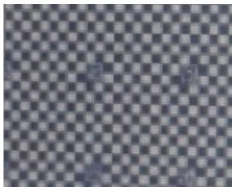

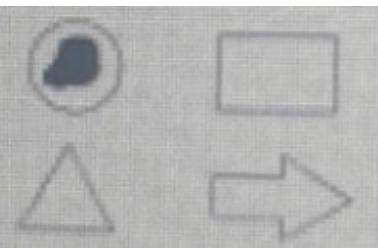

关于这个图的考点有： 如果提供的有标定片的图片，需要先将标定片图片加载进去，添加

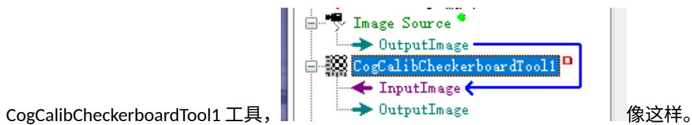

然后用标定片图片及标定工具进行”标定”，

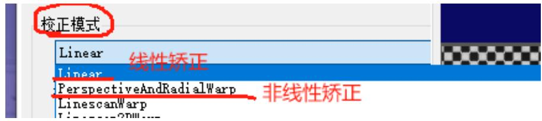

矫正模式：选第一个，第二个都可以。一般提供的图片是不存在切向畸变的， 选第一个就够用。

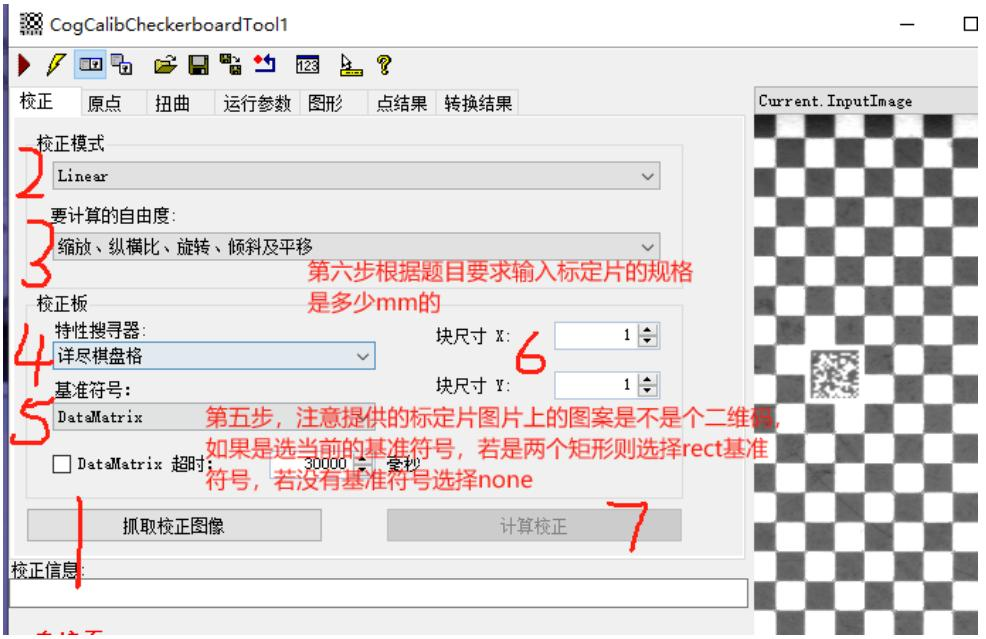

最后第七步点完计算矫正之后切换到转换结果选项，看看RMS误差，如果是零点几是正常的。若是比较大，考虑更换一下矫正模式改为非线性矫正。再点击计算矫正看 RMS 误差。

标定工具校正后，再加载要进行操作的机试图片。图片先进标定工具，再由CogCalibCheckerboardTool1工具输出的图像再给后边的工具用，注意后边的工具都要用标定工具输出的图像，这样图像的单位才是 mm 而不是像素。

例如：

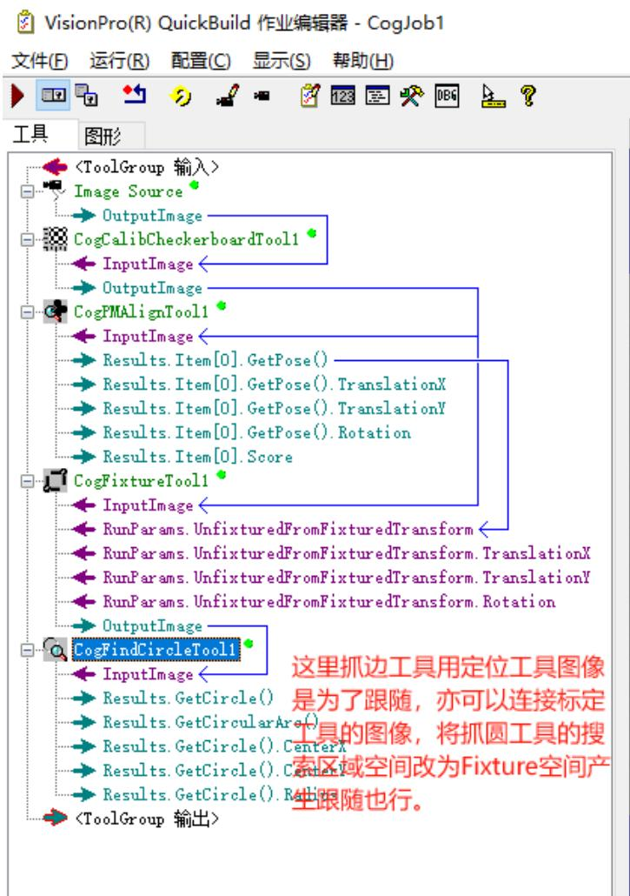

注意： 经过标定工具转换后图像是mm单位，所以模板的训练框尺寸、抓边圆工具的卡尺区域默认会很大， 进行修改下搜索长度、投影长度之类的就行。

接着，抓线、圆、椭圆、测距、求角度、求交点、半径、面积、灰度值等等。

机试题2：

# 参考以下考核方向：

上机操作（作业保存为 Job 格式,将所求结果输出到一个 block 中，命名方式为：姓名 $^ +$ 身份证号。每人作业只收集一份 Job。） 这里要求结果输出到一个 Block 指的是用 CogToolBlock 收集结果。，要求保存

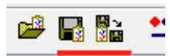

# Cogjob 格式的

1.请使用Image1图片完成以下操作：

求抓取内外 2 个圆，并求 2 个圆的圆心距 cc（20 分）

用 OCR 工具解析下方字幕并输出 ResultString（20 分）。

求大圆与“STABRUCKS”的上边线 L1 的距离 AB（20 分）

过大圆圆心 O 做 L1 的垂线 L2，L2 与小圆相交与点 C 过圆心 O 做 L2 的垂线 L3，L3 与小圆相交与点 D，求∠OCD 的角度 Angle（20 分）

用 CogResultsAnalysisTool 求▲OCD 的面积（面积=1/2 *长*宽）。（20 分）

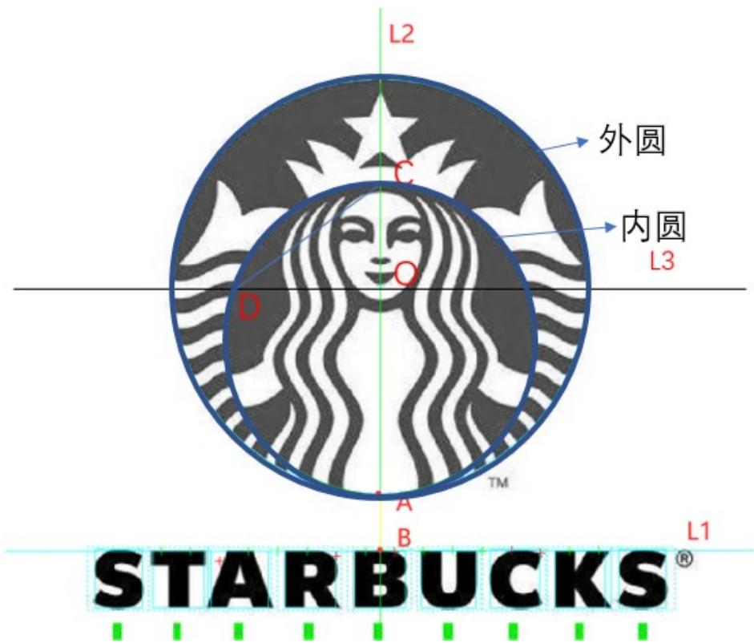

1.VisionPro 工具块 4 中运行状态，分别是：__运行___、_警告_ _禁用__、 _接受  
2.DS 相机，图像采样间距越大，图像数据量越___小__、图像质量_越好____、  
3.Cognex Framework 支持和 SI 通信的方式有__TCP___、__IO__、当前 Framework3.3.1.0 版本支持__8__个端口  
4.VisionPro 工具集中拟合线工具的全称是___CogFitLineTool __、创造线段工具全称_CogCreateSegmentTool  
5.灰度直方图工具经常在项目中被用到，灰度直方图的横轴(X 轴)表示_灰阶____、纵轴(Y 轴)表示__像素数__  
6.Checkboard 主要矫正_线性____、畸变和__非线性___、畸变。Npoint 标定校正___线性__、畸变。  
7.灰度直方图统计哪些信息最大值、最小值、__平均值___、_中值____、_方差____、__标准差___、等。

# 二、不定项选择题

1.调整哪儿些参数可以影响 CogPMAlignTool 运行时间( ABCD )

A.接受阈值 B 缩放 C 查找概数 D 极性

2.下列哪个是 Global Shutter(全局曝光)型号相机（A）

A.5000-20-G B. 5000R-14-G C.10MR-10-G D. 12MR-8-G

3.光学倍率公式正确的是（B）

A. 视野/像素数 B.CCD 芯片尺寸/FOV C.焦距/镜头通光孔径 D. Fov/焦距

4.影响检测精度的因素有？（ABCD）

A.视野 B相机像素 C图像质量 D视觉工具精度

5.一下工具用于测量类的是？AD

A.CogCaliperTool B.CogFitLineTool C. CogCreateLineTool D.CogDistanceSegmentSegmentTool

# 三、判断题

1.关于 Patmax 模式粒度，粗糙模式粒度必须小于等于精细模式粒度（X）  
2.Cognex 相机 CAM-CIC-5000-20-G，一秒内最多拍 20 张图片（Y）  
3.因物料上下表面存在4mm高度差，所以要选用高景深、低畸变远心镜头（Y）  
4.CogFIndCircleTool 在其他参数相同的情况下，增加忽略点数可以降低工具的运行时间（Y）  
5.消除图像中细小黑色斑点，可以采用形态学中的开运算（Y）

# 四、简答题

1.硬件触发飞拍过程出现个别图像黑屏现象如何分析？请从现象来整理排查思路，至少4点(15分)黑屏意味着相机拍照了，只是光源未亮、触发不同步或者镜头被遮挡等原因导致。

$\cdot$ 机构运行到某个穴位时，镜头被物体遮挡拍照导致。  
$\textcircled{2}$ 光源未亮导致拍照是黑的。  
$\textcircled{3}$ 光源触发和相机拍照不同步，拍照是黑的。  
$\textcircled{4}$ 光源触发线磨损或松动，导致个别穴位时线接触不良，光源未亮

2.简述 CogPMAlignTOol，CogFindlineTool，CogBlobTool 工具的作用及详细的使用步骤 15 分参考：

CogPMAlignTOol：可以计数、可以做模板匹配。

$\cdot$ 抓取训练图像，切换到训练图像。  
$\cdot$ 在训练图像内调整训练区域，框选出需要的特征作为模板，设定中心原点的位置。  
$\textcircled{3}$ 根据需求选择是否开启角度、缩放等参数。  
$\textcircled{4}$ 点击训练，点击运行查看结果。  
$\cdot$ 根据需求可以用掩膜、建模等方式做模板，没有结果可以修改、接受阈值、对比度阈值、角度、缩放、概数、极性等参数来获取结果。

CogFindlineTool：可以获取一个线段、一条直线。

$\cdot$ 调整卡尺区域，将抓边工具蓝线和抓取位置重合  
$\cdot$ 设定相应的卡尺数量、搜索长度、投影长度、搜索方向、搜索极性、忽略点数等。  
$\textcircled{3}$ 默认对比度计分、也可添加位置等计分。  
$\textcircled{4}$ 点击运行查看结果。

CogBlobTool：可以获取斑点的数量、面积等信息。

$\cdot$ 设定搜索区域(全图或部分区域)、  
$\cdot$ 设定图像分割模式eg：硬阈值固定、动态、软阈值等   
$\cdot$ 设定搜索极性：白底黑点、黑底白点

④点击运行查看找到的斑点结果，根据需要做出斑点结果XY面积等的筛选

3.如下图，左边原始图像，转为右边图像，分辨使用了什么形态学操作，并说明形态学调整的作用？

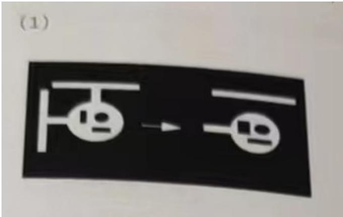

1.水平(宽度)方向腐蚀操作。

以结构元中所有像素灰度值的最低值，替换中心像素的灰度值。

作用：减小斑点，增大空洞。

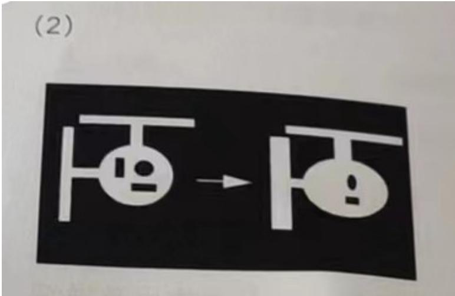

2.水平(宽度)方向膨胀操作

以结构元中所有像素灰度值的最高值，替换中心像素的灰度值。

作用：减小空洞，增大斑点。

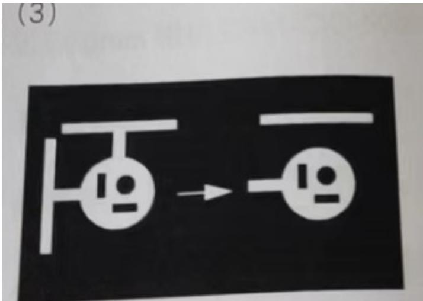

3.水平方向开运算。先进行腐蚀运算，再进行膨胀运算。

作用：维持空洞，去除斑点。

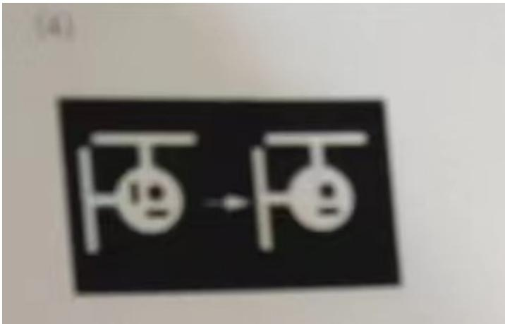

4.水平方向闭运算。先进行膨胀运算，再进行腐蚀运算。

作用：维持斑点，去除空洞。

# 一、填空

1.抓边工具的结果 已使用列表的 True和False分别代表：找到并参与线拟合的点被忽略点数忽略的点或未找到的点  
2.Checkerboard 五种自由度： 平移 旋转 缩放 倾斜 纵横比  
3.PMAlign工具训练模板的特征中，弹性的单位是：像素。弹性 越大 对特征的形变容忍度越大  
4.卡尺工具的三个计分函数分别是：对比度 位置 PositionNeg 。  
5.抓边工具两种边缘模式是：单个边缘 边缘对  
6.CogIPoneImageTool中常用的几种操作：加/减常量 卷积3x3 翻转/旋转 3x3中值 丢失像素 乘以常数 像素映射  
7.CogHistogramTool 工具结果中部分数据含义：

Minimum：最小值 灰度最大值

Maximum：最大值 灰度最小值

Median：中值 比例刚过 $50 \%$ 对应的灰度值

Mode：模式 灰度值占比最高的像素的灰度值

Mean：平均值 灰度平均值

Std. Dev.:标准差 灰度标准差

Variance:方差 灰度方差

Samples:示例 区域内总像素数

# 五、选择

6. 关于卡尺工具说法正确的：  
E. 适当设置忽略点数可以让抓边更少受到图像噪音的干扰  
F. 边缘极性有2种(由暗到明和由明到暗)   
G. 对比度阈值设置要小于目标边缘两侧的灰度值  
H. 过滤一般像素：捕捉的边缘越锐利，此值设置的越高  
7. LineMax工具边缘极性有哪几种  
B. 由暗到明 B。由明到暗 C。任意极性 D。混合  
8. Fixture 工具的作用：  
B. 最小灰度值 B。建立坐标空间 C。解码信息 D。斑点面积  
9. 使用 CogCopyRegionTool 可对指定区域进行哪些操作  
B、灰度填充 B、像素复制C、空间转换 D、数据计算  
10. PmAlign 工具输出结果数据(X、Y、Angle)是在那个空间下 B  
B. 像素空间 B、输入图像空间C、训练区域选取空间、D、搜索区域选取空间

# 六、判断题

6. PMAlign工具可以通过建模、掩膜等方法创建模板 Y  
7. Caliper 工具只有对比度、位置和 PositionNeg 三种计分函数 N

8. CogCalibNpointToNPointTool 可以校正线性畸变和非线性畸变 N   
9. 在 Blob 工具中，可以通过设置最小面积对斑点结果进行过滤 Y  
10. 图像亮度不够可以通过减小光圈值，增加光源亮度，延长曝光，加大增益等方式进行 Y七、简答题  
4. PMAlign 工具中结果的 Fit Error(拟合误差)、Coverage(范围)、Clutter(杂斑) 的意义

Fit Error(拟合误差)：测量已找到的样板与已训练样板的特征的匹配度(不考虑缺失的特征)，范围为零(完美拟合)至无穷大(拟合很差)。

Coverage(范围)：在搜索结果中找到的已训练样板中特征的百分比，范围为 0.0~1.0，仅用于PatMax 算法。

Clutter(杂斑)：结果中显示的无关特征数除以已训练模板中的特征数，范围为零至无穷大，仅用于 Patmax 算法。

5. Caliper 工具中，使用对比度计分时，X0X1Y0Y1 分别有什么作用，如下图设置，如果某个边缘对比度为 100，他的得分是多少？

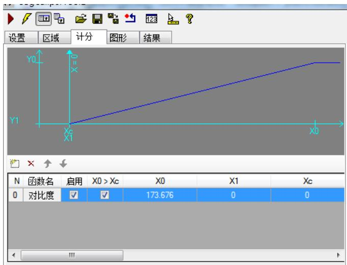

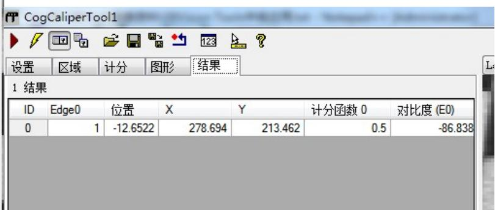

对比度计分时：X0表示最高得分1对应的对比度差值，X1表示最低得分0对应的对比度差值Y0表示得分为1，Y1表示得分为0。

得分计算方式： 对比度值/设定的X0的值 $\cdot$ 得分 除出来的值大于1则按1

Eg：X0 设置为 100，

当对比度差值为 $\cdot$ 时得分为 0.5，

当对比度差值为 $\pm 8 0$ 时得分为0.8，

当对比度差值为 $\cdot$ 时得分为0.2，

当对比度差值为0时得分为0，

当对比度差值为110时得分为1，

6. 下面所示代码片段的Count和Area分别代表什么意思？

double count $\mathtt { = 0 }$ ;

double area $\mathtt { = 0 }$

CogBlobTool blobtool $=$ mToolBlock.Tools[“CogBlobTool1”] as CogBlobTool;

Foreach(ICogTool tool in mToolBlock.Tools)

mToolBlock.RunTool(tool,ref message,ref result);

count=blobtool.Results.GetBlobs().Count;

area=blobtool.Results.GetBlobs()[0].Area;

Count 表示 CogBlobTool1 结果的斑点个数

Area表示 CogBlobTool1第1个(序号为0)结果的面积，也是最大的斑点的面积。

4.简述相机标定中 MotionScaling、CameraRMS、MotionSkew 的意义。

MotionScaling:XY 缩放误差

CameraRMS：标定误差，指所有的像素点和实际点的距离开平方跟的值 单位是像素

MotionSkew：倾斜角度

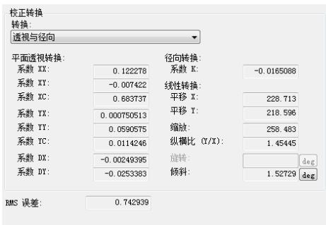

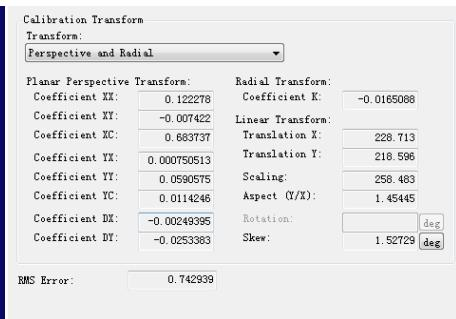

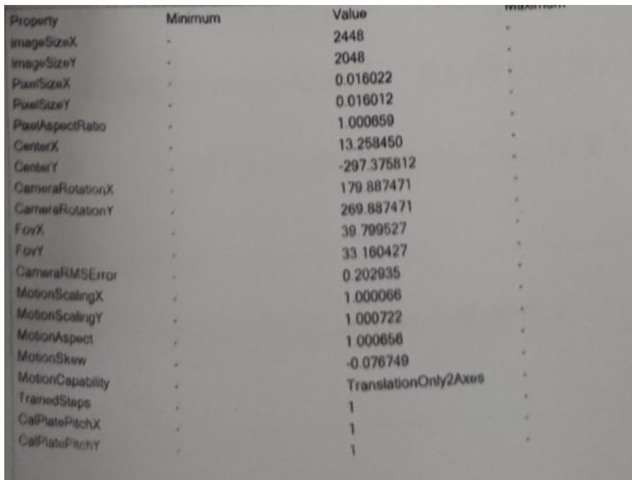

.请使用以下组图PatMax_Counter_Demo.idb完成以下操作：

1如下图所示，抓取轴承的滚轮数。（25分）  
②选择合适的工具，判定滚轮数是否有15个。（25分）

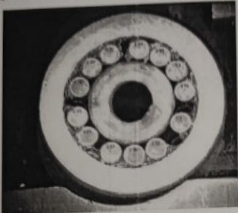

2.请使用图片L3F.idb完成以下操作：

①如下图求出物体和右边框的距离并添加到输出端。（15分） $\textcircled{1}$   
②计算灰色物体的面积和质心并输出到输出端。（15分） $\textcircled{2}$   
③检查灰色零件内部是否有黑色孔洞，如果有黑色空洞选择合适的工具将结果 $\textcircled{3}$

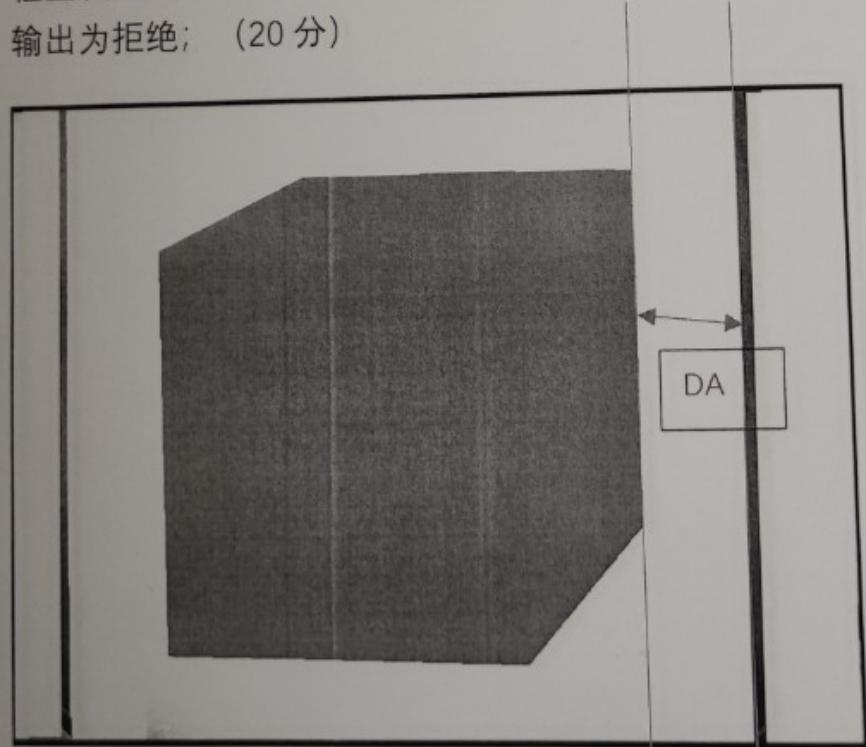

机试 2 题，没图，解题思路： 做模板，定位。Findline 抓 2 边，Distancelineline 测距并输出。斑点工具筛选灰色物体的面积及质心输出。

$\textcircled{3}$ 问：斑点工具设定多边形区域获取灰色物体内斑点信息，用结果分析工具根据斑点个数是否 ${ \tt > } 0$ 来判定结果为拒绝，反正则接受。 也可以 histogram 工具检测平均灰度值/标准差信息在通过结果分析工具来判定结果为接受、拒绝。

PS：结果分析工具使用方法可以参考 机试题1例子

# 机试题：

# L3机试题

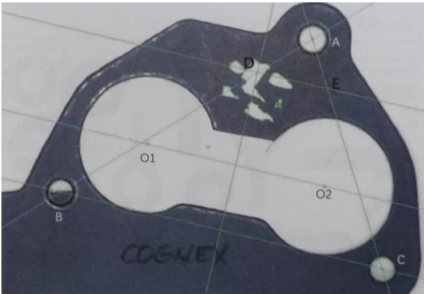

视觉工程师三级机试

操作要求:每题为一个 Block，Block 重命名为 1 和 2，作业保存为 Block 格式命名方式为:姓名 $^ +$ 身份证号，每人作业只收集一份整体的 Block。 (100 分)

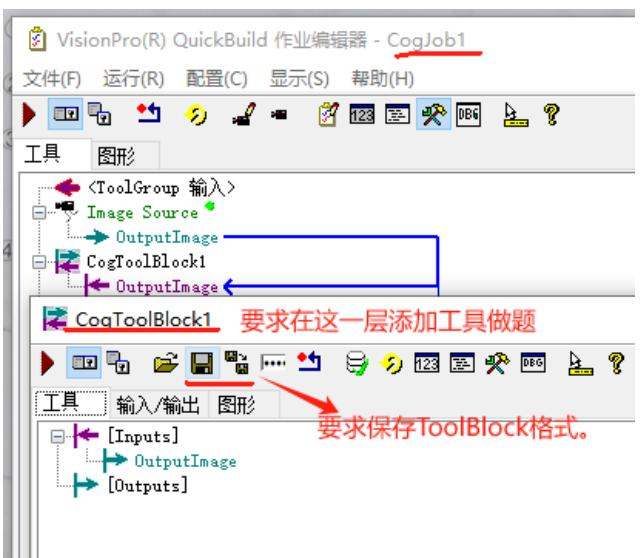

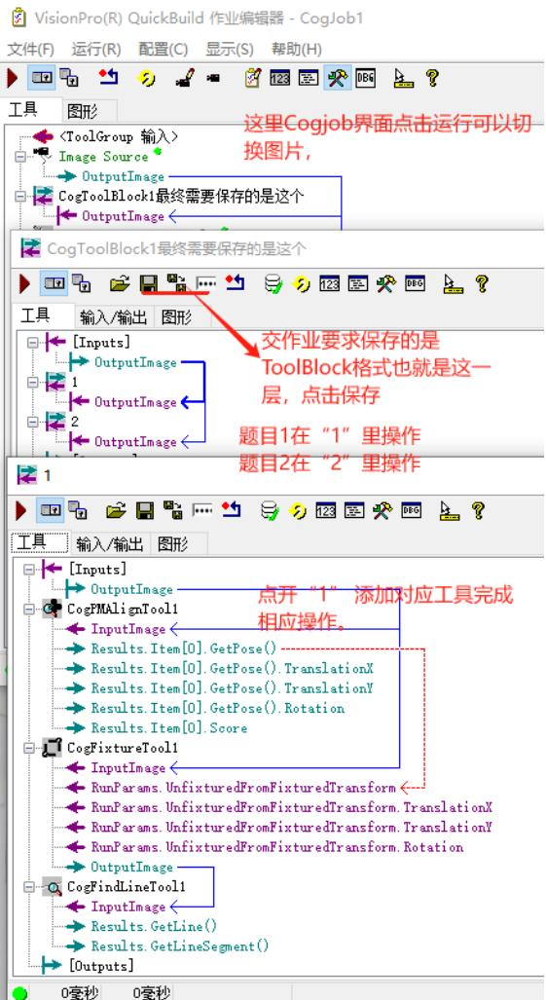

1.请使用图片 1.idb 完成以下操作: 这个题目要求全在上图 命名为 “1” 的ToolBlock里添加工具操作！

1选择合适特征定位，抓取左右两个大圆并计算圆心距并输出;(15 分)2 抓取周边的3 个小圆 ABC 并将圆心互相连线; (18 分)

抓圆、测距、fitLine拟合线

3 做圆心 01、02 的中垂线于 AB 相交于 D，过 D 做 0102 的平行线 DE，与 AC 交于 E 点，求 DE 的距离并输出; (7 分)4 计算 D 点周边的最大白色斑点的面积并输出。(10 分)

这里可以用点平分线直接拿圆心 01 02 的点得到一条中垂线，然后又和线 AB 相交与 D(也可以，01 02 先拟合一条直线，然后过点 D 做 01 02 连线的垂线。)

，再创造平行线平行于 0102 的连线。 测距、 斑点工具筛选最大的斑点并输出。

1. .这个题目要求全在上图 命名为 “2” 的ToolBlock里添加工具操作！

最后操作完，在外层 ToolBlock 保存 ToolBlock 格式。