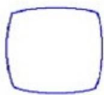
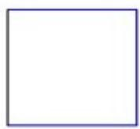
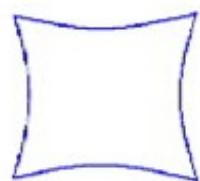
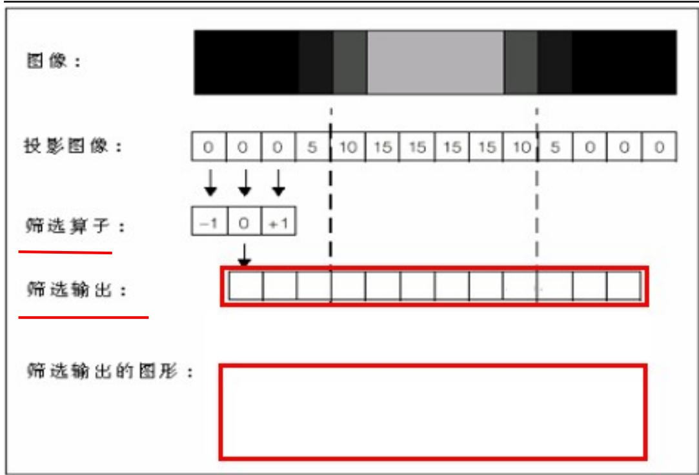
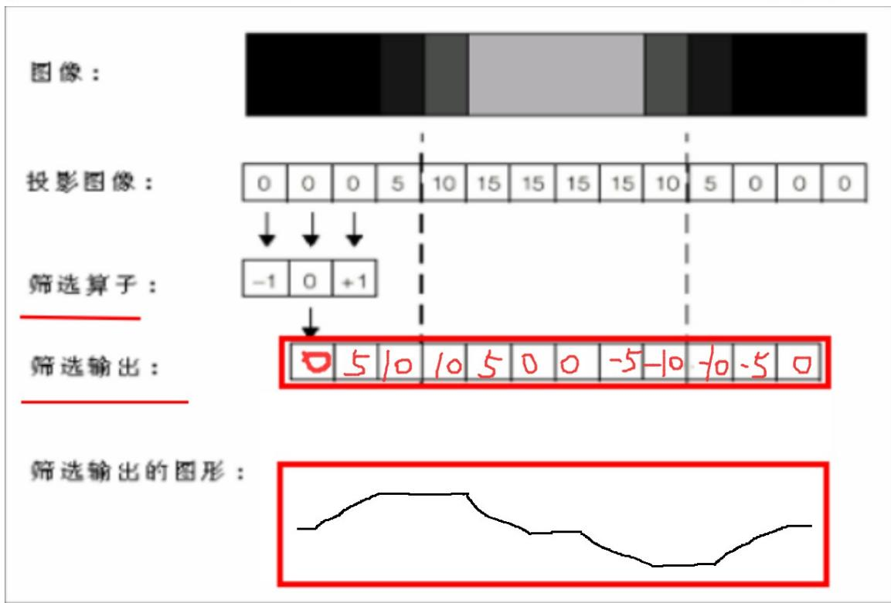

姓名：

考号：

得分：

# 视觉工程师三级笔试

# 填空题。（每空 1.5 分，共 30 分）

1. 棋盘格标定是使用一个棋盘格板来计算像素和真实单位之间的转换，它可以计算_ _线性_ _转换或者 _非线性 _转换。  
2. 如下图，径向畸变分为两种，异常1是 桶形畸变 _，异常 2是_ 枕形畸变 。

  
异常1

  
正常图像

  
异常2

3. 标定后的纵横比越接近 1 越好、倾斜越接近于 0 _越好。  
4. 如下图C#代码，最后输出的结果是 _100_ _。这里 num 始终为1，i<100 则最大为 99，所以 Score 是 $1 + 9 9 = 1 0 0$

# 姓名： 考号： 得分：

static void Main(string[] args)   
{ int num $= 0$ double score $= 0$ num $= 1$ //Console.WriteLine(num); for (int i $=$ num; i $<  100$ .i++) { score $=$ num $^+$ i; } Console.WriteLine(score); Console.ReadKey();   
}

# 5. 翻译以下自由度：

Translation：_ _偏移_ Rotation：___ _角度

Scaling： _缩放 Skew： _倾斜

Aspect：_ _比例

6. CogImageFileTool的作用是将图像写入到文件中或从文件中读出，它支持的文件类型有 _idb 、 _cdb_ __和_____ __bmp_ 。  
7. CogPMAlignTool 训练模板的方式有两种，分别是 _建模 _和_掩膜 _。  
8. CogBlobTool的极性在二值分割的情况下才有，它分为两种分别是白底黑点_ _黑底白点 。  
9. 假设相机型号为 CAM-CIC-5000R-14-G（相机芯片尺寸为 1/2.5”，芯片大小长边为5.7mm），配合一个0.3倍远心镜头，则可算出的视野长边大小为_19 __。5.7/0.3=19 视野/芯片 $\cdot$ 放大倍率

姓名： 考号： 得分：

# 二、 不定项选择题（每空2分，共10分）

1. 关于一个 Job 包含内容的说明，下面描述正确的是 （ ABD ）

A、 至少包含一个提供图像的图像源（Image Source）  
B、 包含一些视觉工具集合在此图像上运行  
C、 可以有多个 Job 同时运行  
D、 Vision Tools 在 Job 中将执行串行的运行方式

2. 下面哪个参数不属于 CogCaliperTool 的极性选择（ A ）

A. Edge Pair

B. Dark to Light

C. Light to Dark

D. Any Polarity

3. 关于标定片本身，下面说法正确的是（ AC ）

A、黑白瓷块必须以交叉图案方式排列  
B、黑白瓷块中间不能有其它图像存在  
C、黑白瓷块必须具有同样的尺寸  
D、瓷块必须为矩形，其纵横比范围是0.9到1.1

4. 关于 CogPMAlignTool 模板训练的技巧，以下说法错误的是（ D ）

A、模板特征要有唯一性  
B、模板的对比度明显  
C、模板的形状轮廓明显  
D、模板的特征越多越好

5. CogResultsAnalysisTool 可以使用以下形式的结果（ ABCD ）

A.数值 B.字符串 C.布尔值 D.向量（结果值的数组）

# 三、判断题。（每题 2 分，共 10 分）

# 姓名： 考号： 得分：

1、增加标定图像中可见的黑白瓷块数量，可以提高校准的精确度 （ Y ）  
2、如果没有Fixture定位工具，图像空间坐标系原点一定位于图像中心（ X）  
3、对于CogFindCircleTool，一般来说，要提高精确度，可以增加卡尺的的数量，也可以增加卡尺的搜索长度 （ X ）  
4、 Aspect / Skew 是可以通过视觉标定来进行矫正的，只要不太离谱，不会影响贴装精度 （ X ）  
5、 CogImageConvertTool 工具可以进行图片格式转换，它默认是将彩色图像（16bit、24bit）转换为 12bit 的灰色图像 （ X ）8bit

# 四．简答题（每题 10 分，共 50 分）

1、阐述在自动标定过程中造成标定不成功的原因，并给出解决措施（至少三个）。（10 分）

参考：

视觉：标定片尺寸不对(确认尺寸)，清晰度不够(确认焦距)、曝光不合适(优化曝光)、标定片标定过程中滑动(防止机台抖动、吹气等导致标定片滑动)等等

机构： $^ { 9 + 2 }$ 标定旋转角度不对(按照要求的5 10 15等角度旋转。)，轴走位不准确()，轴旋转角度不准确，拍照位置不固定(有偏差)、通讯失败等等。

姓名： 考号： 得分：

2、简述 CogCaliperTool 抓取单个边缘的三种计分方式的含义。（10 分）

对比度函数(contrast)、位置函数(Position)、PositionNeg 函数:

对比度:默认当 $\cdot$ 时：对比度越高得分越高，达到设定的 X0的值时得分为

1 超出也为1.当XC>X0时：相反，对比度越高，得分越低。

位置函数(Position)：默认XC>X0越靠近卡尺中线位置得分越高， 勾选时X0>XC离卡尺中线越远得分越高。

PositionNeg: 默认 XC>X0 靠近卡尺起始位置得分高 勾选时 X0>XC 远离卡尺起始位置得分高

3、如下面代码中，投影图像和筛选算子已知，请写出筛选输出结果并画出其输出曲线图像。（10 分）

姓名： 考号： 得分：

画线，体现出来数字变化就行。中间是0，线往上走是5 10，往下走对应的-5 -10，横线反映了保持某个值不变。

姓名： 考号： 得分：

4、在实际应用中，我们经常使用 CogPMAlignTool 来建立模板，那么当我们建好初步的模板后，可以通过调试哪些参数来减小模板匹配的时间？（至少五个）（10 分）

答：减小搜索区域、提高接受阈值、减小角度范围、减小缩放范围、减少查找概数、调高对比度阈值、不勾选忽略极性

5、CogBlobTool 并不能适用于所有机器视觉应用，请列举 CogBlobTool 的适用对象具有哪类特征？不适用对象具有哪类特征？（10 分）

适用对象：对象在尺寸、形状、方向上有很大差异（很难或不可能训练模型）

在背景中没有明显灰度阴影的对象（会影响我们对目标的分割）

对象没有重叠或者连接

不适用对象：对比度不明显、图案有重叠部分等