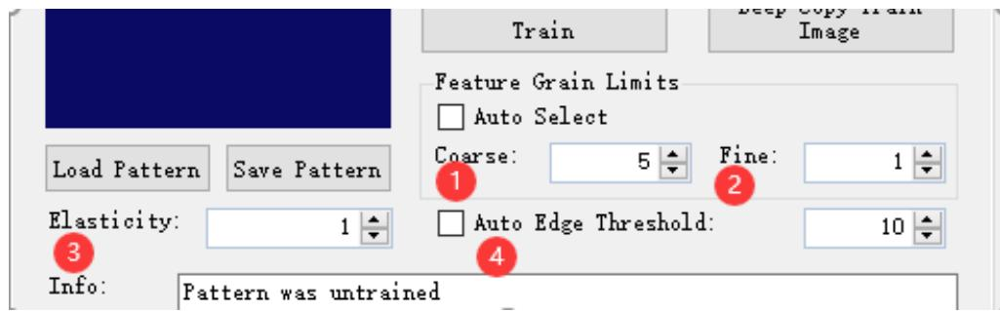
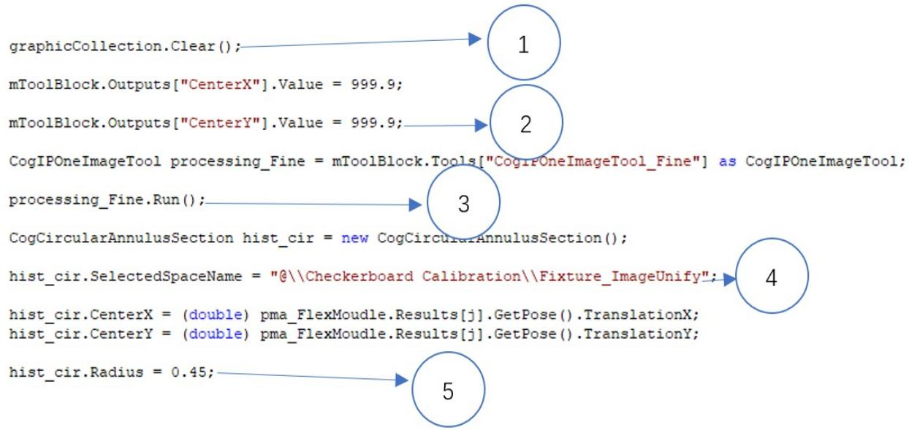

姓名： 身份证号： 得分：

# 视觉工程师三级笔试

# 填空题。（每空 1.5 分，共 30 分）

1.如下图所示，请解释 CogPMAlignTool 参数的意义

_粗糙_ _精细_

_弹性 自动边缘阈值

2. CheckBoard 工具进行线线校正模式时候的五种自由度是__平移____、___旋转_、___倾斜___、__缩放__、___纵横比_ 。  
3. 我们的 AssemblyPlus 软件自带的和 SI 的通信方式是__TCP_、__Serial 串口_  
4. CogIPOneImageTool 常用的图像处理方法有__乘以常数__、__加/减常数__、_翻转/旋转___、腐蚀等处理（合理即可）  
5. 使用Caliper工具，在选择单边模式时可使用的三种函数是__对比度 _位置 、 _PositionNeg _。  
6. 3D 相机设置参数时，X-Scale 代表____X 缩放

StepsPerLine 代表 每行编码器的步数。

姓名： 身份证号： 得分：

Measure Field 代表 测量场(决定 3D 相机的取像速度和景深大小)__。

# 二、 不定项选择题（每空2分，共10分）

1.我们相机的触发模式有：（ ACD ）

A、手动

B、自由运行

C、硬件自动

D、硬件半自动

2. 关于 PMAlignTool 中的接受阈值说法正确的是（ ABCD ）

A、范围在0到1  
B、当结果分数为0.8时，提高接受度阈值到0.79，一定还有结果  
C、提高阈值可以减少工具运行时间  
D、降低阈值可能找到多个相似的特征

3.以下选项那些可能是标定失败的原因( ABCD )

A、机械手XY方向走点距离不一致  
B、标定图片焦距模糊  
C、打光不均匀   
D、做机械手旋转中心校准时，机械手旋转的角度不精确

4. 使用 CogCopyRegionTool 可对指定区域（ A C ）

姓名： 身份证号： 得分：

A 灰度填充

B 空间变换

C 像素复制

D 数据计算

5．视场水平方向的长度是 $9 . 3 4 ^ { \star } 7 . 8 \mathsf { m m }$ ，相机水平分辨率是 $2 4 4 8 ^ { \star } 2 0 4 8$ ，视

觉系统的精度是多少？ （ D ）9.34/2448=0.00381

A 、 50Pixel/mm  
B 、 262.09mm/Pixel  
C 、 500Pixel/mm  
D、0.0038mm/Pixel

# 三、判断题。（每题 2 分，共 10 分）

1、 CogPMAlignTool 中颗粒度参数的单位是 pixel。 （ Y ）  
2、 CogFindLineTool 与 CogCaliperTool 都可以抓取边缘对。 （ Y ）  
3、 CCD 对比 CMOS 的优势有：噪声高，耗电量低，技术较成熟。 （ X ）  
4、 相机型号和打光效果都可以影响视觉检测的精度。 （ Y ）  
5、使用PMAlign工具匹配特征时图像中的部分特征在视野外，可以设置区域以外计分参数增加特征匹配得分。 （ X ）

# 四．简答题

1. 简述 CheckBorad 标定工具中 Translation、Scaling、Rotation、Skew 的意义。（10 分）

选择线性畸变校正时候的5种自由度中的4种：可以校正图像上这四种类型的

姓名： 身份证号： 得分：

线性畸变。

Translation 平移、Scaling 缩放、Rotation 旋转、Skew 倾斜

2、简述下面代码中序号 1-5 的含义。（15 分）

答：

1. 将 graphicCollection 这个集合里东西清空  
2. 赋值，将 CogToolBlock 中输出端的名为 CenterX 的值赋值为 999.9  
3. 运行一下 processing_Fine 这个工具。  
4. 修改 hist_cir 工具的空间名称为”@\\......Fixture_ImageUnify”  
5. 赋值将 hist_cir 的半径值赋值为 0.45

3.相机标定时 RMS 误差过大，请阐述合理的分析排查步骤。（15 分）

视觉：曝光不合适、焦距不合适导致抓取到的 Mark点少或不准确导致，校正模式不对导致等。

# 姓名： 身份证号： 得分：

机构：走位不准确、旋转角度不准确或是不对、取放标定片时候位置抖动等

4.写出至少 5 类造成抓边异常的原因以及对应的解决办法（10 分）

$\cdot$ 即使模板匹配好，但是有些边的位置相对于模板特征而言不太固定，需要合理设置大一些抓边工具的搜索长度，以保证这条边始终在抓边工具的搜索范围以内。  
$\textcircled{2}$ 图片亮度太暗或过曝等，边不存在导致抓边失败，调整合适曝光。  
$\cdot$ 物料本身边缘对比度不佳，适当降低对比度阈值。  
$\textcircled{4}$ 物料边缘凹凸不平，有凸起，凹陷等，可以适当忽略一些点数，把不稳定的因素排除掉。  
$\textcircled{5}$ 图像清晰度变的稍差，或者边缘黑白过滤的像素数比较多，可以适当增加抓边工具的过滤一半像素值。