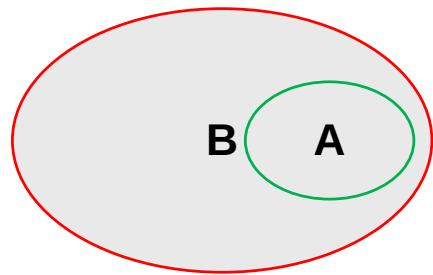
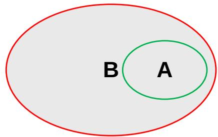
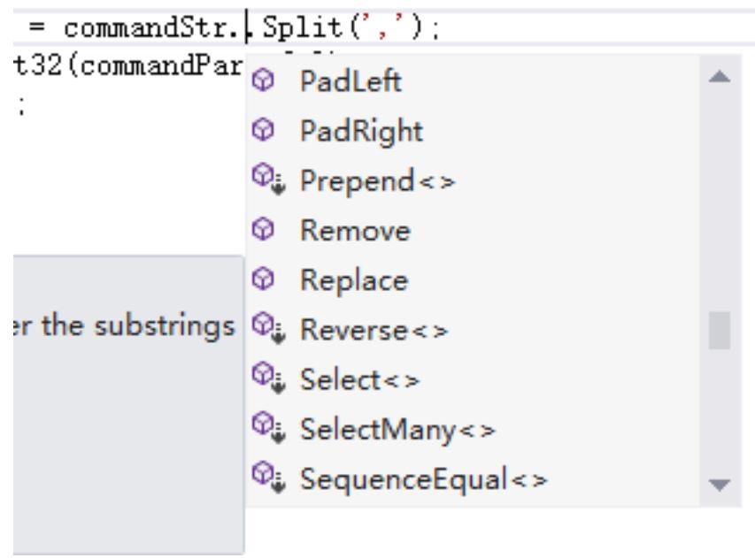
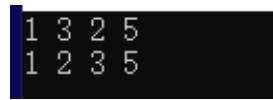

# C# 的类型转换、数据结构、字符串和数组

# 学习内容

1. 类型转换   
2. 数据结构  
3. 字符串   
4. 数组

# 类型的转换

类型转换就是将一种类型转换为另一种类型。类型转换一般分为隐式转换和显式转换。

# 隐式转换

隐式转换就是不需要声明就能进行转换。进行隐式转换时，编译器不需要进行检查就能安全进行转换，不需要人工干预的数据转换。其本质是小存储容量数据类型自动转换为大存储容量数据类型。

隐式数值转换   

<table><tr><td>源类型</td><td>目标类型</td></tr><tr><td>byte</td><td>short,ushort,int,uint,long,ulong,float,double,decimal</td></tr><tr><td>sbyte</td><td>short,int,long,float,double,decimal</td></tr><tr><td>short</td><td>int,long,float,double,decimal</td></tr><tr><td>ushort</td><td>int,uint,long.ulong,float,double,decimal</td></tr><tr><td>int</td><td>long.float,double,decimal</td></tr><tr><td>uint</td><td>long.ulong,float,double,decimal</td></tr><tr><td>long</td><td>float,double,decimal</td></tr><tr><td>ulong</td><td>float double,decimal</td></tr><tr><td>float</td><td>double</td></tr><tr><td>char</td><td>ushort,int,uint,long,ulong,float,double,decimal</td></tr></table>

表3-1整数类型  

<table><tr><td>类型</td><td>别 名</td><td>允许的值</td></tr><tr><td>sbyte</td><td>System.SByte</td><td>介于 - 128~127之间的整数</td></tr><tr><td>byte</td><td>System.Byte</td><td>介于 0~255 之间的整数</td></tr><tr><td>short</td><td>System.Int16</td><td>介于 - 32 768~32 767 之间的整数</td></tr><tr><td>ushort</td><td>System.UInt16</td><td>介于 0~65 535 之间的整数</td></tr><tr><td>int</td><td>System.Int32</td><td>介于 - 2 147 483 648~2 147 483 647 之间的整数</td></tr><tr><td>uint</td><td>System.UInt32</td><td>介于 0~4 294 967 295 之间的整数</td></tr><tr><td>long</td><td>System.Int64</td><td>介于 - 9 223 372 036 854 775 808~9 223 372 036 854 775 807 之间的整数</td></tr><tr><td>ulong</td><td>System.UInt64</td><td>介于 0~18 446 744 073 709 551 615 之间的整数</td></tr></table>

表3-2浮点类型  

<table><tr><td>类 型</td><td>别 名</td><td>m 的 最小值</td><td>m 的 最大值</td><td>e 的 最小值</td><td>e 的 最大值</td><td>近似的 最小值</td><td>近似的 最大值</td></tr><tr><td>float</td><td>System.Single</td><td>0</td><td>\( {2}^{24} \)</td><td>-149</td><td>104</td><td>\( {1.5} \times  {10}^{-{45}} \)</td><td>\( {3.4} \times  {10}^{38} \)</td></tr><tr><td>double</td><td>System.Double</td><td>0</td><td>\( {2}^{53} \)</td><td>-1075</td><td>970</td><td>\( {5.0} \times  {10}^{-{324}} \)</td><td>\( {1.7} \times  {10}^{308} \)</td></tr><tr><td>decimal</td><td>System.Neginal</td><td>0</td><td>\( {2}^{96} \)</td><td>-28</td><td>0</td><td>\( {1.0} \times  {10}^{-{28}} \)</td><td>\( {7.9} \times  {10}^{28} \)</td></tr></table>

# 隐式转换

隐式转换要具备的条件是：

1. 被转换类型的值范围必须小于目标类型的值范围；  
2. 被转换类型的值必须与目标类型兼容。

注意：对于 char 类型的到 int 类型的转换，传回的值是 ASCII 码

如右图所示， A 包含于 B ，所以 A 可以隐式转换为 B



# 显式转换

显式转换也称为强制转换，需要在代码中明确声明转换的类型。

它进行的是与隐式转换相反的数据类型的转换，其本质是大存储容量数据类型强制转换为小存储容量数据类型。相当于B 转 A

# 显式转换的 4 种方式

1. 加 () 直接转换  
2. 利用 Parse() 方法将字符串类型转换成任意基本类型  
3. Convert 方法 它够将任意数据类型的值转换成任意数据 类型，前提是不要超出指定数据类型的范围。  
4. .ToString()



# 显式转换

# 1. 加 () 直接转换

该转换方式主要用于数字类型之间的转换，从 double 型到 int 就需要使用显示转换。 string 类型无法通过该方法转换为int

注意：该方式对于浮点数会无条件的舍去，会失去精确度，不会四舍五入对于 int类型的到char类型的转换，传回的值是ASCII 码值对应的字符

例： static void Main(string [] args)

{ double $\mathtt { a } = 1 2 . 6$

int b=(int)a;

Console.WriteLine(b);

Console.ReadLine();

程序运行结果为 12 ，可见舍弃了后面小数点部分精度。

# 显式转换

2. 利用 Parse() 方法将字符串类型转换成任意基本类型

该方式是将数字内容的字符串转换为对应类型，如果字符串的内容为 Null ，则抛出 ArgumentNullException 异常；如果字符串内容不是数字，则抛出 FormatException 异常。

注意：使用该方法只能处理字符串的内容，而且转换后的字符串内容要在对应类型的可表示范围之内。

如 int.Parse double.Parse ect.

这里要求等号左、右两边的数据类型兼容

例： static void Main(string [] args)

{ int a; string b $=$ "123"; a $=$ int.Parse(b); Console.WriteLine(a); Console.ReadLine();   
}

程序运行结果为 123, 我们将 string 类型转换为 int 类型

# 显式转换

3. Convert 方法 它够将任意数据类型的值转换成任意数据 类型，前提是不要超出指定数据类型的范围。

如 Convert.ToInt32() 该方式不仅可以将字符串类型转换为 int ，还可以将其他的类型转换为 int 。在将浮点类型转换成 int 类型时，会保留整数位，舍去小数位，四舍五入。

注：若 double 在 X.5 情况下，则取 X.5 左右最近两个整数中的偶数。

例： static void Main(string [] args)

double $\mathtt { c } { = } 1 2 . 5$ ;

int d=Convert.ToInt32(c);

Console.WriteLine(d);

Console.ReadLine();

程序运行结果为 12, 舍弃掉了 0.5 ，若 ${ \tt c } { = } 1 2 . 5 5$ 时，距离 13 这个整数更近，程序输出13.

Convert.to

ToBase64String   
ToBoolean   
ToByte   
ToChar   
ToDateTime   
ToDecimal   
ToDouble   
Tolnt16   
Tolnt32

# 显式转换

4. .ToString()

任何类型都可以 ToString ，该方法会将此数据转换成等效的字符串。该方法可以保留浮点类型的数据的小数位，会四舍五入，方法如下：

double PoseX=3.1415

1.string strResult $=$ num.ToString(“f3”);

// 保留 3 位小数，结果为 3.142

2.string strResult $=$ num.ToString(“0.00”);

// 保留 2 位小数，结果为 3.14

```cs
例：static void Main(string[] args)  
{ double PoseX=12.3456789; string strSend=PoseX.ToString("f3"); //保留3位小数，结果为12.346 string strSend2=PoseX.ToString("0.00"); //保留2位小数，结果为12.35 Console.WriteLine(strSend); Console.ReadLine(); }
```

# 数据结构

结构（ struct ）就是由几个数据组成的数据结构，这些数据可能具有不同的类型。它也是一种变量类型。所以它可以用一个单一变量存储各种数据类型的相关数据。用 struct 关键字创建结构

结构体可以有方法、域、属性、索引器、操作方法、事件。

例如：

```txt
public struct CavePoseInfo   
{ public int NozzleID; public int CaveID; publicCogTransform2DLinear Camera_Pose; } 
```

访问修饰符 ：结构体成员不能被指定为抽象的、虚拟的、或者保护的对象，因此结构体的成员不能使用如下访问修饰符： abstract 、 virtual 和 protected

# 数据结构

# 结构体的作用

1. 结构是值类型，在分配内存的时候，速度非常快，因为它们将内存保存到栈中，在结构超出作用域被删除时速度也很快  
2. 结构体可以把功能相同的数据组织起来，存在一起，用是时候方便，而且在调用函数时，若传递参数较多，传一个结构体相对而言简单一些，很多系统自带的函数必须用结构体。  
3. 结构体在使用时可以和枚举一起使用。

# 结构的适用场合

对于点、矩形和颜色这样的轻量对象，假如要声明一个含有许多个颜色对象的数组，则CLR需要为每个对象分配内存，在这种情况下，使用结构的成本较低。

# 数据结构

struct Books   
public string title; public string author; public string subject; public int book_id;   
public class testStructure   
public static void Main(string[] args) Books Book1; /*声明Book1，类型为Books*/ Books Book2; /*声明Book2，类型为Books*/ /*book1详述*/ Book1.title $=$ "My C#"； Book1.author $\equiv$ "my name"; Book1subject $=$ "Programm"; Book1.book_id $= 123456$ . /*book2详述*/ Book2.title $=$ "The Wandering Earth"; Book2.author $=$ "Cixin Liu"; Book2subject $=$ "Science fiction"; Book2.book_id $= 666666$

```cs
/*打印Book1信息*/   
Console.WriteLine("Book1 title:{0}",Book1.title);   
Console.WriteLine("Book 1 author:{0}",Book1.author);   
Console.WriteLine("Book 1 subject:{0}",Book1subject);   
Console.WriteLine("Book 1 book_id:{0}",Book1.book_id);   
/*打印Book2信息*/   
Console.WriteLine("Book 2 title:{0}",Book2.title);   
Console.WriteLine("Book 2 author:{0}",Book2.author);   
Console.WriteLine("Book 2 subject:{0}",Book2subject);   
Console.WriteLine("Book 2 book_id:{0}",Book2.book_id);   
Console.ReadKey();   
} 
```

输出结果：

Book 1 title : My C#

Book 1 author : my name

Book 1 subject : Programm

Book 1 book_id :123456

Book 2 title : The Wandering Earth

Book 2 author : Cixin Liu

Book 2 subject : Science fiction

Book 2 book_id : 666666

# 字符串

字符串用关键字 string 表示，它是计算机中通用字符编码的有序集合。如： ABC 123 你我他

字符在字符串中有一个索引值，我们可以通过索引值获取字符串中的某个字符。字符在字符串中的索引从 0开始。

比如字符串“ Hello World” 中的第一个字符 H ，在该字符串中的索引顺序为 0.

# 比较字符串

在 C# 中常见的比较字符串的方法有 Compare 、 Compare To 和 Equals, 这些方法都归属于 String 类

# 1.Compare 方法

Compare方法用于比较两个字符串是否相等，它有多种重载方法，常见的两种方法如下：

Int Compare(string strA,string strB);

Int Compare (string strA,string strB,bool ignorCase);

注： ignorCase 是一个布尔类型参数，如果为 true ，那么比较字符串时候就忽略大小写。 Compare 方法是一个静态方法，所以在使用时，可以直接引用

# 比较字符串

# 2.Compare To 方法

Compare To 方法与 Compare 方法相似，都可以比较两个字符串是否相等，但是Compare To 方法是以实例对象本身与指定的字符串做比较，语法如下：

Public int CompareTo(string strB)

例如：

static void Main(string[] args)   
{ string str1 $=$ "我的程序a"; string str2 $=$ "我的程序b"; Console.WriteLine(str1 compareTo(str2)); Console.ReadLine();   
}

由于 str1 中的“ a” 比 str2 中的“ b”ASCII 码小，所以运行结果为 -1

# 比较字符串

# 3.Equal 方法

Equal 方法主要用于比较两个字符串是否相同，如果相同返回值是 true ，否则为false. 常见的两种语法如下：

public bool Equals(string value)

Public static bool Equals(string stra ,string strb)

例如：

static void Main(string[] args)   
{ string str1 $=$ "a"; string str2 $=$ "b"; Console.WriteLine(str1EQuals(str2)); Console.WriteLine(stringEQuals(str1,str2)); Console.ReadLine();   
}

程序运行结果为 False False

# 截取字符串

在 C# 中， string 类提供了一个 Substring 方法，该方法可以截取字符串指定位置和指定长度的字符，其语法格式如下

Public string Substring (int startIndex,int length)

startIndex: 字符串起始位置的索引

Length ：要截取的子字符串中的字符数

例如：

static void Main(string[] args)

{ string str1 $=$ "我的程序a"; string str2 $= \mathrm{"\cdots}$ Console.WriteLine(str1.Substring(2,3)); Console.WriteLine(str2); Console.ReadLine();

程序运行结果为 程序 a

# 分割字符串

在 C# 中， string 类提供了一个 Split 方法 , 用于分割字符串。该方法的返回值包含所有分割子字符串的数组对象，可以通过数组获取所有分割的子字符串，其语法格式如下

Public string [ ] Split (params char [ ] separator)

separator : 是一个数组，

Length ：要截取的子字符串中的字符数

例如： static void Main(string[] args)

{ string commandStr $=$ "T2,S,1,2,1,3,TEST"; string[] commandParts $=$ commandStr.Split(','); int num $=$ Convert.ToInt32(commandParts[3]); Console.WriteLine(num); Console.ReadLine();

程序运行结果为 2

# 其它字符串

除以上几种字符串外， string 类还提供了格式化字符串，插入和填充字符串，删除字符串，复制字符串和替换字符串等。我们可以通过“ .” 的方法找到它们。



# 数组

数组是一个存储一系列元素位置的对象。包含若干个相同类型的变量，这些变量可以通过索引进行访问。数组中的变量称为数组的元素，数组能够容纳的数量称为数组的长度。

数组中的每个元素都具有唯一的索引与其相对应，数组的索引从 0 开始。

一个数组的定义包含以下几个要素：

a. 元素类型 //如整数或字符串   
b. 数组的维数 // 一维数组，二维数组，多维数组  
c. 每个维数的上下限

# 一维数组的声明和使用

一维数组即数组的维数是 1.  
一维数组的声明，语法如下

type [ ] arrayName;

Type: 数组存储数据的数据类型

arrayName ：数组名称

如：

Int [ ] array;

初始化

可以通过 new 运算符创建数组，并将数组元素初始化为他们的默认值。

如： int array =new int[6]; //array 数组中每个元素初始化为 0

也可以声明时将其初始化为对应值，如

Int [ ] array=new int[6]{1,2,3,4,5,6};

# 一维数组的声明和使用

# 一维数组的使用

用 foreach 语句将数组中的元素读出来。

如：

static void Main(string[] args)   
{ int[] array $=$ {1,2,3}; foreach (int n in array) { Console.WriteLine("\{0\}",n+""); Console.ReadLine(); }

运行结果依次为 1 2 3

# 二维数组的声明和使用

二维数组的声明，语法如下：

type [ ,] arrayName;

Type: 数组存储的数据类型

arrayName ：数组名称

如： int [, ] array=new int [3,2]; // 一个 3 行 2 列的二维数组

初始化

和一维数组一样，也可以通过 new 运算符创建数组并将数组元素初始化为它们的默认值。如：

int[,] array $=$ new int[2,2]{{1,2},{3,4}};

# 二维数组的声明和使用

# 二维数组的使用

对一个 2 行 2 列的二维数组初始化，并通过遍历数组方法输出元素值

```txt
int[,] array = new int[2,2]{{1,2},{3,4}};  
for (int i = 0; i < 2; i++)  
{  
    string str = "";  
    for (int j = 0; j < 2; j++)  
{  
        str = str + Convert.ToString(array[i,j]) + "";;  
    }  
Console.WriteLine(str);  
Console.ReadLine();  
} 
```

输出结果为 1 23 4

# 数组的常见操作

1. 遍历数组  
2. 添加删除数组   
3. 排序数组

# 数组的常见操作

# 1. 遍历数组

使用 foreach 语句访问数组中的每个元素比如：

static void Main(string[] args)   
{ int[] array $=$ new int[3] {1,2,3}; foreach (int num in array) { Console.WriteLine(num); Console.ReadLine(); }   
}

程序运行结果为 1 2 3

# 数组的常见操作

# 2. 添加删除数组

添加和删除数组就是在数组中指定位置对数组进行元素的添加和删除，一般通过 ArrayList 类实现；

ArrayList 的添加

a.Add 方法

int array=new []{1,2,3,4};

ArrayList List $=$ new ArrayList(array);

List.Add(5);

新集合为 {1,2,3,4,5}

b.Insert 方法

该方法用来将元素插入 ArrayList 集合中的指定索引处

int[] array $=$ new int[] { 1, 2, 3,4 };

ArrayList List $=$ new ArrayList(array);

List.Insert(2, 6); // 在第 3 位置添加数值 6 ，新数组为 {1,2,6,3,4}

# 数组的常见操作

# 2. 添加删除数组

ArrayList 的删除

在 ArrayList 集合中删除元素时，可以使用 ArrayList 类提供的 Clear 方法、 Remove 方法、RemoveAt 方法和 RemoveRange 方法

int array=new []{1,3,5,7};

ArrayList List $=$ new ArrayList(array);

List.Clear(); // Clear 方法

List.Remove(3); // 移除 List 中第 1 个元素 3 ，如果没有该元素， List 保持不变

List.RemoveAt(3) // 移除 List 中第 4 个元素（数组元素从 0 开始），移除后数组为 {1,3,5}

List.RemoveRange(1,2); // 移除 List 中第 2 个开始的 2 个元素，移除后数组为 {1,7}

# 数组的常见操作

# 3. 排序数组

static void Main(string[] args)   
{ int[] array $=$ new int[] {1,3,2,5}; foreach (int m in array) Console.Write(m + ""); Console.WriteLine(); int j, temp; for (int i = 0; i < array.Length-1; i++) { $\mathrm{j} = \mathrm{i} + 1$ if (array[i] > array[j]) { temp $=$ array[i]; array[i] = array[j]; array[j] $=$ temp; }

```javascript
else if(j<object.Length-1) { j++; } } foreach (int n in array) Console.Write(n + " "); Console.WriteLine(); 
```

输出结果为



Array.Sort(array); Array 类中对数组从小到大排序，但是只能用在非空的一维数组上

Array.Reverse(array); Array 类中对数组进行反向排序，结果为 {5,2,3,1}


# Thank you