# C# 类的介绍

Cognex | 2023.3.9

# 培训内容

1. 面向对象思想和类简介  
2. 类的基本语法  
3. 属性  
4. 静态和非静态的区别  
5. 构造函数和析构函数  
6. this 关键字  
7. 面向对象 ( 封装、继承、多态 ) 简介

# 面向对象思想和类简介

什么是面向对象？

面向对象编程： Object-oriented Programming ，简称 OOP ，面向对象程序设计。

面向对象思想使得程序更有重用性、灵活性和拓展性。面向对象的核心思想就是：封装、继承、多态。

面向对象编程的中心思想是通过调用对象来实现想要实现的目的。

面向对象中最常用的三个概念：对象、类、实例化

对象 $=$ 算法 $^ +$ 数据结构

程序 $=$ 对象 $1 +$ … 对象 n

我们把这些具有相同属性和相同方法的对象进行进一步的封装，抽象出来类这个概念。类就是个模子，确定了对象应该具有的属性和方法，对象是根据类创建出来的，抽象出对象的这个过程就叫做对象的实例化。

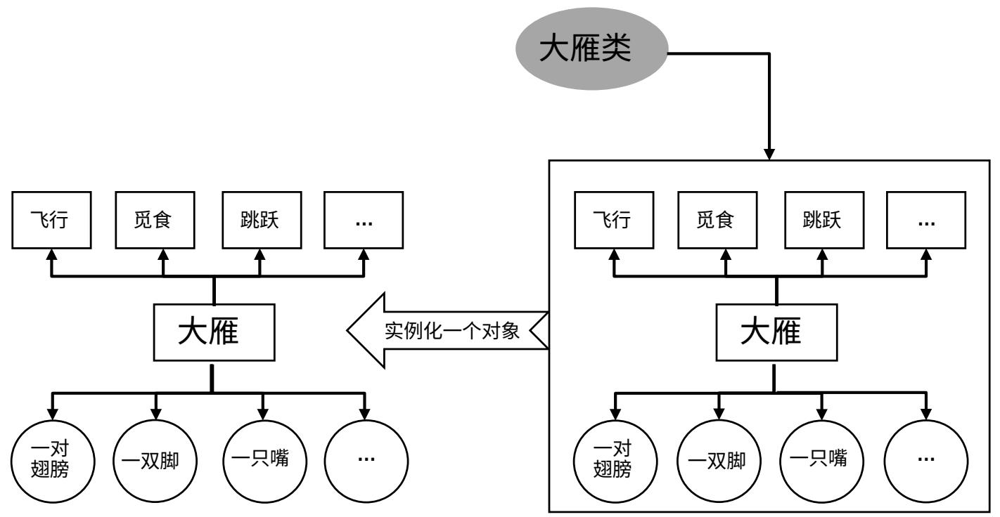

# 类的基本语法

C# 中类使用关键字 class 来定义 ，如下是语法结构：

类修饰符 class 类名

字段

属性

方法

接下来实操，在 VS 中如何去添加一个类

<table><tr><td colspan="2">表9-1类定义可以使用的访问修饰符</td></tr><tr><td>修饰符</td><td>含义</td></tr><tr><td>无或internal</td><td>只能在当前项目中访问类</td></tr><tr><td>public</td><td>可以在任何地方访问类</td></tr><tr><td>abstract 或 internal abstract</td><td>类只能在当前项目中访问，不能实例化，只能被继承</td></tr><tr><td>public abstract</td><td>类可以在任何地方访问，不能实例化，只能被继承</td></tr><tr><td>sealed 或 internal sealed</td><td>类只能在当前项目中访问，不能被继承，只能实例化</td></tr><tr><td>public sealed</td><td>类可以在任何地方访问，不能被继承，只能实例化</td></tr></table>

# 类的基本语法 - 如何创建一个类

1. 在 Windows 搜索 Visual Studio 并打开；  
2. 点击左上角 FILE\New\Project…

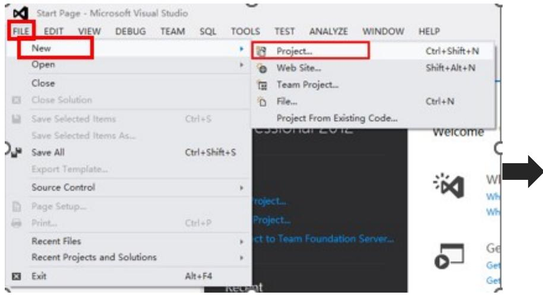

3. 选择项目、修改解决方案名称、项目名称，点击Ok 即可创建一个项目；

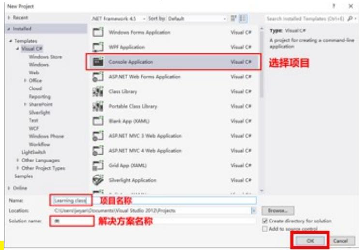

4. 鼠标右击项目名称，选择 Add\Class ，改一个类；

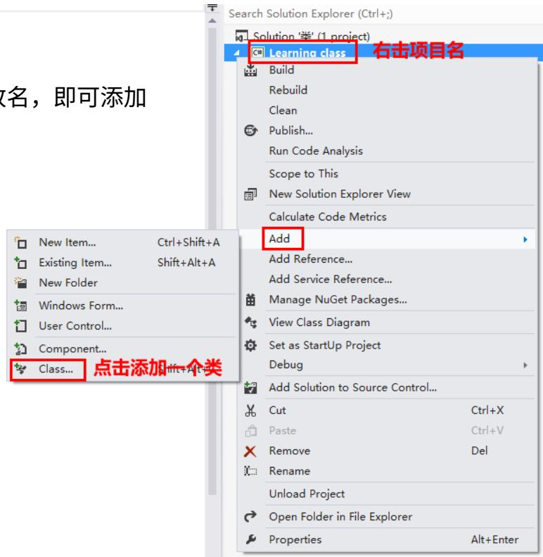

5. 在创建的类中编写代码。

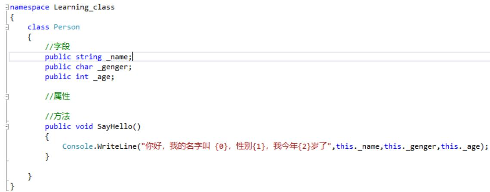

# 属性

为什么会有属性？

属性的作用就是保护字段，对字段的赋值和取值进行限定，正常情况应该给每一个字段配备属性；

属性的本质就是两个方法，一个叫 get 一个叫 set ， get 用于取值， set 用于赋值。

基本语法：

public 变量类型 变量名 //字段 private string_name;   
{ get{return 字段名;} //属性 public string Name set{字段名 $=$ value;} { get{return_name;} set{name=value;} }

属性创建的快捷键：鼠标光标选定字段， $\mathsf { c t r l } + \mathsf { R } + \mathsf { E }$ 快捷键即可快速生成属性结构；

# 静态和非静态的区别

1. 在非静态类中，既可以有静态成员，也可以有非静态成员（实例成员）；  
2. 在静态类中，只允许有静态成员，不允许出现非静态成员；  
3. 在调用实例成员的时候，需要使用对象名 . 实例成员；在调用静态成员的时候，需要使用类名 . 实例成员；  
4. 静态函数中，只能访问静态成员 , 不允许访问实例成员；  
5. 实例函数中，既可以使用静态成员 , 也可以使用实例成员；

```cs
public static void Say1()   
{ Console.WriteLine("我是静态方法");   
}   
public void Say2(){ Console.WriteLine("我是非静态方法"); 
```

6. 静态类什么时候使用 :

1) 如果你想要你的类当做一个“工具类”去使用，这个时候可以考虑将类写成静态的 , 适合频繁使用的，例如 Console 类；  
2) 静态类在整个项目中资源共享 ( 静态类占内存 ) ，类本身是不占内存的 , 如果实例化对象就等于开辟了空间；  
3) 只有在程序全部结束之后 , 静态类才会释放资源，所以在一个程序中静态类不能过多。

# 构造函数和析构函数

构造函数：

作用：帮助我们初始化对象 ( 给对象的每个属性依次赋值 ) ；构造函数是一个特殊的方法 :

1. 构造函数没有返回值 , 连 void 也不能写；  
2. 构造函数的名称必须和类名一样；  
3. 每个类都有默认的构造函数，当你新写的将覆盖默认的；  
3. 创建对象的时候会执行构造函数；  
3. 构造函数允许重载；

语法：

public 类名 ( 参数 )

// 给属性赋值

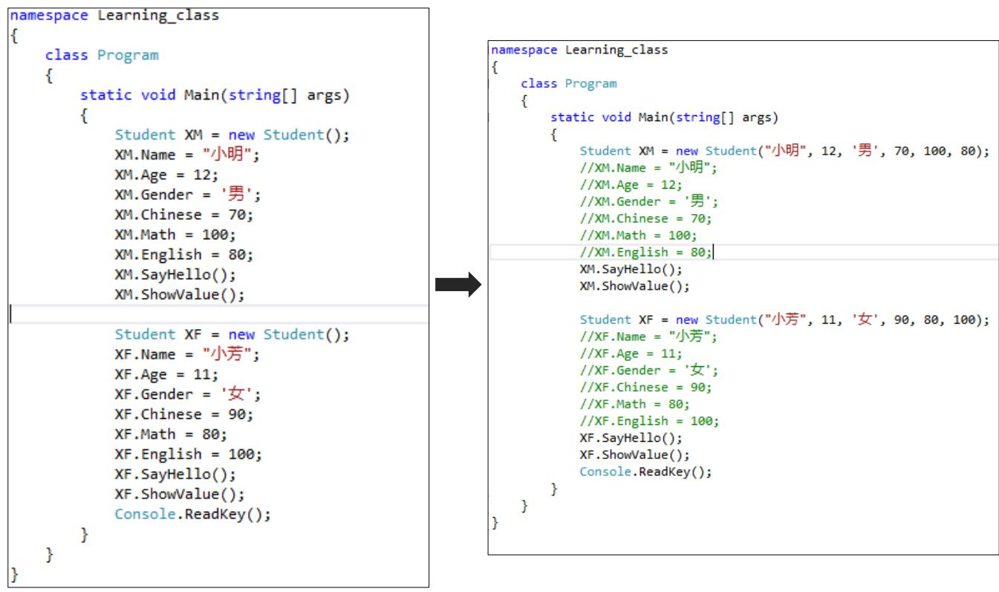

# 构造函数和析构函数

析构函数：

作用：程序结束后执行析构函数 , 立即帮助程序释放内存；

.Net 引入了一个 GC （ Garbage Collection ）的机制， GC 能够自动的去帮助程序释放资源，但我们一般不会手动去调用 GC去帮助程序回收资源，一般是由程序自动帮我们使用GC去回收，那这里就涉及一个问题，有可能程序结束的时候， GC没有马上帮程序释放资源，如果说你想让资源马上被释放，就可以主动使用析构函数去释放。

语法：

~ 类名 ()

{

//…

}

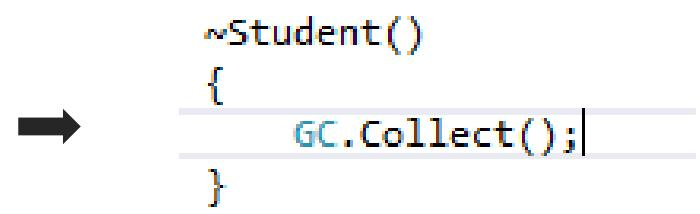

# this 关键字

作用：

1. 代表当前类的对象；  
2. 在类当中显示的调用本类的构造函数， :this ；

public class Student   
{ public Student(string name,int age,char gender,int chinese,int math,int english) { this.Name $=$ name; this.Age $=$ age; this.Gender $=$ gender; this.Chinese $=$ chinese; this.Math $=$ math; this.English $=$ english; } public Student(string name,int age,char gender) { this.Name $=$ name; this.Age $=$ age; this.Gender $=$ gender; } public Student(string name,int chines, int math, int english) { this.Name $=$ name; this.Chinese $=$ chinese; this.Math $=$ math; this.English $=$ english; }

public class Student   
{ public Student(string name,int age,char gender,int chinese,int math,int english) { this.Name $=$ name; this.Age $=$ age; this.Gender $=$ gender; this.Chinese $=$ chinese; this.Math $=$ math; this.English $\equiv$ english; } public Student(string name,int age,char gender):this(name,age,gender,0,0,0) { //this.Name $=$ name; //this.Age $=$ age; //this.Gender $=$ gender; } public Student(string name,int chines, int math, int english):this(name,0,'c',chinese,math,english) { //this.Name $=$ name; //this.Chinese $=$ chinese; //this.Math $=$ math; //this.English $\equiv$ english; }

# 面向对象 - 封装

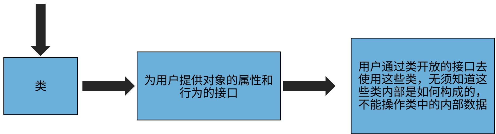  
类将内部数据隐藏

封装，简单来说就是将常用的重复的代码通过一种方法，编成一个新的可以被我们直接调用的类，省去了繁复的编程过程。对用户来说，用户并不需要知道对象是如何进行各种操作的，用户只需要通过调用封装后类的对象来进行想要的操作即可。封装这种思想，大大简化了操作步骤，代码变得更加有效，复用性也更高。

封装还有另外一个目的，就是将不需要对外提供的内容都隐藏起来；把属性隐藏（ private 关键字），提供公共方法对其访问。这使得用户不能直接访问程序的详细细节，从而使得代码的安全性的到提高。


描述本级目录对下级目录的关系


描述本级目录对上级目录的关系

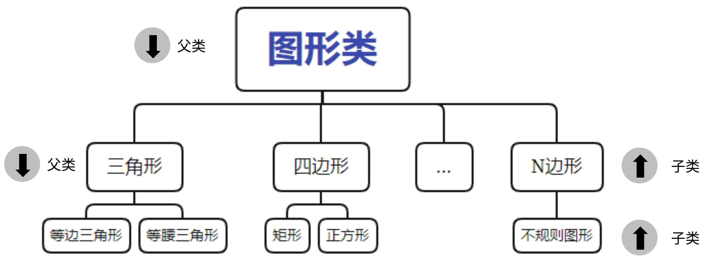

继承的概念：我们可能会在一些类中写一些重复的成员，我们可以将这些重复的成员单独的封装到一个类中,作为这些类的父类；

继承的作用：利用特定对象之间的共有属性，我们在程序的开发过程中，通过面向对象的继承特性就可以更好的提高代码的重用率。

# 面向对象 - 继承

1. 子类继承了父类 , 那么子类从父类那里继承过来了什么 ?  
首先 , 子类继承了父类的属性和方法 , 但是子类并没有继承父类的私有字段 .  
2. 子类有没有继承父类的构造函数?

子类并没有继承父类的构造函数，但是子类会默认调用父类无参数的构造函数，创建父类对象，让子类可以使用父类中的成员；所以，如果在父类中重新写构造函数，那个无参的构造函数就被覆盖了，子类就调用不到了，所以子类会报错；

解决办法 :

1) 在父类中重新写一个无参数的构造函数；  
2) 在子类中显示调用父类的构造函数，使用关键字 :base() ；

2.继承的特性

1). 继承的单根性：一个子类只能有一个父类；  
2). 继承的传递性；  
3). 学会查看类图，里面描绘了类之间的关系 (object 是所有类的父类 ) ；

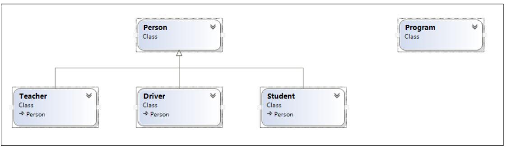

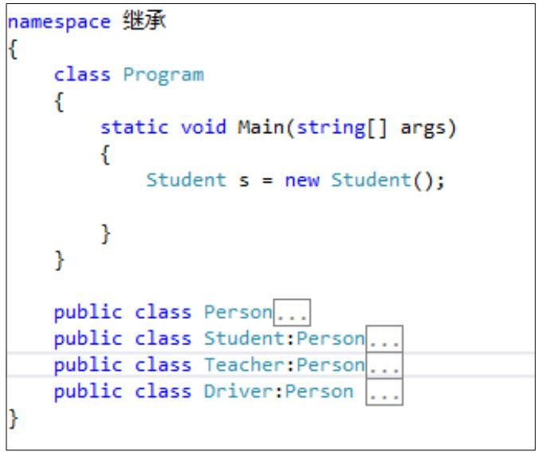

```txt
public Student(string name, int age, char gender, int id) : base(name, age, gender) { this.Id = id; } 
```

# 面向对象 - 多态

继承中提到了父类和子类，其实将父类对象应用于子类的特征就是多态，依然以图形类来说明多态，每个图形都拥有绘制自己的能力，这个能力可以看作是该类具有的行为，如果将子类的对象统一看作是父类的实例对象，这样当绘制任何图形时，可以简单地调用父类也就是图形类绘制图形的方法即可绘制任何图形，这就是多态最基本的思想。

实现多态的方法：

1. 虚方法：将父类的方法标记为虚方法 , 使用关键字 virtual, 这个函数可以被子类重新写一遍，父类方法中加 victual(publicvirtual void Person(){}) ；子类方法中加 override(public override void Student(){})  
2. 抽象类：当父类中的方法不知如何去实现的时候，可以考虑将父类写成抽象类，将方法写成抽象方法，用 abstract标记，抽象方法没有方法体，子类的方法用 override 重写。注：抽象类不能创建对象，只能通过子类赋值；  
3. 接口：

1) 接口中只能包含方法； 2) 接口中的成员都不能有任何实现； 3) 接口不能被实例化； 4) 接口中的成员不能有任何访问修饰符，默认为 public ； 5) 实现接口的子类必须将接口中的所有成员全都实现； 6) 子类实现接口的方法时不需要任何关键字，直接实现即可；7)接口存在的意义就是为了多态。

# THANKS