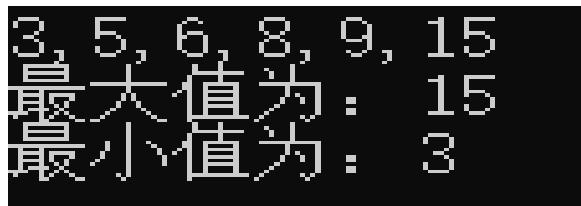

# C# 集合

Jianjun.song | 2023/03/08

# 命名空间

System.Collcetions   
System.Collcetions.Generic

# ArrayList

创建和添加元素

ArrayList mList $=$ new ArrayList();

mList.Add(12);

mList.Add(“ 张三” );

mList.Add(12.33);

mList.AddRange(mList);

特点：

1. 不需要初始化其大小（区别于数组创建需要固定其大小）  
2. 不需要区分值类型

# ArrayList

# 查找和删除元素

1. 使用 foreach 方法对数组中的每个元素进行遍历  
2. 使用下标可以拿到单个元素

mList.Contains(“ ”);

mList.Remove(“ 张三” );

mList.RemoveAt(index);

mList.Clear();

特点：

3. 拥有和数组类似的 foreach 遍历  
4. 查找值灵活方便

# ArrayList

# 索引符

索引符 (indexer) 是一种特殊类型的属性，可以把它添加到一个类中，以提供类似于数组的访问。

mCollection[0] --- 注意返回值属于 object 类型

# 特点：

1. 拥有和数组类似的 foreach 遍历  
2. 查找值灵活方便

# 键控集合 &IDictionary

# Dictionary

 Add() 带有两个参数：一个键和一个值，储存在一起（键和值是 object 参数）  
Remove() 以一个键而不是对象引用作为参数  
 Indexer 使用一个字符串键值，而不是一个索引，用于通过 Dictionary 的继承成员来访问储存的项，这里仍需进行数据类型转换

Dictionary<string, double> dic $=$ new Dictionary<string, double>();

dic.Add("2", 123);

dic.Add("1", 34);

foreach (KeyValuePair <string ,double> item in dic)

{

Console.WriteLine(item.Key $^ +$ item.Value.ToString());

}

1. 使用 KeyValuePair 遍历 keys 和 value  
2. 只遍历所有键元素  
3. 只遍历所有值元素

# 封箱和拆箱

 封箱 boxing 是把值类型转换为 System.Object 类型，或者转换为由值类型实现的接口类型  
拆箱 unboxing 是相反的转换过程

从这些示例中可以看出，封箱是在没有用户干涉的情况下进行的 ( 即不需要编写任何代码 ) ，但拆箱一个值需要进行显式转换，即需要进行数据类型转换 ( 封箱是隐式的，所以不需要进行数据类型转换 ) 。

封箱有两个非常重要的原因。它允许在项的类型是 object 的集合 ( 如 ArrayList) 中使用值类型。其次，有一个内部机制允许在值类型( 例如 int 和结构 ) 上调用 object 方法。最后需要注意的是，在访问值类型内容前，必须进行拆箱。

 在日常代码书写中，尽可能减少拆箱装箱的操作，耗费时间……

# is & as 运算符

is 运算符应不是用来说明对象是某种类型，而是用来检查对象是不是给定类型，返回 true 或者 false

3.14 is double

as 把一种类型转换为指定的引用类型

只适用于下列情况：

1. < operand $>$ 的类型是 < type $>$ 类型  
2. < operand $>$ 可以隐式转换为 $<$ type $>$ 类型  
3. < operand $>$ 可以封箱到 $<$ type $>$ 类型中  
4. 如果不能完成转换，返回 null

# 泛型

为了更好的解决是一开始就使用强类型化的集合类。

这种集合类派生于 CollectionBase, 并可以拥有自己的方法，来添加、删除和访问集合的成员，但它可能把集合成员限制为派生于某种基本类型，或者必须支持某个接口。这会带来一个问题。每次创建需要包含在集合中的新类时，就必须执行下列任务之一 :

1. 使用某个集合类，该类已经定义为可以包含新类型的项。  
2. 创建一个新的集合类，它可以包含新类型的项，实现所有需要的方法。

Using System.Colection.Generic;

Collection<T> items $=$ new Collection<T> ();

ArrayList<string> mList $=$ new ArrayList<string>();

Dictionary<K,V> things $=$ new Dictionary<K,V> ();

特点：

3. 泛型不只设计集合，但是集合特别适合使用泛型  
4. Dictionary 既可以迭代集合中的键也可以迭代集合汇总的值，可以使用 KeyValuePair<K,V> 来实例获取字典元素

# 作业

•1. 创建一个集合用来存储整数（ 9 ， 6 ， 15 ， 8 ， 3 ， 5 ），请按照从小到大进行排序，并求出集合中的最大值和最小值显示到控

2. 使用 Dictionary 存储以下姓名和成绩

张三 90

李四 95

王五 98

求出成绩的平均值并遍历集合显示到控制台。

# Thank you