# DataMan 软件介绍及应用

# 学习内容

读码器的通信  
- DataMan 软件介绍  
- DataMan 软件调试流程讲解

# 读码器通信

随着条码和读码器在生活和工业中的广泛使用，读码器的通信也显得非常重要，关于读码器的通信，我们将学习以下内容：

通信相关词语及其概念  
- 工业中 Cognex 常用的通讯方式  
读码器常用的2种通信方式区别  
固定式读码器通信  
手持式式读码器通信

# 通信相关词语及其概念

<table><tr><td>序号</td><td>相关词汇</td><td>定义</td></tr><tr><td>1</td><td>IP</td><td>IP协议提供的一种统一的地址格式，它为互联网上的每一个网络和每一台主机分配一个逻辑地址，以此来屏蔽物理地址的差异。常见的IP地址，分为IPv4与IPv6两大类。也分为动态IP地址和静态IP地址。</td></tr><tr><td>2</td><td>通讯端口</td><td>TCP/IP协议中的端口就是逻辑端口，通过不同的抄逻辑端口来区分不同的服务。一个IP地址的端口通过16bit进行编号，最袭多可以有65536个端口。端口是通过端口号来标记的，端口号只有整数，百范围是从0到65535。</td></tr><tr><td>3</td><td>传输波特率</td><td>波特率表示每秒钟传送的码元符号的个数，是衡量数据传送速率的指标，它用单位时间内载波调制状态改变的次数来表示。</td></tr></table>

# 工业中Cognex常用的通讯方式

√ 以太网通信

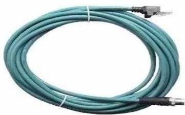

串口通信

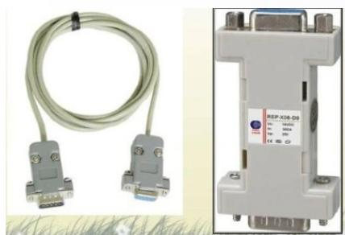

√ USB通信

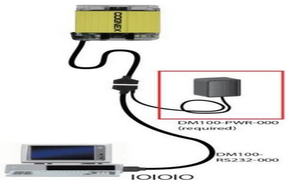

# 读码器常用的2种通信方式区别

串口：交互简单扩展性强成本适中无地域限制传输易受干扰。  
以太网：传输速度慢插拔不便成本低开发简单扩张性弱。

# 固定式读码器通信

以 Cognex 固定式读码器为例，固定式读码器通信媒介主要为：以太网通信和串口通信。随着 USB 技术的发展也串口转 USB 通信模式。

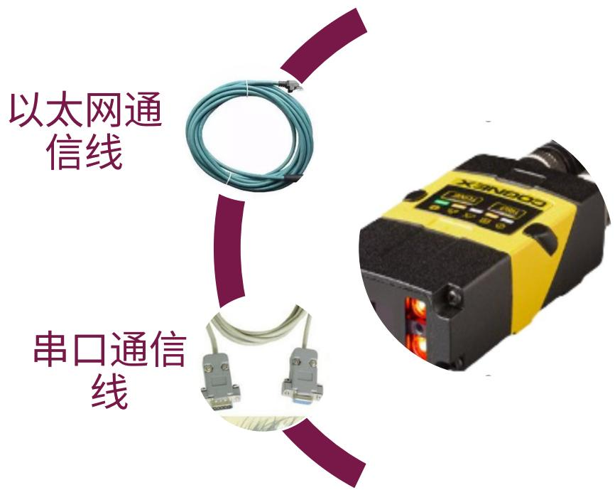

# 固定式读码器通信

Cognex 固定式读码器连接串口线和以太网线后，需要再增加 IO 线进行供电，并根据项目需要通过 IO 线接收硬件触发信号。

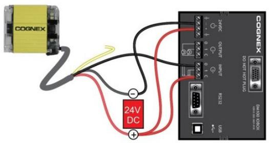

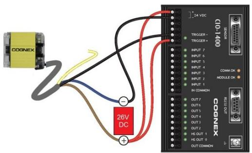

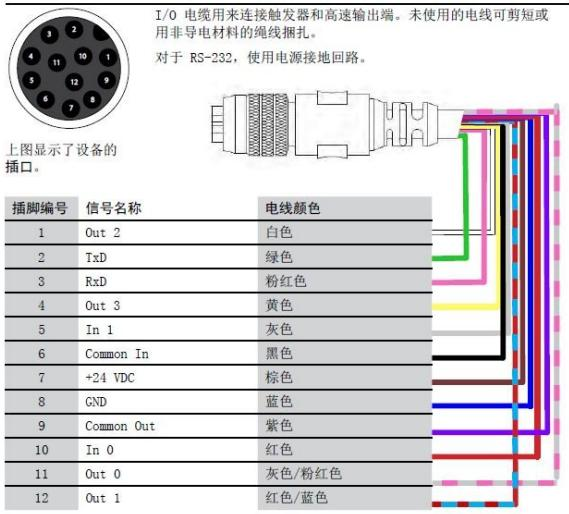  
I/O电缆（CCB-M12xM12Fy-xx）

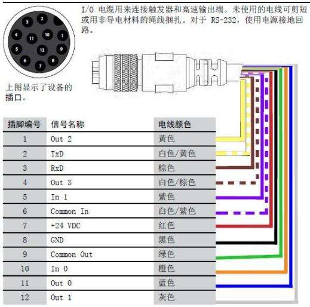  
1/0 电缆（CCBL-05-01）

# 手持式式读码器通信

Cognex手持式读码器主要以USB通信和无线通信为主。

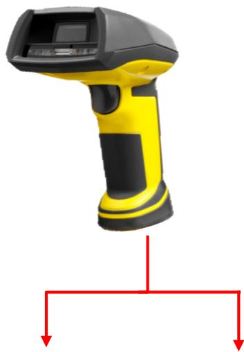

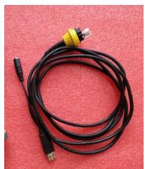

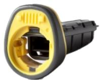  
以太网通信线 无线网络信线

# 小结

读码器通信的主要作用, 将获取并解析完成的条码信息, 通过通信方式传递至 PC、PLC 等信息接收端。  
Cognex 固定式读码器需要通过 IO 线供电, 及最常用的 2 中 IO 线。  
以当下使用率最高的固定式读码器和手持式读码器为例，读码器主要通信方式有：

以太网通信。

串口通信。

USB 通信。

无线网通信。

其中，固定式读码器主要为：以太网通信和串口通信；手持式读码器主要为：USB 通信和无线网通信。

# DataMan 软件介绍

Cognex DataMan 软件的介绍。  
读码器软件界面工具模块的作用意义及运用。

# DataMan 软件介绍

DataMan 设置软件 Cognex 开发能够用于访问 DataMan 读取器和基站的各种选项，包括实时查看正在读取的代码的图像，或者通过 FTPfor 稍后查看将读取器设置为 transferor 读取图像。

DataMan 设置工具是一个通用的跨平台模型。它简化了部署，把最常用的控件放在一个页面上，可以看到不同的选项如何影响实时的读卡器或基站。

DataMan

DataMan

6.1.6_SR2

Setup Tool

Cognex 读码软件 ---

DataMan 设置工具

# DataMan 软件界面介绍

# 交互界面

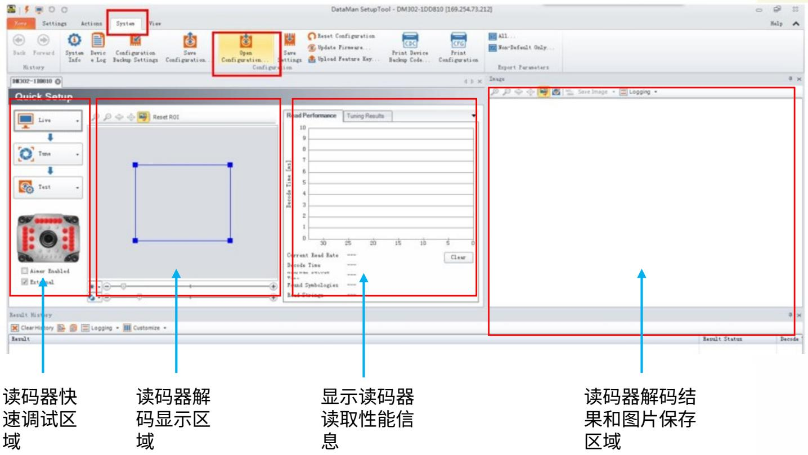

# DataMan 软件界面介绍

# Home界面

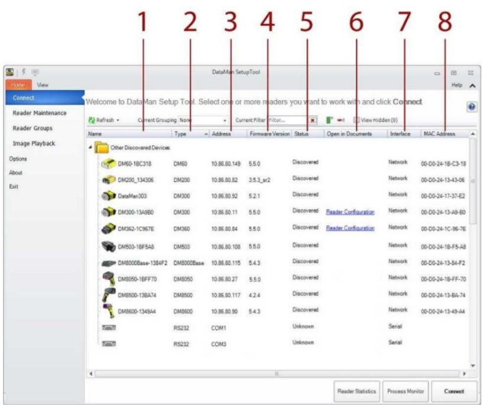

Home-function list   

<table><tr><td colspan="2">Item
Name</td><td>NO.</td><td>Name</td><td>Function</td></tr><tr><td colspan="2">Type</td><td>1</td><td>设备名称</td><td>显示设备图标</td></tr><tr><td colspan="2">Address</td><td>2</td><td>设备类型</td><td>显示设备型号</td></tr><tr><td colspan="2">Firmware Version</td><td>3</td><td>设备地址</td><td>设备的IP地址显示</td></tr><tr><td colspan="2">Status</td><td>4</td><td>固件版本</td><td>固件版本型号</td></tr><tr><td colspan="2">Open in Documents</td><td>5</td><td>设备状态</td><td>显示设备的状态如：（Conflicting（冲突）、In use（在使用）</td></tr><tr><td colspan="2">Interface</td><td>6</td><td>文档</td><td>设备读码器的文档</td></tr><tr><td colspan="2">MAC Address</td><td>7</td><td>接口</td><td>读码器的接口类型</td></tr><tr><td colspan="2"></td><td>8</td><td>Mac地址</td><td>读码器硬件地址</td></tr></table>

# DataMan 软件界面介绍

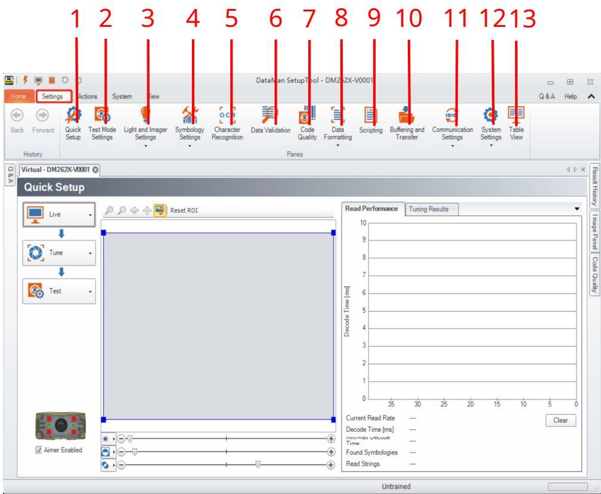  
Setting 界面

Setting-function list   

<table><tr><td colspan="2">Item</td><td>NO.</td><td>Name</td><td>Function</td></tr><tr><td colspan="2">Quick Setup</td><td>1</td><td>快速设置</td><td>显示实时界面，同时能跳转到快速设置界面，进行调试。</td></tr><tr><td colspan="2">Test Mode Settings</td><td>2</td><td>测试模式设置</td><td>测试模式，有些功能受到限制，只能测试触解码时间</td></tr><tr><td colspan="2">Light and Imager Settings</td><td>3</td><td>光源和图片设置</td><td>调试读码器光源亮度和取图图片格式设置</td></tr><tr><td colspan="2">Symbology Settings</td><td>4</td><td>二维码类型设置</td><td>可以勾选读取码的类型，如：读取一维码或二维码</td></tr><tr><td colspan="2">Character Recognition</td><td>5</td><td>字符识别</td><td>设置识别条码字符信息</td></tr><tr><td colspan="2">Data Validation</td><td>6</td><td>数据有效性</td><td>分析读码器的解码信息</td></tr><tr><td colspan="2">Code Quality</td><td>7</td><td>代码质量</td><td>可以测试条码质量，评定等级</td></tr><tr><td colspan="2">Data Formatting</td><td>8</td><td>数据格式</td><td>输出条码的格式，如回车换行，下划线等</td></tr><tr><td colspan="2">Scripting</td><td>9</td><td>脚本</td><td>脚本代码实现特殊的解码算法</td></tr><tr><td colspan="2">Buffering and Transfer</td><td>10</td><td>图像记录和播放</td><td>记录图像信息并且可以快速播放</td></tr><tr><td colspan="2">Communication Settings</td><td>11</td><td>通讯设置</td><td>设置读码器通信信息</td></tr><tr><td colspan="2">System Settings</td><td>12</td><td>系统设置</td><td>设置读码器读取失败字符串</td></tr><tr><td colspan="2">Table View</td><td>13</td><td>表格视图</td><td>调试OK 的读码器参数会以表格形式呈现出来</td></tr></table>

# DataMan 软件界面介绍

# Actions 界面

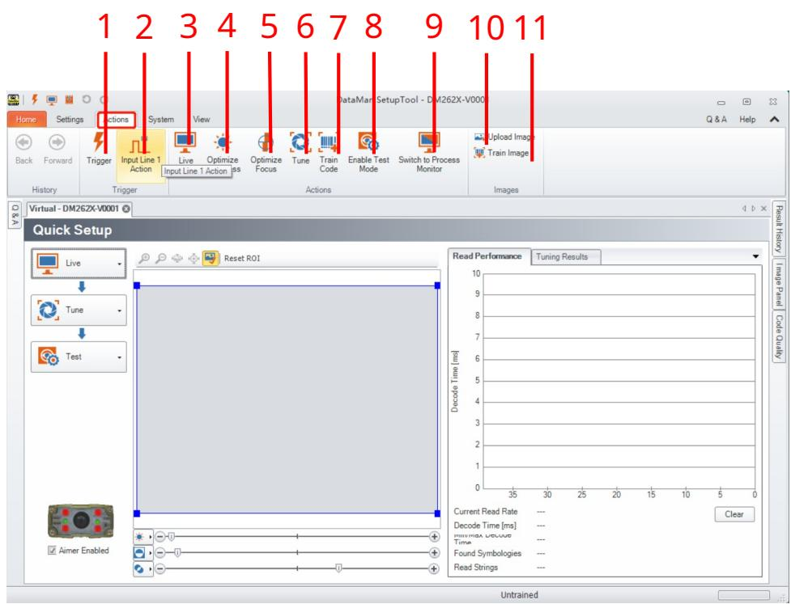

Actions-function list   

<table><tr><td>ItemTrigger</td><td>NO·</td><td>Name</td><td>Function</td></tr><tr><td>Input Line 1Action</td><td>1</td><td>触发器</td><td>手动单次触发读码器解码</td></tr><tr><td>Live</td><td>2</td><td>输入线路操作</td><td>读码器会设置不同的解码参数,先择解码方案</td></tr><tr><td>OptimizeBrightness</td><td>3</td><td>读码器实时</td><td>读码器实时拍照以便更好地调整读码器的位置</td></tr><tr><td>OptimizeFocus</td><td>4</td><td>优化亮度</td><td>可以调试读码器亮度和曝光</td></tr><tr><td>Tune</td><td>5</td><td>优化焦距</td><td>可以手动调试焦距也可以自动对焦</td></tr><tr><td rowspan="2">TrainCodeEnable TestMode</td><td>6</td><td>调谐</td><td>读码器子自动寻找最佳亮度,曝光和焦距</td></tr><tr><td>7</td><td>训练二维码</td><td>读码器通过训练记忆要解的码的大小,特征,以便加快解码时间和解码成功率</td></tr><tr><td>Switch to ProcessMonitor</td><td>8</td><td>启用测试模式</td><td>开启测试模式,读码器会自动开始解码,直到关闭测试模式才会停止</td></tr><tr><td>Upload Image</td><td>9</td><td>切换进程监视器</td><td>进程监视器可以监视读码器的解码时间和成功率</td></tr><tr><td>Train Image</td><td>10</td><td>上传图片</td><td>可以将解码后的图片进行保存和上传</td></tr><tr><td></td><td>11</td><td>训练图片</td><td>可以通过图片中二维码进行训练</td></tr></table>

# DataMan 软件界面介绍

# System 界面

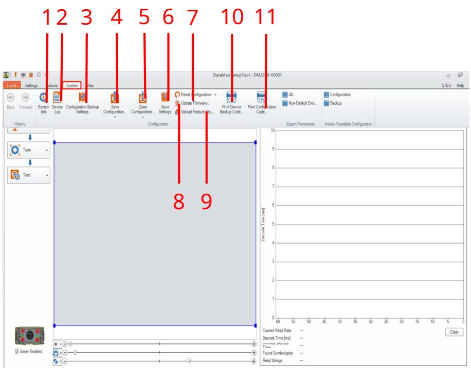

System-function list   

<table><tr><td>Item
System Info</td><td>NO</td><td>Name</td><td>Function</td></tr><tr><td>Device Log</td><td>1</td><td>系统信息</td><td>可以读取到读码器SN和软件版本号等信息</td></tr><tr><td>Configuration Backup Settings</td><td>2</td><td>显示日志</td><td>可以看到读码器错误log日志，通过分析日志，获取读码器故障</td></tr><tr><td>Save Configuration...</td><td>3</td><td>备份设置</td><td>配置IP和端口，程序会自动备份</td></tr><tr><td>Open Configuration...</td><td>4</td><td>保存配置</td><td>调试完成后需要保存文件CDC或CFG</td></tr><tr><td>Save Settings</td><td>5</td><td>打开配置</td><td>可以将保存好的文件打开导入保存好的参数</td></tr><tr><td>Reset Configuration</td><td>6</td><td>保存设置</td><td>将设置号的参数保存</td></tr><tr><td>Update Firmware</td><td>7</td><td>重置配置</td><td>可以重启读码器或者可以将读码器回复出厂设置重新调试</td></tr><tr><td>Upload Feature Key...</td><td>8</td><td>固件更新</td><td>更新固件可以防止读码器死机或者网络掉线</td></tr><tr><td>Print Device Backup Code...</td><td>9</td><td>上载功能密钥</td><td>脚本代码实现特殊的解码算法</td></tr><tr><td>Print Configuration Code...</td><td>10</td><td>打印 CDC文件</td><td>可以将CDC文件进行打印</td></tr><tr><td></td><td>11</td><td>打印 CFG文件</td><td>可以将CFG文件进行打印</td></tr></table>

# DataMan 软件界面介绍

# View界面

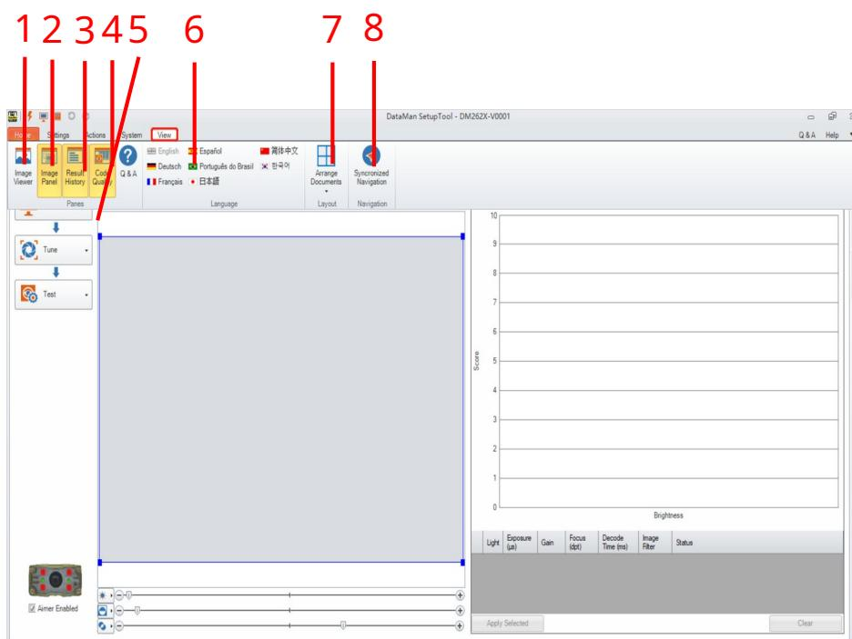

View-function list   

<table><tr><td>Item
Visor de imágenes</td><td>NO</td><td>Name</td><td>Function</td></tr><tr><td>Vista de herramrientas deImagen</td><td>1</td><td>图像查看器</td><td>显示实时界面，同时能跳转到快速设置界面，进行调试。</td></tr><tr><td>Historial de resultados</td><td>2</td><td>图像工具</td><td>测试模式，有些功能受到限制，只能测试触发解码时间</td></tr><tr><td>Calidad de los@códigos</td><td>3</td><td>历史结果</td><td>调试读码器光源亮度和取图图片格式设置</td></tr><tr><td>Preguntas y respuestos</td><td>4</td><td>代码质量</td><td>可以勾选读取码的类型，如：读取一维码或二维码</td></tr><tr><td>Organizar documentos</td><td>5</td><td>帮助文档</td><td>可以在帮助文档查找解决方案</td></tr><tr><td>Navegación sincronizada</td><td>6</td><td>语言切换</td><td>可以切换语言方便调试</td></tr><tr><td></td><td>7</td><td>排列文档</td><td>可以将界面进行排列</td></tr><tr><td></td><td>8</td><td>同步</td><td>同步更新最新的文档信息</td></tr></table>

# 小结

Cognex DataMan 软件的定义。  
读码器软件介绍以及读码器软件版本安装。  
读码器软件界面 Home、Setting 、Action 、System 、View等工具模块的详细介绍。  
- Setting/System 是调试读码器最常用的模块工具。

# DataMan 软件调试流程

# 常规调试流程图

连接读码器

- 选择合适的通信方式将读码器与 PC 进行连接。  
- 打开 DataMan 设置软件打开需要连接设置的读码器。

通信设置

- 在 DataMan 软件中的通讯设置根据通信协议要求对读码器通讯参数进行设备。

调试条码采集参数

- 根据条码情况，调整合适的视野尺寸和读码位置。  
- 根据实时读码情况，优化读码曝光、频率、打光方式的参数，并选择需要的触发方式。保存设置至读码器后退出 DataMan 设置工具。

读码器设置保存

- 将调试好的读码器进行保存。

# DataMan 软件调试流程

# 主机IP地址设置

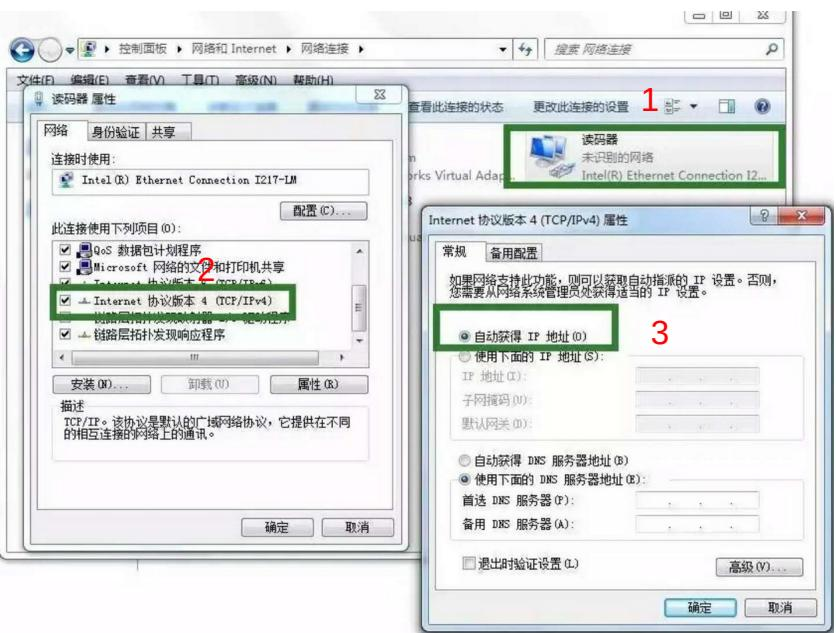

# PC端口IP地址设置：

根据通信协议要求，将PC端连接读码器网口IP地址设置为通信协议地址。

常用的IP地址如：

IP : 192.168.10.101

子网掩码：255.255.255.0

# DataMan 软件调试流程

# 以太网通信读码器IP参数设置

1. 打开 DataMan 设置工具软件;  
2. 在 DataMan 工具软件主界面，选择 Reader_Maintenance 选项，勾选“Show All Devices”  
3. 选中需要调试和设置的读码器。  
4. 在右侧网络设置栏中，选中“Use Static IP Address”，设置和PC端口同网段IP地址。

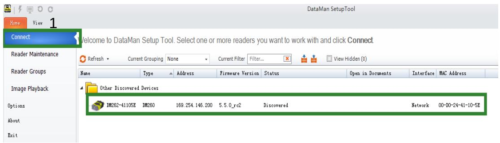

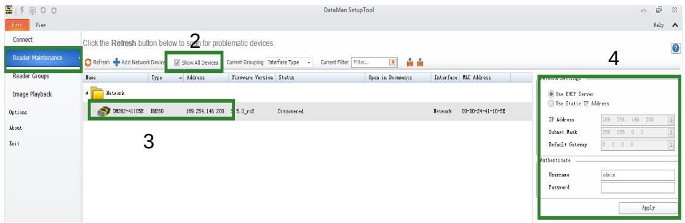

# DataMan 软件调试流程

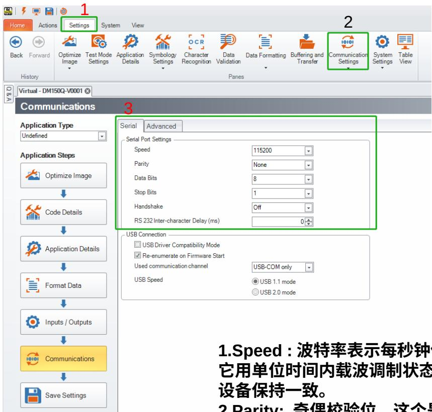

# 学习了解

# 串口通信读码器参数设置

1. 在 DataMan 主界面双击进入需要调试的读码器调试界面;  
2. 选择状态栏中的“Setting”选项；  
3. 在“设置”界面下选

择“CommunicationSettings”；

4. 选择“Serial”选项，对串行端口进行参数设备。

1. Speed：波特率表示每秒钟传送的码元符号的个数，是衡量数据传送速率的指标，它用单位时间内载波调制状态改变的次数来表示，我们需要将波特率参数和要通讯的设备保持一致。  
2.Parity：奇偶校验位，这个是串口通信简单的检错方式，串口会设置检验位，用一个值确保传输的数据有偶数个或者奇数个逻辑高位。  
3.DataBits: 表示数据位，通信中真正效的信息，数据位需要通信双方共同约定，一般在6,7,8位之间。  
4:StopBits: 停止位, 在一个数据的最后, 用来表示字符传输的结束, 一般停止位有 1 位, 2 位。  
5.USB Speed: 选择 SUB 的传输速度。

# DataMan 软件调试流程

# 读码器 Telnet 端口设置

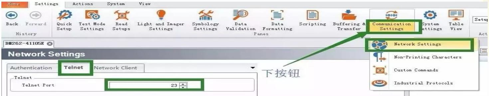

# 读码器自定义触发指令设置

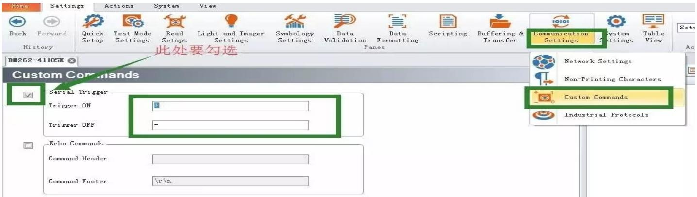

# DataMan 软件调试流程

# 读码器触发设置

1. 在“Setting”中的CommunicationSettings项中设置TelnetPort，默认“23”，非特殊情况尽量使用“23”;  
2. 为了触发读码器运行，可以通过指定触发信息来触发读码器读码。点击 CommunicationSettings 下按钮，选择 Custom Commands;  
3. 在 Serial Trigger 设定项中，可以设定 Trigger On 触发拍照开始指令以及 Trigger Off 触发拍照结束指令。

以上调试完成后即可在网络调试助手中，模拟发送触发指令读码器接收到指令之后，拍照解码，并把条码内容返回给客户端。

# DataMan 软件调试流程

# 读码效果优化

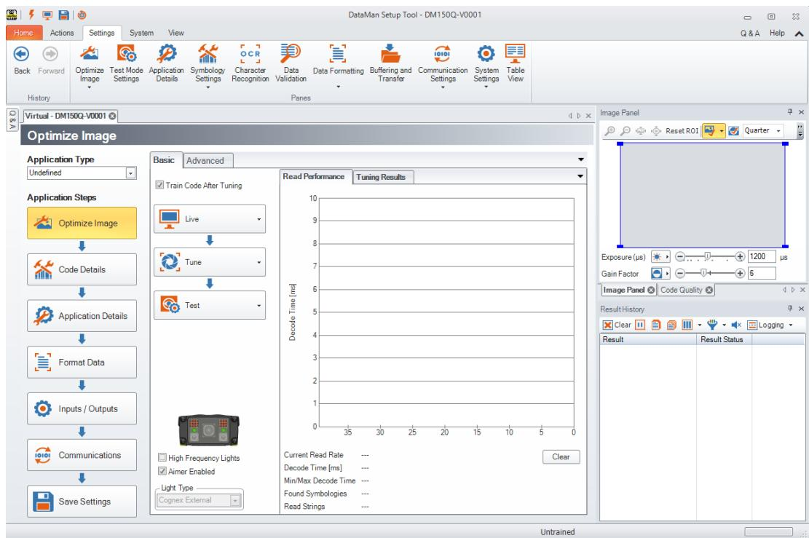

完成通信调试后，我们需要使用真实的条码及读码环境，通过 DataMan 软件中的 Optimize Image 进行读码参数进行优化：

1. 打光方式;  
2. 焦距;   
3. 曝光时间;  
4. 触发   
5. 模板训练。

# DataMan 软件调试流程

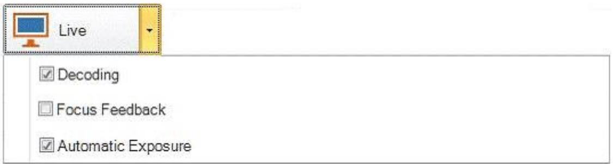

Live：实时显示图片，获取视野中物品的位置，点击Live按钮可以进入实时显示模式，实时显示模式不仅可以显示实时图像还可以实时解码。

1. 如果需要实时显示解码，请勾选Decoding  
2. 当 Focus Feedback 被勾选时，图像显示窗口右侧会显示一个带有颜色的计数条。计数条高度表示镜头的对焦情况（计数条越低表示对焦越差）。  
3. 勾选上 Automatic Exposure 可以让读码器自动设定曝光参数。图像显示区域下方的增益滑动条数值表示当前目标的像素灰度值。  
4. 在图像显示区，我们可以通过拖动、拉伸蓝色框设定感兴区域（ROI）。感兴区域表示读码器会在这个区域进行读码，忽略其他部分。

# DataMan 软件调试流程

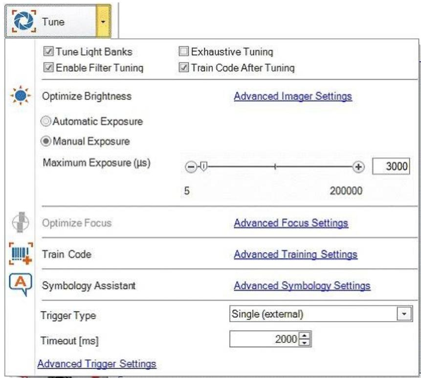

# Tune参数介绍：

Tune 按钮可以使读码器自动设定最佳读码参数，点击按钮最右侧下三角可以打开高级设定窗口：

1. Optimize Focus (优化对焦)   
2. Optimize Brightness (优化曝光)   
3. Symbology Assistant (码制助手)   
4. trigger type (触发模式)  
5. Train Code (训练条码)   
6. Advanced Trigger Settings（触发模式高级设定）和其他调节参数

设定

# DataMan 软件调试流程

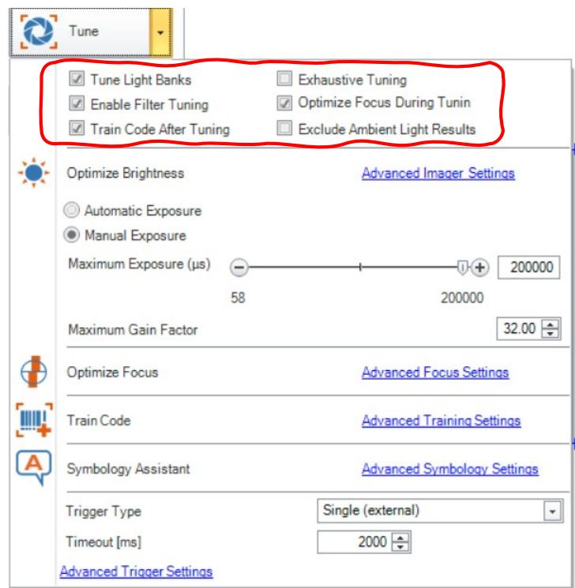

# Tune参数含义：

1. 如果设定了 Tune Light Bank，读码器会调节光源。如果我们清楚光源的设置，自动调节时，就会跳过光源的设定。  
2. 选定 Exhaustive Tuning 会强制调节光源。当 ExhaustiveTuning 被禁用时，读码器一旦在某一光源设定下成功解码，将不再改变光源设置。如果 ExhaustiveTuning 被启用，读码器测试所有的光源设置模式，不论是否已经成功解码。  
3. 如果 Enable Filter Tuning 被选上，DataMan会使用图像过滤器。  
4. 如果我们想在调节过程中自动对焦，需要勾选上 Optimize Focus During Tuning   
5. 勾选 Train Code After Tuning，会在自动调节成功之后，对条码进行训练

# DataMan 软件调试流程

# 自动曝光作用：

自动曝光就是相机代替人的操作，自动调节曝光时间、光圈、ISO进行曝光，使得所摄物体亮度正常，这句话解释起来很简单，但是存在两个难点问题：

第一，相机不如人眼这样可以直观的分辨图像明暗，如何判断这幅图像是否亮度合适；  
第二，如何调整曝光时间、光圈、ISO,这三者调节的比例。

# 增益作用：

增益控制感光灵敏度，高增益代表高灵敏度，对低光照越灵敏。同时也会对噪声进行发大，降低信噪比。

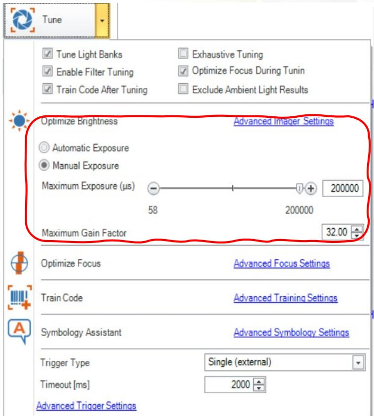

# DataMan 软件调试流程

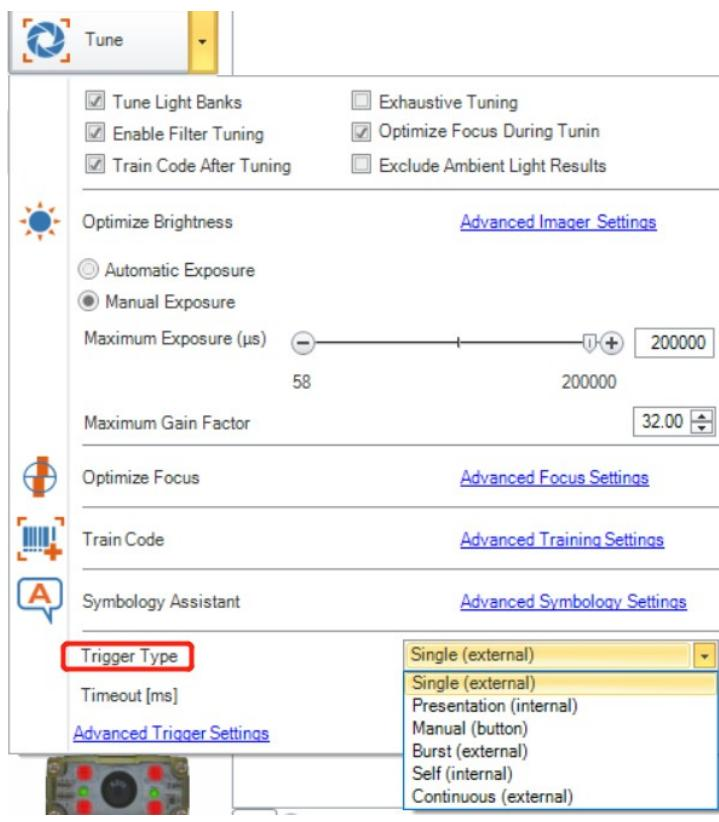

# 触发模式参数含义:

1. Single：拍摄单张图片进行解码，每个 Setup 会拍照一张。可以设定单个 Setup 的超时时间（timeout）；  
2. Presentation：连续拍照，每次对视野中的单个条码进行解码；  
3. Manual：在足够长的时间里进行拍照，直到成功解码或者触发信号结束；  
4. Burst: 拍摄一组图片进行解码, 并在首次成功解码时停止解码。我们可以设定每组图片的拍摄数量, 还有每次拍照之间的时间间隔。每次拍照都可以设定一个超时时间;  
5. Self: 与 presentation 模式类似;  
6. Continuous：在触发信号结束之前持续拍照，可以设定每次拍照时间间隔；  
7Timeout：表示读码器等待时间，直到读码器读码成功或者失败。

# DataMan 软件调试流程

# Tune 的作用：

读码器可以自动调节最佳光源亮度，自动调节最佳焦距，自动调节最佳增益等信息，最后会给出3各最优解码方案。

# Tune 的优点:

1. 便于现场工程师快于调试。  
2. 加快解码时间，提高解码成功率。  
3. 对于比较难读的码可以自动调节最佳解码方案。  
4. 便于现场零基础人员。

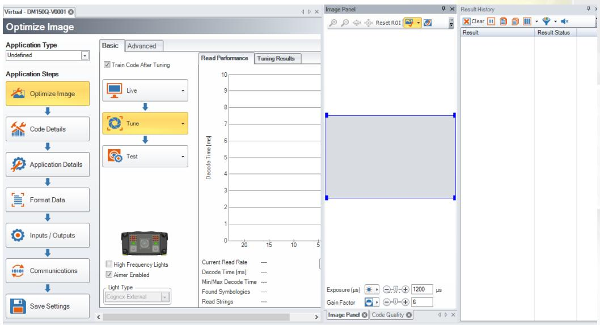

# DataMan 软件调试流程

点击 Test 按钮，可以测试读码器解码性能

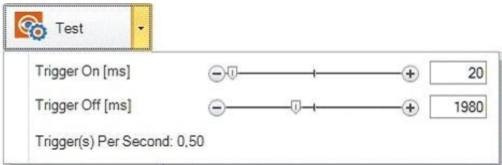

# Test 参数含义:

1. Trigger On : 收到指令读码器开始解码, 20ms=0.02s  
2. Trigger Off: 读码器结束读码, $1980 \mathrm{~ms} = 1.98 \mathrm{~s}$

# DataMan 软件调试流程

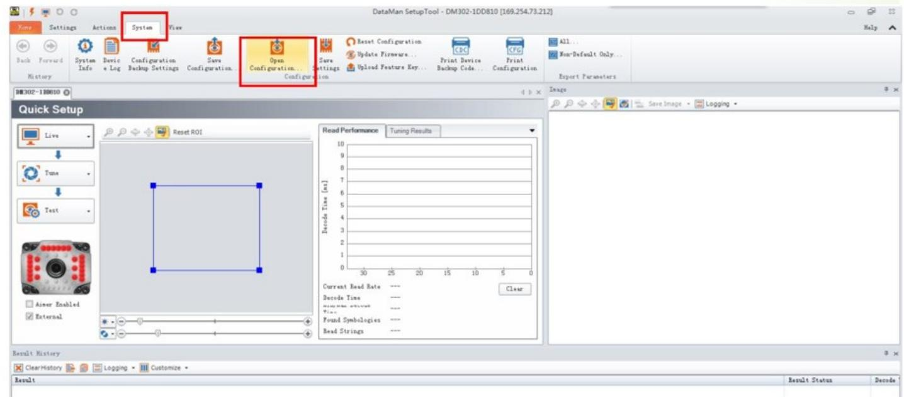

Save Configuration 作用：备份调试好的参数配置，防止程序参数丢失或被改，可以重新导入备份参数配置。

# DataMan 软件调试流程

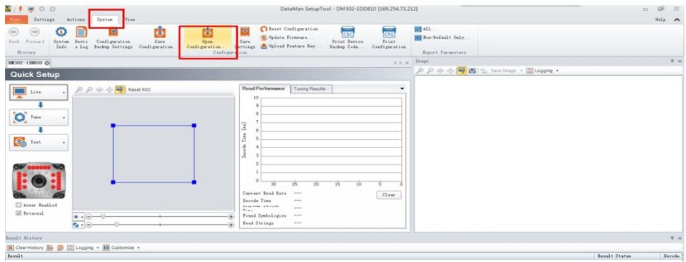

Open Configuration 作用：导入配置好的参数信息，以便现场调试参数统一，或者软件参数被改动，重新导入备份的配置参数。

# DataMan 软件调试流程

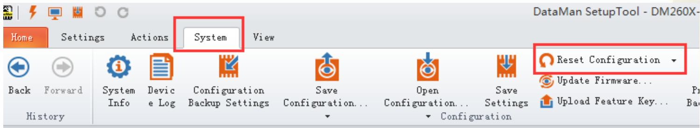

固件更新的作用：升级读码器固件防止读码器死机或者网络掉线。

# DataMan 软件调试流程

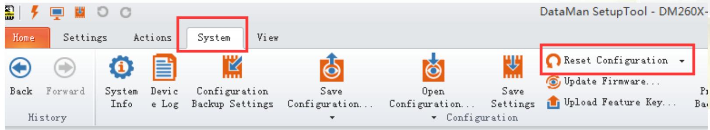

Reset Configuration：配置还原 Reset Configuration。

此功能能够将所有读码配置参数恢复至出厂设置状态，包括触发模式、Setup参数、Setup数量、脚本内容等等，但是无法更改网络连接信息（连接IP地址以及端口号）。

# DataMan 软件调试流程

# 小结

通过 DataMan 软件调试读码器流程：

1. 连接读码器;   
2. 设置读码器通信参数;   
3. 调试优化读码参数;   
4. 保存配置。

灵活运用 Tune 功能，加快读码器调试。

# 课堂测试

一、DataMan 设置软件中 Tune 的主要作用？  
二、DataMan 软件调试读码器具体流程？  
三、读码器升级固件的作用：

1. 防止读码器死机。  
2. 防止读码器电线。  
3. 加快解码速率。  
4. 提高解码良率。

四、电源线接 $24 \mathrm{~V}$ 时，正负极接线方法是：

棕正蓝负（或者红正黑负）

# Thank you.