# ID Basic Knowledge

# 学习目标

了解常见一维条码和二维码的种类及结构  
知道一维条码和二维码的差异  
激光识读器和图像式识读器

# 基本码制

一维线性条码  
PDF417   
DataMatrix   
QR-Code

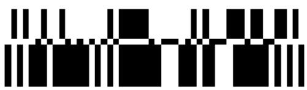

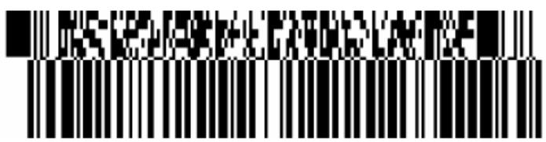

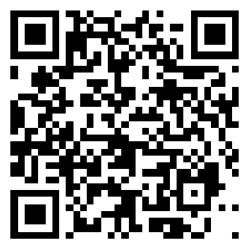

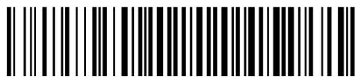

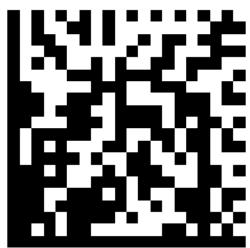

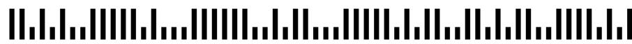

111111111111111111111111111

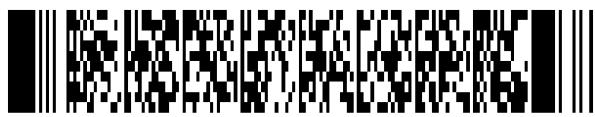

# 常用一维条码

条和空的排列规则不同形成了不同的码制，常用的如：

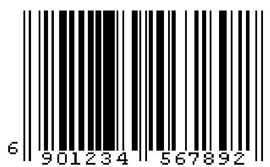  
EAN码

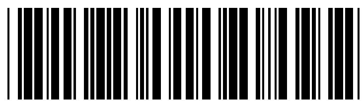  
CODE39   
39码

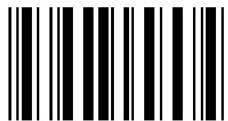  
123456   
交叉 25 码

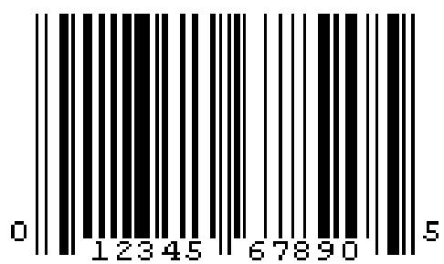  
UPC码

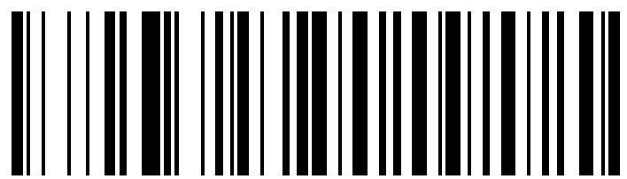  
Code-128   
128码

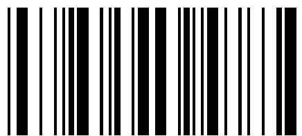  
A1234B   
Codabar 码

# 常用二维条码

  
Data Matrix

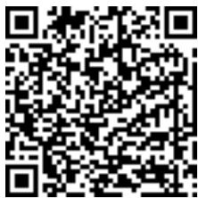  
QR Code

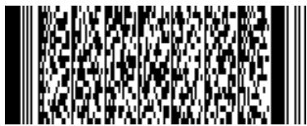  
PDF417

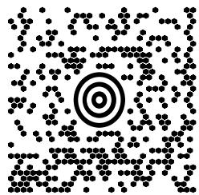  
Maxi Code

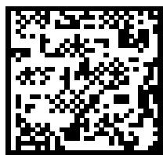  
Vericode

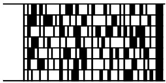  
Code 49

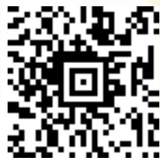  
Aztec Code

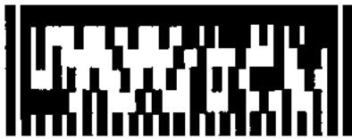  
Ultracode

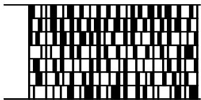  
Code 16K

#

# 一维条码的结构

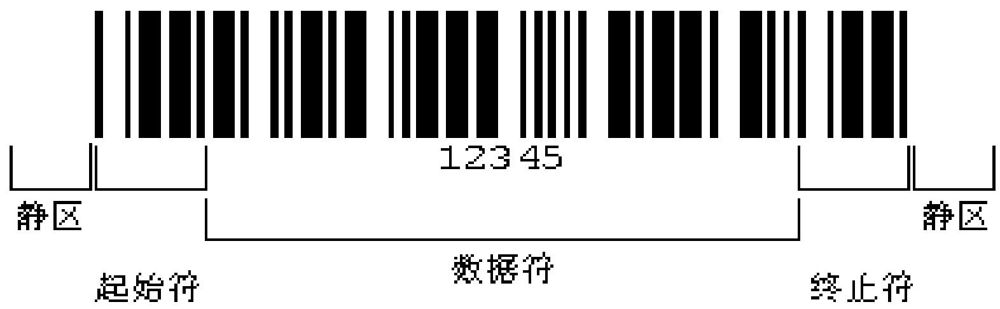

# 二维矩阵码的结构

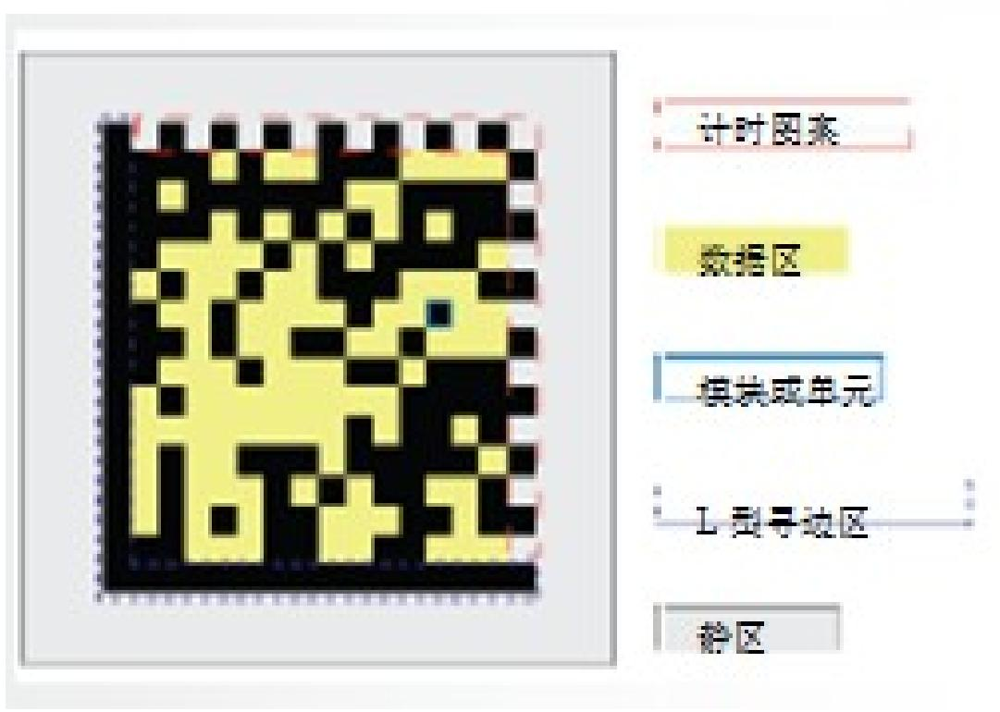

# 直接元件标示（DPM）工艺

# 4种主要方法

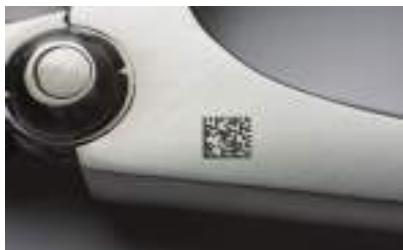  
激光

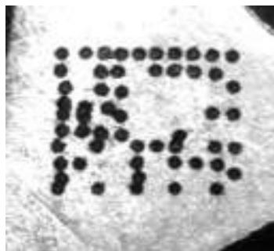  
喷墨

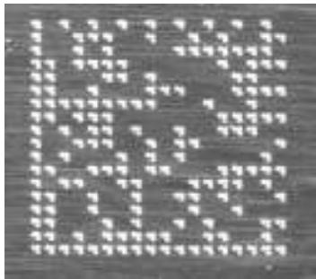  
打点阵和复刻

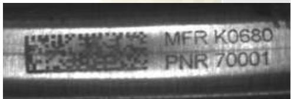  
电化蚀刻

选择时的要素  
元件期待寿命 表面质地  
材料成分 编码数据量  
环境磨损 空间  
数量 位置

# 直接元件标示最佳实践：数据矩阵标示的放置

在清晰、无障碍的位置标示  
确保代码周围至少预留 3-4 个单元宽度的 “静音区”  
在曲面上标示时，代码不得大于直径的 $16\%$ 或部件周长的 $5\%$ 。

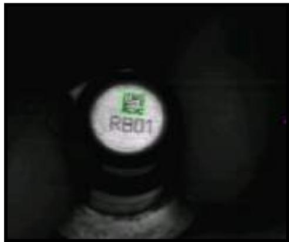  
低分辨率的小代码

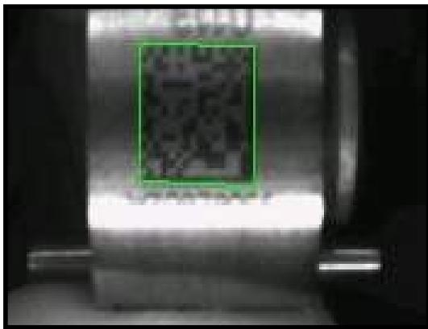  
在弯曲表面上标记

# 码密度：Mils

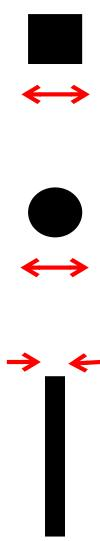  
Definition: One Module

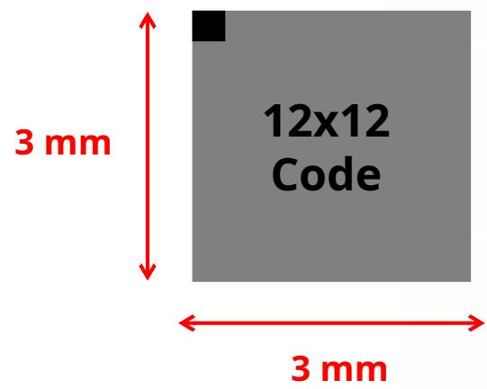  
Module Size Calculation:

$$
1 \text {m o d u l e} = \frac {3 \mathrm {m m}}{1 2 \text {m o d u l e s}} = 0. 2 5 \mathrm {m m}
$$

$$
\left(\frac {0 . 2 5 m m}{m o d u l e}\right) \left(\frac {1 i n c h}{2 5 m m}\right) \left(\frac {1 0 0 0 m i l}{1 i n c h}\right) = 1 0 m i l / m o d u l e
$$

# 什么是 PPM? (Pixels per Module)

A: How many pixels on the sensor for each module, at a focal distance.

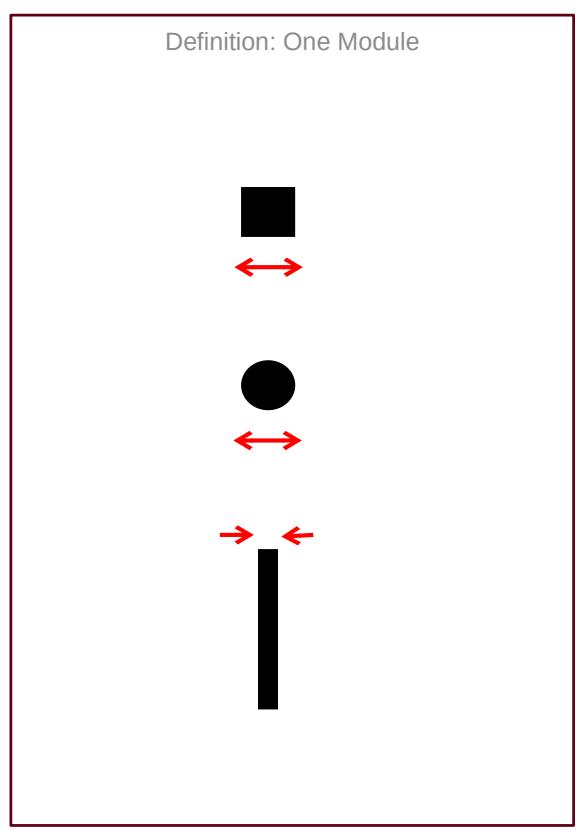  
Example:

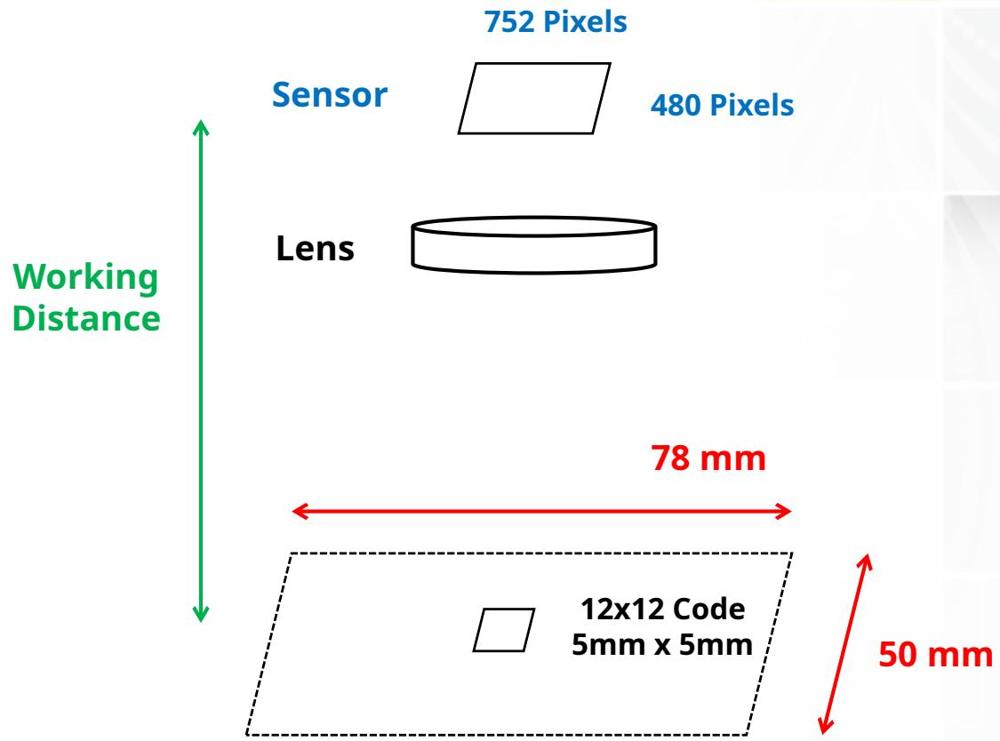

# 名词：读码 / 未读取 / 错误解码

Read: 正确解码  
No-Read: 数据没有被提取  
- 多种原因：时间不够，没有把握,etc.  
Misread: 确信的解码, 但是数据错误

错误解码比未读取的危害更大  
Cognex 解码原则宁可不解也不错解。

# 读码过程

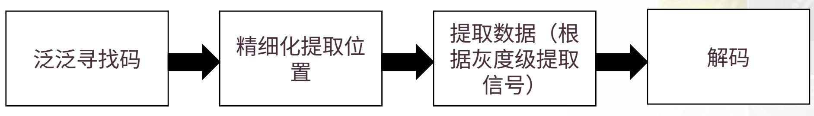

# Training

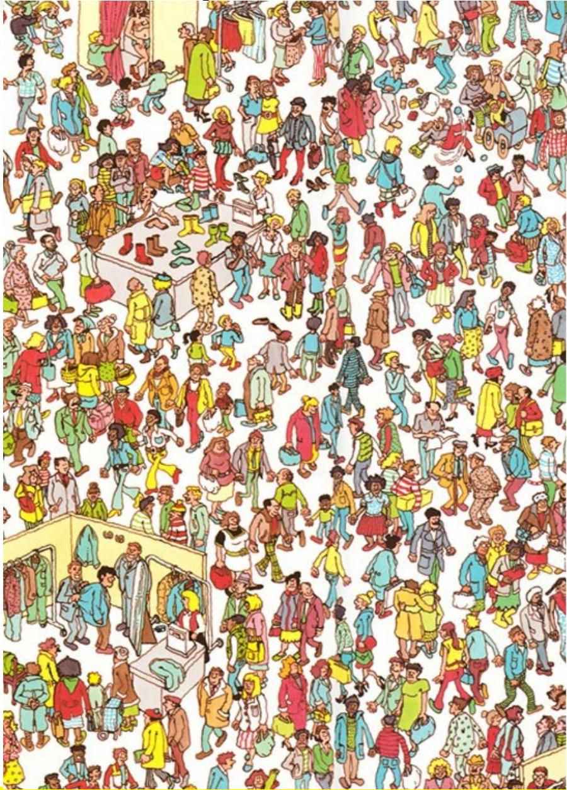

# 限制寻找 & 解码

降低出错的几率 -> 提高  
常常（并不总是）能降低解码时间  
什么是学习 / 训练  
大概的尺寸（PPM）  
极性  
反射状况  
行数 / # 列数 (2D)  
纠错类型 (2D)  
数据大小 (1D)

# 二维码与一维码的区别

单击此处编辑母版文本样式

# 二维条码（2-D Barcode）

在水平和垂直方向的二维空间存储信息的条码，称为二维条码（2-dimensional bar code）。

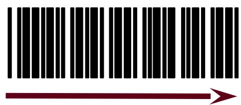

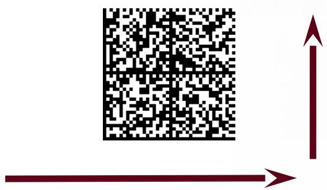

# 二维条码（2-D Barcode）

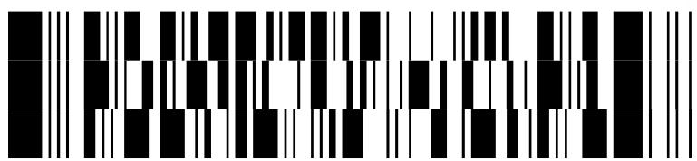

PDF417

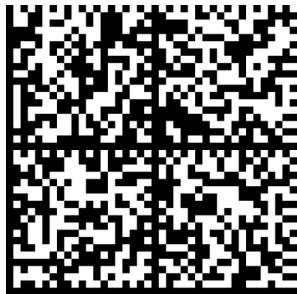  
线性堆叠式二维码  
矩阵式二维码

Data Matrix

1.1.1.1.1.1.1.1.1.1.1.1.1

MR P KIMMENS

邮政码

BPO 4-State

# 二维条码错误纠正（数据冗余）

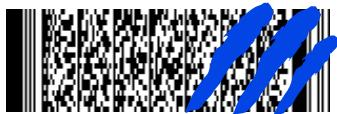  
Level 3

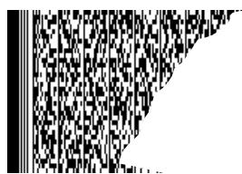  
Level 8

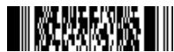  
Level 0

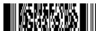  
Level 1

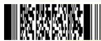  
Level 2

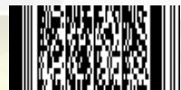  
Level 3

<table><tr><td>错误纠正等级</td><td>错误纠正码字数</td></tr><tr><td>0</td><td>2</td></tr><tr><td>1</td><td>4</td></tr><tr><td>2</td><td>8</td></tr><tr><td>3</td><td>16</td></tr><tr><td>4</td><td>32</td></tr><tr><td>5</td><td>64</td></tr><tr><td>6</td><td>128</td></tr><tr><td>7</td><td>256</td></tr><tr><td>8</td><td>512</td></tr></table>

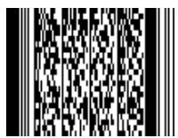  
Level 4

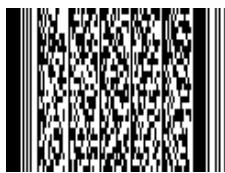  
Level 5

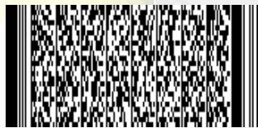  
Level 6

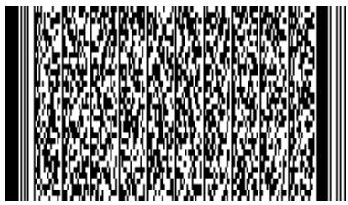  
Level 7

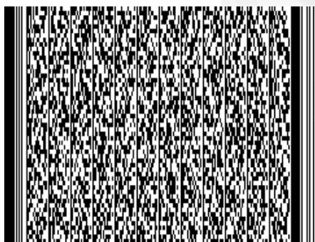  
Level 8

# 二维码的优点 - 数据容量

  
一维条码的局限  
较小的数据容量

1234567890

a-z,A-Z,0-9

  
二维条码的优点  
更大的数据容量 (2-3 KB)

# 二维码的优点 - 超越数字 / 字母

<table><tr><td>一维条码的局限</td><td>二维条码的优点</td></tr><tr><td>通常只能表达字母、数字和一些符号有些可以表达128个ASCII字符</td><td>可以表达8位二进制数据，可以对图像、汉字等进行编码</td></tr></table>

# 二维码的优点

小零件的标识 & 污损的标签

<table><tr><td>一维条码的局限</td><td>二维条码的优点</td></tr><tr><td>条码尺寸相对较大</td><td>条码尺寸相对较小</td></tr><tr><td>条码受损后不能阅读</td><td>条码受损后仍然可以阅读</td></tr></table>

# 激光读码器与图像识读器差异

单击此处编辑母版文本样式

# 激光扫描技术

  
目标反射光至光电池

  
条形码

  
光探测器信号

  
数字信号

# 激光扫描仪的局限性

# 难以扫描的条形码

印刷效果差  
存在缺陷 / 受损  
对比度低  
镜面反射   
高度窄

# 单向扫描

无全方位扫描（ $360^{\circ}$ ）或正交（ $0^{\circ}$ 和 $90^{\circ}$ ）读码  
安装和定位受限

# 活动部件容易出现故障

# 不能读取 2 维代码

# 视觉识读器技术原理

  
Source: Adome International, Inc.

# 基于图像读取1维条形码的优点

可以轻松读取所有代码，从印刷好的到难读的受损的代码。  
印刷效果差  
存在缺陷 / 受损 / 空洞  
对比度低  
镜面反射   
高度低  
过度透视

全向读码  
无机械元件  
较激光扫描仪更可靠   
可以读取 1 维和 2 维代码

# 为什么早期，成像仪不能取代激光识读器？

成本

图像传感器和外围设备部件的成本降低。

尺寸

如今可使用高密度和高集成的部件。  
如今可以使用火柴盒大小的基于图像的集成式读码器。

性能

图像处理算法现已超越激光扫描仪的性能。

# 图像式和激光式解码器的区别

<table><tr><td></td><td>图像式</td><td>激光式</td></tr><tr><td>内部结构</td><td>一体式，无活动部件，不易损坏</td><td>具有活动的摆镜，故障率高</td></tr><tr><td>解码方向</td><td>全向</td><td>单一方向</td></tr><tr><td>码制</td><td>一维码和二维码</td><td>一维码</td></tr><tr><td>解码能力</td><td>破损、质量差的代码</td><td>一般的条形码</td></tr><tr><td>图像反馈</td><td>有</td><td>无</td></tr></table>

# 早期图像式识读器

速度 帧率不够  
景深（DOF）较小   
DM 解决这些问题

# 从激光扫描到图像解码

激光扫描仪仍然占据在用的 1 维条形码读码器的最大份额。  
不过，激光扫描仪正快速地被基于图像读码器取代。  
基于图像读码器具有优越的读码性能（对比度低、损坏、噪音等。）  
基于图像读码器还可以读取 2 维码 - 而现如今, 几乎所有主要行业均采用了 2 维码。

# Thank you.