# CheckerboardTool

# 学习目标

掌握CogCalibCheckerboardTool工具含义以及作用  
掌握CogCalibCheckerboardTool使用方法

# CogCalibCheckerboardTool 介绍

- 物体通过镜头成像都会过多过少产生一定的扭曲，从而影响设备精度，为了提高精度以及完成其他执行单元的功能，我们需要对通过镜头取到的图像进行校正，进而获取精度较高的数据。  
那么今天我们要学习的CogCalibCheckerboardTool这个工具就可以完成校正这一工作。

# CogCalibCheckerboardTool 简介

如右图所示为

CogCalibCheckerboardTool

工具所在位置

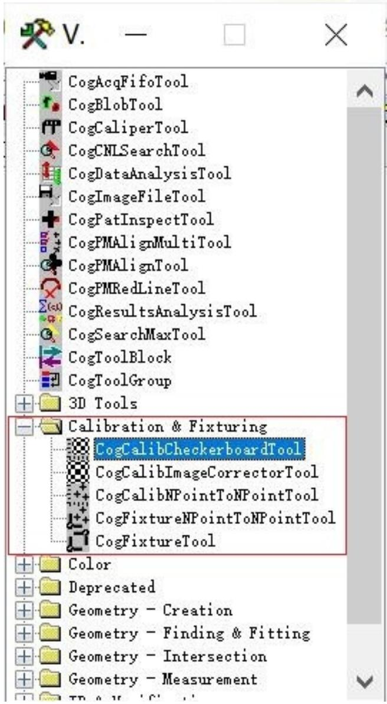

# CogCalibCheckerboardTool 作用

为什么用 CogCalibCheckerboardTool？

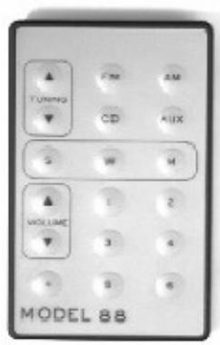  
未扭曲图像

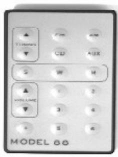  
纵横   
线性扭曲

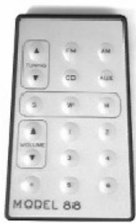  
透视

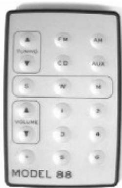  
放射   
非线性扭曲

如上图所示，为三种常见的图像扭曲类型

为了提高检测精度，所以我们需要用到

CogCalibCheckerboardTool 来校正图像本身存在的扭曲

# CogCalibCheckerboardTool 作用

CogCalibCheckerboardTool 作用:

1. 棋盘格校准使用一个棋盘格板来计算像素和真实单位（mm）之间的转换  
2. 可以计算线性和非线性转换（非线性转换说明图像存在光学或透视扭曲）

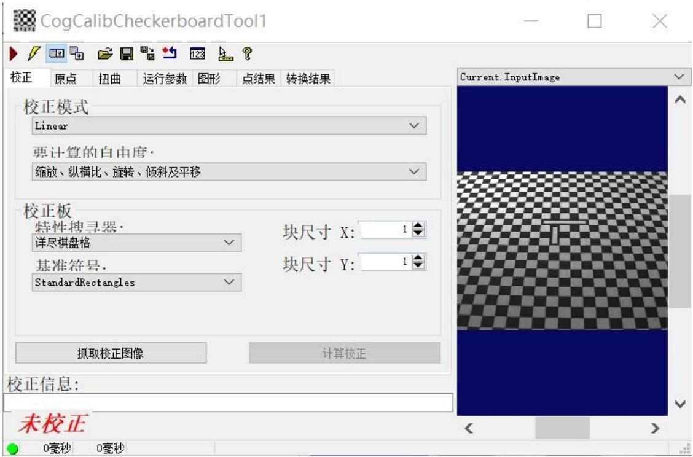

CogCalibCheckerboardTool 工具界面如上图所示

# CogCalibCheckerboardTool 使用方法

如右图所示，为

CogCalibCheckerboardTool 基本操作步骤：

1.抓取校正图像  
2. 选择校正模式  
3. 选择特性搜寻器  
4. 标明在您的校准版上是否存在一个基准（原点）标志  
5. 输入校正板尺寸   
6. 计算校正，查看转换结果

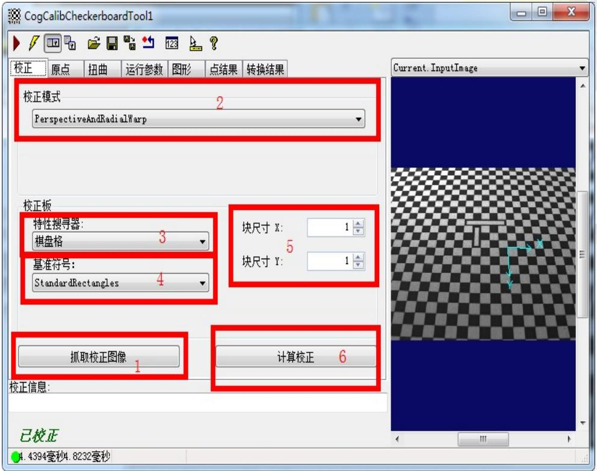

# CogCalibCheckerboardTool 使用方法

首先，点击抓取校正图像按钮，将标定板的图片传进来，之后就可以选择校正模式了

# 校正模式

```txt
Linear   
Linear   
PerspectiveAndRadialWarp LinescanWarp Linescan2DWarp SineTanLawProjectionWarp ThreeParamRadialWarp NoDistortionWarp 
```

如左图所示，为校正模式：

1.Liner (线性畸变)   
2. Perspective And Radial

Warp (透视和放射畸变)

3.LinescanWarp   
4.Linescan2Dwarp   
5. SineTanLawProjectionWarp   
6. ThreeParamRadialWarp   
7.NoDistortionWarp

# CogCalibCheckerboardTool 使用方法

如右图所示，根据标定板类型选择特性搜寻器

特性搜寻器：

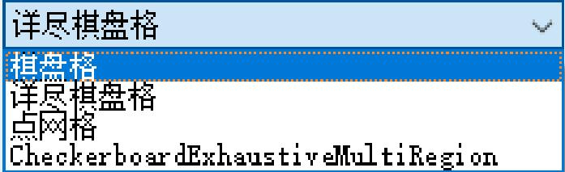

如右图所示，为两种常见的标定板类型，棋盘格与点网格

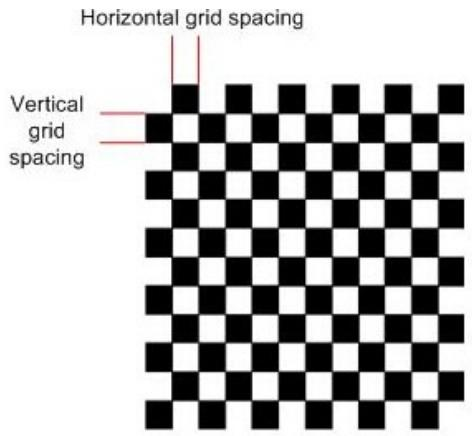  
棋盘格  
Checkerboard plate

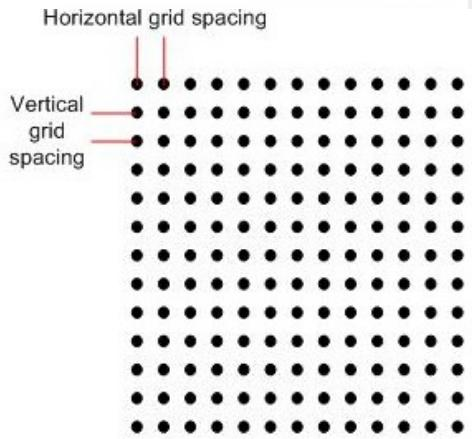  
点网格  
Grid-of-dots plate

# CogCalibCheckerboardTool 使用方法

如右图所示，选择是否有基准（原点）在标定板上

基准符号：

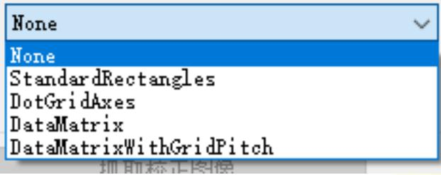

如右图所示，为带有基准（原点）的棋盘格，图中红色标注出来的即为原点。

注：如果找到基准，该点将成为原始校准空间的原点；如果没有找到，原始校准空间的原点是最接近校准图像中心的顶点。

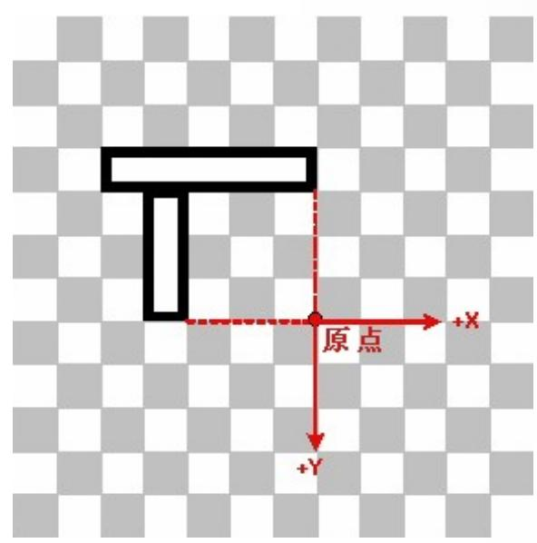

# CogCalibCheckerboardTool 使用方法

如右图所示，输入校正板的尺寸（非常重要，不能输错）输入校正板尺寸之后，点击计算校正即可。

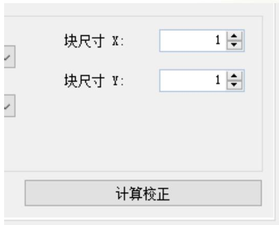

如右图所示，为计算校正之后转换结果界面，我们可以看到相关的校正系数，至此便完成了图像校正。

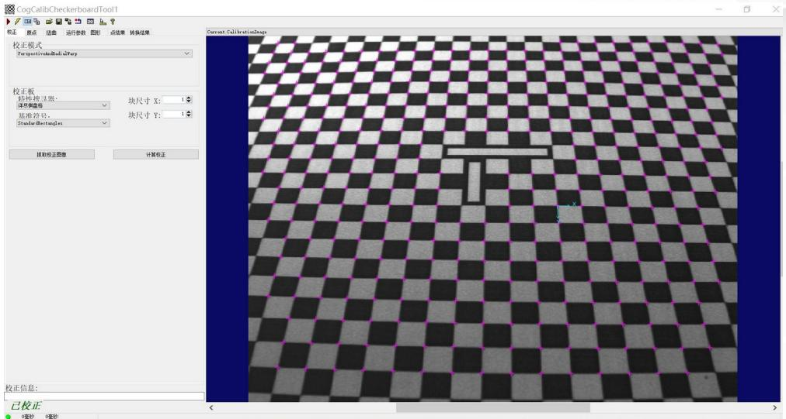

# CogCalibCheckerboardTool 使用方法

怎么使用校正后的结果:

如右图所示，当我们完成图像校正之后，就可以使用该工具对我们的输入图像进行校正了。

只需要把另外的图像输入进该工具，再将输出图像传递给其他工具，此时的图像就已经是被校正过的图像了。

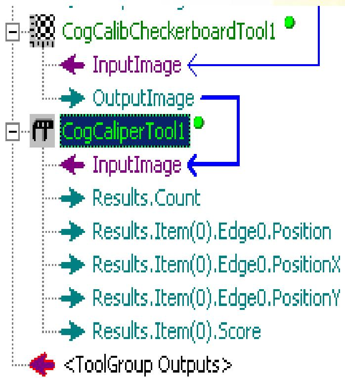

# Thank you.