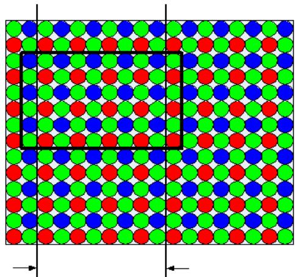

Acquiring Images with GigE Vision Cameras

本主题包含以下部分：

Acquirinq Imaqes with a CCD Camera and Frame Grabber   
. Acquiring Images with a CDC Camera and Frame Grabber   
Acquiring Imaqes with a Line Scan Camera   
  
Acquirinq Imaqes with GiqE Vision Cameras

本节提供有关在 VisionPro 和 Visual Studio 应用程序中使用 GigE 视觉摄像机的信息。GigE相机不使用帧抓取器，而是连接到一个千兆以太网网络适配器连接到您的计算机。有关配置QuickBuild应用程序以使用GigE Vision摄像机的信息，请参阅配置图像源。要使用 GigE Vision camera，必须在安装在计算机上的 Cognex 帧捕捉器、与之连接的Cognex 加密狗或通过 Cognex 软件许可证启用 VxSWAcquisition 安全位。

注意:请务必阅读 VisionPro 工具包附带的 GigE Vision Cameras 用户指南，学习如何创建相机网络，如何将相机连接到网络，以及如何为相机分配IP地址。

# GigE Vision Acquisition Overview（GigE 视觉取像概述）

要从GigE相机获取图像，您使用的技术与使用cognex提供的帧抓取器获取图像的技术完全相同。唯一的区别是，ICogFrameGrabber接口是一个物理的GigE相机，而不是一个帧抓取器。以下部分列出了获取图像的步骤。

# Get a CogFrameGrabberGigEs Object

第一步是获得一个 CogFrameGrabberGigEs 对象。

这个对象是单个帧抓取对象的集合，每个对象都通过 ICogFrameGrabber 接口访问。

每个 ICogFrameGrabber 表示与计算机系统相连的 GigE 相机。

CogFrameGrabberGigEs cameras $\cdot$ new CogFrameGrabberGigEs();

# 四、Enumerate the Connected Cameras（枚举连接的相机）

创建了CogFrameGrabberGigEs对象之后，就可以枚举它的内容，为每个连接的摄像机获取一个 ICogFrameGrabber 接口。

Count属性返回连接到您的系统的GigE相机的数量。

你可以使用Item属性(或者c#中的索引器)来获得一个单独的相机。

如果相机还没有连接好计算机，他们将不被包括在计数中，并且你将无法得到他们的参考。在启动应用程序之前，请确保您的相机已经完全通电、连接到网络并配置好。

ICogFrameGrabber接口的Name属性将返回相机的制造商名称和型号。

CogFrameGrabberGigEs cameras $\cdot$ new CogFrameGrabberGigEs();

ICogFrameGrabber camera $\cdot$ cameras[0];

System.Diagnostics.Debug.WriteLine(camera.Name);

# 五、 Select a Supported Video Format and Create a CogAcqFifo

一 旦 获 得 了 ICogFrameGrabber 接 口 ， 就 可 以 使 用 支 持 的 视 频 格 式 调 用 其CreateAcqFifo 函数来获得 ICogAcqFifo。

个版本的 VisionPro 支持在 VisionPro 的摄像机支持主题中列出的 GigE Vision 视频格式。

const stringVIDEO_FORMAT $=$ "Generic GigEVision (Bayer Color)";   
ICogAcqFifofifo $=$ camera.CreateAcqFifo(   
VIDEO_FORMAT,   
CogAcqFifoPixelFormatConstants.Format8Grey,   
0, true);

通用的GigE vision视频格式不指定图像大小。为了确定获得的图像的实际大小，在创建了采集FIFO之后立即得到感兴趣的区域，如下图所示:

ICogAcqROI ROIParams;   
int x, y, width, height   
ROIParams $=$ myAcqFifo.OwnedROIParameters;   
if (ROIParams != null)   
OIParams.GetROIXyWidthHeight(x, y, width, height);

# 六、 Use the CogAcqFifo to Acquire Images

一旦创建了 ICogAcqFifo，就可以使用标准方法获取图像。

# 七、 GigE Vision Camera Feature Support

许多常用的GigE vision相机功能都是通过VisionPro图像采集属性直接支持的。

对于VisionPro不直接支持的特性，可以使用 ICogGigEAccess接口来获取和设置特性。

阅 $\%$ VPRO_ROOT%\Samples\Programming\Acquisition\GigEVisionProperties 中 的示例代码，了解如何做到这一点。

注意:如果在 VisionPro 脚本中使用特性设置和获取方法，则必须将调用封装在 try/catch块中。如果您不使用try/catch块，您的脚本可能会导致您的作业超时。

Table 1. GenICam features supported by VisionPro   

<table><tr><td>GenICam Feature</td><td>VisionPro Property</td><td>Comments</td></tr><tr><td>AcquisitionMode</td><td></td><td>Controlled by the combination of TriggerModel</td></tr><tr><td>AcquisitionStart</td><td></td><td>TriggerEnabled and StartAcquire</td></tr><tr><td>AcquisitionStop</td><td></td><td></td></tr><tr><td>PixelFormat</td><td></td><td>Based on video format used</td></tr><tr><td>TriggerMode</td><td>ICogAcqTrigger</td><td>Based on current TriggerModel</td></tr><tr><td>ExposureTime</td><td>ICogAcqExposure</td><td></td></tr><tr><td>BlackLevel</td><td>ICogAcqBrightness</td><td></td></tr><tr><td>Gain</td><td>ICogAcqContrast</td><td></td></tr><tr><td>OffsetX</td><td>ICogAcqROI</td><td></td></tr><tr><td>OffsetY</td><td></td><td></td></tr><tr><td>Width</td><td>ICogAcqROI</td><td></td></tr><tr><td>Height</td><td></td><td></td></tr></table>

要了解如何使用时间戳来检测 GigE视觉摄像机错过的图像或错过的触发器，请参阅使用GigE视觉摄像机的时间戳。

# 八、 Debugging GigE Vision Applications

GigE相机要求应用程序定期向相机发送一个网络数据包，称为心跳，以表明应用程序正在与相机通信。如果相机在超时时间结束前没有收到心跳脉冲，它将关闭与应用程序的连接。

默认心跳超时时间为3秒。

在调试GigE Vision应用程序时，您将希望增加心跳超时时间间隔，以便在您处于断点时相机不会脱机。您可以添加以下代码到您的程序:

```java
ifdef DEBUG//defined for MS Visual Studio debug builds //Set timeout to 1 minute (unit is mSec) camera.gigECameraAcess.SetIntegerFeature("GevHeartbeatTimeout",60\*1000); #endif 
```

# 九、 Saving and Restoring Camera State（保存和重置相机状态）

通过使用相机的UserSetSave命令，您可以将您更改的任何功能的状态保存到相机的内存中:

```javascript
camera.SetFeature("UserSetDefaultSelector", "UserSet1");  
camera.SetFeature("UserSetSelector", "UserSet1");  
camera.ExecuteCommand("UserSetSave"); 
```

# 十、 Working with Bayer Images

转换拜耳格式图像的 VisionPro例程要求图像的像素和行数为偶数，左上角的像素是拜耳模式的开始。VisionPro GigE视觉采集软件调整感兴趣区域(ROI)，以确保满足这些条件。图像的实际ROI可能比您要求的更窄或更短两个像素。

  
Left edge of ROl adjusted to get corred upper-eft pixel.   
Riglt edge of ROl acjustedto get even number ofpixels

# 十一、Managing GigE Vision Bandwidth Use

如果你在同一个网络适配器上使用多个摄像头，摄像头的数据速率可能会超过GigE网络的带宽。

在这种情况下，为了管理带宽，你可以调整相机的帧率。示例程序%VPRO_ROOT%\Samples\Programming\Acquisition\GigEVisionProperties 展示了这种技术的一个示例。在 %VPRO_ROOT%\Samples\QuickBuild\

Script_GigEBaslerscout_Bandwidth_job.vpp 中可以找到这种技术作为 QuickBuild 作业脚本的示例。