# 一、填空题

1、在工业相机的使用中，选择远心镜头的优势主要是_超高分辨率_、_超宽景深_、_低畸变_。（）

2、 光是一种电磁波，可见光的范围是___380nm_到___760nm_。（ ）

3、改变图像采集明暗度的方式有__调节光圈_、_调节曝光_、_换高亮度光源_、_换大像元相机_。（ ）

4、 名词解释

帧率_相机一秒可以采集多少图像，通常表示相机采集单张图片的速度。（ ）

曝光时间 _感光芯片的感光时间_。（ ）

像素深度_ _每个像素数据的位数，通常8bit。（ ）

PPM 值 单个模块上的像素数。

视野__相机所能看到现实世界的物理尺寸_。（ ）

测量精度 _测量值与真实值之间的差别 。

像素分辨率 _单个像素所能代表的实际尺寸_。（ ）

放大倍率 _CCD/FOV 之间的比值__。（ ）

景深__在对焦点前后能够清晰成像的距离叫做景深。

工作距离：被测物到镜头的距离 （ ）

像素（Pixel)-像元：感光器件上的基本感光单元

视野：相机所能看到的现实世界的物理尺寸（ ）

像素分辨率（mm/pixel);每个像素代表的毫米值

分辨率（Resolution)：相机采集图像的像素点数

5、 在 Patmax 中建模板的三大要素是：_位置_、___尺寸__、_角度__。（ ）

6、请列举Caliper Tool 的工作极性方法是___由明到暗__、_由暗到明 _任何极性 。

7、在PMAlignTool中颗粒度决定了____用多少边缘点来表示图像中的特征。

8、视觉视觉的四大功能_ _引导____、 _检测 _测量 _识别_ _。 （ ）

9、 相机按照像素排列方式分为 _线阵相机 _面阵相机_ 。  
10、 相机感光器件上的基本感光单元/相机识别到的图像上的最小单元是 _像元_ 。  
11、 视野英文缩写为___FOV_ ___，定义是 相机所能看到现实世界的物理尺寸__。  
12、 常见的曝光方式有 _全局曝光_ _和 __卷帘曝光_ 。  
13、 镜头的场畸变有 _径向畸变 _和 _切向畸变 _两种。（ ）  
14、 8704E 卡采用 4-Pin 电源连接器连接 12 V 电源。（ ）  
15、 Cognex QuickBuild 视觉保存 Appliaction、Job、Tool 项目文件的格式/后缀为：____.vpp_ _。  
16、 在CMD窗口输入 _cogtool -p_ _命令可以查看板卡信息。  
17、 在Gige配置相机时需要设置：___IP_ _防火墙_ _ebus_ _巨帧数据包_ _。  
18、 CCD 即感光元器件是由一组矩阵式的 感光芯片 组成，它的功能是将光信号转换成_电信号___。（）  
19、 CogCaliperTool 的边缘模式有___单个边缘_和___边缘对__。（ ）  
20、 在 PMAlignTool 中建模主要获取的是目标物的___特征和轮廓__。  
21、 CMOS作为工业相机感光芯片的首选，它的优势有哪些，请写出三条。__耗电量低___、 _速度快___、_价格便宜 。 （ ）  
22、 VisionPro 工具库中 CogFixtureTool 作用主要为____产生坐标的跟随。  
23、 在 CogBlobTool 中，当目标物与背景有明显灰度值变化，我们为了凸显特征面积，一般会调整 _阈值_从而获取更精确的目标大小。  
24、 在工业相机中，镜头的基本功能是 实现光束转换 。 （ ）  
25、 机器视觉系统由_视野、光源、图像采集、视觉工具、信息传输___构成（ ）  
26、 WD和FOV的关系__物距越大视野越大  
27、 说出几种常用LED光源的名称__条型光、面光、环形光、非同轴漫射光、同轴光  
28、 CogPMAlignTool 是基于 图像位置搜索 的模板而不是基于像素灰度值的模板匹配工具，支持图像的位移 与 旋转角度 的自由度。（ ）  
29、 黑白相机成像原理为 有光线进入相机区域表现为__白___色，无光线进入相机的区域表现为__黑__色

30、 相机的分辨率是以__像素/像元___为单位。  
31、 单个像素所代表的实际尺寸称之为（FOV/像素数）_分辨率/解析度 _。 （ ）  
32、 光在感光元器件上的感光过程称之为___曝光_ _时间。（ ）  
33、 15、光圈的作用__控制镜头的通光量___，光圈值 f1.4 和 f2.8 中____F1.4_ _成像更亮。（ ）

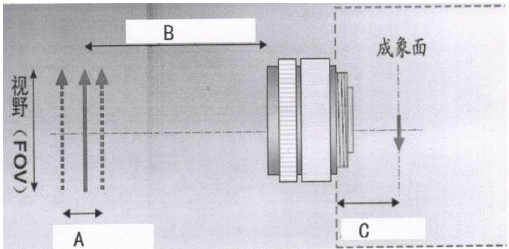

34、  
35、  
36、  
37、

19、Caliper 工具中 代表卡尺的___扫描__方向，_投影_ _方向要与查找的边缘平行。（ ）

38、  
  
39、  
40、  
41、  
42、  
43、

焦距是__透镜中心__到焦点的距离，焦距越小，景深越____大___，光圈越大，景深越___小__。（

44、  
45、 45、  
46、 46、

8704E 卡采用 4-Pin 电源连接器连接____12v______电源。（ ）

47、 DOME（穹顶光）光源的试用环境有：___金属物体表面的打光 _。

解释名词:Trigger: _触发 _、Live__实时显示 _、Exposure: 曝光 _、Focus: ___对焦

_。 Caliper:卡尺 、Accept threshold: 接受阈值 Calibration 标定

Blob 斑点 1 Measurement 测量 Run Params 运行参数

48、 在 PMAlign 搜索时，表示图像中不同区域之间界限的轮廓线成为___绿色 。

49、 视野 是图像采集设备所能够覆盖的范围，它可以是在监视器上可以见到的范围，也可以使设备所输

出的数字图像所能覆盖的最大范围。（ ）

50、 影响精度（模板匹配）的四大素： 弹性 、 特征多少 、 原点位置 、 粒度。

51、 影响精度的四个要素：视野（FOV） 相机分辨率（百万像素）、图像质量、 视觉工具精确度 （

）

52、 成像过程的四步骤： 物体反射光源光线进入到相机 、 相机将光线折射到图像传感器 、 图像传感器

将光信号转换成电信号 、 电信号转换成数字信号 。 （ ）

53、 基本码制包括 一维线性条码 、矩阵式二维码/Data Matrix、QR-code 、 PDF417四种。（ ）

54、 CCD即感光元器件是由一组矩阵式的 亮度感应元器件 组成，它的功能是将光信号转换 成电信号。（

55、 图片保存路径：D:\Cognex\Images 软件备份路径 D:\Cognex\CognexBackup 及按要求 7 天 备份 1 次

56、 畸变 指的是由于镜头方面的原因导致的图像范围内不同位置上的放大率存在的差异。几何畸变主要包

括径向畸变和切向畸变。如枕形或桶形失真。（ ）

57、 最常见的成像器（成像芯片）类型 CCD 和 CMOS，这两种成像器各自优缺点是 1.CCD 噪 点 少

CMOS噪点多，2.CCD耗电高CMOS耗电低，3.CCD成本高CMOS成本低，4.CCD分辨率高 CMOS分辨率

低，5.CCD感光度高CMOS感光度低，

58、 彩色相机每种颜色由3个不同成分构成，分别是__红__， _绿 蓝 。 （RGB）

59、 光源的 安装角度 和 方向 直接决定图像的效果

60、 8704e 图像采集卡的特点: PCIEx4 接口 、 拥有 4 个独立的 GigE 以太网口 、 稳定的 Cognex 授权 、 支

持巨型帧 、 PoE供电

61、 读码器电源线连接在___24___V的直流电源上，其中接正极为___棕___色，负极为___蓝__色。 ）

62、 感光器成像区域的尺寸通常由感光片的 长边 决定。  
63、 Setup Tool 是用于方便调节相机 位置 、 视野 、 倾斜 、 聚焦 的 工具，这样在调机是能更加方便快捷和准确焦距、 ）  
64、 光圈和景深的关系是：光圈越大，景深 小 、光圈越小，景深 大 。  
65、 .CogDistancePointPointTool 的作用是 求出点到点的距离 。  
66、 在模板匹配精细中得到的特征结果用三种颜色表示，其中绿色的含义是： 匹配度良好 、黄色的含义是匹配度一般 、红色的含义是： 匹配度较差 。  
67、 .Cognex 目前使用的程序都是在.NET Framework 基础上运行的，为保证程序正常运行，需确认.NET版本号为 4.6.2 以上。  
68、 型号 CAM-CIC-5000R-14-G 的相机，它的分辨率是 500w  
69、 当我们设置完相机 IP 和电脑 IP 后，发现设置的 IP 地址会自己变化，我们应该去查看防火墙是否 关闭，杀毒软件是否 关闭 ，巨帧数据包是否为 9014 。  
70、 固定扫码枪的型号是 DM262 。  
71、 根据光源的形状可分为： 点光、 条光、 面光、 同轴光、 环光、 非同轴漫射光 。（ ）  
72、 在进行视觉对位引导项目中，需要建立视觉坐标系与机械手坐标系之间的关系，而 标定 就是来完成该作用。（ ）  
73、 光在感光元器件感光过程称之为_ __曝光_ _时间。  
74、 日常生活中我们常用 QR-code码和工业生产中用矩阵式二维码/Data Matrix 码  
75、 在视野与像距的关系中，像距越大，视野 越小  
76、 光圈值大，光圈 越小 ，图片 越暗 。  
77、 在 AlignVisSystem 软件的模拟器中，Camera 表示_触发一次__,Live Camera 表示_实时拍照_,File 表示_加载图片____，Folder表示__加载文件夹_。（ ）  
78、 使用 GigE 设置相机 IP 点击: 开始 -> 所有程序 ->选择 Cognex >选择 visonpro ->选择【Utilties】-选择【GigE Vision Configuration Tool】（ ）  
79、 静态数据是__1_Pcs 物料在 FOV 中静止不动的情况下，相机连续拍照_32_次的数据，动态数据是_1__Pcs物料在FOV内做单工位重复动作的情况下，相机连续拍照__32__次的数据。

80、 GRR 数据是取__10__Pcs 物料做该机台整体流程，然后把这批被测物体在最终检测工站，各拍照___9_次的数据。  
81、 CPK 数据是取_32_PCS 物料，做该机台整体流程，每一 PCS 物料做___1__次的数据。

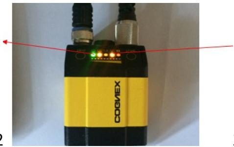

82、 条码枪 DM262

左边绿色的灯表示_电源指示灯_,右边倒数第二个（标

识）的灯表示_ __网线灯 。 （ ）

83、 8704E卡采用4-Pin电源连接器连接 12V 电源（ ）  
84、 机台有两张 8704 卡的需要特别注意，如果双击后，升级没有成功，就右击选中文件点 击编辑 bat 文件进行修改顺序编号，即把“0”改为 1 ，修改顺序编号后，在进行 升级，如果还不成功，就把升级后的 toollist 发送给 DRI 进行检查  
85、 型号 CAM-CIC-5000R-14-G 的相机像素分辨率为 $\_$   
86、 如下图，从标定信息中我们可以知道此相机的分辨率为 2048 X 2048 （或 0.022785 ） ，标定结果误差为 2.104667 。

<table><tr><td>Property</td><td>Minimum</td><td>Value</td><td>Maximum</td></tr><tr><td>ImageSizeX</td><td>0</td><td>2048</td><td>5000</td></tr><tr><td>ImageSizeY</td><td>0</td><td>2048</td><td>5000</td></tr><tr><td>PixelSizeX</td><td>0</td><td>0.022785</td><td>1000</td></tr><tr><td>PixelSizeY</td><td>0</td><td>0.022782</td><td>1000</td></tr><tr><td>PixelAspectRatio</td><td>0</td><td>1.000136</td><td>99</td></tr><tr><td>CenterX</td><td>-5000</td><td>0</td><td>5000</td></tr><tr><td>CenterY</td><td>-5000</td><td>0</td><td>5000</td></tr><tr><td>CameraRotationX</td><td>-</td><td>-0.701208</td><td>-</td></tr><tr><td>CameraRotationY</td><td>-</td><td>269.298792</td><td>-</td></tr><tr><td>FovX</td><td>-5000</td><td>47.255573</td><td>5000</td></tr><tr><td>FovY</td><td>-5000</td><td>47.158006</td><td>5000</td></tr><tr><td>CameraRMSError</td><td>0</td><td>2.104667</td><td>2000</td></tr><tr><td>MotionScalingX</td><td>-</td><td>0.999834</td><td>-</td></tr><tr><td>MotionScalingY</td><td>-</td><td>0.999973</td><td>-</td></tr><tr><td>MotionAspect</td><td>-</td><td>1.000139</td><td>-</td></tr><tr><td>MotionSkew</td><td>-</td><td>0.006366</td><td>-</td></tr></table>

# 二、选择题

1. 对于 Windows 64 位操作系统应安装哪种 VisionPro（ BD ）

A. Cognex VisionPro x32(R) 9.0 CR1

B. Cognex VisionPro x64 (R) 9.0 CR1

C. Cognex VisionPro x32(R) 9.0 CR2

D. Cognex VisionPro x64 (R) 9.0 CR2

2. 在 Gige 软件中配置相机时，相机的巨帧设置应为（ B ）

3. 如图所示，使用 CogFindLineTool 抓边缘对，其极性设置为（ C ）

A. 由明到暗，由暗到明  
B. 由明到暗，由明到暗  
C. 由暗到明，由明到暗  
D. 由暗到明，由暗到明

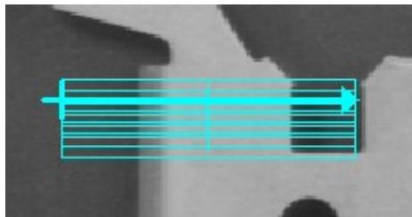

4. 在 8 位的灰度图像中，像素数值为 255 是什么颜色？ （ A ）

A、白色

B、黑色

C、灰色偏白

D、灰色偏黑

5. 一维码和二维码 DataMatrix 组成区域相同的有（A ）

A．静区

B.起始符

C. 数据符

D.终止符

1. 以下选项中会影响景深的因素是( ABD )（ ）

A 镜头焦距和像元尺寸

B 光圈值大小

C 视野明暗度

D 接圈和扩倍器

2. 以下什么不是 DataMatrix 代码的特性（ BC ）

A、静区（Quiet Zone）

B、启始符/终止符

C、校验符

D、计时特征（Timing Pattern）

3. 在 Cognex 相机的参数上，相机标签 CAM-CIC-5000R-14-G,其中 R 代表的是什么意思？（ C ）（ ）

A、带返回值参数的相机

B、高转速相机

C、卷帘快门相机

D、全局快门相机

4. 具有较强对比度的标签和标记的最佳光源选择是（ B ）（ ）

A、漫射暗场照明

B、漫射亮场照明

C、红外光源

D、背景光源

5. 一幅高质量的图像需包含以下哪些因素（ ACE ）（ ）

A、大信噪比

B、大光圈

C、高对比度

D、高曝光

E、低噪音

2. 以下哪种行为违反FSE厂区管理条例（ ABC）（ ）

A. 帮助机械厂商操作机械手  
B. 操作机构软件  
C. 在车间使用工控机看小说或打游戏  
D. 携带水杯进入车间

3. 在 Cognex 相机的参数上，相机标签 CAM-CIC-5000R-14-G,其中 G 代表的是什么意思？（ D ）

A、Cognex G 级相机

B、Cognex G 系列相机

C、Cognex 工业相机

D、Cognex 工业黑白相机

4. 什么样的光源带有漫射和均匀光线，是弧面、反光和不平整表面的最佳选择（ A ）（ ）

A、CDI/Dome

B、亮场

C、暗场

D、背景光

1. 决定视野的因素主要是( C )

A 镜头和增益

B 工作距离和增益

C 镜头焦距和工作距离

D 镜头放大倍率和景深

2. 以下什么不是 DataMatrix 代码的特性（ B ）

A、静区（Quiet Zone）

B、启始符/终止符和校验符

C、查找特征（Finder Pattern/L Pattern）

D、计时特征（Timing Pattern）

5. 影响成像质量的因素包括（ABCDE ）

A. 视野大小、镜头焦距、镜头光圈

B.光源的类型、光源的安装位置

C. 曝光时间

D. 物距

E.成像器类型

6.下列哪项属于远心镜头的优势：ABD

A、低畸变

B、高分辨率

C、价格便宜

D、大景深

7.下列哪项属于LED光源主要优势？ABCD

A、响应速度快B、体积小、价格便宜 C、寿命长、稳定性高 D、散热良好、亮度高

3.用黑白相机检测白色背景上的蓝色字符，应该选择以下哪种光源效果最好？D

A 白光

B 蓝光

C 绿光

D红光

4、什么光源最适合用于金属圆柱物体表面检测？ D

A．暗场 Dark Field  
B．背光 Back Light

C．亮场 Bright Field  
D．Dome(Cloudy Day Illumination)

6、镜头的畸变有（ DA ）

A．桶形畸变

B. 偏移

C.伸展

D. 枕形畸变

7、 白色的塑料药瓶中有红蓝两种颜色字体，现在仅需检测蓝色字符，请问使用什么光源？ （ A ）

A.红光

B.绿光

C.蓝光

D.红外光

9、下图, 白色表示光圈大小，请问哪个能得到最大的景深 （ 最后一个 ）

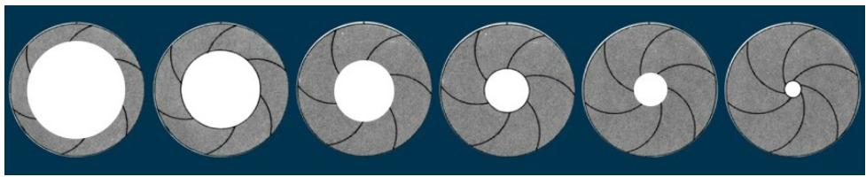

10、以下哪些物品属于车间违禁物品（ ABCD ）

A 智能手机

B U 盘

C 钱包

D 手表

11、本班次发生的异常情况与下一班次同事交接时，可采取的交接措施有 C

A 打电话

B 发短信

C 当面交接

D 请设备商转告

12、以下哪种行为违法 FSE 管理条例（ ABC ）

A 帮助机械厂商操作机械手

B 操作机构软件

C 在车间使用工控机看小说或打游戏D遇到处理不了的问题立即联系对应组长

13、下列关于相机与镜头描述正确的有（ ABCD ）

A. C型镜头匹配C型相机

B. CS型镜头匹配CS型相机

C. C型镜头+ 5mm接圈匹配CS型相机

D. CS型镜头不匹配C型相机

14、系统包括“在线”与“离线”两种运行模式，在 Run弹出菜单中选择 A 开启 TCP Server 服务，选择_ B_ _则关闭 TCP Server。

A “在线”（Online）B“离线”（Offline）C“检测”（inspection）D“标定”（calibration）

15、在进行视觉对位引导项目中，需要建立视觉坐标系与机械手坐标系之间的对应关系，而 B _是来完成该作用的。

A 检测

B 标定

C 定位

D 曝光

18、图片保存路径： _b_ __；桌面创建___c__ _文件，用于存放当天的 NG Image，便于工程师查看分析 NG 原因和数据；共享文件路径设置为__a_ __；复制视觉软件:D:/Cognex/Program/ ；软件备份路径：___d____备份日期-备份人姓名。

A D:/Cognex/Share/

B D:/Cognex/Images/

C NG-Image

D D:/Cognex/Backup/

19、图像训练正确顺序为____A_____（ ）

A 获取图像->设置训练区域与原点- $\cdot$ 设置训练参数->训练图像 $_ { - > }$ 查看结果   
B 获取图像>训练图像->设置训练参数->查看结果  
C获取图像->设置训练参数->设置训练区域与原点->训练图像->查看结果  
D获取图像->设置训练区域与原点->训练图像->查看结果

20、以下关于感光元件描述正确的事:(B)（ ）

A.CCD:噪点多、图像效果较差、价格便宜 B.CCD:噪点少、图像效果好、价格高   
C. CMOS:噪点多、速度慢、价格便宜 D.CMOS:噪点少、速度快、价格高

21、蓝色特征红色背景(黑白相机),以下的最佳光源选择是:(C)（ ）

A、蓝光

B、白光

C、红光

D、紫光

22、DPM 是什么意思:(B)

A、二维码的一种类型

B、直接零部件标记码

C、标签码的一种类型

D、条码的一种类型

23、进入车间时,我们可以携带哪些东西进入车间(BD)（ ）

A、电子产品设备

B、对讲机C、

移动便携式存储设备

D、透明水杯

24、影响图像明暗度的因素有?( BD)

A视野

B曝光

C 焦距

D 光圈

25、什么光源会使用渡银玻璃片( B )（ ）

A 亮场

B 同轴光源(DOAL: Diffuse On- Axis Light)

C 暗场

D 背景光

26、什么样的滤镜可以消除金属产品上的眩光（C ）（ ）

A、低通滤镜 B、紫外滤镜 C、偏振滤镜 D、中性密度滤镜

27、以下哪些行为是严令禁止的( ABC )

A、 调试或触动与Cognex无关的设备或治具  
B、 携带U盘进入车间  
C、 私自修改程序、数据帮助通过机台测试、验证  
D、受到他人辱骂、殴打保持克制、离开事发地点

28、影响视野大小的因素有（ ABC ）

A、物距 B、像距 C、成像面大小 D、被拍物体大小

PS：物距越大视野越大 像距越小 视野越大 成像面越大视野越大 焦距越小视野越大

4. 在焦距范围内，目标物的前后距离是( B )

A.工作距离 B.景深 C.视野 D.焦距  
5. PMAlign工具输出结果数据（X,Y,Angle等）是在哪个空间下（ A ）（ ）  
A、像素空间 B、输入图像空间 C、训练区域选取空间 D、搜索区域选取空间  
5. Data Matrix 码的主要解码方式是什么( C )

A、从第一个模块开始解码 B、左下角模块区域  
C、中间数据区域 D、L型寻边区

1、什么光源能使某些材料（如胶线）发出荧光（ A ）

A.紫外光（UV） B.红外光 C.蓝色光源 D.红色光源

2. 机器视觉系统工作中灯源的目的（ ACDE）

A将待测区域与背景明显区分开 B 将运动目标“凝固”在图像上  
C增强待测目标边缘清晰度 D 消除阴影 E抵消噪光

1.按照明方式分类，常见的光源类型有哪些？（ ABCDEF ）

A、背景光、B、线形光、C、环形光、D、低角度光、E、同轴光、F、Dome光  
2. GIGI 中的两个"I"是什么意思（ D ）

A.检验和印象（Inspection, Impression）  
B.检验和刻印（Inspection, Inscription）  
C.识别和印象（Identification, Impression）

D.检验和识别（Inspection, Identification）

3. GIGI 中的"G"代表什么意思（ D ）

A.引导和绘图（Guidance, Graphing） B.引导和分级（Guidance, Grading）

C.测量和分级（Gauging, Grading） D.引导和测量（Guidance, Gauging）

1.. 纯黑色像素数值是（A ）

A.0 B.255 C.0-127 之间 D.128-255 之间

日常生活中我们手机使用的扫一扫付款码是什么码制（ A ）

A、QR 码 B、Data Matrix 码 C、PDF417 码 D、Code39 码

2.__D__参数的意义：棋盘格每个单元格的尺寸大小；__B__：标定时相机固定不动，机械手带着标定板移动；_

_A_：标定时标定板固定不动，机械手带着相机移动；__C__： 不执行该标定文件，相机输出图片直接赋给Inspection 使用

A.Moving Camera B.Static pose C.Passthrough D.Pitch

3.图像保存时为什么最好保存为 BMP 格式（ D ）

A文件小 B快门速度保存在图像文件中 C转换为FTP更容易 D图像质量不会丢失

2. 如果你的电脑静态 IP 地址设置为：192.168.1.100，子网掩码为：255.255.255.0, 以下哪个 IP 地址可以设置给相机以连接到你的电脑（ A ）

A .192.168.1.101 B .255.255.255.1 C .192.1.1.100 D. 193.168.1.100

3. 对于 Windows 64 位操作系统适合安装哪种 VisionPro（ D ）

A.Cognex VisionPro x32(R) 9.0 CR1 B. Cognex VisionPro x64 (R) 9.0 CR1

C.Cognex VisionPro x32(R) 9.0 CR2 D. Cognex VisionPro x64 (R) 9.0 CR2

4. 使用 CogCaliperTool 工具，想要找出如下图所示边缘对，如何设置极性最好（ A ）。

A、边缘0：由明到暗；边缘1：由暗到明 B、边缘0：由暗到明；边缘1：由明到暗  
C、边缘0：由暗到明；边缘1：由暗到明 D、边缘0：由明到暗；边缘1：由明到暗

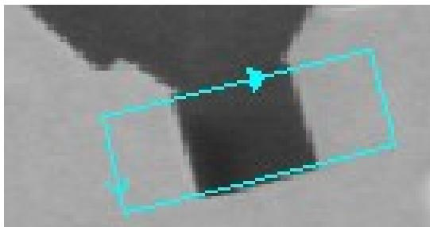

1、使用 CogCopyRegionTool 可对指定区域（ B ）

A 灰度填充 B 像素复制 C 空间变换 D 数据计算  
2. 如下图1所示，CogFindLineTool需要改变抓边的搜索方向，点击那个按钮（A ）

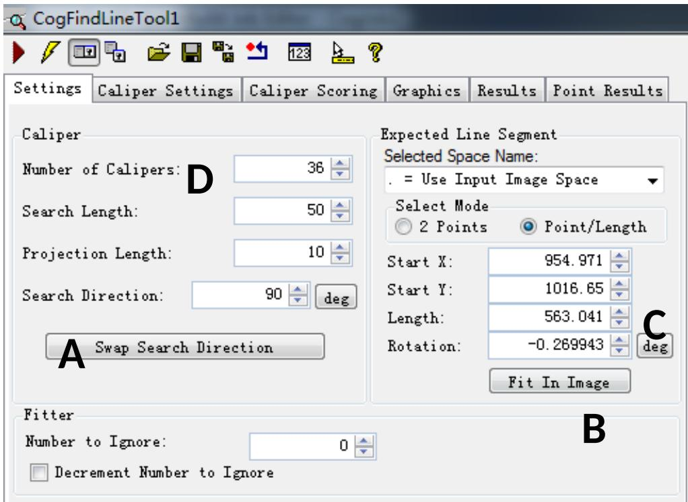

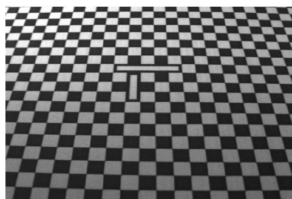

3. 当图像如左图所示时，改选用哪种校正模式（ C ）

A Linear

B LinescanWarp

C PerspectiveAndRadialWarp(透视和径向畸变) D ThreeParamRadialWarp

5. Elasticity（弹性）可以影响下列哪些得分（ D ）

A.拟合误差 B.覆盖范围 C.杂斑 D.粗糙分数

6.经过 CheckBoard 标定输出的坐标是（ B ）

A，像素坐标，B 物理坐标，C 机械手坐标，D，模组坐标

7.下列哪些方法可以减少 PMAlign 工具运行时间（ A ）。

A. 增大接受阀值 B. 减小粗糙粒度数值

C.降低对比度阈值 D.增加缩放比例

4、 在“Image Save Options”对话框中，在__C__栏目中，可以对每个 VPP 分别设置是否保存.bmp 图像；在_

_A__栏目中可以对每个 VPP 分别设置是否保存.jpg 图像。（ ）

A“Annotated Image Sources”(带注释的图像来源) B“Browse”浏览

C“Raw Image Sources” (原始图像来源) D“Annotated Image Save Path”图片保存路径

5. 点击“Light Intensity”进入光源设置界面，这里可以为每个 Inspection 设定对应的光源 及其强度。勾选

D _，可以使光源常亮。不勾选，则光源处于触发模式。单击 Save， 保存设置。单击 __，保存设置

后退出光源配置界面。单击___A_ ___，不保存， 退出光源配置界面。 （ ）

A“Cancel” B“Save” C“Save and Close” D“Live Preview

# 三、判断题

1. LED 光源的优势在于绿色环保寿命长，但电光转化效率低。 （N ）  
2. 镜头的光圈值越大，通光孔径越大。f/2 比 f/2.8 的孔径要小。 （ N ）  
3. 定焦镜头的焦距不可以调节，变焦镜头的焦距可以调节。 （ Y ）（ ）  
4. 一颗远心镜头的放大倍率可调。 （N ）（ ）  
5. 相机分辨的单位是像素。 （ Y ）  
6.CS型镜头加5mm接圈匹配C型相机 （ N ）  
7.C 型镜头 $+ 5 \mathsf { m m }$ 接圈匹配 CS 型相机。 （ Y ）  
8.景深是指在焦距固定，图像清晰时，被测物体离相机的前后变化距离，它受镜头上光圈的影响，光圈大景深大（ N ）  
9.一般短焦距镜头的畸变比长焦距镜头畸变更大。 （ Y ）  
10.颗粒度的基本单位是 Pixel。 （ Y ）  
11.CogPMAlignTool 工具中降低接受阀值，可以提高粗糙得分。 （ Y )  
12.CogPMAlignTool 工具中提高接受阀值，可以提高精细得分。 （ Y ）  
13.硬件选型时，镜头的最大兼容芯片尺寸可以小于相机芯片尺寸。（ N ）  
14.硬件选型时，镜头的最大兼容芯片尺寸可以大于相机芯片尺寸。 （ Y ）  
15.定焦镜头的焦距是可以微调的。 （ N ）  
16.目标物前后的距离叫做最大最小工作距离。 （ N ）  
17.景深的大小会影响到最大最小工作距离。 （ Y ）  
20.CMOS 在采集图片的时候，噪声是指的采集图像时候产生的声音 （ N ）  
21.在 PMAlignMulitTool 中中多个模板的名称必需相同 ( N )（ ）  
PMAlignMulitTool中多个模板的训练参数必需相同 （Y ）  
22.图像训练正确顺序为：获取图像 设置训练区域和原点 设置训练参数 训练图像 查看结果( Y )   
23.CCD：噪点多、图像效果较差、价格便宜是正确的 （ N ）

24.蓝色特征红色背景(黑白相机)，以下的最佳光源选择是红外光 （ N ）  
25.CogFixtureNPointToNPointTool 标定时，校正所有畸变。 （ N ）（ ）  
26.相同参数设置时，图像搜索范围越大，PMAlign 工具运行时间越长。 ( Y )  
27.颗粒度的基本单位是 mm。 （ N ）

28.使用建模器做模板需要点击 图标。（ N ）

29.CogFixtureNPointToNPointTool 输出的图像的空间只能是校正后的空间 （Y ）  
30.CogFixtureNPointToNPointTool 输出的空间名称可以与其他 CogFixtureNPointToNPointTool 输出空间同名（N）  
31.在33.在FitLineTool中，假如给了10组输入点的坐标，那么拟合的结果线用到了所有的点坐标（Y ）  
34.在 FitLineTool 中，此工具只能在输入图像的空间中拟合直线。（ Y ）

# 四、大题

1. 画出高角度光和低角度光的示意图。（20 分）

高角度光

低角度光

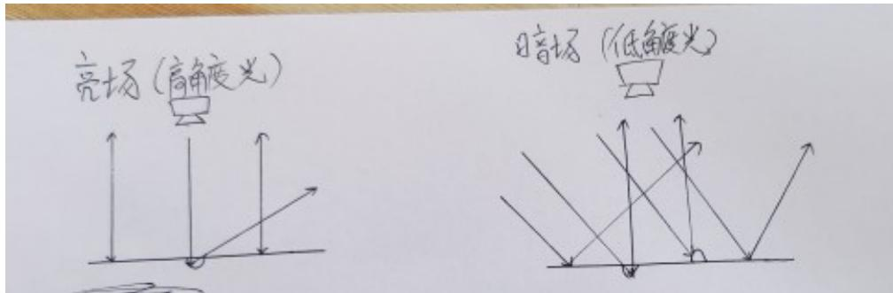

2. 相机按照芯片分为哪两种？请解释两者的原理以及对比差异。

CCD相机和CMOS相机

CCD 与 CMOS 图像传感器光电转换的原理相同，光信号转换成电信号。他们最主要的差别在于信号的读出过程不同；由于 CCD 仅有一个（或少数几个）输出节点统一读出，其信号输出的一致性非常好；而 CMOS 芯片中，每个像素都有各自的信号放大器，各自进行电荷-电压的转换，其信号输出的一致性较差

<table><tr><td></td><td>价格</td><td>噪声（图片暗部的不规则杂点）</td><td>耗电量</td><td>图像锐利度</td><td>速度</td><td>发展趋势</td></tr><tr><td>CCD</td><td>高</td><td>低</td><td>高</td><td>高</td><td>一般</td><td>技术较成熟</td></tr><tr><td>CMOS</td><td>低</td><td>较高</td><td>低</td><td>一般</td><td>快</td><td>生产厂家众多，技术不断有突破性进展</td></tr></table>

# 3CCD和CMOS

CCD：电耦合器件光电传感器，像芯片的一种，为中高端芯片，感光效果和颜色还原性比较好，在视觉中适合拍摄运动物体。

CMOS：互补性金属氧化物半导体，像芯片的一种，为中低端或者超高端芯片，便于大规模集成。

（工作原理都是利用感光二极管进行光电转换）  

<table><tr><td></td><td>CCD</td><td>Cmos</td></tr><tr><td>材料</td><td>半导体单晶材料</td><td>金属氧化物半导体材料</td></tr><tr><td>结构</td><td>ADC在芯片边缘</td><td>ADC集成在芯片每个像素中</td></tr><tr><td>噪点</td><td>少</td><td>多</td></tr><tr><td>感光度</td><td>高</td><td>低</td></tr><tr><td>分辨率</td><td>高</td><td>低</td></tr><tr><td>耗电</td><td>高</td><td>低</td></tr><tr><td>成本</td><td>高</td><td>低</td></tr></table>

CMOS作为工业相机感光芯片的首选，它的优势有哪些：片上集成化、功耗低、价格便宜。

3. 解释 CogPMAlignTool 工具栏的选中的图标名称和功能。

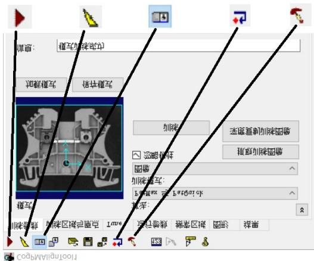

从左只有：运行，电子模式，本地显示，复位，图像掩模编辑器

4.在镜头的成像过程中，请画出光圈值与通光量之间的关系。（ ）

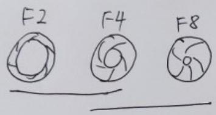

画出其十两个行.

结论一，火圈偷越大，火果越小，量越少，图越日暗.火周佰越小.光圈越大、通燭越大图片越亮

5.在机器视觉中，CCD 和 CMOS 会作为相机感光芯片的首选，目前我们应用更广泛的是哪一个？它俩的优势有

哪些？

CMOS使用更加广泛，

CCD：成像质量高，图像锐利度好，噪音低，分辨率高，感光度高

CMOS：价格便宜，功耗低，支持片上数字化，，采像速度快

6. 对如下物品进行外观轮廓检查，推荐一套最佳的打光方案，并画出基本的光路原理图。

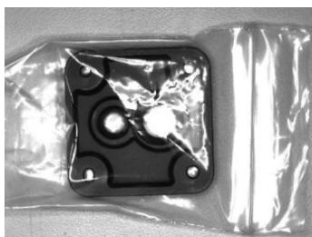

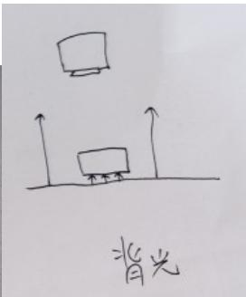

背光源 10 分

低角度光源5分

带偏振低角度光6分

Dome 光 0 分

同轴光 0分

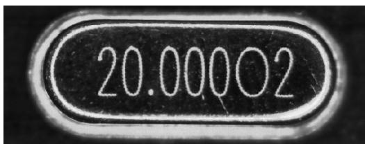

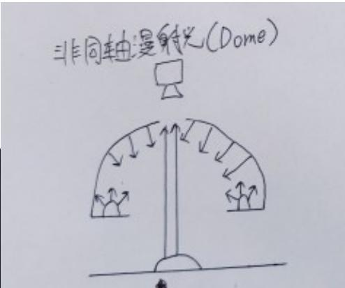

Dome光 画出完整图 10分

低角度光 7分（带偏振） 环形光 3分 背光源0分 同轴光0分

7.当生产中遇到金属物体表面打光的情况，我们应该使用什么光源进行打光，请阐述理由。（11 分）

非同轴漫射光（Dome光）

可以避免因弯曲表面导致的打光不均匀

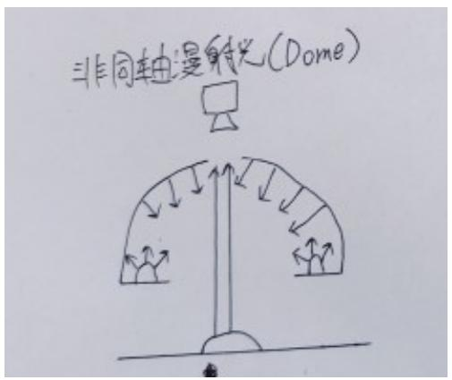

8.在工业机器视觉中，荧光灯和 LED 灯都是工业灯源，为什么不选择荧光灯作为工业灯源的首选，选择 LED 灯有哪些优势？  
光电转化率高、绿色环保、寿命长、工作电压低、体积小、发热少、亮度高、光束集中稳定、色彩多样、易于调光、启动无延时  
9. 画一画，在同一 CCD 尺寸的情况下，FOV 大小与哪些条件有关，请分条画图陈述。

$\textcircled{1}$ 与物距的关系

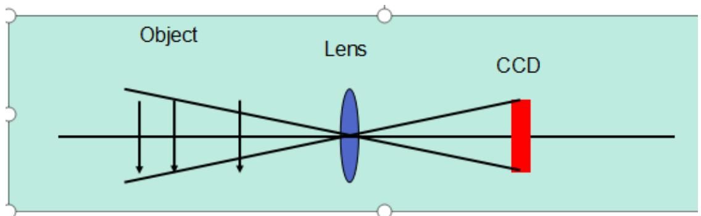

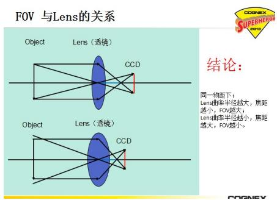

$\textcircled{2}$ 与镜头曲率的关系关系（焦距大，视场角小 焦距小，视场角大，）

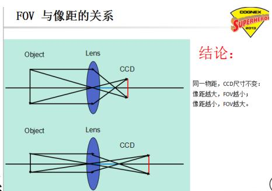

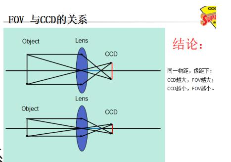

$\textcircled{3}$ 与像距的关系

④与CCD大小的关系

以上画对一个给4分，全对给10分，课件中的原题

10. 在工业机器视觉中，为什么要使用灯源作为照明方式，使用灯源的好处有哪些？（其实就是考光源的作用）

$\cdot$ 凸显出缺陷和背景的差异，提高图像对比度  
$\textcircled{2}$ 形成最有利于图像处理的成像效果  
$\textcircled{3}$ 照明目标，提高目标亮度，克服环境光的干扰，保证图像稳定性

11.FOV 大小为 80mm × 60mm，分别用 30 万像素（ $6 4 0 ^ { \star } 4 8 0 $ ）的相机和 200 万像素（1600 X 1200）的相机其单个像素的分辨率分别是多少？（12 分）（ ）

30w 像素的 像素分辨率：80mm/640=0.125mm

200W 像素的 像素分辨率是：80mm/1600=0.05mm

12、请写出邮箱的书写格式。（9 分）（ ）

收件人 zhangsan@qq.com （主要阅读这封邮件的人）

抄送 lisi@qq.com; wangwu@qq.com （需要了解这封邮的人）

主题：（准确表达邮件内容）

Hi lisan（收件人）：

正文：

1. 时间地点

2. 具体内容合理

Thanks &Best regards！

赵六（FSE of ICT）

12345678910

13.描述一下 GRR 测试操作流程。（ ）

GRR 数据:是取__10__Pcs 物料做该机台整体流程，然后把这批被测物体在最终检测工站，各拍照___9_次的数据。

静态数据::是__1_Pcs 物料在 FOV 中静止不动的情况下，相机连续拍照_32_次的数据，动态数据是_1__Pcs 物料在 FOV 内做单工位重复动作的情况下，相机连续拍照__32__次的数据。(补充)

14.简述查询8704E的信息流程？如果一台设备需要安装5个相机，我们需要做哪些工作来完成此项工作（写两种办法）。（9 分）

1.在开始菜单的搜索框中输入“cmd”指令；  
2.在 cmd 命令行黑色窗口中输入：cogtool –p 会提取出 8704E 卡的所有信息；  
3.输入完成后按回车键，就会显示如下信息：（板卡的SN和最大支持的相机数以及支持的工具名称）  
15.请简述用网线连接两台电脑拷贝文件的具体步骤。（15 分）（ ）

1.用网线连接到两台电脑的网口

2.找到对应的网口将ip地址改为前三段一致，第四段不一样（网关设置一致）（eg：1.1.1.1和1.1.1.2）

3.右键需要共享的文件的外层文件夹点击 “共享”点“特定用户”点 下拉菜单选中“Everyone”点击“添加”更改权限级别为读写 点击“共享”  
4.用第二胎电脑点Windows菜单键 $+ { \sf R }$ 弹出运行窗口 输入分享文件的电脑 IP地址 访问并找到分享的文件复制到本台电脑

16.相机无法连接（拍照蓝屏）现象，试分析原因和对应的解决措施？（ ）

答案：

1. 主机 IP 或者相机 IP 有设置错误  
2. 巨帧数据包改为9014、防火墙关闭、ebus 勾选  
3. 网口损坏更换别的网口 硬件损坏需更换硬件（网线、相机、8704卡）

17.Cognex 软件硬件安装调试步骤。

硬件：

1、确认对应各工位的相机的镜头的光圈值是否合适，调解光圈调解圈至合适的光圈值，确认完毕后需要锁紧 光圈的紧固螺钉；

2、调整物距至合适值。调整焦距，获得清晰的图像，焦距合适后，需要锁紧焦距的紧固螺钉；  
4、OPT 打光完毕后，对相机进行自动标定；  
5、粗/精调 Vpp 程序；  
6、通过 CPK，GRR 验证；

软件：1.安装 VisionPro9.2 X64 CR2 .Net Framework4.6.2

18.简述视觉异常处理汇报流程

三方面分析 ：一、视觉问题，1.相机连接失败，查看网口是否松动；2.视觉加载工具有问题，重新加载工具，或者调整.VPP； 3.软件无法打开，查看是否有另一个程序在启用，断电重启。

二、机构问题 ：1.物料是否没到位；2.吸力不均匀；通知OEM厂商  
三、来料有问题，找一张正常图片对比，如果有问题告知AE来料异常。

19.在 AlignVisSystem 视觉软件状态栏出现爆红，是什么原因造成的？（15 分）

1.检查软件是否是因为手动将“Run”中“Offline”选中了，若是此原因，请选中“Online”；  
2.视觉软件与控制软件的IP地址及端口号设定是否正确；  
3.软件所在文件夹所在路径是否使用中文名称

20.相机无法连触发，分析原因并写出解决方法？（10 分）

1.确认相机是否连接正确  
2.如果 VisionPro 可用，打开 Cognex GigE Vision Configuration，查看不拍照的相机是否在左侧的相机列表中。  
3.确认机构是否发送了正确的触发信号。  
4.可能由于主机卡顿，软件卡顿或BUG引起，将计算机关机，约十秒钟后，重新开启计算机  
5.检查相机是否损坏，如坏的话更换相机。  
6.相机配置参数设置不正确，重新查看并配置好正确参数  
7.权限位丢失，检查8704E板卡权限   
8.磁盘已满或者图片删除设置参数不合理，重新设置图片保存参数

21.简述查询8704E的信息流程？如果一台设备需要安装5个相机，我们需要做哪些工作来完成此项工作（写两种办法）（10 分）

一. 1.在开始菜单的搜索框中输入“cmd”指令；  
2.在 cmd 命令行黑色窗口中输入：cogtool –p 会提取出 8704E 卡的所有信息；  
3.输入完成后按回车键，就会显示如下信息：（板卡的SN和最大支持的相机数以及支持的工具名称）

二、1.用两张8704e网卡，一个网卡有4个网口，两个网卡可以解决。  
2.一个8704e网卡，剩下的一个相机用机构提供的网口或路由器供电。

22.自动标定需要注意哪些点？（15）

1. 相机的焦距，视野是否调整OK，镜头及相机是否松动；  
2. 运动机构是否调整OK；  
3. 软件和视觉软件是否正常，通信是否正常；  
4. 标定所使用的工具是否准备OK，标定工具是否破损，翘曲；  
5. Configuration 中棋盘格的尺寸与实际是否匹配；  
6. 机器人吸取或放下棋盘格时，棋盘格是否有滑动现象或者吸不起来；  
7. 检查标定误差是否在正常范围；

23.对于 FSE 与客户、AE、产线之间的沟通你该做些什么，（从三个方面说明）？（15）  
24.影响成像质量的因素有哪些？

# 五、操作题

1. 如下图，使用 Rotating.idb 文件，操作如下试题。（ ）

$\textcircled{1}$ 求 P 点的坐标，并使用终端输出。  
$\textcircled{2}$ 测 Blob 的面积，并用终端输出。

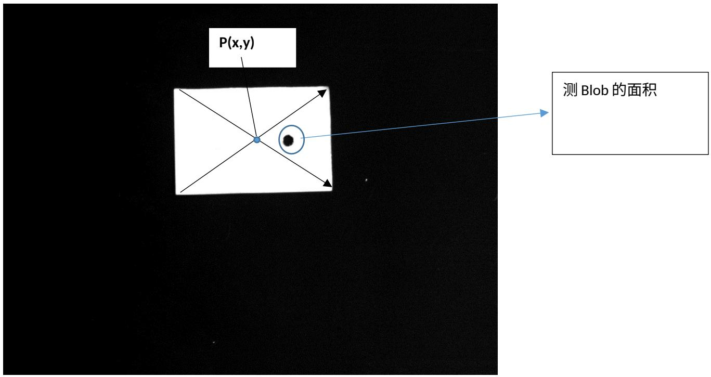

2、使用 Blob.idb 文件，做出如下实操试题，并保存为 Job 格式。

$\textcircled{1}$ 求如图 Blob 的面积，并用终端输出。（15 分）  
$\textcircled{2}$ 求 P 点的坐标，并用终端输出。（15 分）

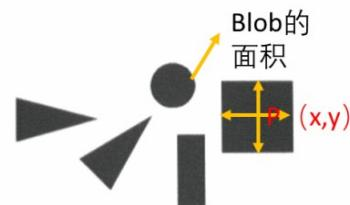

3.如下图，使用手机文件，操作如下试题。（ ）

$\textcircled{1}$ 找出图中的手机模型  
$\textcircled{2}$ 确定手机屏幕中心坐标，并使用终端输出。  
$\textcircled{3}$ 检测按键的个数，并用终端输出。

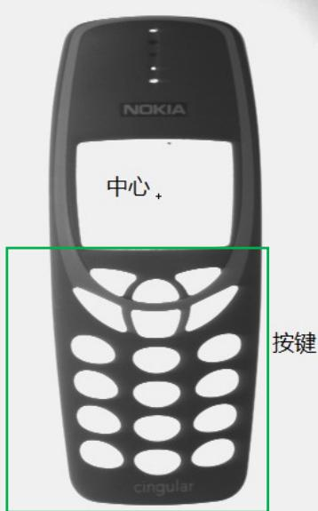

4、Vision Tools 上机操作题。（30 分）

使用加载图片文件，做出如下实操试题。

$\textcircled{1}$ .查找边缘 A。（15 分）  
$\textcircled{2}$ .测量图示位置的宽度 W1 和 W2，并添加结果终端。（15 分）

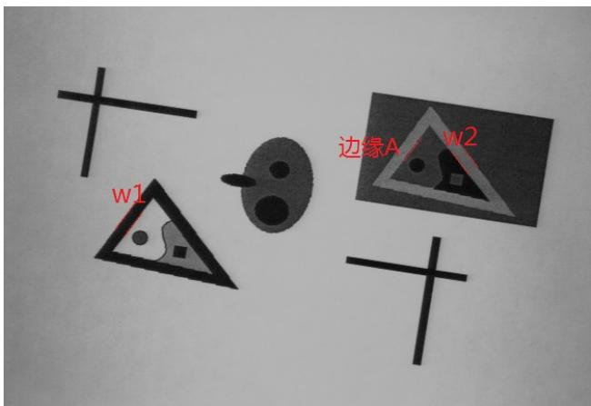

5.

$\textcircled{1}$ 点C到由点A和点B组成的直线的距离   
$\textcircled{2}$ 直线A和直线B之间的角度  
$\textcircled{3}$ 直线A和直线C之间的距离

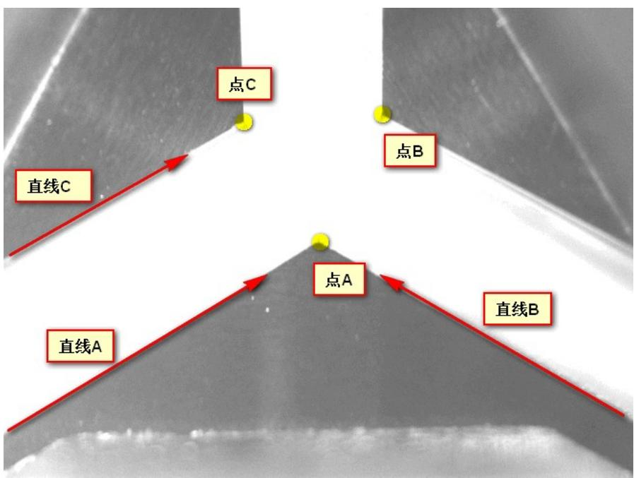

6.、Vision Tools 上机操作题。（30 分）  
1、使用加载图片文件，做出如下实操试题。

$\textcircled{1}$ 如下图所示：求托盘的中心点坐标。  
$\textcircled{2}$ 求托盘上的 Mark 点到托盘的 2 个边缘的距离 d1，d2。

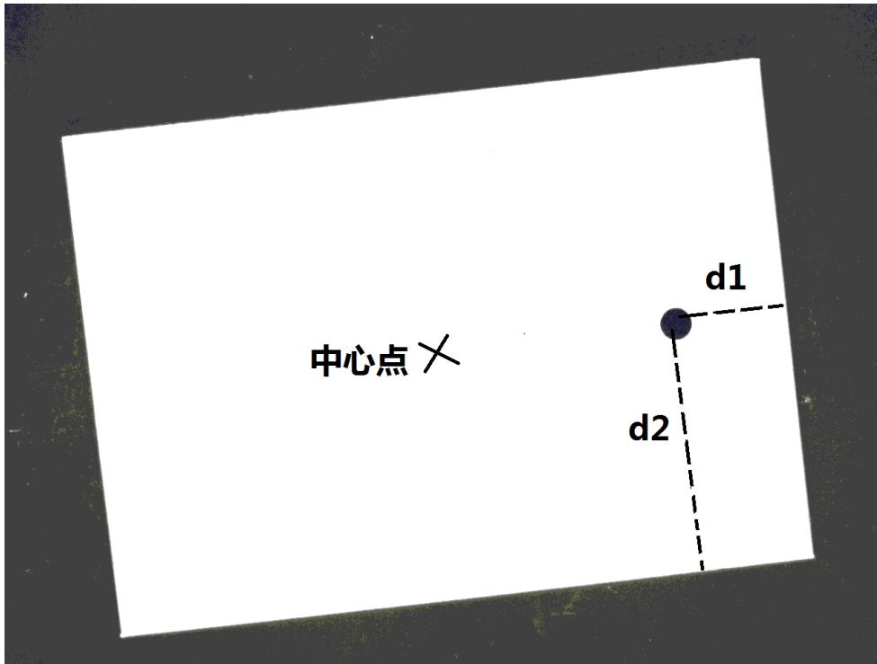

7.、Vision Tools 上机操作题。（30 分）

1,使用加载的图片文件，完成如下操作题。(作业完成后保存为 Job 格式,命名方式为自己的姓名.)

求出两个零件主体中心点 P 和 Q 点的坐标，并使用终端进行输出。（15 分）

求 Q 点到 Z 点的距离，并使用终端进行输出。（15 分）

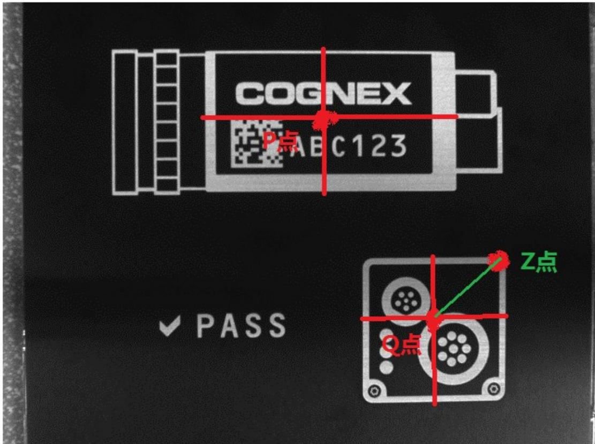

8.、Vision Tools 上机操作题。（30 分）（ ）

1、使用加载图片文件，做出如下实操试题。

$\textcircled{1}$ 求 4 个圆孔的半径 R1、R2、R3、R4。（10 分）

$\textcircled{2}$ 求圆孔之间的圆心距离 d3、d5。（5 分）  
$\textcircled{3}$ 求两个凹槽宽度和工件的整体宽度 d1、d2、d4。（5 分）  
$\textcircled{4}$ 求零件主体的中心点的坐标。（10 分）

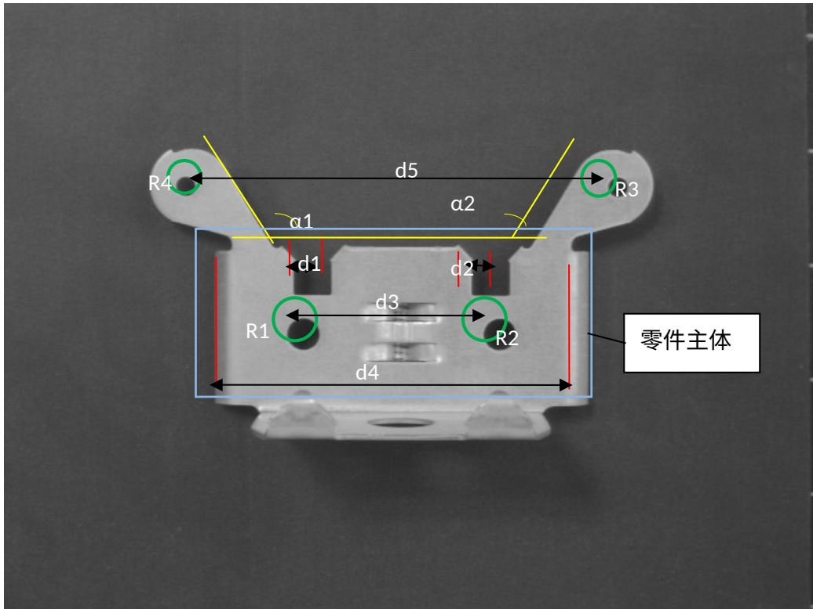

9.、Vision Tools 上机操作题。（30 分）

1、使用加载图片文件，做出如下实操试题。  
1、利用 6 个 PMAlign 工具区分图片中分别统计视野中 1 元、5 角、1 角的硬币个数，区分硬币正反面。

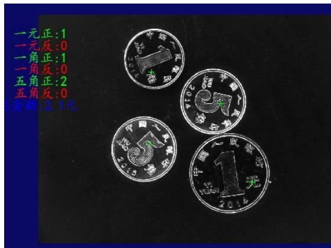

2、利用3个PMAlign工具区分图片中分别统计视野中1元、5角、1角的硬币个数，不区分硬币正反面。（掩模）

作业保存格式：

1．保存成 Toolblock 格式。

2. toolblock 命名，PMAlign-硬币统计-姓名.vpp

例如： PAMlign-硬币统计-张三丰