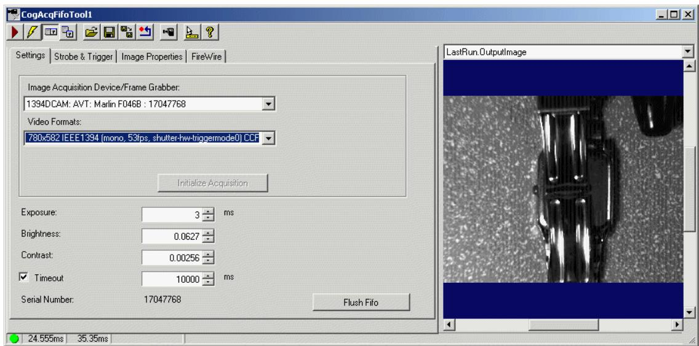
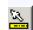
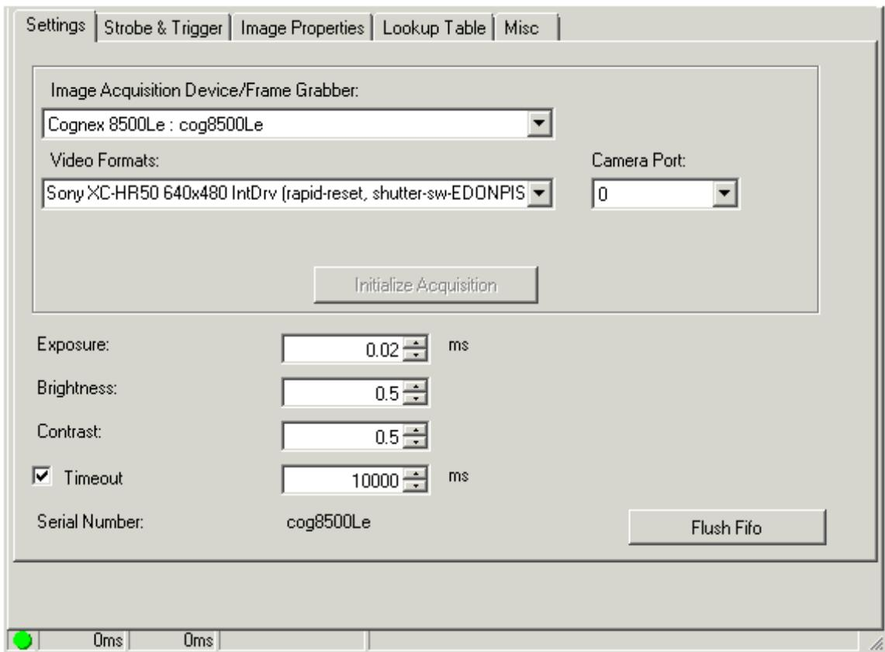
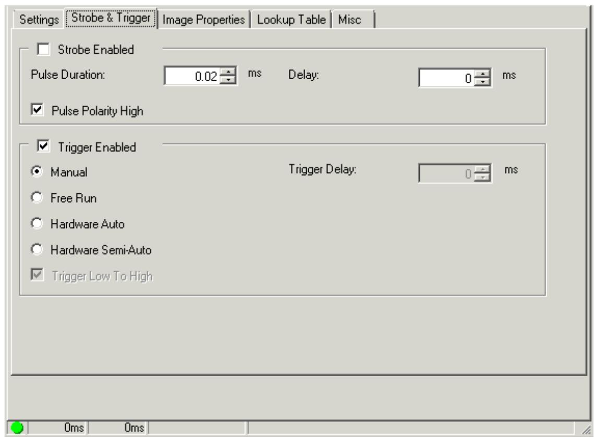
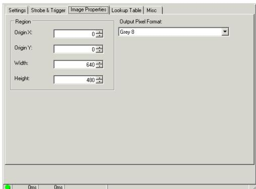
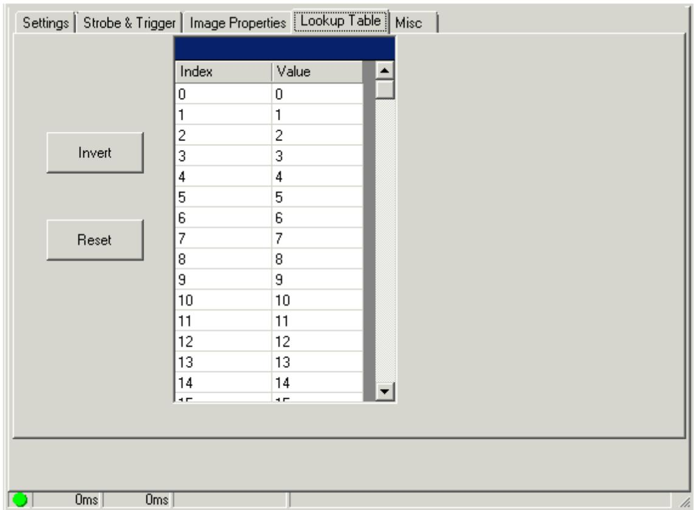
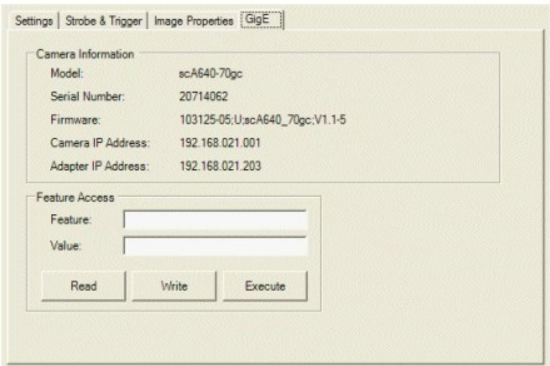
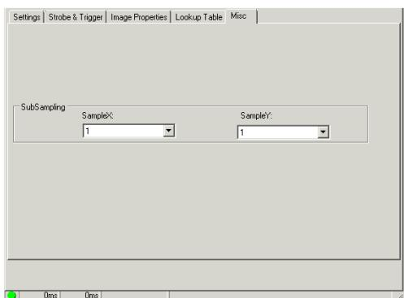

AcqFIFO 编辑控件为 CogAcqFifoTool 视觉工具提供图形用户界面，此工具可使用取像卡上的取像 FIFO、IEEE 1394 DCAM (FireWire) 相机或 GigE 相机来取像。此编辑控件用于配置各种图像采集参数并取像。AcqFIFO 编辑控件如下图所示：

# 此编辑控件包括以下组件：

 一排沿顶部设置的控件按钮，用于执行常规操作。  
 一组功能选项卡，用于指定触发器类型、指明照明方法、选择关注区域以及设置其他配置参数。选项卡的确切数目、内容以及外观根据您使用的图像源而略有不同。  
 一个图像显示窗口，用于显示当前存储在 OutputImage 缓冲区中的最近取像。右键单击图像窗口，选择包括放大或缩小的菜单选项或启用像素或子像素网格。

 一个沿底部设置的状态条，用于报告是否成功执行工具、工具执行所需的时间以及任何错误代码或消息。

# Control Buttons (控件按钮)

Show ToolTips

启用或禁用编辑控件中单个项目的工具提示显示，

# 二、 Settings Tab (Settings 选项卡)

使用 Settings 选项卡配置用于获取图像的视频源。下图所示为 IEEE 1394

DCAM (FireWire) 相机的默认 Settings 选项卡。

FrameGrabber 编辑控件显示与此取像 FIFO 关联的取像卡的名称。

VideoFormat 为此取像 FIFO 选择视频格式。

如果稍后切换视频格式，编辑控件会创建新的取像 FIFO 并

将其附加至当前工具。

CameraPort 在您连接相机的取像卡上选择相机端口。

Exposure 设置曝光时间。可能需要通过以生产速度将对象移动过相机

来进行试验，以确定最佳值。

使用值 0 会让相机使用其支持的最短曝光时间。

Brightness 设置每次取像的亮度级别。可能需要使用不同的值来试验，方可确定您视觉应用程序的最佳级别.

Contrast 设置每次取像的对比度级别。可能需要使用不同的值来试验，方可确定您视觉应用程序的最佳级别。

TimeoutEnabled 超时期限用于确定在应用程序生成超时错误(CogErrConstants) 之前取像 FIFO 等待图像变为可用的时间。输入 Timeout 来指定应用程序等待的时间长度。

SerialNumber 编辑控件显示此取像卡的序列号。

Flush 清除队列中所有未完成的取像请求。

三、Strobe and Trigger Tab (Strobe and Trigger 选项卡)

使用 Strobe and Trigger 选项卡来控制可选闪光灯并配置该取像通道用来指示取像开始的触发器类型。此选项卡中的字段根据您使用的具体取像卡而有所不同。下图所示为 Strobe and Trigger 选项卡的示例：

StrobeEnabled(闪光灯)

为每次取像启用闪光灯。在闪光灯启用的情况下，配置以下设置：

StrobePulseDuration 字段用于设置脉冲的持续时间（以毫秒为单位）

StrobeDelay 用于字段设置快门脉冲以及闪光灯发光之间的延迟时间。

StrobePulsePolarityHigh 复选框可将闪光灯脉冲极性设置为高。请参阅您

的闪光灯硬件文档，以了解正确的设置。

TriggerModel 从以下传入触发器类型中选择一个用于此作业：

手动触发器会在您按下 Run 时取像。  
自由触发可让取像系统以取像模块支持的最高帧速度取像。  
 如果应用程序检测到外置触发器线路上有转换，硬件自动触发器就会开始取像。如果触发器信号从低转变为高，则选中 TriggerLowToHigh 复选框。

如果按下 Run 并且应用程序检测到外置触发器线路上有转换，硬件半自动触发器就会开始取像。如果触发器信号从低转变为高，则选中 TriggerLowToHigh 复选框

MinTriggerWidth 设置或获取最小触发器宽度（以毫秒为单位）。触发器输入信号必须维持此时间长度后方可被识别为有效输入触发器。QuickBuild 会忽略任何不符合此宽度限制的触发器信号。

MinTriggerPeriod 设置触发器之间的最短时间（以毫秒为单位）。仅一段时间内的第一个有效触发器将启动相机成像周期。该同一时间内的其他有效触发器会遗失。您可使用此值来帮助限制相机的取像速度。

有效值的范围为 0 到65.5。如果值为零，则无时间要求

TriggerDelay 设置收到取像触发器与相机开始成像之间的时间长度，以毫秒为单位。

IgnoreMissedTrigger 仅在 MVS-8602e 和 MVS-8602e PoCL 上可用，可让您的应用程序忽略所有遗失的触发器并避免因处理取像失败而消耗处理时间。

# 三、 Image Properties Tab (Image Properties 选项卡)

使用 Strobe and Trigger 选项卡来控制可选闪光灯并配置该取像通道用来指示取像开始的触发器类型。此选项卡中的字段根据您使用的具体取像卡而有所不同。下图所示为 Strobe and Trigger 选项卡的示例：

1、Region 使用选项卡中的这些字段来指定关注区域的原点、宽度和高度。  
2、Output Pixel Format

使用 Output Pixel Format 列表为图像（Image Source 可将其用于您添

加至 QuickBuild 的视觉工具）选择以下可用像素格式之一：

CogImage8Grey 提供从黑到白 256 个灰度的灰度图像。

CogImage16Grey 提供 16 位编码的灰度图像。有关详细信息，请参阅主

题 Working with 16-Bit Images。16 位灰度图像支持 65,536 个灰度值，

但您必须使用支持 16 位的相机才可生成能展现这一更大灰度范围的图像。

在您使用 8 位灰度或 24 位 RGB 相机生成使用 CogImage16Grey 类存储

但仅支持 256 个灰度值的图像时，选择 Grey 16。

CogImage24PlanarColor 一种图像，使用 3 个一致的 8 位像素值数组来

表示红、绿、蓝色度。对支持的彩色相机使用将选项，为您的视觉应用程

序生成彩色图像。如果您对灰度相机选择此选项，输出图像使用的

CogImage24PlanarColor 类中每个数组中的红、绿和蓝值均被设置为相同

值，以生成相应的灰色像素值。

自动 让 QuickBuild 根据您使用的相机类型以及您在 Settings 选项卡上

选择的视频格式，以适用的输出像素格式生成图像。

# 四、 Lookup Table Tab (Lookup Table 选项卡)

相当于 MapPixel

灰度图像中的单个像素可具有从0 到255 的灰度值。QuickBuild 在捕捉图像时，可通过使用查找表将任何像素的灰度值重新映射至不同的灰度值。

查找表是一个 256 元素的数组，对应于像素值 0 到 255，其中数组元素 [0]对应于灰度值 0，元素 [1] 对应于灰度值 1，以此类推，直至元素 [255] 对应于灰度值 255 。

使用查找表的取像通道会评估图像缓冲区中的每个像素，并根据数组中相应元素的值更改灰度值。例如，如果表元素 [50] 的值为 75，则灰度值为50 的任何像素在图像可用于其他视觉工具进行分析前都将被赋予新的灰度值 75。

无论您是否为数组中的元素设置了明确的值，QuickBuild 实际都会使用查找表。然而，默认设置下，它使用不会更改图像中灰度值的恒等查找表。在恒等查找表中，元素 [0] 设置为 0，元素 [1] 设置为 1，以此类推。

如果您的取像设备支持 Lookup Table 选项卡，则可重新定义查找表中的值。例如，您可能生成新的查找表并选择特定灰度值作为图像中亮特征与暗特征之间的中点，然后将所有较暗的像素映射至一些较低的值，并将所有较亮的值映射至一些较高的值。这实际上是将每个取像二值化，因此所有特征会显示为黑色或白色。

下图所示为默认的 Lookup Table 选项卡：

在 Value 单元格内单击以更改任何传入灰度值的值。单击 Invert 将较暗的值转换为较亮的值，并将较亮的值转换为较暗的值。单击 Reset 将所有值设置为其恒等默认值。

# 六、FireWire Tab (FireWire 选项卡)

使用 FireWire 选项卡查看有关所连接 FireWire 相机的基本信息，并让用户更改相机带宽属性，以及让用户能够对 1394 DCAM 寄存器进行读写操作。

FireWire 选项卡如下图所示：

此选项卡显示与相机有关的以下信息：

表 6.FireWire Camera Information

信息 说明

VendorID 此相机的供应商

Camera Model 此相机的型号

AdapterLocatio 主机控制器的适配

n 器位置字符串

标识此相机的 6 位

NodeNumber

节点数字

10 位总线数字，标

Serial Number 识相机连接的 1394

总线

使用以下项目控制注册访问权限和带宽分配：

表 7.FireWire 选项卡控件

控件 说明

使用所提供的地

SetRegisterAcces 址对 1394DCAM

s 寄存器执行写入

操作。

将以给定地址写

Value 入寄存器的32

位值。

# CameraBandwidt

h

用于限制单台

IEEE 1394

DCAM 相机使用

的带宽量。可将

多台 IEEE 1394

DCAM 连接至单

个 IEEE 1394 适

配器。通过使用

该类，可限制单

台相机使用的带

宽量。

值的范围为

0.0（让相机尽可

能少地使用带

宽）至 1.0（不

限制相机对带宽

的使用）。

# 七、GigE Tab (GigE 选项卡)

使用 GigE 选项卡查看有关所连接 GigE Vision 相机的基本信息并修改各个GigE Vision 属性。有关更多信息，请参阅“GigE Vision Cameras User'sGuide”。下图所示为 GigE 选项卡的示例：

选项卡的 Camera Information 部分提供有关您使用的相机和适配器的基本信息。使用 Feature Access 部分检查并修改您所用 GigE Vision 相机的 XML定义属性。

 在 Feature 字段中输入 XML 节点名。  
 单击 GetFeature 会读取节点的值并更新 Value 字段。  
 单击

[M:Cognex.VisionPro.ICogGigEAccess.SetFeature(System.String,

System.String)] 会尝试将 Value 字段中的任何值写入节点。

 单击 ExecuteCommand 会尝试执行在 Feature 字段中指定的命令特性。

QuickBuild 将对任何发生的错误显示对话框，例如对于 Feature 或 Value 字段的无效输入错误。请参阅您所用 GigE Vision 相机的文档，获取受支持 XML节点的列表。

# 八、Misc Tab (Misc 选项卡)

使用 Misc 选项卡选择子采样速度并减小图像大小，以加快取像速度。

为 SampleX 和 SampleY 指定采样比率。例如，将 SampleX 设置为 8 表示沿 $\mathsf { x }$ 轴的像素数以 8:1 的比例缩减。

# Acquisition in VisionPro

本主题包含以下部分:

Some Useful Definitions   
Acquisition FIFOs   
Acquisition Requests   
Simultaneous Acquisition   
Line Scan Cameras   
Acquisition FIFO Properties   
Acquisition Events

VisionPro 使用名为 acquisition FIFO(先入先出)队列的对象来获取图像。要获取图像，您需要向FIFO发出请求。在发出请求之后，您可以继续执行其他任务(包括发出更多的获取请求)，也可以等待获取过程完成，并且图像可用。获取FIFO首先处理最老的请求，并对在获取映像时可能到达的任何其他请求进行排队。当您获得图像时，它们将从FIFO中删除。

VisionPro支持多种相机类型。以下主题提供了基于您使用的相机类型获取图像的具体信息:

Acquirinq Imaqes with a CCD Camera and Frame Grabber   
· Acquiring Images with a CDC Camera and Frame Grabber   
Acquiring Imaqes with a Line Scan Camera   
  
Acquirinq Imaqes with GigE Vision Cameras

# CogFrameGrabbers

# ICogFrameGrabber

CogFrameGrabber1394DCAMs

ICogFrameGrabber

CogFrameGrabberGigEs

ICogFrameGrabber

const string VIDEO_FORMAT $=$ "Sony XC75 640x480";

const string VIDEO_FORMAT $=$ "Basler L103 2048x2048";

const string VIDEO_FORMAT $=$

"Basler A602fc 656x490 IEEE1394 (mono, 100fps, shutter-hwtriggermode0)CCF";

# 一、Some Useful Definitions

acquisition FIFO 维护先入先出获取请求队列的对象。通常，您为连接到帧抓取器的每个相机创建一个获取 FIFO。

acquisition properties 一组参数，控制相机的工作方式或相机与其采集 FIFO 交互的方式。

# asynchronous simultaneous acquisition（异步同步采集）

一种图像采集方法，其中两个或多个FIFOs接收采集请求并同时获取图像。

# Camera Configuration File (CCF)

VisionPro bin 目录中的一个文件存储在

(默认情况下 C:\Program Files\Cognex\VisionPro\本),其中包含的信息采集系统用来创建一个视频格式对象为特定的相机。并不是所有的帧抓取器和CVMs都使用CCF

Cognex Video Module (CVM)为不同类型的相机提供接口的硬件。CVMs 可以内建到帧抓斗或工厂安装作为女儿卡。CVMs由一个数字指定，例如CVM4

FIFO 先到先出的名单。从FIFO中删除项目的顺序与添加项目的顺序相同。

frame grabber 将图像数字化并使其可用于软件的硬件。在CVL中，表示帧抓取器的对象描述硬件的能力和硬件支持的视频格式。

# 二、Acquisition FIFOs

本节包含以下子节：

Video Formats   
Camera Ports and Video Channels

ICogAcqFifo 是由 ICogFrameGrabber 对象创建的。安装在电脑上的板卡可以控制与它相连的任何相机。

你安装的特定板卡决定了你可以使用的相机种类和可用的视频特性。

当您要求帧抓取器创建acqfifo和获取FIFO时，您需要指定视频格式(它描述您正在使用的相机)和将通过该相机获取的图像的像素深度。

一旦你创建了一个获取FIFO，你就不能改变与它相关联的帧抓取器，也不能改变视频格式。但是，您总是可以创建一个新的获取FIFO。

根据特定的型号，一个板卡将有一个或多个你可以连接相机的 NumCameraPorts。

创建了一个获取型FIFO之后，就可以对与之关联的摄像机端口进行拍照。

但是，你应该记住，一个帧抓取器可能不能同时从所有的相机端口获取图像。

您还可以从现有的 FIFO 创建一个 slave acquisition FIFO，以同时从两个(或更多)源获取图像。请参阅本文后面的同步获取以了解更多关于主/从FIFOs的信息。

# 1、Video Formats

视频格式描述特定的摄像机模型和各种参数，这些参数控制摄像机和帧捕获器之间的物理接口，如图像大小、最大像素深度和同步源。康耐视提供视频格式作为指定这些参数的相机配置文件。虽然它们不能由用户编辑，但您可以查看这些CCF文件。VisionPro 安装程序安装这些文件的默认情况下 C:\Program Files\Cognex\VisionPro\bin. VisionPro bin 目录；

在VisionPro中，可以将视频格式指定为文本字符串，其中包括相机制造商、型号和同步信息。例如，“Sony XC-75 640x240 IntDrv CCF”是一个视频格式名称。CCF 目录中的一些视频格式只适用于特定的Cognex帧抓取器。为了帮助您从与framegrabber一起工作的视频格式中进行选择，并确保您使用了一个有效的视频格式名称，请使用 frame grabber 属性 AvailableVideoFormats，它将返回一个兼容的视频格式列表。

# 2、 Camera Ports and Video Channels

大多数Cognex板卡允许你连接多个相机。然而，这并不意味着你可以同时从所有四个相机获取图像。

同时获取图像的数量取决于你的帧获取器拥有的视频通道的数量。

视频信道是帧捕获器上处理图像的硬件;一个视频通道可以服务于多个摄像头端口。VisionPro 提供了一个函数 NumVideoChannels，它可以报告帧抓取器拥有的视频通道的数量。

在一些帧抓取器上可能有不同种类的相机端口。

例如，可能有模拟相机和数码相机的相机端口。在这种情况下，你可以GetNumCameraPorts告诉你有多少摄像头端口对给定的摄像头格式可用，或者你可以NumCameraPorts告诉你有多少摄像头端口对你创建它时选择的视频格式可用。

# 三、Acquisition Requests(取像请求)

本节包含以下子节：

Manual Triggering   
Automatic Triggering   
Semi-automatic Triggering   
Free Run Triggering

FIFO获取图像以响应获取请求。发出请求的方式取决于为获取FIFO指定的CogAcqTriggerModelConstants。您选择的触发器模型取决于您的 vision 应用程序的特定需求。您可以获取图像:

通过调用一个函数；  
通过在触发线上感知来自外部源的脉冲；  
通过函数调用和外部触发器的组合；  
. 通过允许采集系统尽可能快地采集图像。

除此之外，您还可以使用主/从获取(本文稍后将介绍)同时从两个或多个fifo获取。

# 1、Manual Triggering

获取图像最简单的方法是使用手动触发。在这个触发器模型中，您调用StartAcquire来发出一个获取请求，然后调用CompleteAcquire来获得可用的图像。这个两步流程允许您发出获取请求并继续执行其他操作(可能会发出更多的获取请求)，而无需等待图像被获取。如果您的应用程序不需要这种处理，那么您可以发出获取请求，并通过调用Acquire来等待图像。

StartAcquire返回一个票据，如果您想获得与特定获取请求相关的映像，您可以稍后将该票据传递给 CompleteAcquire。

# 2、Automatic Triggering

对于某些应用程序，获取图像的最佳方法是发出请求，以响应外部触发器。每个帧捕获器提供至少一个可用于发出捕获请求的触发器输入。当采集软件在触发线上检测到TriggerLowToHigh时，它开始采集。使用自动触发，手动启动采集是错误的。您的应用程序调用CompleteAcquire来按照获取图像的顺序获取图像。

IFO的大小被限制为32个请求，所以必须获取图像才能从FIFO中删除它们。如果不这样做，FIFO将被填充，随后的图像将无法获得。使用GetFifoState来监视FIFO中挂起的获取请求的数量。您可以使用CompleteAcquire来获取未完成的映像，或者使用Flush来删除未完成的请求。如果需要忽略触发器信号，可以使用TriggerEnabled来禁用FIFO的触发器。

这不是一个错误，为两个或更多的FIFOs使用相同的触发线。但是，第一个获得硬件资源的FIFO将继续使用它们，而使用该触发器的任何其他FIFOs将被阻塞。

# 3、Semi-automatic Triggering（半自动触发）

半自动触发是手动触发和自动触发的混合。与手动触发一样，应用程序调用一个函数来启动获取请求。但在自动触发中，只要在触发输入行上有一个转换，就会发出后续的获取请求。

# 4、Free Run Triggering(自由运行触发)

在这种触发模式下，采集系统以相机和帧抓取器所支持的最高帧速率获取图像。应用程序必须调用CompleteAcquire来获取下一个可用映像。它不应该调用StartAcquire。

# 四、 Simultaneous Acquisition（同步采集）

本节包含以下子节：

Asynchronous Simultaneous Acquisition （异步同步采集）  
Synchronous Simultaneous Acquisition （同步同步采集）

VisionPro提供两种同步采集方式。异步同步采集允许两个或更多的FIFOs接收采集请求并同时获取图像。

同步同步采集让您指定一个主FIFO和一个或多个奴隶FIFOs;当主FIFO接收到一个获取请求时，奴隶FIFOs也开始获取图像。

你的帧抓取器上的NumVideoChannels的数量决定了你同时可以获取的图像数量。

Cognex MVS-8100L 帧捕获器提供一个视频通道。

# 1、Asynchronous Simultaneous Acquisition

在异步同步采集中，两个或两个以上的采集FIFOs可以处理采集请求，无需等待另个FIFO完成即可获取图像。异步同步采集在有两个或多个摄像机响应不同触发器的应用程序中非常有用（多个相机同时触发多个相机拍照） 。

如果使用手动触发，可以调用StartAcquire对每个FIFO发出获取请求。如果您使用自动触发，每个FIFO的触发信号开始采集。只要每个FIFO与不同的NumVideoChannels相关联，每个获取请求都是独立处理的。

如果您正在使用的帧抓取器只有一个视频通道，例如MVS-8100L，则获取请求会排队等待，直到使用该视频通道的FIFO完成。这有时称为流水线获取。

# 2、Synchronous Simultaneous Acquisition

在同步同步采集(也称为主/从采集)中，对一个FIFO(称为主)的单个采集请求也会导致一个或多个FIFOs(称为从)开始采集图像。同步同步采集非常适合于需要从两个或多个摄像机对单个信号的响应中获取图像的应用程序（单个信号触发多个相机同时拍照）。只有具有多个视频通道的帧捕获器才能使用主/从捕获。

由于主先进先出系统提供时间信息，因此所有参与同步同步采集的摄影机都应具有相同的类型和录像格式，以取得最好的结果。

CreateSlaveAcqFifo 允许您从之前创建的主 FIFO 创建 slave FIFOs。如果你正在使用的帧抓取器没有足够的视频频道，你不能创建奴隶FIFOs。

创建laveacqfifo返回的从FIFO设置了它的摄像机端口，以便它与主FIFO的摄像机端口兼容。这不是一个错误，两个FIFOs共享相同的摄像头端口，但你可能会得到意想不到的行为。如果CreateSlaveAcqFifo找不到合适的摄像机端口，它将返回一个错误。

一旦主/从FIFOs设置好，通过触发器或调用StartAcquire对主FIFO的任何获取请求都会导致一个发送到从FIFOs的获取请求。使用CompleteAcquire从主FIFO和每个从FIFOs获得图像。

# 五、 Line Scan Cameras

行扫描相机捕捉的对象是图像每次一行像素，当对象移动经过相机时逐步构建图像。

行扫描相机可以捕获 1024 x 4096、2048 x 2048 或 2048 x 4096 格式的图像，您可以使用两个行扫描相机同时捕获两幅图像；

使用线扫描相机的大多数应用程序使用感兴趣的区域来聚焦于可用的总图像的特定区域。

行扫描相机使用编码器来跟踪经过相机的物体的位置，并将此信息传递给帧捕获器上的CVM来控制图像采集的开始和结束时间。您必须向采集FIFO提供对应于单个图像线的编码器步骤数，以及编码器转向的方向(正或负)。如果您使用两个行扫描相机，每个相机可以使用不同的编码器或两者都可以使用相同的编码器。

在将应用程序部署到生产环境之前，可以使用测试编码器，并让VisionPro软件模拟由实际编码器接收的信号。使用TestEncoderEnabled可以帮助您开发远离生产环境的应用程序，或者用于以后对获得的FIFO进行故障排除。要排除图像故障，可以使用测试行扫描摄像机(“测试LS 2048x2048”)。这个虚拟相机产生的图像由8个256像素宽的光-暗梯度组成。VisionPro可以支持Dalsa或Basler的行扫描相机，具体取决于您使用的帧抓取器。

# 六、 Acquisition FIFO Properties

本节包含以下子节：

Lighting   
Timeout Periods

根据您正在使用的相机和其他硬件，您可能需要设置一个获取FIFO的附加属性。下表列出了您更改的属性，不过有些属性仅适用于特定类型的摄像机。例如，数字增益特性只适用于数码相机。

这些FIFO属性都是作为一个单独的COM接口实现的。为了操作属性，您必须首先从acquisition FIFO对象中获得该属性的接口。如果该属性不应用于FIFO，则不返回接口。该表中每个接口的示例代码显示了如何获取和使用该接口。

Table 2. Acquisition FIFO properties   

<table><tr><td>Property / Interface</td><td>Description</td><td>Frame Grabber Support</td></tr><tr><td>ICogAcq1394DCAM</td><td>Properties of IEEE 1394 DCAM cameras, such as camera bandwidth.</td><td>IEEE 1394 DCAM Cameras</td></tr><tr><td>ICogAcq1394DCAM</td><td></td><td></td></tr><tr><td>ICogAcqBrightness</td><td>The brightness level of the acquired image.</td><td>8100L, 8501, 8504</td></tr><tr><td>ICogAcqBrightness</td><td></td><td></td></tr><tr><td>ICogAcqContrast</td><td>The contrast level of the acquired image.</td><td>8100L, 8501, 8504</td></tr><tr><td>ICogAcqContrast</td><td></td><td></td></tr><tr><td>ICogAcqExposure</td><td>For shuttered cameras, the shutter speed. For strobed acquisition, the duration of the strobe.</td><td>8100L, 8501, 8504</td></tr><tr><td>ICogAcqExposure</td><td></td><td></td></tr><tr><td>ICogAcqROI</td><td>The region of interest (ROI) that allows you to acquire a subsection of an image.</td><td>8501, 8504</td></tr><tr><td>ICogAcqROI</td><td></td><td></td></tr><tr><td>ICogAcqStrobe</td><td>Controls whether a signal is sent to the strobe output line when an acquisition starts.</td><td>8501, 8504</td></tr><tr><td>ICogAcqStrobe</td><td></td><td></td></tr><tr><td>ICogAcqStrobeDelay</td><td>Specifies the delay between the shutter pulse and the strobe pulse.</td><td>8501, 8504</td></tr><tr><td>ICogAcqStrobeDelay</td><td></td><td></td></tr><tr><td>ICogAcqTrigger</td><td>The trigger model.</td><td>8501, 8504</td></tr><tr><td>ICogAcqTrigger</td><td></td><td></td></tr></table>

# 1、 Lighting

你需要一个光源来获取图像。您的应用程序通常会使用以下三种光源之一:

 Ambient light（环境光）  
 A strobe（闪光灯）  
 A Cognex lighting device

使用环境光，一旦你设置了你的光源，他们保持在你的应用过程中。您可以使用 icogacq亮度和icogacq对比度属性来调整获得的图像。

如果你使用频闪灯作为光源，你把它连接到你的帧抓取器的ICogAcqStrobe上。每当应用程序发出捕获请求时(无论是手动发出还是因为在触发器输入行上有一个信号)，频闪仪就会触发。

对于某些应用，如光学字符识别，康耐视照明设备(如康耐视的acuLight)可提供最佳的照明控制。VisionPro提供了ICogAcqLight接口来控制最多两个照明设备。

# 2、Timeout Periods

超时控制等待映像变为可用的时间。在处理从未收到触发器但应用程序仍在等待映像的情况时，此超时时间非常有用。

# 七、 Acquisition Events

VisionPro提供了以下5个事件处理程序，当获取系统获取图像时触发:

 The Changed event fires when an acquisition FIFO property is changed.   
 The Flushed fires when an acquisition FIFO is flushed.   
The MovePart event fires after the camera has integrated the image, but (possibly) before it is available in video memory. When this event fires, it is safe to change the scene visible to the camera.   
The Complete event fires when an acquisition has completed and the image may be available. (The complete event fires even if an image is not available when the acquisition times out.)   
The Overrun event fires when an acquisition fails because, even though the acquisition system was able to obtain the required resources, it was unable to start the acquisition in a timely fashion.