# CogCalibNPointToNPointTool

2019/12/19

Zhang Juan

# 学习目标

# 学员将学会正确地：

使用 CalibNPoint 工具创建并配置校准惯例

# CogCalibNPointToNPoint工具

CogCalibNPointToNPoint 工具计算将图像坐标映射到“真实情况”坐标的二维转换  
- 它还将计算的坐标空间附加到坐标空间树上，在后面我们会讨论空间树

# 校准

校准您的视觉系统创建一个固定的坐标系统，表示真实情况的测量和位置

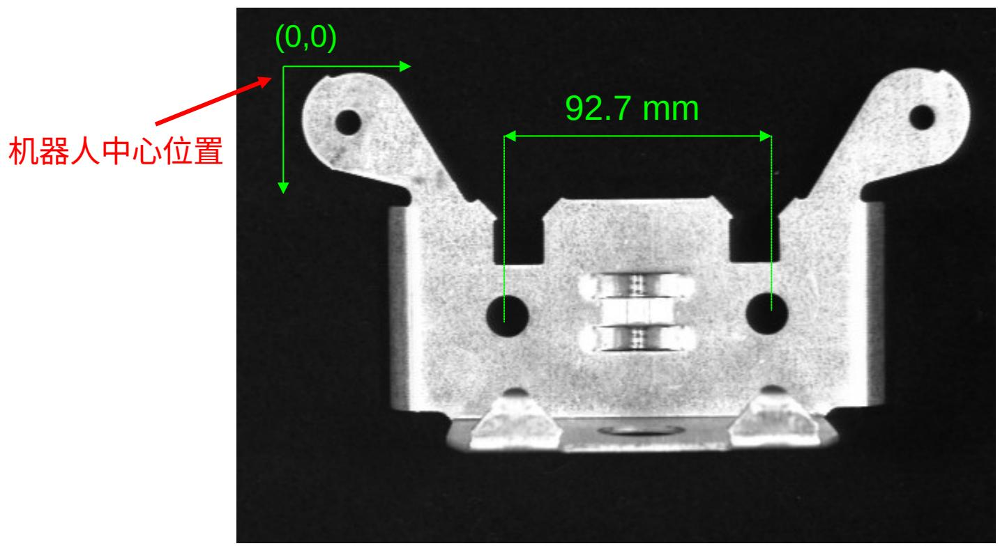

# 校准图像

通常，校准在待检查的元件以外的元件上进行  
一些校准板标准：

在已知位置上包含特征

- 所需的特征数量取决于计算的自由度数量  
- 即平移、旋转、比例、纵横和倾斜要求三个已知位置

当在检查的元件上运行时在同样的光学设置上占据视场大约 $50 - 70\%$

# 采集校准图像

采集您想要校准的元件的图像  
在本例中，我们将使用一个 $100 \mathrm{~mm}$ 的校准方形

使用其角作为已知位置

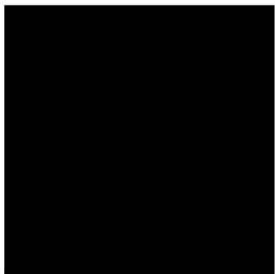

# 确定位置

- 有很多种方法我们可以确定校准方形各角的位置

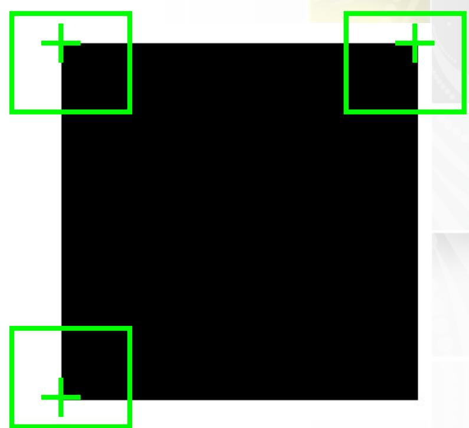

# 创建校准工具

在工作中添加一个 CalibNPointToNPoint 工具  
连接像源的输出图像（OutputImage）终端到校准工具的输入图像（InputImage）

# 输入坐标

连接各角的 X、Y 坐标到校准工具的各个未校准点

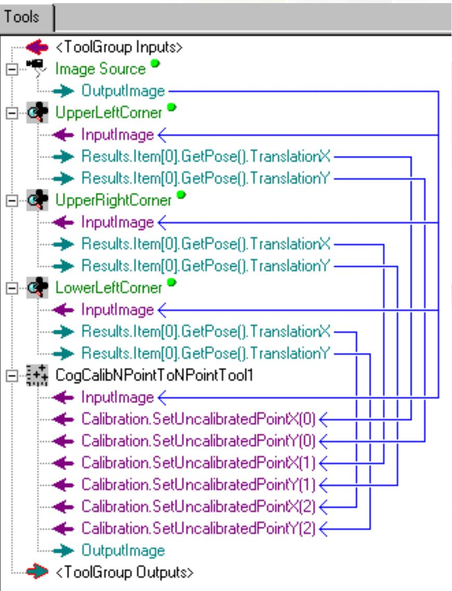

# 抓取校准图像

# 打开校准控件并按下抓取校准图像按钮

这会将当前输入图像(Current.InputImage)传递给当前校准图像(Current.CalibrationImage)

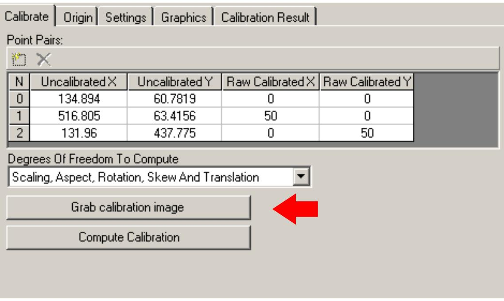

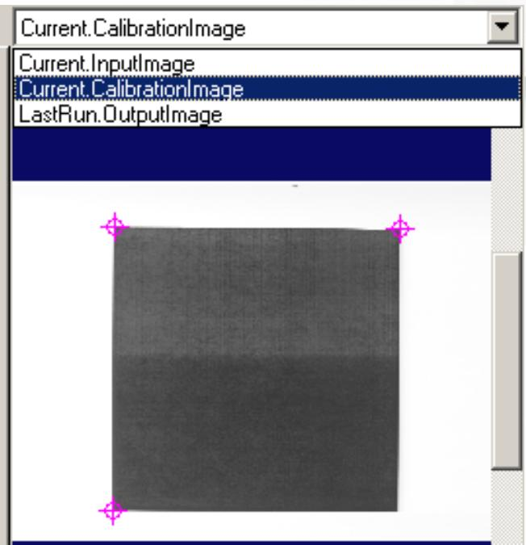

# 输入坐标

注意三个角的坐标已经被传递给校准工具  
输入每个点的真实坐标

Calibrate

Origin

Settings

Graphics

Calibration Result

Point Pairs:

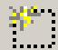

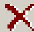

<table><tr><td>N</td><td>Uncalibrated X</td><td>Uncalibrated Y</td></tr><tr><td>0</td><td>134.894</td><td>60.7819</td></tr><tr><td>1</td><td>516.805</td><td>63.4156</td></tr><tr><td>2</td><td>131.96</td><td>437.775</td></tr></table>

<table><tr><td>Raw Calibrated X</td><td>Raw Calibrated Y</td></tr><tr><td>0</td><td>0</td></tr><tr><td>100</td><td>0</td></tr><tr><td>0</td><td>100</td></tr></table>

# 自由度

下一步，选择自由度，以便在计算未校准和校准点之间的最匹配转换时使用

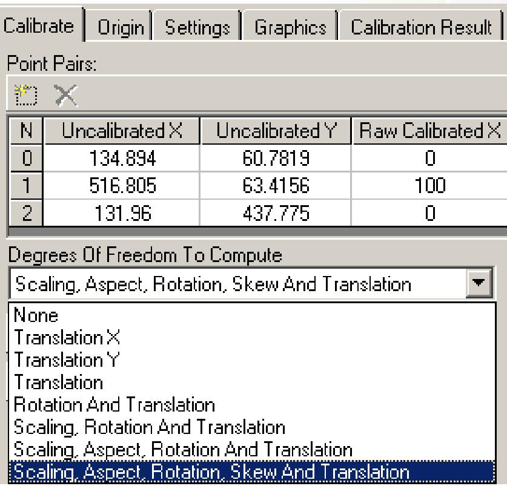

# 原点

可选项，表示其他原点平移、旋转或者坐标轴的利手性转换

Calibrate

Origin

Settings

Graphics

Calibration Result

Calibration Origin

Origin X

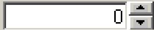

Origin Y

X Axis Rotation

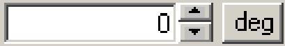

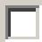

Swap handedness

Origin Space

Raw Calibrated Space

X Axis Rotation Space

Raw Calibrated Space

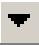

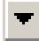

# 图形

也是可选项，表示图形显示校准

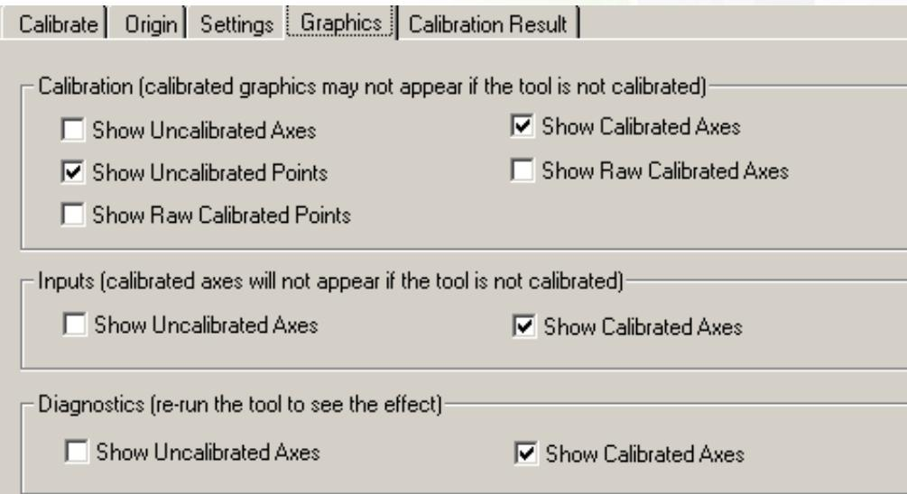

# 计算校准

# 最后按下计算校准按钮

在当前校准图像(Current.CalibrationImage)中，注意校准图像的坐标轴图形

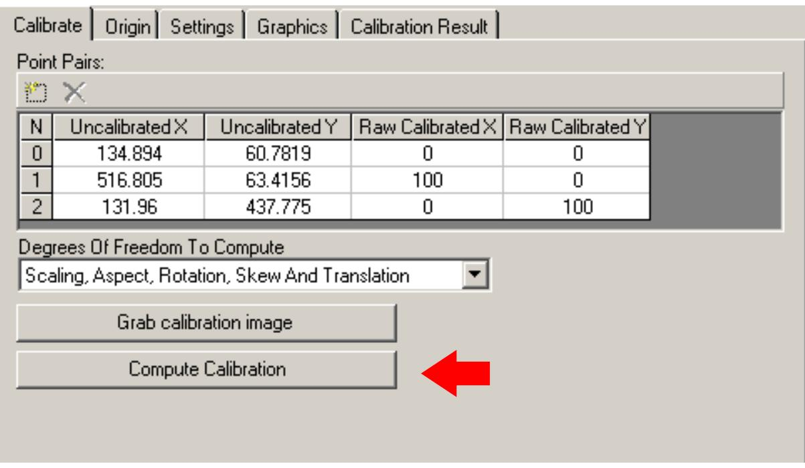

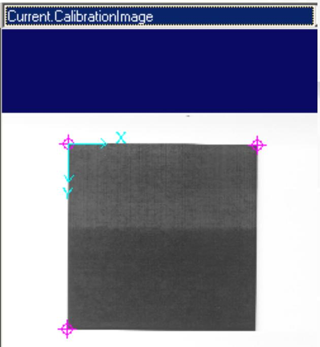

# 结果

检查校准结果对您正使用的校准图像是否有意义

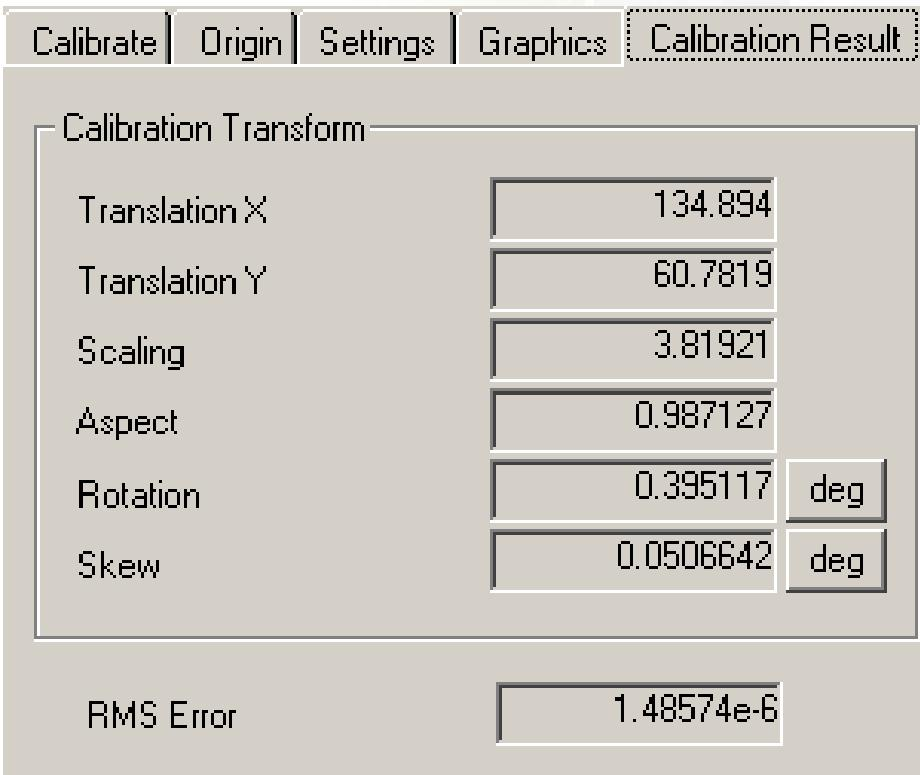

# 校准错误

如果存在较大的RMS错误，在控件中会显示一条信息

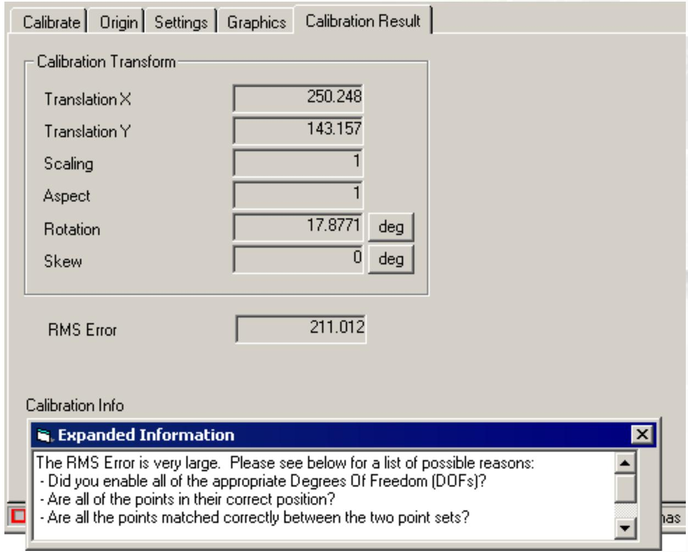

# 取消角查找工具

现在我们已经计算了校准转换，不需要再运行工具直到我们需要再次校准我们的视觉系统

元件和相机之间的距离会变化

在每个工具或者工具组上右击取消它

在您运行工具组时，工具不会执行

保持校准工具处于激活状态

# 分析元件

- 现在向工具组添加视觉分析工具在本案例中我们将添加一个斑点工具  
- 连接斑点工具的输入图像到校准工具的输出图像

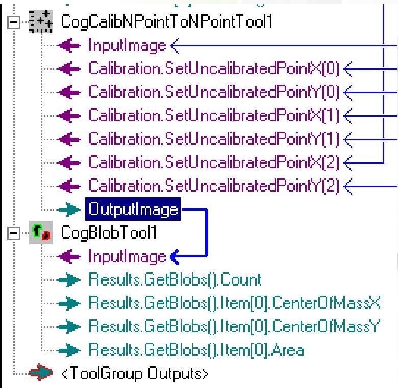

# Thank you.