本主题包含以下部分:

· Settings Tab

Copy Region 工具编辑控件为 CogCopyRegionTool 工具提供图形用户界面，此工具可将输入图像的一部分复制到新的输出图像，将输入图像的一部分复制到现有目标图像，或使用恒定灰度值填充输入区域的一部分。有关如何使用 Copy Region 工具的更多信息，请参阅主题“Copy Region Theory”。

Copy Region 工具可以接受 16 位编码图像，从而可使用和生成位深为 8 位、10 位、12 位、14 位和 16 位的图像。

注意：输出图像的坐标空间目录树 adjusted（调整）为保留根空间与图像特征之间的关系。

Copy Region 工具编辑控件如下图所示：

下图显示了复制区域工具的编辑控件:

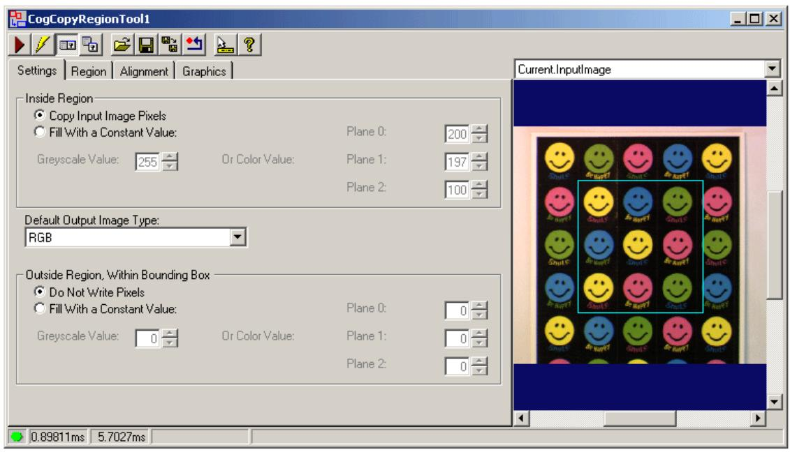

此编辑控件提供以下功能：

 一排位于左上角的控件按钮，可完成大部分常规操作。

一组功能选项卡，用于选择是否从输入图像中复制像素，是否用常数值（灰度或颜色）填充输出图像，确定要使用的输入区域的类型，以及选择控制输入图像与输出图像的映射方式的配对方法。  
 一个图像显示窗口，用于显示取像和 Copy Region 工具生成的输出图像。

# 一、Control Buttons

# 二、Settings Tab

本节包含以下子节:

Inside Region

使用 Settings 选项卡确定输出图像是否包含输入图像的像素，或是否包含常数灰度或颜色值，以及确定工具如何处理位于输入区域之外区域限定框的边框之内的像素。下图所示为默认的 Settings 选项卡：

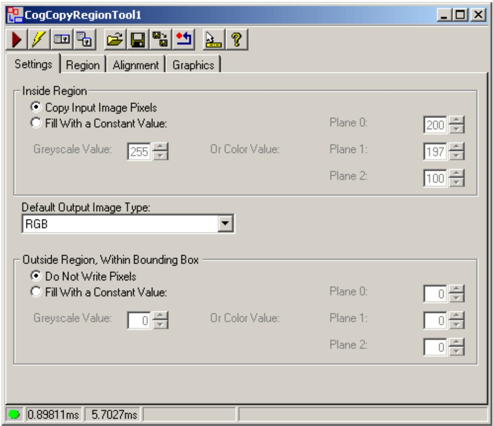

# 1、 Inside Region

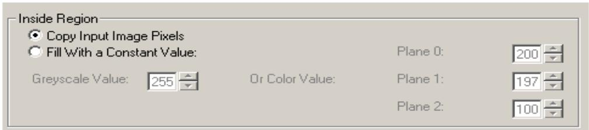

使用以下选项确定输出图像是否包含来自输入图像的像素或是否包含常数灰度值：

FillRegion 从输入图像的输入区域获取像素以将其复制到输出图像。

FillRegion 根据所使用的输入区域和输入图像的格式使用常数灰度或颜色值填充输出图像。

如果使用的是灰度图像，请指定 FillRegionValue。

如 果 使 用 的 是 彩 色 图 像 ， 请 指 定

FillRegionPlane0Value FillRegionPlane1Value 和

FillRegionPlane2Value 的值，这些值分别对应 RGB 图像中的

红色、绿色和蓝色平面，或 HSI 图像中的色调、饱和度和亮度。

# 2、 Default Output Image Type

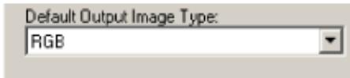

在 选 择 使 用 常 数 灰 度 或 颜 色 值 填 充 输 入 区 域 的 像 素 时 ， 指 定 要 生 成 的DefaultOutputImageType 的类型。

# 3、 Outside Region, Within Bounding Box

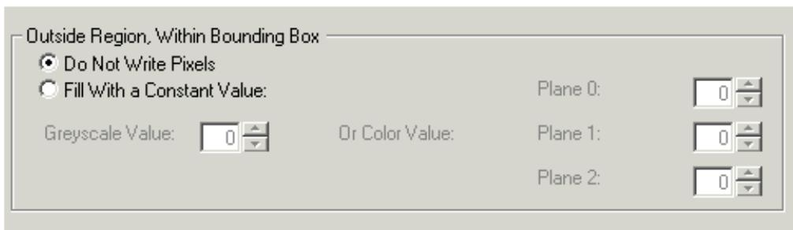

使用以下选项来配置工具如何处理圆形、椭圆形或感兴趣的仿射矩形区域外但在外接矩形内的像素，并且您正在使用像素对齐边框调整蒙版的区域模式:

FillBoundingBox 如果不使用目标图像，则此选项将使用未初始化值填充该区域以外但在封闭边框内的像素。但是，如果使用的是目标图像，则此选项允许区域以外的像素保留基础目标图像的值。

FillBoundingBox 根据所使用的输入区域和输入图像的格式，使用恒定的灰度或颜色值填充区域以外但在边框内的像素。如果使用的是灰度图像，请指定 FillBoundingBoxValue；

如 果 使 用 彩 色 图 像 ， 请 为FillBoundingBoxPlane0Value 、 FillBoundingBoxPlane1Value 和FillBoundingBoxPlane2Value 指定值，它们对应于 RGB 图像中的红色、绿色和蓝色的单独平面，或 HSI图像中的色调、饱和度和强度。

# 三、Region Tab

# 四、Alignment Tab

复制区域工具允许您复制输入图像的输入区域，并将其粘贴到某个目标图像的内容中。默认情况下，输入图像和目标图像在当前坐标空间的图像坐标(0,0)处对齐到每个图像的左上角。这种对齐导致将输入区域置于目标图像中它在输入图像中使用的相同位置。

使用“复制区域编辑”控件的“对齐”选项卡可指定两个图像之间的不同对齐方式。例如如果为输入图像指定一个坐标(25,25)，并将目标图像上的对齐点保留为(0,0)，则该工具将输入图像上的点(25,25)与目标图像上的点(0,0)对齐。这进而导致输入区域出现在目标图像中，相对于其在输入图像中的位置的偏移量。

如果不为工具提供目标图像，此选项卡中的设置将无效。下图显示了默认对齐选项卡:

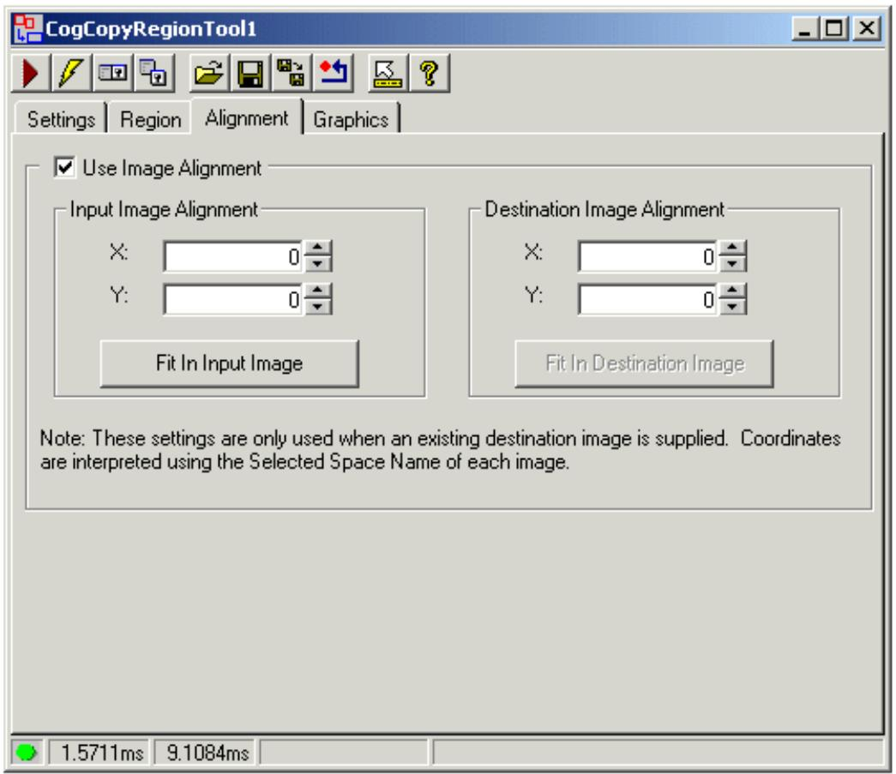

ImageAlignmentEnabled

启用输入图像与目标图像的特定对齐。默认情况下，该工具将图像对齐到每个图像的坐(0,0)。

Input Image Alignment

使用 InputImageAlignmentX 和 InputImageAlignmentY 字段来指定要用于对齐图像的输入图像中的点

单击 Fit In Input Image 按钮将对齐点移动到输入图像的中心。

Destination Image Alignment

使用 DestinationImageAlignmentX 和 DestinationImageAlignmentY 字段来指定目标图像中要用于对齐图像的点。

单击“适合目标图像”按钮，将对齐点移动到目标图像的中心。

本主题包含以下部分:

Example: Subsampling   
Single-Image Tools   
Two-Imaqe Tools

当您使用图像处理工具通过处理输入图像中的像素来生成新图像时，图像处理工具负责建立输出图像的坐标空间树。

图像处理工具通常对图像的坐标空间树进行修改，使像素空间("#")与根空间的关系反映图像处理操作的效果。

例如，如果使用高斯采样工具对图像进行子采样和平滑，结果输出图像将调整其空间树，以便特征在平滑和采样图像中的位置与它们在输入图像中的位置相同。

# 一、 Example: Subsampling（二次采样）

下图显示了其工作原理。在输入图像中，像素空间(# space)和根空间( $@$ space)是相同的。所指示的点在两个空间中具有相同的位置。

在对图像进行子采样之后(X和y方向的采样系数都为 2)，输出图像的像素数是输入图像的四分之一。

因此，相同的位置(绿色显示)在像素空间中已经改变。

但是在根空间中，位置并没有改变，因为高斯采样工具更新了输出图像的根空间来反映图像处理操作的效果。

这种自动更改为根空间意味着，当您使用模式定位工具、指定区域或使用图像的根空间执行任何其他操作时，您指定的位置将与原始图像中的位置对应。

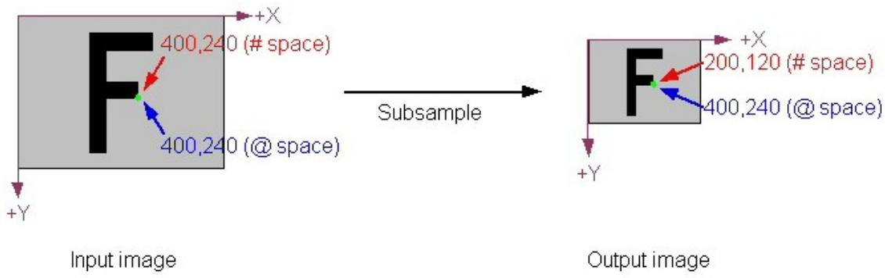

# 二、 Single-Image Tools

下表总结了采用单个输入图像的各种图像处理工具所做的调整类型。有关特定工具的详细信息，请参阅该工具的文档。

# Affine Transformations

如果你使用 CogAffineTransformTool 或如果你使用 CogRegionModeConstants 区域模式与Cognex一个图像或两个影像工具,输出图像的图像处理工具集的根空间之间的转换,以反映所提供的输入区域(一个仿射矩形)和输出图像。

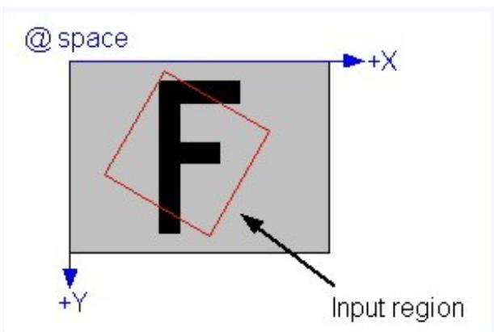

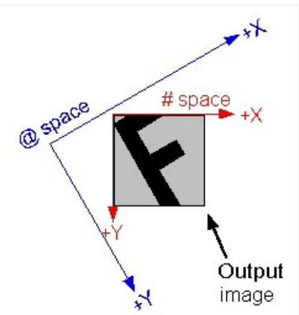

# Image Flip or Rotate.

如果使用单图像工具来翻转或旋转输入图像，则输出图像的根空间将反映翻转或旋转。

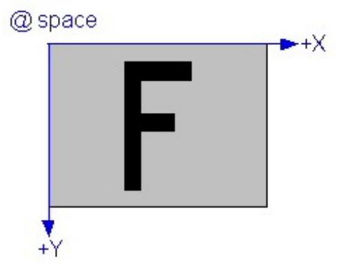

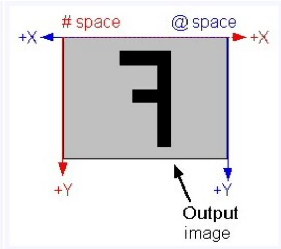

CogCopyRegionTool的行为类似于仿射变换(如上所述)。输出图像的根空间反映了输入图像的根空间与被复制区域之间的转换。

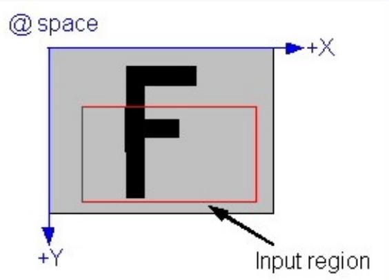

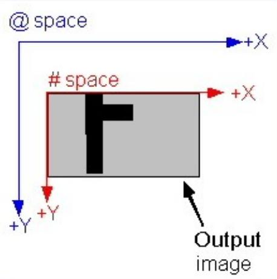

# Kernel-based Image Processing Tools

通过对输入图像中的像素依次应用内核来执行图像处理操作的大多数工具都会生成比输入图像小的输出图像。

大小的缩减取决于内核的大小。对于 $3 { \times } 3$ 内核(最常见的大小)，图像在X和y方向上都缩小了2个像素。

输出图像中的根空间会自动调整以补偿这种效果。

高斯采样工具是这个规则的一个例外。该工具综合生成“缺失”的像素，因此其输出图像与输入图像大小相同。

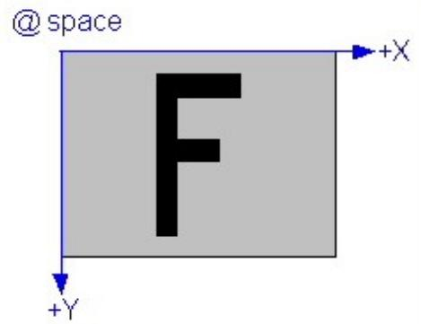

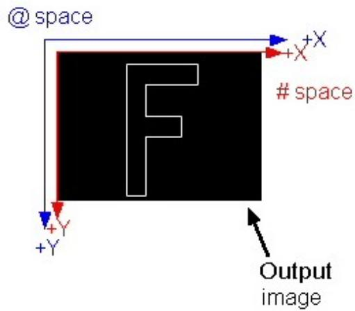

# 三、 Two-Image Tools

默认情况下，接受两个输入图像的图像处理工具(例如 CogIPTwoImageAddTool)的操作方式与上一节中描述的单图像工具完全相同。

输出图像的根空间是基于输入图像的根空间与第一个图像的输入区域所隐含的任何转换的组合。除了计算图像对齐之外，第二幅图像的坐标空间树基本上被忽略。

但是，在某些情况下，您可能希望在输出图像的坐标空间树中保存来自两个输入图像的信息。

可 以 通 过 为 工 具 的 SpaceTreeMode 属 性 指 定CogIPTwoImageSpaceTreeModeConstants 或

CogIPTwoImageSpaceTreeModeConstants 来实现。

当您这样做时，双图像工具将第二幅图像的空间树与第一幅图像的空间树合并。它通过创建一个新的空间，使用 MergedSpaceTreeName属性指定名称，然后使用标识转换(I)将第二幅图像的 $@$ 空间附加到这个新空间。

新创建的空间反映了第二幅图像相对于第一幅图像的对齐。这种合并允许您使用输入图像空间树中的坐标继续引用合并图像中的特性。

下图显示了合并是如何完成的: