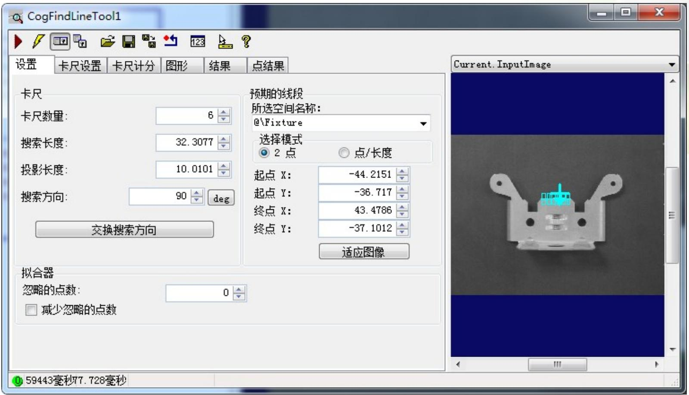
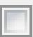
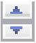
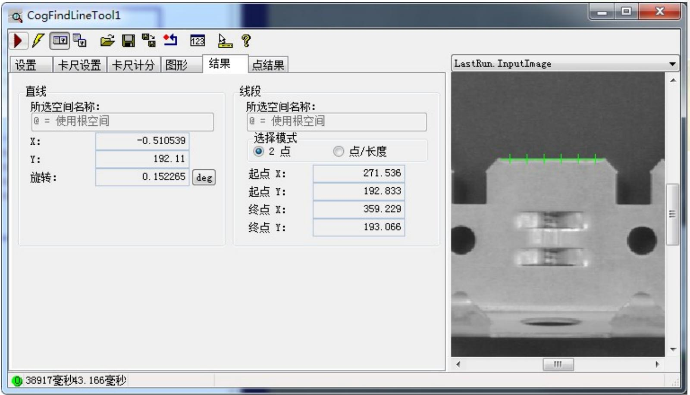

# CogFineLineTool

2019/12/19

Zhang Juan

# FindLine 简介

在图像的指定区域上运行一系列 Caliper 工具以定位多个边缘点，然后向底层的 Fit Line 工具提供这些边缘点，最后返回最佳拟合这些输入点的线条，同时生成最小均方根 (RMSError) 误差。

# 设置选项卡

# 卡尺控件

<table><tr><td>功能</td><td>说明</td></tr><tr><td>卡尺数量</td><td>控制沿线段使用的Caliper数量。此工具需要最少两个Caliper,但使用更多Caliper可让工具生成更好的拟合。此外,如果您允许底层Fit Line工具在计算最佳拟合线条时忽略一个或多个点,则应使用两个以上的Caliper。在确定要忽略的点时,Fit Line工具会考虑所有可能的子集并保留可能得分最高的集。</td></tr><tr><td>搜索长度</td><td>控制垂直于每个Caliper要考虑的预期线段的图像数量。您可以使用Find Line图形指定常规搜索长度或使用此字段输入精确的值。</td></tr><tr><td>投影长度</td><td>控制平行于每个Caliper要考虑的预期线段的图像数量。您可以使用Find Line图形指定常规投影长度或使用此字段输入精确的值。您指定的投影长度不应导致单个Caliper工具重叠或使工具生成非预期结果。</td></tr><tr><td>搜索方向</td><td>通过减去180度或增加180度(若搜索方向已为负值)来反转搜索方向。</td></tr></table>

# 设置选项卡

# 预期线段

<table><tr><td>功能</td><td>说明</td></tr><tr><td>所选空间名称</td><td>命名输入图像的坐标空间。</td></tr><tr><td>选择模式</td><td>判断线段是由 2 Points 选项（两个坐标 [x, y]）确定，还是由 Point/Length 选项（起始坐标 [x, y]，后接线段长度和旋转角度）确定。</td></tr><tr><td>起点 X 和起点 Y</td><td>指定预期线段的起始坐标 (x, y)</td></tr><tr><td>终点 X 和终点 Y</td><td>使用 2 Points 方法时，指定预期线段的结束坐标 (x, y)。</td></tr><tr><td>适应图像</td><td>调整 Find Circle 图形，使其默认尺寸基于此图像和输入图像的坐标空间。</td></tr></table>

# 设置选项卡

# >拟合器

# 拟合器

忽略的点数：

减少忽略的点数

0

<table><tr><td>功能</td><td>说明</td></tr><tr><td>忽略点数</td><td>控制底层 Fit Line 工具在计算最佳拟合线时可忽略的边缘点数。在确定要忽略的点时，Fit Line 工具会考虑所有可能的子集并保留得分最高的集。</td></tr><tr><td>减少忽略的点数</td><td>对于无法生成有效边缘点的每个 Caliper，允许 Find Line 工具减少忽略的点数。此功能可避免出现因 Caliper 失效而导致 Fit Line 工具中的输入点少于两个的情况。如果您允许此工具忽略任何输入点，Cognex 建议启用此选项。</td></tr></table>

# 结果选项

所选空间名称：输入图像空间  
X、Y：所找的线条中单个点的坐标（X,Y）  
旋转：所找到线条的旋转角度

# Thank you.