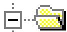
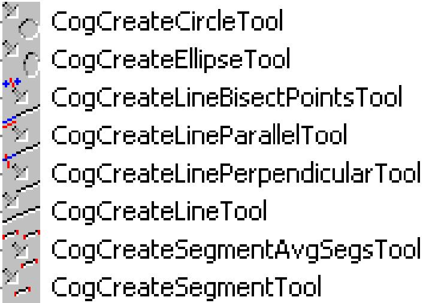
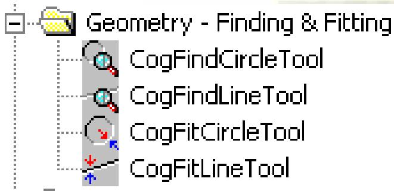
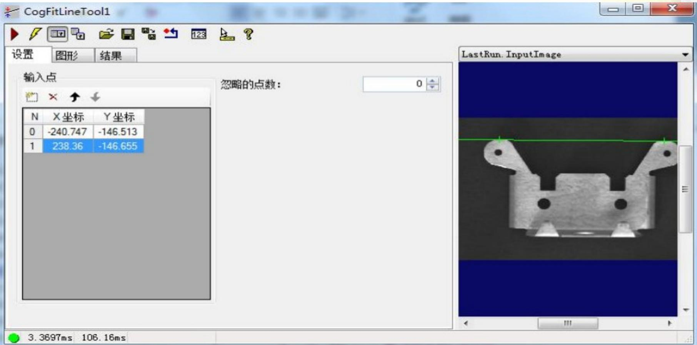

# CogFitLineTool

2019/12/19

Zhang Juan

# 几何学工具简介

# 创建工具

- 根据提供的输入创建指定的形状

即建立圆形

(CreateCircle) 工具将输出一个圆圈，给定 X、Y 中心点和半径

Geometry - Creation

# 查找和匹配工具

- 查找工具使用工具中包括的游标卡尺的结果创建指定的形状  
匹配工具使用从其他工具的输入创建一个最佳匹配形状

# FitLine 简介

此工具可以获取一个输入点集并返回最佳拟合这些输入点的线，同事生成最小均方根（RMSError）误差。FitLine 工具需要最少两个输入点。

FitLine 编辑控件用于选择输入点，指定要忽略的一系列输入点，以及查看视觉工具结果。

# 设置选项卡

# >输入点

使用设置选项卡的 Input Points 网格，为此 Fit Line 工具指定输入点的数量和 $(x, y)$ 坐标，需要指定最少两个输入点。使用按钮添加、删除和重新排序输入点。要将输入点添加至列表，可直接输入 $(x, y)$ 坐标，或使用 Tool Group 编辑控件将其他工具中点结果的 $(x, y)$ 坐标链接至 Fit Line 工具输入参数的 $(x, y)$ 坐标。

# >忽略点数

使用忽略点数文本框指定 Fit Line 工具在计算最佳拟合线时可忽略的输入点数。在确定要忽略的点时，Fit Line

工具会考虑所有可能的子集并保留可能得分最高的集，在此处需注意，值越大，工具需要的执行时间越长。

# 结果选项卡

<table><tr><td>区域</td><td>说明</td></tr><tr><td>线</td><td>显示输入图像的坐标空间以及线条的中心点和旋转角度。</td></tr><tr><td>RMS 误差</td><td>显示线条拟合的 RMS 误差</td></tr><tr><td>点</td><td>显示每个输入点的以下信息：
· 输入点是否用于计算最佳拟合线条
· 从点到线条的距离
· (x, y) 坐标</td></tr></table>

# Thank you.