# CogFixtureTool

2019/12/19

Zhang Juan

# 固定工具

- 固定工具用来在您已经计算了一个坐标转换时创建一个固定坐标系统

在我们所举的范例中，使用 PMAlign 来查找我们的元件；它将在其结果中产生一个转换

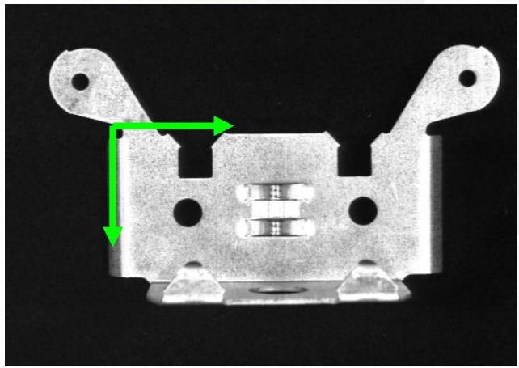

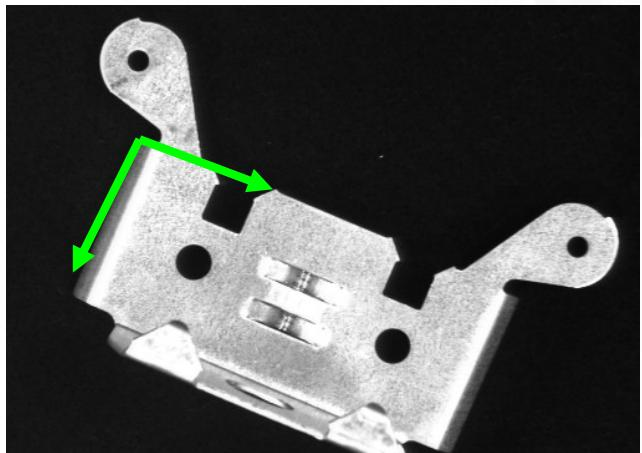

# 我们的问题是:

- 然后我们会创建一个游标卡尺来测量中心“标签”的宽度  
- 游标卡尺的目标区域必须相对于在图像中找到“耳”的地方移动

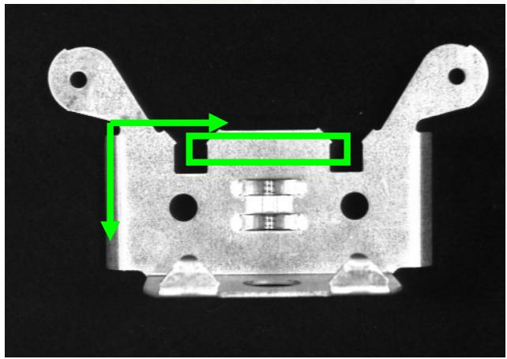

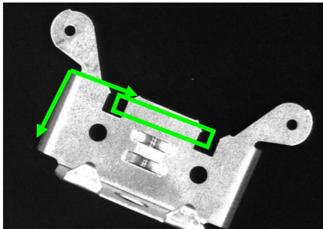

# 开始

创建并配置一个像源和一个 PMAlign 工具，训练来查找支架的右“耳”

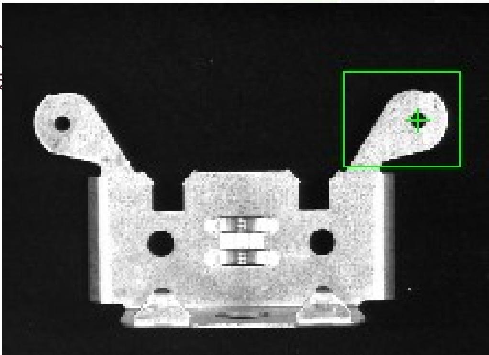

# 添加固定工具

- 然后添加一个CogFixture工具并将其输入图像（InputImage）连接到像源的输出图像（OutputImage）

# Tools

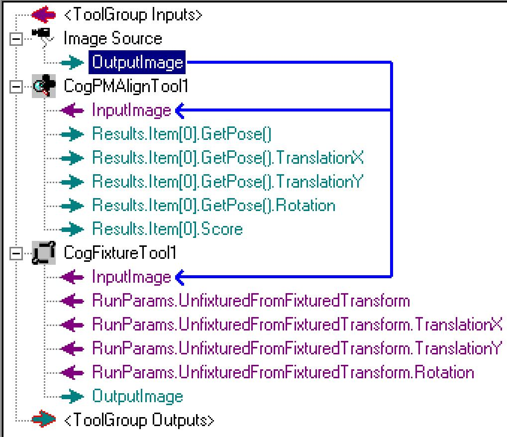

# 连接转换

取 PMAlign 确定的转换并将其用作我们的固定  
- 连接 PMAlign 的姿态结果到固定的转换

如果您另外想添加 X、Y 轴和旋转，您可以分别连接到这些终端

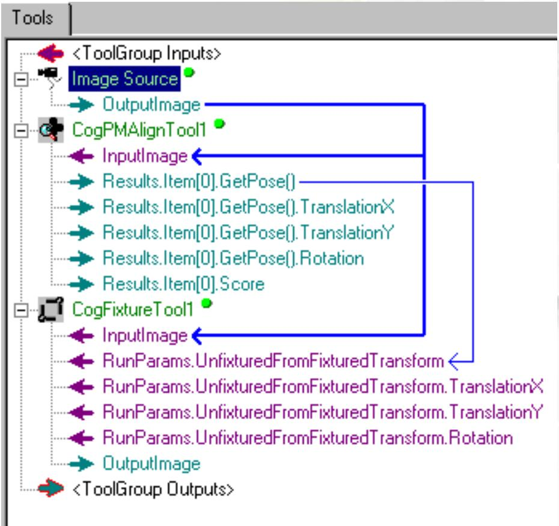

# 运行工具组

- 运行工具组通过图像并且转换到固定工具

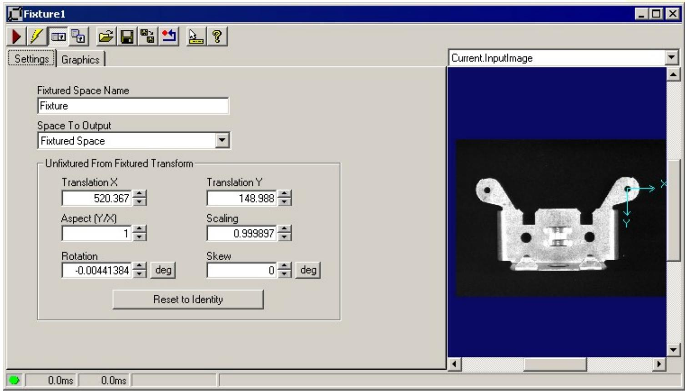

# 设置

在多数应用中，即是如此  
在有些情况下，您可能想要在运行随后的视觉工具之前操纵转换

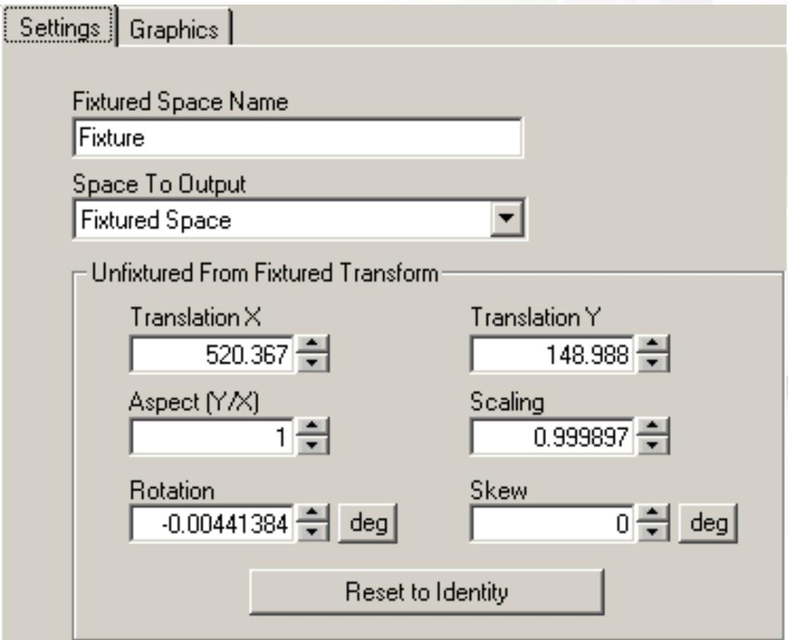

# 添加一个游标卡尺

- 现在添加测径器并将其输入图像连接到固定的输出图像  
配置游标卡尺

Tools

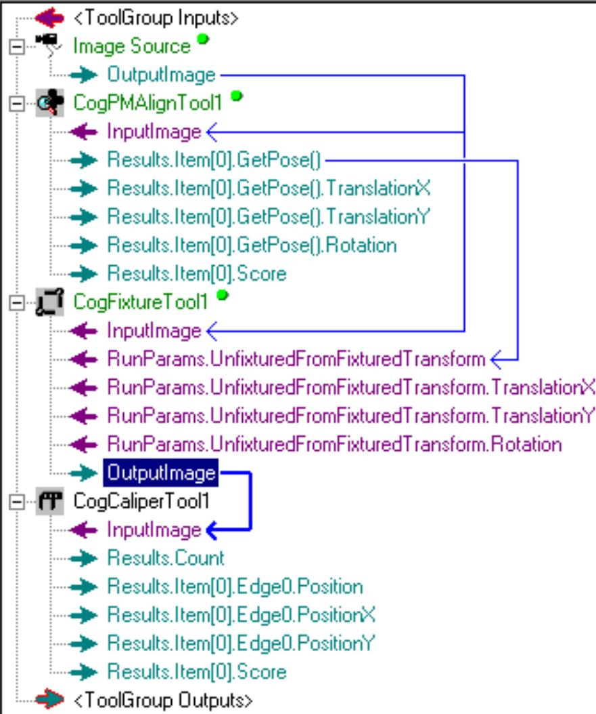

# 使用固定工具运行

为什么在创建和配置游标卡尺之前创建并配置固定工具很重要？

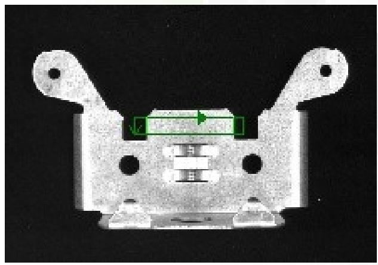

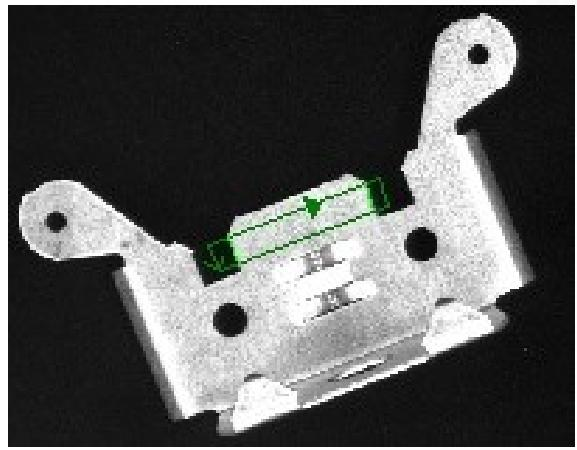

Thank you.