# CogHistogramTool

2019/12/19

Zhang Juan

# 学习目标

# 学员将学会正确地：

利用柱状图工具分析图像上是否存在某元件  
利用终端传送工具间的数据

# 柱状图

# 柱状图是建立图像指定区域内所找到的灰度值的统计数字及平面线图

柱状图是在整个图像中以每种可能的像素浓度（X轴）对图像像素（Y轴）计数的平面线图。

沿 X 轴每个像素浓度位置上图形的高度表明工具中具有该浓度的区域中像素的数量。

X轴位置可以表示浓度组，而不是单个浓度。

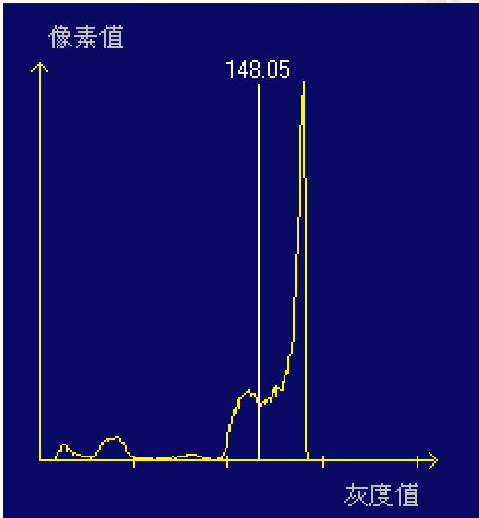

# 柱状图

# 柱状图可以用来：

探测图像中是否存在某物

监视光源的输出

- 软件测光仪

测量图像内灰度值是否一致

决定图像中的灰度值分布，以便设置其他视觉对象

# 添加柱状图和连接图像

拖放像源的输出图像（OutputImage）到柱状图的输入图像（InputImage）

现在，每次您运行工具组时，输出图像成为柱状图运行的图像

# Tools

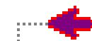

<ToolGroup Inputs>

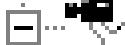

Image Source

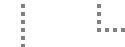

OutputImage

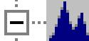

CogHistogramTool

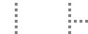

InputImage

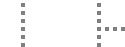

Result.Mean

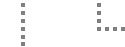

ResultStar

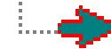

<ToolGroup Outputs>

# 柱状图图像

- 柱状图有三个与其相关的图像（工具对话框）  
Current.InputImage 是柱状图在下一次运行时将要分析的图像

在本例中，图像来源于像源的输出图像

# 柱状图图像

LastRun.InputImage 是柱状图在其上最后执行发生时的图像

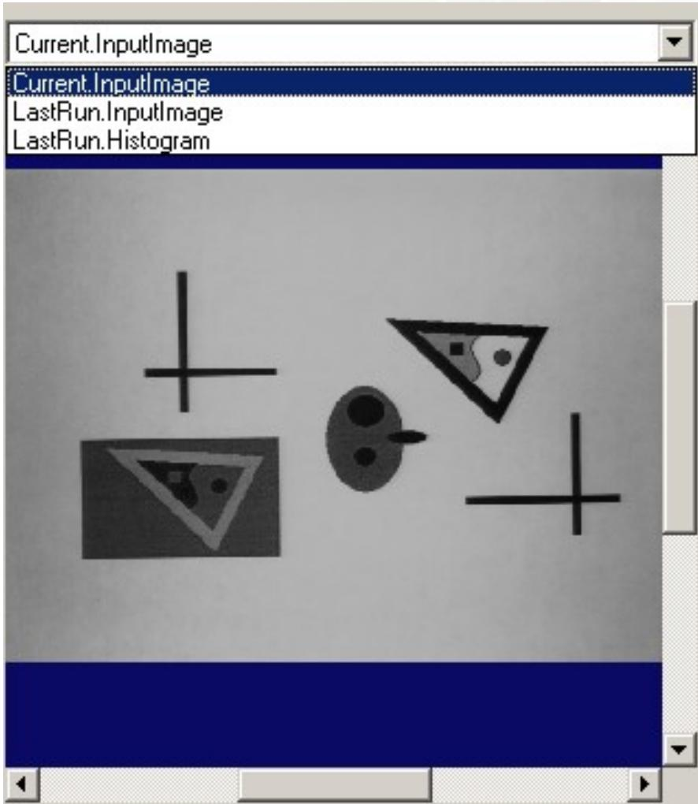

# 柱状图图像

LastRun.Histogram 是灰度值分布的一个平面线图

Number of Pixels

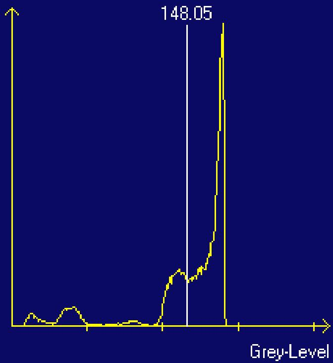  
LastRun.Histogram

# 关注区域

默认状态下，柱状图在整个图像上运行  
为了分析图像的单个区域，选择一个区域形状并且在 Current.InputImage 上操纵

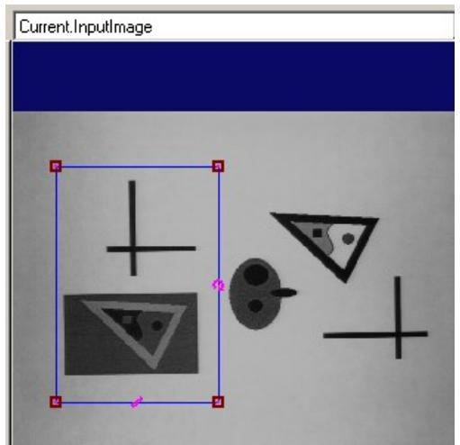

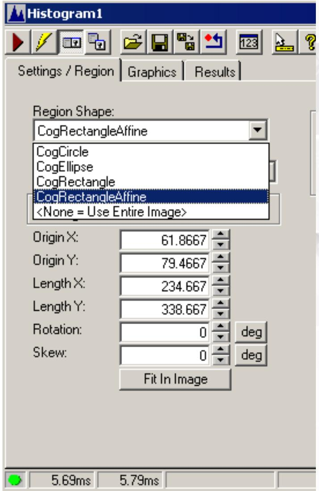

# 图形

可选项，更改在运行时显示的图形

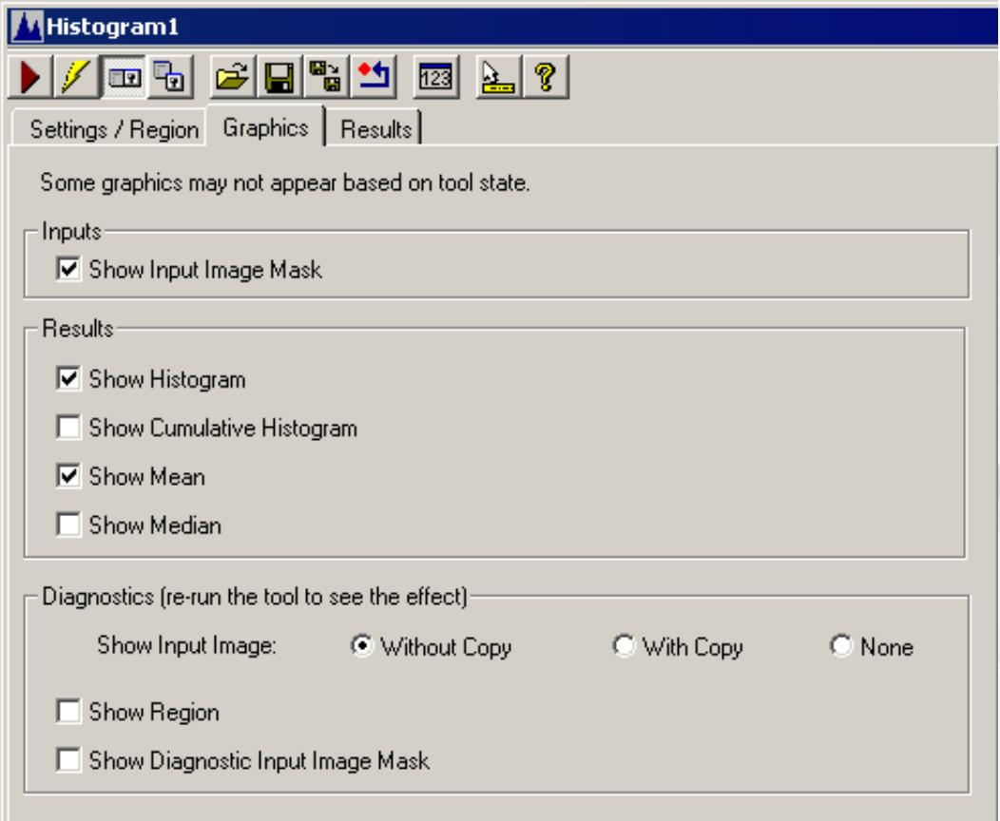

# 结果

结果显示在控件和浮动结果表格中  
也可在VB或者C语言代码中访问

Settings/Region

Graphics

Results

Statistics

Minimum 8   
Maximum 182   
Median 163   
Mode 179   
Mean 148.052   
Std.Dev. 41.3156   
Variance 1706.98   
Samples 307200

Data

<table><tr><td>Grey Level</td><td>Counts</td><td>Cumulative %</td></tr><tr><td>87</td><td>98</td><td>11.0</td></tr><tr><td>88</td><td>110</td><td>11.1</td></tr><tr><td>89</td><td>96</td><td>11.1</td></tr><tr><td>90</td><td>158</td><td>11.2</td></tr><tr><td>91</td><td>149</td><td>11.2</td></tr><tr><td>92</td><td>143</td><td>11.3</td></tr><tr><td>93</td><td>147</td><td>11.3</td></tr><tr><td>94</td><td>184</td><td>11.4</td></tr><tr><td>95</td><td>182</td><td>11.4</td></tr><tr><td>96</td><td>185</td><td>11.5</td></tr><tr><td>97</td><td>205</td><td>11.6</td></tr><tr><td>98</td><td>240</td><td>11.6</td></tr><tr><td>99</td><td>223</td><td>11.7</td></tr><tr><td>100</td><td>277</td><td>11.8</td></tr><tr><td>101</td><td>326</td><td>11.9</td></tr><tr><td>102</td><td>340</td><td>12.0</td></tr><tr><td>103</td><td>325</td><td>12.1</td></tr></table>

Thank you.