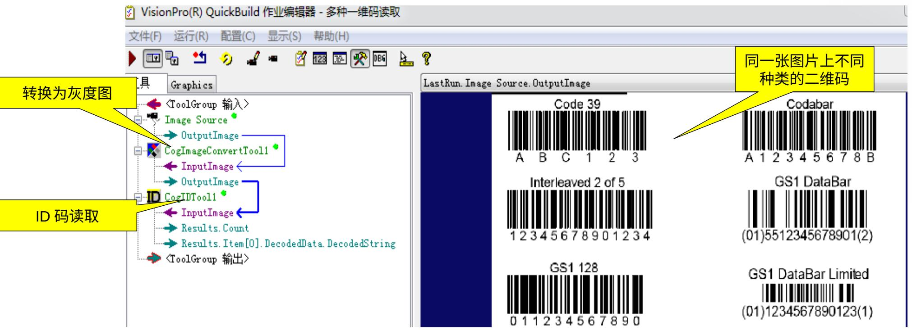
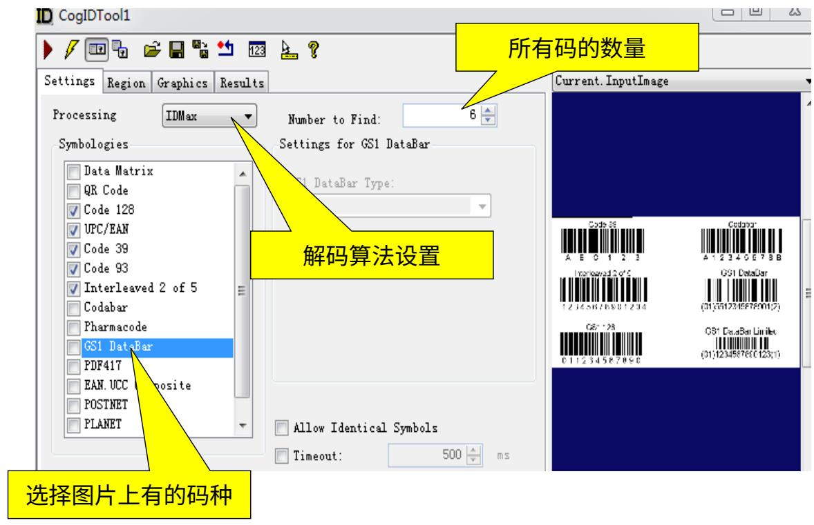
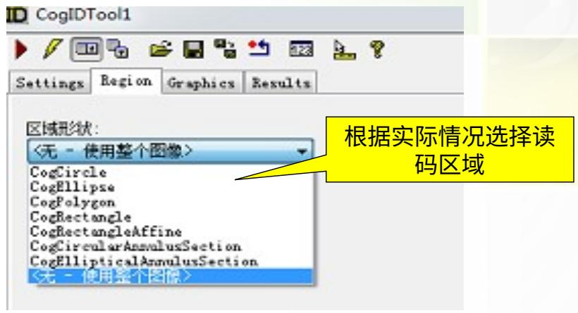
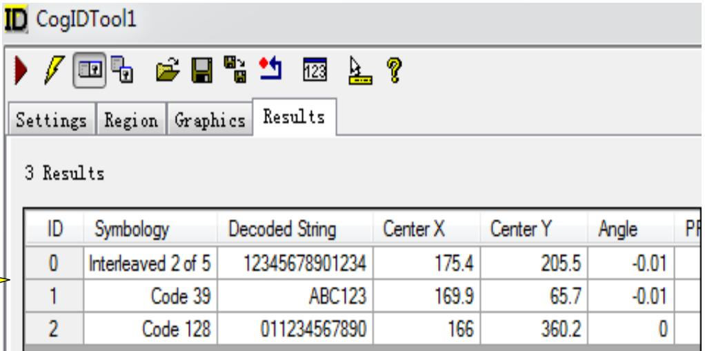
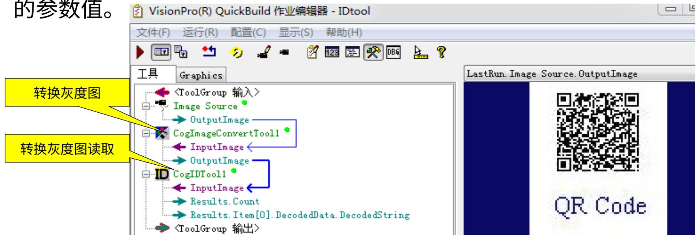
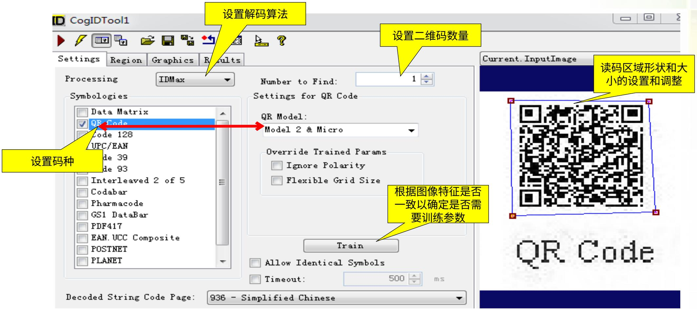

# VisionPro ——ID 读码 CogIDTool

2019/12/19

Zhang Juan

# ID 读码和验证工具

CogIDTool

功能原理

该工具是 VisionPro 新增的一个非常重要的解码工具，能够在同一张图像中读取不同种类的多个一维码，多个同种类的二维码，以及一些高度旋转和有透视变形的的码。

和前面讲到的 Barcode、2DSymbol、PDF417 等读码工具（详见第五章读码工具）相比，CogIDTool 具有以下优点：

1）同时支持一维码和二维码的读取（一维码时同一图像可以多码种，二维码是同一图片可以多个，但是码种必须相同）。  
(2) 能读取同一图像中种类不同的一维码。  
3）支持最新的解码算法。

注意：第五章讲到的读码工具虽然支持 Barcode、2DSymbol、PDF417 的读码，但是康耐视并不推荐使用这些工具，在后续的 VisionPro 的新版本中会逐渐放弃对这些工具的支持，会主推 CogIDTool 工具。

# ID 读码和验证工具

CogIDTool

功能原理 - 对图像的要求

该工具读码时对图像的要求如下：

# 读取一维码时——

1）对于一些非线性的码（码模块的宽度不同但高度相同），每一个模块的宽度要大于1.6个像素，高度要大于50个像素；对于邮政码（码模块的宽度相同但是高度不同），每一个模块的宽度要大于2.5个像素。一一要有差异性，便于区分。  
(2) 码的最小值净水带必须存在。  
(3) 码模块和背景的对比度要大于 32。  
4）像素高度比不大于 1.35:1

# 读取二维码时——

对图像的要求比较低，一般来讲，需要在码四周的模块上周围有等宽度的净水带。

# ID 读码和验证工具

CogIDTool

功能原理 - 解码算法和结果输出

# 解码算法

该工具提供了两种解码算法:

IDQuick：适用于快速读取一些质量较好的具有较高对比度的码。

IDMax：适用于读取一些质量不好的码。

该工具默认采用 IDMax 算法。

# 结果输出

只有被正确解码的一维和二维码才会有结果输出，对于被成功读到的码，会输出以下结果：

1）会以弧度的方式输出读取到码的方向。  
2）会输出码的中心点的X\Y坐标。  
(3) 会输出码的四个角点的 X\Y 坐标。  
(4) 会以字符串的形式输出读取到的码。  
5）国际标准化组织的代码和修饰符。

# ID 读码和验证工具

CogIDTool

示例用法——关于一维码

该工具能够读取同一图像中的多个种类的一维码，在读取一维码时不需要训练，设置好参数直接读取即可：

# ID 读码和验证工具

CogIDTool

示例用法——关于一维码

# 工具的相关设置和运算结果：

  
解码结果输出

# ID 读码和验证工具

CogIDTool

示例用法——关于二维码

该工具能够定位 2D Data Matrix 码或 QR Code 码, 同样能够读取多个二维码,但是不同的是同一图像上多个二维码必须是同一种类的。

如果图像中的二维码都具有相同的特征——

在使用该工具时，可以训练一些参数，例如：二维码的尺寸、编码种类、纠错方法等，以便能重复成功读取二维码。

如果图像中的二维码参数是变化的——

在使用该工具时不需要训练参数，以确保CogIDTool在读码的时候能够包含所有的参数值。 VisionPro(R) QuickBuild 作业编辑器 - IDtool

# ID 读码和验证工具

CogIDTool

# 示例用法——关于二维码

# 课堂活动

# 1，工具的实践

# Thank you.