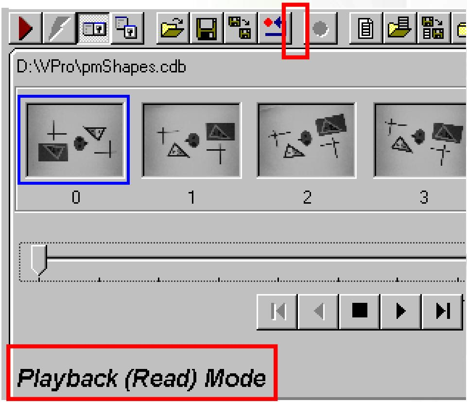
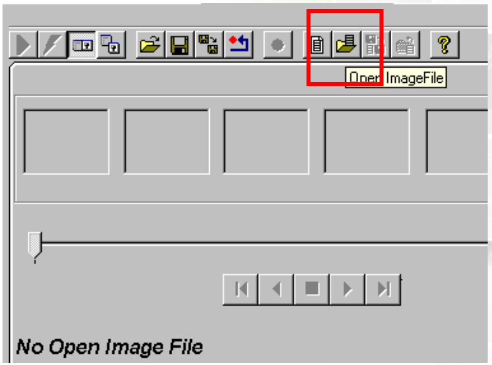
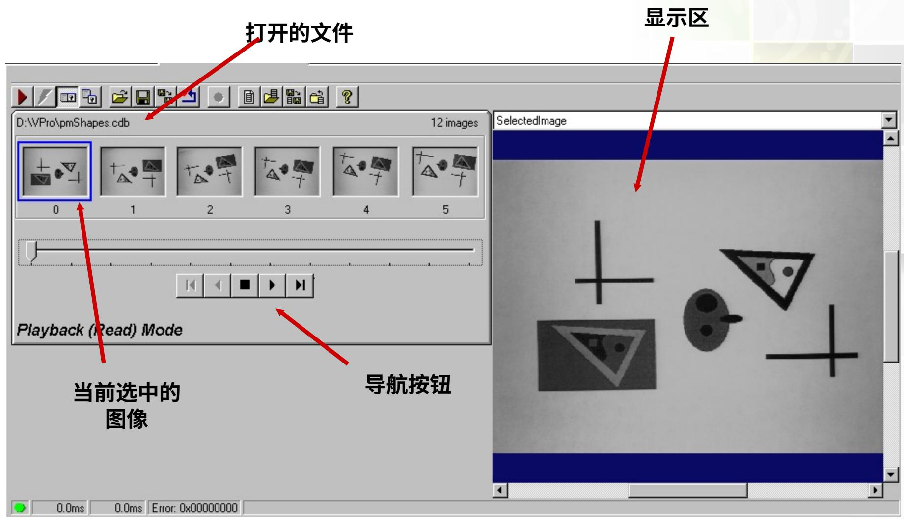
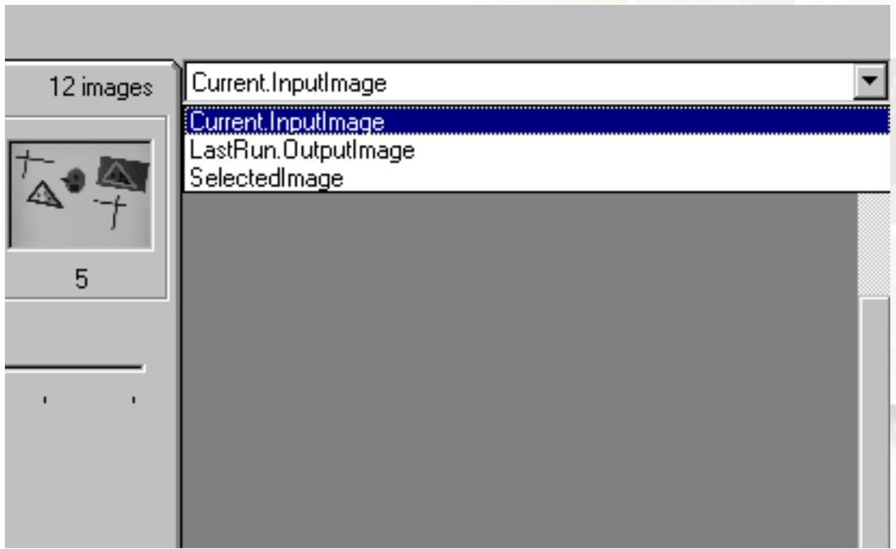
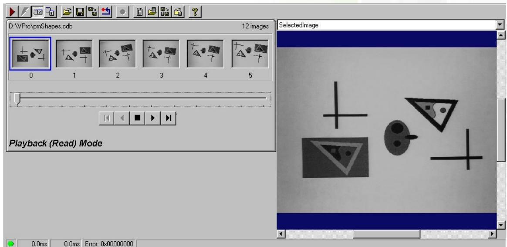
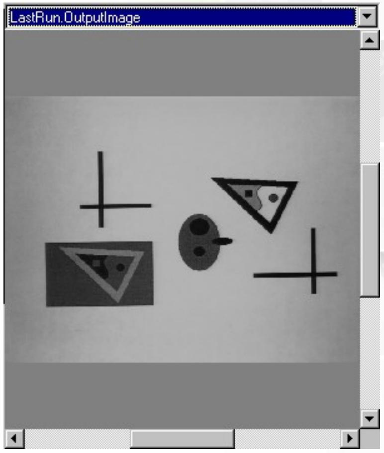
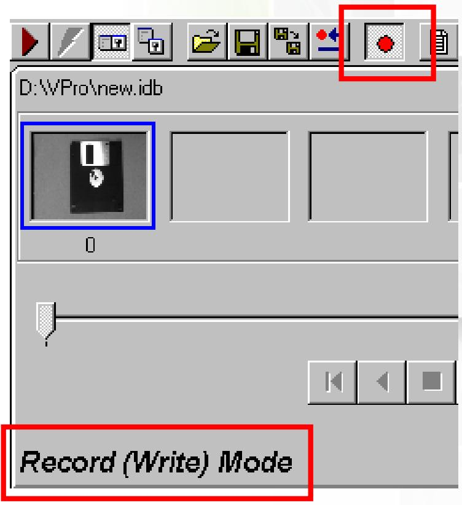
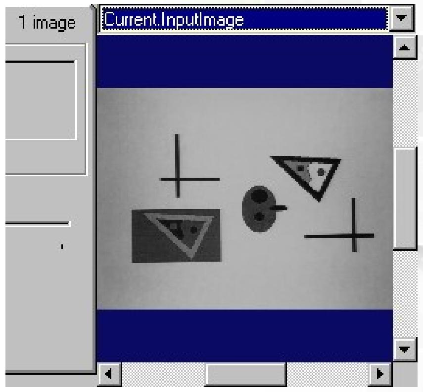
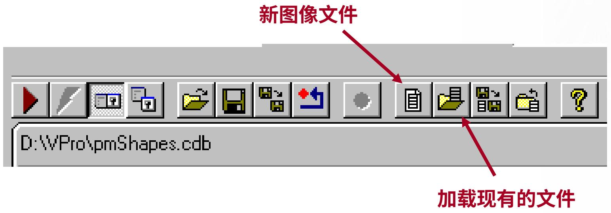
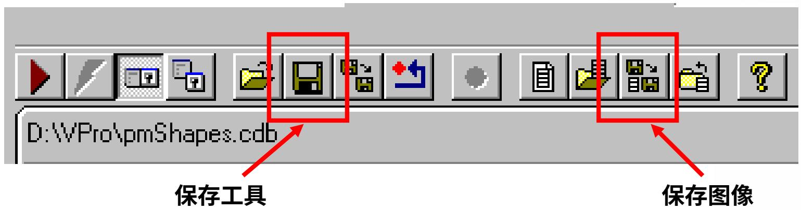

# CogImageFileTool

2019/12/19

Zhang Juan

# 学习目标

# 学员将学会正确地：

利用图像文件工具加载和保存图像文件  
利用终端传送工具间的数据  
保存并且加载 VisionPro 项目到 QuickBuild 中

# 图像文件工具

- 用来将图像写入到文件中或者从文件中读出  
支持的文件类型有:

图像数据库文件：.idf 和 .cdb

位图：.bmp

标记图像文件格式：.tif

例子：

要保存并且读回测试图像进行原型构建、开发和制档要从生产运行中保存并且读回图像

- 即所有失败的元件

# 图像文件模式

- 使用录制按钮在读取和书写模式之间切换  
在读取模式中您可以从图像文件中读取图像  
在写模式中您可以向图像文件中追加图像  
首先，我们会讲解如何从现有的图像文件中读取图像

# 读取图像

例子：您需要在固定的一套已保存图像上构建原型并且测试视觉工具  
- 使用 OpenImageFile 按钮加载一个文件
浏览查找图像文件

# 读取图像

# 三种图像

- 多数工具使用几种图像进行工作  
图像文件工具有三种图像  
从显示区的下拉菜单中选择要浏览的图像

# 选中的图像

当您第一次打开某图像文件时，默认状态下第一个图像为选中的图像

选中的图像的缩略图以蓝色高亮显示

选中的图像显示在显示区中

# LastRun.OutputImage

当我们从图像文件中抓取某图像时，它成为LastRun.OutputImage

# 将图像写入到文件

范例：您的质保部门想得到已保存的在生产过程中失败的所有元件的图像  
- 当处于书写模式时，运行图像文件添加当前输入图像（Current.InputImage）到图像文件中

取出当前输入图像并将其放入上次运行输出图像（LastRun.OutputImage）

# Current.InputImage

Current.InputImage 是要写入到下一次以录制模式运行的图像文件中的图像

# 添加图像到图像文件中

通过创建一个新文件或者打开一个现有文件来添加

# 链接图像

从像源的输出图像（OutputImage）拖放到图像文件（ImageFile）工具的输入图像（InputImage）现在每次运行工作时，所采集的图像会追加到图像文件中

Tools

<ToolGroup Inputs>

Image Source

OutputImage

CogImageFileTool1

InputImage

OutputImage

<ToolGroup Outputs>

# 加载/保存

在图像文件控件中，有两个保存按钮

一个保存整个工具和其所有的设置到.vpp文件中

另一个将当前打开的文件中的图像保存到一个图像文件

$\bullet$ .bmp、.cdb、.idf或者.tif

Thank you.