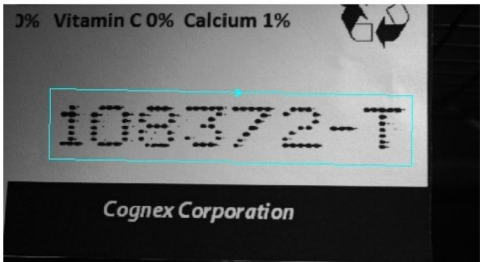
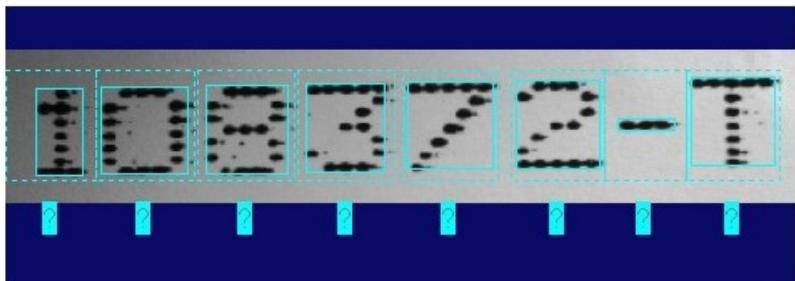
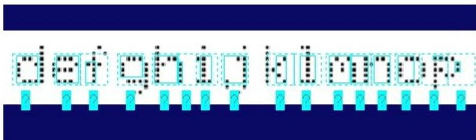
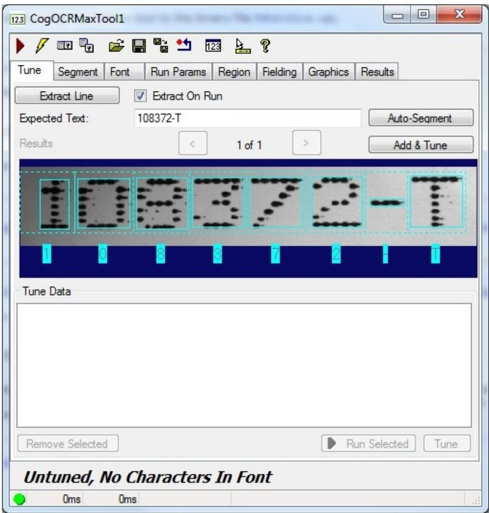
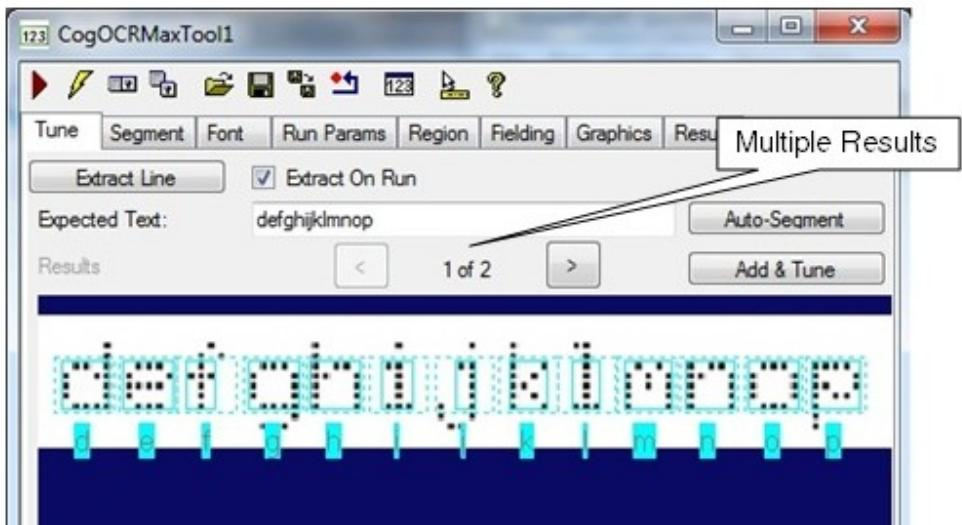
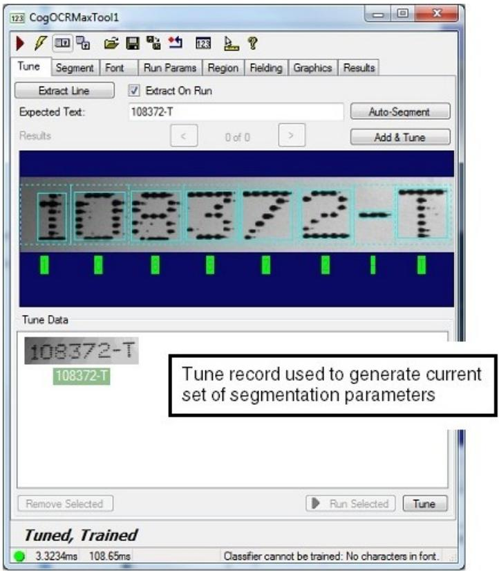
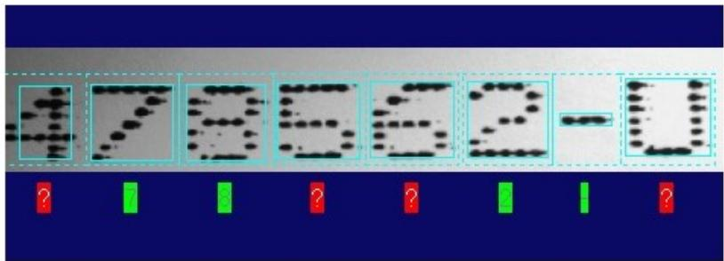
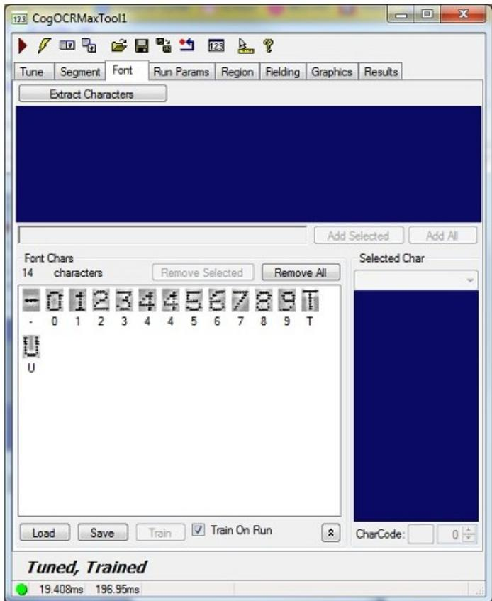

1. 建立图像源，并为OCRMax工具提供您需要对其进行分类的字符的示例图像。  
2. 在显示屏中选择Current.InputImage图像。  
3. 选择感兴趣区域的图形并对其进行修改以使其紧紧围绕字符串，如下所示：

4. 单击“提取行”以使该工具对字符串进行分段并尝试区分单个字符。在大多数情况下，该工具可以正确识别各个字符符号，如下所示：

在某些情况下，该工具将根本无法执行分割，或者无法正确地正确分割图像，如以下示例所示：

如果该工具没有显示任何分割结果，请尝试调整区域图形，并在字符串周围给它半个字符的宽度，然后再次单击“提取线”。在继续下一步之前，该工具应至少能够执行部分分割。

5. 使用“期望的文本”字段输入区域图形中包含的字符，然后单击“自动分段”。

“Tune”选项卡应显示分段的字符串，并在每个字符下方带有一个标签，如下所示：

在某些情况下，该工具会生成多次尝试对字符串进行分段的操作，如下所示：

在这种情况下，请滚动浏览结果并选择显示最佳分割效果的结果，然后再继续下一步。

OCRMax工具使用标记矩形和单元矩形来定义每个字符周围的边界，如主题选择分段参数中所述。如上图所示，分割过程可能无法为所有字符确定这些矩形的最佳尺寸。有关如何使用图形用户界面更改这些矩形的尺寸的详细信息，请参见更改标记和单元矩形部分。

# 6. 单击添加和调整。

这会将图像中的字符添加到当前字体中，训练要使用的字体，并使用自动调整来确定分段参数的最佳设置，以便可靠地在图像中定位字符。“Tune”选项卡以绿色指示属于字体的字符，并显示用于生成分段参数设置的调谐记录，如下所示：

“使用调音数据”部分介绍了如何使用“调音”选项卡中显示的调音数据。

7. 获取您希望应用程序能够分类的字符串的另一幅图像。

该工具可能会识别字体中已经存在的字符，同时以红色显示未知字符，如下所示：

8. 点击红色的“？”标签任何未知字符，然后使用键盘输入该字符的名称。

对图像中的所有未知字符执行此操作。

您还可以选择使用“提取行”字段并输入该字符串中可见的整个字符串。

9. 单击添加和调整将这些新字符添加到当前字体。

10. 继续获取图像并将新的字符添加到当前字体，直到需要该工具识别的所有字符都显示在“字体”选项卡上：

同一字符的多个实例表明，该字符在各种样本图像中的显示方式有所不同，可能是由于旋转或偏斜所致。

在一系列测试图像上运行该工具，并验证该工具是否提供足够的读取率。

您可能需要调整运行参数，例如“接受阈值”和“置信度阈值”，以根据您的生产环境生成所需的读取率。