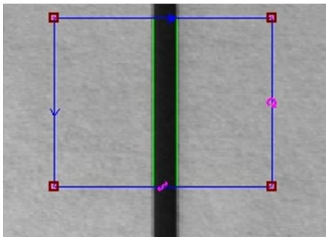

# Cognex 高级笔试题

总分(100 分) 姓名 工号

.不定项选择题（每题 2 分，共 10 分）

1.如下图所示，CogCaliperTool 工具说法正确的是（ BC ）

A、水平方向为投影方向

B、垂直方向为投影方向

C、水平方向为扫描方向

D、垂直方向为扫描方向

2. 利用CogFixture工具建立空间坐标系需要输入 （ ABD ）

A.X

B.Y

C. Center

D. Angle

3：8704E 卡采用 4-Pin 电源连接器连接 B 电源。

A.6V

B.12V

C.18V

D.24V

4．图片保存路径：D:/Cognex/Images/ 软件备份路径 D:/Cognex/Backup 及按要求(B )备份一次。

A.每天

B.每周

C.每半个月

D.每个月

5.PMAlign 工具输出结果数据（X,Y,Angle 等）是在哪个空间下（ B ）

A、像素空间

B、输入图像空间C、训练区域选取空间

D、搜索区域选取空间

6. 图像训练正确顺序为

（ A ）

A.获取图像 设置训练区域和原点 设置训练参数 训练图像 查看结果

B.获取图像 训练图像 设置训练参数 查看结果  
C. 获取图像 设置训练参数 设置训练区域和原点 训练图像 查看结果  
D. 获取图像 设置训练区域和原点 训练图像 查看结果

7. 图像保存时为什么最好保存为 BMP 格式 （ D ）

A.文件小

B.快门速度保存在图像文件中

C.转换为 FTP 更容易

D.图像质量不会丢失

8.LED光源的优势有哪些 （ABC）

A．寿命长

B.可以频闪

C.多种颜色和形状的选择

D.强度永不衰减

9. 以下什么不是 DataMatrix 代码的特征 （B）

A.静区

B.起始符/终止符和校验符

C.查找特征

D. 计时特征

10.对锯齿边缘轮廓检测，使用下面哪种光源比较合适 （C）

A.带偏振环形光

B.同轴光

C.背光源

D.高角度直

向型光源

# 二．判断题（每题 2 分，共 20 分）

1.不同颜色的物料，所对应的打光效果也是不一样的。 ( √ ）

2.做数据时 GRR 要跑 32 片料而 CPK 需要跑 10 片料。 ( × )

3.如果一个图像的效果太暗，我们可以通过调节光圈来进行设置，光圈的大小对于图像的效果的影响不大（×）

4.降低接受阈值参数，CogPMAlign 工具运行时间会变长。 ( $\cdot$ )

5.背光源适用于金属物体的表面打光。 （ × ）

6.CogPMAlignTool 查找概数中，值设置为 1 时，仍然可以找到多个结果。（×）

7.C 型接口的镜头可以匹配 CS 型接口的相机。 （√）

8.只需要在镜头前端装上偏振片即可过滤掉产品上的眩光，得到想要的效果图片

（×）

9. 调机时，相机聚焦需先把光圈调到最大，聚焦完成后在调回正常光圈是为了使聚焦最好. ( √ )  
10. 蓝色特征红色背景(黑白相机)，最佳使用红色光源。 （√）

# 三：简答题（60 分）

1：简述查询 8704E 的信息查询流程，并写出查询到的信息。（15 分）

1.在开始菜单的搜索框中输入“cmd”指令；  
2.在cmd命令行黑色窗口中输入：cogtool –p 会提取出8704E卡的所有信息；  
3.输入完成后按回车键，就会显示如下信息：（板卡的SN和最大支持的相机数以及支持的工具名称）

2：相机无法触发，分析原因并写出解决方法？（写出三点即可）（15 分）

1.确认相机是否连接正确  
2.如果 VisionPro 可用，打开 Cognex GigE Vision Configuration，查看不拍照的相机是否在左侧的相机列表中。  
3.确认机构是否发送了正确的触发信号。  
4.可能由于主机卡顿，软件卡顿或BUG引起，将计算机关机，约十秒钟后，重新开启计算机  
5.检查相机是否损坏，如坏的话更换相机。  
6.相机配置参数设置不正确，重新查看并配置好正确参数  
7.权限位丢失，检查8704E板卡权限   
8.磁盘已满或者图片删除设置参数不合理，重新设置图片保存参数

3：在其他条件一定的情况下，说明光圈值与通光量之间的关系，光圈与景深之间的关系。（15分）

光圈越大，通光量越大；光圈越小，通光量越小。

光圈越小，景深越大；光圈越大，景深越小。

4：简述视觉软件无法正常开启的可能原因及措施（写出三条即可）（15 分）

$\textcircled{1}$ 原因：视觉软件所在的文件夹中文件数量或者文件内存出错

措施：替换备份程序

$\textcircled{2}$ 原因：VisionPro软件版本号错误或者未安装

措施：卸载旧版本的VisionPro软件后安装正确版本的软件

$\textcircled{3}$ 原因：电脑运行卡死

措施：重启主机后再开启软件