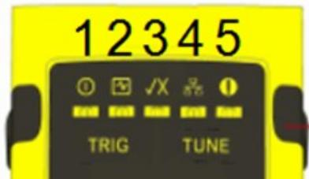
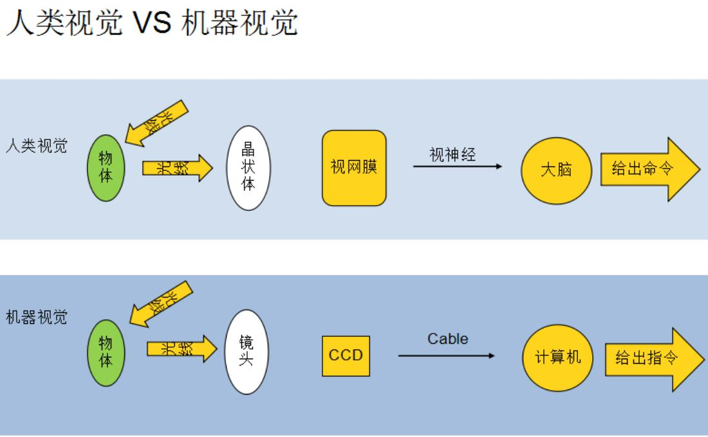

# Cognex 高级笔试题

# 总分(100 分) 姓名 工号

# 一．不定项选择题（每题 2 分，共 20 分）

1.读码器指示灯的含义是（ A ）

A. 1.电源

2.训练状态

3.解码结果显示

4.通信

5.报警

B. 1.训练状态

2.电源

3.解码结果显示

4.通信

5.报警

C. 1.电源

2.解码结果显示

3.训练状态

4.通信

5.报警

D. 1.解码结果显示

2.训练状态

3.电源

4.通信

5.报警

2.下列关于 RMS 的说法正确的是（ BC ）

A、RMS 表示最大误差

B、RMS 越小表示标定结果越好

C、RMS 表示均方根误差

D、RMS 越大表示标定结果越好

3． CogPMAlignTool 中有下列哪些参数（ ABCD ）

A.颗粒度

B. 弹性

C. 缩放

D. 边缘阈值

4．图片保存路径：D:/Cognex/Images/ 软件备份路径 D:/Cognex/Backup 及按要求(B )备份一次。

A.每天

B.每周

C.每半个月

D.每个月

5．在cmd命令行黑色窗口中输入( B ) 会提取到8704E卡的所有信息。

A.cogtool -f

B.cogtool -p

C.cogtool -d

D.cogtool –r

6. 图像训练正确顺序为

（ A ）

A.获取图像 设置训练区域和原点 设置训练参数 训练图像 查看结果  
B.获取图像 训练图像 设置训练参数 查看结果  
C. 获取图像 设置训练参数 设置训练区域和原点 训练图像 查看结果  
D. 获取图像 设置训练区域和原点 训练图像 查看结果

7. 图像保存时为什么最好保存为 BMP 格式 （ D ）

A.文件小

B.快门速度保存在图像文件中

C.转换为 FTP 更容易

D.图像质量不会丢失

8.决定视野的因素主要是 （C）

A.镜头和增益

B.工作距离和增益

C.镜头焦距和工作距离

D.镜头放大倍率和景深

9.下列光圈值中，请问哪个可以得到最大的景深 （ D ）

A.1

B.1.4

C.2.8

D.5.6

10. 以下什么不是 DataMatrix 代码的特征 （B）

A.静区

B.起始符/终止符和校验符

C.查找特征

D. 计时特征

# 二．判断题（每题 2 分，共 10 分）

1.相同参数设置时，图像搜索范围越大，PMAlign 工具运行时间越长。 ( $\cdot$ )

2.调机时，相机聚焦需先把光圈调到最大，聚焦完成后在调回正常光圈是为了使聚焦最好. ( √ )

3.景深是指在焦距固定，图像清晰时，被测物体离相机的前后变化距离，它受镜头上光圈的影响，光圈大景深大。 （ × ）

4.Patmax中的弹性参数只会降低得分中的fiterror的值。 （ × ）

5.Blob工具可以根据对象的大小，形状和位置等进行排序和分类。（ √ ）

6.远心镜头不会产生畸变。（×）  
7. C 型接口的镜头可以匹配 CS 型接口的相机。 （√）  
8. 不同颜色的物料，所对应的打光效果也是不一样的。 ( √ ）  
9. 如果一个图像的效果太暗，我们可以通过调节光圈来进行设置，光圈的大小对于图像的效果的影响不大（×）  
10. 测量金属管表面的商标时，使用同轴光照明效果最佳。（×）

# 三：简答题（60 分）

1：写出或画出人类视觉和机器视觉的对比（15分）

2：相机无法连触发，分析原因并写出解决方法？（写出三点即可）（15 分）

1.确认相机是否连接正确  
2.如果 VisionPro 可用，打开 Cognex GigE Vision Configuration，查看不拍照的相机是否在左侧的相机列表中。

3.确认机构是否发送了正确的触发信号。  
4.可能由于主机卡顿，软件卡顿或BUG引起，将计算机关机，约十秒钟后，重新开启计算机  
5.检查相机是否损坏，如坏的话更换相机。  
6.相机配置参数设置不正确，重新查看并配置好正确参数  
7.权限位丢失，检查8704E板卡权限   
8.磁盘已满或者图片删除设置参数不合理，重新设置图片保存参数

3：简述相机蓝屏可能原因以及应对措施（写出三条即可）（15 分）

$\cdot$ 原因：Cognex Gige Vision Configuration 文件里对应的相机连接异常

措施：检查Gige中相机IP地址、网关、ebus、防火墙、巨帧数据包、速率和电源选项是否正确，不正确则更正

$\textcircled{2}$ 原因：相机没有连接上，网线连接异常

措施：打开网络中心查看，重新插拔网线

$\cdot$ 原因：电源线供电异常

措施：先断24V电源和关闭所有软件2~3分钟，再打开24V电源后，打开Cognex软件后再打开BZ软件

$\textcircled{4}$ 原因：网线、电源线损坏

措施：更换网线、电源线

$\cdot$ 原因：相机损坏

措施：更换相机

$\cdot$ 原因：8704E板卡没有升级

措施：考出cogtool信息，发给Group DRI,反馈升级信息，升级板卡

$\cdot$ 原因：VisionPro占用或程序卡死

措施：关闭 VisionPro,重启程序

$\cdot$ 原因：杀毒软件正在运行

措施：关闭杀毒软件

4：当扫码枪扫码不稳定时，有哪些处理方法？（写出三点即可）（15 分）

$\cdot$ 精调扫码枪  
$\cdot$ 调整光纤位置，优化参数  
$\textcircled{3}$ 增加扫码通道  
$\textcircled{4}$ 调整扫码枪位置