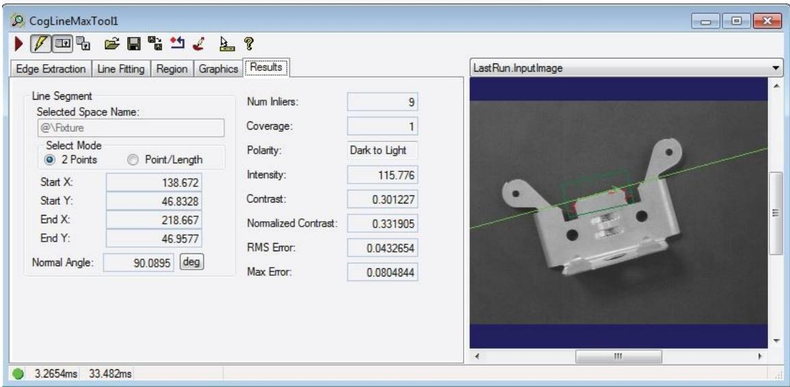
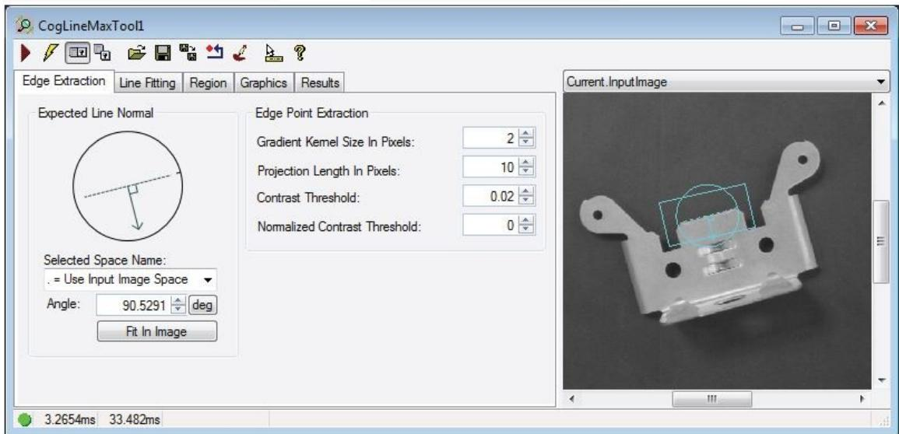
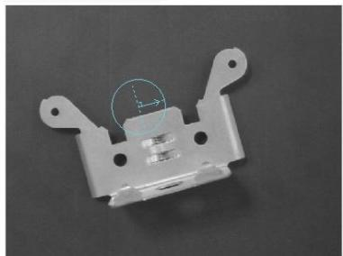
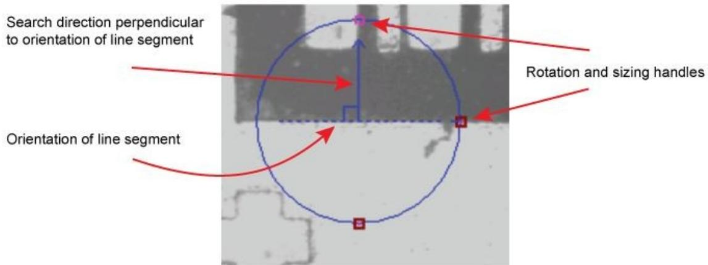
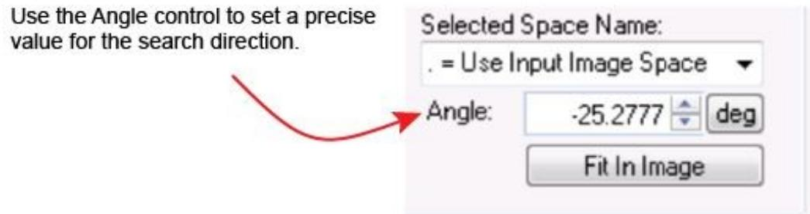
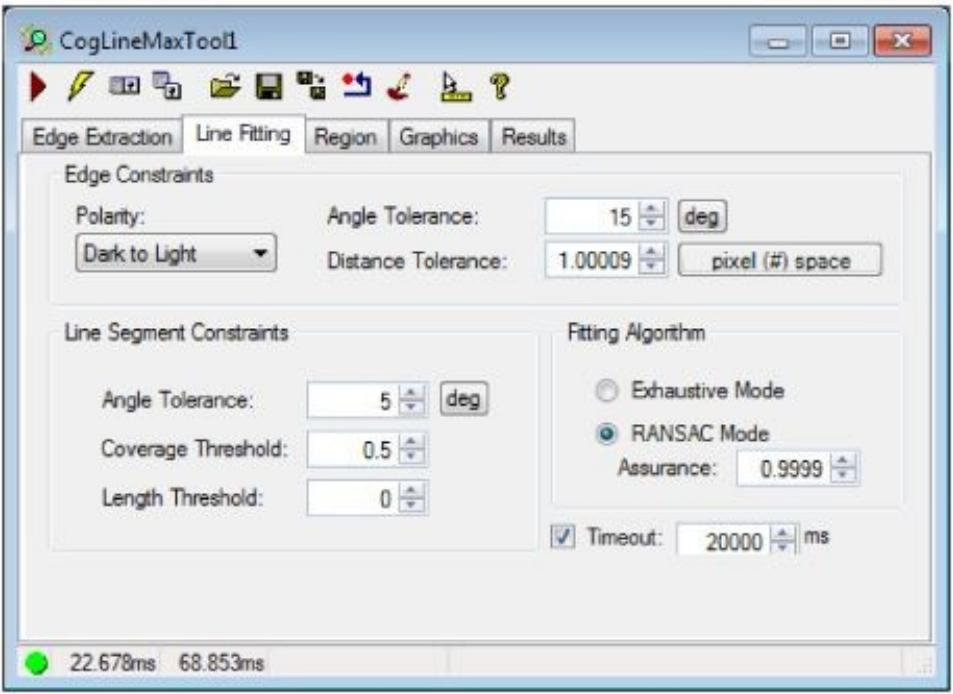
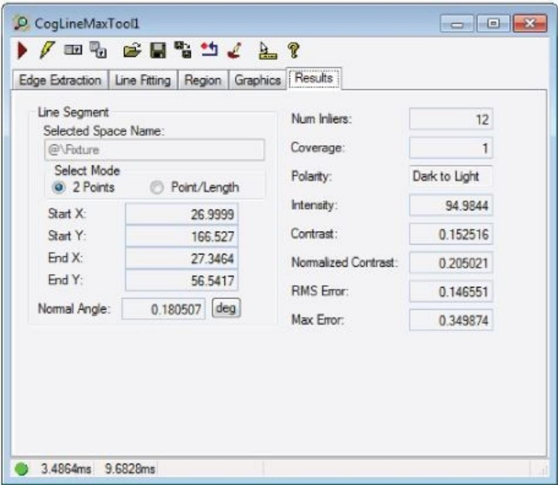

# LineMax 编辑控件

CogLineMaxTool 编辑控件为 CogLineMaxTool 提供了图形用户界面，您可以使用该界面来定位候选边缘点，并根据您指定的条件来拟合可能的最佳线段:

# 1、Edge Extraction Tab（边缘提取选项卡）

使用边缘提取选项卡来配置LineMax工具如何检测候选边缘点:

该选项卡有以下组件:

# 期望线

编辑控件在当前控件上放置交互式图形。InputImage 缓冲区，以帮助您指定您想要查找的线的方向:

注意，这不是用于定位线段的搜索区域，您可以在region选项卡上对其进行配置。

单击图形以启用大小调整和旋转句柄，然后使用它来指定要定位的线段的预期方向和垂直于该线的搜索方向:

当你使用图形时，请注意以下几点:

该图形没有指定一个特定区域来搜索候选边缘点;

默认情况下，该工具在CogRectangleAffine中搜索您指定方向的候选边缘点。使用Region选项卡指定一个有限的区域，以便根据您的视觉应用程序的需要搜索边缘点。

使用夹具工具来补偿搜索区域在连续运行时图像中必须重新定向的方式;

图形没有指定要搜索的边缘点的极性。

注：如果指定的极性在搜索方向上不可用，则该工具将无法找到候选边缘点。

# 边缘点提取

以下参数决定了CogLineMaxTool如何检测输入图像中的边缘点:

Gradient Kernel Size in Pixels（梯度内核大小以像素为单位)：（如果设置为小于 1 或大于64的值，则抛出）

该工具使用这个值来分析运行时图像并生成一组表示边缘信息的梯度向量。

当图像中感兴趣的特征显示出尖锐的边缘时（对比度好），使用一个小的值，在那里，光和暗像素之间的过渡发生在短距离内。增加这个值，以使图像的边缘更平滑。

降低此值以提高精度和检测锐边（对比度好）;增加这个值来模糊锐边并检测渐变边。

每个梯度是从一个正方形区域的图像像素计算。GradientKernelSizeInPixels 值指定正方形区域一侧的像素大小。整个图像是用这种大小的正方形平铺的。例如，值为 1表示梯度场对每个图像像素包含一个梯度;而值为4表示梯度字段每16个像素包含一个

梯度(即 4x4 内核大小)。

注意，GradientKernelSizeInPixels 值可以是小数。例如，3.25 的值表示梯度字段包含每3.25x3.25像素的梯度。将此值应用于13x13(像素)图像，得到4x4梯度场。

为了保持精度，梯度场的每个元素必须从一个精确的正方形物理空间中计算出来。这意味着如果在图像的x轴和y轴上每个物理单元的像素数量不同（每 1mm有多少个像素），那么 GradientKernelSizeInPixels 的值将被不一致地应用。

例如，假设一幅图像在图像x轴上每毫米有4个像素，而在图像y轴上每毫米只有3个像素。如果将 GradientKernelSizeInPixels 设置为 4，那么将使用一个 $4 \times 3$ 的像素矩形来计算每平方毫米物理空间的梯度向量。

换句话说，GradientKernelSizeInPixels 指定了_maximum_内核边长(以像素为单位)。一个图像轴可能需要一个较小的值，以确保内核在物理单位上是正方形的。

进一步的处理是在梯度场，而不是图像像素。因此，像素到梯度场的转换可以显著减少需要处理的数据量。对于较小的 GradientKernelSizeInPixels 值，这将导致更高的精度和更长的执行时间;对于较大的数据库，则会降低准确性和缩短执行时间。

投影步骤对梯度场进行操作:将场中的多个梯度“投影”成单个梯度， 以消除噪声并减少需要考虑的梯度量。在投影过程中，梯度的数量由ProjectionLengthInPixels控制。投影长度小于 GradientKernelSizeInPixels 值没有任何好处(在减少噪声或减少数据方面)。因此，GradientKernelSizeInPixels 是 ProjectionLengthInPixels 的下限。

注 ： 如 果 您 将 GradientKernelSizeInPixels 设 置 为 大 于 当 前 投 影 长 度 值 的 值 ，ProjectionLengthInPixels 将自动设置为更大的值。同样，将 ProjectionLengthInPixels设 置 为 比 当 前 GradientKernelSizeInPixels 值 更 小 的 值 ， 将 自 动 将GradientKernelSizeInPixels 更新为这个更小的值。

# Projection Length in Pixels（像素投影长度）

这个值决定了用于梯度场投影的面积。小值允许工具以比大值更细的粒度分析图像，但是执行该工具可能需要更多的时间。较大的值可以提高工具的执行速度，但可能无法检测到您希望工具定位的边缘。

一般情况下，使用一个至少与您设置的梯度内核大小(以像素为单位)一样大的值，但是如果工具继续定位所需的边缘点，则可以将其设置得更高。

# ProjectionLength

降低此值以提高准确性和保真度;增加此值以平滑短边并填充长边中的空白。

如果每个物理单元的像素数沿图像的x轴和y轴不同，则将不均匀地应用

ProjectionLengthInPixels值。在这些情况下，“像素”单元是沿轴上的一个像素，每个物理单元具有更多的像素，而沿另一个轴上的像素少于一个像素。有关更多信息，请参见 GradientKernelSizeInPixels。

对比度阈值和归一化的对比度阈值约束应用于投影结果，而不是图像像素或梯度场梯度。因此，最终提取出的边缘点的数量减少了一个投影长度的因子。对于较小的值，这将导致更高的精度和更长的执行时间;对于更大的值，精确度更低，执行时间更短。

GradientKernelSizeInPixels 值作为 ProjectionLengthInPixels 的下限。将

ProjectionLengthInPixels 设置为一个比当前 GradientKernelSizeInPixels 值更小的值，

会自动将 GradientKernelSizeInPixels 更新为这个更小的值。同样，将

GradientKernelSizeInPixels 设置为比当前 ProjectionLengthInPixels 值更大的值将自动将 ProjectionLengthInPixels 设置为更大的值。

# Contrast Threshold

为要定位的特性的候选边缘指定边缘的最小对比度。增加这个值来定位强烈对比的边缘（对比度好），忽略那些光和暗像素之间的过渡不明显的边缘，或者当你想在图像中定位的边缘的对比度很小时，降低这个值。

边缘的对比度是在0到255范围内的平均像素值的绝对差异。只有对比度大于您指定的值的边缘才会被工具考虑。例如，将此值设置为10会拒绝对比度低于10像素值的边缘点。

标准化对比度是相对强度差异的度量，对比度是绝对强度差异的度量 有关在标准化 对比度测量上应用约束的信息，请参阅标准化对比度阈值。

对比度测量的计算方法为:

$$
\operatorname {s q r t} \left(g _ {x} ^ {2} + g _ {y} ^ {2}\right)
$$

其中gx为输入图像所选空间x轴方向的梯度对比度;gy是y轴方向的对比度。请注意，边缘点的梯度大小是边缘点的对比度度量。

# Normalized Contrast Threshold（标准化化对比阈值）

提高此参数的值以在图像的亮区中丢弃假边缘点。注意，将它设置为1会丢弃所有的边缘点，使得工具实际上没有功能。

对比度阈值是测量绝对强度差异的方法， 而标准化化对比度对比是测量相对强度差异的方法。 它测量相对于局部像素强度的对比度。这对于抑制明亮区域的噪声梯度很有用。当明亮区域的噪声梯度满足阈值约束时，其归一化对比仍可能低于正态化阈值约束。如果是这样，将不会为这些有噪声的梯度创建边缘点。

例如，对比度为50和强度为100的梯度的归一化对比度为 $5 0 / 1 0 0 { = } 0 . 5$ ;而对比度为50和强度为200的梯度的归一化对比度为 $5 0 / 2 0 0 { = } 0 . 2 5$ 。在这种情况下，一个归一化的对比度阈值0.3将在较暗区域创建一个边缘点(归一化对比度 $= 0 . 5 )$ )，而不是在有噪声的较亮区域创建一个边缘点(归一化对比度 $= 0 . 2 5$ )。

归一化对比度测量使用:

其中g为梯度幅值;Iavg是梯度处的平均像素强度。

# 2、Line Fitting Tab（线拟合选项卡）

使用Line Fitting选项卡来配置工具如何从候选边缘点定位行:

# Edge Constraints（边缘约束）

Polarity

# Angle Tolerance（角度公差）

最大允许的角度差之间的边缘点梯度方向，然后法线到拟合线。 增加这个值允许工具考虑更多的边缘点作为输入，改变找到线段的位置。

注：当分配的值小于0或大于π/2时抛出；

为了获得更好的图像质量和更清晰的边缘，较小的边缘亮度有助于增强线条查找的鲁棒性。在噪声较大的情况下，期望直线上的边缘点可能具有噪声梯度方向，因此建议采用较大的边缘亮度。

# Distance Tolerance（距离公差）（大于 0）

进线器与拟合线之间的最大允许距离。 当你增加边缘距离公差时，你允许工具考虑更多的边缘点作为输入，并改变找到的线的位置。

应适当调整距离，使之包括足够数量的输入，并排除附近边缘的干扰边缘点。

注：当存在相邻线时，应将该参数设置为相邻线之间距离的一半以下。

# Line Segment Constraints（线段约束）

# Angle Tolerance

找到的线段的旋转量可能与您指定的预期角度不同。

一个较低的值迫使工具定位更平行于梯度搜索方向的线段。

如果经过RANSAC迭代和细化后的候选线不满足线角约束，则应用迭代剪枝步骤。每次剪枝迭代都试图删除一个最外面的输入点，在找到的线段两端的两个最外面的输入点之间进行选择:

如果两个最外面的inliers中的一个，一旦被删除，唯一的结果是找到满足

LineAngleTolerance 约束的行，那么这个最外面的 inliers 将被删除，修剪迭代将终止；

如果删除了最外面的 inliers，两个结果都得到满足 LineAngleTolerance 约束的结果，则删除发现线段起始端最外面的inlier，并终止修剪迭代；

如果两个最外面的inliers中没有一个被删除，那么一旦删除，就会得到满足

LineAngleTolerance 约束的结果，两个最外面的 inliers 都会被删除，然后继续进行修剪迭代。

在实践中，基于lineangletolerance的剪枝循环会一直持续下去，直到被剪枝的行结果满足线角度约束，或者直到剩余的inliers数量小于2，且没有找到有效的行结果。

在对LineAngleTolerance进行修剪之后，将从剩余的inliers重新计算更新后的行。边缘点子集将与更新的行模型进行比较，以获得更新的输入点列表，并对边缘点运行进行重新编码。基于更新后的线段模型，也将更新输入点/离群点子集，以丢弃更新后线段跨度之外的点。然后根据CoverageThreshold约束检查更新后的行结果，以确定是否需要再次修剪覆盖率。

如果发现的线角仍然不满足 LineAngleTolerance 约束条件，那么只剩下两个 inliers，则认为没有找到当前候选的线，所有相关的inliers都被放入考虑过的outliers集合中;使用更新的考虑异常值集合的行查找简历。

注：较大的 lineangletolererance 意味着所发现的 line 被允许偏离预期的 linenormal 更多，而较小的lineangletolererance意味着偏差被允许更少。当寻找彼此严格平行的线时，建议使用较小的LineAngleTolerance。在同一时间寻找不同方向的线条时，建议使用较大的 LineAngleTolerance。

最小可接受的边缘特征数与最大可能的边缘特征数之比，或沿线段边缘特征的最小比例。 例如，指定值0.5允许工具定位线段，即使没有检测到超过 $5 0 \%$ 的线的边缘点。请注意，指定值为1.0将强制工具仅在没有发现inliers的间隙时定位线段。使用此属性可忽略线中的小间隙或合并共线线。

值为0.5表示允许沿 $5 0 \%$ 的直线出现间隙和未检测到边缘的跨度。而1.0意味着只找到没有空白的行。

由于每个投影区域只允许一个输入点，因此最大可能的输入点数目由找到的线段所相交的投影区域数目来定义。也就是说，最大inliers是在找到的线段的总跨度下的投影区域的数量。覆盖阈值尊重掩模;因此，只有边缘点和“care”区域中的投影区域影响覆盖率测量。

在RANSAC迭代和细化之后，如果候选行不满足覆盖率阈值，则应用迭代修剪步骤。投影区域的跨下的候选人被分组到(连续投影的地区内围层编码为1的运行,没有窗和连续投影区域编码为0)的运行。每个修剪迭代试图移除一个一分,选择两个1-runs发现线段的两端:

如果两个1次运行中的一个，一旦被删除，唯一地将覆盖率分数增加到CoverageThreshold以上，那么这个1次运行就会被删除，修剪迭代就会终止。

如果这两个1次运行，一旦删除，都将覆盖率分数增加到CoverageThreshold以上，那么较短的1次运行将被删除，修剪迭代将被终止。

如果这两个1次运行中没有一个被移除，那么一旦将覆盖率分数增加到CoverageThreshold以上，那么导致更高覆盖率分数的1次运行将被移除，并且修剪迭代将继续进行。

例如，考虑一个有10个投影区域的候选行，它们有三个独立的1-run: 1000010011(其中1表示一个有一个输入的投影区域，0表示一个没有输入的投影区域)。其初始覆盖率评分为 $\left( 1 + 1 + 2 \right) / 1 0 = 4 / 1 0 = 0 . 4$ 。如果覆盖率阈值设置为0.5，那么将在候选行上执行修剪。第一个剪枝迭代检查左端和右端的1个运行(注意，找到的线段的两端应该总是带有inliers的投影区域，即。1):

如果删除左边的 1-run，这行代码就变成 10011，覆盖率分数就变成 $( 1 + 2 ) / 5 = 3 / 5 =$ 0.6。

如果删除右边的 1-run，那么这一行就变成了 100001，覆盖率分数变成了 $( 1 + 1 ) / 6 =$ 2 $\ Q \ / \ 6 = 0 . 3 3 3 _ { \circ }$ 。

将CoverageThreshold设置为0.5，将删除左边的1个运行，并返回相应的修剪后的行，覆盖率评分为0.6。在实践中，基于CoverageThreshold的剪枝循环会一直持续，直到被剪枝的行结果满足CoverageThreshold约束，或者直到剩余的inliers的数量少于2，并且没有找到有效的行结果。

退出基于coveragethreshold的修剪循环后，将从剩余的输入重新计算更新的行模型。边缘点子集将与更新的行模型进行比较，以获得更新的输入点列表，并对边缘点运行进行重新编码。基于更新后的线段模型，也将更新输入点/离群点子集，以丢弃更新后线段跨度之外的点。然后根据LineAngleTolerance约束检查更新后的行结果，以确定是否需要对 LineAngleTolerance 进行修剪。

如果去掉所有1分后覆盖率分数仍然低于覆盖率阈值，则认为没有找到任何一条线，所有相关的inliers都被视为离群值;然后，使用更新的考虑异常值集合行查找简历。

较大的覆盖阈值导致在其跨度下有更多的内线，即。，更多的“实线”。由于为了满足覆盖度阈值的要求而进行的内部修剪，所发现的线条可能会显得更短。一个更小的覆盖率阈值允许在其跨度下有更少的输入线。所找到的行可能看起来较长，但有时可能是不需要的行，包含很少的输入(例如，只有2或3个输入)。建议用户同时调整覆盖率阈值和纵向阈值，以满足寻线要求。

# Length Threshold

设置找到的线段的最小可接受长度。

# Fitting Algorithm（拟合算法）

选择以下任一种算法来将边缘点拟合到直线上:

# Exhaustive Mode（穷举模式）

对所有的边缘点组合进行直线拟合

穷举模式可以确保每一行都被考虑在内，但是对于大多数应用程序来说，这种模式通常太慢了。通常，您将使用RANSAC模式，并使用保证值在速度和彻彻性之间进行权衡。

# RANSAC Mode （随机抽样）

随机抽样拟合边缘点的算法

保证值将影响为线拟合选择最佳边缘点的可能性

择一个超时值来指定允许的最大执行时间(msec)，以定位请求的线段数量。如果工具在超时时间结束之前没有完成，它将停止并抛出异常。

# 3、Results Tab

该工具返回关于找到的线段的以下信息:

(x,y)的位置，在选定空间的坐标中，表示拟合线段的起点和终点，包括其正交角inliers 的数量(inliers)和 inliers(覆盖率)占这条线段的比例

其极性(极性)、强度(强度)和对比度(对比度)

相对于输入图像的选定空间，来自输入输入的残差 RMS 拟合误差(RMSError)报告最远输入点到线路的距离的 MaxError。