# 本主题包含以下部分:

+

复制区域工具允许您执行一个单一的图像或两个单独的图像上的复制操作:

将输入图像的一部分复制到新的输出图像。

将输入映像的一部分复制到现有的目标映像。

用恒定的灰度值或颜色值填充输入图像的一部分。

此外，您可以使用复制区域工具创建一个蒙版图像，以便与其他视觉工具一起使用。

复制区域工具接受所有支持的图像类型，包括16位编码图像，允许您使用和生成位深度为8位、10位、12位、14位和16位的图像。

# 一、 Region Copy

视觉应用程序可能只对输入图像的一部分感兴趣。这样的应用程序可以使用复制区域工具将输入图像的某些已定义区域复制到输出图像中，然后使输出图像可供其他工具分析。输入区域周围的边界框决定了输出图像的大小。例如，如下图所示为输入图像的定义区域和复制区域工具生成的输出图像:

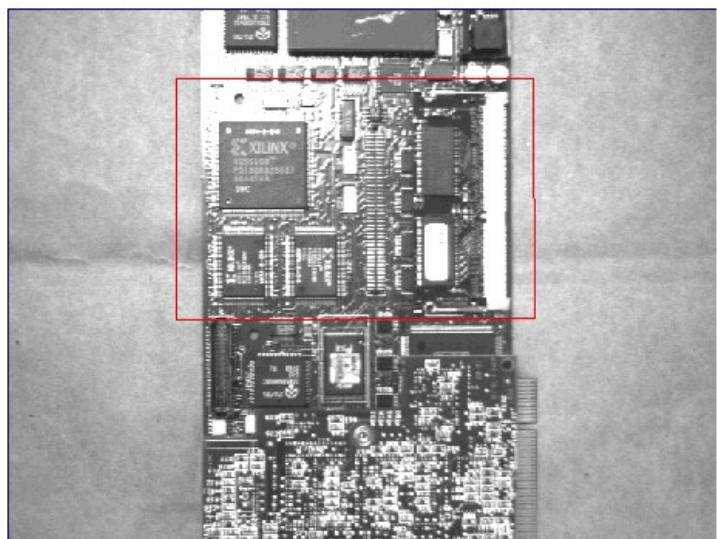  
Input Image

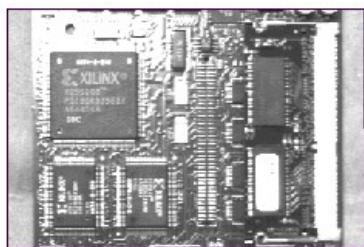  
Output Image

该工具执行逐像素复制操作，没有缩放变化和旋转。

# 二、 Region Shapes and the Bounding Box（区域形状和边界框）

在选择要复制的输入图像的部分时，可以从各种区域形状中进行选择。默认情况下该工具使用一个矩形区域，并为您提供一个图形来更改该区域在输入图像中的位置和大小。如果需要，可以选择为该区域使用其他形状，如圆、椭圆、多边形等。

Valid region shapes

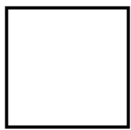

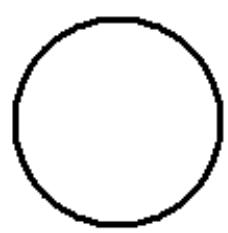

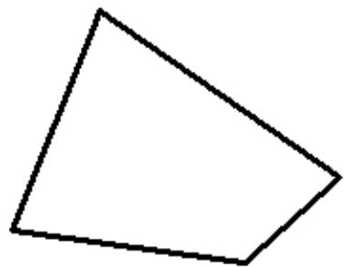

无论您使用哪种区域形状，复制区域工具都用一个边界框包围该区域，它决定输出图像的总体大小。下图显示了与上图相同的区域，每个区域都有一个边框:

Regions with bounding boxes

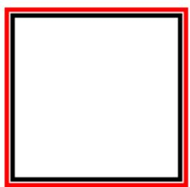

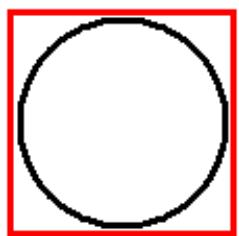

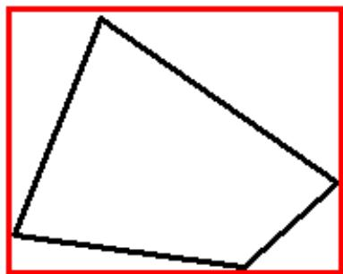

# 三、 Bounding Box with Adjust Mask（边界框调整面具）

默认情况下，该工具使用带有调整蒙版的边框，这意味着在输入区域之外但在框内的像素可以用常量值填充，也可以不初始化。例如，如下图所示为圆形输入区域周围的外接矩形和输出图像，该区域外部像素的灰度值为200:

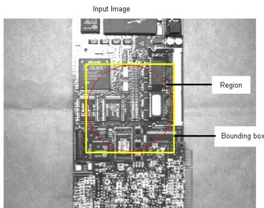

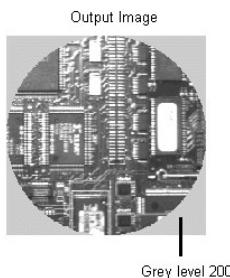

第二个选项是保持像素未初始化。这种复制操作的执行速度要快于区域外的像素被恒定的灰色或颜色值填充的操作，并且当应用程序只检查输入区域内的像素时可以安全地使用。在将输入区域复制到现有图像时，选择不填充这些像素具有更大的意义，本主题稍后将对此进行描述。

# 四、 Pixel Aligned Bounding Box（像素边界框保持一致）

你也可以选择使用像素对齐的边界框，没有调整蒙版。那么，不管输入区域的形状如何，输出图像都包含了边框内的所有像素，如下图所示:

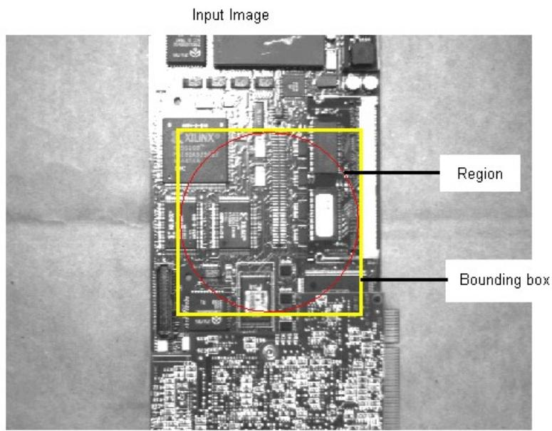

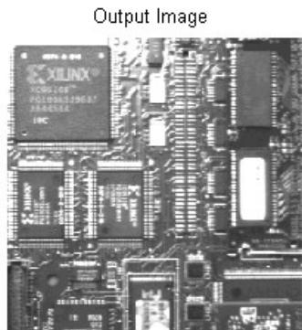

# 五、 Greyscale and Color Images（灰度和彩色图像）

复制区域工具支持灰度和彩色图像。灰度图像支持 0到255的像素范围，而彩色图像可以提供RGB(红色，绿色，蓝色)或HSI(色调，饱和度，强度)格式。

输入图像的格式决定了是否可以将填充值指定为灰度或颜色。如果您使用彩色图像，复制区域工具提供三个窗格的颜色值供您指定。如果彩色图像为 RGB格式，则平面分别为红、绿、蓝。同样，如果彩色图像是 HSI格式的，平面对应于色相、饱和度和强度的设置。

# 六、 Image Merging（图形合并）

可使用复制区域工具将输入图像的输入区域复制到现有的目标图像中，生成表示两者组合的新输出图像。例如，定义输入区域后的输入图像，AcqFIFO工具的目标图像，以及复制区域工具将输入区域的像素复制到目标图像后的输出图像:

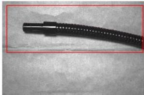  
Input Region in Input Image

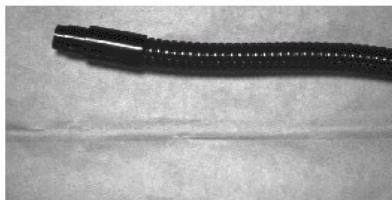  
Destination Image

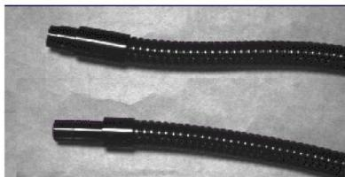  
Image Produced by Copy Region tool

作为复制操作的结果，复制区域工具不仅产生一个新的输出图像，而且还修改提供的目标图像的内容。在上一个示例中，AcqFIFO工具生成的输出图像现在包含与复制区域工具生成的输出图像相同的内容。

# 七、 Clipping（裁剪）

如果您定位输入区域在输入图像的边界之外，或者目标区域在目标图像的边界之外，复制区域工具将剪辑它所复制的输入图像的部分。例如，下图显示了工具如何剪辑它复制到目标图像的部分，因为输入区域部分位于输入图像的边界之外:

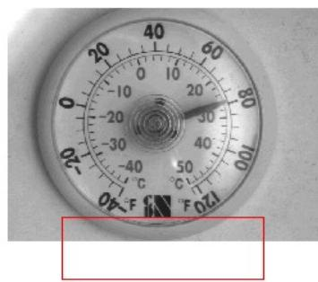  
Input Image with Input Region

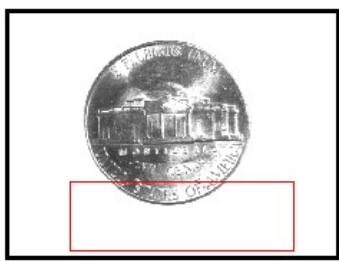  
Destination Image with Input Region

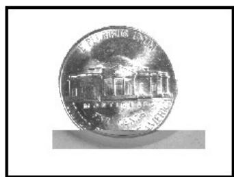  
Output Image

同样，该工具忽略目标图像边界以外的输入区域，如下例所示:

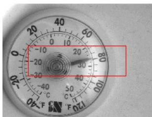  
Input Image with Input Region

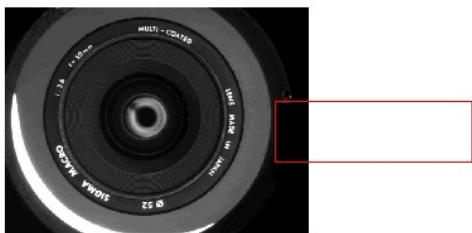  
Destination Image with Input Region

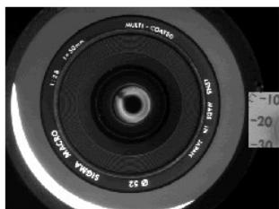  
Output Image

如果选择将输入区域周围的边界框填充为恒定的灰色或颜色值，工具将填充输入图像和目标图像共同的边界框部分，如下例所示:

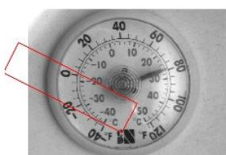  
Input Image with Input Region

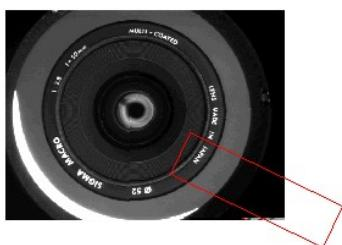  
Destination Image with Input Region

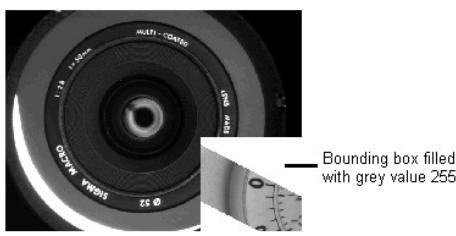  
Output Image

# 八、 Image Alignment（图像队列）

默认情况下，复制区域工具将输入图像的输入区域复制到目标图像的左上角，如下图所

示:

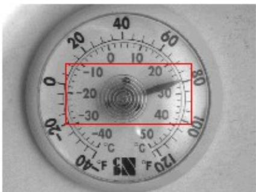  
Input Image with Input Region

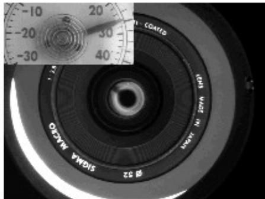  
Output Image

将输入区域的内容复制到目标图像的大多数应用程序都需要为复制操作定义对齐方式。

通过启用对齐，您可以精确地控制工具在目标图像中复制输入区域的位置，因为该工

具

允许您定义图像坐标，该工具将使用该坐标在复制操作之前对齐输入图像和目标图像。

例如，如果在输入图像中定义坐标(0,0)和目标图像中定义坐标(150,150)，该工具将在

生成输出图像之前将输入图像的点(0,0)与目标图像的点(150,150)对齐。

例如，下图显示了一个输入区域位于原点的输入图像。该工具已配置为对输入图像使

用

(0,0)对齐，对目标图像使用(150,150)对齐，因此输出图像包含从输入区域复制的从坐

标(150,150)开始的像素。已为输出图像启用了标记图像对齐的点。

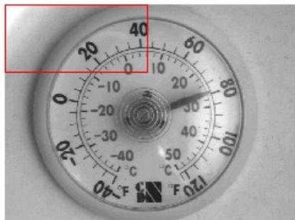  
Input Image with Input Region

Output Image   
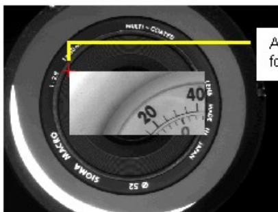  
Alignmentat (150,150)   
orthedestination image

# 九、 Mask Creation

复制区域工具也可以用来创建与其他视觉工具(如斑点画笔工具)一起使用的蒙版图像。

与从输入图像复制像素值不同，该工具可以使用输入区域的尺寸用恒定的灰度值填充

输出图像。使用灰度值 255，将默认边框外的像素填充为 0，生成如下示例所示的输

出图像:

Output Image

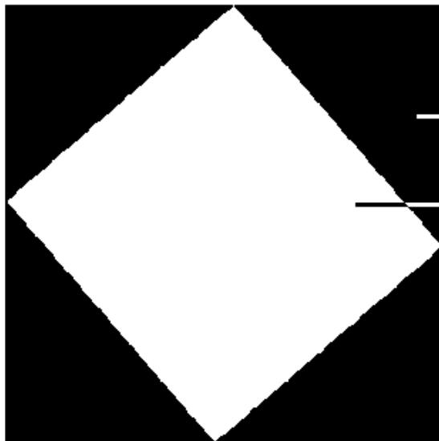

Pixels within bounding box filled with grey value 0

Pixels of input region filled with grey value 255