# DS1000 系列传感器 图像采集

# 法律声明

本文档中所述软件经许可提供，本软件仅可在许可条款以及本页中所述版权公告范围内使用或复制。除许可持有人外，不得向任何人提供本软件、本文档或其任何副本。Cognex Corporation 或其许可颁发者保留本软件的产权和所有权。CognexCorporation 不承担在非 Cognex Corporation 提供的设备上使用本软件或其可靠性的责任。Cognex Corporation 就有关本软件的适销性、非侵权或其对于任何特殊用途的适应性不做任何明确或隐含担保。

本文档中的信息有可能未经通知而更改，Cognex Corporation 对此不承担责任。对于本文档或相关软件中可能出现的错误，Cognex Corporation 不承担责任。

除非另行说明，否则本文档示例中使用的公司、名称及数据均为虚构。未经 Cognex Corporation 书面许可，不能出于任何目的，以任何形式或任何(电子或机械)方式复制或传播本文档的任何部分，也不能将其转换为任何其它媒介或语言。

Copyright © 2015. Cognex Corporation. 保留所有权利。

Cognex 所提供硬件和软件的各部分可能受下面所列的一项或多项美国和外国专利以及正在申请的美国和外国专利保护。有关详情，请查询 Cognex 网站：http://www.cognex.com/patents。

以下为 Cognex Corporation 注册商标：

Cognex, 2DMAX, Advantage, Alignplus, Assemblyplus, Check it with Checker, Checker, Cognex Vision for Industry, Cognex VSOC, CVL, DataMan, DisplayInspect, DVT, EasyBuilder, Hotbars, IDMax, In-Sight, Laser Killer, MVS-8000, OmniView, PatFind, PatFlex, PatInspect, PatMax, PatQuick, SensorView, SmartView, SmartAdvisor, SmartLearn, UltraLight, Vision Solutions, VisionPro, VisionView

以下为 Cognex Corporation 商标：

The Cognex logo, 1DMax, 3D-Locate, 3DMax, BGAII, CheckPoint, Cognex VSoC, CVC-1000, FFD, iLearn, In-Sight (design insignia with cross-hairs), In-Sight 2000, InspectEdge, Inspection Designer, MVS, NotchMax, OCRMax, ProofRead, SmartSync, ProfilePlus, SmartDisplay, SmartSystem, SMD4, VisiFlex, Xpand

本文档中列出的其它产品和公司商标为其相应所有者的商标。

# 目录

# 法律声明 2

# 目录 3

# DS1000 系列传感器图像采集 - VisionPro 8.2 5

采集设置步骤 6

1. 安装、连线以及接通传感器的电源 6  
2. 配置 PC 和视觉系统之间的连接 6  
3. 初始化采集 7  
4. 设置采集时间和传输参数 8  
5. 设置低级采集控制参数 9  
6. 设置闪光灯和触发器参数 13   
7. 将图像类型设置为采集深度图像 16   
8. 设置线扫描参数 17   
9. 设置深度图像属性 21   
10. 设置坐标空间(可选) 24

图像采集参数优化 25

优化采集速度 25  
优化 Z 轴分辨率 30  
优化 Y 轴分辨率 31  
优化 X 轴分辨率 32  
在长宽比保持不变的情况下根据具体的分辨率需求来设置图像采集参数 33

支持 DS1000 系列传感器的相机功能 34

# DS1000 系列传感器图像采集 - VisionPro 8.4 36

使用入门 36

采集设置概述 36   
位移传感器采集向导 37  
快速采集设置 41

从 DS1000 系列传感器采集图像 47

采集设置步骤 48   
配置初始采集设置 48

1. 安装、连线以及接通传感器的电源 48  
2. 配置计算机和传感器之间的连接 48  
3. 初始化采集 48  
4. 设置采集时间和传输参数 49  
5. 设置闪光灯和触发器参数 50

通过使用位移传感器采集向导来完成 DS1000 采集设置： 54

6. 在相机设置选项卡中设置低级采集控制参数 55  
7. 在移动设置选项卡中设置移动采集参数 59  
8. 在深度图像选项卡中设置深度图像属性 64  
9. 在高级选项卡中设置高级参数 69  
10. 设置坐标空间（可选） 70   
11. 关闭采集向导然后开始采集深度图像 70

图像采集参数优化 71

优化采集速度 71   
优化 Z 轴分辨率 75  
优化 Y 轴分辨率 76  
优化 X 轴分辨率 77

在长宽比保持不变的情况下根据具体的分辨率需求来设置图像采集参数 78支持 DS1000 系列传感器的相机功能 79

# DS1000 系列传感器图像采集 - VisionPro 8.2

该章节介绍了在 VisionPro 8.2 中用 DS1000 系列传感器来采集深度图像(描述三维物体高度轮廓)的步骤。在按照以下步骤设置传感器之后，你就可以像使用其它任何通用相机一样开始采集图像。深度图像行(或线)会基于采集到的亮度图像而生成。

你可以通过设置 DS1000 系列传感器的采集参数以达到一定的操作效果(例如，更改采集速度或按照特定的分辨率来采集)。在采集设置过程中，你必须对以下参数类型进行设置：

l 低级别采集控制参数，该类型参数可以被用来控制在 DS1000 系列传感器上 GigE 相机的 CMOS 图像传感器属性。

这些参数包括曝光、对比度、Z 轴探测基准和高度、Z 轴探测取样以及探测灵敏度设置。

l 深度图像属性，该属性可以被用来控制所生成的深度图像的特性。

这些参数包括原点、比例以及图像宽和高的设置。

l 线扫描参数，该类型参数可以被用来追踪物体在通过传感器工作区域时的运动轨迹。

这些参数包括编码器设置和运动方向设置。

l 闪光灯和触发设置，该设置可以被用来控制激光和触发行为。

该参数包括激光模式和触发模式。

l 时间和传输参数。

这些参数包括采集超时、传输超时、传输数据包大小以及延迟级别。

首先，你需要设置初始深度图像采集。

接着，为使传感器达到一定的操作效果，你可能需要对一些参数进行调整。例如，降低采集速度以得到更高的分辨率等。这些都可以通过协调各参数而达到。

以下部分介绍了为 DS1000 系列传感器设置初始深度图像采集的步骤、 为达到一定操作效果而进行的参数优化以及部分相机支持功能的摘要。

# 采集设置步骤

执行以下步骤为 DS1000 系列传感器进行采集设置：

1. 安装、连线以及接通传感器的电源(位于第 6 页)  
2. 配置 PC 和视觉系统之间的连接(位于第 6 页)  
3. 初始化采集(位于第 7 页)  
4. 设置采集时间和传输参数(位于第 8 页)  
5. 设置低级采集控制参数(位于第 9 页)  
6. 设置闪光灯和触发器参数(位于第 13 页)  
7. 将图像类型设置为采集深度图像(位于第 16 页)  
8. 设置线扫描参数(位于第 17 页)  
9. 设置深度图像属性(位于第 21 页)  
10. 设置坐标空间(可选)(位于第 24 页)

# 1. 安装、连线以及接通传感器的电源

根据在 DS1000 快速参考指南中的介绍来安装、连线并接通传感器的电源。

# 2. 配置 PC 和视觉系统之间的连接

DS1000 系列传感器有一个用来观察通过工作区域物体的 GigE 相机。在连接并接通传感器的电源后，可以通过使用“GigE视觉配置工具”在网络上将传感器作为通用 GigE 相机来进行配置。在开始菜单中，选择所有程序->Cognex->VisionPro->实用工具->GigE 视觉配置工具来启动工具。配置网络接口卡(NIC)和相机的 IP 地址。

# 3. 初始化采集

有三个方法可以用来初始化 DS1000 系列传感器：在 QuickBuild 图像源，通过编程或使用 CogAcqFifoTool 和CogAcqFifoEditV2 控件。你可以在 Windows 窗体应用程序中使用 CogAcqFifoEditV2 控件。

如果使用 API，在调用 CogFrameGrabberGigE.CreateAcqFifo 时，你必须指定一个特定视频格式，如下所示：

Fg.CreateAcqFifo(“Cognex NullFormat“, CogAcqFifoPixelFormatConstants.Format8Grey,0,true)

如果使用 QuickBuild，选择 DS1000 系列传感器作为图像来源，并在“设置”选项卡中点击“初始化采集”。

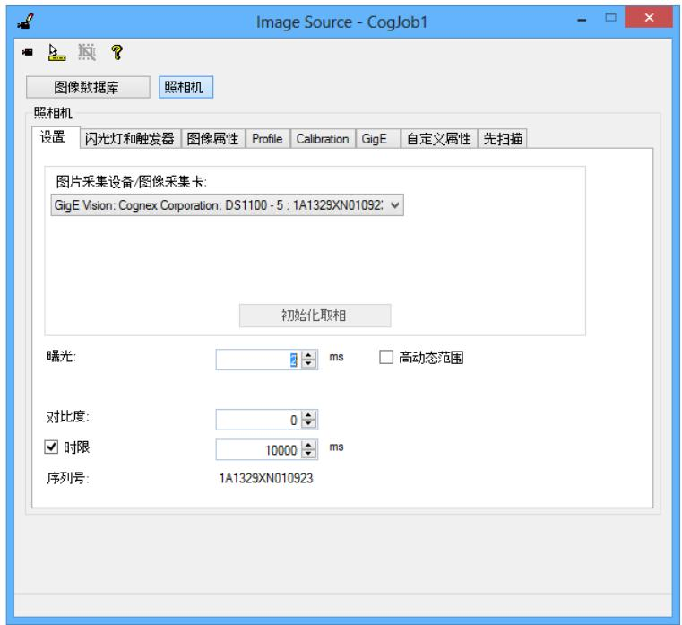

点击之后，会列出使用 QuickBuild 图像源进行采集设置的更多步骤。

# 4. 设置采集时间和传输参数

在“设置”选项卡中，你可以启用并设置采集 Timeout 时间。在调整超时时间时，需要知道深度图像的行数以及采集一行所需的时间。这些因素对于采集一张深度图像所需的时间会有很大影响。在进行初次采集设置时， Cognex 建议你禁用超时设置，或设置一个非常大、不可能达到的超时时间值。

在 GigE 选项卡中，你可以指定传输超时时间 (TransportTimeout) 以确定相机发送图像所需的最大时间值。在进行初次采集设置时， Cognex 建议你使用该参数的默认设置 $( 2 0 0 0 ~ \mathrm { ~ m s } )$ )。你也可以指定 GigE 视觉性能驱动程序的延迟级别(LatencyLevel) 参数，默认值为 3。该值允许低 CPU 负载，但会增长延时并降低可靠性。如果将该值设置为 0，可以减少延时并增加采集的可靠性，但需要使用更多的 CPU。

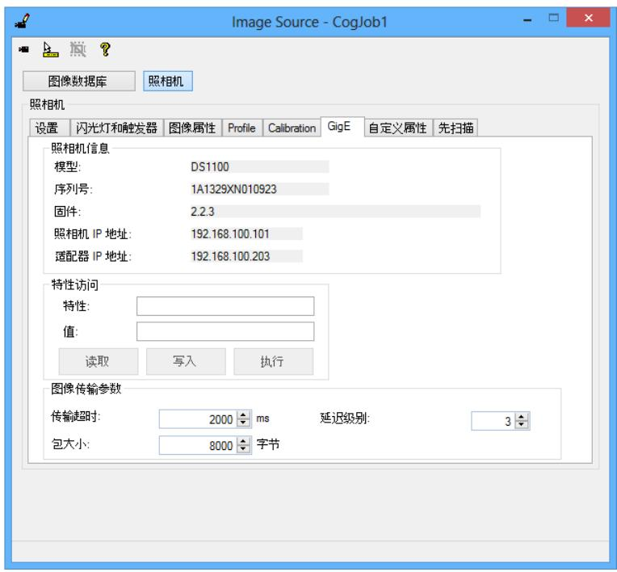

# 5. 设置低级采集控制参数

低级采集控制参数可以被用来控制 DS1000 系列传感器内的 GigE 相机的 CMOS 图像传感器属性。这些参数的默认设置适用于初次采集设置以及大部分的图像采集情况。

# 设置曝光、高动态范围以及对比度

在“设置”选项卡中，你可以设置相机的“曝光” (Exposure)时间(以 ms 为单位)。 曝光时间越长，相机收集到的检测时从部件表面反射回的激光扫描线信息越多，因此经常被用于反射不强的表面(例如深暗的表面)。

使用采集到的亮度图像(“图像属性”选项卡->亮度图像 CameraMode)来设置曝光时间的建议：

l 如果可能，避免将曝光时间设置到过度饱和。  
l 争取将激光扫描线的像素值控制在 40 到 245 之间的范围。  
l 如果可能，将曝光时间设置到尽量短以减少或避免杂散反射。

一般来说，曝光时间的设置应使得在带图形的亮度图像中的激光扫描线比软件画出的红线略窄一些(该红线显示软件所检测到的激光扫描线的位置)。你可以通过在“图像属性”选项卡中设置带图形的亮度图像相机模式 (IntensityWithGraphicsCameraMode) 来采集一个带图形的亮度图像。(有关亮度图像的详情可参见以下图例)。

理想曝光时间：

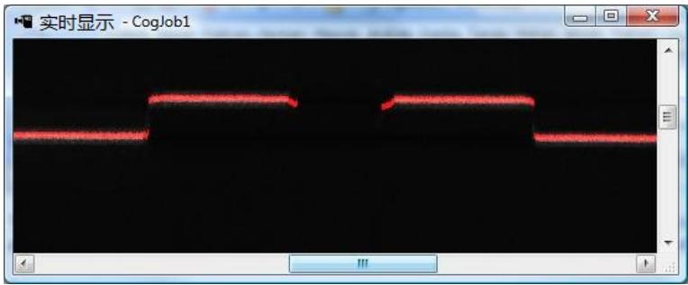

曝光略微过度：

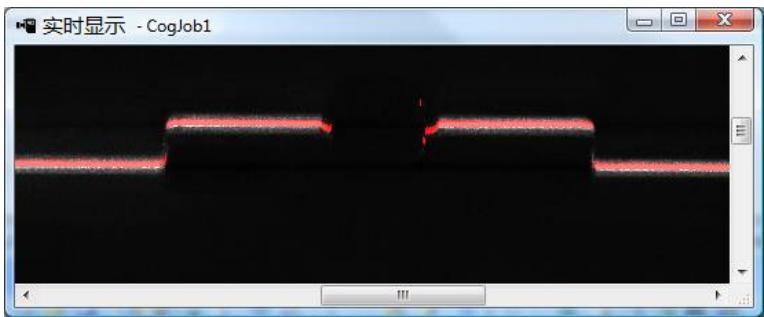

过度曝光：

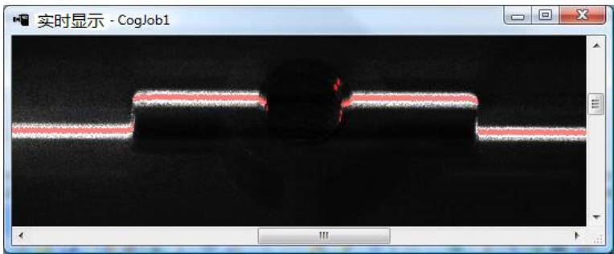

曝光时间过长可能会降低最高线扫描速率。

你可以启用高动态范围 (HighDynamicRange) 以使用多次曝光来提高动态范围。这在激光扫描线需要同时扫描黑暗或高反射区域的时候非常有用。启用高动态范围 (HighDynamicRange) 会降低最高线扫描速率。

同时，你也可以设置相机的对比度(Contrast)。

为每个检测区域设置 $^ { \prime \prime } Z$ 轴探测基准和高度”以及 $^ { \prime \prime } Z$ 轴探测取样”、设置“激光探测模式”以及“探测灵敏度”

在 Profile 选项卡中设置 Z 轴探测参数。

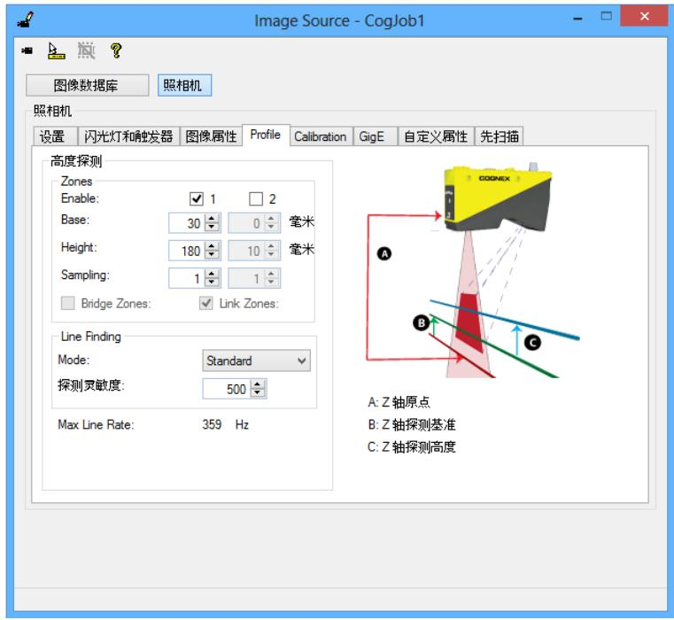

默认情况下，“区 1”是会被检测的高度范围(以 mm 为单位)；通过设置 Z 轴探测基准 (ZDetectionBase) 和 Z 轴探测高度 (ZDetectionHeight) 来规定高度范围。这个高度范围和“工作区域”的交汇处为“工作关注区域”。

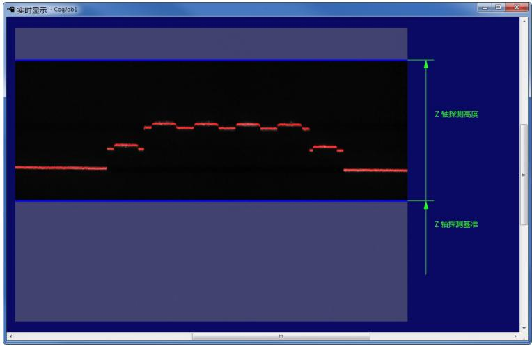

注意，以上图像显示的是在相机中看到的带图形的亮度图像的 Z 轴探测基准 (ZDetectionBase) 和 Z 轴探测高度(ZDetectionHeight) 高度。如果降低 Z 轴探测基准 (ZDetectionBase) 并保持 Z 轴探测高度 (ZDetectionHeight)，那么在 Z 轴探测高度 (ZDetectionHeight) 中指定的区域在带图形的亮度图像中就将比原来的区域看上去更窄一些。这是因为向“工作区域”底部移动的高度区域离相机较远，因此在亮度图像(或带图形的亮度图像)中的显示就会较小。

设置 Z 轴采样率 (ZDetectionSampling) 参数以指定在亮度图像处理行之间的采样间距。默认值为 1 时，扫描每一行；设置为 2 时，每隔一行扫描。降低处理的行数可以提高采集速度，但会降低准确率。

你可以通过启用 Z 轴探测基准 2 (ZDetectionBase2)、Z 轴探测高度2 (ZDetectionHeight2) 以及 Z 轴采样率 2(ZDetectionSampling2) 参数为“工作关注区域”定义第二个高度区域(“区 2”)。这些参数在你所要关注的两个区域不连在一起，且不需要检测中间空开部分的高度区域时非常有用。通过在“工作关注区域”指定空开部分，线扫描速率会提高。空开部分的高度将不会被传感器检测。

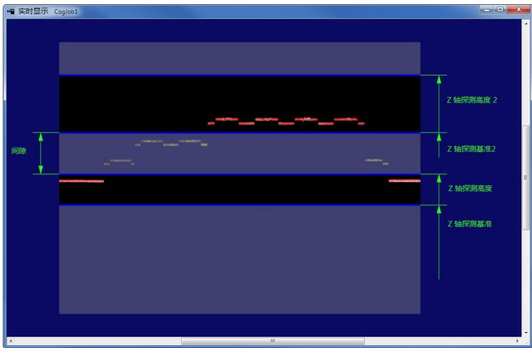

如果“区 1”和“区 2”同时启用，则"工作关注区域"为：

l 如果“区 1”和“区 2”没有连接(默认)，且在两个区域中间存在空开区域(两个区互相不交错)，那么检测会在两个区域中进行，对中间的空开区域不会进行检测。

在一些特殊的例子中，如果两个区域互相连接，那么“区 1”和“区 2”会被合并成一个区域进行检测。检测会从最低区域的底部开始，到最高区域的顶部结束。在合并的区域中，会单独使用 Z 轴采样率 (ZDetectionSampling) 设置对每个区域进行检测。唯一的例外是，当 Z 轴采样率 (ZDetectionSampling) 被设置为 2，Z 轴采样率 2(ZDetectionSampling2) 被设置为 1 时；这时，在两个区域交界处会有 4 个亮度图像行的空间，且这个空间不会被检测。如果不想显示这个空开部分，你可以选择填补两个空间。

l 通过启用合并探测区域 (BridgeDetectionZones) 参数，“区 1” 和“区 2”之间的空开部分可以被填补。“区1”和“区 2”会被合并成一个区域进行检测。检测会从最低区域的底部开始，到最高区域的顶部结束。从 “区 1”开始的 Z 轴采样率 (ZDetectionSampling) 设置会被用于合并后的整个区域。

如果通过启用链接探测区域 (LinkDetectionZones) 将“区 1”和“区 2”进行链接，那么 Z 轴探测基准 2

(ZDetectionBase2) 会根据“区 1”顶部的位置(ZDetectionBase $^ +$ ZDetectionHeight)进行测量。对于“区 1” 进行的更改将会自动应用到“区 2”上。在调整相机和取相部件之间的距离时，该设置将会非常有用。因为只需调整一个 Z 轴探测基准 (ZDetectionBase) 参数(区 1)就可以同时应用到两个区域。注意，随着链接探测区域 (LinkDetectionZones) 设置被启用或禁用，Z 轴探测基准 2 (ZDetectionBase2) 的值会在相对值(从“区 1” 顶部测量)以及绝对值(从 Z 轴原点测量)之间自动切换。

将激光探测模式 (LaserDetectionMode) 设置成“快速”将增加线扫描速率，但会降低准确率。该参数的默认设置为“标准”模式。注意，在“快速”模式下适合的曝光时间设置可能会与“标准”模式下的设置有所不同。亮度图像在“快速”模式下会显得更亮一些，你可能需要减少曝光时间来避免亮度过度饱和。减少曝光时间可能会导致额外的线扫描速率增加。

设置激光探测灵敏度 (DetectionSensitivity) 参数。该参数的值越高，激光扫描线越容易被找到。同时曝光设置可以更低，线扫描速率可以更高。该参数的值如果设置较低，则能避免在激光模糊的区域误把干扰当成激光。

传感器可达到的“最大线扫描速率”以及当前的采集设置会被计算并显示。这与采集一张亮度图像，处理图像并生成深度图像扫描线所需的“线扫描时间”成反比。

“线扫描时间”大约的计算如下所示：

线扫描时间 $\approx$ MAX(曝光时间、亮度图像处理时间)

如果曝光时间大于亮度图像的处理时间，则“线扫描时间”约等于曝光时间；如果亮度图像处理时间大于曝光时间，则“线扫描时间”约等于亮度图像处理时间。

影响“亮度图像处理时间”的因素有以下几个：

l Z 轴探测区域的大小：  
Z 轴探测基准 (ZDetectionBase)、Z 轴探测高度 (ZDetectionHeight)、Z 轴采样率 (ZDetectionSampling)(区 1)  
Z 轴探测基准 2 (ZDetectionBase2)、Z 轴探测高度2 (ZDetectionHeight2)、Z 轴采样率 2(ZDetectionSampling2)(区 2)

l 两个检测区域之间是否该有一个空开的区域：合并探测区域 (BridgeDetectionZones)  
l 激光探测模式：LaserDetectionMode

最高线扫描速率 = 1 / 线扫描时间

最高线扫描速率可以通过 CPMaxLineRateHz 参数从传感器读取。如需从“源图像”窗口读取该参数，可以在“特性”栏中输入 CPMaxLineRateHz，然后在 GigE 选项卡中点击“读取”。

# 6. 设置闪光灯和触发器参数

闪光灯和触发设置可以被用来控制激光和触发行为。这些参数的默认设置适用于初始采集设置。

在“闪光灯和触发器”选项卡中，指定激光模式 (LaserMode)：

l 闪光灯 - 激光在采集进行时打开  
l 开启 - 激光一直开启。该选项在安装传感器的时候非常有帮助：它可以在不需要采集图像的情况下，帮助你将传感器安装在“工作区域”对准正确的位置。  
l 关闭 - 激光关闭

你也可以指定触发模式 (TriggerMode)，为采集指定触发参数(不论你采集的是亮度图像、带图形的亮度图像或深度图像)：

l 手动 - 当你在 QuickBuild 中点击“运行”或从 API 调用 StartAcquire 时，无需外部触发，传感器就会采集一个图像。  
l 自由运行

通过 API 设置时，传感器在最高速率下连续采集图像。最高速率可在“线扫描时间”中定义。你的应用必须调用CompleteAcquire 来得到下一个可用图像。

通过 QuickBuild 设置时，点击“运行”，将只采集一个图像(相当于“手动”模式)。如需采集或处理多个图像，你必须点击“连续运行作业”按钮。

l 硬件自动

l 如果“触发类型 (TriggerType)”被设置到 EdgeOnly：

通过 API 设置时，传感器在外部触发线上检测到一个低->高电平沿时会采集一个图像。你的应用必须调用CompleteAcquire 来得到下一个可用图像。

通过 QuickBuild 设置时，点击“运行”后，且在外部触发线上检测到一个低->高电平沿时传感器会采集一个图像。如需采集多个图像，点击“连续运行作业”，传感器会采集多个图像(每一次在外部触发线上检测到一个低->高电平沿时会采集一个图像)。

l 如果“触发类型 (TriggerType)”被设置到 EdgeAndLevel：

通过 API 设置时，传感器在外部触发线上检测到一个低->高电平沿时会采集一个图像，并且在外部触发线的电平保持在高位的情况下，持续采集更多图像。当外部触发线的电平发生高->低转换时，传感器在完成当前图像采集后将停止采集更多图像。你的应用必须调用 CompleteAcquire 以在每个图像采集后得到下一个可用图像。

通过 QuickBuild 设置时，点击“运行”后，且在外部触发线上检测到一个低->高电平沿时传感器会采集一个图像。如需采集多个图像，点击“连续运行作业”按钮，当传感器在外部触发线上检测到一个低->高电平沿时会采集一个图像，并且在外部触发线的电平保持在高位的情况下，持续采集更多图像。当外部触发线的电平发生高 低转换时，传感器在完成当前图像采集后将停止采集更多图像。

将外部触发线的电平保持在高位(在电平沿发生低->高转换后进行了初始图像采集后)对于检测长度长于最大单个图像尺寸的部件或长短不一的部件时非常有用。对于长度长于最大单个图像尺寸的部件，可以将在单次触发(从低->高到高 低电平转换)下采集的一组图像拼贴在一起以形成一张更大的图像。

注意：

l 如果图像采集被高->低电平转换所停止，且在当前(最后一张)图像采集结束前外部触发线上有一个低->高电平沿转换，那么在该低->高电平沿转换时，不会采集任何图像，且会发出 isMissed 错误信息。如果发出 isMissed 错误信息，之后的多个图像采集将只能通过低->高电平沿转换来触发(在当前最后一张图像采集完成之后)，仅保持高电平状态将不能触发采集。注意，在该示例中高->低电平沿转换只能触发采集一张图片。

l 如果你需要对一个长部件进行多次图像采集，在触发线工作时请不要更改任何采集属性。在此时更改属性会导致采集停止。如果在采集过程中更改了采集属性，之后的多个图像采集将只能通过低->高电平沿转换来触发(在当前最后一张图像采集完成之后)，仅保持高电平状态将不能触发采集。注意，在该示例中高->低电平沿转换只能触发采集一张图片。  
l 采集错误(例如，如果 IgnoreTooFastEncoder 没有被选择，就会产生 IsTooFastEncoder 错误)会导致停止采集更多图像。如果你在对一个长部件进行多次图像采集时遇到采集错误，建议你放弃所有之前所采集的图像。如果出现采集错误，之后的多个图像采集将只能通过低->高电平沿转换来触发(在当前最后一张图像采集完成之后)，仅保持高电平状态将不能触发采集。注意，在该示例中高->低电平沿转换只能触发采集一张图片。

# l 硬件半自动

l 如果“触发类型 (TriggerType)”被设置到 EdgeOnly：

通过 API 设置时，如果你在检测到触发之前调用了 StartAcquire，那么当传感器在外部触发线上检测到一个低->高电平沿转换时会采集一个图像。你的应用必须调用 CompleteAcquire 来得到下一个可用图像。

通过 QuickBuild 设置时，点击“运行”后，且在外部触发线上检测到一个低->高电平沿时传感器会采集一个图像。如需采集多个图像，点击“连续运行作业”，传感器会采集多个图像(每一次在外部触发线上检测到一个低->高电平沿时会采集一个图像)。(在 QuickBuild 中，等同于硬件自动模式。)

l 如果“触发类型 (TriggerType)”被设置到 EdgeAndLevel：

通过 API 设置时，如果你在检测到触发之前调用了 StartAcquire，那么当传感器在外部触发线上检测到一个低->高电平沿转换时会采集一个图像。即使外部触发线保持在高电平状态，传感器也将不再采集更多图像(或在两幅图像间出现不可预知的间隙)。你的应用必须调用 CompleteAcquire 来得到下一个可用图像。

通过 QuickBuild 设置时，点击“运行”后，且在外部触发线上检测到一个低->高电平沿时传感器会采集一个图像。如需采集多个图像，点击“继续运行作业”按钮：

l 如果之前没有多个采集任务等待，在点击“继续运行作业”按钮之后，传感器在每个低->高电平转换时会采集多个图像。即使外部触发线保持在高电平状态，传感器也将不再采集更多图像(或在两幅图像间出现不可预知的间隙)。  
l 如果有多个采集任务等待(等于或多于 2 个)，在点击“连续运行作业”按钮后，当传感器在外部触发线上检测到一个低->高电平沿时会采集一个图像，并且在外部触发线的电平保持在高位的情况下，持续采集更多图像。当外部触发线的电平发生高->低转换时，传感器在完成当前图像采集后将停止采集更多图像。

注意，在有多个采集任务(等于或多于 2 个)等待的情况下：

l 如果采集被高->低电平转换所停止，且在当前(最后一张)图像采集结束前在外部触发线上有一个低->高电平沿转换，那么在该低 $- \rangle$ 高电平沿转换时，不会采集任何图像，且会发出 isMissed 错误信息。如果发出 isMissed 错误信息，之后的多个图像采集将只能通过低->高电平沿转换来触发(在当前最后一张图像采集完成之后)，仅保持高电平状态将不能触发采集。注意，在该示例中高->低电平沿转换只能触发采集一张图片。  
如果你需要对一个长部件进行多次图像采集，在触发线工作时请不要更改任何采集属性。如果在此时更改属性，在完成此前所等待的图像采集后，采集会中止。如果在采集过程中更改了采集属性，之后的多个图像采集将只能通过低->高电平沿转换来触发(在当前最后一张图像采集完成之后)，仅保持高电平状态将不能触发采集。注意，在该示例中高 低电平沿转换只能触发采集一张图片。  
l 采集错误(例如，如果 IgnoreTooFastEncoder 没有被选择，就会产生 IsTooFastEncoder 错误)会导致停止采集更多图像。如果你在对一个长部件进行多次图像采集时遇到采集错误，建议你放弃所有之前所采集的图像。如果出现采集错误，之后的多个图像采集将只能通过低->高电平沿转换来触发(在当前最后一张图像采集完成之后)，仅保持高电平状态将不能触发采集。注意，在该示例中高->低电平沿转换只能触发采集一张图片。

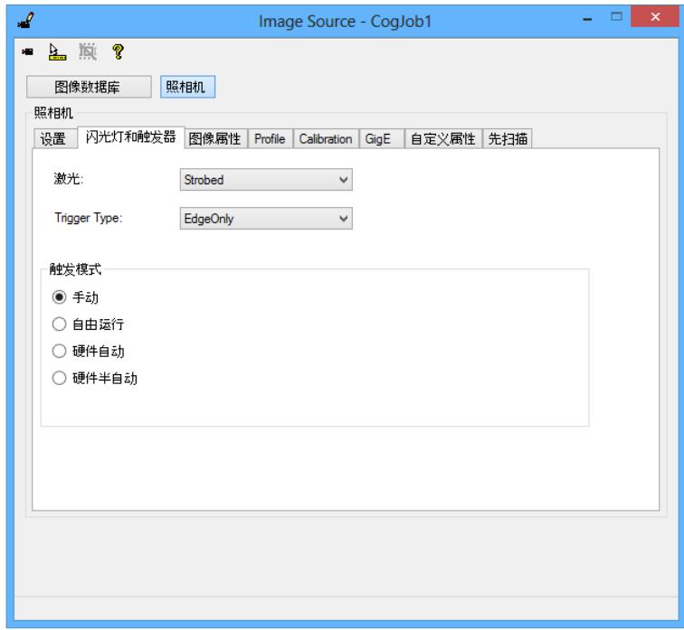

# 7. 将图像类型设置为采集深度图像

在“图像属性”选项卡中，将“相机模式”设置为 Range 以采集深度图像。

其它选项包括采集

l 亮度图像 (Intensity Images)  
l 带图形的亮度图像 (Intensity Images with Graphics)，显示正在处理的亮度图像结果以及 Z 轴参数设置。

你可能需要使用亮度图像或带图形的亮度图像来验证需要检测的对象是否在 DS1000 系列传感器的相机中正确显示。例如，你可能需要验证激光是否在所有需要检测的目标部件中出现。其它使用范例包括设置如之前所述的正确激光反射等。根据所选的图像类型，DS1000 图像采集用户图形界面选项卡中的有些选项会被激活，有些会被禁用。

下面，将进一步讨论采集深度图像的具体步骤。

# 8. 设置线扫描参数

在“线扫描”选项卡中，设置“线扫描”参数。

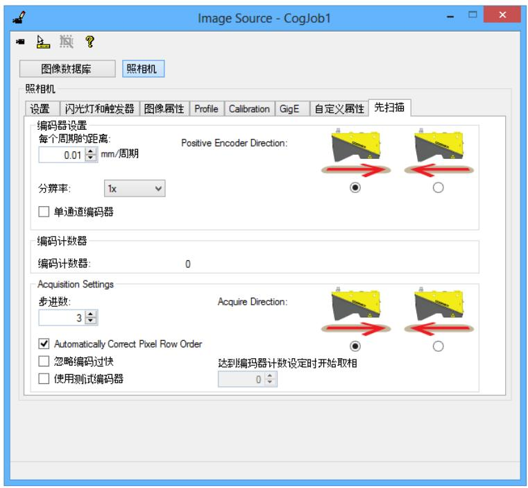

# 编码器

编码器可以被用来追踪传送带的运行。编码器安装在传送带上，并在传送带移动一定距离时(步)提供一组特定的信号。用于生成深度图像的亮度图像采集可以通过编码器信号或步数来触发。单通道编码器含有一个单一的通道，因此只能被用来检测物体是否移动，但不能检测移动的方向。双通道编码器含有正交信号通道，因此可以被用来检测移动以及移动的方向。以下图例显示了双通道编码器的两个信号通道(Phase A 和 Phase B)。

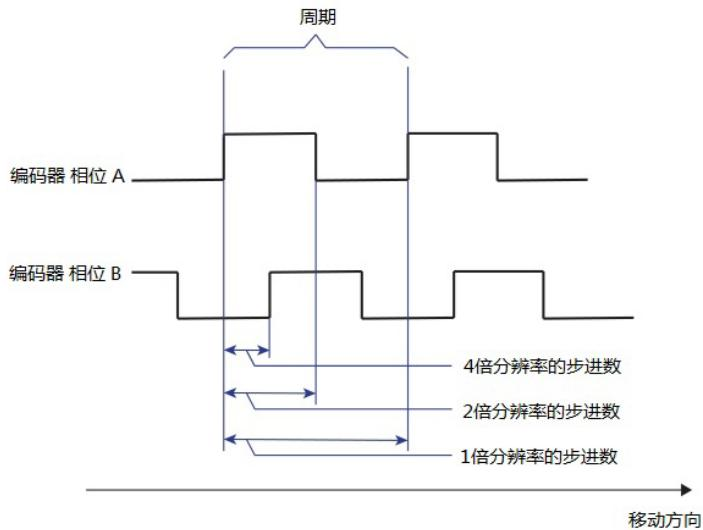

单通道编码器只含有这两个通道中的一个。一个“周期”指的是编码器信号通道在一个周期内所产生的一组波形。每个周期的距离 (DistancePerCycle) 指的是“周期”内的波长，即在双通道编码器的正交波形的一个完整周期内，输送带必须移动以使编码器输出一个完整周期的物理距离。所有完整“周期”含有四个边沿：2 个在 Phase A，2 个在 Phase B。

“步”代表的是编码器计数之间所移动的距离。每个“步”的距离由编码器分辨率 (EncoderResolution) 设置控制：

l 如果编码器分辨率 (EncoderResolution) 的设置为 4x, 编码器为采集深度图像所移动的“步”数是完成整个“周期”的频率的四倍。每“步”为 DistancePerCycle 距离的四分之一。

当使用 4x 时，每个“步”与正交波形的每个边沿对应。

l 如果编码器分辨率 (EncoderResolution) 的设置为 $2 \mathrm { x } .$ , 编码器为采集深度图像所移动的“步”数是完成整个“周期”的频率的两倍。每“步”为 DistancePerCycle 距离的二分之一。

当使用 2x 时，编码器的“步”将根据 Phase A 的边沿来产生。

l 如果编码器分辨率 (EncoderResolution) 的设置为 1x, 编码器为采集深度图像所移动的“步”数与完成整个“周期”的频率相同。每“步”与 DistancePerCycle 距离相同。

当使用 1x 时，编码器的“步”将根据 Phase A 的上升沿或下降沿来产生。

在使用单通道编码器时(一“步”等于一个完整的周期)，编码器的分辨率不适用。

# 测试编码器

如果你没有在传送带上安装编码器，或者你不想使用类似的编码器，而希望按照时间来采集图像，你可以为 DS1000 系列传感器选择使用“测试编码器”。“测试编码器”的运行与单通道编码器相同。

# 设置“编码器类型”、“编码器正方向”、“采集方向”以及“每个周期编码器移动距离”参数

编码器类型 - 如果你使用的是单通道编码器，选择“单通道编码器”选项框或在 API 中将 UseSingleChannel 参数设置为True。默认情况下，该参数的设置为 False，且对应的用户图形界面中的“单通道编码器”选项框不会被选择。这意味着两个通道(Phase A 和 Phase B)都可以被用来触发采集。

你也可以通过选择“使用测试编码器”选项框，或在 API 中使用 TestEncoderEnabled 属性来选择基于时间的测试编码器。

编码器正方向 - 如果你使用的是“双通道编码器”，可以选择将以下的一个传送带移动方向设置为正方向：从 DS1000 系列传感器的相机向激光移动的方向(默认设置，“推”方向)或从激光向相机移动的方向(“拉”方向)。一个简单的可以用来确定编码器哪个方向为正方向的方法为，观察哪个传送带移动方向会导致“编码器计数”增加。

采集方向 - 设置用来执行采集的传送带的运行方向。如果使用双通道编码器，DS1000 系列传感器不会在相反的运动方向上采集图像。

每个周期的距离 - 设置每个周期的距离 (DistancePerCycle) 参数。一个计算方法为，根据编码器的规格和物理设置(编码器圆环的直径、传动比或滑动等)来计算。

一个简单的根据测量来计算该值的方法为，将传送带移动一定的距离，根据编码器计数的差异将其除以编码器完成的圈数。例如，在使用双通道编码器的时候执行以下步骤。

1. 将编码器分辨率 (EncoderResolution) 设置为 4x，并确认“单通道编码器”选项框没有被选中。  
2. 将传送带放置到开始位置(在该位置时编码器计数的值接近于 0 以防止计数器反转)并记录下“编码器计数”的值。  
3. 将传送带在编码器正方向上移动 $1 0 0 ~ \mathrm { { m m } }$ ，并记录下新的“编码器计数”值。  
4. 在结束值中减去开始时“编码器计数”的值，然后除以 4 (分辨率为 4x)以得到完成的圈数的数字。  
5. 100mm 除以完成的圈数，即为每个周期的值。将该值输入到每个周期的距离 (DistancePerCycle) 参数中。

如果你使用的是单通道编码器，请确保选中“单通道编码器”复选框(EncoderResolution 值任意)，并执行以上步骤，只是不需要在编码器计数值的差异上除以实际的分辨率设置。这意味着，在使用单通道编码器时，编码器计数值的差异与完成的圈数的值相对应。

这些参数使得传送带移动方向以及传感器的安装方向与编码器相对应。如果传送带的移动方向发生改变，则需要改变“采集方向”。如果需要检测的部件与传送带运行的方向一致，但你想从相反的方向来检测部件，那么可以将传感器安装在相反的方向上，并更改“编码器正方向”(以及“采集方向”，如果传送带的移动方向没有发生改变)设置。

这些参数与你的编码器以及移动设置连接。因此，你必须在初次采集深度图像时设置这些参数，并且尽量避免在之后的参数优化中更改这些参数。

# 设置每线的步数 - 物理编码器

“每线的步数 (StepsPerLine)”参数决定亮度图像线扫描频率，即在下一张亮度图像采集并获得深度图像扫描线之前需要通过的步数。该参数，以及编码器分辨率参数将直接影响所采集的深度图像的 Y 轴分辨率。

第一条扫描线与触发不同步，但与在触发之后收到的第一个编码器信号同步。“每线的步数 (StepsPerLine)”不适用于第条扫描线。你可以在 API 中使用 SetStepsPerLine 来设置每线的步数。如果你使用硬件触发模式 (TriggerMode)(自动或半自动)，你可以使用 StartAcqOnEncoderCount 来更改第一条线相对于触发时的位置。(在接收到触发之前，不能使用负值来采集第一条扫描线)

假设你想要检测的部件随着传送带以一已知的基于生产需求的速度移动。在该情况下，你需要根据这个“每线的步数(StepsPerLine)”参数来设置你的 DS1000 系列传感器的采集系统。

对于使用默认参数的初次深度图像采集，Cognex 建议进行以下的设置：

l 分辨率：full (4x)， 传送带以 300 cycle/sec 的编码器速率运行，推荐“每线的步数：9  
l 分辨率：full (4x)， 传送带以 600 cycle/sec 的编码器速率运行，推荐“每线的步数：15  
l 分辨率：double (2x)， 传送带以 300 cycle/sec 的编码器速率运行，推荐“每线的步数：5  
l 分辨率：double (2x)， 传送带以 600 cycle/sec 的编码器速率运行，推荐“每线的步数：8

你可以通过计算在一定的传送带移动距离内有多少圈数来计算你的编码器速率，测量传送带通过这个既定距离的时间并除以圈数。

如果你将“每线的步数 (StepsPerLine)”设置得太低，则可能会发生编码器超限。如果发生编码器超限，则需要优化采集速度。

一般来说，因为设置为 4x 的编码器分辨率 (EncoderResolution) 在设置获取的深度图像扫描线之间的距离时有最大的灵活性，因此 Cognex 建议你使用该设置。当你不能在采集到的两条深度图像扫描线之间获得足够大的距离时， $2 \mathrm { x }$ 和 1x 设置会有帮助。

# 示例：

每个周期的距离 (DistancePerCycle) $= \ 0 . 0 8 \ \mathrm { \ m m } /$ 周期

l 设置每线的步数 (Steps per line) $= ~ 9$ ，并且设置编码器分辨率(EncoderResolution) $= 4 \mathrm { x }$ ，产生的扫描线的间距是$0 . 1 8 \mathrm { m m }$ 。  
l 设置每线的步数 (Steps per line) $= ~ 1 5$ ，并且设置编码器分辨率(EncoderResolution) $= 4 \mathrm { x }$ ，产生的扫描线的间距是$0 , 3 \mathrm { m m }$ 。  
l 设置每线的步数 (Steps per line) $= ~ 5$ ，并且设置编码器分辨率(EncoderResolution) $= \mathrm { { 2 x } }$ ，产生的扫描线的间距是$0 . 2 \mathrm { m m }$ 。  
l 设置每线的步数 (Steps per line) $= ~ 8$ ，并且设置编码器分辨率(EncoderResolution) $= \mathrm { { 2 x } }$ ，产生的扫描线的间距是$0 . 3 2 \mathrm { m m }$ 。

# 设置每线的步数 - 测试编码器

默认的测试编码器的时钟率为 $1 0 ~ \mathrm { \ K H z }$ 。这意味着，“每线的步数”以 $1 0 0 ~ \mu \mathrm { s }$ 递增。因此，如果你想得到每条线 6.2 ms的速率，你需要将“每线的步数 (StepsPerLine)”设置为 62。你可以通过修改名为 CPEncoderClockRate 的 GigE 功能来更改时钟速率(以 KHz 为单位)。同样，也可以读取 CPEncoderClockRate，该参数值会提供 10 个结果(因为默认值为 10KHz)。CPEncoderClockRate 的范围为 10 到 1000。

有两个方法来修改 CPEncoderClockRate：

l 在“自定义属性”页中将寄存器加入到“自定义属性”列表。   
l 在 GigE 选项卡中通过 GigE 读取/写入功能编程。

Cognex 建议使用第一种方法以将得到的值保留在 .vpp 文件中。

# 处理编码器超限错误

如果编码器设置(例如“每线的步数 (StepsPerLine)”)导致了采集扫描线的时间快于“线扫描时间”(采集一张亮度图像，对其进行处理并生成一条深度图像扫描线的时间)，你就会得到一个编码器超限错误。该错误在单独编码器和测试编码器上都会发生。因此，请确保每”步“的时间大于“线扫描时间”。你可能需要使用安全因子(一个大于 1 的数)，用该数乘以“线扫描时间”以确保该值足够大，并以此来避免编码器超限错误。

如果你选择了忽略过快编码器 (IgnoreTooFastEncoder)，那么当编码器启动一个比“线扫描时间”快的新的扫描线采集时，没有足够时间处理的那条扫描线在深度图像中会被没有像素的行所取代。

# 设置是否需要自动更正像素行次序

使用自动更正像素行次序 (AutoCorrectPixelRowOrder) 来设置是否需要自动设置所采集的图像行的次序以与实际显示情景相匹配。如果该值被设置为 false，那么在激光到相机方向采集到的图像会含有一个相反的像素行次序(该图像会按顶部到底部镜像的方式显示以与实际显示情景相匹配)。

# 9. 设置深度图像属性

在“图像属性”选项卡中，设置“深度图像 (Range)”属性。该属性可以被用来控制所生成的深度图像的特性。

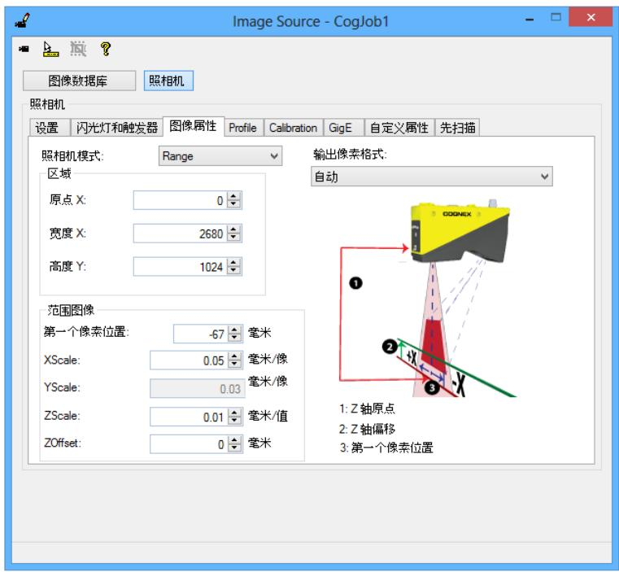

# 为深度图像设置 X 轴比例 (X Scale) 以保持长宽比

在深度图像中，Y 轴比例 (Y Scale) 和 X 轴比例 (X Scale) 分别与每行及每列的毫米数量相对应。Y 轴比例 (Y Scale)为“只读”值，该值将会根据每个周期的距离 (DistancePerCycle)、编码器分辨率 (EncoderResolution)、“每线的步数(StepsPerLine)”以及“编码器类型”设置而自动计算。为了使在深度图像中出现的特征以在实际世界中相同的长宽比显示，需要根据已计算出的 Y 轴比例 (Y Scale) 来设置 X 轴比例 (X Scale)。

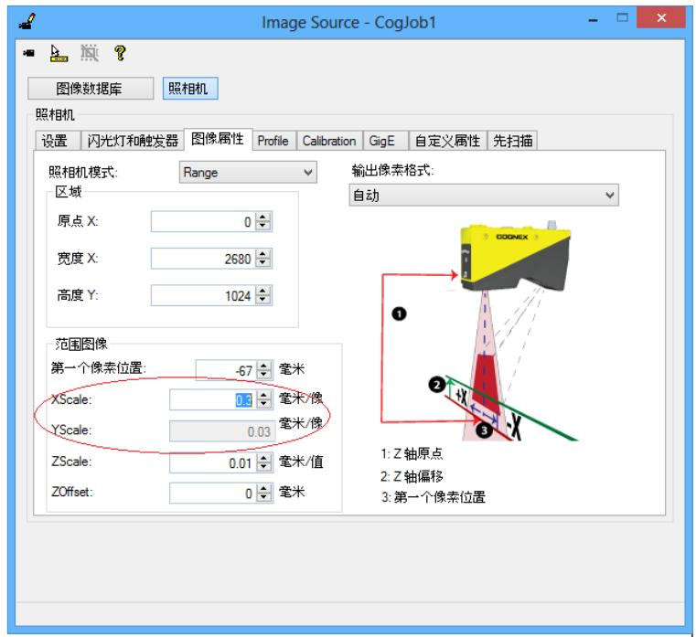

# 采集深度图像并进一步设置深度图像属性

如果通过 QuickBuild 使用手动采集深度图像，点击“运行”按钮以采集最初的深度图像。以下图例显示了一个 F 型$\mathrm { L E G 0 @ }$ 积木的深度图像。通过放大含有高度变化的高度范围，色彩图像控件 (Colormap Control)可以用来在深度图像中增强可视特征。

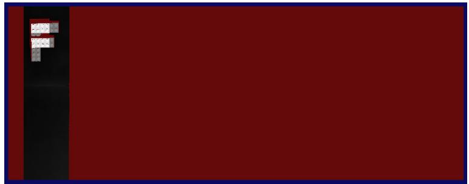

进一步调整深度图像的属性以得到你所需要的深度图像：

指定深度图像所需要包含的行数。可以通过使用用户图形界面中的高度 Y (Height Y)来设置采集的激光扫描线的数目。通过使用用户图形界面中的宽度 X (Width X) 来设置深度图像中所需包含的列数。可以通过使用用户图形界面中的 X 原点(Origin X) 来调整深度图像的 X 原点。

在 API 中，你可以通过使用 ICogAcqFifo.OwnedROIParams 属性中的 SetROIXYWidthHeight 来设置这些参数：

SetROIXYWidthHeight(int OriginX, 0, int WidthX, int HeightY)

指定第一像素位置 (FirstPixelLocation)，该参数定义了深度图像沿着 X 轴的第一个物理像素位置(以 mm 为单位)；即，深度图像从左开始的位置。

你可以使用 Z 轴比例 (ZScale) 深度图像参数来指定像素值的比例(以 mm 为单位)。默认情况下，像素值 1 代表了高度在(Z Origin + 1 x ZScale)的高度。 你可以通过使用 Z 轴偏移 (ZOffset) 深度图像参数来指定一个与像素值 1 相对应的自定义高度(以 mm 为单位)。注意，在 Z 轴原点 (Z Origin) (或 ZOffset)的高度也可以通过像素值 1(而不是 0)来表示。

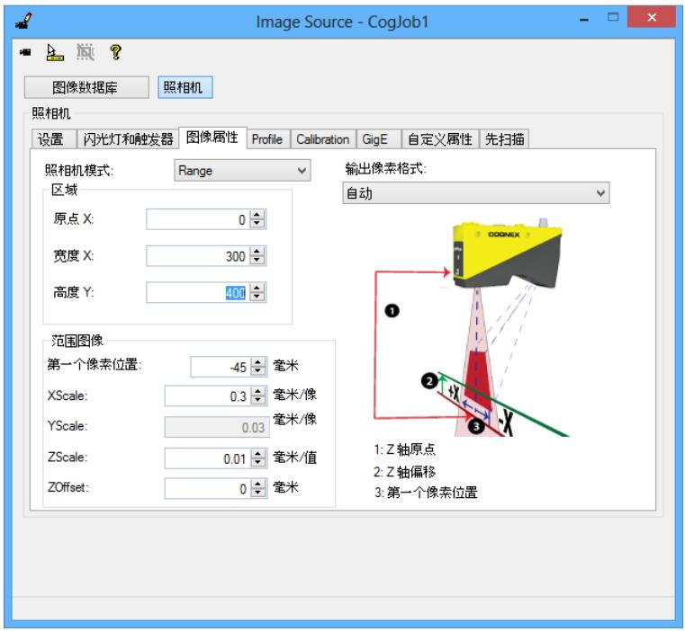

由此产生的调整过的深度图像，如下图所示：

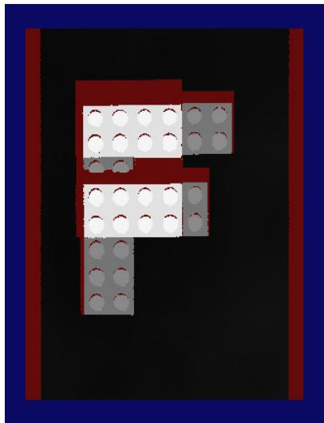

注意，显示为缺失像素的隐藏的区域使用默认的暗红色来标注。

以下图例显示了检测部件含有间隙和不含有间隙的图像。

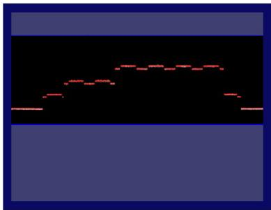  
无间隙的带图形的强度图像

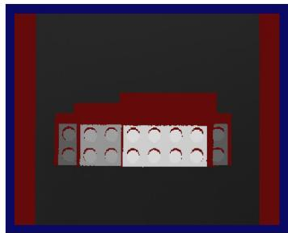  
无间隙的范围图像

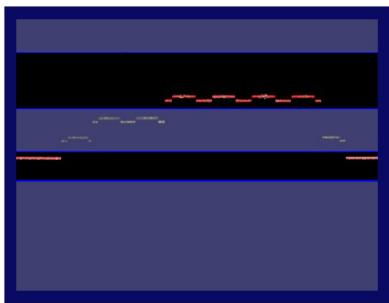  
有间隙的带图形的强度图像

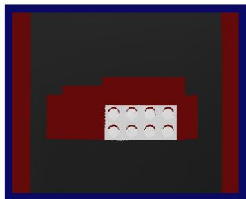  
有间隙的范围图像

注意，对应于被间隙排除的高度的区域以缺失的像素来显示。这是因为，在间隙中没有激光扫描线对传感器来说是可见的。因此，在间隙中的高度范围内没有收集到任何数据。

然而，在一些情况下，杂散特征可能会出现在深度图像中的这些区域以及相邻的区域，而不显示像素缺失。这通常是各种激光在“工作关注区域”中反射的结果。如果被检测的对象(以及传送带)的表面为磨砂表面，这种现象就不太会发生。为防止杂散特征出现在深度图像中，你可以降低探测灵敏度 (DetectionSensitivity) 以及/或减少“曝光”时间。通过使用带图形的亮度图像，你可以轻松地调整这些参数，并确认导致杂散特征出现在图像中的反射得到了有效的控制。

# 10. 设置坐标空间(可选)

在标定 (Calibration) 选项卡中，可以选择 Primary 3D Calibrated Space 或 2D selected space。

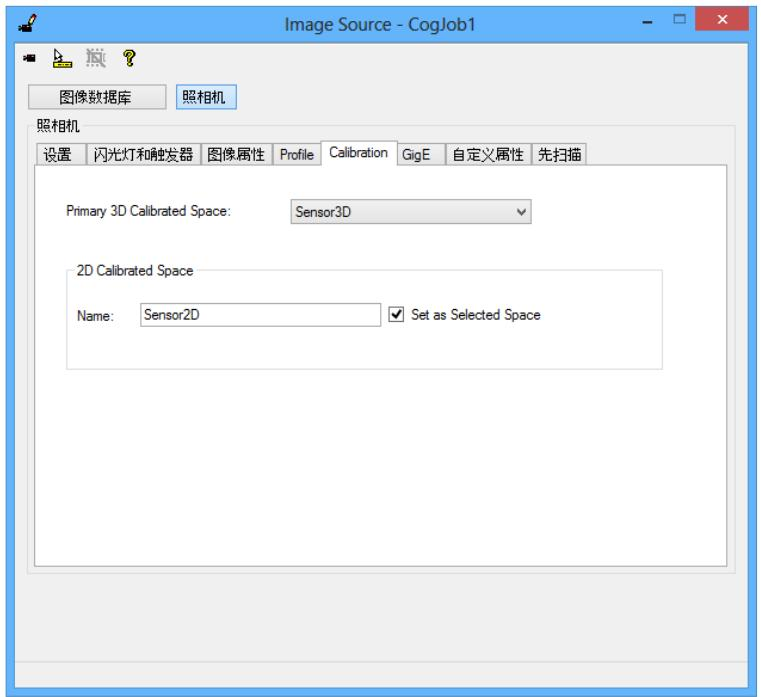

Primary 3D Calibrated Space 可用于在深度图像中显示像素的标定 3D 空间。在该版本的 VisionPro 软件中，Sensor3D是唯一可选的 Primary 3D Calibrated Space。

2D Calibrated Space 是与 Z 轴值为零所在的平面在 Primary 3D Calibrated Space 中对应的 2D 空间。该空间可与 2D视觉工具一起使用来获得标定后的真实世界测量。默认的空间名为 Sensor2D，且被默认设置为“选中的 2D 空间”用于采集图像。你可以在该选项卡中重新命名 Sensor2D 空间，且可以取消选中 Set as Selected Space 复选框以避免使用该空间为选中的 2D 空间。

# 图像采集参数优化

该部分包含以下内容。

l 优化采集速度  
l 优化 Z 轴分辨率  
l 优化 Y 轴分辨率  
l 优化 X 轴分辨率  
l 在长宽比保持不变的情况下根据具体的分辨率需求来设置图像采集参数

在以上基础上进行进一步调整以达到最佳运行效果。

# 优化采集速度

如果因为采集速度高于当前参数设置所支持的速度而导致编码器超限，你就需要优化采集参数的速度。

以下图例显示了在传送带运行速度太快情况下采集到的深度图像。其中缺失的像素行是编码器超限导致的结果(选择了忽略过快编码器 (IgnoreTooFastEncoder) 选项)：

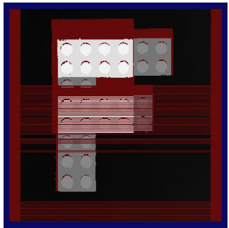

你可以通过减少“线扫描时间 (Line Time)”或降低取样率(Y 分辨率结果 )来加速采集过程。

你可以通过降低“曝光时间”或“亮度图像处理时间”来减少“线扫描时间”。或者同时调整这两个参数，如果它们的值相似。注意，将上述两个时间值中的一个减至大大低于其它的一个时间值将不会对提高速度产生更多的影响。采集速度将受到另外一个时间值的限制。

# 调整 Z 轴探测参数以提高速度

调整 Z 轴探测基准 (ZDetectionBase) 和 Z 轴探测高度 (ZDetectionHeight) 参数(区 1)以尽可能多地排除不需要被检测的高度。减小工作关注区域意味着 DS1000 系列传感器处理深度图像扫描线时不需要那么多的数据，这就可以减少“亮度图像处理时间”，从而可能减少“线扫描时间”的值。

以下图例显示了优化过和未优化过的“工作关注区域”设置：

优化过的设置：

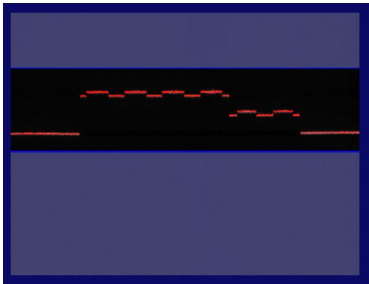

未优化的设置：

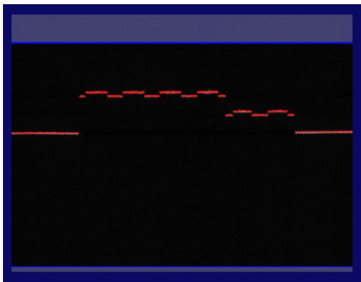

优化过的参数设置：

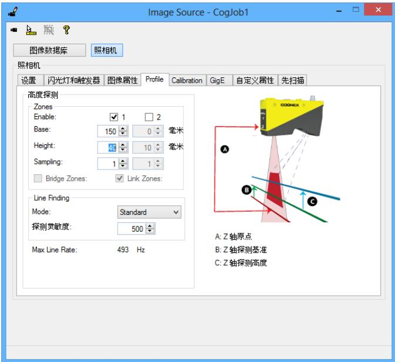

请避免将你的“工作关注区域”设置成过小，这会导致想要检测的特征不在被检测的范围内。下图显示了在类似设置下所生成的图像：

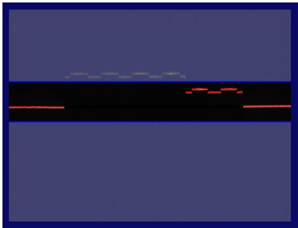

含有排除的特征，导致像素缺失的不合格深度图像：

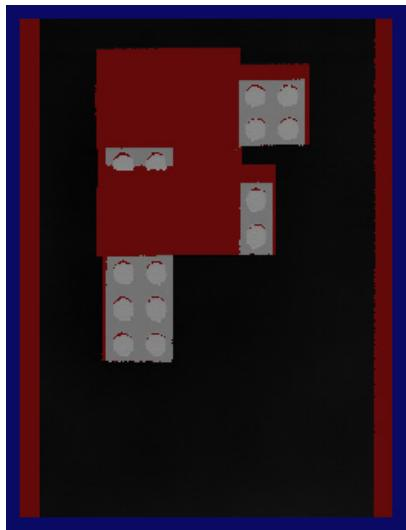

你也可以通过提高 Z 轴采样率 (ZDetectionSampling) 参数来提高处理过的亮度图像行之间的间隙，并由此降低传感器需要处理的深度图像行的总体行数。该操作可以减少“亮度图像处理时间”，并可能会减少深度图像“线扫描时间”的值。然而，这也会降低采集图像 Z 轴的精确度。

如果有不需要关注的高度范围，你可以在使用“区 1”的同时使用第 2 个区域，例如，在“区 1”检测低的高度关注范围，在“区 2” 检测高的高度关注范围。在两个区之间的区域将不会被处理，从而减少了“亮度图像处理时间”，并可能减少“线扫描时间”的值和提高线扫描速率。你可以通过调整 Z 轴探测基准 2 (ZDetectionBase2) 和 Z 轴探测高度 2(ZDetectionHeight 2) 参数来配置“区 2”。有关区域设置的详细信息，请参见“为每个检测区域设置 Z 轴探测基准和高度以及 Z 轴探测取样”和“设置激光探测模式和探测灵敏度”部分。

如果你想提高线扫描速率，当然准确率会因此而降低(如果“亮度图像处理时间”大于“曝光”时间)，你可以将激光探测模式 (LaserDetectionMode) 设置成“快速”。该参数的默认设置为“标准”模式。快速激光探测模式(LaserDetectionMode) 在大幅度降低时间的同时也降低了采集图像的精确度。

将需要检测的部件放置得更低一点或将 DS1000 系列传感器安装得高一点，然后重新调整 Z 轴探测基准参数。

在降低了 Z 轴和 X 轴分辨率的同时，你可以通过将需要检测的部件放在相对于 DS1000 系列传感器较低的位置或将传感器安装得更高一些来提高采集的速度。被检测的部件特征在传感器的相机中对应的行数(以及列数)会减少，因此这些特征显示在亮度图像中也会偏小。减少的行数会导致“亮度图像处理时间”的减少，同时也会导致“线扫描时间”的减少并提高采集速度。请确保调整 Z 轴探测基准 (ZDetectionBase) 参数使其与新的基准高度匹配。在部件大小相同的情况下，不需要更改 Z 轴探测高度 (ZDetectionHeight) 参数，因为该参数指定的是“工作区域”的 Z 轴高度，以 mm 为单位(不是以相机

像素为单位)。但是在降低了 Z 轴探测基准 (ZDetectionBase) 之后，在亮度图像中与 Z 轴探测高度 (ZDetectionHeight)对应区域的显示图像会偏小。

# 减少曝光时间以提高速度

你可以通过减少“曝光”时间来减少“线扫描时间”(如果“曝光”时间大于“亮度图像处理时间”)。由于在亮度图像中激光的强度有所降低，为保证检测的稳靠，建议您提高“对比度”以及/或激光的探测灵敏度 (DetectionSensitivity)(在Profile 选项卡中)。如果提高了“对比度”和激光探测灵敏度 (DetectionSensitivity) 级别导致过多的干扰出现在图像中，则需要降低激光探测灵敏度 (DetectionSensitivity) 和“对比度”(如必须的话)。

调整完这些设置后，你应该可以得到一张看上去准确的亮度图像，如在步骤 5. 设置低级采集控制参数(位于第 9 页)中所示。

在得到所需的图像和带图形的亮度图像后，重新采集深度图像，并确认没有编码器超限的问题且深度图像看上去正确。

以下图例显示了降低“曝光”时间后采集到的图像：

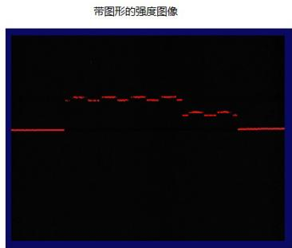

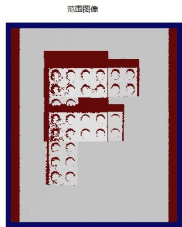

提高了对比度：

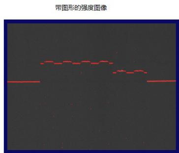

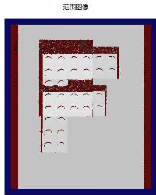

降低了探测灵敏度 (DetectionSensitivity) 但提高了对比度：

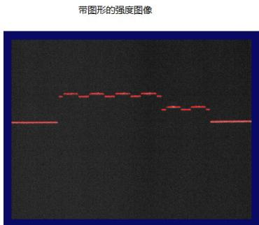

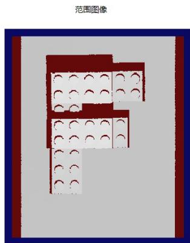

如果选择了高动态范围 (HighDynamicRange)，总体曝光时间将大于原来的曝光时间。同时，需要增加额外的“亮度图像处理时间”来处理亮度图像。当然，“线扫描时间”也因此而增加。如果你不再需要使用高动态范围 (HighDynamicRange)，你可以选择禁用该选项以减少“线扫描时间”。

# 增加“每行的步数”参数值和/或降低分辨率以大幅提高速度

虽然损失了部分 Y 轴分辨率(以及 X 轴分辨率，如果你通过使用将 X 轴比例 (X Scale) 与 Y 轴比例 (Y Scale) 保持相同的方法来保持图像的长宽比)，就可以通过不经常采样检测对象的方法来加快采集图像速度。这可以通过增加“每行的步数”和/或降低编码器分辨率 (EncoderResolution) 来达到。如果需要保持长宽比，不要忘了在“图像属性”选项卡中将 X轴比例 (X Scale) 调整到与 Y 轴比例 (Y Scale) 相同。

你也可以选择在降低 Y 轴分辨率来提高速度的同时，保持 X 轴分辨率(通过固定 X 轴比例 (X Scale) 值)不变。在该情况下，显示的深度图像可能会变形(在像素空间中)。不过，在深度图像中的 3D 变换(以及 2D 变换)确保了深度图像中的像素位置与在实际 Sensor3D 空间(以及 Sensor2D 空间)中的正确位置相对应。换句话说，即使显示的深度图像变形，3D 变换(以及 2D 变换)依然可以让你得到精确的特征位置和大小。

这些设置不会更改“线扫描时间”。

# 通过准确地测量“线扫描时间”来优化

你可以通过准确地测量“线扫描时间”并以此为基础来优化其它的参数。通过执行以下步骤，你可以从 DS1000 系列传感器获取 CPCycleTimeUSec 参数。该参数与传感器测得的“线扫描时间”对应。

1. 配置曝光、高动态范围以及 Z 轴探测设置。  
2. 采集一个深度图像(无需考虑编码器超限与否)。  
3. 如下图所示，从传感器读取 CPCycleTimeUSec 参数：

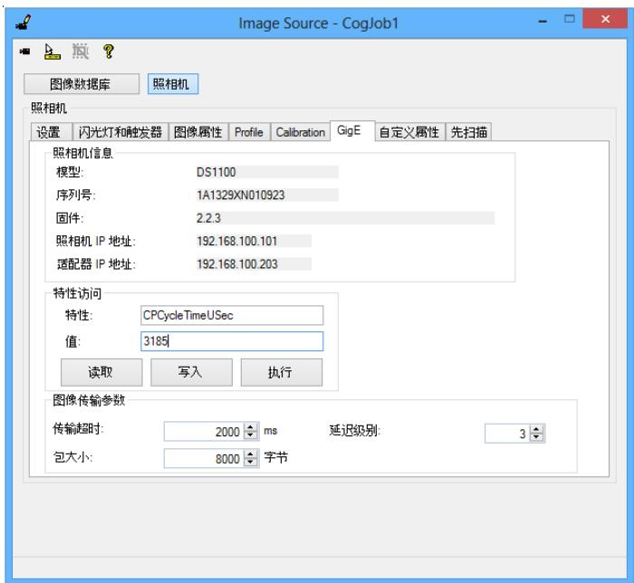

4. 回到步骤 1，并调整参数直到之前的步骤读取到适合应用的数据。

根据获取的图像，读取的 CPCycleTimeUSec 可能会略有变化。

# 优化 Z 轴分辨率

如果检测部件在 Z 轴上需要更高的分辨率，你可以将你的部件放在相对于 DS1000 系列传感器来说较高的位置，或将传感器安装在较低的位置。这样的话，部件上检测的特征在传感器的相机上会与更多的行(或列)对应，且会在亮度图像中显示较大的图形，从而提高分辨率。请确保调整 Z 轴探测基准 (ZDetectionBase) 参数使其与新的基准高度匹配。在部件大小相同的情况下，不需要更改 Z 轴探测高度 (ZDetectionHeight) 参数，因为该参数指定的是“工作区域”的 Z 轴高度，以mm 为单位(不是以相机像素为单位)。然而在提高了 Z 轴探测基准 (ZDetectionBase) 之后，在亮度图像中与 Z 轴探测高度 (ZDetectionHeight) 对应区域的显示图像会偏大。更多的亮度图像行会导致”亮度图像处理时间“的增加，同时会增加“线扫描时间”并降低采集速度。

如果你启用了“区 2”，且该区域与“区 1” 连接，那么“区 2” 会随着 Z 轴探测基准 (ZDetectionBase) 参数的调整而自动调整。如果“区 2” 与“区 1” 没有连接，则需要在调整完 Z 轴探测基准 (ZDetectionBase) 参数之后，手动对Z 轴探测基准 2 (ZDetectionBase2) 参数做相应调整。

将激光探测模式 (LaserDetectionMode) 设置为默认的“标准”设置(如果你设置了“快速”模式)以提高准确率(线扫描速率会因此而降低)。

# 为含有不同反射率表面的检测启用高动态范围

优化 Z 轴精确度可以在激光扫描线可见的情况下达到，但不能通过亮度饱和而达到。一些图像中含有的不同反射率或不同的检测表面，会导致图像中有的部分更亮或更暗。在这些图像中可能很难找到一个曝光设置可以让所有的特征同时可见，但又不过度饱和。在该情况下，可以使用高动态范围 (HighDynamicRange) 切换。在启用了高动态范围 (HighDynamicRange)之后，每次触发都会采集两张亮度图像：先使用指定“曝光”参数的十分之一进行采集，然后按指定的“曝光”参数再采集一次。之后，在采集到的两张图像上运行峰值检测算法；对于亮度图像的每一列，与最短曝光相对应的峰值会被记录下来并用来生成原始峰值数据列。

l 如果有一个曝光数据包含了，(a) 所有需要检测特征的峰值，且 (b) 所有特征的亮度不过度饱和，那么该曝光可以产生最佳的 Z 轴精确度。  
l 如果没有一个曝光数据包含了，(a) 所有需要检测特征的峰值，且 (b) 所有特征的亮度不过度饱和，那么高动态范围 (HighDynamicRange) 需要被启用。

推荐的高动态范围 (HighDynamicRange) 使用方法为，将曝光设置到最暗的特征可见且同时可检测到处于峰值的激光扫描线。接着，在亮度图像中查看其它特征的亮度是否过度饱和。如果其它的特征过度饱和，那么手动将“曝光”参数降低 0.1x 指定的曝光值，并确保 (a) 其它特征可被检测到，且 (b) 其它特征亮度不过度饱和。如果所有的特征都可见，但亮度又不过度饱和，那么该曝光值(指定的曝光值或 $0 . 1 \mathrm { ~ x ~ }$ 指定的曝光值)就可以产生最精确的 Z 轴准确度。

注意，启用高动态范围 (HighDynamicRange) 会降低最高线扫描速率。

# 优化 Y 轴分辨率

Y 轴分辨率的上限为采集系统所能采集的两根深度图像扫描线之间在 Y 轴上的最小距离。Y 轴分辨率的上限等于两个编码器步数之间在传送带上移动的距离(最大编码器分辨率 (EncoderResolutio) 设置)。

可以通过以下方法来提高 Y 轴分辨率。

# 提高“编码器分辨率”以及减少”每线的步数“参数

你可以通过提高编码器分辨率 (EncoderResolution) 参数值来提高 Y 轴分辨率。建议值为 $2 \mathrm { x }$ 至 4x(最大值为 4x )。你也可以通过减少“每线的步数”参数(最小值为 2)来提高 Y 轴分辨率。

如果你提高了 Y 轴分辨率，深度图像扫描线采集频率会更加频繁。如果两个编码器之间的计数时间小于“线扫描时间”，就会导致编码器超限。如果发生该情况，你应该降低传送带移动的速度或通过调整低级采集控制参数(包括 Z 轴探测参数、曝光以及对比度设置)来优化速度。

如果你想要保持长宽比，确保在图像属性选项卡中调整 X 轴比例 (X Scale) 以匹配新的 Y 轴比例 (Y Scale)。

以下图例显示了在不同参数设置下采集的深度图像：一张为在“每线的步数”为 15、编码器分辨率 (EncoderResolution)为 4x 时采集的图像以及优化后的在“每线的步数”为 5、编码器分辨率 (EncoderResolution) 为 4x 时采集的图像：

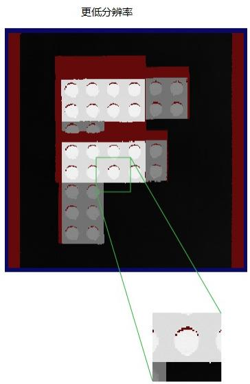

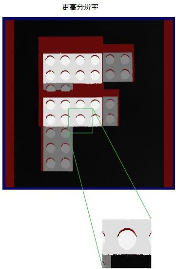

# 如果 Y 轴上限不够，可以调整编码器的安装。

如果 Y 轴分辨率的上限(在两个编码器步数之间的移动)不够，并且你想减小该距离，你可以更改编码器的传输或使用另一种可以在相同距离内产生更多计数的编码器。

# 优化 X 轴分辨率

你可能需要通过提高在 X 轴上的采样速率或增加显示的分辨率(如果采样速率不需要改变)来提高 X 轴的分辨率。

如果你需要更高的 X 轴采样速率，将部件摆放在更高的位置或将 DS1000 系列传感器安装到较低的位置，并重新调整 Z 轴基座参数。

如果检测部件在 X 轴上需要更高的分辨率，你可以将你的部件放在相对于 DS1000 系列传感器来说较高的位置，或将传感器安装在较低的位置。这样的话，部件上检测的特征在传感器的相机上会与更多的列(或行)对应，且会在亮度图像中显示较大的图形，从而提高分辨率。请确保调整 Z 轴探测基准 (ZDetectionBase) 参数使其与新的基准高度匹配。在部件大小相同的情况下，不需要更改 Z 轴探测高度 (ZDetectionHeight) 参数，因为该参数指定的是“工作区域”的 Z 轴高度，以mm 为单位(不是以相机像素为单位)。但是，在提高了 Z 轴探测基准 (ZDetectionBase) 之后，在亮度图像中与 Z 轴探测高度 (ZDetectionHeight) 对应区域的显示图像会偏大。更多的亮度图像行会导致”亮度图像处理时间“的增加，同时会增加“线扫描时间”并降低采集速度。

如果采样率已经足够，可以降低 X 轴比例 (X Scale) 来提高 “X 轴显示分辨率”。

“X 轴显示分辨率”是 X 轴比例 (X Scale) 参数的倒数。如果当前的 X 轴显示分辨率不够，且在保持长宽比的同时，X轴分辨率受到 Y 轴分辨率的限制，你可以选择放弃保持长宽比并降低 X 轴比例 (X Scale) 参数以提高 X 轴的分辨率。只要不过度采样亮度图像，以上操作可以帮助你真正提高分辨率(即部件特征在采集到的深度图像内含有更多细节)。在 X 轴显示分辨率达到并超过采样率后，新生成的像素只是相邻像素的重复而不会提供更多信息。

注意，减小 X 轴比例 (X Scale) 的参数值会导致更多像素在 X 轴方向生成。如果需要，增加 “X 轴宽度”的设置以容纳更多像素。

同时需要注意的是，在深度图像中的 3D 变换(以及 2D 变换)确保了深度图像中的像素位置与在实际 Sensor3D 空间(以及Sensor2D 空间)中的正确位置相对应，即使在 X 和 Y 坐标上的显示有所变形。换句话说，即使显示的深度图像变形， 3D变换(以及 2D 变换)依然可以让你得到精确的特征位置和大小。

# 在长宽比保持不变的情况下根据具体的分辨率需求来设置图像采集参数

在具体应用中，你可能有具体的分辨率需求因而对像素大小有特定的要求。建议通过以下步骤，在长宽比保持不变的情况下根据具体的分辨率要求设置采集参数。

1. 选择目标像素的大小。可以通过以下几个方法来进行。

l 方法 1

根据部件的特点以及所期望的采集图像的大小来选择目标像素的大小。例如，如果部件跨度约 $8 0 \mathrm { m m }$ ，且没有小于 1mm 的特征。如果你想要 400 像素宽的图像，选择 $0 . 2 5 \mathrm { m m }$ 大小的像素会生成一个 $1 0 0 \mathrm { m m }$ 宽且包含足够细节的图像。该设置同时可以让整个部件都包含在图像中。

l 方法 2

根据在指定工作距离的相机近似像素大小来计算比例。可以通过以下方法来计算：

像素大小 (pixel size） $=$ 宽度（width）/传感器分辨率 (SensorResolution)

宽度 (width) $=$ 相对距离 (relative distance）* (远端宽度 FarWidth-近端宽度 NearWidth) $^ +$ 近端宽度NearWidth

相对距离 (relative distance) $=$ (到相机的距离－近端距离 NearDist）／(远端距离 FarDist－近端距离 NearDist)

例如 DS1000 系列传感器的 DS1100 型号，传感器分辨率 (SensorResolution) $= ~ 1 0 2 4$ , 远端宽度

(FarWidth) $= ~ 1 3 2$ , 近端宽度 (NearWidth) $= ~ 6 0$ , 远端距离 (FarDist) $= ~ 3 1 5$ , 近段距离 (NearDist) $=$ 140。在距离相机 $2 0 0 \mathrm { m m }$ 处计算近似像素大小，可按照以下公式计算(部分结果已四舍五入)：

相对距离 (relative distance) $= ( 2 0 0 ~ - ~ 1 4 0 ) ~ / ~ ( 3 1 5 ~ - ~ 1 4 0 ) ~ = ~ 0 . ~ 3 4 3$ $=$

宽度 $( w i d t h ) ~ = ~ 0 . ~ 3 4 3 ~ * ~ ( 1 3 2 ~ - ~ 6 0 ) ~ + ~ 6 0 ~ = ~ 8 4 . ~ 6 9$ mm

像素大小 (pixel size）= 84.69/1024= 0.083 mm/pixel

l 方法 3

根据应用的速度要求来确定像素大小。例如，如果部件在相机下以 1 米每秒的速度运行，且相机具有每秒记录 1000 条扫描线的最大速率，那么试图获得大于1mm/像素的 Y 轴分辨率的图像就会导致编码器超限错误。

2. 配置编码器设置，以获得尽可能接近目标像素的大小。假设你的编码器转轮为直径 $1 0 \mathrm { m m }$ 、 2048 脉冲/每旋转一周，那么每个脉冲经过的距离为：

$$
p i * 1 0 \mathrm {m m} / 2 0 4 8 = 0. 0 1 5 3 \mathrm {m m} / \text {t i c k}
$$

假设你想要得到 0.083 mm/像素，即 $0 . 0 8 3 \ / \ 0 . 0 1 5 3 \ = \ 5 . 4 1$ tics/pixel，你可以通过将“每行的步数”值设置为5，编码器的“分辨率”值设置为 4x 来达到最接近的结果。注意，除非“每行的步数”大于硬件所支持的值，编码器的“分辨率”不需要使用任何 4x 以外的设置值。

注意，一旦通过 linescan API 指定了每个位移的距离，你就可以调整编码器的“分辨率”和“每行的步数”值，且结果 Y 轴比例 (Y Scale) 值(在深度图像 API 中)会被自动计算。

3. 设置 X 轴比例 (X Scale) 的值以与得到的 Y 轴比例 (Y Scale) 值匹配。在该示例中， $0 . 0 1 5 3 ~ \mathrm { m m / t i c } ~ = ~ 0 . 0 7 6 5$ mm/pixel，每行 5 步，相对于目标比例 0.083。这将生成在深度图像中代表正方形区域的像素。或者，如果你想得到比预期更高的分辨率，你可以将“每行的步数”设置为 4，X 轴比例 (X Scale) 的值设置为 0.0612，就会生成略小的像素。

# 支持 DS1000 系列传感器的相机功能

该章节介绍了通过 VisionPro 支持的 DS1000 系列传感器的部分接口功能。

通过 VisionPro 支持的接口功能：

<table><tr><td>类别</td><td>接口</td><td>属性</td></tr><tr><td rowspan="11">线扫描属性</td><td rowspan="11">ICogAcqLineScan</td><td>TestEncoderEnabled</td></tr><tr><td>AcquireDirectionPositive</td></tr><tr><td>EncoderOffset</td></tr><tr><td>UseSingleChannel</td></tr><tr><td>EncoderResolution</td></tr><tr><td>Get/SetStepsPerLine</td></tr><tr><td>注意:支持该功能,但set16thsPerLine部分会被忽略。</td></tr><tr><td>IgnoreTooFastEncoder</td></tr><tr><td>DistancePerCycle</td></tr><tr><td>ProfileCameraAcquireDirection</td></tr><tr><td>ProfileCameraPositiveEncoderDirection</td></tr><tr><td rowspan="3">GigE 视觉传输属性</td><td rowspan="3">Electroencephalographic</td><td>TransportTimeout</td></tr><tr><td>PacketSize</td></tr><tr><td>LatencyLevel</td></tr><tr><td rowspan="8">深度图像属性</td><td rowspan="8">ICogAcqRangeImage</td><td>XScale</td></tr><tr><td>FirstPixelLocation</td></tr><tr><td>YScale</td></tr><tr><td>ZScale</td></tr><tr><td>ZOffset</td></tr><tr><td>AutoCorrectPixelRowOrder</td></tr><tr><td>CalibratedSpaceName2D</td></tr><tr><td>SelectCalibratedSpace2D</td></tr><tr><td rowspan="16">DS1000 系列传感器相机属性</td><td rowspan="16">ICogAcqProfileCamera</td><td>ZDetectionEnable</td></tr><tr><td>ZDetectionBase</td></tr><tr><td>ZDetectionHeight</td></tr><tr><td>ZDetectionSampling</td></tr><tr><td>ZDetectionEnable2</td></tr><tr><td>ZDetectionBase2</td></tr><tr><td>ZDetectionHeight2</td></tr><tr><td>ZDetectionSampling2</td></tr><tr><td>BridgeDetectionZones</td></tr><tr><td>LinkDetectionZones</td></tr><tr><td>DetectionSensitivity</td></tr><tr><td>CameraMode</td></tr><tr><td>LaserDetectionMode</td></tr><tr><td>LaserMode</td></tr><tr><td>HighDynamicRange</td></tr><tr><td>TriggerType</td></tr><tr><td rowspan="3">触发模型属性</td><td rowspan="3">ICogAcqTrigger</td><td>TriggerEnabled</td></tr><tr><td>TriggerLowToHigh</td></tr><tr><td>TriggerModel</td></tr></table>

# DS1000 系列传感器图像采集 - VisionPro 8.4

该章节介绍了在 VisionPro 8.4 中使用 DS1000 系列传感器来采集深度图像的步骤。VisionPro 8.4 版本中新增了位移传感器采集向导功能，以帮助用户更方便快捷地设置 DS1000 系列传感器并采集深度图像。

# 使用入门

该主题介绍了如果在 VisionPro 8.4 中使用 Cognex 3D 位移传感器来采集图像。

l 采集概述  
位移传感器采集向导  
快速采集设置

你可以使用 Cognex 3D 位移传感器（DS900 或 DS1000 系列）在物体通过传感器时采集它的深度图像。该图像可以被用来确定物体的 3D 形状。深度图像是包含了在真实世界坐标系中高度轮廓信息的合成图像。所检测物件的表面越高，相对应的深度图像的图像像素就越亮。检测时，位移传感器会在物体上投射一个三角形激光平面，用来照亮其表面。激光平面照射会在物体表面产生一条激光线，激光线的形状取决于物体的表面。集成到位移传感器的相机从侧面查看激光投射平面，在物体表面的反射点越高，激光线的位移也越大（高）。因此，激光线的形状可以提供所有关于物体的高度轮廓信息。深度图像将根据这些激光线来创建。

以下部分介绍了如何使用位移传感器采集向导来为 Cognex 3D 位移传感器采集深度图像的基本步骤。

# 采集设置概述

以下图例展示了在 VisionPro 8.4 中 DS1000 系列传感器的采集设置。

注意：DS900 系列传感器的采集设置与 DS1000 系列传感器相似。

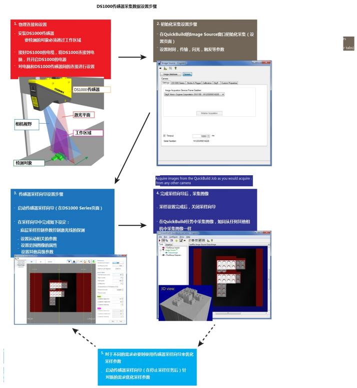

# 位移传感器采集向导

以下内容介绍了位移传感器采集向导的使用方法。位移传感器采集向导包含了大部分与位移传感器有关的参数，可以帮助你轻松设置传感器。你可以通过点击选项卡或在当前选项卡中点击下一页或返回按钮来浏览向导选项卡。

该向导为显示的图像提供了与 QuickBuild 作业显示图像相同的菜单选项（可通过右键单击图像），例如缩放、平移以及图像拟合等选项。

# 相机设置选项卡

相机设置选项卡持续显示 GigE 相机所看到的含有扫描线搜索结果(1)的亮度图像。该选项卡包含了大部分低级采集控制参数，包括工作关注区域的顶部(2)和底部(3)选择项。顶部和底部选择项定义了在工作区域中执行查找的区域范围。（激光线查找也可被称为在其它地方找到的明亮的条纹曲线）该选项卡同时还显示了在位移传感器中直接读取到的当前设置的“最高线速率”。你也可以通过点击“暂停”或“播放”按钮来暂停或继续图像采集。

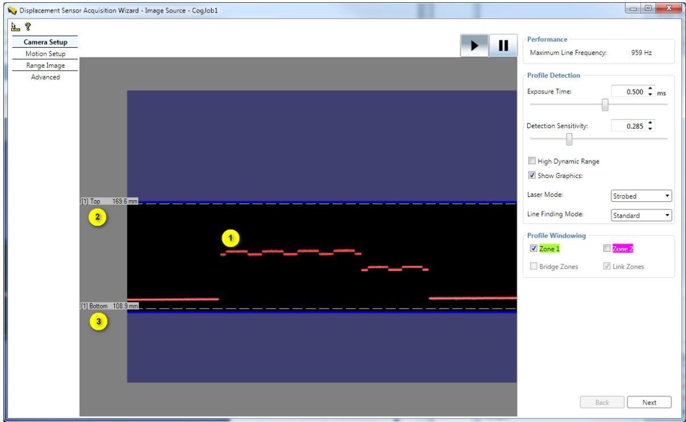

“最高线速率”以及运行速度的限制由在该选项卡中的设置而决定。在大多数情况下该选项卡中的默认参数可以被用来产生可用的深度图像，但是得到的“最高线速率”会相对较低。不过，图像采集的性能可以通过优化速度参数而极大改进。

# 移动设置选项卡

移动设置选项卡持续显示由传感器(1)所采集到的深度图像。深度图像将以瀑布图像的方式显示，小范围内的深度图像部分会被采集，然后被连续添加到所显示的深度图像中。该选项卡包含了与移动相关的参数，例如编码器设置以及 X 和 Y 比例设置等。该选项卡的一个典型的使用案例为，当一个在传送带上运行的物体在传感器下方通过时对其进行检测。

如需：

在当前位置暂停或恢复深度图像采集时，可以点击“暂停” (||) 或“运行” (>) 按钮 (2)。

在当前位置重新开始深度图像的采集时，可以点击在“编码器计数”选项旁的“重置”按钮(3)。

删除当前显示的深度图像，可以点击“删除”按钮(X) (4)。

在向导中为所显示的深度图像选择灰色或彩色色调时，可以点击“灰色色调”或“彩色色调”按钮(5)。

点击调整深度图像大小以使其适应最大水平工作区域的大小(6)。

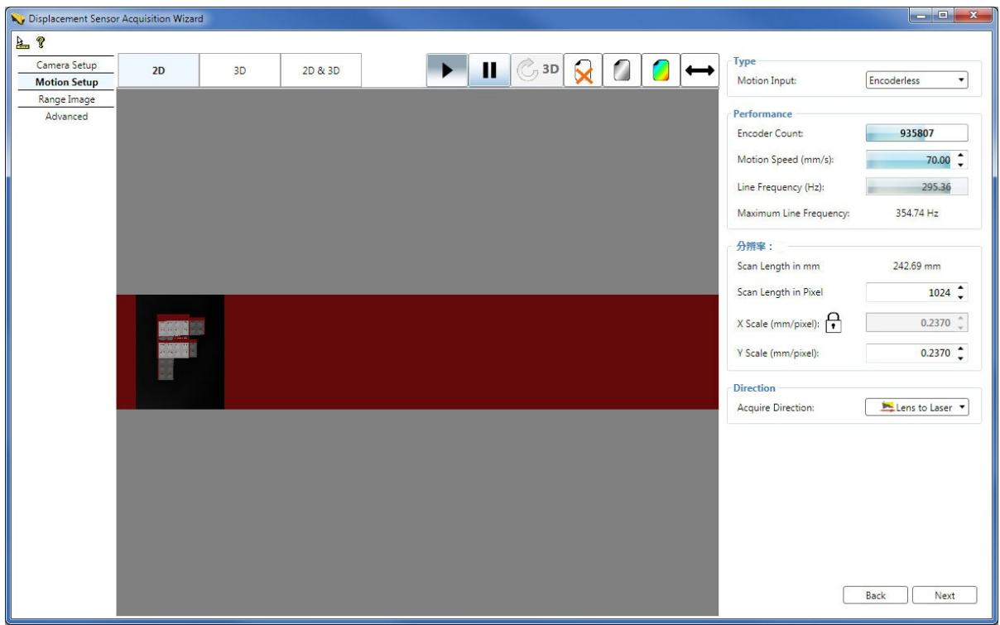

当前移动速度以及与之相关的当前线速率同样会在该选项卡中显示。如果当前移动速度以及与之相关的线速率超过了限制，并导致传感器不能在“最高线速率”中规定的时间内采集并处理每条深度图像线，且发生编码器超限错误，“移动速度”以及“线速率”区域将会以红色显示。

在物体可向前或向后移动的情况下，如果使用的是双通道编码器，则系统将跟踪向后的移动。瀑布图像的采集将不会重新开始，直到向前的移动返回到向后移动开始的点，或“重置”按钮被点击。

# 查看 3D 深度图像

你可以在图像采集向导的 3D 查看器(1)中查看采集到的 3D 深度图像。通过点击 3D 按钮(2)可以查看 3D 图像或点击 2D& 3D 按钮以同时查看 2D 和 3D 图像。

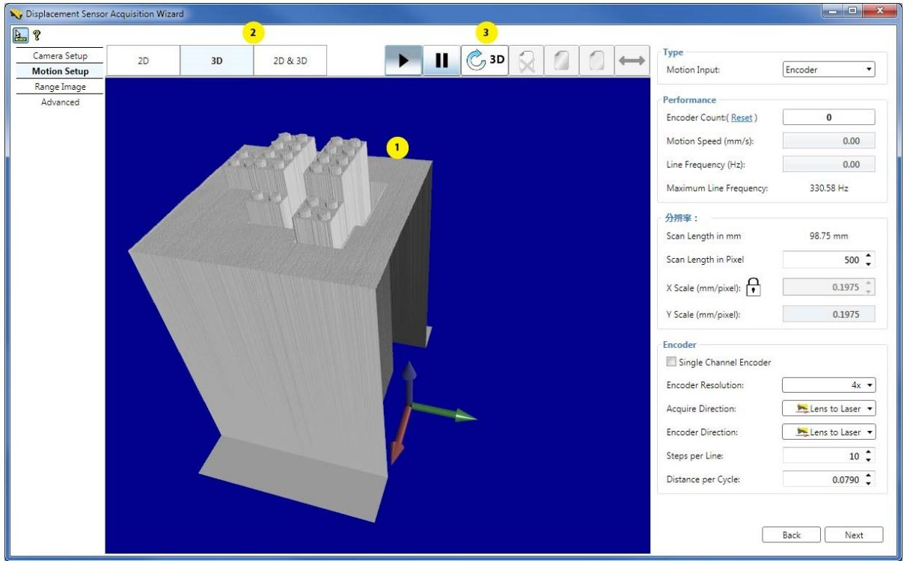

在 3D 查看器中显示的深度图像同时显示了与深度图像相关的 3D 传感器（Sensor3D）的坐标空间。

如果需要刷新 3D 显示，可以点击 “3D 刷新”按钮(3)。

# 深度图像选项卡

深度图像选项卡连续显示由传感器采集到的深度图像，同时在向导中可以对主要的深度图像参数进行进一步设置。这些参数包括图像宽度、深度图像第一个像素的位置、坐标原点以及高度比例等。

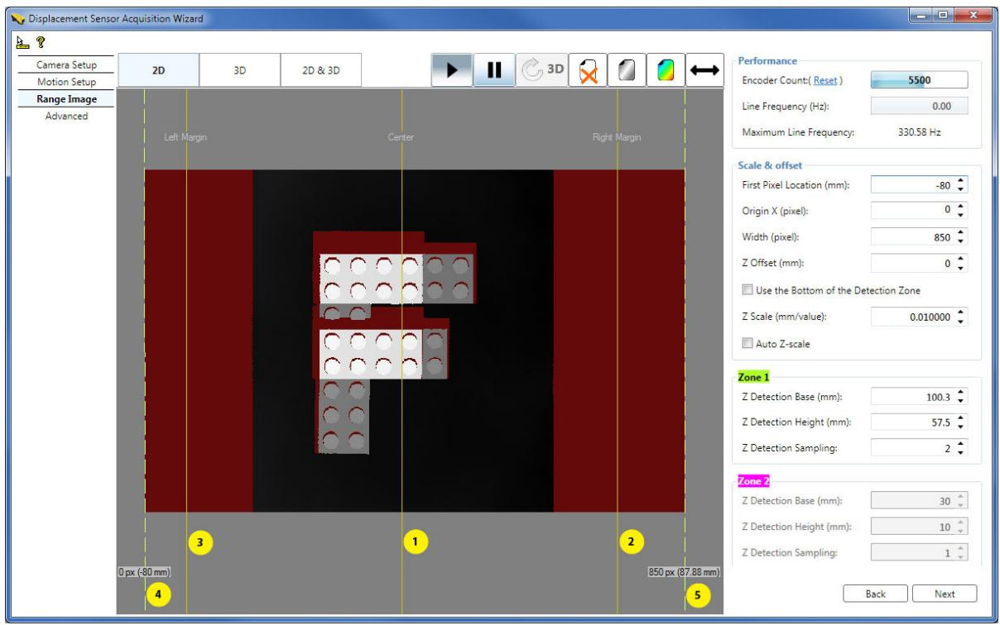

通过向导可以定义这些参数：

1. 中心线，在采集到的深度图像中标出工作区域的中间位置。  
2. 右边距，在采集到的深度图像中标记从镜头到激光线方向右侧可看到的工作区域的最大范围。  
3. 左边距，在采集到的深度图像中标记从镜头到激光线方向左侧可看到的工作区域的最大范围。  
4. 深度图像左边第一个像素的虚线标记线，标记采集到的深度图像的左边界。

你可以点击并移动该标记线。注意：默认情况下第一个像素的标记线会与左边距标记线在同一位置，即工作区域的开始位置。 因此，当两条线重合的时候，虚线可能会看不到。你可以通过移动公共区域以及左边距标记线来看到隐藏在后面的虚线标记线。

5. 深度图像右边最后一个像素的虚线标记线，标记采集到的深度图像的右边界。

你可以点击并移动该标记线。注意：默认情况下最后一个像素的标记线会与右边距标记线在同一位置，即工作区域的结束位置。 因此，当两条线重合的时候，虚线可能会看不到。你可以通过移动公共区域以及右边距标记线来看到隐藏在后面的虚线标记线。

通常情况下，你可以在新采集到的深度图像中观察到标记线调整后的效果。

同样，你也可以通过调整参数值来定义工作关注区域。该数值可以在“区域”参数中调整。

# 高级选项卡

高级选项卡包含了高级采集参数设置。在一般的图像采集情况下，通常不需更改这些参数的默认设置。通过高级选项卡可以设置位移传感器中 GigE 相机的对比度、定义输出图像类型的相机模式、输出像素格式、从哪个编码器计数开始采集、当图

像线触发比需要采集和处理该线的时间快时是否需要忽略由此产生的错误、以及当移动方向与默认设置不同时是否需要自动调整深度图像的行次序等参数。

该选项卡同时显示了正由图像采集向导所采集到的深度图像。

# 故障排除

如果采集系统检测到问题，图像采集向导会发出相关警告信息。下面的图例显示了当传感器和电脑的网络连接发生错误时向导所显示的警告信息。

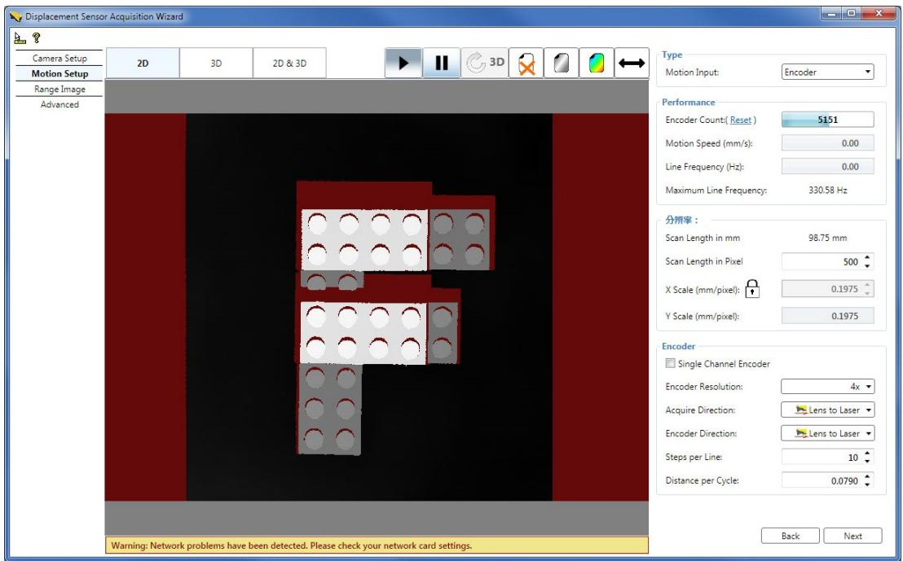

当检测到计算机无法在规定时间内处理所采集的深度图像时，图像采集向导也会显示警告信息，且采集到的深度图像可能会无法完整显示。

# 快速采集设置

该部分介绍了快速采集设置的基本步骤以帮助你更方便快捷地使用位移传感器来采集深度图像。以下的采集设置适用于最常用的被检测物体按照从镜头到激光线方向以一个恒定的速度（通常在传送带上）在传感器下通过，且使用快速设置（QuickBuild）来执行采集的案例。在完成采集设置且成功采集到深度图像之后，你可以在具体的深度图像采集设置信息基础上对你的采集设置进行进一步的优化。

# 1. 硬件及连接设置

注意！当安装和操作 DS900 和 DS1000 系列传感器时，请确保你知道并且遵守传感器的安全操作说明。有关传感器的安全操作说明，请参见 DS900 快速参考指南、DS1000 快速参考指南以及 DS1000 技术参考手册。

将 DS900 或 DS1000 系列传感器安装在检测物件可以通过其工作区域的位置。工作区域为传感器内相机可见的激光平面部分。也就是说，工作区域为相机视野与激光平面相交的区域。安装相机并使其激光平面垂直于物体运动的方向；激光平面与由传感器高精度平面安装定位点限定的平面对齐。同时，确保传感器的光学中心线（与激光平面对齐的、穿过主定位点和位置定位点中心的线）与你想要测量的高度的方向对齐。

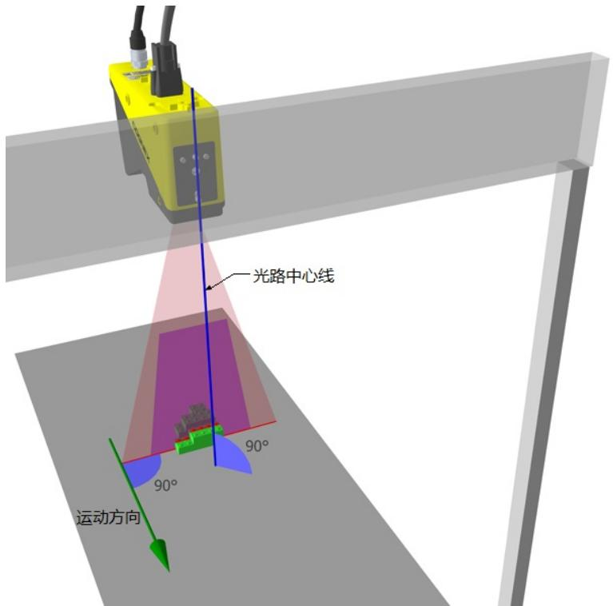

根据 DS900 快速参考指南或 DS1000 快速参考指南中的介绍设置位移传感器的连线，将其与计算机连接并接通电源。

配置计算机与传感器之间的连接。位移传感器有一个用来观察通过工作区域物件的 GigE 相机。在连接并接通传感器的电源后，可以通过使用 “GigE 视觉配置工具” 在网络上将传感器作为通用 GigE 相机来进行配置。在开始菜单中，选择所有程序->Cognex->VisionPro->实用工具->GigE 视觉配置工具来启动工具。配置网络接口卡 (NIC) 和相机的 IP 地址。

# 2. 初始采集配置步骤

首先，在 QuickBuild 的图像来源窗口中选择你的位移传感器作为图像来源，然后在“设置”选项卡中点击初始化采集。

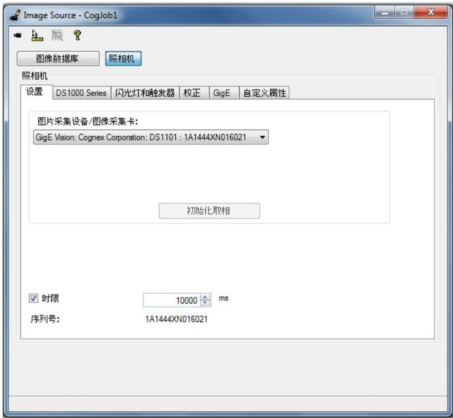

你可以不做任何修改，直接使用默认的时间、传输、脉冲以及触发参数作为初始的深度图像采集参数。

# 3. 位移传感器采集向导配置步骤

在 DS1000 系列/DS900 系列选项卡中，通过点击启动向导...来启动位移传感器采集向导。

注意：启动采集向导后，激光会亮起，除非激光模式（LaserMode）被设置成关闭状态。

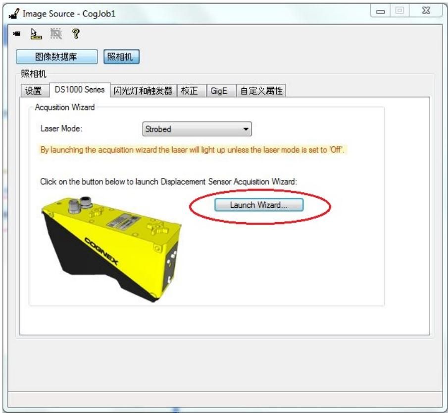

位移传感器采集向导：

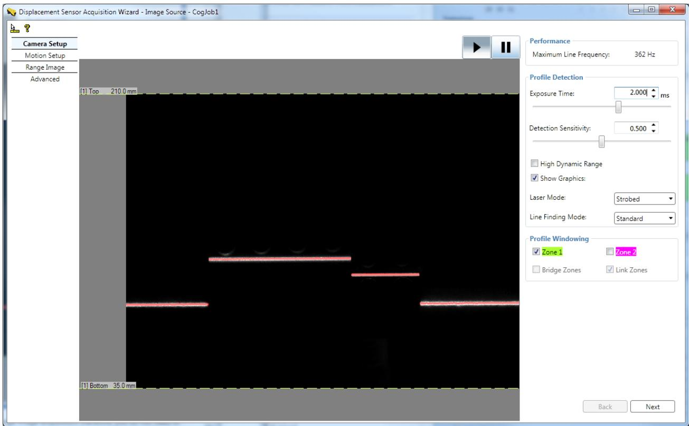

用来控制激光线检测且在“相机设置”选项卡中可以设置的默认低级采集控制参数适用于初始深度图像采集。你可以不做任何修改，直接使用这些默认参数。

# 移动设置

在“移动设置”选项卡中，在确保选择“无编码器”选项（默认）后，输入被检测物体在传感器下通过的速度值。通过设置 Y 轴比例（ Y Scale），你可以选择所需的 Y 轴分辨率（毫米/像素）。为了使在深度图像中出现的特征以在实际世界中相同的长宽比来显示，点击 X 轴比例（X Scale）旁的图形锁以使其自动更新到与 Y 轴比列（ YScale）同步的值。通过点击“采集方向”按钮 (AcquireDirectionPositive) 来定义采集方向。

将需要检测的部件放到传送带上，当其通过工作区域时观察图像采集向导采集深度图像。

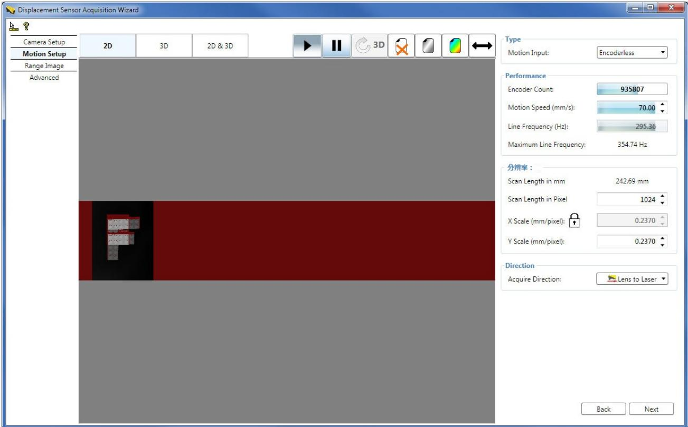

使用色彩图像控件 (Colormap Control)，通过放大含有高度变化的高度范围，可以增强深度图像的可视性。右击显示的深度图像，选择色彩图像...，选择需要预定义的色彩图像（截图中使用的是灰色），然后点击调整。

如果你设置的“移动速度”与由此产生的“线扫描速率”超过了限制，并导致传感器不能在“最高线速率”中规定的时间内采集并处理每条深度图像线，且发生编码器超限错误，“移动速度”以及“线扫描速率”区域将以红色显示且缺失像素的红色水平线会显示在深度图像中。

因为移动速度对于视觉系统来说是恒定的属性，为避免发生缺失扫描线的情况，你可以尝试以下方法：

l 通过提高初始深度图像采集的 Y 轴比例 (Y Scale) 和 X 轴比例 (X Scale) 的值来降低深度图像分辨率。  
l 执行 DS900 系列传感器图像采集以及 DS1000 系列传感器图像采集帮助 - 在优化速度章节中推荐的采集参数优化设置步骤。

# 深度图像设置

在“深度图像”选项卡中，点击并移动以虚线标记的第一像素和最后像素标记线以确立深度图像的水平大小。在新采集到的深度图像中可以观察到标记线调整后的效果。

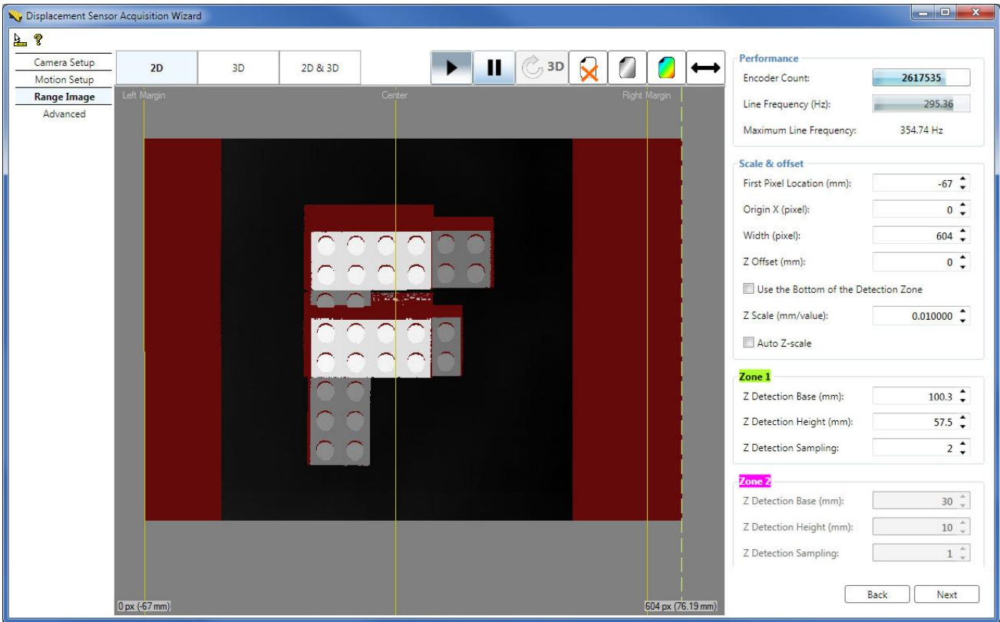

在“移动设置”选项卡中，设置“扫描长度”以定义从作业中采集到的深度图像的垂直大小。

关闭位移传感器采集向导。

注意：每次关闭采集向导时，以下内容会被自动保存：

l X 轴比例（X Scale）锁定状态。  
l Z 轴比列 （Z Scale ）自动设置选项框状态。  
l 使用检测区底部区域的选项框状态。  
l 显示图形选项框状态。

4. 从作业采集（在关闭位移传感器采集向导之后）

关闭位移传感器采集向导之后，你就可以开始从作业采集深度图像。

注意：不支持同时从作业和向导同时采集图像。尽管有时看起来可以同时运行，但作业将不能可靠地采集图像，因为作业与采集向导不能同时访问相机。

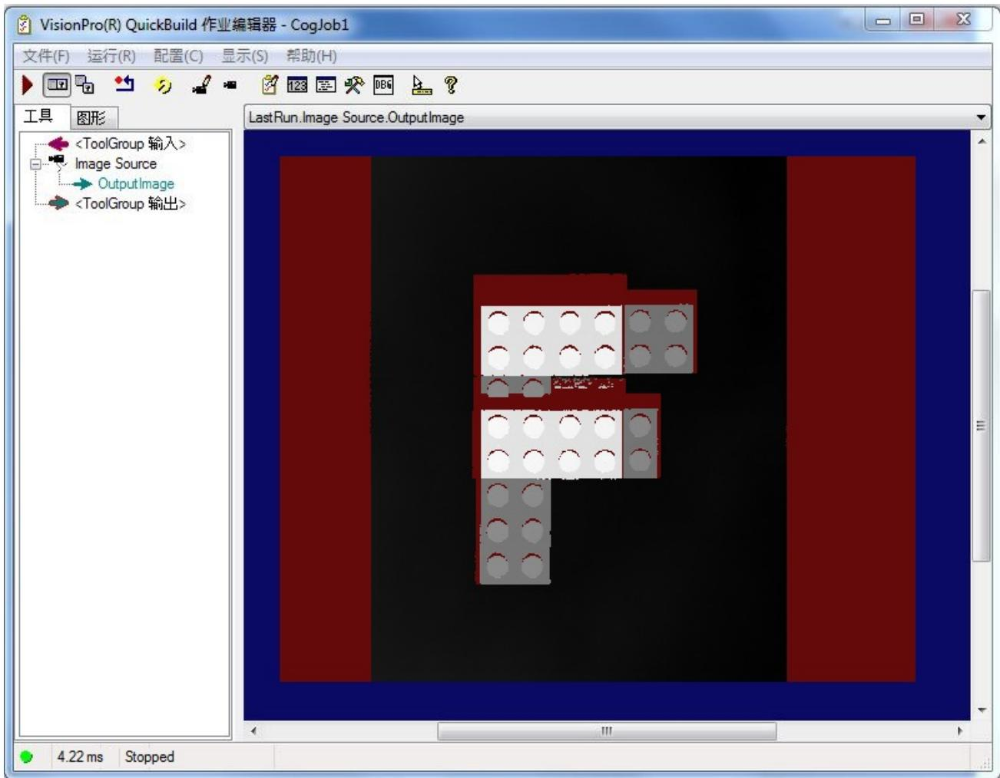

通过 3D 深度图像查看器、或使用 Cog3DDisplay 控件以及相关的 Cog3DDisplayHost 控件，你可以查看采集到的图像的 3D 视图。

# 5. 在快速设置后优化并完成采集设置

在完成之前的快速设置步骤并成功采集到深度图像后，你可以通过设置以下内容来完成采集设置：

l 设置一个具体的物理编码器（如果你使用编码器）。  
l 设置低级采集参数来提高深度图像的质量。例如，通过设置参数来避免杂散反射或过度曝光。  
l 优化速度以及\或与深度图像相关的 3D 传感器 (Sensor3D) 坐标空间的 X、Y 和 Z 轴的分辨率。

你可以通过先停止从作业采集图像，然后重新打开位移传感器采集向导的方法来完成采集参数的设置。完成之后，关闭采集向导然后重新从作业开始采集。

# 从 DS1000 系列传感器采集图像

该主题包含以下内容。

l 采集设置步骤   
图像采集参数优化

l 优化采集速度  
优化 Z 轴分辨率  
优化 Y 轴分辨率  
优化 X 轴分辨率  
在长宽比保持不变的情况下根据具体的分辨率需求来设置图像采集参数

l 支持 DS1000 系列传感器的相机功能

该章节介绍了在 VisionPro 8.4 中使用 DS1000 系列传感器来采集深度图像（描述三维物体高度轮廓）的具体步骤。在按照以下步骤设置了传感器之后，你就可以像使用其它任何通用相机一样开始采集图像。有关详情，请参阅 DS1000 主题中的开始采集。同时，还可以参考 DS1000 快速参考指南。

深度图像行(或线)会基于采集到的亮度图像而生成。

你可以通过设置 DS1000 系列传感器的采集参数以达到一定的操作效果(例如，更改采集速度或按照特定的分辨率来采集)。在采集设置过程中，你必须对以下参数类型进行设置：

l 低级别采集控制参数，该类型参数可以被用来控制 DS1000 系列传感器上 GigE 相机的 CMOS 图像传感器属性。这些参数包括曝光、对比度、Z 轴探测基准和高度、Z 轴探测取样以及探测灵敏度设置。  
l 与移动有关的参数，该类型参数可以被用来追踪物体在通过传感器工作区域时的移动轨迹。这些参数包括编码器设置和移动方向设置。  
l 深度图像属性，该属性可以被用来控制所生成的深度图像的特性。这些参数包括原点、比例以及图像宽和高的设置。  
l 闪光灯和触发设置，该设置可以被用来控制激光和触发行为。该参数包括激光模式和触发模式。  
l 时间和传输参数。

这些参数包括采集超时、传输超时、传输数据包大小以及延时级别。

首先，你需要设置初始深度图像采集。位移传感器采集向导将帮助你轻松设置传感器。采集向导包括了多数与 DS1000 系列传感器有关的参数且在图像来源窗口中的 DS1000 系列传感器选项卡中可使用该采集向导。

接着，为使传感器达到一定的操作效果，你可能需要对一些参数进行调整。例如，降低采集速度以得到更高的分辨率等。这些都可以通过协调各参数而达到。

传感器设置完成后，你可以关闭位移传感器采集向导和图像来源窗口。然后可以像从其它任何通用相机采集图像一样开始从作业采集图像。

以下章节介绍了 DS1000 系列传感器初始深度图像采集的设置步骤、为达到一定操作效果而进行的参数优化以及部分相机支持功能的摘要。

# 采集设置步骤

执行以下步骤来设置 DS1000 系列传感器的采集设置：

配置初始采集设置：

1. 安装、连线以及接通传感器的电源  
2. 配置计算机和传感器之间的连接  
3. 初始化采集  
4. 设置时间和传输参数  
5. 设置闪光灯和触发器参数

使用位移传感器采集向导来完成以下采集步骤：

6. 在相机设置选项卡中设置低级采集控制参数  
7. 在移动设置选项卡中设置移动采集参数  
8. 在深度图像选项卡中设置深度图像属性  
9. 在高级选项卡中设置高级参数（在大多数情况下不需要）  
10. 设置坐标空间（可选）  
11. 关闭采集向导然后开始采集深度图像

# 配置初始采集设置

# 1. 安装、连线以及接通传感器的电源

根据在 DS1000 快速参考指南中的介绍来安装、连线并接通传感器的电源。

# 2. 配置计算机和传感器之间的连接

DS1000 系列传感器有一个用来观察通过工作区域物体的 GigE 相机。在连接并接通传感器的电源后，可以通过使用“GigE视觉配置工具”在网络上将传感器作为通用 GigE 相机来进行配置。在开始菜单中，选择所有程序->Cognex->VisionPro->实用工具->GigE 视觉配置工具来启动工具。配置网络接口卡 (NIC) 和相机的 IP 地址。

# 3. 初始化采集

有三个方法可以被用来初始化 DS1000 系列传感器：在 QuickBuild 图像源，通过编程或使用 CogAcqFifoTool 和CogAcqFifoEditV2 控件。你可以在 Windows 窗体应用程序中使用 CogAcqFifoEditV2 控件。

如果使用 QuickBuild，选择 DS1000 系列传感器作为图像来源，并在“设置选项卡”中点击“初始化采集”。

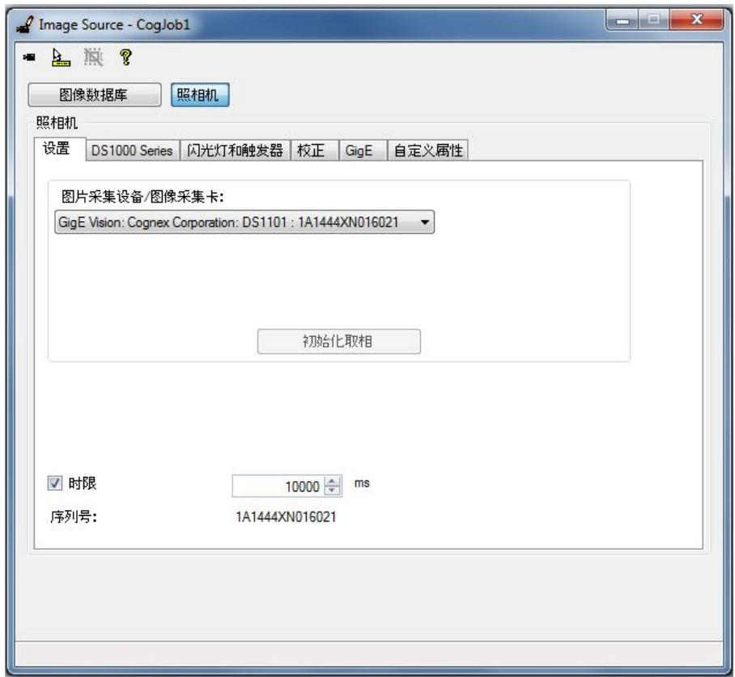

如果使用API，在调用 CogFrameGrabberGigE.CreateAcqFifo 时，你必须指定一个特定视频格式，如下所示：

Fg.CreateAcqFifo(“Cognex NullFormat“, CogAcqFifoPixelFormatConstants.Format8Grey,0,true)

点击之后，会列出使用 QuickBuild 图像源进行采集设置的更多步骤。

# 4. 设置采集时间和传输参数

在“设置”选项卡中，你可以启用并设置采集超时（Timeout）时间。在调整超时时间时，需要知道深度图像的行数以及采集一行所需的时间。这些因素对于采集一张深度图像所需的时间会有很大影响。在进行初次采集设置时， Cognex 建议你禁用超时设置，或设置一个非常大、不可能达到的超时时间值。

在 GigE 选项卡中，你可以指定传输超时时间 (TransportTimeout) 以确定相机发送图像所需的最大时间值。在进行初次采集设置时，Cognex 建议你使用该参数的默认设置 (2000 ms)。你也可以指定 GigE 视觉性能驱动程序的延迟级别(LatencyLevel) 参数， 默认值为3。该值允许低 CPU 负载，但会增长延时并降低可靠性。如果将该值设置为 0，可以减少延时并增加采集的可靠性，但需要使用更多的 CPU。

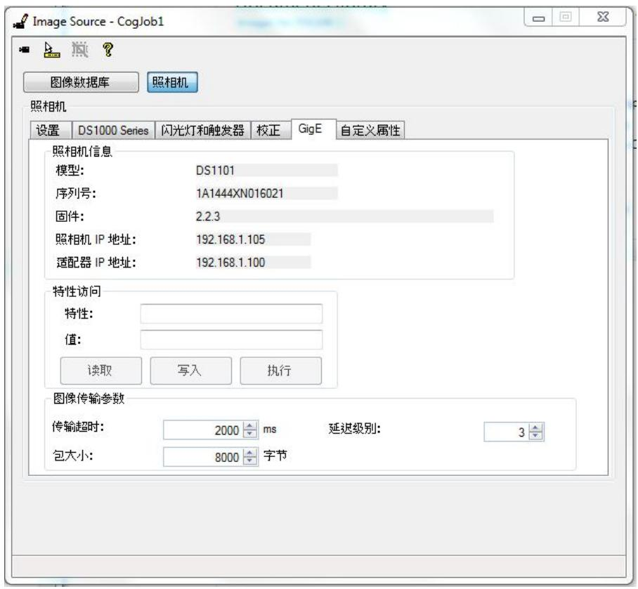

# 5. 设置闪光灯和触发器参数

闪光灯和触发设置可以被用来控制激光和触发行为。这些参数的默认设置适用于初始采集设置。

该部分包含以下内容。

l 激光模式  
触发模式和类型  
l 触发信号

# 激光模式

在 DS1000 系列选项卡中，指定操作的激光模式（ LaserMode）：

l 闪光灯 - 激光在采集进行时打开  
l 开启 - 激光一直开启。该选项在安装传感器的时候非常有帮助：它可以在不需要采集图像的情况下，帮助你将传感器安装在“工作区域”对准的正确位置。  
l 关闭 - 激光关闭

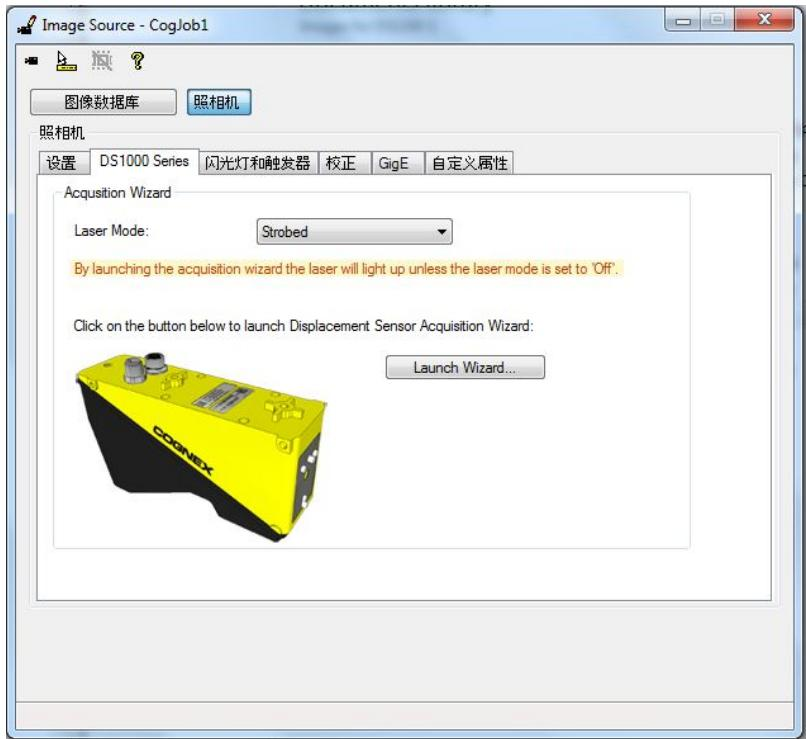

通过使用以下采集步骤，你可以更改在位移传感器采集向导中的设置。

# 触发模式和类型

在“闪光灯和触发器”选项卡中，你可以指定触发模式 (TriggerMode)，为采集指定触发参数(不论你采集的是亮度图像、带图形的亮度图像或深度图像)：

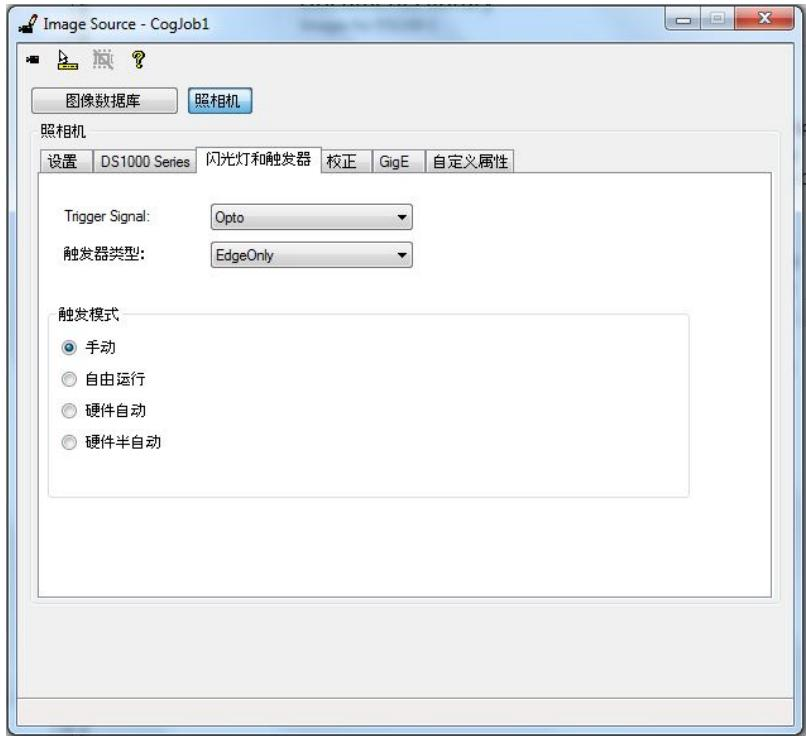

l 手动 - 当你在 QuickBuild 中点击“运行”或从 API 调用 StartAcquire 时，无需外部触发传感器就会采集一个图像。  
l 自由运行

通过 API 设置时，传感器在最高线速率下连续采集图像。最高线速率与采集一张亮度图像、处理图像并生成深度图像线所需的线扫描时间成反比。线扫描时间将在以下部分详细描述。你的应用必须调用 CompleteAcquire 来得到下一个可用图像。

通过 QuickBuild 设置时，点击“运行”，将只采集一个图像(相当于“手动”模式)。如需采集或处理多个图像，你必须点击“连续运行作业”按钮。当“触发模式”被设置为"自由运行"且作业连续运行，图像之间将不会有任何间隙。该设置允许部件比相机在单个采集中所能采集到的图像长，然后可以通过采集多个图像把它们接在一起。例如，采集 10 个 5000 线的图像而不是一个 5000 线的图像。

# l 硬件自动

l 如果“触发类型 (TriggerType)”被设置到 EdgeOnly：

通过 API 设置时，传感器在外部触发线上检测到一个低->高电平沿时会采集一个图像。你的应用必须调用CompleteAcquire 来得到下一个可用图像。

通过 QuickBuild 设置时，点击“运行”后，且在外部触发线上检测到一个低->高电平沿时传感器会采集一个图像。如需采集多个图像，点击“连续运行作业”，传感器会采集多个图像(每一次在外部触发线上检测到一个低->高电平沿时会采集一个图像)。

l 如果“触发类型 (TriggerType)”被设置到 EdgeAndLevel：

通过 API 设置时，传感器在外部触发线上检测到一个低->高电平沿时会采集一个图像，并且在外部触发线的电平保持在高位的情况下，持续采集更多图像。当外部触发线的电平发生高 $- \rangle$ 低转换时，传感器在完成当前图像采集后将停止采集更多图像。你的应用必须调用 CompleteAcquire 以在每个图像采集后得到下一个可用图像。

通过 QuickBuild 设置时，点击“运行”后，且在外部触发线上检测到一个低->高电平沿时传感器会采集一个图像。如需采集多个图像，点击“连续运行作业”按钮，当传感器在外部触发线上检测到一个低->高电平沿时会采集一个图像，并且在外部触发线的电平保持在高位的情况下，持续采集更多图像。当外部触发线的电平发生高 低转换时，传感器在完成当前图像采集后将停止采集更多图像。

将外部触发线的电平保持在高位(在电平沿发生低->高转换后进行了初始图像采集后)对于检测长度长于最大单个图像尺寸的部件或长短不一的部件时非常有用。对于长度长于最大单个图像尺寸的部件，可以将在单次触发（从低->高到高 低水平转换）下采集的一组图像拼贴在一起以形成一张更大的图像。

# 注意

l 如果图像采集被高 低电平转换所停止，且在当前(最后一张)图像采集结束前外部触发线上有一个低->高电平沿转换，那么在该低->高电平沿转换时，不会采集任何图像，且会发出isMissed 错误信息。如果发出 isMissed 错误信息，之后的多个图像采集将只能通过低->高电平沿转换来触发(在当前最后一张图像采集完成之后)，仅保持高电平状态将不能触发采集。注意，在该示例中高->低电平沿转换只能触发采集一张图片。  
l 如果你需要对一个长部件进行多次图像采集，在触发线工作时请不要更改任何采集属性。在此时更改属性会导致采集停止。如果在采集过程中更改了采集属性，之后的多个图像采集将只能通过低->高电平沿转换来触发(在当前最后一张图像采集完成之后)，仅保持高电平状态将不能触发采集。注意，在该示例中高->低电平沿转换只能触发采集一张图片。  
l 采集错误(例如，如果IgnoreTooFastEncoder 没有被选择，就会产生IsTooFastEncoder 错误)会导致停止采集更多图像。如果你在对一个长部件进行多次图像采集时遇到采集错误，建议你放弃所有之前所采集的图像。如果出现采集错误，之后的多个图像采集将只能通过低->高电平沿转换来触发(在当前最后一张图像采集完成之后)，仅保持高电平状态将不能触发采集。注意，在该示例中高->低电平沿转换只能触发采集一张图片。

# l 硬件半自动

l 如果“触发类型 (TriggerType)”被设置到 EdgeOnly：

通过 API 设置时，如果你在检测到触发之前调用了StartAcquire，那么当传感器在外部触发线上检测到一个低->高电平沿转换时会采集一个图像。你的应用必须调用 CompleteAcquire 来得到下一个可用图像。

通过 QuickBuild 设置时，点击“运行”后，且在外部触发线上检测到一个低->高电平沿时传感器会采集一个图像。如需采集多个图像，点击“连续运行作业”，传感器会采集多个图像(每一次在外部触发线上检测到一个低->高电平沿时会采集一个图像)。（在 QuickBuild 中，等同于硬件自动模式。）

l 如果“触发类型(TriggerType)”被设置到 EdgeAndLevel：

通过API 设置时，如果你在检测到触发之前调用了StartAcquire，那么当传感器在外部触发线上检测到一个低->高电平沿转换时会采集一个图像。即使外部触发线保持在高电平状态，传感器也将不再采集更多图像(或在两幅图像间出现不可预知的间隙)。你的应用必须调用 CompleteAcquire 来得到下一个可用图像。

通过 QuickBuild 设置时，点击“运行”后，且在外部触发线上检测到一个低->高电平沿时传感器会采集一个图像。如需采集多个图像，点击“继续运行作业”按钮：

l 如果之前没有多个采集任务等待，在点击“继续运行作业”按钮之后，传感器在每个低->高电平转换时会采集多个图像。即使外部触发线保持在高电平状态，传感器也将不再采集更多图像(或在两幅图像间出现不可预知的间隙)。  
l 如果有多个采集任务等待(等于或多于2 个)，在点击“连续运行作业”按钮后，当传感器在外部触发线上检测到一个低->高电平沿时会采集一个图像，并且在外部触发线的电平保持在高位的情况下，持续采集更多图像。当外部触发线的电平发生高->低转换时，传感器在完成当前图像采集后将停止采集更多图像。

注意，在有多个采集任务(等于或多于2 个)等待的情况下：

l 如果采集被高->低电平转换所停止，且在当前(最后一张)图像采集结束前在外部触发线上有一个低->高电平沿转换，那么在该低->高电平沿转换时，不会采集任何图像，且会发出 isMissed 错误信息。如果发出 isMissed 错误信息，之后的多个图像采集将只能通过低->高电平沿转换来触发(在当前最后一张图像采集完成之后)，仅保持高电平状态将不能触发采集。注意，在该示例中高->低电平沿转换只能触发采集一张图片。  
l 如果你需要对一个长部件进行多次图像采集，在触发线工作时请不要更改任何采集属性。如果在此时更改属性，在完成此前所等待的图像采集后，采集会中止。如果在采集过程中更改了采集属性，之后的多个图像采集将只能通过低->高电平沿转换来触发(在当前最后一张图像采集完成之后)，仅保持高电平状态将不能触发采集。注意，在该示例中高 低电平沿转换只能触发采集一张图片。  
l 采集错误(例如，如果 IgnoreTooFastEncoder 没有被选择，就会产生 IsTooFastEncoder 错误)会导致停止采集更多图像。如果你在对一个长的部件进行多次图像采集时遇到采集错误，建议你放弃所有之前所采集的图像。如果出现采集错误，之后的多个图像采集将只能通过低 $- \rangle$ 高电平沿转换来触发（在当前最后一张图像采集完成之后），仅保持高电平状态将不能触发采集。注意，在该示例中高->低电平沿转换只能触发采集一张图片。

# 触发信号

触发信号（TriggerSignal）控件允许你选择差分触发或光电触发信号。触发信号的设置将改变相机输入触发线的电子特 性。

差分触发应该仅在 Cognex 支持的电源和 I/O 电缆直接连接 DS1000 系列相机与 Cognex 视觉控制器的传感器1（SENSOR1）或传感器2（SENSOR2）时使用。其它所有配置，请选择光电触发（Opto）。

# 通过使用位移传感器采集向导来完成 DS1000 采集设置：

点击在 DS1000 系列选项卡中的启动采集向导... 来启动位移传感器采集向导。

注意：启动采集向导后，激光会亮起，除非激光模式（LaserMode）被设置为关闭状态。

位移传感器采集向导：

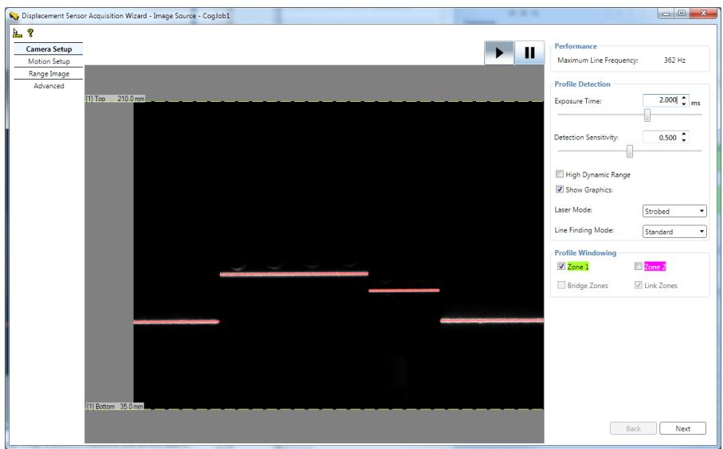

执行以下仅适用于 DS1000 传感器的步骤来完成对 DS1000 传感器的采集设置：

# 6. 在相机设置选项卡中设置低级采集控制参数

低级采集控制参数可以被用来控制 DS1000 系列传感器中的 GigE 相机内的 CMOS 图像传感器属性。这些参数的默认设置适用于初次采集设置以及大部分的图像采集情况。

采集参数的相机设置选项卡将持续显示 GigE 相机看到的扫描线搜索结果（又被称为明亮的条纹曲线搜索结果）的亮度图像。相机设置选项卡中还包含大多数的低级采集控制参数。该选项卡同时还显示从 DS1000 传感器中读取到的当前设置的最高线速率。

你可以使用亮度图像或带图形的亮度图像来验证需要检测的部件是否在 DS1000 系列传感器的相机中正确显示。例如，你可能需要验证激光是否在所有需要检测的目标部件中出现。其它使用范例包括设置如下所述的正确激光反射等。

# 设置图像轮廓检测参数：曝光时间、激光探测灵敏度、高动态范围、线搜索模式、激光模式以及对比度

在相机设置选项卡中，你可以设置相机的曝光时间（以ms 为单位）。曝光时间越长，相机收集到的检测时从部件表面反射回的激光扫描线信息越多，因此经常被用于反射不强的表面(例如深暗的表面)。

对于使用采集到的亮度图像设置曝光时间的建议：

l 如果可能，避免将曝光时间设置到过度饱和。  
l 争取将激光扫描线的像素值控制在 40 到 245 之间的范围。  
l 如果可能，将曝光时间设置到尽量短以减少或避免杂散反射。

一般来说，曝光时间的设置应使得在带图形的亮度图像中的激光扫描线比软件画出的红线略窄一些(该红线显示软件所检测到的激光扫描线的位置)。（有关亮度图像的详情可参见以下图例）。

以下图例显示的是理想的曝光时间设置：

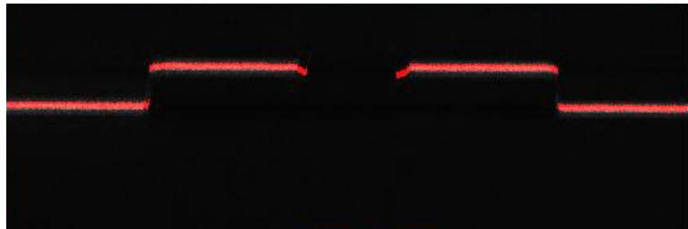

曝光略微过度：

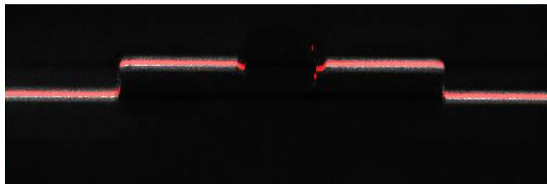

过度曝光：

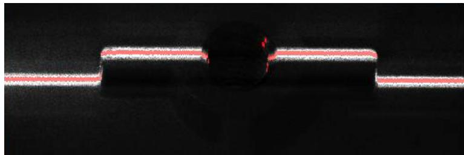

曝光时间过长可能会降低最高线扫描速率。

设置激光探测灵敏度 (DetectionSensitivity)参数。该参数的值越高，激光扫描线越容易被找到。同时曝光设置可以更低，线扫描速率可以更高。该参数的值如果设置较低，则能避免在激光模糊的区域误把干扰当成激光。

你可以启用高动态范围 (HighDynamicRange)以使用多次曝光来提高动态范围。这在激光扫描线需要同时扫描黑暗或高反射区域的时候非常有用。启用高动态范围(HighDynamicRange)会降低最高线扫描速率。

如果你想在相机设置选项卡中查看亮度图像，你可以禁用显示线搜索图形选项。

你可以在相机设置选项卡中按照之前的说明来设置操作的激光模式 (LaserMode)。

你可以指定线搜索模式（API 中为 LaserDetectionMode）。将该选项设置为“快速”，最高线扫描速率会提高，但准确率会下降。该参数的默认设置为“标准”模式。注意，在“快速”模式下适合的曝光时间设置可能会与“标准”模式下的设置有所不同。亮度图像在“快速”模式下会显得更亮一些，因此你可能需要减少曝光时间来避免亮度过度饱和。减少曝光时间可能会导致额外的线扫描速率增加。

在高级选项卡中，你可以设置 GigE 相机的对比度。

# 设置图像轮廓区域参数：每个检测区域的顶部和底部

在相机设置选项卡中，设置图像轮廓参数：激活区域 1 和/或区域 2，设置每个区域的顶部和底部区域，设置顶部和底部区域是否连接，设置是否合并顶部和底部区域。

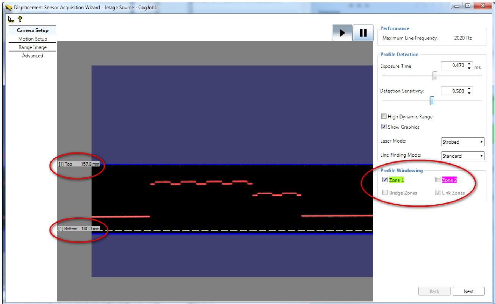

默认情况下，区域 1 是会被检测的高度范围（以 mm 为单位）。通过移动图像中标识高度范围的虚线来设定区域 1 的顶部和底部。区域的顶部和底部定义了区域的 Z 轴探测基准 (ZDetectionBase)和 Z 轴探测高度 (ZDetectionHeight)。高度范围和工作区域的交汇处为“工作关注区域”。

有时，采集到的图像的高度可能会比工作关注区域的高度限制略高或略低。因此，请不要使用高度限制（顶部和底部以及相关联的 Z 轴探测基准 (ZDetectionBase)和 Z 轴探测高度 (ZDetectionHeight)参数）来过滤超过高度限制的高度范围；而应该把由这些高度限制定义的范围看作采集系统可以确保扫描线进行搜索的区域且在此高度范围内的特征会在采集到的图像中显示。

注意，虚线标注仅是大致范围。

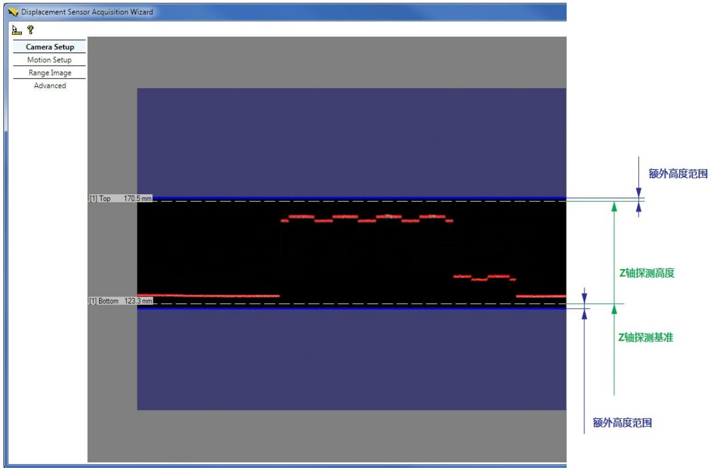

注意，以上图像显示的是在相机中看到的带图形的亮度图像的 Z 轴探测基准 (ZDetectionBase) 和 Z 轴探测高度(ZDetectionHeight) 高度。如果降低 Z 轴探测基准 (ZDetectionBase) 并保持 Z 轴探测高度 (ZDetectionHeight)，那么在 Z 轴探测高度 (ZDetectionHeight) 中指定的区域在带图形的亮度图像中就将比原来的区域看上去更窄一些。这是因为向“工作区域”底部移动的高度区域离相机较远，因此在亮度图像(或带图形的亮度图像)中的显示就会较小。

注意，你可以在采集向导的深度图像选项卡中通过输入 mm 数值而直接设置 Z 轴探测基准 (ZDetectionBase)和 Z 轴探测高度 (ZDetectionHeight)参数以及区域的 Z 轴方向采样率。

你可以通过激活区域 2 并拖拉图像中的顶部和底部虚线来定义工作关注区域的第二个高度区域，区域 2。区域 2 的顶部和底部定义了区域的 Z 轴探测基准 2 (ZDetectionBase2)和 Z 轴探测高度 2 (ZDetectionHeight2)参数。这些参数在你所要关注的两个区域不连在一起，且不需要检测中间空开部分的高度区域时非常有用。通过在工作关注区域指定空开部分，最高线扫描速率会提高。空开部分的高度将不会被传感器检测。

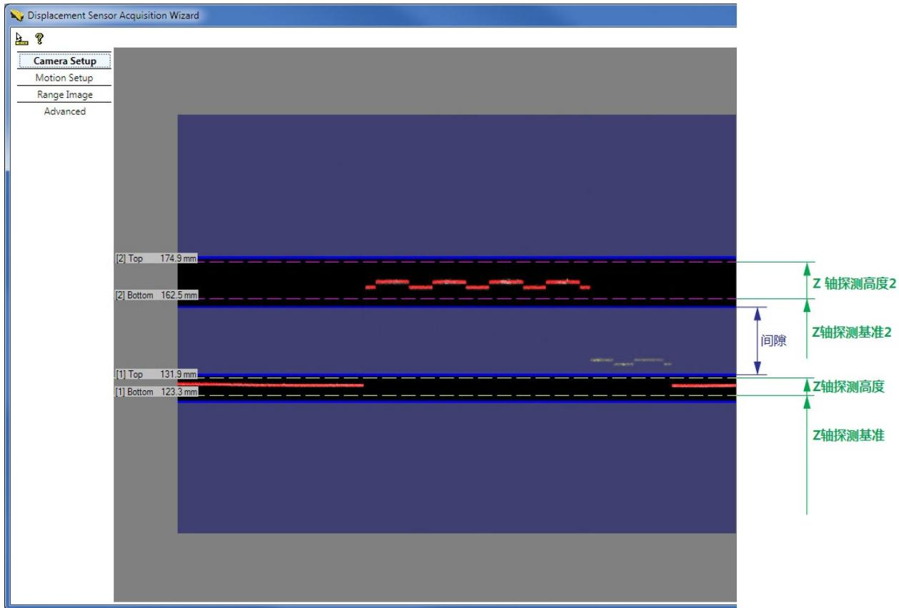

除了区域 1 和区域 2，你可以在采集向导中的深度图像选项卡中设置 Z 轴采样率 (ZDetectionSampling)以及 Z 轴采样率2 (ZDetectionSampling2)参数以指定在亮度图像处理行之间的采样间距。默认值为 1 时，扫描每一行；设置为 2 时，每隔一行扫描。降低处理的行数可以提高采集速度，但会降低准确率。

如果“区1”和“区2”同时启用，则"工作关注区域"为：

l 如果“区1”和“区2”没有连接(默认)，且在两个区域中间存在空开区域(两个区互相不交错)，那么检测会在两个区域中进行，对中间的空开区域不会进行检测。

在一些特殊的例子中，如果两个区域互相连接，那么“区1”和“区2”会被合并成一个区域进行检测。检测会从最低区域的底部开始，到最高区域的顶部结束。在合并的区域中，会单独使用 Z 轴采样率(ZDetectionSampling) 设置对每个区域进行检测。唯一的例外是，当 Z 轴采样率 (ZDetectionSampling) 被设置为 2，Z 轴采样率 2

(ZDetectionSampling2) 被设置为 1 时；这时，在两个区域交界处会有 4 个亮度图像行的空间，且这个空间不会被检测。如果不想显示这个空开部分，你可以选择填补两个空间。

l 通过启用合并探测区域 (BridgeDetectionZones) 参数，“区1” 和“区2”之间的空开部分可以被填补。“区1”和“区2”会被合并成一个区域进行检测。检测会从最低区域的底部开始，到最高区域的顶部结束。从“区1”开始的 Z轴采样率 (ZDetectionSampling) 设置会被用于合并后的整个区域。

如果通过启用连接探测区域 (LinkDetectionZones) 将“区1”和“区2”进行连接，那么 Z 轴探测基准2

(ZDetectionBase2) 会根据“区1”顶部的位置 (ZDetectionBase $^ +$ ZDetectionHeight) 进行测量。 对于“区1” 进行的更改将会自动应用到“区2”上。在调整相机和取相部件之间的距离时，该设置将会非常有用。因为只需调整一个 Z 轴探测基准 (ZDetectionBase) 参数(区1)就可以同时应用到两个区域。注意，随着链接探测区域 (LinkDetectionZones) 设置被启用或禁用，Z 轴探测基准2 (ZDetectionBase2) 的值会在相对值(从“区1” 顶部测量)以及绝对值(从 Z 轴原点测量)之间自动切换。

传感器可以达到的最高线扫描速率以及当前的采集设置会被计算并显示。这与采集一张亮度图像，处理图像并生成深度图像扫描线所需的线扫描时间成反比。

“线扫描时间”大约的计算如下所示：

线扫描时间 $\approx$ MAX(曝光时间、亮度图像处理时间)

如果曝光时间大于亮度图像的处理时间，则“线扫描时间”约等于曝光时间；如果亮度图像处理时间大于曝光时间，则“线扫描时间”约等于亮度图像处理时间。

影响“亮度图像处理时间”的因素有以下几个：

l Z 轴探测区域的大小：

Z 轴探测基准 (ZDetectionBase)、Z 轴探测高度 (ZDetectionHeight)、Z 轴采样率 (ZDetectionSampling)(区1)

Z 轴探测基准2 (ZDetectionBase2)、Z 轴探测高度2 (ZDetectionHeight2)、Z 轴采样率2 (ZDetectionSampling2) (区2)

l 两个检测区域之间是否该有一个空开的区域：合并探测区域 (BridgeDetectionZones)  
l 线搜索模式，API 中为激光探测模式 （LaserDetectionMode）。

最高线扫描速率= 1 / 线扫描时间

API 中，读取最高线扫描速率（MaximumLineFrequency）的值。任何从相机读取最高线扫描速率（MaximumLineFrequency）的错误将会被处理（发生错误时，会返回 0）；同时在任何可能会影响最高线扫描速率的更改发生时，会执行一个更改的事件，从而避免了从用户图像界面 GUI 中轮询特征。例如，如果设置发生更改时，另外一个采集 FIFO （或作业）正在使用相机，新的采集代码将不能将新的设置写入相机；在该情况下，最高线扫描速率（MaximumLineFrequency）将返回 0。

完成后，在位移传感器采集向导中点击下一步，进入位于左边的移动设置选项卡。

# 7. 在移动设置选项卡中设置移动采集参数

在移动设置选项卡中设置与移动有关的参数。这些参数包括编码器设置以及 X 和 Y 轴比例设置。

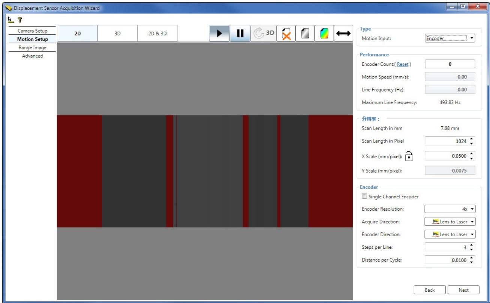

# 编码器

编码器可以被用来追踪传送带的运行。编码器安装在传送带上，并在传送带移动一定距离(步)时提供一组特定的信号。用于生成深度图像的亮度图像采集可以通过编码器信号或步数来触发。单通道编码器含有一个单一的通道，因此只能被用来检测

物体是否移动，但不能检测移动的方向。双通道编码器含有正交信号通道，因此可以被用来检测移动以及移动的方向。以下图例显示了双通道编码器的两个信号通道(Phase A 和 Phase B)。

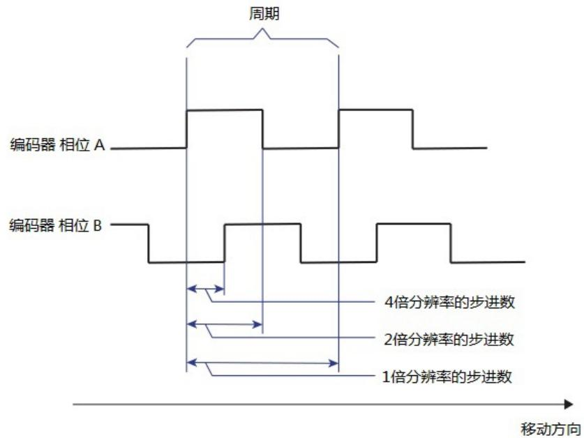

单通道编码器只含有这两个通道中的一个。一个周期指的是编码器信号通道在一个周期内所产生的一组波形。每个周期的距离(DistancePerCycle)指的是周期内的波长，即在双通道编码器的正交波形的一个完整周期内，传送带必须移动以使编码器输出一个完整周期的物理距离。所有完整周期含有四个边沿：2 个在 Phase A，2 个在 Phase B。

“步”代表的是编码器计数之间所移动的距离。每个“步”的距离由编码器分辨率(EncoderResolution) 设置控制：

l 如果编码器分辨率(EncoderResolution) 的设置为 4x, 编码器为采集深度图像所移动的“步”数是完成整个“周期”的频率的四倍。每“步”为每个周期的距离(DistancePerCycle)的四分之一。

当使用 4x 时，每个“步”与正交波形的每个边沿对应。

l 如果编码器分辨率(EncoderResolution)的设置为 $2 \mathrm { x } .$ , 编码器为采集深度图像所移动的“步”数是完成整个“周期”的频率的两倍。每“步”为每个周期的距离(DistancePerCycle)的二分之一。

当使用 2x 时，编码器的“步”将根据 Phase A 的边沿来产生。

l 如果编码器分辨率(EncoderResolution) 的设置为 1x, 编码器为采集深度图像所移动的“步”数与完成整个“周期”的频率相同。每“步”与每个周期的距离(DistancePerCycle)相同。

当使用 1x 时，编码器的“步”将根据 Phase A 的上升沿或下降沿来产生。

在使用单通道编码器时(一“步”等于一个完整的周期)，编码器的分辨率不适用。

# 测试编码器

如果你没有在传送带上安装物理（硬件）编码器，或者你不想使用类似的编码器，而希望按照时间来采集图像，你可以为DS1000 系列传感器选择使用“测试编码器”。“测试编码器”是生成亮度图像采集触发信号（以生成深度图像）的传感器中的一个内置功能。

# 设置移动输入、移动速度、物理编码器类型、编码器方向、采集方向以及每个周期内编码器移动距离等参数

l 设置移动输入（MotionInput）来指定是使用物理编码器还是测试编码器来执行采集：  
l 编码器 - 使用物理编码器来执行采集。  
l 无编码器（默认）- 使用基于时间的测试编码器来执行采集。测试编码器的速率（即线扫描速率）将根据（LineFrequency）预期移动速度（ExpectedMotionSpeed）输入值，即在向导 GUI 中设置的移动速度，除以预期的每条扫描线的移动距离（ExpectedDistancePerLine）来计算。

预期的每条扫描线的移动距离（ExpectedDistancePerLine）与当前的 Y 轴比例（ Y Scale）对应。

l 模拟编码器 - 使用基于时间的测试编码器来执行采集。测试编码器的速率与当前没有使用的物理编码器的速率同步。测试编码器的速率可按照以下公式计算：

线扫描速率 $=$ 预期移动速度/[(每个周期的距离*每线的步数)/编码器分辨率]

即，

线扫描速率 $=$ (预期移动速度*编码器分辨率)/(每个周期的距离*每线的步数)

也就是说，无编码器模式中的预期的每条扫描线之间的距离参数将根据在模拟编码器模式中当前缺失的物理编码器设置参数来计算。

如果物理移动根据预期的速度运行，且每个周期的距离设置准确，使用物理编码器和使用模拟编码器将不会有明显可视的区别。你可以在不更改任何编码器参数的情况下在物理编码器和模拟编码器模式之间切换。

编码器计数 - 测得的编码器计数。如果你指定了一个物理编码器作为移动输入（MotionInput），你可以通过点击重置按钮来重置编码器计数。重置允许编码器计数从 0 开始，在物理编码器当前的状态下持续采集深度图像。

移动速度 - 如果你使用物理编码器，移动速度区域将显示物体移动实际的计算速度。可以通过以下方法来计算：

移动速度 $=$ 测得的编码器速率*每个周期的距离/编码器分辨率

如果你使用的是无编码器模式或模拟编码器模式，移动速度区域会变成可输入区域，你可在其中输入你期望的移动速度。如果移动速度超过了限制，并导致传感器不能在“最高线速率”中规定的线扫描时间内采集并处理每条深度图像线，且发生编码器超限错误，“移动速度”区域将会以红色显示。该区域的值与 API 中的预期移动速度（ExpectedMotionSpeed）相关联。

线速率 - 当前深度图像线采集的频率。如果线速率超过了限制，并导致传感器不能在“最高线速率”中规定的线扫描时间内采集并处理每条深度图像线，且发生编码器超限错误，“线速率”区域将会以红色显示。该区域的值与 API 中的线速率（LineFrequency）相关联。

物理编码器类型 - 如果你使用的是单通道编码器，选择“单通道编码器”选项框或在 API 中将 UseSingleChannel 参数设置为 True。默认情况下，该参数的设置为 False，且对应的用户图形界面中的“单通道编码器”选项框不会被选择。这意味着两个通道 (Phase A 和 Phase B)都可以被用来触发采集。

采集方向 - 设置用来执行采集的传送带的运行方向。如果使用双通道编码器，DS1000 系列传感器不会在相反的运动方向上采集图像。在 API 中，可通过采集正方向（AcquireDirectionPositive）来设置该参数。

编码器方向 - 如果你使用的是“双通道编码器”，可以选择将以下的一个传送带移动方向设置为正方向：从 DS1000 系列传感器的相机向激光移动的方向(默认设置，“推”方向)或从激光向相机移动的方向(“拉”方向)。一个简单的可以用来确定编码器哪个方向为正方向的方法为，观察哪个传送带移动方向会导致“编码器计数”增加。在 API 中，可通过测试编码器正方向（TestEncoderDirectionPositive）来设置该参数。

每个周期的距离 - 设置每个周期的距离(DistancePerCycle) 参数。一个计算方法为，根据编码器的规格和物理设置(编码器圆环的直径、传动比或滑动等)来计算。

一个简单的根据测量来计算该值的方法为，将传送带移动一定的距离，根据编码器计数的差异将其除以编码器完成的圈数。例如，在使用双通道编码器的时候执行以下步骤。

1. 将编码器分辨率 (EncoderResolution) 设置为4x，并确认“单通道编码器”选项框没有被选中。  
2. 将传送带放置到开始位置(在该位置时编码器计数的值接近于 0 以防止计数器反转，或在需要的位置重置编码器计数)并记录下“编码器计数”的值。  
3. 将传送带在编码器正方向上移动 $1 0 0 ~ \mathrm { { m m } }$ ，并记录下新的“编码器计数”值。  
4. 在结束值中减去开始时“编码器计数”的值，然后除以 4 (分辨率为 4x)以得到完成的圈数的数字。  
5. $1 0 0 \mathrm { m m }$ 除以完成的圈数，即为每个周期的值。将该值输入到每个周期的距离(DistancePerCycle) 参数中。

如果你使用的是单通道编码器，请确保选中“单通道编码器”复选框 (EncoderResolution 值任意)，并执行以上步骤，只是不需要在编码器计数值的差异上除以实际的分辨率设置。这意味着，在使用单通道编码器时，编码器计数值的差异与完成的圈数的值相对应。

这些参数使得传送带移动方向以及传感器的安装方向与编码器相对应。如果传送带的移动方向发生改变，则需要改变“采集方向”。如果需要检测的部件与传送带运行的方向一致，但你想从相反的方向来检测部件，那么可以将传感器安装在相反的方向上，并更改“编码器正方向”(以及“采集方向”，如果传送带的移动方向没有发生改变)设置。

这些参数与你的编码器以及移动设置连接。因此，你必须在初次采集深度图像时设置这些参数，并且尽量避免在之后的参数优化中更改这些参数。

# 为物理编码器和模拟编码器设置每线的步数

“每线的步数 (StepsPerLine)”参数决定深度图像线扫描频率，即在下一张亮度图像采集并获得深度图像扫描线之前需要通过的步数。该参数以及编码器分辨率参数将直接影响所采集的深度图像的 Y 轴分辨率。

第一条扫描线与触发不同步，但与在触发之后收到的第一个编码器信号同步。“每线的步数 (StepsPerLine)”不适用于第条扫描线。你可以在 API 中使用“设置每条线的步数”（ SetStepsPerLine）来设置每线的步数。如果你使用硬件触发模式(TriggerMode)(自动或半自动)，你可以使用 StartAcqOnEncoderCount 来更改第一条线相对于触发时的位置。你可以在高级选项卡中设置 StartAcqOnEncoderCount (在接收到触发之前，不能使用负值来采集第一条扫描线)。

假设你想要检测的部件随着传送带以一已知的基于生产需求的速度移动。在该情况下，你需要根据这个参数来设置你的DS1000 系列传感器的采集系统。

每线的步数将由编码器的分辨率、编码器速率（每秒钟转动的圈数）以及传感器当前的最高线扫描速率来决定。编码器的分辨率和编码器速率越高，需要设置的每线的步数也越高。否则会发生编码器超限错误，并导致在向导中显示的采集到的深度图像中会出现像素缺失的扫描线，且因为作业中有错误导致采集被取消。缺失像素的扫描线将和其它缺失像素一样以红色标注。通过查看在选项卡中显示的采集到的深度图像是否有缺失的像素，你可以马上知道“每线的步数"设置是否正确。

正确的每线的步数设置：

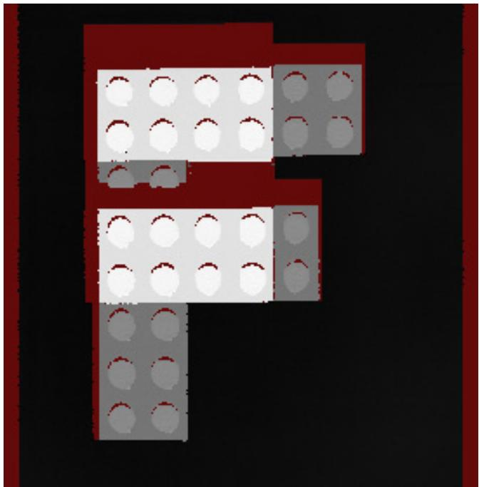

错误的每线的步数设置导致扫描线缺失（以红色显示）：

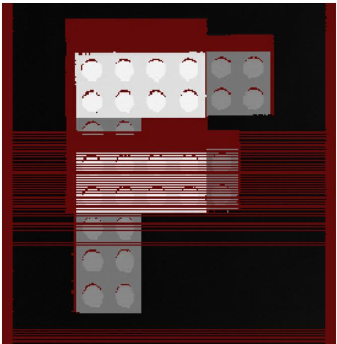

你可以通过计算在一定的传送带移动距离内有多少圈数来计算你的编码器速率，测量传送带通过这个既定距离的时间并除以圈数。

如果你需要将每线的步数设置到一个很低的数值，但该设置会导致编码器超限错误时，你就需要优化采集速度。

一般来说，因为设置为 4x 的编码器分辨率 (EncoderResolution) 在设置获取的深度图像扫描线之间的距离时有最大的灵活性，因此 Cognex 建议你使用该设置。当你不能在采集到的两条深度图像扫描线之间获得足够大的距离时，2x 和 1x 设置会有帮助。

# 示例：

每个周期的距离 (DistancePerCycle) $= \ 0 . 0 8 \ \mathrm { \ m m } /$ 周期

l 设置每线的步数(Steps per line) $= ~ 9$ ，并且设置编码器分辨率(EncoderResolution)= 4x，产生的扫描线的间距是$0 . 1 8 \mathrm { ~ m m }$ 。  
l 设置每线的步数(Steps per line) $= ~ 1 5$ ，并且设置编码器分辨率(EncoderResolution) $= ~ 4 x$ ，产生的扫描线的间距是$0 . 3 \mathrm { \ m m }$ 。  
l 设置每线的步数(Steps per line) $= ~ 5$ ，并且设置编码器分辨率(EncoderResolution) $\mathbf { \lambda } = ~ 2 \mathbf { x }$ ，产生的扫描线的间距是$0 . 2 \mathrm { \ m m }$ 。  
l 设置每线的步数(Steps per line) $= ~ 8$ ，并且设置编码器分辨率(EncoderResolution) $\mathbf { \lambda } = ~ 2 \mathbf { x }$ ，产生的扫描线的间距是$0 . 3 2 \mathrm { ~ m m }$ 。

# 设置分辨率参数，包括扫描长度、X 轴比例和 Y 轴比例

扫描长度（以像素为单位）- 指定深度图像应该包含的行数，即采集到的激光线数目。

X 轴比例和 Y 轴比例 - 为深度图像设置 X 轴比例和 Y 轴比例以保持长宽比。在采集到的深度图像中，X 轴比例和 Y 轴比例分别与每行及每列的毫米数目相对应。如果你在编码器模式或模拟编码器模式，Y 轴比例将为“只读”值，该值将根据每个周期的距离（DistancePerCycle）、编码器分辨率（EncoderResolution）、每线的步数以及编码器类型的设置而自动计算。为了使在深度图像中出现的特征以在实际世界中相同的长宽比显示，需要根据已计算出的 Y 轴比例来设置 X 轴比例。或点击 X 轴比例旁的图形锁以使其自动更新到与 Y 轴比列同步的值。

# 处理编码器超限错误

如果编码器设置(例如“每线的步数(StepsPerLine)”)导致了采集扫描线的时间快于“线扫描时间”(采集一张亮度图像，对其进行处理并生成一条深度图像扫描线的时间)，你就会得到一个编码器超限错误。该错误在单独编码器和测试编码器上都会发生。编码器超限错误会导致在采集向导中显示的深度图像中出现红色的像素缺失线，且会导致采集在作业中被取消。因此，请确保每”步“的时间大于“线扫描时间”。

你可以通过在采集向导的高级选项卡中选择“忽略过快编码器”选项框来忽略过快编码器。（如果使用 API，则需将IgnoreTooFastEncoder 设置为 true）。如果你选择了忽略过快编码器(IgnoreTooFastEncoder)，那么当编码器启动一个比“线扫描时间”快的新的扫描线采集时，作业中没有足够时间处理的那条扫描线在深度图像中会被没有像素的行所取代，且不会生成错误或导致采集被取消。

# 8. 在深度图像选项卡中设置深度图像属性

在深度图像选项卡中，设置用来控制所生成的深度图像的属性。

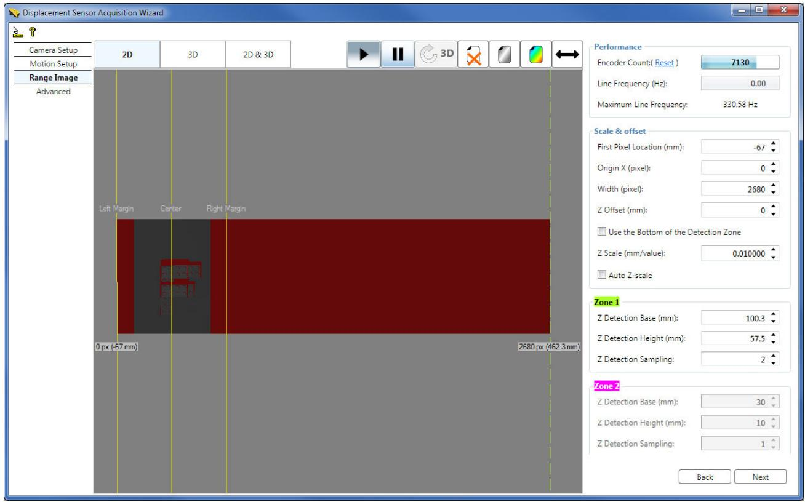

# 在向导采集图像时设置深度图像属性

以下图例显示了一个通过采集向导采集到的 F 型 LEGO® 积木的深度图像。通过放大含有高度变化的高度范围，色彩图像控件(Colormap Control)可以用来在深度图像中增强可视特征。同样，也可通过使用自动 Z 轴比例选项，来增强深度图像的可视特征。

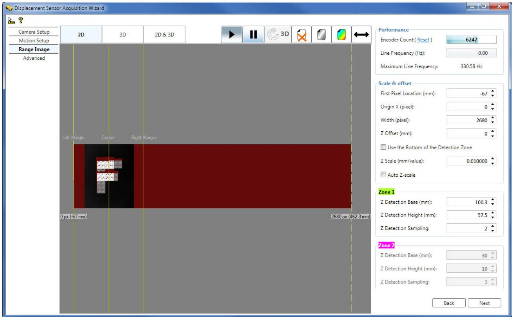

深度图像选项卡显示了采集向导所采集到的深度图像，且包含以下向导标记：

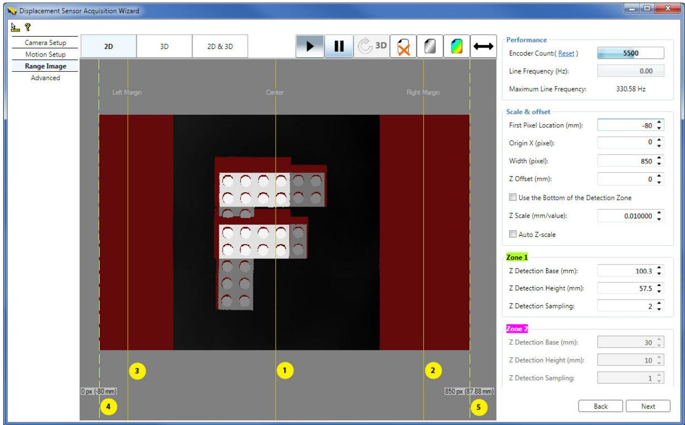

1 - 中心线，在采集到的深度图像中标出工作区域的中间位置（3D 传感器坐标空间中的 X 轴原点）。中心线与传感器的光学中心对应。  
2 - 右边距，在采集到的深度图像中标记从镜头到激光线方向右侧可看到的工作区域的最大范围（X 轴的正方向）。  
3 - 左边距，在采集到的深度图像中标记从镜头到激光线方向左侧可看到的工作区域的最大范围（X 轴的反方向）。  
4 - 深度图像左边第一个像素的虚线标记线，标记采集到的深度图像的左边界。该标记线中包括：

X 原点 px 值（与第一个像素对应的以 mm 为单位的像素位置）

与第一个像素对应的以 mm 为单位的像素位置 $=$ 第一个像素位置 + X 原点 * X 轴比列值

当 X 轴原点的值为 0 （默认值）时，与第一个像素对应的以 mm 为单位的像素位置等于第一个像素位置（FirstPixelLocation）的参数值。

拖拉该标记线可以重新设置深度图像的左边界。在新采集到的深度图像中可以观察到标记线调整后的效果。

默认情况下第一个像素的标记线会与左边距标记线在同一位置，即工作区域的开始位置。因此，当两条线重合的时候，虚线可能会看不到。你可以通过移动公共区域以及左边距标记线来看到隐藏在后面的虚线标记线。

5 - 深度图像右边最后一个像素的虚线标记线，标记采集到的深度图像的右边界。该标记线中包括：

X 原点 $^ +$ 宽度的 px 值（与最后一个像素对应的以 mm 为单位的像素位置）

与最后一个像素对应的以 mm 为单位的像素位置 $=$ 第一个像素位置 $^ +$ (X 原点 $^ +$ 宽度) * X 轴比列值

拖拉该标记线可以重新设置深度图像的右边界。在新采集到的深度图像中可以观察到标记线调整后的效果。

默认情况下最后一个像素的标记线会与右边距标记线在同一位置，即工作区域的结束位置。因此，当两条线重合的时候，虚线可能会看不到。你可以通过移动公共区域以及右边距标记线来看到隐藏在后面的虚线标记线。

进一步调整深度图像的属性以得到你所需要的深度图像：

宽度 - 通过使用 GUI 中的宽度选项来指定深度图像中所需包含的列数。

X 原点 - 可以通过使用 GUI 中的 X 原点选项来调整深度图像的 X 原点。

在 API 中，你可以通过使用 ICogAcqFifo.OwnedROIParams 属性中的 SetROIXYWidthHeight 来设置以上参数以及像素的扫描长度。参数设置的格式如下：SetROIXYWidthHeight(int OriginX, 0, int Width, int ScanLengthInPixel)

第一像素位置 - 指定第一像素位置 (FirstPixelLocation)，该参数定义了深度图像沿着 X 轴的第一个物理像素位置(以mm为单位)；即，深度图像从左开始的位置。

当多个传感器并排采集一个更宽的图像时可以使用第一像素位置 (FirstPixelLocation) 以及 X 原点设置：这两个设置允许你调整采集到图像的坐标空间。例如，假设你并排安装了两个相机用来为一个宽度较大的部件采集图像，相机之间的距离为 $8 0 ~ \mathrm { \ m m }$ 。你可以将第一个相机的第一个像素位置设置为 $- 5 0 \ \mathrm { m m }$ ，第二个相机的第一个相机位置设置为 $- 1 3 0 \mathrm { ~ m m }$ ( $- 5 0 \ \mathrm { m m }$ $- ~ 8 0 ~ \mathrm { m m } )$ )，以使得两个相机的第一个像素位置始终与它们的物理位置同步。X 原点可以被用来调整相机 2 以跳过被相机 1覆盖的部分。这将使一个图像像素的真实世界坐标与从任何一个相机中采集到的图像的同一个点关联，因此你就不需要手动计算在两个相机位置中存在的 $8 0 ~ \mathrm { \ m m }$ 空隙。

Z 轴坐标和 Z 轴偏移 - 你可以使用 Z 轴比例 (ZScale) 深度图像参数来指定像素值的比例(以 mm 为单位)。默认情况下，像素值 1 代表了高度在 (Z Origin + 1 x ZScale)的高度。你可以通过使用 Z 轴偏移(ZOffset) 深度图像参数来指定一个与像素值 1 相对应的自定义高度(以 mm 为单位)。注意，在 Z 轴原点 (Z Origin) (或 ZOffset)的高度也可以通过像素值 1(而不是 0)来表示。通过选择“使用检测区域底部”选项框，你可以选择使用区域 1 的底部高度作为 Z 轴偏移。

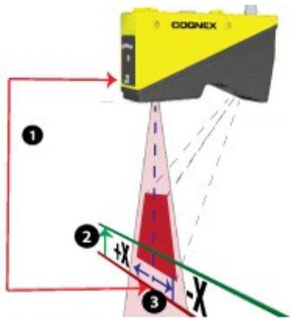

1:Z轴原点   
2:Z轴偏移   
3:第一个像素位置

自动 Z 轴比例 不管是否使用了色彩图像控件（Colormap Control），通过选择自动 Z 轴比例选项框，你可以放大含有高度变化的高度范围，以在深度图像中增强可视特征。如果仅使用区域 1，则新的 Z 轴比例将根据检测区域 1 的顶部与 Z轴偏移之间的范围来计算；如果两个检测区域同时被启用，则新的 Z 轴比例将根据检测区域 2 的顶部与 Z 轴偏移之间的范围来计算。在使用自动 Z 轴比例选项时，推荐启用“使用检测区域底部”选项。注意：为使自动 Z 轴比例生效，你必须采集一个新的深度图像，以与同样可以应用到当前深度图像中的色彩图像控件(Colormap Control) 区别开来。

区域 1 和区域 2 - 你可以在该选项卡中指定顶部、底部以及检测区域 1 和区域 2 （如之前所述）取样区间的数值。 由此产生的调整过的深度图像，如下图所示：

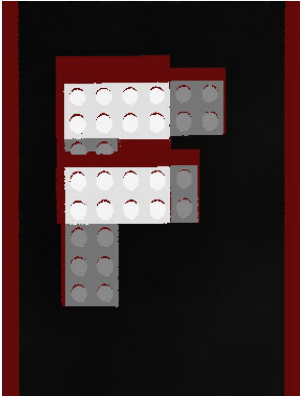

注意，显示为缺失像素的隐藏的区域使用默认的暗红色来标注。

以下图例显示了检测部件含有间隙和不含有间隙的图像。这些图像从作业中采集，因此它们不包含之前的那些指示标记。

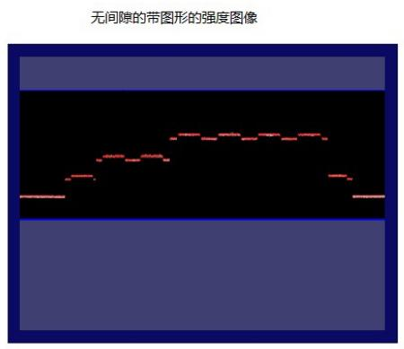

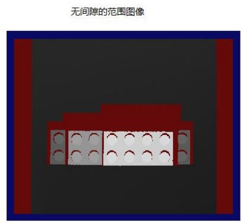

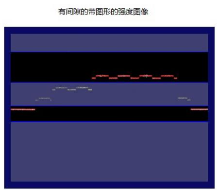

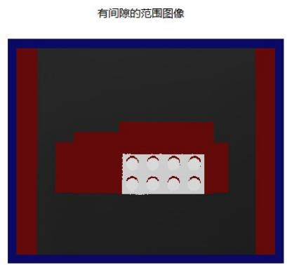

注意，对应于被间隙排除的高度的区域以缺失的像素来显示。这是因为，在间隙中没有激光扫描线对传感器来说是可见的。因此，在间隙中的高度范围内没有收集到任何数据。

然而，在一些情况下，杂散特征可能会出现在深度图像中的这些区域以及相邻的区域，而不显示像素缺失。这通常是各种激光在“工作关注区域”中反射的结果。如果被检测的对象(以及传送带)的表面为磨砂表面，这种现象就不太会发生。为防止杂散特征出现在深度图像中，你可以降低探测灵敏度 (DetectionSensitivity) 以及/或减少“曝光”时间。通过使用含有图形的亮度图像，你可以轻松地调整这些参数，并确认导致杂散特征出现在图像中的反射得到了有效的控制。

# 9. 在高级选项卡中设置高级参数

在高级选项卡中设置高级参数。大多数的情况下，你不会需要在该选项卡中更改参数。

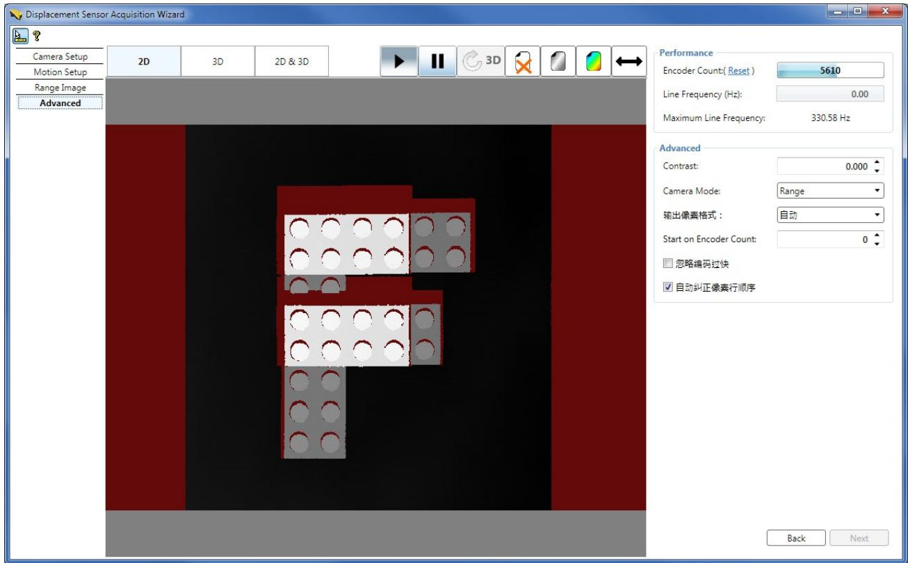

对比度 - 如果需要增加 GigE 相机（默认值为 0）的对比度，你需要在该选项卡中调整。对比度最大值为 1。你可以通过查看在高级选项卡中新采集到的深度图像或切换到相机设置选项卡查看含有图形的亮度图像来验证对比度的设置是否正确。

相机模式 - 可以在该选项卡中将 QuickBuild 中采集到的图像模式从默认的深度图像改为亮度图像或含有图形的亮度图像。

像素输出格式 - 如需要，可以在该选项卡中更改采集到的图像的像素输出格式。自动（默认） - 图像将根据默认的格式来采集（例如，深度图像采用深度图像格式，亮度图像的格式为 RGB 平面格式）； 灰度 8、灰度 16 以及 RGB 平面格式 -采集系统将图像格式转换为给定的格式，并输出结果图像。通常，不需要更改该参数。

开始编码器计数采集 （StartAcqOnEncoderCount）- 如果你使用硬件触发模式(TriggerMode)(自动或半自动)，你可以使用开始编码器计数采集 （StartAcqOnEncoderCount） 来更改第一条线相对于触发时的位置。(在接收到触发之前，不能使用负值来采集第一条扫描线)。

忽略过快编码器（IgnoreTooFastEncoder）- 你可以通过在采集向导的高级选项卡中选择“忽略过快编码器”选项框来忽略过快编码器。（如果使用 API，则需将 IgnoreTooFastEncoder 设置为 true）。如果你选择了忽略过快编码器(IgnoreTooFastEncoder)，那么当编码器启动一个比“线扫描时间”快的新的扫描线采集时，作业中没有足够时间处理的那条扫描线在深度图像中会被没有像素的行所取代，且不会生成错误或导致采集被取消。

自动更正像素行次序（AutoCorrectPixelRowOrder）- 选中自动更正像素次序选项框(在 API 中将

AutoCorrectPixelRowOrder 设置为 true) 以选择自动设置采集图像行的次序以与实际显示情景相匹配。如果该值被设置为false，那么在激光到相机方向采集到的图像会含有一个相反的像素行次序(该图像会按顶部到底部镜像的方式显示以与实际显示情景相匹配)。

# 10. 设置坐标空间（可选）

在图像来源 GUI 中的标定(Calibration) 选项卡中，你可以，

l 选择主要 3D 已标定空间（Primary 3D Calibrated Space）并指定其名称。  
l 选择 2D 已标定空间。

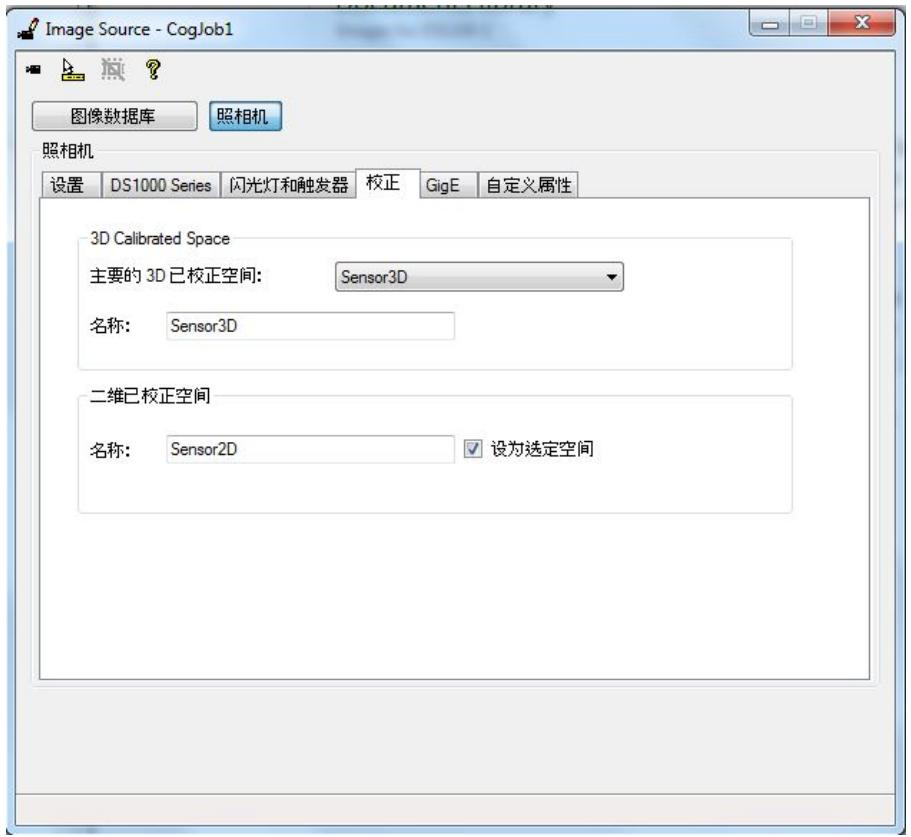

主要 3D 已标定空间（Primary 3D Calibrated Space）是用于在深度图像中显示像素的标定 3D 空间。在该版本的VisionPro 软件中，Sensor3D 是唯一可选的主要 3D 已标定空间（Primary 3D Calibrated Space）。2D 已标定空间是与Z 轴值为零所在的平面在主要 3D 已标定空间中对应的 2D 空间。该空间可与 2D 视觉工具一起使用来获得标定后的真实世界测量。默认的空间名为 Sensor2D，且默认设置为“2D 已标定空间”用于采集图像。你可以在该选项卡中重新命名Sensor2D 空间，且可以取消选中“设为选定空间” 复选框以避免使用该空间为选中的 2D 空间。

# 11. 关闭采集向导然后开始采集深度图像

如果你使用的是 GuickBuild, 关闭采集向导然后从作业开始采集深度图像。如果你想手动采集深度图像，可以在作业中点击“运行”按钮来采集一个初始深度图像。你可以像从其它任何相机采集图像一样，通过传感器从作业中来采集深度图像。

如果你想使用不同的采集设置，可以停止采集然后运行采集向导来设置新的采集参数。完成后，关闭采集向导然后重新开始采集。

注意，从作业和向导同时采集图像不受支持。

# 图像采集参数优化

该部分包含以下内容。

优化采集速度  
优化 Z 轴分辨率  
优化 Y 轴分辨率  
优化 X 轴分辨率  
在长宽比保持不变的情况下根据具体的分辨率需求来设置图像采集参数

在以上基础上进行进一步调整以达到最佳运行效果。

# 优化采集速度

如果因为采集速度高于当前参数设置所支持的速度而导致编码器超限，你就需要优化采集参数的速度。

以下图例显示了在传送带运行速度太快情况下采集到的深度图像。其中缺失的像素行是编码器超限导致的结果(如需避免作业中的采集因编码器超限而停止，请选择忽略过快编码器(IgnoreTooFastEncoder) 选项)：

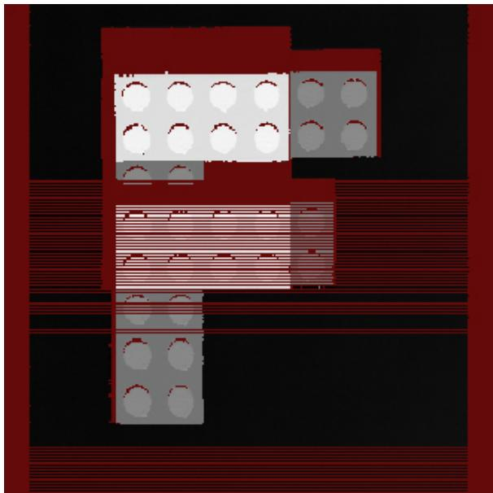

你可以执行以下步骤，通过减少线扫描时间或降低取样率（Y 轴分辨率结果）来加快采集速度。

你可以通过降低“曝光时间”或“亮度图像处理时间”来减少“线扫描时间”。或者同时调整这两个参数，如果它们的值相似。注意，将上述两个时间值中的一个减至大大低于其它的一个时间值将不会对提高速度产生更多的影响。采集速度将受到另外一个时间值的限制。

# 调整 Z 轴探测参数以提高速度

调整 Z 轴探测基准(ZDetectionBase) 和 Z 轴探测高度(ZDetectionHeight) 参数(区1)以尽可能多地排除不需要被检测的高度。减小工作关注区域意味着 DS1000 系列传感器处理深度图像扫描线时不需要那么多的数据，这就可以减少“亮度图像处理时间”，从而可能减少“线扫描时间”的值。

以下图例显示了优化过和未优化过的“工作关注区域”设置：

优化过的设置：

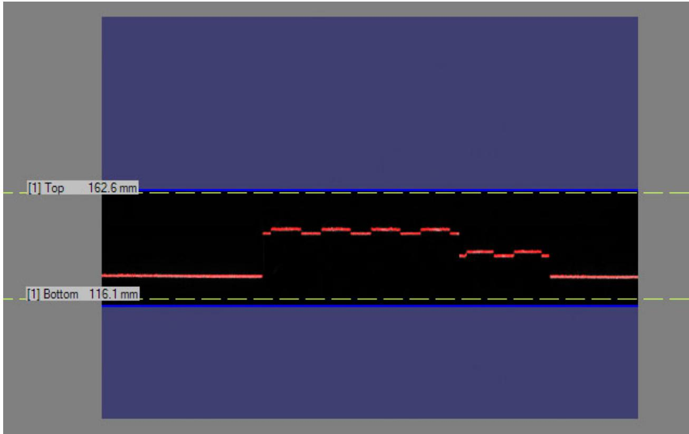

未优化的设置：

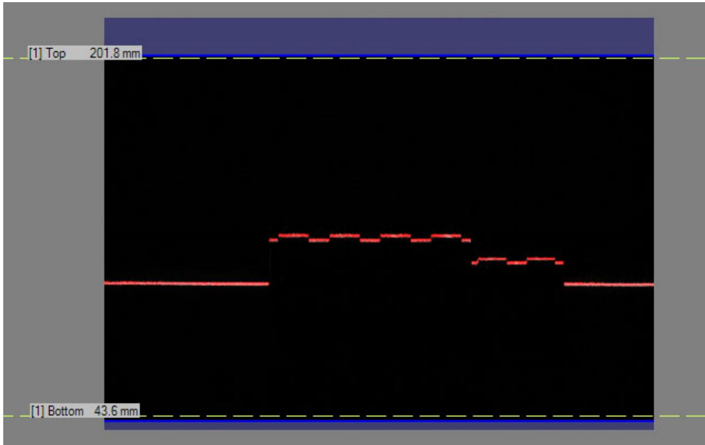

请避免将你的“工作关注区域”设置成过小，这会导致想要检测的特征不在被检测的范围内。下图显示了在类似设置下所生成的图像：

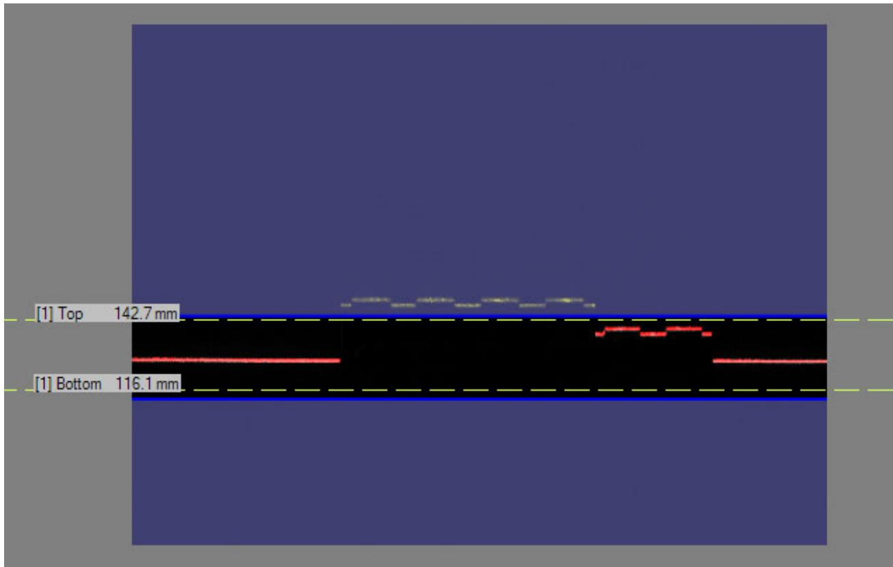

含有排除的特征，导致像素缺失的不合格深度图像：

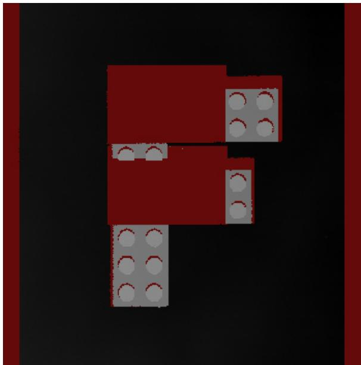

你也可以通过提高Z 轴采样率(ZDetectionSampling) 参数来提高处理过的亮度图像行之间的间隙，并由此降低传感器需要处理的深度图像行的总体行数。该操作可以减少“亮度图像处理时间”，并可能会减少深度图像“线扫描时间”的值。然而，这也会降低采集图像 Z 轴的精确度。

如果有不需要关注的高度范围，你可以在使用“区1”的同时使用第 2 个区域，例如，在“区1”检测低的高度关注范围，在“区2” 检测高的高度关注范围。在两个区之间的区域将不会被处理，从而减少了“亮度图像处理时间”，并可能减少

“线扫描时间”的值和提高最高线扫描速率。你可以通过调整 Z 轴探测基准 2 (ZDetectionBase2) 和Z 轴探测高度 2(ZDetectionHeight 2) 参数来配置“区2”。

如果你想提高最高线扫描速率，你也可以将线搜索模式（如使用 API 为 LaserDetectionMode）设置为快速。这将会导致精确度降低（如果亮度图像处理时间大于曝光时间）。该参数的默认设置为“标准”模式。同时，快速模式在大幅降低曝光时间的同时也降低了采集图像的精确度。

# 将需要检测的部件放置得更低一点或将 DS1000 系列传感器安装得高一点，然后重新调整 Z 轴探测基准参数。

在降低了 Z 轴和 X 轴分辨率的同时，你可以通过将需要检测的部件放在相对于 DS1000 系列传感器较低的位置或将传感器安装得更高一些来提高采集的速度。被检测的部件特征在传感器的相机中对应的行数(以及列数)会减少，因此这些特征显示在亮度图像中也会偏小。减少的行数会导致“亮度图像处理时间”的减少，同时也会导致“线扫描时间”的减少并提高采集速度。请确保调整 Z 轴探测基准(ZDetectionBase) 参数使其与新的基准高度匹配。在部件大小相同的情况下，不需要更改Z 轴探测高度(ZDetectionHeight) 参数，因为该参数指定的是“工作区域”的 Z 轴高度，以 mm 为单位(不是以相机像素为单位)。但是在降低了 Z 轴探测基准(ZDetectionBase) 之后，在亮度图像中与 Z 轴探测高度(ZDetectionHeight)对应区域的显示图像会偏小。

# 减少曝光时间以提高速度

你可以通过减少“曝光”时间来减少“线扫描时间”(如果“曝光”时间大于“亮度图像处理时间”)。由于在亮度图像中激光的强度有所降低，为保证检测的稳靠，建议您提高“对比度”(在高级选项卡中)以及/或激光的探测灵敏度(DetectionSensitivity)。如果提高了“对比度”和激光探测灵敏度(DetectionSensitivity) 级别导致过多的干扰出现在图像中，则需要降低激光探测灵敏度(DetectionSensitivity) 和“对比度”(如必须的话)。

调整完这些设置后，你应该可以得到一张看上准确的且含有低级别采集控制参数的亮度图像。

在得到所需的亮度图像或带图形的亮度图像后，重新采集深度图像，并确认没有编码器超限的问题且深度图像看上去正确。以下图例显示了降低“曝光”时间后采集到的图像：

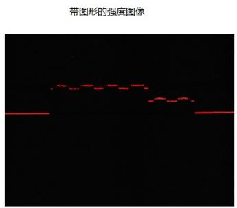

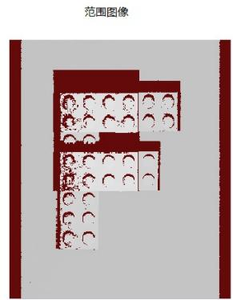

提高了对比度：

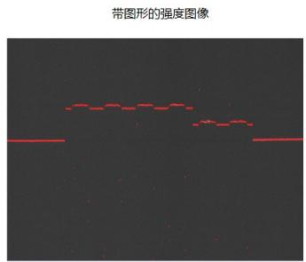

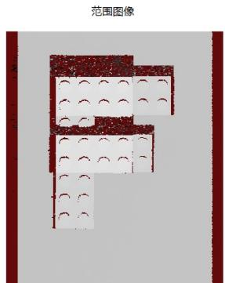

降低了探测灵敏度(DetectionSensitivity) 但提高了对比度：

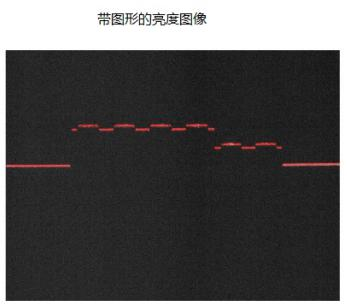

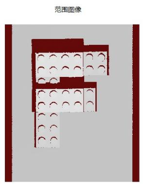

如果选择了高动态范围 (HighDynamicRange)，总体曝光时间将大于原来的曝光时间。同时，需要增加额外的“亮度图像处理时间”来处理亮度图像。当然，“线扫描时间”也因此而增加。如果你不再需要使用高动态范围(HighDynamicRange)，你可以选择禁用该选项以减少“线扫描时间”。

# 增加“每行的步数”参数值和/或降低分辨率以大幅提高速度

虽然损失了部分 Y 轴分辨率(以及 X 轴分辨率，如果你通过使用将 X 轴比例(X Scale) 与 Y 轴比例(Y Scale) 保持相同的方法来保持图像的长宽比)，就可以通过不经常采样检测对象的方法来加快采集图像速度。这可以通过增加“每行的步数”和/或降低编码器分辨率(EncoderResolution) 来达到。如果需要保持长宽比，不要忘了将 X 轴比例(X Scale) 调整到与新的 Y 轴比例(Y Scale) 相同。

你也可以选择在降低 Y 轴分辨率来提高速度的同时，保持 X 轴分辨率(通过保持 X 轴比例的值)不变。在该情况下，显示的深度图像可能会变形(在像素空间中)。不过，在深度图像中的 3D 变换(以及2D 变换)确保了深度图像中的像素位置与在实际 Sensor3D 空间(以及 Sensor2D 空间)中的正确位置相对应。换句话说，即使显示的深度图像变形，3D 变换(以及 2D变换)依然可以让你得到精确的特征位置和大小。

这些设置不会更改“线扫描时间”。

# 优化 Z 轴分辨率

如果检测部件在 Z 轴上需要更高的分辨率，你可以将你的部件放在相对于 DS1000 系列传感器来说较高的位置，或将传感器安装在较低的位置。这样的话，部件上检测的特征在传感器的相机上会与更多的行（或列）对应，且会在亮度图像中显示较大的图形，从而提高分辨率。请确保调整 Z 轴探测基准(ZDetectionBase) 参数使其与新的基准高度匹配。在部件大小相同的情况下，不需要更改 Z 轴探测高度(ZDetectionHeight) 参数，因为该参数指定的是“工作区域”的 Z 轴高度，以 mm为单位(不是以相机像素为单位)。但是，在提高了 Z 轴探测基准(ZDetectionBase) 之后，在亮度图像中与 Z 轴探测高度(ZDetectionHeight) 对应区域的显示图像会偏大。更多的亮度图像行会导致”亮度图像处理时间“的增加，同时会增加“线扫描时间”并降低采集速度。

如果你启用了“区2”，且该区域与“区1” 连接，那么“区2” 会随着 Z 轴探测基准(ZDetectionBase) 参数的调整而自动调整。如果“区2” 与“区1” 没有连接，则需要在调整完 Z 轴探测基准(ZDetectionBase) 参数之后，手动对 Z 轴探测基准2 (ZDetectionBase2) 参数做相应调整。

将激光扫描线搜索模式（在 API 中为 LaserDetectionMode）设置为默认的“标准”设置(如果你设置了“快速”模式)以提高准确率(最高线扫描速率会因此而降低)。

# 为含有不同反射率表面的检测启用高动态范围

优化 Z 轴精确度可以在激光扫描线可见的情况下达到，但不能通过亮度饱和而达到。一些图像中含有的不同的反射率或不同的检测表面，会导致图像中有的部分更亮或更暗。在这些图像中可能很难找到一个曝光设置可以让所有的特征同时可见，但又不过度饱和。在该情况下，可以使用高动态范围(HighDynamicRange)切换。在启用了高动态范围(HighDynamicRange)之后，每次触发都会采集两张亮度图像：先使用指定“曝光”参数的十分之一进行采集，然后按指定的“曝光”参数再采集一次。之后，在采集到的两张图像上运行峰值检测算法；对于亮度图像的每一列，与最短曝光相对应的峰值会被记录下来并用来生成原始峰值数据列。

l 如果有一个曝光数据包含了，(a) 所有需要检测特征的峰值，且 (b) 所有特征的亮度不过度饱和，那么该曝光可以产生最佳的 Z 轴精确度。  
l 如果没有一个曝光数据包含了，(a) 所有需要检测特征的峰值，且 (b) 所有特征的亮度不过度饱和，那么高动态范围(HighDynamicRange)需要被启用。

推荐的高动态范围(HighDynamicRange)使用方法为，将曝光设置到最暗的特征可见且同时可检测到处于峰值的激光扫描线。接着，在亮度图像中查看其它特征的亮度是否过度饱和。如果其它的特征过度饱和，那么手动将“曝光”参数降低 $0 . 1 \mathrm { ~ x ~ }$ 指定的曝光值，并确保 (a) 其它特征可被检测到，且 (b) 其它特征亮度不过度饱和。如果所有的特征都可见，但亮度又不过度饱和，那么该曝光值（指定的曝光值或 $0 , 1 \ast$ 指定的曝光值）就可以产生最精确的 Z 轴准确度。

注意，启用高动态范围(HighDynamicRange) 会降低最高线扫描速率。

# 优化 Y 轴分辨率

Y 轴分辨率的上限为采集系统所能采集的两根深度图像扫描线之间在 Y 轴上的最小距离。Y 轴分辨率的上限等于两个编码器步数之间传送带上移动的距离（最大编码器分辨率 EncoderResolutio 设置）。

可以通过以下方法来提高 Y 轴分辨率。

# 提高“编码器分辨率”以及减少”每线的步数“参数

你可以通过提高编码器分辨率(EncoderResolution)参数值来提高 Y 轴分辨率。建议值为 $2 \mathrm { x }$ 至 4x（最大值为 4x ）。你也可以通过减少“每线的步数”参数(最小值为2)来提高 Y 轴分辨率。

如果你提高了 Y 轴分辨率，深度图像线采集频率会更加频繁。如果两个编码器之间的计数时间小于“线扫描时间”，就会导致编码器超限。如果发生该情况，你应该降低传送带移动的速度或通过调整低级采集控制参数（包括 Z 轴探测参数、曝光以及对比度设置）来优化速度。

如果你想要保持长宽比，确保调整 X 轴比例(X Scale) 以匹配新的 Y 轴比例(Y Scale)。

以下图例显示了在不同参数设置下采集的深度图像：一张为在“每线的步数”为 15、编码器分辨率(EncoderResolution)为$4 \mathrm { x }$ 时采集的图像以及优化后的在“每线的步数”为 5、编码器分辨率(EncoderResolution) 为 $4 \mathrm { x }$ 时采集的图像：

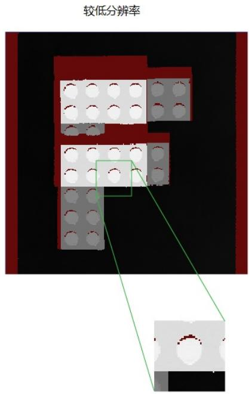

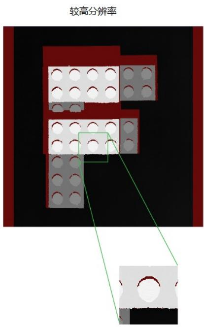

# 如果 Y 轴上限不够，可以调整编码器的安装。

如果 Y 轴分辨率的上限（在两个编码器步数之间的移动）不够，并且你想减小该距离，你可以更改编码器的传输或使用另种可以在相同距离内产生更多计数的编码器。

# 优化 X 轴分辨率

你可能需要通过提高在 X 轴上的采样速率或增加显示的分辨率(如果采样速率不需要改变)来提高 X 轴的分辨率。

如果你需要更高的 X 轴采样速率，将部件摆放在更高的位置或将 DS1000 系列传感器安装到较低的位置，并重新调整 Z 轴基座参数。

如果检测部件在 X 轴上需要更高的分辨率，你可以将你的部件放在相对于 DS1000 系列传感器来说较高的位置，或将传感器安装在较低的位置。这样的话，部件上检测的特征在传感器的相机上会与更多的列(或行)对应，且会在亮度图像中显示较大的图形，从而提高分辨率。请确保调整 Z 轴探测基准(ZDetectionBase) 参数使其与新的基准高度匹配。在部件大小相同的情况下，不需要更改 Z 轴探测高度(ZDetectionHeight) 参数，因为该参数指定的是“工作区域”的 Z 轴高度，以 mm为单位(不是以相机像素为单位)。但是，在提高了 Z 轴探测基准(ZDetectionBase) 之后，在亮度图像中与 Z 轴探测高度(ZDetectionHeight) 对应区域的显示图像会偏大。更多的亮度图像行会导致”亮度图像处理时间“的增加，同时会增加“线扫描时间”并降低采集速度。

如果采样率已经足够，可以降低 X 轴比例(X Scale) 来提高 $^ { \bullet } \mathtt { X }$ 轴显示分辨率”

“X 轴显示分辨率”是 X 轴比例(X Scale) 参数的倒数。如果当前的 X 轴分辨率不够，且在保持长宽比的同时，X 轴分辨率受到 Y 轴分辨率的限制，你可以选择放弃保持长宽比并降低 X 轴比例(X Scale) 参数以提高 X 轴的分辨率。要不过度采样亮度图像，以上操作可以帮助你真正提高分辨率(即部件特征在采集到的深度图像内含有更多细节)。在 X 轴显示分辨率达到并超过采样率后，新生成的像素只是相邻像素的重复而不会提供更多信息。

注意，减小 X 轴比例(X Scale) 的参数值会导致更多像素在 X 轴方向生成。如果需要，增加 “X 轴宽度”的设置以包含更多像素。

同时需要注意的是，在深度图像中的 3D 变换(以及2D 变换)确保了深度图像中的像素位置与在实际 Sensor3D 空间(以及Sensor2D 空间)中的正确位置相对应，即使在 X 和 Y 坐标上的显示有所变形。换句话说，即使显示的深度图像变形， 3D变换(以及 2D 变换)依然可以让你得到精确的特征位置和大小。

# 在长宽比保持不变的情况下根据具体的分辨率需求来设置图像采集参数

在具体应用中，你可能有具体的分辨率需求因而对像素大小有特定的要求。建议通过以下步骤，在长宽比保持不变的情况下根据具体的分辨率要求设置采集参数。

1. 选择目标像素的大小。这可以通过以下几个方法来进行。

l 方法 1

根据部件的特点以及所期望的采集图像的大小来选择目标像素的大小。例如，如果部件跨度约 $8 0 \mathrm { m m }$ ，且没有小于 1mm 的特征。如果你想要 400 像素宽的图像，选择 $0 . 2 5 \mathrm { m m }$ 大小的像素会生成一个 $1 0 0 \mathrm { m m }$ 宽且包含足够细节的图像。该设置同时可以让整个部件都包含在图像中。

l 方法 2

根据在指定工作距离的相机近似像素大小来计算比例。可以通过以下方法来计算：

l 像素大小(pixel size) $=$ 宽度(width) /传感器分辨率(SensorResolution)   
l 宽度(width) $=$ 相对距离(relative distance) * (远端宽度 FarWidth - 近端宽度 NearWidth) +近端宽度NearWidth  
l 相对距离(relative distance) $=$ (到相机的距离 - 近端距离 NearDist) / (远端距离 FarDist -近端距离 NearDist)

对于 DS1000 系列传感器的 DS1100 型号，SensorResolution $= ~ 1 0 2 4$ , FarWidth $= ~ 1 3 2$ , NearWidth $= ~ 6 0$ ,FarDist $= ~ 3 1 5$ , NearDist $= ~ 1 4 0$ 。在距离相机 $2 0 0 \mathrm { m m }$ 处计算近似像素大小，可按照以下公式计算（部分结果已四舍五入）：

l 相对距离(relative distance) $=$ (200 - 140) / (315 - 140) = 0.343   
l 宽度(width) = 0.343 * (132 - 60) + 60 = 84.69 mm   
l 像素大小(pixel size) $= \ 8 4 . 6 9 \ / \ 1 0 2 4 \ = \ 0 . 0 8 3 \ \mathrm { m m / p i x e l }$

l 方法 3

根据应用的速度要求来确定像素大小。例如，如果部件在相机下以 1 米每秒的速度运行，且相机具有每秒1000 个影像的最大速率，那么试图获得大于 1mm/像素的 Y 分辨率的图像就会导致编码器超限错误。

2. 配置编码器设置，以获得尽可能接近目标像素的大小。假设你的编码器转轮为直径 $1 0 \mathrm { m m }$ 、2048 脉冲/每旋转一周，那么每个脉冲经过的距离为：

$$
\mathrm {p i} * 1 0 \mathrm {m m} / 2 0 4 8 = 0. 0 1 5 3 \mathrm {m m} / \text {t i c k}
$$

假设你想要得到 0.083 mm/像素，即 $0 . 0 8 3 \ / \ 0 . 0 1 5 3 \ = \ 5 . 4 1$ tics/pixel，你可以通过将“每行的步数”值设置为5，编码器的“分辨率”值设置为4x 来达到最接近的结果。注意，除非“每行的步数”大于硬件所支持的值，编码器的“分辨率”不需要使用任何 4x 以外的设置值。

注意，一旦通过 linescan API 指定了每个位移的距离，你就可以调整编码器的“分辨率”和“每行的步数”值，且结果 Y 轴比例(Y Scale) 值(在深度图像API 中)会被自动计算。

3. 设置 XScale 的值以与得到的 YScale 值匹配。在该示例中， $0 . 0 1 5 3 ~ \mathrm { m m / t i c } = 0 . 0 7 6 5 ~ \mathrm { m m / p i x e l }$ ，每行 5 步，相对于目标比例 0.083。这将生成在深度图像中代表正方形区域的像素。或者，如果你想得到比预期更高的分辨率，你可以将“每行的步数”设置为 4，XScale 的值设置为 0.0612，就会生成略小的像素。

# 支持 DS1000 系列传感器的相机功能

该章节介绍了通过 VisionPro 支持的 DS1000 系列传感器的部分接口功能。

通过 VisionPro 支持的接口功能

<table><tr><td>类别</td><td>接口</td><td>属性</td></tr><tr><td rowspan="23">线扫描属性</td><td rowspan="23">ICogAcqLineScan</td><td>AcquireDirectionPositive</td></tr><tr><td>CurrentEncoderCount</td></tr><tr><td>DistancePerCycle</td></tr><tr><td>DistancePerLine</td></tr><tr><td>EncoderOffset</td></tr><tr><td>EncoderPort</td></tr><tr><td>EncoderResolution</td></tr><tr><td>ExpectedDistancePerLine</td></tr><tr><td>ExpectedMotionSpeed</td></tr><tr><td>IgnoreBackwardsMotionBetweenAcquires</td></tr><tr><td>IgnoreTooFastEncoder</td></tr><tr><td>LineFrequency</td></tr><tr><td>MaximumMotionSpeed</td></tr><tr><td>MotionInput</td></tr><tr><td>NumEncoderPorts</td></tr><tr><td>ProfileCameraAcquireDirection</td></tr><tr><td>ProfileCameraPositiveEncoderDirection</td></tr><tr><td>ResetCounterOnHardwareTrigger</td></tr><tr><td>StartAcqOnEncoderCount</td></tr><tr><td>TestEncoderDirectionPositive</td></tr><tr><td>TestEncoderEnabled</td></tr><tr><td>TriggerFromEncoder</td></tr><tr><td>UseSingleChannel</td></tr><tr><td rowspan="3">GigE 视觉传输属性</td><td rowspan="3">ICogAcqGigEVisionTransport</td><td>LatencyLevel</td></tr><tr><td>PacketSize</td></tr><tr><td>TransportTimeout</td></tr><tr><td rowspan="10">深度图像属性</td><td rowspan="10">ICogAcqRangeImage</td><td>AutoCorrectPixelRowOrder</td></tr><tr><td>CalibratedSpaceName2D</td></tr><tr><td>CalibratedSpaceName3D</td></tr><tr><td>FirstPixelLocation</td></tr><tr><td>FirstPixelLocationRange</td></tr><tr><td>SelectCalibratedSpace2D</td></tr><tr><td>XScale</td></tr><tr><td>YScale</td></tr><tr><td>ZOffset</td></tr><tr><td>ZScale</td></tr><tr><td rowspan="16">DS1000系列传感器相机属性</td><td rowspan="16">ICogAcqProfileCamera</td><td>BridgeDetectionZones</td></tr><tr><td>CameraMode</td></tr><tr><td>DetectionSensitivity</td></tr><tr><td>HighDynamicRange</td></tr><tr><td>LaserDetectionMode</td></tr><tr><td>LaserMode</td></tr><tr><td>LinkDetectionZones</td></tr><tr><td>TriggerType</td></tr><tr><td>ZDetectionBase</td></tr><tr><td>ZDetectionBase2</td></tr><tr><td>ZDetectionEnable</td></tr><tr><td>DetectionEnable2</td></tr><tr><td>ZDetectionHeight</td></tr><tr><td>ZDetectionHeight2</td></tr><tr><td>ZDetectionSampling</td></tr><tr><td>ZDetectionSampling2</td></tr><tr><td rowspan="3">触发模型属性</td><td rowspan="3">ICogAcqTrigger</td><td>TriggerEnabled</td></tr><tr><td>TriggerLowToHigh</td></tr><tr><td>TriggerModel</td></tr></table>

