# DS900 Series Displacement Sensors Reference

# Legal Notices

The software described in this document is furnished under license, and may be used or copied only in accordance with the terms of such license and with the inclusion of the copyright notice shown on this page. Neither the software, this document, nor any copies thereof may be provided to, or otherwise made available to, anyone other than the licensee. Title to, and ownership of, this software remains with Cognex Corporation or its licensor. Cognex Corporation assumes no responsibility for the use or reliability of its software on equipment that is not supplied by Cognex Corporation. Cognex Corporation makes no warranties, either express or implied, regarding the described software, its merchantability, non-infringement or its fitness for any particular purpose.

The information in this document is subject to change without notice and should not be construed as a commitment by Cognex Corporation. Cognex Corporation is not responsible for any errors that may be present in either this document or the associated software.

Companies, names, and data used in examples herein are fictitious unless otherwise noted. No part of this document may be reproduced or transmitted in any form or by any means, electronic or mechanical, for any purpose, nor transferred to any other media or language without the written permission of Cognex Corporation.

02/06/2017 9:01 AM

Copyright $\circledcirc$ 2015. Cognex Corporation. All Rights Reserved.

Portions of the hardware and software provided by Cognex may be covered by one or more U.S. and foreign patents, as well as pending U.S. and foreign patents listed on the Cognex web site at: http://www.cognex.com/patents.

The following are registered trademarks of Cognex Corporation:

Cognex, 2DMAX, Advantage, AlignPlus, Assemblyplus, Check it with Checker, Checker, Cognex Vision for Industry, Cognex VSOC, CVL, DataMan, DisplayInspect, DVT, EasyBuilder, Hotbars, IDMax, In-Sight, Laser Killer, MVS-8000, OmniView, PatFind, PatFlex, PatInspect, PatMax, PatQuick, SensorView, SmartView, SmartAdvisor, SmartLearn, UltraLight, Vision Solutions, VisionPro, VisionView

The following are trademarks of Cognex Corporation:

The Cognex logo, 1DMax, 3D-Locate, 3DMax, BGAII, CheckPoint, Cognex VSoC, CVC-1000, FFD, iLearn, In-Sight (design insignia with cross-hairs), In-Sight 2000, InspectEdge, Inspection Designer, MVS, NotchMax, OCRMax, PatMax RedLine, ProofRead, SmartSync, ProfilePlus, SmartDisplay, SmartSystem, SMD4, VisiFlex, Xpand

Other product and company trademarks identified herein are the trademarks of their respective owners.

# Preface

This document describes the Cognex Displacement Sensors DS900 series.

# Symbols

The following symbols indicate safety precautions and supplemental information.

WARNING: This symbol indicates the presence of a hazard that could result in death, serious personal injury or electrical shock.

CAUTION: This symbol indicates the presence of a hazard that could result in property damage.

Note: Notes provide supplemental information about a subject.

Tip: Tips provide helpful suggestions and shortcuts that may not otherwise be apparent.

# Precautions

Observe these precautions when installing the Cognex product, to reduce the risk of injury or equipment damage:

l To reduce the risk of damage or malfunction due to over-voltage, line noise, electrostatic discharge (ESD), power surges, or other irregularities in the power supply, route all cables and wires away from high-voltage power sources.   
l Changes or modifications not expressly approved by the party responsible for regulatory compliance could void the user’s authority to operate the equipment.   
l Cable shielding can be degraded or cables can be damaged or wear out more quickly if a service loop or bend radius is tighter than 10X the cable diameter. The bend radius must begin at least six inches from the connector.   
l Class A Equipment (broadcasting and communication equipment for office work): Seller and user shall be notified that this equipment is suitable for electromagnetic equipment for office work (Class A) and can be used outside the home.   
l This device should be used in accordance with the instructions in this manual.   
l All specifications are for reference purpose only and may be changed without notice.

# Laser Models

The following sensors contain a class 2M laser:

<table><tr><td>Model</td><td>Class 2M Laser</td></tr><tr><td>DS910B (820-9166-1R)</td><td rowspan="2">√</td></tr><tr><td>DS925B (820-9164-1R)</td></tr></table>

# Laser Safety Warnings

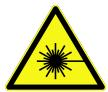

LASER LIGHT, DO NOT STARE INTO BEAM: CLASS 2M LASER PRODUCT FAILURE TO FOLLOW THESE INSTRUCTIONS MAY CAUSE SERIOUS INJURY

Cognex places the following labels on every 3D displacement sensor:

DS925B

Laser radiation

Do not stare into the beam or view directly with optical instruments

Class 2M LaserProduct

IEC 60825-1: 2008-05

$\mathsf { P } _ { 0 } \leq$ 8mW, $\mathsf { P } _ { \mathsf { P } } \leq$ 8mW $\mathsf { H } \leq 5 2 \mathsf { W } / \mathsf { m } ^ { 2 } ;$

$\lambda = 4 0 5 \mathsf { n }$ m； $\mathsf { F } = 0 .$ ..4kHz, $\mathrm { { } ^ { t = } }$ 1us...8

DS910B

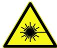

Laserradiation

Donotstareintobeamor

exposeusersoftelescopeoptics

Class2MLaserProduct

IEC60825-1:2015-07

P≤7mW，P≤7mW;H≤62W/m²；

COMPLIESWO..H,10=ND1040.11

EXCEPTFORDEVIATIONSPURSUANTTOLASER

NOTICENO.50.DATEDJUNE24.2007

DS925B (820-9164-1R)

  
Label Locations

DS910B (820-9166-1R)

  
All DS900 Series Sensors

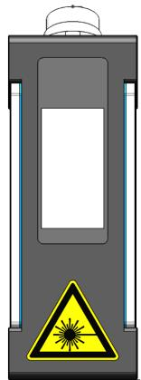  
LASER LIGHT, DO NOT STARE INTO BEAM: CLASS 2M LASER PRODUCT   
Label Location

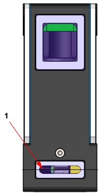  
1 - Laser window   
AVOID EXPOSURE - LASER RADIATION IS EMITTED FROM THISAPERTURE

# Warnings and Notices

Cognex provides the following warnings and notices:

l Do not stare into the beam.   
l Do not view directly with optical instruments (magnifiers).   
l Do not place optical components (mirrors) into the beam.   
l Design test fixtures in such a way that unintentional viewing of the beam is prevented.   
l Switch off the laser when not in use.   
l Avoid the use of highly reflective materials. If you cannot, try to angle the part so unintentional viewing of the reflection is prevented.   
l Terminate (block) unused beams.   
l Keep the laser plane horizontal or pointing downwards.   
l Report any issues that may have an impact on laser safety to your supervisor or Laser Safety Officer.   
l There is no scheduled maintenance necessary to keep the product in compliance.   
l Under no circumstances should you operate the sensor if it is defective or the seal damaged. Cognex Corporation cannot be held responsible for any harm caused by operating a faulty unit.   
l Under no circumstance should you modify in any way the sensor or its housing.   
l Use of controls or adjustments or performance of procedures other than those specified herein may result in hazardous radiation exposure.   
l When moving the unit from a very hot environment to a cold environment please allow the unit to equalize in a room temperature environment for 2 hours between temperature extremes.

If you need more information on the collection, reuse, and recycling systems, please contact your local or regional waste administration. You may also contact your supplier for more information on the environmental performance of this product.

# Product Service

l Bring any performance issues to the attention of your Cognex sales representative.   
l The sensor can only be serviced by a trained Cognex representative. Return the unit to Cognex for any service or repairs.   
l Do not operate the sensor if the enclosure appears damaged.

# Safely Handling

l Retain the original packaging supplied by Cognex and re-use it whenever you ship your sensor.   
l Follow the instructions in Sensor Maintenance on page 9 for details on cleaning the sensor.   
l Always observe the environmental limits. Subjecting the unit to shock, vibration or rough handling in excess of the specified limits can cause the sensor to fail.   
l Do not store or install your sensor in excessively hot, cold, dusty, or damp environments.   
l For laser safety information, see Laser Models on page 4.   
l For electrical safety information, see Power Supply on page 21.

# Cognex 3D Displacement Sensors

Cognex 3D displacement sensors combine GigE Vision and laser-stripe illumination to generate information about three-dimensional objects that cannot easily be generated by cameras that acquire two-dimensional images. The sensor offers highly accurate physical object measurements by analyzing the shape of the laser stripe as it appears to the camera (which is positioned at an angle to the laser).

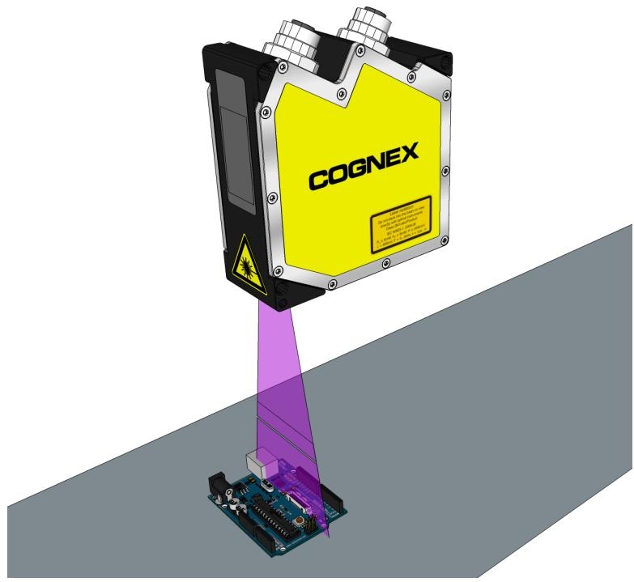

The image of the laser stripe represents a cross-section of the object under inspection. Your application might use this cross-section data, or you can use a 3D displacement sensor to acquire a series of images while the object moves past and then combine the height data of each image to generate a synthetic 2D image containing height profile information in real-world coordinates.

# Accessories

The following optional components can be purchased separately. For a complete list of options and accessories, contact your Cognex sales representative.

# Ethernet Cables

Note: This cable is not compatible with the DS1000 series.

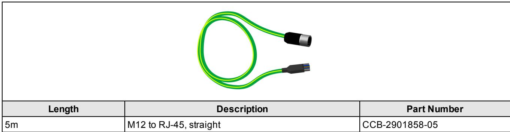

# Multifunction Cable

For more information, refer to Multifunction Port on page 23 for the pin-out of the unterminated flying leads.

Note: This cable is required if PoE is not used to power the sensor.

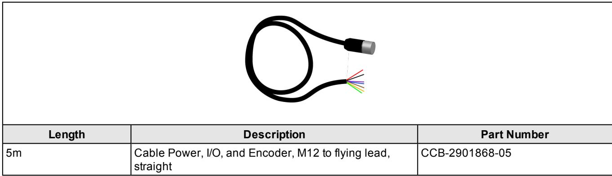

# Sensor Maintenance

The windows to the camera and laser must be kept clean and free of defects to ensure proper operation. Any scratches, dust or dirt will impact the accuracy of acquired images.

CAUTION: Use care not to damage the anti-reflective coating on the windows.

Cognex makes the following recommendations for cleaning the laser and camera windows:

l Unplug the unit so the laser cannot be enabled.   
l Use lint-free tissue or an optical grade cotton swab ("Q-tip").   
l Use reagent-grade isopropyl alcohol.   
l Use minimal pressure.   
l Use several tissues or swabs.   
l Start at the center of each window and spiral out to the edges.   
l Rotate the tissue or swab during cleaning so dirt is not dragged across the surface.

# System Layout

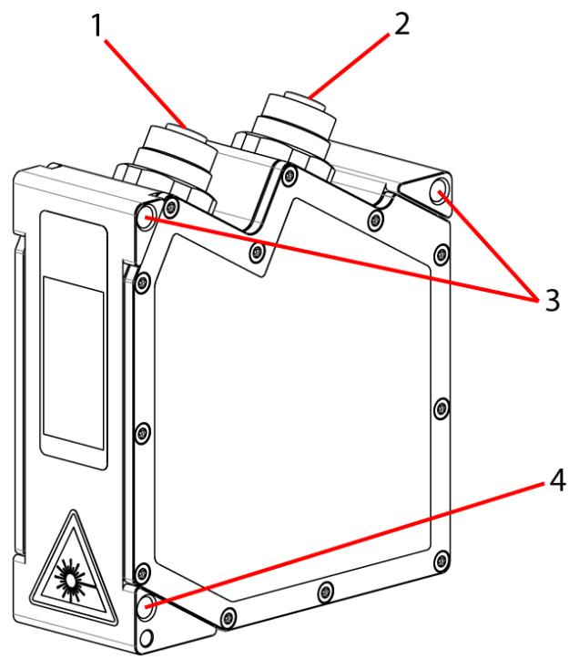

<table><tr><td>Component</td><td>Description</td></tr><tr><td>1</td><td>Ethernet socket</td></tr><tr><td>2</td><td>Multifunction socket (24V DC power + I/O connector)</td></tr><tr><td>3</td><td>M5 threaded mounting holes</td></tr><tr><td>4</td><td>This pin hole is provided for a position locking pin. The sensor can be mounted reproducible and replaceable together with an attachment point.</td></tr></table>

# Bottom View

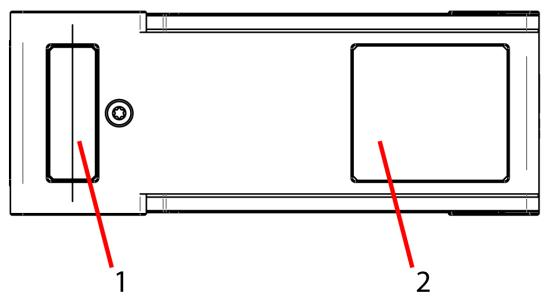

<table><tr><td>Component</td><td>Description</td></tr><tr><td rowspan="2">1</td><td>Laser window</td></tr><tr><td>CAUTION: AVOID EXPOSURE - LASER RADIATION IS EMITTED FROM THIS APERTURE</td></tr><tr><td>2</td><td>Camera window</td></tr></table>

# System LEDs

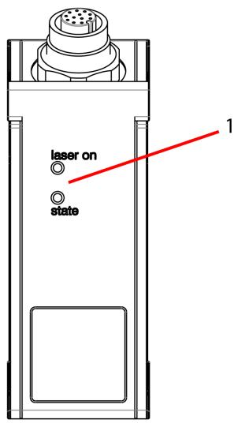

<table><tr><td>Component</td><td colspan="2">Description</td></tr><tr><td>Laser On</td><td colspan="2">Indicates the laser is on.</td></tr><tr><td rowspan="3">State</td><td>Solid green</td><td>Measuring</td></tr><tr><td>Green flashing</td><td>Data transmission: 
• Long flashes for data transmission.
• Short for access to vision controller.</td></tr><tr><td>Red flashing</td><td>Error code.</td></tr></table>

DS910B Sensor Specifications   

<table><tr><td>Specification</td><td colspan="2">DS910B</td></tr><tr><td>Weight</td><td colspan="2">440 g</td></tr><tr><td>Dimensions</td><td colspan="2">118.5 mm (H) x 33 mm (W) x 85 mm (L)</td></tr><tr><td>Operating Temperature</td><td colspan="2">0°C to 45°C (32°F to 113°F)</td></tr><tr><td>Storage Temperature</td><td colspan="2">-20°C to 70°C (-4°F to 158°F)</td></tr><tr><td>Maximum Humidity</td><td colspan="2">5% - 95% (non-condensing)</td></tr><tr><td>Environmental</td><td colspan="2">IP65 (with Cognex recommended IP65 Ethernet and Power I/O cables)</td></tr><tr><td>Laser Power</td><td colspan="2">7mW (class 2M) at 405nm wavelength</td></tr><tr><td>Power Supply Requirements</td><td colspan="2">Voltage: +24 VDC (11-30 VDC)
Current: 500 mA max
IEEE 802.3af Power over Ethernet</td></tr><tr><td>Discrete I/O Operating Limits</td><td>Trigger</td><td>Input voltage limits: 0 VDC to +30 VDC
Input ON: &gt; 2.4 VDC (TTL); &gt; 11 VDC (HTL)
Input OFF: &lt; 0.8 VDC (TTL); &lt; 3 VDC (HTL)</td></tr><tr><td>Encoder Input Specification</td><td colspan="2">Single -ended: A+/B+: 5-24V; A-/B-: +0VDC</td></tr><tr><td>Scan Rate</td><td colspan="2">Up to 1.2 kHz</td></tr><tr><td>Ethernet</td><td colspan="2">· Gigabit Ethernet interface
· Standard M12-8 female connector</td></tr><tr><td>Certifications</td><td colspan="2">CE</td></tr></table>

DS910B Series Technical Data   

<table><tr><td>Data</td><td>DS910B</td></tr><tr><td>Measuring Range Z-axis</td><td>8 mm</td></tr><tr><td>Start of Measuring Range</td><td>52.5 mm</td></tr><tr><td>End of Measuring Range</td><td>60.5 mm</td></tr><tr><td>Line Length Midrange (X-axis)</td><td>10 mm</td></tr><tr><td>Linearity¹</td><td>± 0.17 % FSO (3 σ)</td></tr><tr><td>Resolution X-axis</td><td>1280 points/profile</td></tr><tr><td>Light Source Laser</td><td>Semiconductor laser, approx. 405 nm, 10° aperture angle, Laser class 2M: laser power 7 mW, reduced 2 mW</td></tr><tr><td>Displays</td><td>1x state / 1x laser on</td></tr><tr><td>Electromagnetic Compatibility (EMC)</td><td>According to: EN 61326-1: 2006-10 DIN EN 55011: 2007-11 (Group 1, Class B) EN 61000-6-2: 2006-03</td></tr></table>

FSO $=$ Full Scale Output | MMR $=$ Midrange

# Dimensions (DS910B)

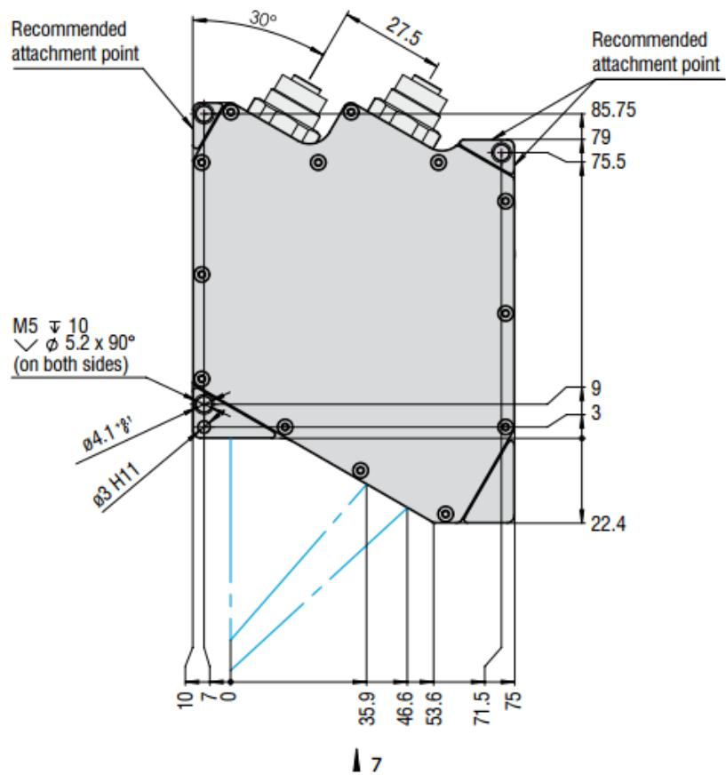

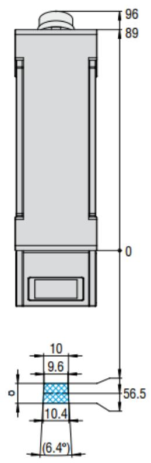

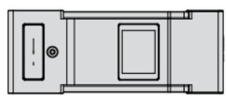

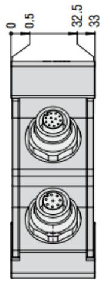

DS925B Sensor Specifications   

<table><tr><td>Specification</td><td colspan="2">DS925B</td></tr><tr><td>Weight</td><td colspan="2">380 g</td></tr><tr><td>Dimensions</td><td colspan="2">96 mm (H) x 33 mm (W) x 85 mm (L)</td></tr><tr><td>Operating Temperature</td><td colspan="2">0°C to 45°C (32°F to 113°F)</td></tr><tr><td>Storage Temperature</td><td colspan="2">-20°C to 70°C (-4°F to 158°F)</td></tr><tr><td>Maximum Humidity</td><td colspan="2">5% - 95% (non-condensing)</td></tr><tr><td>Environmental</td><td colspan="2">IP65 (with Cognex recommended IP65 Ethernet and Power I/O cables)</td></tr><tr><td>Laser Power</td><td colspan="2">8mW (class 2M) at 405nm wavelength</td></tr><tr><td>Power Supply Requirements</td><td colspan="2">Voltage: +24 VDC (11-30 VDC)
Current: 500 mA max
IEEE 802.3af Power over Ethernet</td></tr><tr><td>Discrete I/O Operating Limits</td><td>Trigger</td><td>Input voltage limits: 0 VDC to +30 VDC
Input ON: &gt; 2.4 VDC (TTL); &gt; 11 VDC (HTL)
Input OFF: &lt; 0.8 VDC (TTL); &lt; 3 VDC (HTL)</td></tr><tr><td>Encoder Input Specification</td><td colspan="2">Single -ended: A+/B+: 5-24V; A-/B-: +0VDC</td></tr><tr><td>Scan Rate</td><td colspan="2">Up to 1.2 kHz</td></tr><tr><td>Ethernet</td><td colspan="2">· Gigabit Ethernet interface
· Standard M12-8 female connector</td></tr><tr><td>Certifications</td><td colspan="2">CE</td></tr></table>

DS925B Series Technical Data   

<table><tr><td>Data</td><td>DS925B</td></tr><tr><td>Measuring Range Z-axis</td><td>25 mm</td></tr><tr><td>Start of Measuring Range</td><td>53.5 mm</td></tr><tr><td>End of Measuring Range</td><td>78.5 mm</td></tr><tr><td>Start of Measuring Range, 
Extended, Approx.</td><td>53 mm</td></tr><tr><td>End of Measuring Range, 
Extended, Approx.</td><td>79 mm</td></tr><tr><td>Line Length Midrange (X-axis)</td><td>25 mm</td></tr><tr><td>Linearity1</td><td>± 0.16 % FSO (3 σ)</td></tr><tr><td>Resolution X-axis</td><td>1280 points/profile</td></tr><tr><td>Light Source Laser</td><td>Semiconductor laser, approx. 405 nm, 20°... 25° aperture angle, Laser class 2M: 
laser power 8 mW, reduced 2 mW</td></tr><tr><td>Displays</td><td>1x state / 1x laser on</td></tr><tr><td>Electromagnetic Compatibility 
(EMC)</td><td>According to: EN 61326-1: 2006-10 
DIN EN 55011: 2007-11 (Group 1, Class B) 
EN 61000-6-2: 2006-03</td></tr></table>

FSO $=$ Full Scale Output | MMR $=$ Midrange

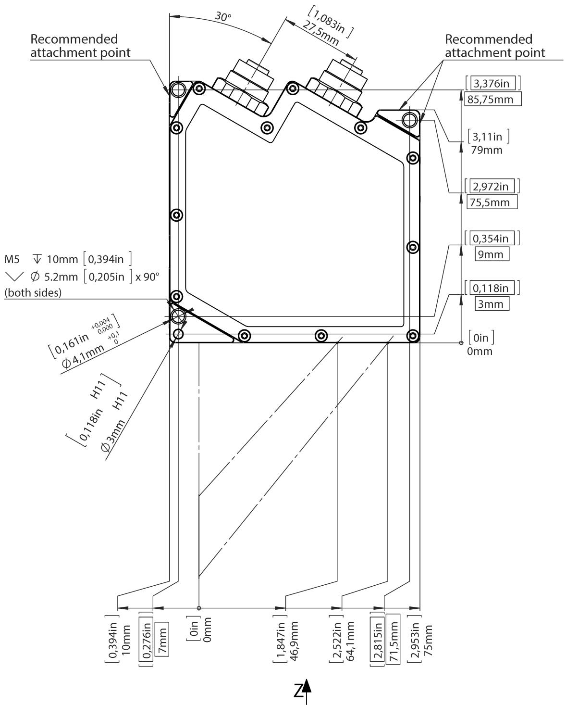  
Dimensions (DS925B)

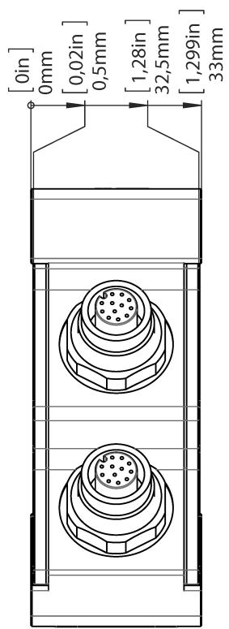

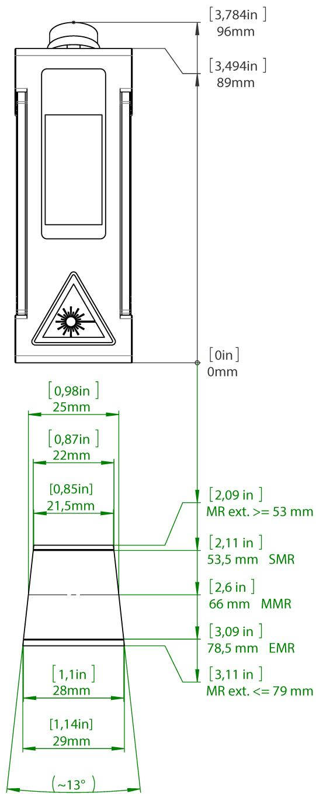

# Installation Instructions

#

l Only Cognex-approved shielded cables should be used. See Accessories on page 8 for cable part numbers.   
l Cable shields should be connected to the machinery’s potential equalization terminals in order to avoid electrical current ground loops.

i

l Cables should be routed in accordance with standard electrical wiring procedures in order to minimize electrical noise.   
l The minimum bend radius of the cables is 80mm.   
l Cognex recommends the use of a separate power supply, either:

l ACC-24I (DIN rail mountable, input 230VAC, output 24VDC/2A).   
l ACC-QUINT-PS (DIN rail mountable, input 230VAC, output 24VDC/5A).

1. Mount the sensor according to the mounting instructions, see Mounting the DS900 Series Sensor on page 20.   
2. Install the Ethernet interface hardware, if not already installed.   
3. Install VisionPro software according to the instructions of the VisionPro documentation.   
4. Make sure that your license is installed and valid.   
5. Connect the DS900 Series Sensor to the PC via Ethernet.   
6. Switch on the power supply (only applicable if not using PoE for power).   
7. Open the Cognex GigE Vision Configurator PC application.   
8. Check that the device is recognized by the PC. This may take a few seconds.

The "state" LED indicates different error conditions by flashing. If several errors occur at the same time, it indicates two of them alternately. Therefore the LED can continue to flash for some time after the rectification of an error. If no flashing occurs for several seconds, no error has occurred. For the error codes, see Error Codes on page 39.

Note: A DS900 series sensor achieves highest precision measurements after it has been turned on for at least 20 minutes.

# Mounting the DS900 Series Sensor

Firmly mount the sensor so that the laser is perpendicular to the motion of travel. The accuracy and reliability of your 3D images relies on the three-dimensional coordinate system defined by the position of the sensor and the movement of objects that pass within its view.

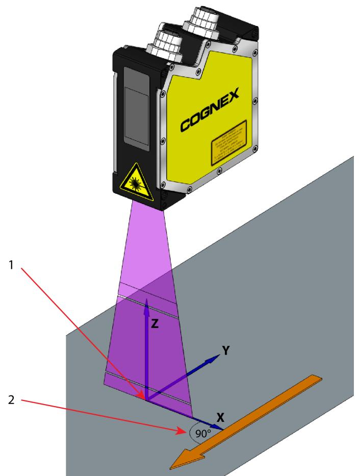

<table><tr><td></td><td>Description</td></tr><tr><td>1</td><td>The origin of the X axis is the optical centerline of the sensor projected onto the Working Section.</td></tr><tr><td>2</td><td>For best results, movement should be perpendicular to the laser plane.</td></tr></table>

The device has three (3) threaded M5 holes and can be mounted using 2 or 3 of these holes, either as direct attachment points using M5 screws, or as through-holes accommodating M4 screws. One of the mounting holes is a 3mm diameter reference pin hole, provided to ensure accurate location of the unit during initial mounting or replacement. Refer to the drawings in Dimensions (DS925B) on page 17for mounting dimensions and hole locations.

# Note:

l See Safely Handling on page 6 for handling precautions that should be observed during mounting.

# i

l The unit should be mounted such that the laser beam strikes the target surface at right angles. Misalignment of the unit can result in inaccurate measurements.

# Power Supply

The sensor can be powered by either connecting to a PoE port, or using an external power supply via the multifunction port. The following information pertains to connecting power via the multifunction port. For a description and pin assignment, see Multifunction Port on page 23.

Note: If the sensor is connected to a network adapter/switch that is capable of PoE and if you also use the power supply of the multifunction port, these two power supplies have to be galvanically isolated.

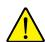

CAUTION: Connect the multifunction port only when the power supply is switched off.

The shielded Multifunction cable (CCB-2901868-05) is recommended. It uses an M12-12 connector with male pins, providing access to trigger, inputs and PoE. The cable shield is connected with the connector housing and should be connected to the protective conductor PE of the power supply.   
l Range: 11 VDC – 30 VDC (rated value 24 VDC); maximum 500 mA. The operating voltage is protected against reverse polarity.   
l The operating voltage for the DS900 series sensor should come from a 24 VDC power supply that is only used for measuring equipment and not simultaneously for drives, contactors or similar pulse interference sources. Use a power supply with galvanic isolation.

# Ethernet Connection

For Ethernet connections, the 3D sensor supports an M12-8 connector with female pins:

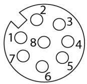

The Ethernet cable uses an RJ45 connector and an M12-8 connector with male pins:

<table><tr><td colspan="2">RJ45 Connector</td><td colspan="3">8-pin screw connector (sensor side)</td></tr><tr><td colspan="2">1</td><td colspan="3">30248167</td></tr><tr><td>Pin No.</td><td>Color stranded hook-up wire</td><td>Pin no.</td><td>10BaseT, 100BaseTX</td><td>1000BaseT</td></tr><tr><td>1</td><td>white / orange</td><td>5</td><td>Tx+</td><td>D1+</td></tr><tr><td>2</td><td>orange</td><td>6</td><td>Tx-</td><td>D1-</td></tr><tr><td>3</td><td>white / green</td><td>8</td><td>Rx+</td><td>D2+</td></tr><tr><td>6</td><td>blue</td><td>1</td><td></td><td>D3+</td></tr><tr><td>4</td><td>white / blue</td><td>2</td><td></td><td>D3-</td></tr><tr><td>5</td><td>green</td><td>7</td><td>Rx-</td><td>D2-</td></tr><tr><td>7</td><td>white / brown</td><td>3</td><td></td><td>D4+</td></tr><tr><td>8</td><td>brown</td><td>4</td><td></td><td>D4-</td></tr></table>

Cognex recommends the Gigabit-Ethernet connection cable CCB-2901858-05 for the Ethernet connection (5m). Characteristics: $4 \times 2 \times 0 . 4 \ : \mathrm { m m } ^ { 2 }$ ; shielded.

# Note: Not compatible with the one used by DS1000 series sensors.

Cognex recommends you connect the DS unit directly to a 1 Gigabit network port or to a high-quality switch. Your PC should have one or more network cards dedicated only for the 3D sensors.

Operating the sensor via Ethernet does not require any driver installation provided the network settings are correct:

l If more than one network card is used, they must be placed on different subnets.   
l Some network settings will affect the performance of the sensor (for example firewall and packet filter settings).   
l Cognex recommends a packet size of 1024 bytes/packet. The sensor is capable of supporting jumbo frames up to 4096 bytes/packet, provided all network components also support jumbo frames.

Network-related sensor features:

l The sensor supports DHCP by default. If the sensor is unable to obtain a network address via DHCP, the sensor will use link-local addressing (169.254.x.x). Be aware that IP address conflict detection is not implemented.   
l The sensor supports Power over Ethernet (PoE).   
l The sensor can be configured with a fixed (static) IP address using the Cognex GigE Vision Configurator application.

# Multifunction Port

The following information pertains to connecting power via the multifunction port, an M12-12 port with female pins.

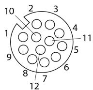

The shielded Multifunction cable (CCB-2901868-05) is recommended. It uses an M12-12 connector with male pins, providing access to trigger, inputs and PoE. The cable shield is connected with the connector housing and should be connected to the protective conductor PE of the power supply.

<table><tr><td colspan="2">1143210
11567812</td><td></td><td></td></tr><tr><td>Pin #</td><td>Signal Name</td><td>Notes</td><td>Wire Color</td></tr><tr><td>9</td><td>PWR</td><td>+ 11 VDC - 30V DC (rated value 24 V); max. 500 mA1</td><td>Red</td></tr><tr><td>2</td><td>GND</td><td>0 V</td><td>Blue</td></tr><tr><td>3</td><td>+Laser on/off</td><td rowspan="2">Optional</td><td>White</td></tr><tr><td>1</td><td>-Laser on/off</td><td>Brown</td></tr><tr><td>6</td><td>In1</td><td>Digital Input 1</td><td>Yellow</td></tr><tr><td>4</td><td>GND-In1</td><td>Ground In1</td><td>Green</td></tr><tr><td>5</td><td>In2</td><td>Digital Input 2</td><td>Pink</td></tr><tr><td>8</td><td>GND-In2</td><td>Ground In2</td><td>Gray</td></tr><tr><td>10</td><td>In3</td><td>Digital Input 3</td><td>Purple</td></tr><tr><td>7</td><td>GND-In3</td><td>Ground In3</td><td>Black</td></tr></table>

l PWR, GND: galvanically isolated from In1, In2, In3, and Laser on/off   
l Laser on/off: Input galvanically isolated from GND, In1, In2, In3   
l In1, In2, In3: Inputs galvanically isolated from GND and Laser on/off   
l GND-In1, GND-In2, GND-In3 - IO ground references for In1, In2, In3. Galvanically isolated from GND.

Note: If the sensor is connected to a network adapter/switch that is capable of PoE and if you also use the power supply of the multifunction port, these two power supplies have to be galvanically isolated.

# RS422

The RS422 connection (Pin 11 and 12 of the multifunction port) can be used in either of the following configurations:

l Load user modes and sensor control (half-duplex RS422).   
l Supplying line trigger signals.   
l Synchronization of line trigger signals.

# Signal Levels

The switching inputs of the multifunction port can either be used for encoder or trigger input or for loading previously stored user modes. The signal levels are switchable for all switching inputs together via software between LLL (lowvoltage-, TTL logic) and HLL (high-voltage-, HTL logic).

l LLL level: Low 0 V… 0.8 V, High 2.4 V… 5 V, internal pull-up 10 kOhm to 5 V   
l HLL level: Low 0 V… 3 V, High 11 V… 24 V (permitted up to 30 V), internal pull-up 10 kOhm to 24   
l Pulse duration: ≥ 5 μs

# Switching Inputs

The switching inputs In1 up to In3 can be used for triggering or for connecting an encoder. All switching inputs are identical. The circuits have internal electrical isolation. The inputs are galvanically isolated from the GND and Laser on/off. Each switching input has its own ground connection (GND-In1 to 3), which has to be connected with the external ground (synchronization/trigger source or another device).

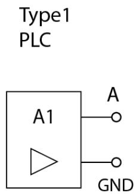

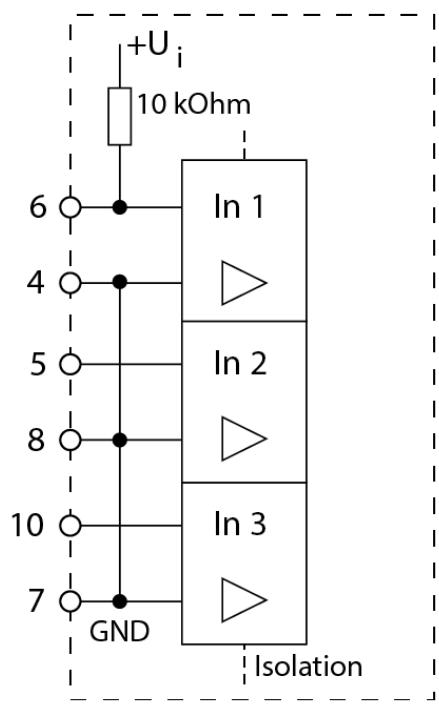  
TTL or 5 V (High) HTL or 24 V (High)   
TTL (LLL) Level HTL (HLL) Level

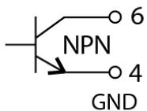  
Type1 Transistor

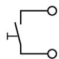  
Type 2 Switch

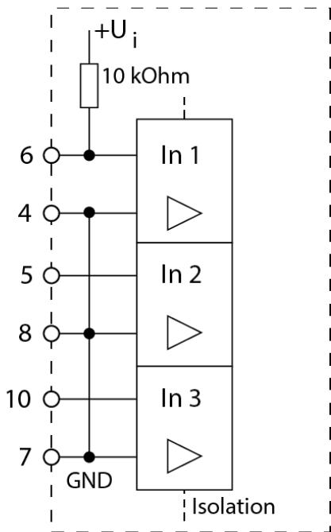  
TTL (LLL) Level

The multifunction port can be used with any of the following configurations:

<table><tr><td></td><td>Configuration</td><td>In1</td><td>In2</td><td>In3</td></tr><tr><td>0</td><td>Encoder with index, positive edge works with the index1</td><td>N</td><td>A</td><td>B</td></tr><tr><td>1</td><td>Encoder without index, additionally line trigger possible2</td><td>Trigger</td><td>A</td><td>B</td></tr><tr><td>2</td><td>Line trigger</td><td>Trigger</td><td></td><td></td></tr><tr><td>3</td><td>Line trigger, load up to 4 user modes</td><td>Trigger</td><td>Mode Bit 0</td><td>Mode Bit 1</td></tr><tr><td>4</td><td>Load up to 8 user modes</td><td>Mode Bit 0</td><td>Mode Bit 1</td><td>Mode Bit 2</td></tr><tr><td>5</td><td>Transmit in time stamp</td><td>Bit 0</td><td>Bit 1</td><td>Bit 2</td></tr></table>

# Note:

l Use a shielded cable with twisted wires.The shielded Multifunction cable (CCB-2901868-05) is recommended. It uses an M12-12 connector with male pins, providing access to trigger, inputs and PoE. The cable shield is connected with the connector housing and should be connected to the protective conductor PE of the power supply.   
l If the sensor is connected to a network adapter/switch that is capable of PoE and if you also use the power supply of the multifunction port, these two power supplies have to be galvanically isolated.

# RS422, Synchronization

Note: The DS900 series sensor supports Power over Ethernet. If the sensor is connected to a network adapter/switch that is capable of PoE and if you also use the power supply of the multifunction port, these two power supplies have to be galvanically isolated.

l For the multifunction socket and the pin assignment, see Multifunction Port on page 23.   
l The DS900 series sensor has an RS422 port according to EIA standards, which can be parameterized as input or output via software.   
l The RS422 port can be used to synchronize line-triggering of multiple sensors with each other.   
l The internal terminating resistor (termination $\mathsf { R } _ { \mathsf { T } } = 1 2 0$ Ohm, see the following diagram) can be activated or switched off via software. The signals must be operated symmetrically according to the RS422 standard.   
l The RS422 port is galvanically isolated from GND and Laser on/off, but not from GND-In1 ... 3. When used, one of the GND-In1 ... 3 should be connected to the GND of the remote station in order to avoid potential differences.

The multifunction socket can be used with either of the following configurations:

<table><tr><td></td><td>Configuration</td><td>Direction</td><td>Standard setting for terminating resistor RT</td></tr><tr><td>0</td><td>Half-duplex, serial communication with 115200 Baud</td><td>input/output</td><td rowspan="5">On</td></tr><tr><td>1</td><td>Half-duplex, serial communication with 57600 Baud</td><td>input/output</td></tr><tr><td>2</td><td>Half-duplex, serial communication with 38400 Baud</td><td>input/output</td></tr><tr><td>3</td><td>Half-duplex, serial communication with 19200 Baud</td><td>input/output</td></tr><tr><td>4</td><td>Half-duplex, serial communication with 9600 Baud</td><td>input/output</td></tr><tr><td>5</td><td>Line trigger input</td><td>input</td><td>On</td></tr><tr><td>6</td><td>Line trigger output</td><td>output</td><td>Off</td></tr><tr><td>7</td><td>CMM trigger output</td><td>output</td><td>Off</td></tr></table>

Synchronizing several sensors with each other:

1. Connect the output RS422+ (Pin 12) of sensor 1 with the input RS422+ (Pin 12) of sensor 2.   
2. Connect the output RS422- (Pin 11) of sensor 1 with the input RS422- (Pin 11) of sensor 2.   
3. Also connect both the GND-In1 - pins (Pin 4) of the sensors to each other.

Software settings:

<table><tr><td>Setting</td><td>Sensor 1</td><td>Sensor 2</td><td>Sensor 3</td></tr><tr><td>RS422 mode</td><td>Line trigger output</td><td>Line trigger input</td><td>Line trigger input</td></tr><tr><td>No RS422 termination</td><td>No (terminating resistor not active)</td><td>Yes (terminating resistor not active)</td><td>No (terminating resistor active)</td></tr></table>

Sensor 1 then synchronizes the sensor 2 and further sensors as master.

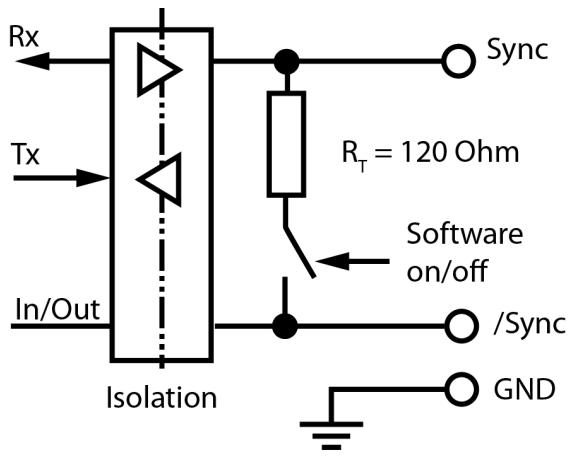

# Encoder

You must use an encoder to generate pulses as the parts move under the sensor. The way in which you set up your encoder affects the results from the sensor. Observe the following guidelines when installing your encoder:

l The rate at which encoder pulses are generated, relative to the speed of movement of the surface, will determine how many slices of height data are acquired per millimeter.

If too many slices are acquired, the image will be stretched in the Y-direction.

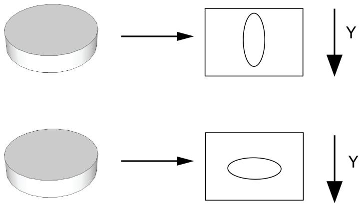

If too few slices are acquired, the image will be squashed in the Y-direction.

(Y-direction: The axis on which the conveyor belt and the object itself is moving.)

l For each set of encoder steps per line, the sensor acquires an intensity image, locates the laser line, and generates a row of peak data, which is the basis of a row in the range image. The time that it takes for the sensor to do this is the time that it takes for the encoder to count the number of steps specified in software as EncoderTriggerCounts. The duration of this encoder time must always be longer than the time it takes for the sensor to expose and process one row of data from an intensity image. The time needed to acquire an intensity image and process it is referred to as the DS900 Series Line Time.

Note: The sensor has its own software encoder. This is a good troubleshooting encoder that can be used to verify the operation of the sensor and diagnose any encoder wiring issues.

# Measuring Field Selection

The usable measuring range is always trapezoidal. The assigned maximum x-values for the z-coordinates can be found in Dimensions (DS925B) on page 17. The top edge corresponds to the start of the measuring range and the bottom edge to the end of the measuring range. The corners of the predefined measuring fields are on a grid with grid spacing of 1/8 of the matrix. The sensor matrix used in the DS900 Series Sensor supports the reading of a restricted measuring field.

The following picture shows the predefined view areas and the associated measuring fields.

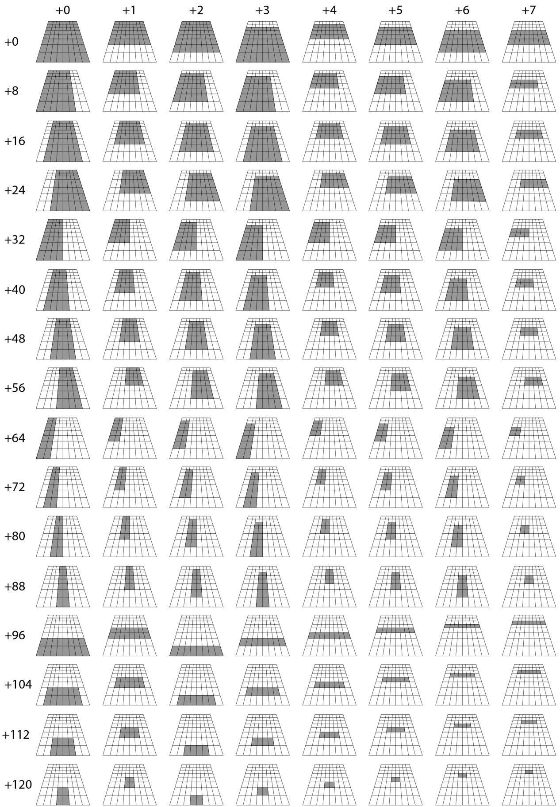

Maximum Scan Rates for Measuring Fields   

<table><tr><td colspan="9">Maximum Acquiring Rate Depending on the Measuring Field Number</td></tr><tr><td></td><td>+0</td><td>+1</td><td>+2</td><td>+3</td><td>+4</td><td>+5</td><td>+6</td><td>+7</td></tr><tr><td>0</td><td>144Hz</td><td>192Hz</td><td>192Hz</td><td>192Hz</td><td>284Hz</td><td>284Hz</td><td>284Hz</td><td>552Hz</td></tr><tr><td>8</td><td>181Hz</td><td>239Hz</td><td>239Hz</td><td>239Hz</td><td>354Hz</td><td>354Hz</td><td>354Hz</td><td>680Hz</td></tr><tr><td>16</td><td>181Hz</td><td>239Hz</td><td>239Hz</td><td>239Hz</td><td>354Hz</td><td>354Hz</td><td>354Hz</td><td>680Hz</td></tr><tr><td>24</td><td>181Hz</td><td>239Hz</td><td>239Hz</td><td>239Hz</td><td>354Hz</td><td>354Hz</td><td>354Hz</td><td>680Hz</td></tr><tr><td>32</td><td>241Hz</td><td>318Hz</td><td>318Hz</td><td>318Hz</td><td>469Hz</td><td>469Hz</td><td>469Hz</td><td>892Hz</td></tr><tr><td>40</td><td>241Hz</td><td>318Hz</td><td>318Hz</td><td>318Hz</td><td>469Hz</td><td>469Hz</td><td>469Hz</td><td>892Hz</td></tr><tr><td>48</td><td>241Hz</td><td>318Hz</td><td>318Hz</td><td>318Hz</td><td>469Hz</td><td>469Hz</td><td>469Hz</td><td>892Hz</td></tr><tr><td>56</td><td>241Hz</td><td>318Hz</td><td>318Hz</td><td>318Hz</td><td>469Hz</td><td>469Hz</td><td>469Hz</td><td>892Hz</td></tr><tr><td>64</td><td>362Hz</td><td>476Hz</td><td>476Hz</td><td>476Hz</td><td>694Hz</td><td>694Hz</td><td>694Hz</td><td>1200Hz</td></tr><tr><td>72</td><td>362Hz</td><td>476Hz</td><td>476Hz</td><td>476Hz</td><td>694Hz</td><td>694Hz</td><td>694Hz</td><td>1200Hz</td></tr><tr><td>80</td><td>362Hz</td><td>476Hz</td><td>476Hz</td><td>476Hz</td><td>694Hz</td><td>694Hz</td><td>694Hz</td><td>1200Hz</td></tr><tr><td>88</td><td>362Hz</td><td>476Hz</td><td>476Hz</td><td>476Hz</td><td>694Hz</td><td>694Hz</td><td>694Hz</td><td>1200Hz</td></tr><tr><td>96</td><td>552Hz</td><td>552Hz</td><td>1030Hz</td><td>1030Hz</td><td>1030Hz</td><td>1030Hz</td><td>1030Hz</td><td>1030Hz</td></tr><tr><td>104</td><td>680Hz</td><td>680Hz</td><td>1200Hz</td><td>1200Hz</td><td>1200Hz</td><td>1200Hz</td><td>1200Hz</td><td>1200Hz</td></tr><tr><td>112</td><td>892Hz</td><td>892Hz</td><td>1200Hz</td><td>1200Hz</td><td>1200Hz</td><td>1200Hz</td><td>1200Hz</td><td>1200Hz</td></tr><tr><td>120</td><td>1200Hz</td><td>1200Hz</td><td>1200Hz</td><td>1200Hz</td><td>1200Hz</td><td>1200Hz</td><td>1200Hz</td><td>1200Hz</td></tr></table>

# Recommended Shutter Times

The value of exposure (in milliseconds) should be set depending on the material that is being scanned. The recommendations are as follows:

<table><tr><td colspan="2">Recommended shutter times (approximate values)</td></tr><tr><td>Target material</td><td>Shutter Time</td></tr><tr><td>White paper/plastic</td><td>10 - 50μs</td></tr><tr><td>Colored plastic</td><td>50 - 100μs</td></tr><tr><td>Metallic surfaces</td><td>0.1 - 1ms</td></tr><tr><td>Black plastic/rubber</td><td>0.5 - 1ms</td></tr></table>

The measuring field can be restricted by omitting complete matrix areas in order to suppress interfering image ranges. Measuring field and measuring range must be clearly differentiated in practical use. The measuring field is related to the matrix and the measuring range is related to the measuring object (the object space). Both do not have to match on account of the optical mapping and the definitions. The measuring field “standard” is larger than the measuring range “standard”.

The DS900 Series Sensors are distinguished by:

l A laser line with $2 0 ^ { \circ }$ opening angle (measuring range ${ 2 5 } \mathsf { m m }$ ) respectively $2 5 ^ { \circ }$ opening angle (measuring ranges $5 0 ~ \mathsf { m m }$ and $1 0 0 ~ \mathsf { m m }$ ).   
l The receiver has a smaller opening angle (view angle) than the laser line.   
l Centered measuring field (symmetrical to the center axis).   
l The high resolution sensor image matrix has 1280 x 1024 pixels. The measuring field geometry is fixed.

l Reference for the distance (Z-axis) is the lowest body edge of the sensor, see the dimensional drawings (see Dimensions (DS925B) on page 17).   
l Use of the GigE-Vision standard.   
l Standard GigE Vision implementation from different manufacturers can be used.

DS910B – Measurement Specifications   

<table><tr><td>Specification</td><td>DS910B</td></tr><tr><td>Near Field of View</td><td>9.4 mm</td></tr><tr><td>Far Field of View</td><td>10.7 mm</td></tr><tr><td>Clearance Distance (CD)</td><td>53 mm</td></tr><tr><td>Measurement Range (MR)</td><td>8 mm</td></tr><tr><td>Resolution X</td><td>0.0073 mm - 0.0084 mm</td></tr><tr><td>Resolution Z</td><td>0.001 mm</td></tr></table>

DS925B – Measurement Specifications   

<table><tr><td>Specification</td><td>DS925B</td></tr><tr><td>Near Field of View</td><td>23.4 mm</td></tr><tr><td>Far Field of View</td><td>29.1 mm</td></tr><tr><td>Clearance Distance (CD)</td><td>53.5 mm</td></tr><tr><td>Measurement Range (MR)</td><td>25 mm</td></tr><tr><td>Resolution X</td><td>0.0183 mm - 0.0227 mm</td></tr><tr><td>Resolution Z</td><td>0.002 mm</td></tr></table>

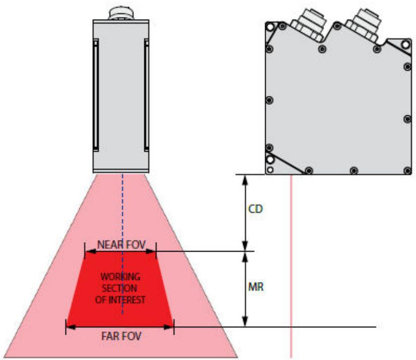

# Error Influences

# l Reflection of the Target Surface

The sensor evaluates the diffuse light returned from the laser line projection. Note that it is not possible to identify a specific minim reflectance factor in order for measurements to be successful. Testing is always required when using a sensor on transparent objects or highly mirrored surfaces. Direct reflection on such surfaces cannot be used for accurate measurements due to the fan-shaped form of the laser line projection.

# l Color Differences

Color differences of measurement objects have effects. However, these color differences are often also combined with different penetration depths of the laser light into the material. Different penetration depths in turn result in apparent changes of the line thickness. Therefore, color changes, combined with penetration depth changes, can result in inaccurate measurements.

As the exposure parameters can only be changed as a whole for one profile, careful matching of the exposure to the target surface is recommended.

# l Temperature Influences

A running-in time of at least 20 minutes during start-up is required in order to achieve a uniform temperature spread in the sensor.

If measurements with accuracy in the μm range are made, the effect of temperature fluctuations on the mounting must also be observed by the user.

Due to the damping effect of the thermal capacity of the sensor, fast temperature changes are only measured after a delay.

# l External Light

An interference filter in the sensor is present for suppression of external light.

In general, the shielding of external light directly emitted on the target or reflected in the sensor must be ensured using protective covers or similar.

Pay particular attention to unwanted reflections of the laser line outside the measuring object range (background, object holder or similar) which can be reflected back again into the view area of the receiver.

Matte black surface coatings are recommended for all objects outside the measuring range (object holders, transport apparatus or similar) which can be reflected back again into the view area of the receiver.

# l Mechanical Vibrations

If you want to achieve high resolutions in the $\mu \mathsf { m }$ range with the sensor, pay particular attention to stable or vibration-damped sensor and measuring object mounting.

# l Surface Roughness

Surface roughness of $5 \mu \mathsf { m }$ and more results in "surface noises" due to interference of the laser light.

Direct reflections of the laser light into the receiver can also occur due to fine surface grooves (e.g. abrasion marks), particularly if these run parallel to the laser line. This can result in inaccurate measurements.

Prevention of this effect might be possible by adjusting several sensor settings e.g. exposure time, filter.

# l Shadowing Effects

l Receiver: The laser line can disappear completely or partially behind steep edges. The receiver then can not "see" these areas.

l Laser Line: The fan-shaped form of the laser line inevitably results in parallel shadowing at vertical edges. In order to make these areas visible, only changing the sensor of the object position helps.

As a general rule, measuring objects with steep edges cannot be one hundred percent measured using laser triangulation. The missing areas can only be supplemented or interpolated using suitable software.

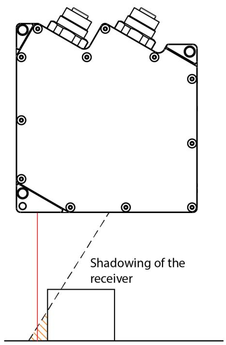

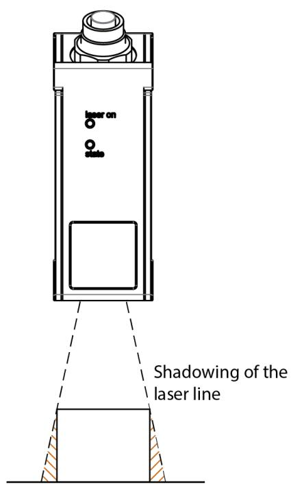

# DS900 Series Sensor Accuracy

l Measurement accuracy varies depending on how accurately the unit is mounted and on the surface characteristics of the object being measured; it is not possible to specify a guaranteed accuracy value.   
l In general, sensor accuracy is improved when:

l Relative measurements are made within a single scene (what is the difference between surface A and surface B) are more accurate than absolute measurements (how far is surface B from the sensor).   
l The sensor is rigidly mounted using the high-accuracy mounting hole.   
l The sensor is precisely perpendicular to the surface being measured.

l In general, sensor accuracy is the best at the optical axis.   
l In general, sensor range measurements are extremely repeatable, however the accuracy is dependent on how well the exposure is set.

# Error Codes

- indicates that the “state” LED lights for a longer time.   
. indicates that the “state” LED lights briefly.

<table><tr><td>Flashing sequence</td><td>Cause</td><td>Remedy</td><td>Notes</td></tr><tr><td colspan="4">Group: Loading / saving configuration</td></tr><tr><td>2x short</td><td>Mode not found.</td><td>Select different one.</td><td>Only previously stored modes can be called up.</td></tr><tr><td>2x short, 1x long</td><td>White error flash.</td><td>Contact manufacturer, return sensor.</td><td>Should not occur in normal operation.</td></tr><tr><td>3x short</td><td>Flash full.</td><td>None, contact manufacturer.</td><td>Should not occur in normal operation.</td></tr><tr><td>4x short</td><td>Loading suppressed due to active data transmission.</td><td>Stop active data transmission.</td><td>Prevents PC software crashes.</td></tr><tr><td>2x long, 3x short</td><td>Data overflow during transmission of the data via Ethernet.</td><td>Reduce profile frequency, increase packet size.</td><td>Data can be impaired.</td></tr><tr><td>2x long, 5x short</td><td>Error during calculation.</td><td>Reduce profile frequency, select faster calculation mode.</td><td>Data can be impaired.</td></tr><tr><td>2x long, 6x short</td><td>Error during Ethernet transmission.</td><td>Reduce profile frequency.</td><td>Data can be impaired.</td></tr><tr><td colspan="4">Group: Data processing and transmission</td></tr><tr><td>2x long</td><td>Data overflow in the sensor.</td><td>Select smaller measuring field, reduce profile frequency, select less complex measuring program.</td><td>Data can be impaired; exposure time can be longer than expected.</td></tr><tr><td>2x long, 1x short</td><td>Data overflow during receipt of the data from the sensor.</td><td>Select smaller measuring field, reduce profile frequency, select less complex measuring program.</td><td>Data can be impaired.</td></tr><tr><td>2x long, 2x short</td><td>Data overflow for serial port RS422.</td><td>Reduce profile frequency, select less complex measuring program.</td><td>Data can be impaired.</td></tr><tr><td colspan="4">Group: Ethernet Interface</td></tr><tr><td>4x long</td><td>IP Address conflict.</td><td>Check the Ethernet configuration of device and the host PC. Choose another IP address for the device.</td><td>If the problem persists, please contact the manufacturer.</td></tr></table>

l The "state" LED flashes green and long during active data transmission.   
l The "state" LED flashes green and short for controller accesses. A controller access can cause various data overflows particularly if the measuring frequency is near its maximum.

# Compliance Statements

DS900 series sensors meet or exceed the requirements of all applicable standards organizations for safe operation. As with any electrical equipment, however, the best way to ensure safe operation is to operate them according to the agency guidelines that follow. Please read these guidelines carefully before using your device.

<table><tr><td>Regulator</td><td>Specification</td></tr><tr><td>USA</td><td>CFR 47 FCC Part 15 (b) Class A FDA/CDRH Laser Notice No. 50</td></tr><tr><td>Canada</td><td>ICES-003 Issue 4 Class A</td></tr><tr><td>European Community</td><td>EN 55022:2006/A1:2007 Class A
EN 61000-6-2:2005</td></tr><tr><td>Australia</td><td>C-TICK, AS/NZS CISPR 22 / EN 55022 for Class A Equipment</td></tr><tr><td>Japan</td><td>J55022, Class A</td></tr></table>

# Safety and Regulatory

<table><tr><td>CE</td><td>Regulatory Model 1AA2</td></tr><tr><td>FC</td><td>This equipment has been tested and found to comply with the limits for a Class A digital device, pursuant to Part 15 of the FCC rules. These limits are designed to provide reasonable protection against harmful interference when the equipment is operated in a commercial environment. This equipment generates, uses, and can radiate radio frequency energy and, if not installed and used in accordance with the instructions, may cause harmful interference to radio communications. Operation of this equipment in a residential area is likely to cause harmful interference, in which case the user will be required to correct the interference at personal expense.</td></tr></table>

# For European Community Users

Cognex complies with Directive 2012/19/EU OF THE EUROPEAN PARLIAMENT AND OF THE COUNCIL of 4 July 2012 on waste electrical and electronic equipment (WEEE).

This product has required the extraction and use of natural resources for its production. It may contain hazardous substances that could impact health and the environment, if not properly disposed.

In order to avoid the dissemination of those substances in our environment and to diminish the pressure on the natural resources, we encourage you to use the appropriate take-back systems for product disposal. Those systems will reuse or recycle most of the materials of the product you are disposing in a sound way.

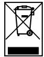

The crossed out wheeled bin symbol informs you that the product should not be disposed of along with municipal and invites you to use the appropriate separate take-back systems for product disposal.

If you need more information on the collection, reuse, and recycling systems, please contact your local or regional waste administration.

You may also contact your supplier for more information on the environmental performance of this product.

# Laser Safety Statement

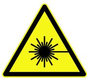

Compliance with FDA performance standards for laser products except for deviations pursuant to Laser Notice No. 50, dated June 24, 2007.

This device has been tested in accordance with IEC60825-1 2nd ed., and has been certified to be under the limits of a Class 2M Laser device.

Use of controls or adjustments or performance of procedures other than those specified herein may result in hazardous radiation exposure.