# BOLD L9·GO 1 BEFOR

ERENOCOMPANYHASGONEE

ID 培训

# 目录

DataMan 软件的介绍及使用  
 二、读码器型号的介绍及安装

# DataMan 软件的介绍及使用

 ID 使用的软件为 Dataman ：

 Dataman 软件主要分为三个版本：

5.4.0 版本、 5.6.3 版本以及 5.7.0 版本；

 5.4.0 版本主要用于 DM302X 读码器，因为 5.6.3 版本部分不兼容（连接不上）， 5.7.0 版本目前已经解决这个问题，现在开始的新项目中一般都使用 5.7.0 版本的软件；

 5.7.0 版本界面跟 5.6.3 基本一样， Module 项目 IPI 机台上用的就是 5.6.3 的版本， 5.7.0 跟 5.6.3 最大的区别就是可以随时切换中英文模式。

# 软件主界面

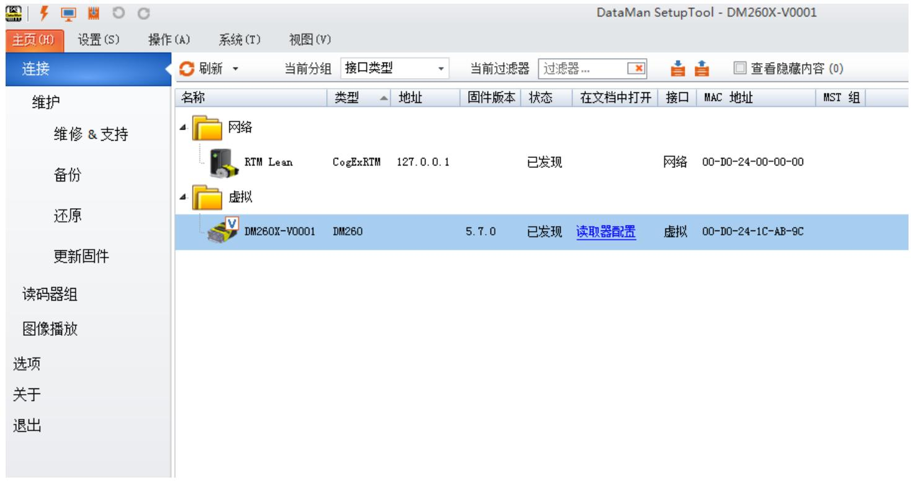

只有 5.6.0_CR7_SR1 版本的软件才能打开维护选项

# 可以通过左侧的选项浏览不同的后台页面

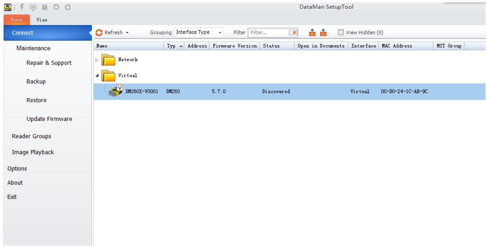

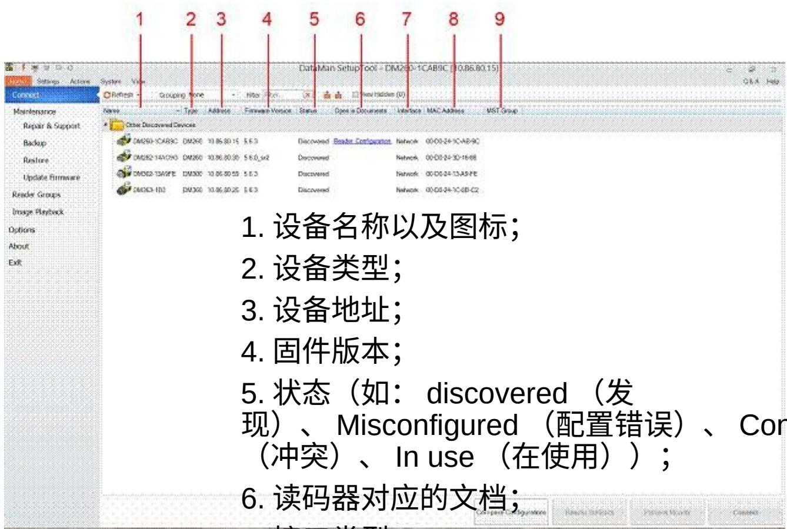

nflicting   
  
7. 接口类型；  
8.Mac 地址；  
9. 主从组；

点击 Refresh 可以刷新设备列表以及设置

# 双击其中的一个设备就可以进入到 Setting 菜单下的 Quick Stup 界面

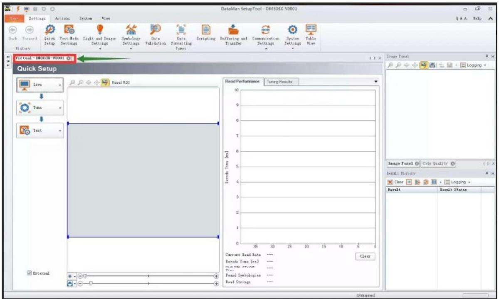

在这个页面，我们可以对连接成功的设备进行参数配置、调谐和测试为了能更快地配置读码器，我们建议按照以下主要步骤进行操作：

1 ． Live （实时显示）  
2 ． Tune （自动调节）  
3 ． Test （测试）

这些功能以大按钮的形式显示在界面左侧，点击按钮最右侧还有下拉窗口提供了更多的设置选项

# Live

 点击 Live 按钮可以进入实时显示模式。实时显示模式不仅可以显示实时图像还可以实时解码。  
点击 Live 按钮最右侧打开高级选项。

 1. 如果需要实时显示解码，请勾选 Decoding  
 2. 当 Focus Feedback 被勾选时，图像显示窗口右侧会显示一个带有颜色的计数条。计数条高度表示镜头的对焦情况（计数条越低表示对焦越差）  
 3. 勾选上 Automatic Exposure 可以让读码器自动设定曝光参数。图像显示区域下方的增益滑动条数值表示当前目标的像素灰度值。  
 在图像显示区，我们可以通过拖动、拉伸蓝色框设定感兴区域（ ROI ）。感兴区域表示读码器会在这个区域进行读码，忽略其他部分。

# Tune

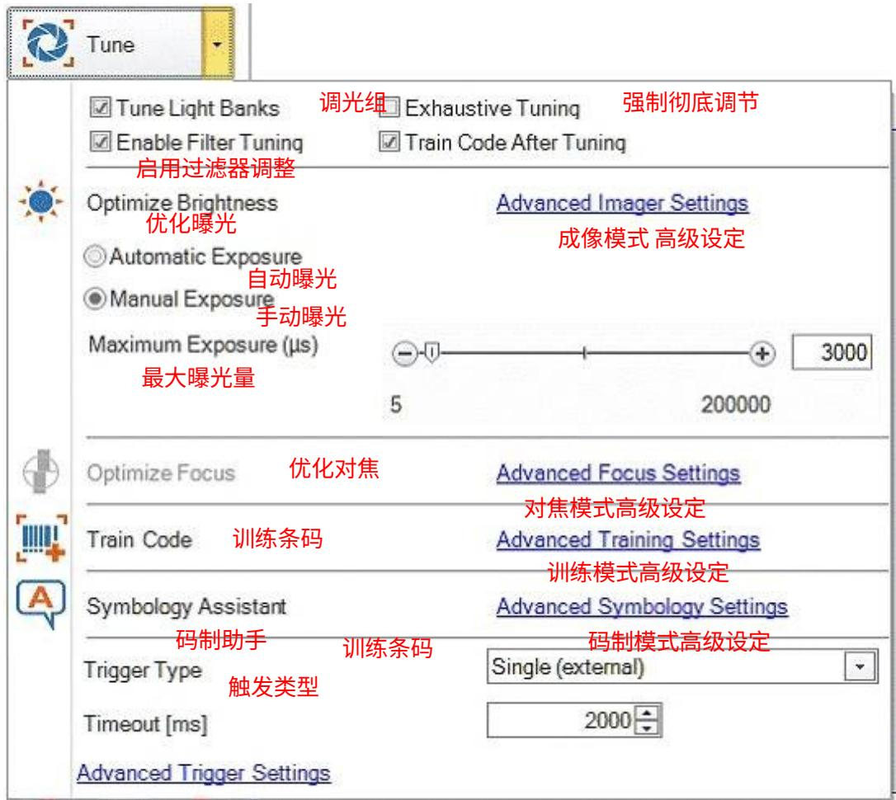

点击 Tune 按钮可以使读码器自动设定最佳读码参数。  
点击按钮最右侧下三角可以打开高级设定窗口，包括Optimize Focus （优化对焦）、 OptimizeBrightness （优化曝光）、 SymbologyAssistant （码制助手）、 trigger type （触发模式）、 Train Code （训练条码）、 Advanced TriggerSettings （触发模式高级设定）和其他调节参数设定

 l 如果设定了 Tune Light Bank ，读码器会调节光源。如果我们清楚光源的设置，自动调节时，就会跳过光源的设定。  
 l 选定 Exhaustive Tuning 会强制调节光源。当 ExhaustiveTuning 被禁用时，读码器一旦在某一光源设定下成功解码，将不再改变光源设置。如果 ExhaustiveTuning 被启用，读码器测试所有的光源设置模式，不论是否已经成功解码。  
 l 如果 Enable Filter Tuning 被选上， DataMan 会使用图像过滤器。  
 l 如果我们想在调节过程中自动对焦，需要勾选上 Optimize FocusDuring Tuning  
 l 勾选 Train Code After Tuning ，会在自动调节成功之后，对条码进行训练。

# 触发模式

 l Single ：拍摄单张图片进行解码，每个 Setup 会拍照一张。可以设定单个Setup 的超时时间（ timeout ）  
 l Presentation ：连续拍照，每次对视野中的单个条码进行解码  
 l Manual ：在足够长的时间里进行拍照，直到成功解码或者触发信号结束  
 l Burst ：拍摄一组图片进行解码，并在首次成功解码时停止解码。我们可以设定每组图片的拍摄数量， 还有每次拍照之间的时间间隔。每次拍照都可以设定一个超时时间。  
 l Self ：与 presentation 模式类似  
 l Continuous ：在触发信号结束之前持续拍照，可以设定每次拍照时间间隔。  
 l Timeout ：表示读码器等待时间，直到读码器读码成功或者失败。

# Test

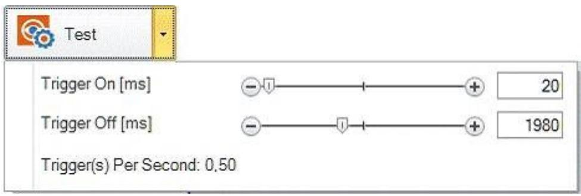

点击 Test 按钮，可以测试读码器解码性能。

# 主菜单栏

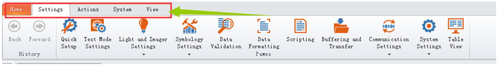

Home ：点击 Home 就可以回到主页面；

Setting: 主要的参数设置在 Setting 里面：

Quick Setup: 快速设置， 点击它就返回这个页面；

Test Mode Settings: 测试模式设置 ;

Light and Imager Settings ：主要设置图片的规格等

Symbology Settings: 符号设置，主要设置输出码的类型和数量前后顺序等；

Data Formatting pames ：数据格式化帕纳斯

# 二、 读码器常见的型号以及安装

# 常见的型号有

DM50X 、 DM262X 、 DM302X 、 DM8050 、 DM8600

  
DM50X ：

<table><tr><td>参数</td><td>DataMan 50/60 Imager</td></tr><tr><td>图像传感器</td><td>Sensor 1/3 inch CMOS</td></tr><tr><td>图像传感器属性</td><td>4.51 mm x 2.88 mm (H x V), 6.0 μm square pixels</td></tr><tr><td>分辨率 (pixels)</td><td>752 x 480</td></tr><tr><td>快门速度</td><td>18 μs to 25 ms exposure</td></tr><tr><td>帧率</td><td>up to 60 fps at full resolution</td></tr><tr><td>镜头</td><td>45mm/70mm/110mm</td></tr><tr><td>光源</td><td>集成内部光源</td></tr><tr><td>尺寸</td><td>DM50 23.5mm x 26.5mm x 45.4mm
DM60 55mm x 44.5mm x 23.5mm</td></tr><tr><td>通信方式</td><td>DM50 USB和RS-232
DM60 USB、RS-232和以太网</td></tr><tr><td>解码速率</td><td>最高解码速率为 45/秒</td></tr></table>

# DM262X:

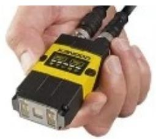

DataMan262X以太网读码器规格  

<table><tr><td>图像分辨率</td><td>1280 x 960 全局快门</td></tr><tr><td>读取</td><td>45 fps</td></tr><tr><td>解码速率</td><td>45 次解码/每秒</td></tr><tr><td>镜头选择</td><td>6.2 mm(3 位镜头或液态镜头,40..200 mm)16 mm(手动调焦或液态镜头,45 mm..1 m)</td></tr><tr><td>照明</td><td>模块化照明/现场配置照明:四种独立控制,高功率 LE D(红、白、蓝、IR)配有带通滤波器和偏光过滤器</td></tr><tr><td>通信</td><td>RS-232 和以太网接口</td></tr><tr><td>尺寸</td><td>直立 - 43.1mm x 22.4mm x 64mm折角 - 43.1 x 35.8mm x 49.3mm</td></tr></table>

# DataMan262X以太网读码器Layout

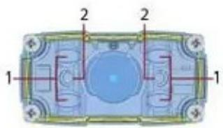

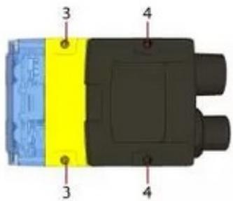

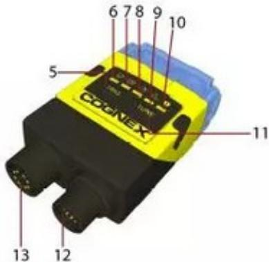

<table><tr><td>1</td><td>LED光源</td></tr><tr><td>2</td><td>LED瞄准点</td></tr><tr><td>3-4*</td><td>固定螺丝孔(规格M3 x 3.5mm)</td></tr><tr><td>5</td><td>Trigger 触发按钮</td></tr><tr><td>6</td><td>Power 电源指示灯</td></tr><tr><td>7</td><td>训练/触发状态指示</td></tr><tr><td>8</td><td>读取状态</td></tr><tr><td>9</td><td>网络连接指示灯</td></tr><tr><td>10</td><td>报警</td></tr><tr><td>11</td><td>Tune功能</td></tr><tr><td>12</td><td>Power, I/O and RS-232</td></tr><tr><td>13</td><td>Ethernet</td></tr></table>

注 :DM262X 有三个型号：

DM262X-1120-P 镜头是白色透明的盖子

DM262X-1120-F 黑色的盖子四个灯都是偏振光

DM262X-1540 黑色的镜头盖子（ IPI 机台上就是用的这个型号）是两个偏振光和两个强光；

两者区分：1540的镜头盖子要比1120的镜头盖子长，还有就是1540中间的镜头是长方形的，1120-F中间的镜头是正方形的

# ReaderLayout

Thefollowing image showsthe built-in lightingsystem ofthe DataMan300 seriesreader,underneaththeplasticlightingcover.

NOTE:Theimage below shows thetwodifferentfront covers:the coverwith frontmountedfilterandtheflatcoverwithan internal filter.

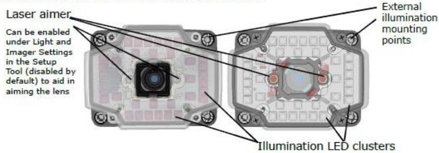

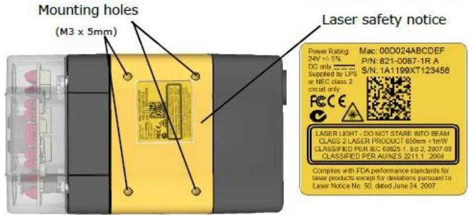

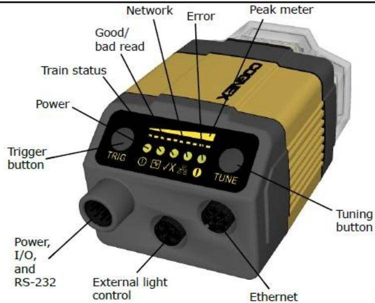

Power:GREEN $=$ PowerON   
Trainstatus:GREEN $=$ trained/YELLOW $=$ untrained   
·Good/badread:GREEN $=$ goodread/RED $=$ badread   
·Network:YELLOW $=$ linkup/BLINK $=$ activity   
·Eror:RED $=$ error,check devicelog   
·Peakmeter:decode yield,train/tuneprogress/quality

# DataMan302X以太网读码器规格

<table><tr><td>图像分辨率</td><td>1280 x 1024</td></tr><tr><td>帧率</td><td>up to 60 fps</td></tr><tr><td>解码速率</td><td>45 次解码/每秒</td></tr><tr><td>镜头选择</td><td>10.3mm liquid lens
19 mm liquid lens
16mm/25mm lens</td></tr><tr><td>照明</td><td>Diffuse lens cover, red illumination (assembled)
Polarized red LED high-powered integrated light
其他配件</td></tr><tr><td>快门速度</td><td>5us..1000us</td></tr><tr><td>通信</td><td>RS-232 和 以太网接口</td></tr></table>

 DM302X 有八排灯，每一排都可以单独打开或者关闭；  
 DM50X 是固态镜头，不能自动对焦只能手动调焦距，跟视觉的相机一样， DM262X 都是液态镜头可以自动对焦， DM302X 可以装液态镜头也可以装固态镜头，看实际需求；  
 DM262X 用的是 16mm 的镜头， DM302X 用的是 10.5 的镜头；  
 DM262X 像素是 120W ， DM302X 像素是 130W ；  
 DM8050X 和 DM8600X 都是手持扫码枪，不用调试参数；

读码器分两种镜头，液态镜头和固态镜头，区别就是液态镜头可以自动对焦，固态镜头需要手动对焦（跟视觉的相机镜头一样）；

DM262X 和 DM302X 都可以装固态镜头，一般DM302X 用的比较多；

读码器像素 = 分辨率的长 X 宽；

即： DM50X 像素 =752x480=36W ；

DM262X 像素 =1280x960=120W ；

DM302X 像素 =1280x1024=130W ；

# 读码器连接操作

 以 DM262X 读码器连接为例；

DM262X 默认采用网络通信（也可用串口通信，图片传输速率会慢很多）， DM50X 只能用串口通信，且不能跟机构设备同时打开使用；

1. 网络连接

DM262 默认 IP 地址是自动获取 (DHCP)

首先 , 将 DM262 通过附带的网络通信线缆 ( 绿色 ) 连接至电脑网口

  
图 1 网络通信线缆实物图 ( 型号 CCB-84901-2001-05)

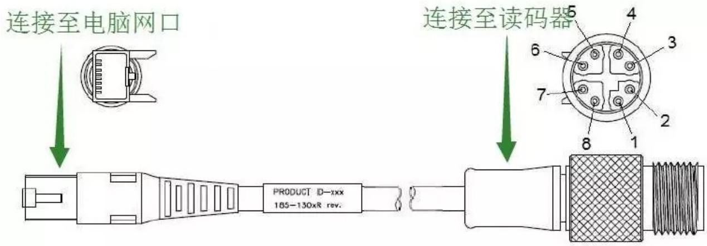  
连接成功之后 , 读码器网络通信指示灯会显示黄色  
图 2 连接示意图

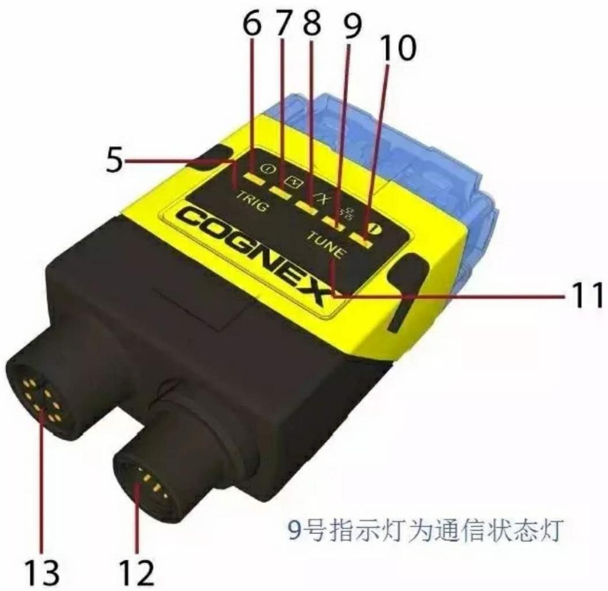  
图3 读码器指示灯进入电脑网络连接设置界面 , 将与读码器连接的网络适配器 IPv4 属性设置为DHCP 自动获取模式

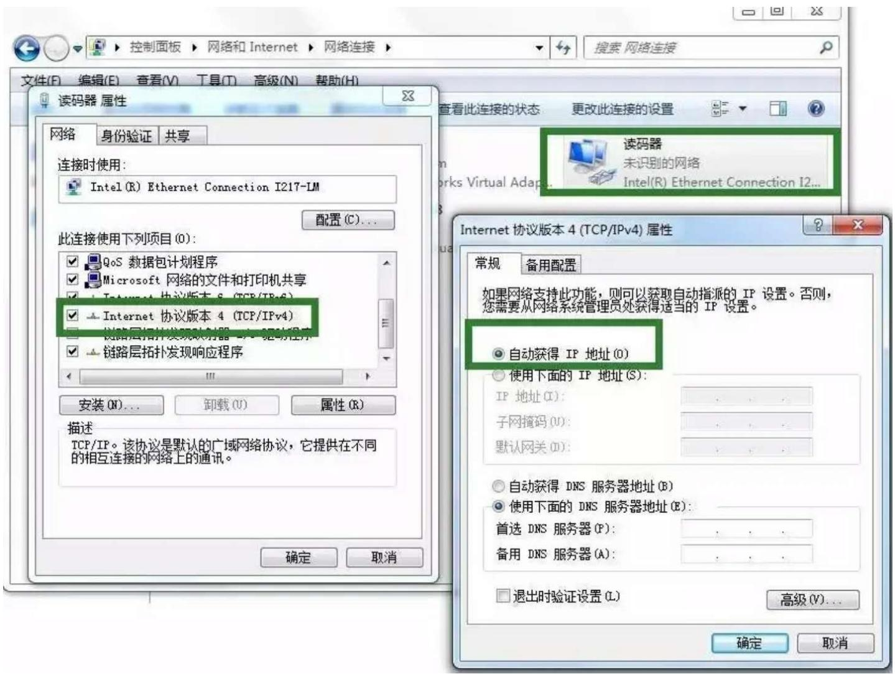  
图 4 本地网卡设置

运行 Dataman SetupTool 软件 , 在软件主页面设备列表中可以看到读码器设备 ,双击设备图标 , 即可连接读码器

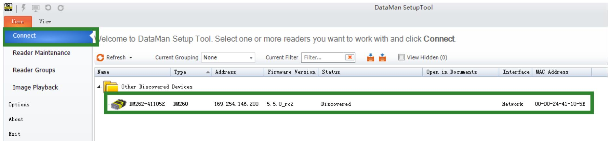

# 切换至 ReaderMaintenance 页面 , 勾选 ” Show All

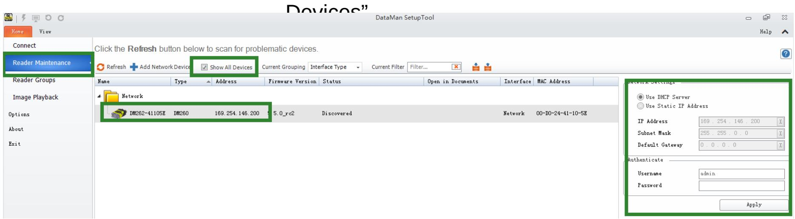

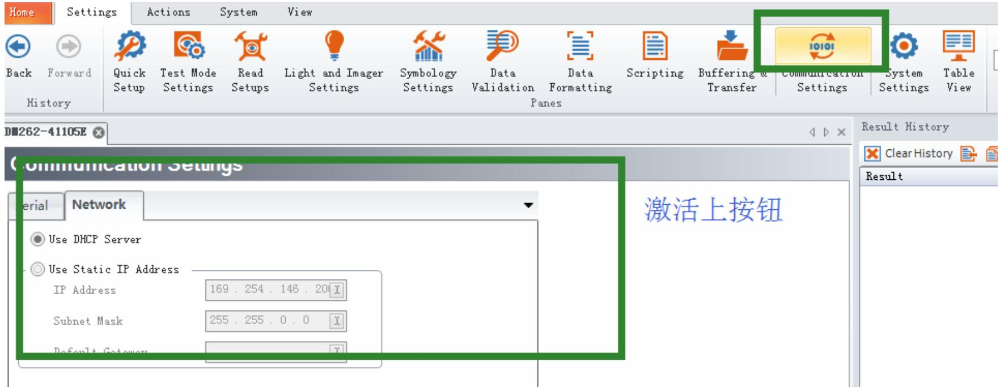

# IP 地址设定

成功连接读码器之后 , 点击 Communication Settings 上按钮

# 这里可以看到读码器 IP 地址设置项

我们将读码器 IP 地址设置为 Use Static IP Address, 地址为192.168.1.100

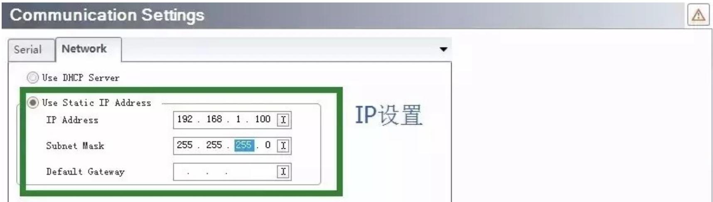

# 设定完成后 , 软件提示重启读码器

# 选择重启

此时 , 需要将本地连接 IP 地址设定与读码器地址 (192.168.1.100) 同网段( 如 ,192.168.1.200)

一般 IP 地址都是机构厂商给我们设定好的，毕竟是连接他们的设备

# 本地网卡地址设定成功 , 读码器重启完成之后重新启动 Dataman SetupTool 软件

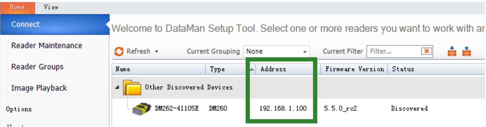

设备列表中出现读码器设备 ,Address 项会显示其设定 IP

连接读码器

通信协议

通常情况下 , 读码器在网络通信中担任服务器角色

服务器 IP 地址 : 读码器设定 IP, 本例中 IP 地址为 192.168.1.100

服务器端口号 : 默认 23

端口号修改方式

点击 CommunicationSettings 下按钮 , 选择 Network Settings,tab 切换至 TelnetTelnet Port 默认为 23, 根据需要可做修改

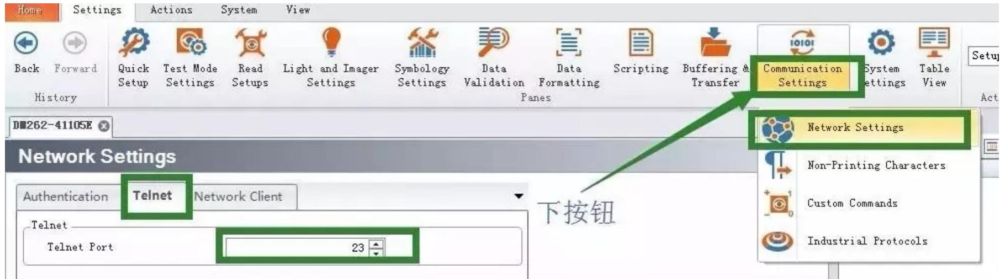

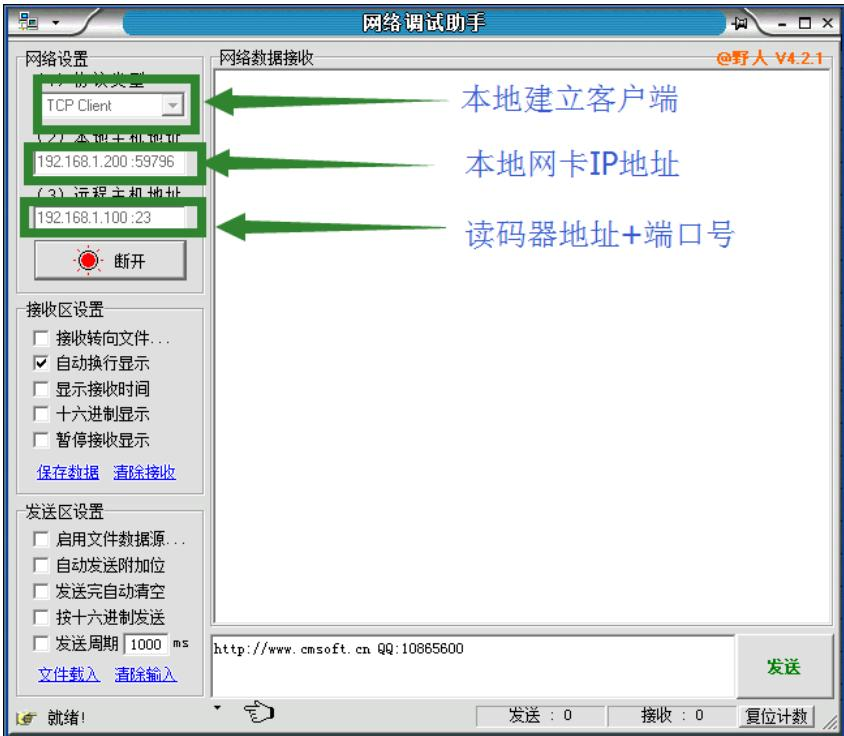

机台软件与读码器通信时 , 需要建立网络客户端 , 连接读码器

以下是网络调试助手模拟客户端连接读码器

# 触发模式

当需要读码器拍照解码时 , 需要向读码器发送触发指令

点击 CommunicationSettings 下按钮 , 选择 Custom Commands

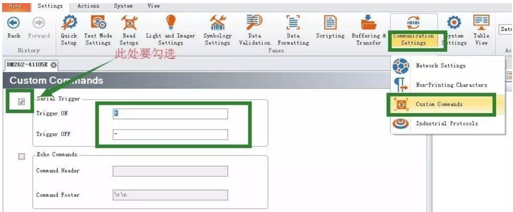

在 Serial Trigger 设定项中 , 可以设定 Trigger On 触发拍照开始指令以及 TriggerOff 触发拍照结束指令。

在网络调试助手中，模拟发送触发指令

读码器接收到指令之后，拍照解码，并把条码内容返回给客户端

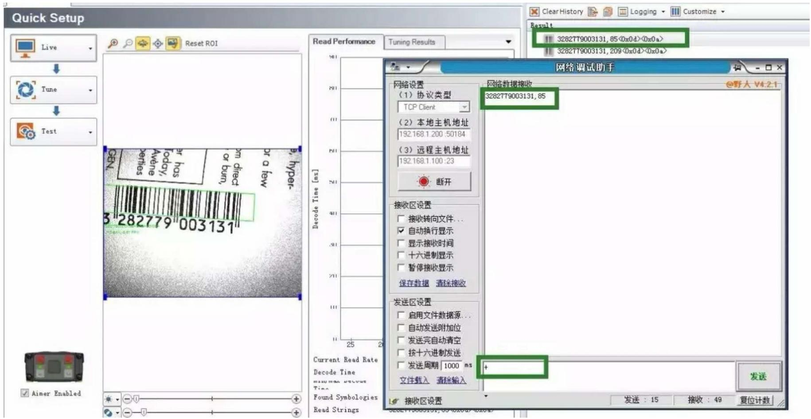

# 谢谢

Cognex China