# 多代码的调试与应用

# LL6

#

# NEX

# 2 2 □

# 多代码的调试与应用

# 多代码的分类

根据 iphone 这边所碰到的 ID 项目来看，多条码的应用主要分为以下两类：

1. 两个码的调试应用，以 RS-OVEN1 项目为例  
2. 两个码以上的调试应用，以 ANDA-PAMD 项目为例

# 多代码的调试与应用

# 1. 两个码的调试应用

RS-OVEN1 设备使用的扫码枪型号是 DM262X-1540P, 需要同时扫载具码和盖板码 ,而 DATAMAN 软件的默认设置是输出一个条码，所以就要在 DATAMAN 软件里重新设置了，下面就讲讲 DATAMAN 软件里两个码与一个码设置的区别之处。

# 多代码的调试与应用

# 1. 两个码的调试应用

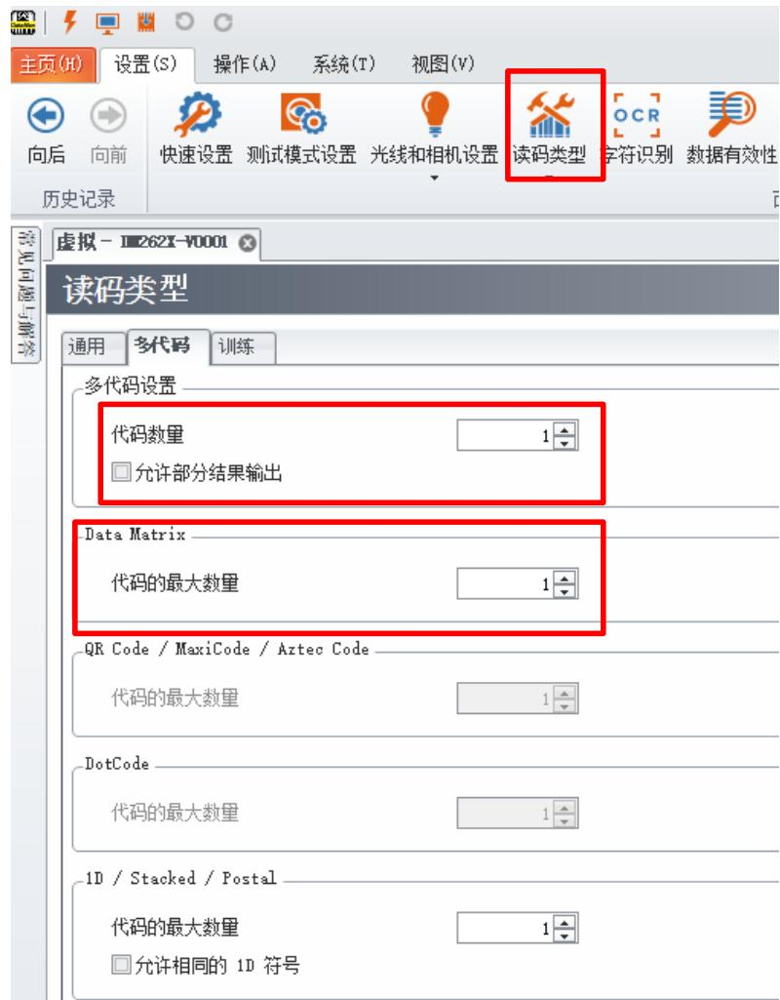

# 代码数量设置

在读码类型里找到多代码设置，代码数量设为 2 ，如果两个码都是 Data Matrix 码，代码的最大数量也设为2  
另允许部分结果输出意思是不勾选代表只有扫到两个码时才输出，勾选代表扫到一个码或两个码时都能输出。

# 多代码的调试与应用

# 1. 两个码的调试应用

按优先级排序

Data Matrix, QR Code,MaxiCode, Aztee Code,条形码. DotC

图像顺序

到

反向

向下

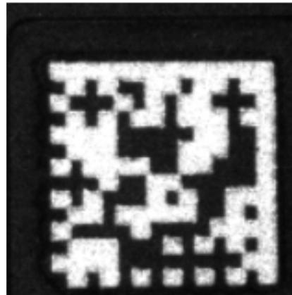  
载具码

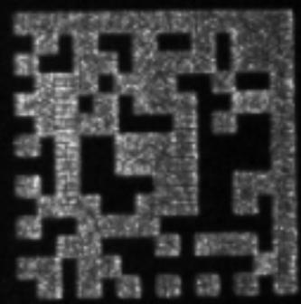  
盖板码

# 代码输出顺序

在读码类型里找到多代码设置，在最下方，有条码输出顺序设置，可以根据条码在图像里的位置或类型等来设置输出结果  
如左图，如果要先输出载具码，后输出盖板码，那就设置排列

（从左到右）顶到最上。

# 多代码的调试与应用

# 1. 两个码的调试应用

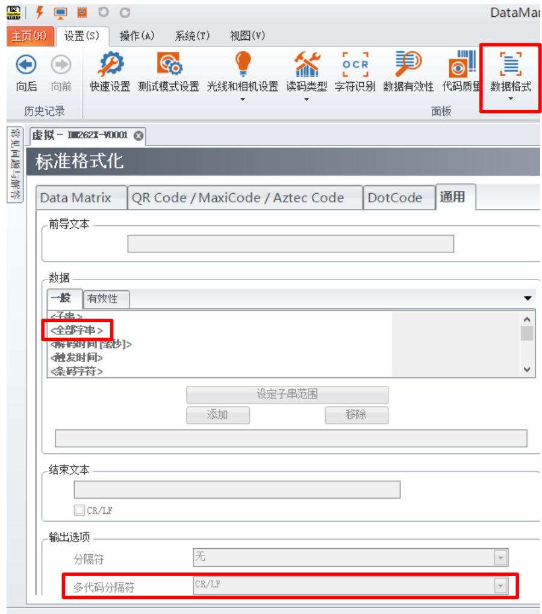

# 代码输出格式

在数据格式中勾选通用的标准进入设置界面，添加全部字符，多代码分隔符选择逗号，如果设备商需要别的数据格式，我们也可以进行相应的设置。

# 多代码的调试与应用

# 1. 两个码的调试应用

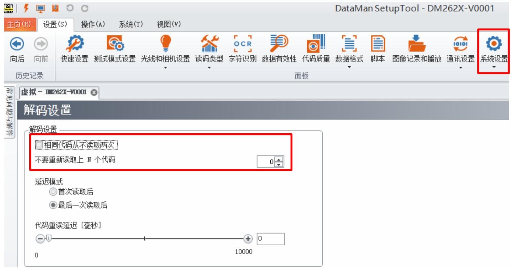

# 代码重读设置

• 勾选相同代码从不读取两次，如果是两个以上代码，请设置不要重新读取上 N 个代码的个数。

# 多代码的调试与应用

# 2. 十一个码的调试应用

ANDA-PAMD2 设备使用的扫码枪型号是 DM374X, 需要扫 1 个载具码和 10 个 ROMEO 码 ,分为两次扫，第一次扫 1 个载具码和 5 个 ROMEO 码，第二次扫 5 个 ROMEO 码，如下图

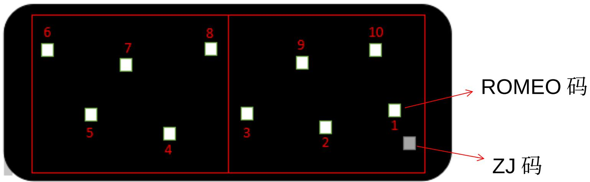

备 注 ： 如 上 图 所 示 ， 第 一 次 扫 ZJ 码 加

1.2.3.9.10 穴 ROMEO 码，平移扫码枪第二次扫

4.5.6.7.8 穴 ROMEO 码

# 多代码的调试与应用

# 2. 十一个码的调试应用

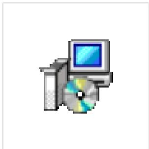  
MultiROITool   
Installer 0.7.0

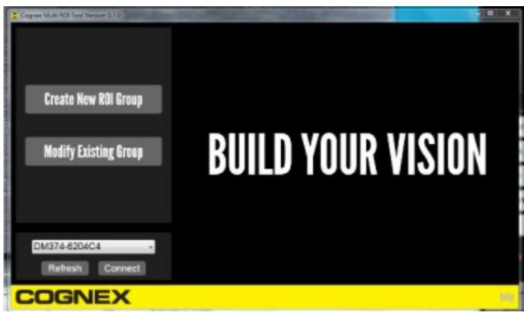

代码数量设置及重读设置可以参考第4 页和第 7 页，代码输出顺序及格式，需要利用脚本

如图专门有个拉ROI的小软件MultiROITool Installer 0.7.0 生成脚本来控制代码的输出顺序及格式

# 多代码的调试与应用

# 2. 十一个码的调试应用

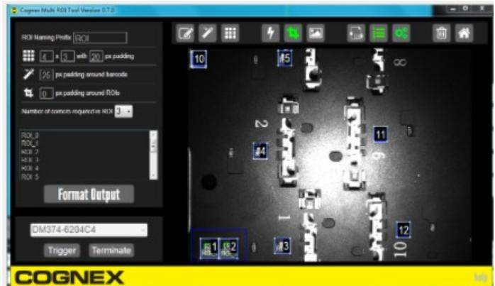

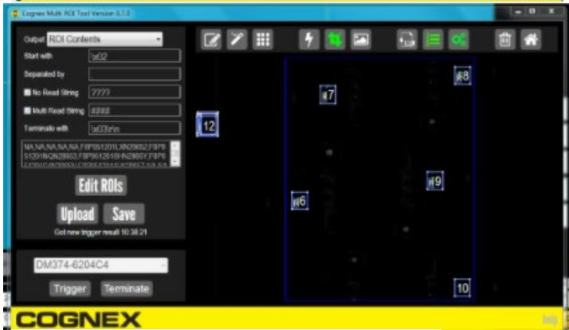

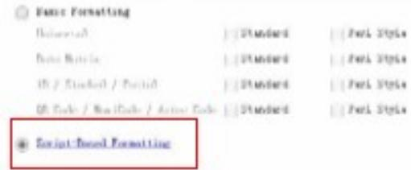

把两次生成的脚本ROI导入模板中，然后再把模板导入数据格式的脚本中，调试完成。

# T h a n k s