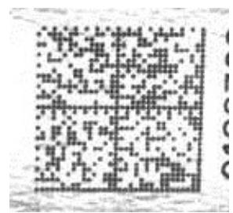
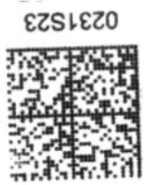
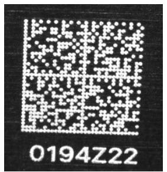
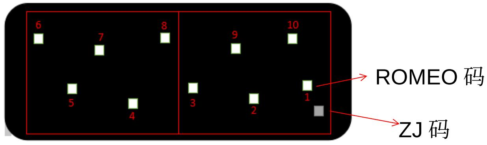
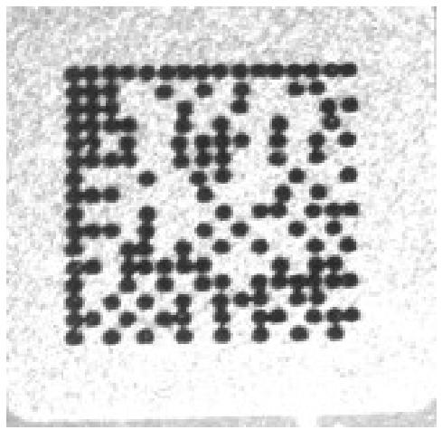

# 扫码枪的选型

# V E X020

# 1. 扫码枪型号介绍

针对一个条码，你要选择哪款型号的扫码枪，首先你就要先了解 Cognex 常用扫码枪的特性与用途， iphone 项目主要分为以下两类：

• 固定式扫码枪： DM302X( 已停产）， DM262X-1540P ， DM262X-1120/DM262X-1120F,DM50X ， DM374X （大视野）

• 手持式扫码枪： DM8050HDXM ， DM8600/ DM8600 HDX

# 2. 固定式扫码枪参数对比

<table><tr><td>Dataman</td><td>DM50X</td><td>DM302X</td><td>DM262X-1120</td><td>DM262X-1120F</td><td>DM262X-1540P</td></tr><tr><td>Dataman Image</td><td></td><td></td><td></td><td></td><td></td></tr><tr><td>Image Sensor</td><td>1/3 inch CMOS</td><td>1/1.8 inch CMOS</td><td>1/3 inch CMOS</td><td>1/3 inch CMOS</td><td>1/3 inch CMOS</td></tr><tr><td>Resolution</td><td>752*480(0.36MP)</td><td>1280*1024(1.31MP)</td><td>1280*960(1.23MP)</td><td>1280*960(1.23MP)</td><td>1280*960(1.23MP)</td></tr><tr><td>Algorithms</td><td>1DMax, 2DMax, PowerGrid</td><td>1DMax, 2DMax</td><td>1DMax, 2DMax, Hotbars, PowerGrid</td><td>1DMax, 2DMax, Hotbars, PowerGrid</td><td>1DMax, 2DMax, Hotbars, PowerGrid</td></tr><tr><td rowspan="2">Interface modlue</td><td>Serial module: RS-232</td><td>Serial module: RS-232</td><td>Serial module: RS-232</td><td>Serial module: RS-232</td><td>Serial module: RS-232</td></tr><tr><td>No ethernet module</td><td>Ethernet module: TCP/IP, FTP, industrial protocols: Ethernet/IP, PROFINET, MC Protocol, ModBus TCP</td><td>Ethernet module: TCP/IP, FTP, industrial protocols: Ethernet/IP, PROFINET, MC Protocol, ModBus TCP</td><td>Ethernet module: TCP/IP, FTP, industrial protocols: Ethernet/IP, PROFINET, MC Protocol, ModBus TCP</td><td>Ethernet module: TCP/IP, FTP, industrial protocols: Ethernet/IP, PROFINET, MC Protocol, ModBus TCP</td></tr><tr><td>Lighting and cover</td><td>1x Red LED</td><td>Diffuse lenscoverwith red LED illumination</td><td>4x Red LED</td><td>4x polarized Red LED</td><td>2x High Powered Red LED and 2x half-polarized</td></tr><tr><td>Lens</td><td>3 Focal position M12 lens(Fixed focus)</td><td>10.3mm Liquid lens</td><td>6.2mm Liquid lens</td><td>6.2mm Liquid lens</td><td>16mm Liquid lens</td></tr><tr><td>Aimer</td><td>LED</td><td>Laser</td><td>LED</td><td>LED</td><td>LED</td></tr><tr><td>Focus</td><td>45mm-110mm</td><td>40mm-500mm</td><td>40mm-200mm</td><td>40mm-200mm</td><td>45mm-1000mm</td></tr><tr><td>min.Fov(mm)</td><td>36*23</td><td>35*26</td><td>37*26</td><td>37*26</td><td>17*13</td></tr><tr><td>max.Fov(mm)</td><td>80*51.28</td><td>332*249</td><td>160*112.43</td><td>160*112.43</td><td>301*226</td></tr><tr><td>2D min.code</td><td>6mil</td><td>5mil</td><td>3mil</td><td>3mil</td><td>2mil</td></tr><tr><td>1D min.code</td><td>4mil</td><td>7mil</td><td>2mil</td><td>2mil</td><td>2mil</td></tr></table>

# 3. 手持式扫码枪参数对比

<table><tr><td>Dataman</td><td>DataMan 8050HDX</td><td>DataMan 8600</td><td>DataMan 8600 HDX</td></tr><tr><td>Dataman Image</td><td></td><td></td><td></td></tr><tr><td>Algorithms</td><td>2DMax, 1DMax, Hotbars, PowerGrid</td><td>2DMax, 1DMax, Hotbars, PowerGrid</td><td>2DMax, 1DMax, Hotbars, PowerGrid</td></tr><tr><td>Image Sensor</td><td>1/3 inch CMOS</td><td>1/1.8 inch CMOS</td><td>1/1.8 inch CMOS</td></tr><tr><td>Resolution</td><td>752 x 480(30w)</td><td>1280 x 1024(130w)</td><td>1280 x 1024(130w)</td></tr><tr><td>Trigger</td><td>Handle trigger, presentation</td><td>Handle trigger, presentation</td><td>Handle trigger, presentation</td></tr><tr><td>Status Outputs</td><td>LED, beeper</td><td>LED, beeper,shaker</td><td>LED, beeper,shaker</td></tr><tr><td>Aimer</td><td>LED aimer</td><td>LED aimer</td><td>LED aimer</td></tr><tr><td>Lens Options</td><td>Fixed focus</td><td>Liquid lens</td><td>Liquid lens</td></tr><tr><td>Depth of Field/Focus</td><td>55 mm-75 mm</td><td>0-500mm</td><td>no information</td></tr><tr><td>2D min.code</td><td>5mil</td><td>3mil</td><td>2mil</td></tr><tr><td>1D min.code</td><td>4mil</td><td>3mil</td><td>2mil</td></tr></table>

# 4. 扫码需求

了解了各型号扫码枪的特性后，就要了解扫码需求了，大致可以分以下几点：

用于自动化设备还是手动工站？

• 条码特性，如条码大小，规格，打码方式，打码材料等

安装方式，如有多大空间可供扫码枪安装调试？

• 公司主推产品，如以前是 DM302X, 现在是 DM262X

一次性扫一个码还是多个码等

综合以上因素，选择合适的扫码枪

# 扫码枪的选型

# 5. 举例说明一

DM50X

DM302X

DM262X-1540P

HSG 码 : 物理尺寸 6\*6mm ，条码规格 $3 2 ^ { \times } 3 2$ ，打码方式镭雕金属码

• 左图是 HSG 码在不同型号扫码枪下的图片效果，从图中效果可以看出扫码效果都 OK，这就要根据安装调试空间和公司主推产品策略出发选择合适型号。

SA-IT-HSG 设备由于安装调试空间狭窄，所以选择了 DM50X

• DP 设备由于那时候公司主推 DM302X, 所以选择了 DM302X

• CIM 设备由于那时候公司主推 DM262X-1540P, 所以选择了 DM262X-1540P

# 扫码枪的选型

# 5. 举例说明二

备注：如上图所示，第一次扫 ZJ 码加 1.2.3.9.10 穴 ROMEO 码 ， 平 移 扫 码 枪 第 二 次 扫 4.5.6.7.8 穴 ROMEO 码

• 看到左图的扫码需求，那就得使用大视野扫码枪 DM374X 了 , 但 DM374X 也有不同的光源和镜头，如何选择？这就得考虑安装空间及图像效果了。

• ANDA-PAMD2 设备经过现场大量验证，最后选择了 16mm 高速镜头和 Torch 光源这样一套组合。

# 扫码枪的选型

# 5. 举例说明三

主板石墨码

尺寸 $4 ^ { \star } 4 \mathsf { m m }$

规格 $1 6 ^ { \star } 1 6$

手动工站需要扫这个码，那根据大小和规格，优先考虑 DM8050HDXM 这一款，然后经现场大量验证扫码 OK 后就选用这款了。

# T h a n k s
