EXPANDING

O U R

# EDGE

# FW v3.6.6.11 Guide

Cognoid Name | Date

# 1.支持带AIK方案的USB 3.0相机

MV Viewer

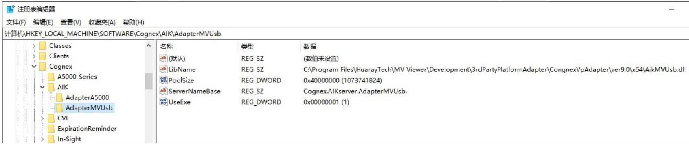

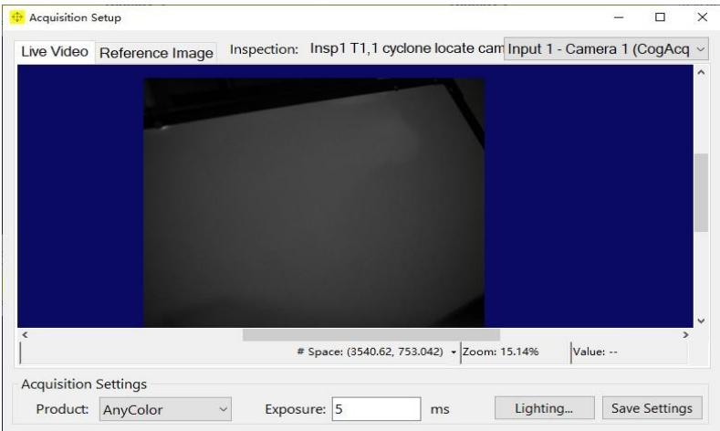  
1.相机应用程序安装  
6.取像设置中修改光源及曝光参数

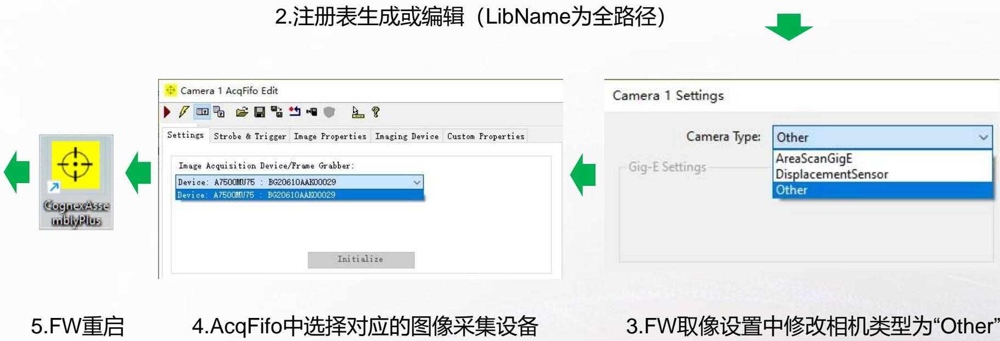

1 OPT 和 Huaray的USB3.0相机可以通过AIK的方式实现  
2.为了保证取像的稳定性，需要使用USB 3.0 PCI-E扩展卡

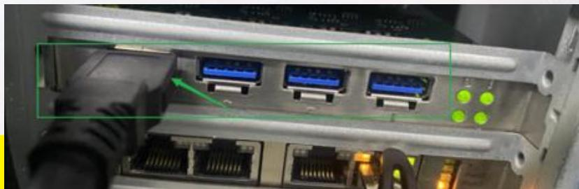

# 2.批量删图工具集成用于图像过滤的Everything解决方案

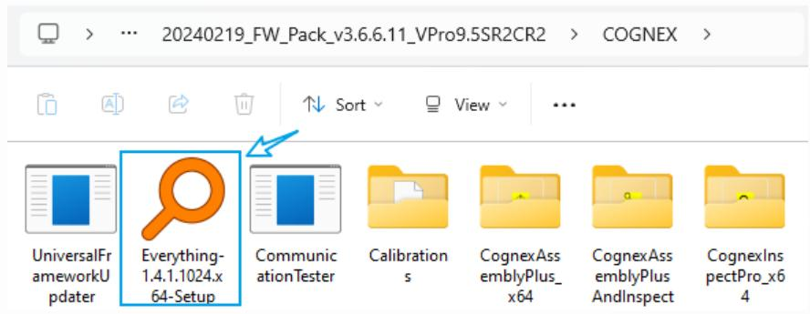

# 1.FW安装包中的Everything 安装程序

<table><tr><td>时间</td><td>讯息</td></tr><tr><td>15:35:00.126</td><td>Start select raw and annotated images...</td></tr><tr><td>15:35:02.234</td><td>Search image total count 70656</td></tr><tr><td>15:35:02.250</td><td>Select raw and annotated images count 10000</td></tr><tr><td>15:35:02.250</td><td>在D:\Images启动图像文件夹清理过程，所需的空闲空间为100 GB。</td></tr><tr><td>15:35:02.872</td><td>当前批处理清理图像计数:50，运行时间:7463 ms</td></tr><tr><td>15:35:04.438</td><td>当前批处理清理图像计数:50，运行时间:9029 ms</td></tr><tr><td>15:35:06.019</td><td>当前批处理清理图像计数:50，运行时间:10611 ms</td></tr><tr><td>15:35:07.647</td><td>当前批处理清理图像计数:50，运行时间:12238 ms</td></tr><tr><td>15:35:09.234</td><td>当前批处理清理图像计数:50，运行时间:13826 ms</td></tr><tr><td>15:35:10.821</td><td>当前批处理清理图像计数:50，运行时间:15412 ms</td></tr></table>

# 4.图像删图Log信息：

开启“PrintCycletimeBreakdown”时显示橙色框信息

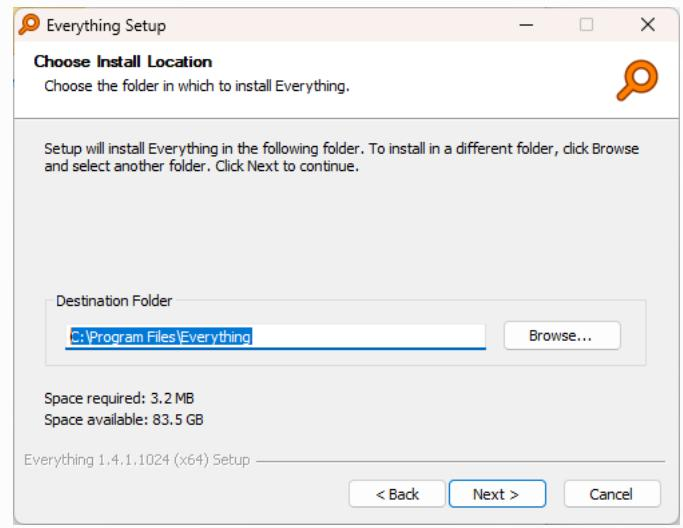

# 2.按照默认路径及配置进行安装

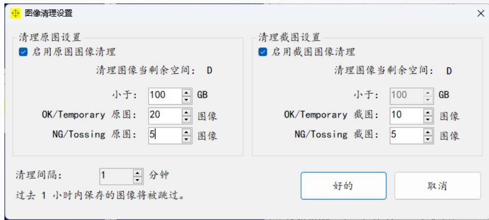

# 3.图像清理设置：

开启图像删图和设置删图条件及单批次删图数量

启用图像自动删除功能，需要确保已安装Everything应用程序

# 图像Tag分类:

OK：全路径包含“OK”或“ok”；

NG：全路径包含“NG”或“ng”

Tossing: 全路径包含“Tossing”

或“tossing”,

其它为 Temporary

# 3.更新图像保存设置

1. 图像保存路径可以支持原图截图分开设置用户可以在图像保存设置中配置

2. 支持图像保存时不需要默认生成大的文件夹 Tag (OK/NG/Temporary), 用户可以在图像保存设置中配置, 图像保存路径如右图所示

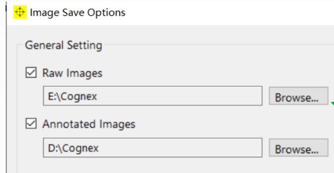

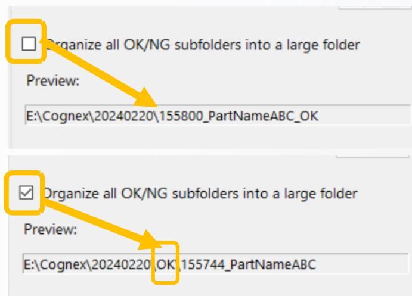

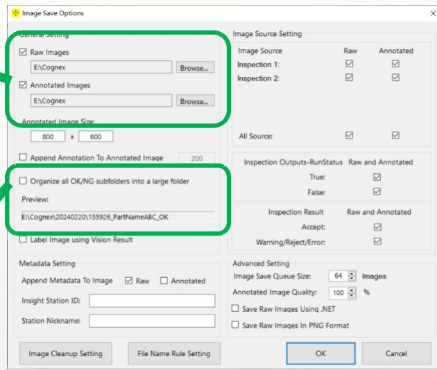

# 3.更新图像保存设置

注意：由于原图截图可以分开保存了，部分图像路径相关的函数可能无法使用，如若MS中使用了这些函数则需要重新更改，以下为示例

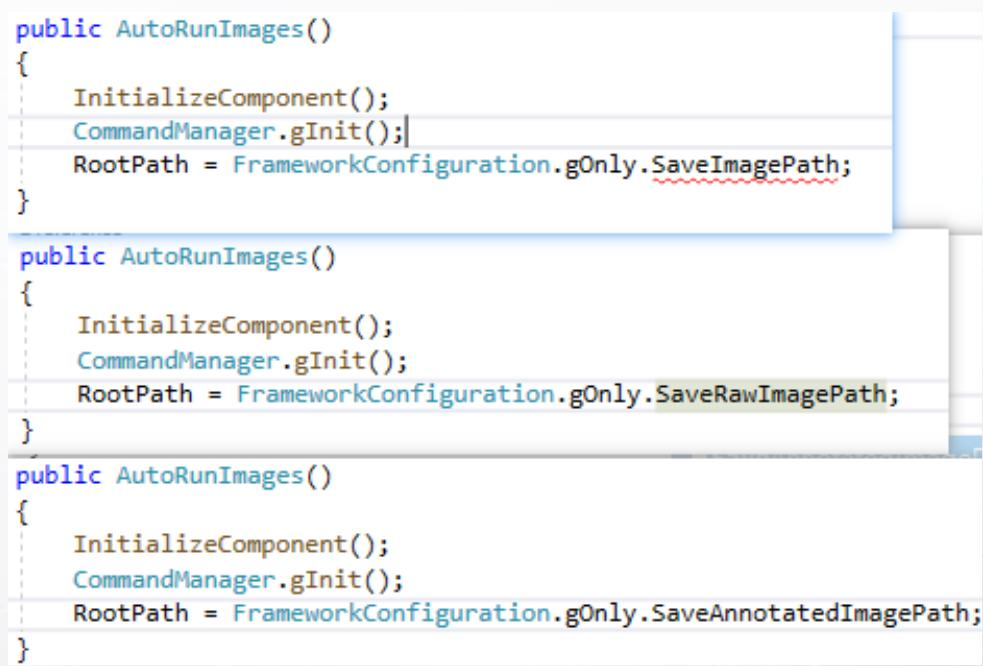

# 4.显示窗口个数限制从6个增加到12个

在主界面的Display最大显示数量由6增加到12个用户可以在“Settings”->“AssemblyPlus Settings”中设置Display Layout设置是由字符串设置，设置规则如下行数：以，分割后的数量即为行数

例如1_1_1_1, 1_1_1_1, 1_1_1_1

显示分为3行

例如1\_1\_1\_1, 1\_1

显示分为2行

列数：每一行的显示多少个Display，是根据有几个“1”

例如1_1_1_1

该行显示为4个Display

例如1_1

该行显示为2个Display

Dummy占位：当数字为1时正常显示Display，为0时Display不显示

例如0\_1,1\_1

第一个Display不显示，用Dummy代替，如右图所示

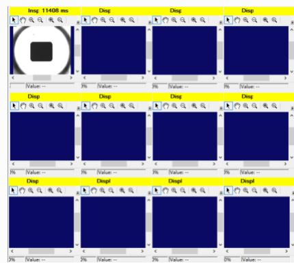

# Appearance

Result Displays:

Display Layout:

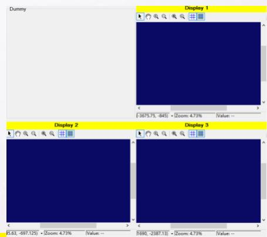

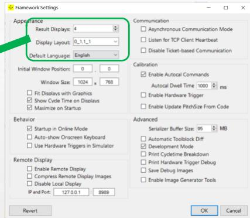

# 5.增强Metadata功能

增加“DUT Color”和“Image Nickname”。

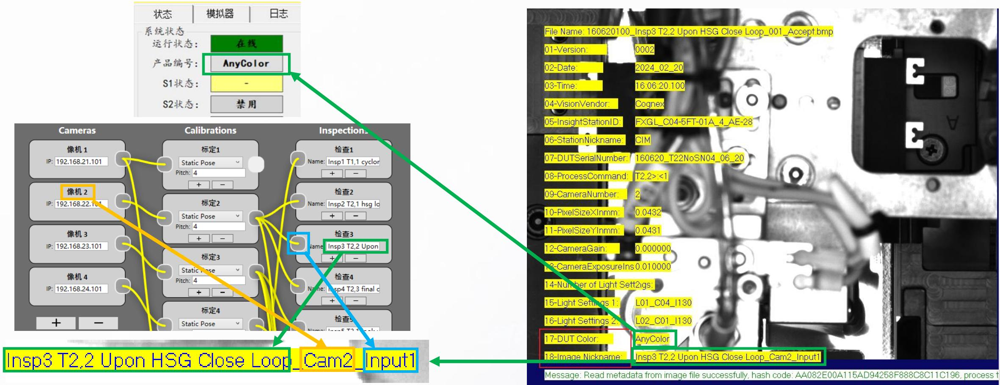

DUT Color: Product Color

ImageNickname格式：InspectionName_CamIndex_InputIndex

重构GetMetadataString(),增加ProductName,inspectionName,inputIDCounter

Metadata读取工具:

MetadataReader_V2.8_02202024.7z

# 6. 增加ImagePlayback在连续运行过程中出现错误时停止的功能

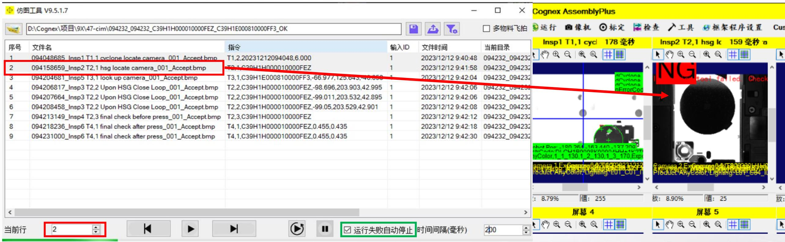

勾选启用“运行失败自动停止”后，程序在自动连续跑图过程中出现运行失败，跑图工具会自动停止运行，便于查看。

# EXPANDING

# O U R

# EDGE

# Questions/

# Thank You