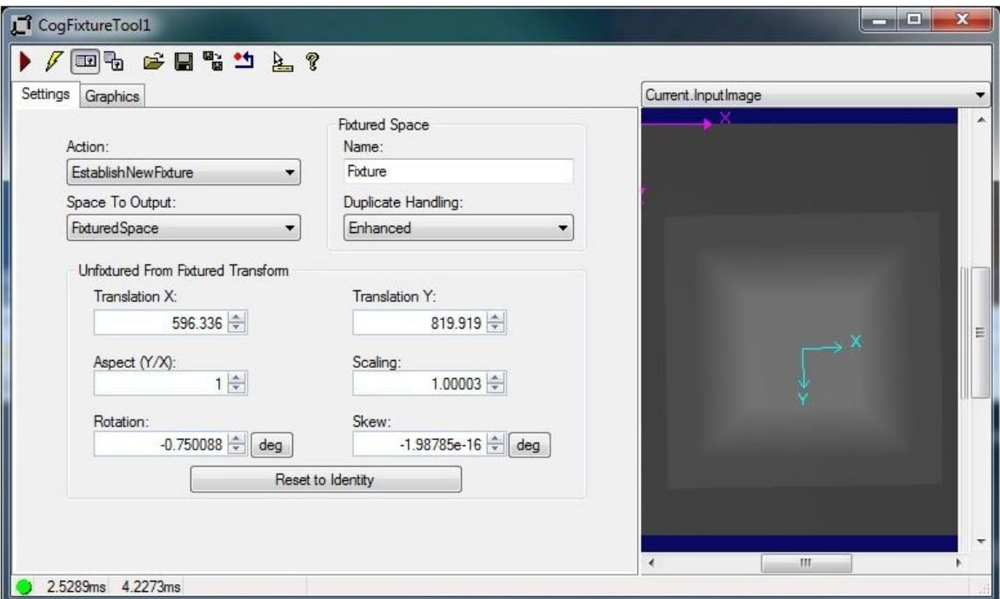

# Fixture Edit Control

Fixture 编辑控件为简单的 CogFixtureTool 视觉工具及其组件提供图形用户界面(GUI)。

Fixture工具将固定的坐标空间附加到输入图像上，并提供更新后的图像作为输出，供其他工 具 使 用 。 您 必 须 为 固 定 空 间 提 供 一 个 非 限 定 的 坐 标 空 间 名 称 ， 并 提 供 一 个CogTransform2D，该2d定义了相对于非固定空间的固定坐标空间。

夹具工具从您提供的输入图像和运行时参数中获取必要的信息来执行固定操作。未固定的空间名是输入图像中选择的空间名。您可以从另一个视觉工具(例如cogpmalignant工具)获得2D转换。编辑控件允许您在将其附加到指定图像的坐标空间树之前编辑此转换的各个组件。

Fixture编辑控件公开用于创建数据链接的下列默认工具输入和输出:

·InputImage   
UnfixturedFromFixturedTransform   
·TranslationX

请注意，尽管 Fixture 编辑控件将 unfixturedfromfixated 2D 转换公开为默认输入，但如果希望调整fixturing转换的转换和旋转组件，则应该使用特定的转换和旋转输入。使用来自其他视觉工具的 UnfixturedFromFixturedTransform 输入可能会在您的固定中引入意想不到的差异。