# Framework& MachineSupport

C

0 G

N E X

2020

2023/4/21

PERFECTING VISION

# L3-->L4 Training --The second Part

<table><tr><td>分类</td><td>课程</td><td>培训内容</td><td>课堂</td><td>责任人</td></tr><tr><td>Vision Basic</td><td>1.视觉项目评估</td><td>整体视觉项目评估方案,相机,镜头,光源</td><td>0</td><td></td></tr><tr><td rowspan="5">Vision Tools Script</td><td>1.Vision Pro 脚本的编写 &amp; 脚本调试</td><td></td><td rowspan="3">1</td><td rowspan="3">建鹏</td></tr><tr><td>2.工具的调用及其参数的输入输出</td><td>工具的调用及其参数的输入输出</td></tr><tr><td>3.VPP界面显示(Inspection输入输出的介绍)</td><td>VPP界面显示(Inspection输入输出)</td></tr><tr><td>4.Vision Tools Script Demo 1</td><td>练习 Vision Tools Script</td><td>1</td><td>甲文</td></tr><tr><td>5.Vision Tools Script Demo 2</td><td>练习 Vision Tools Script</td><td>1</td><td>雷过</td></tr><tr><td rowspan="13">Framework</td><td>1.Framework 框架介绍</td><td>Framework 框架介绍</td><td rowspan="4">1</td><td rowspan="4">锦涛</td></tr><tr><td>2.创建一个新的 MachineSupport</td><td>项目启动,创建一个空的 machinesupport。</td></tr><tr><td>3.相机调用</td><td>相机的设置调用等</td></tr><tr><td>4.标定及 inspection 模块</td><td>标定及 Inspection 的添加,功能设置等</td></tr><tr><td>5.IMachineSupport 接口主要函数介绍</td><td>MS 中最重要的,要用户实现的接口介绍</td><td rowspan="2">1</td><td rowspan="2">建军</td></tr><tr><td>6.其他 Framework 中主要函数介绍</td><td>其他常用的 Framework 函数讲解</td></tr><tr><td rowspan="3">7.通讯模块</td><td>控制 inspection 输入输出</td><td rowspan="6">1</td><td rowspan="6">认证</td></tr><tr><td>控制对应 Inspection 运行</td></tr><tr><td>与 SI 通讯的建立,按照 SI 指令运行 inspection,获取结果,发送坐标等结果到 SI。</td></tr><tr><td>8.Vpp 间数据传输介绍</td><td>跨 vpp 数据分享及传递</td></tr><tr><td>9.MachineSupport 自定义窗口的添加</td><td>项目自定义窗体的添加和设计。</td></tr><tr><td>10.存图模块</td><td>项目存图逻辑如 Group 模块。</td></tr><tr><td>11.从 0 开始搭建一个简单的三相机对位项目。</td><td>综合演练</td><td>1</td><td>黄海</td></tr></table>

# Framework 框架介绍

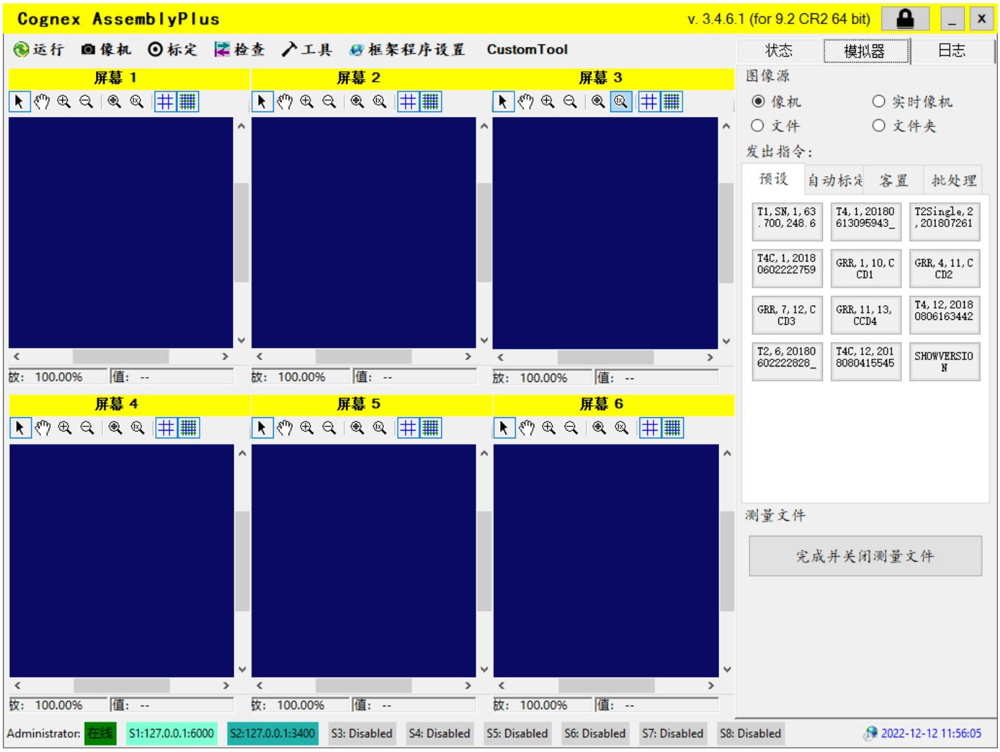

Framework 是一个视觉服务器，是 VisionPro，机械手对位和检测设备之间的桥梁。主要包括以下功能：

- 获取图像  
- 自动标定  
- 运行inspection的toolblocks   
- 与光源控制器对接  
- 设置跟机台主控程序通讯的 TCP/IP 或者串口  
显示 Log 信息  
- 呈现 inspection 结果给用户  
- 保存图片  
Offline 模拟

# Framework 框架介绍

# Framework 文件分布如下：

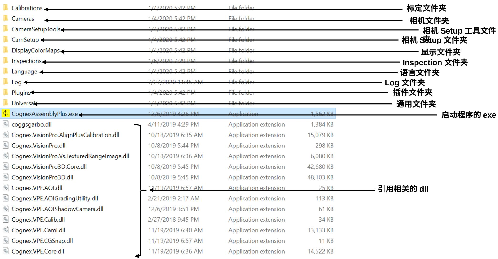

# Framework 框架介绍

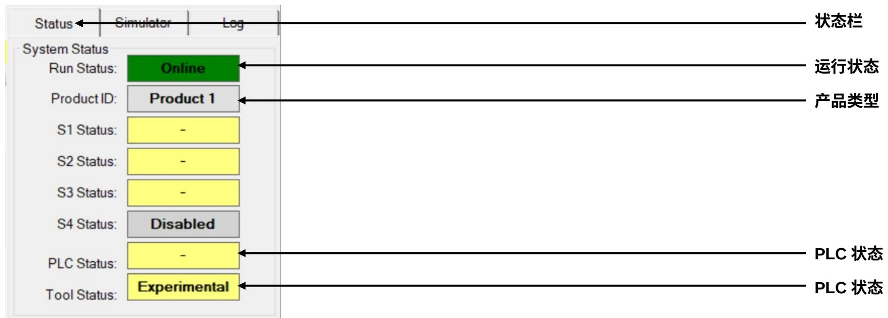  
Framework 界面介绍：

# Framework 框架介绍

Framework 界面介绍：

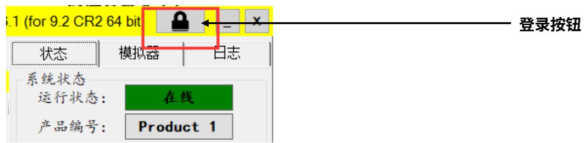

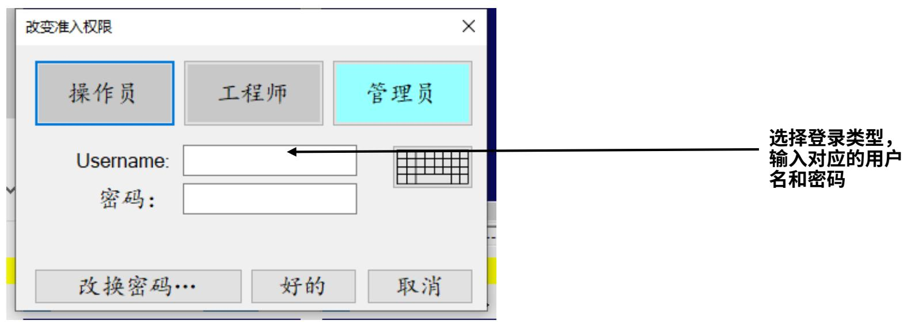

# Framework 框架介绍

Framework 界面介绍：

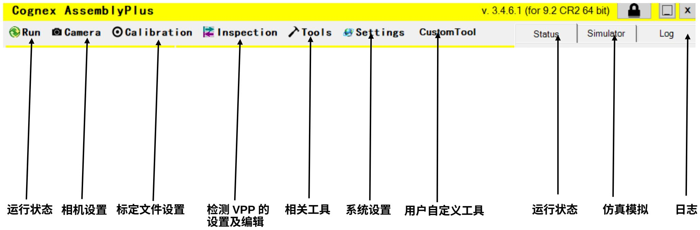

# Framework 框架介绍

Framework 界面介绍：工具栏


Run

Camera


Calibration


Inspection


Tools


Settings

Run: 控制系统 Offline/Online

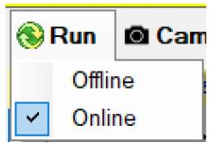

Camera: 设置相机 IP 和其他参


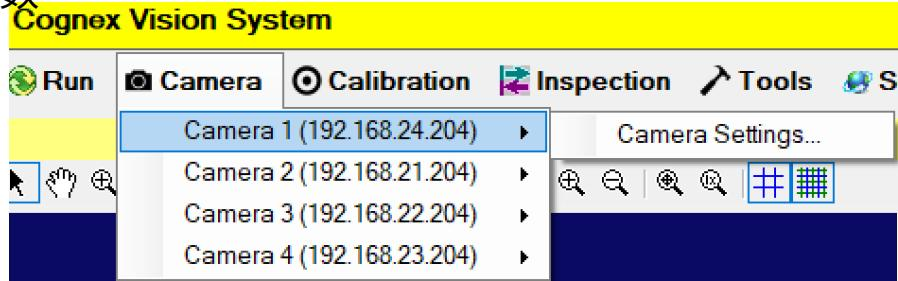

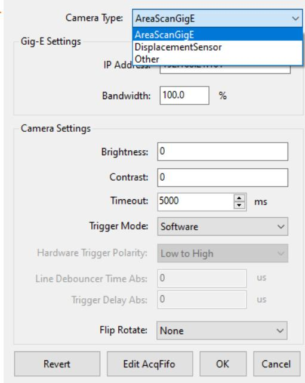  
Camera 1 Settings   
Camera Live Mode

Start Live

Exposure Time:


- Camera Type : AreaScanGigE( 面阵相机 )  
DisplacementSensor(位移传感器)   
Other:USB 3.0 相机  
- GigE Settings: IP Address & Bandwidth(带宽)   
- Camera Settings: Brightness(亮度), Contrast(对比度), Timeout(超时), Trigger Mode(触发模式：软 or 硬触发), Hardware Trigger Polarity(触发时是低电平 -> 高电平 or 高电平 -> 低电平); line debounce time: 线消抖时间，去除杂乱干扰信号抖动 Trigger Delay Abs: 触发延迟时间  
- Flip Rotate: 图像旋转翻转   
- Revert：恢复初始化  
Edit AcqFifo：编辑取相工具（注意：不会保存）

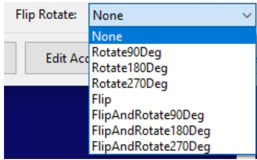

# Framework 框架介绍

Framework 界面介绍：工具栏


Run


Camera


Calibration


Inspection


Tools


Settings

# Calibration: 标定

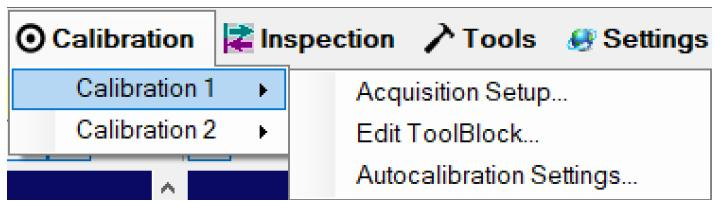

- Acquisition Setup: 标定的相机取相设置   
- Edit ToolBlock: 编辑 VPP(具体后面章节会讲)  
- Autocalibration Settings: 自动标定设置

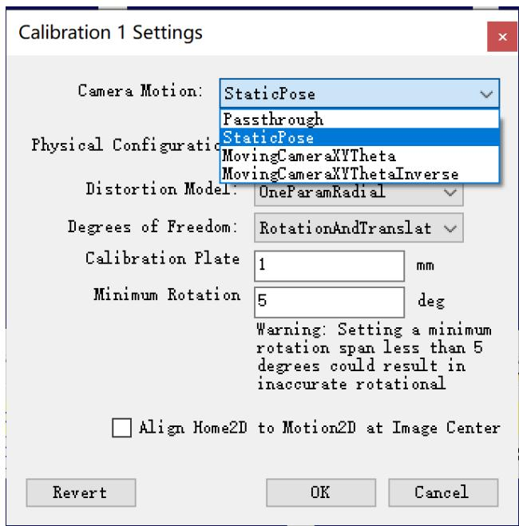

# Camera Motion, 如左图:

- Passthrough：系统不进行标定或者不在 calibration 内进行标定。为采集的图像已经含有标定信息的位移传感器或其他采图设备使用。  
StaticPose: 相机静止，常规的 9 点标定 /11 点标定等 /Chardboard 标定  
- MovingCameraXYTheta: 标定块不动，相机运动标定  
- MovingCameraXYThetaInverse: 建立相对坐标系而使用 $(\star)$ 。

# Framework 框架介绍

Framework 界面介绍：工具栏


Run


Camera


Calibration


Inspection


Tools


Settings

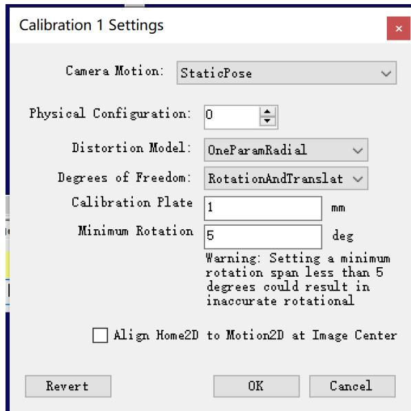

RotationAndTranslation  
RotationAndTranslation  
RotationOnly  
TranslationOnly1Axes  
TranslationOnly2Axes

Physical Configuration: 默认值 0   
- Distortion Model: 扭曲模式，此项一般选择 OneParamRadial 模式，如  
- 果是真远心镜头可以选择 Telecentric 模式。  
- Degrees of Freedom: 角度自由度, 分为 RotationAndTranslation(XYTheta),  
- RotationOnly(OnlyTheta),TranslationOnly1Axis(Only1Axis),TranslationOnly2Axes(OnlyXY),11点标定使用  
- RotationAndTranslation，9点标定使用TranslationOnly2Axes。其他两项很少使用。  
- Calibration Plate Mylar 标定板规格，按照实际使用的填写，否则会导致标定的坐标系异常  
- Minimum Rotation: 最小旋转角度, 最小为 5 度, 否则计算不准确。  
- Align Home2D to Motion2D at Image Center: 默认不勾选。

# Framework 框架介绍

Framework 界面介绍：工具栏

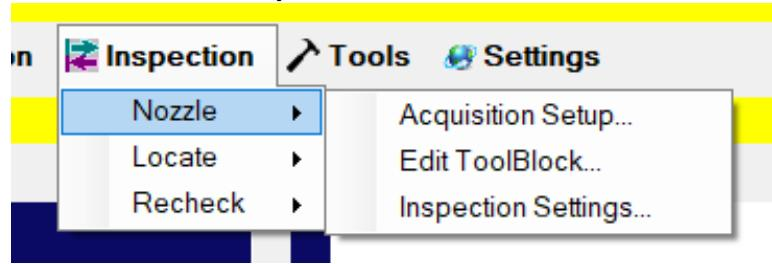  
Inspection

Inspection 1 Settings

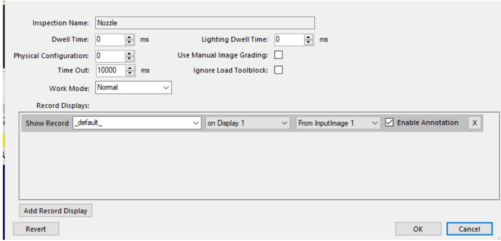


Run


Camera


Calibration


Inspection


Tools


Settings

Inspection:

Acquisition Setup: 正常拍照的相机取相设置 EditToolBlock: Inspection_VPP 编辑


Inspection Settings _ Record Displays

Show Record: 选择 Inspection_VPP 某个工具的图像，仅保存 / 显示在 Play1 等上 Add Record：增加 Show Record 项。

# Framework 框架介绍

Framework 界面介绍：工具栏

# Tool

$\mathcal{A}$ Tools


Settings

CustomTool

S

Camera Setup Tool...

Calibration Info...

Change Calibration Tools...

Edit Autocal Template Tool...

Motion Error Visualizer...

Reset Autocal Calibration Scripts...

Force All Tools to Release Mode...

ReLoad All Inspections...

Reduce Inspection Tool Size...

Run Image Cleanup Now

Generate Cycle Time Report...

Convert VPBs to Bitmaps...

Version Information...

Image Playback


Run


Camera


Calibration


Inspection


Tools


Settings

- Camera Setup Tool: 相机设置工具，MP 架线保持相机的一致性  
- Calibration info: 可以查看标定结果信息  
- Change Calibration Tools: 更改标定工具 (*)  
- Edit Autocal Template Tool: 更改自动标定工具 (*)  
- Motion ErrorVisualizer: 分析机构误差  
- Reset Autocal Calibration Scripts: 还原自动标定脚本 (*)  
- Force All Tools to Release Mode: 强制所有工具到 Release 模式  
- Reduce Inspection ToolSize: 减小 Inspection 工具尺寸   
- Reload All Inspection: 重新加载所有 Inspection  
- RunImage Cleanup Now: 清理图片  
- Generate Cycle Time Report: CT 报告 (+ machinesupport 实现)   
- Convert VPBs to Bitmaps: 转换 VPB(CGA -> VPB) 文件为 Bitmap  
- Version information: 版本信息  
- Image Playback: 仿图工具

# Settings

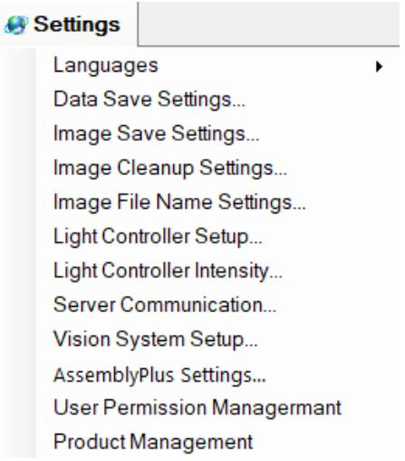

• Language(语言): 系统界面语言设置 (中/英/日/韩…)  
- Data Save Settings：数据保存设定  
- Image Save Settings: 图片保存设置  
- Image Cleanup Settings: 图片删除设定  
- Image File Name Settings: 文件名设置  
Light Controller Setup: 光源控制器设置  
- Light Controller Intensity: 光源控制器通道 / 灵敏度设置  
- Server Communication: 系统服务器设置   
- Vision System Setup: 视觉系统设置   
AssemblyPlus Settings: 框架设置   
ProductManagement: 产品管理


Run


Camera


Calibration


Inspection


Tools

Settings

# Image Save

# Settings :

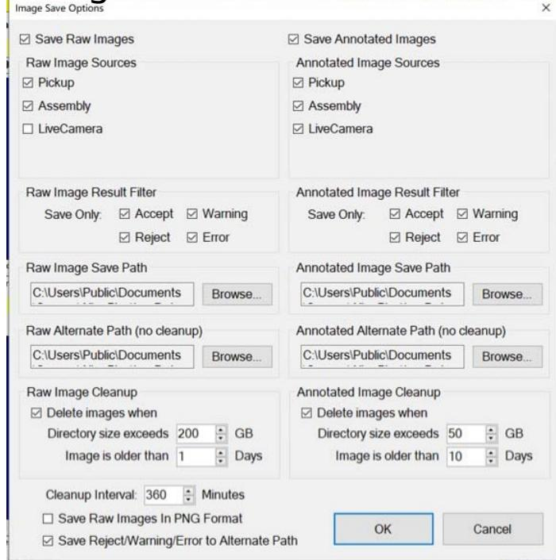

# Framework 界面介绍：工具栏


Run


Camera


Calibration


Inspection


Tools

Settings

# Image File Name

# Settings :

当framework运行时多线程保存图

片

Image File Name Settings

Image File Path

Raw Format

{0:yyyyMMdd}},{3}},{1},{2},{HHmmssff},{4},{D3},{6},{7}

Raw Preview

20190408\Pickup\PartNameABC141812752_003_ABCDEFG123456_Accept.bmp

Annotated Format

{0:yyyyMMdd}},{3}},{1},{2},{HHmmssff},{4},{D3},{6},{7}

Annotated Preview

20190408(Pickup)PartNameABC141812752_003_ABCDEFG123456_Accept.jpg

Parameters

0 = (DateTime) Part creation time

1 = (String) Part name (Inspection name if no part was specified)

2 = (DateTime) Image acquire time

3 - (String) Inspection name

4 = (int) Injection input ID

$5 =$ (String) "ImageID" inspection tool output terminal

$6 =$ (String) "ImageID", with an underscore prepended, if "ImageID" exists

7 = (String) RunStatus (Unknown, Accept, Warning, Reject, Error)

8 = (String) Inspection result status (OK, NG)

9 = (String) First manual grading defect nan

10 = (String) Comma separated manual grading defect names

11 = (String) Manual grading comment

Part Name


Preview: PartNameABC

Parameters

0 = (String) Specified Part Name

1 = (DateTime) Part creation time

2 = (UInt64) PartUID

Revert

Default

File name strings are formatted using String.Format...

See the MSDN documentation for more details.

OK

Cancel

$\left\{  {1,2,3}\right\}   \Rightarrow  \;\left\{  {1,3,4}\right\}   \Rightarrow  \left\{  {2,3,4}\right\}   \Rightarrow  \left\{  {3,4,5}\right\}   \Rightarrow  \left\{  {4,5,6}\right\}   \Rightarrow  \left\{  {5,6}\right\}   \Rightarrow  \left\{  {6,7}\right\}   \Rightarrow  \left\{  {7,8}\right\}   \Rightarrow  }\right.$

# Parameters:

0：创建时间 yyyyMMdd  
• 1:Partn赫的名字，由 Machinesupport传入（很多情况为SN)

• ②Part 创建时间_yyyyMMdd

- 2: 图像采集时间可以自己测试)  
3:Inspection名字  
4: Inspection 的 input_ID  
- 5:Inspection 输出中的 ImageID  
- 6:Inspection 输出中的 ImageID 如果存在，用下划线强调  
- 7:VPP)_RunStatus 状态 (String)   
8:Inspection 结果状态 (String)   
9: 第一次手动采图缺陷名字 (可以自己测试)  
10: 逗号分隔的手动采图缺陷名字 (可以自己测试)  
11: 手动采图内容 (可以自己测试)

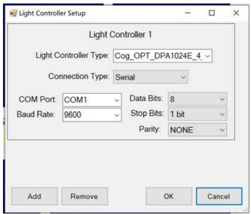  
Light Controller Setup :

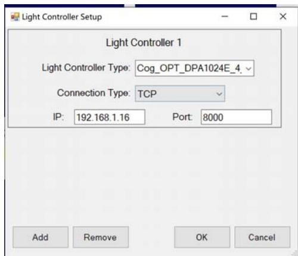

设置光源串口/TCP模

式； Serial模式：

OPT_OPTControllerDemo 软件设置好的串口参数填入上

图中TCP模式：

光源的IP地址由OPT_OPTControllerDemo软件设置

OPTControllerDemo 软件设置好的 IP 地址填入上图 TCP

中

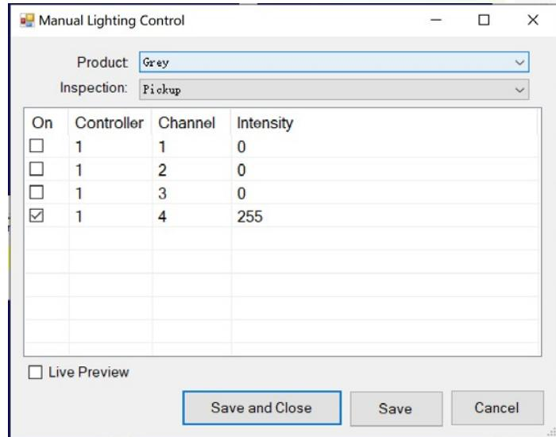  
Light Controller Intensity:

设置不同材质各个Inspection光源参

数；选择对应的材质；

选择对应的

Inspection ; Intensity

数值由0255;

# Framework 框架介绍

Framework 界面介绍：工具栏

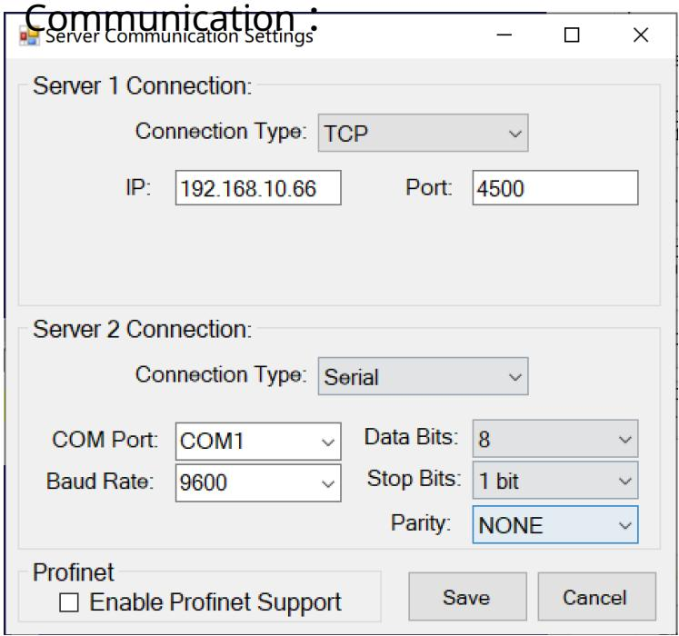  
Server

服务器TCP/Serial设置；

注意事项下面会有叙述；


Run


Camera


Calibration


Inspection


Tools

Settings

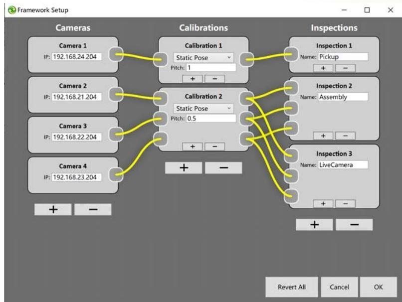  
Framework Settings:

- Camera IP 也可以在此设置；  
- Calibration 的 Camera Motion 也可以在此设置；  
- Pitch 为 Mylar 规格大小;  
- Inspection 在此命名;  
- 使用鼠标来勾画 Camera/Calibration/Inspection 三者关系;  
通过 $+ -$ 符号可以添加项目/输入/输出;  
- 注意 Camera/Calibration/Inspection 三者的输出可以连几

个其他项的输入，但是三者的输入只能对接其他项的一个输出

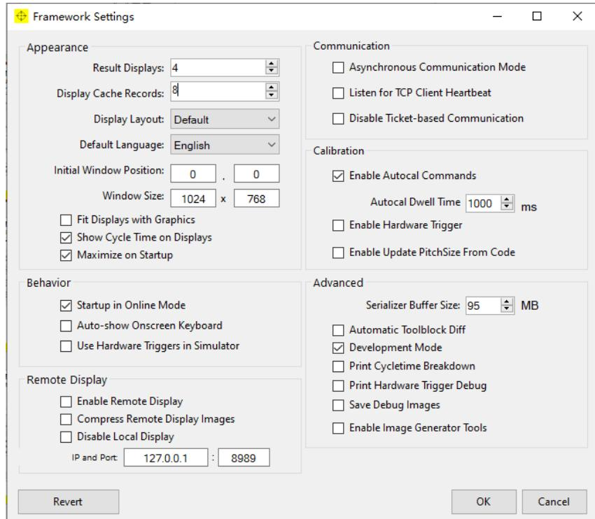  
Framework Settings:

Appearance 外观：

Result Display: 界面显示 Display 数量

Display Layout: 界面 Display 排布方

式 Default Language: 默认语言

Initial Window Position: 初始化软件位置

Window Size: 软件外观大小

Fit Displays with Graphics: 自适应画面

Show Cycle Time on Displays: 在 Display 显示 CT 时 间 Maximize on Startup: 初始化全屏

Behavior:

Startup in Online Mode: 开机时 Online 模式

Auto-show Onscreen Keyboard: 自动显示屏幕键盘

Use Hardware Triggers in Simulator: 仿图时

使用硬触发

# Framework 框架介绍

# Framework 界面介绍：光源部分


Run


Camera


Calibration


Inspection


Tools

Settings

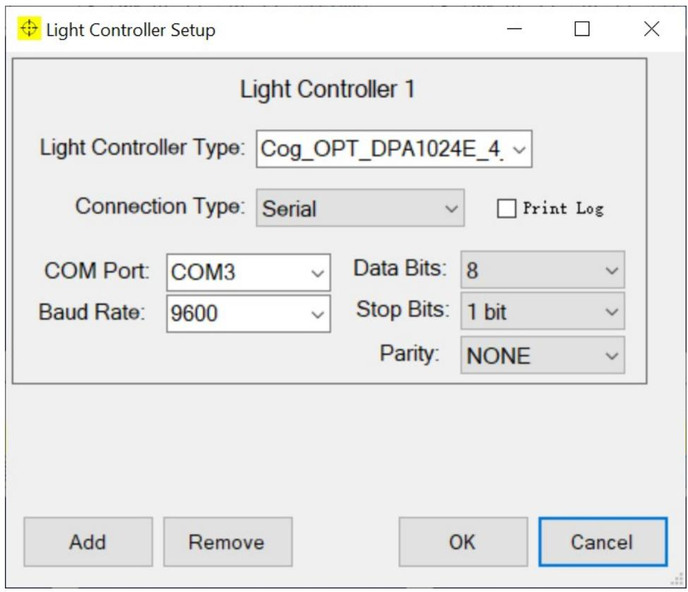

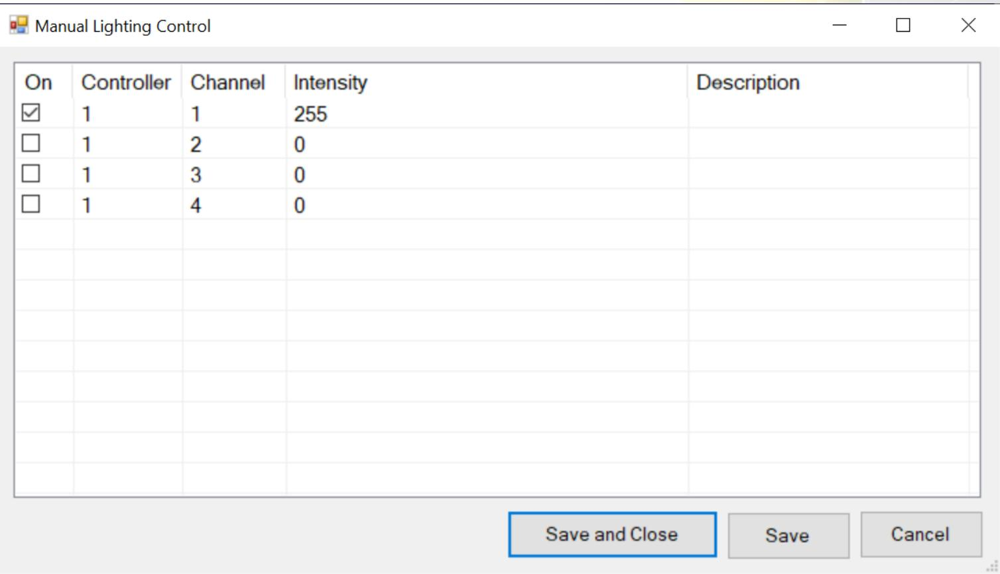

# 创建一个新的 MachineSupport

1. 解压一个新的框架升级包，我们以目前最新的 FW3.5.4.6 创建 CognexAssemblyPlus_x64 为例

20230228 FW_Pack_v3.5.4.6_VPro9.2CR2

20230228 FW_Pack_v3.5.4.6_VPro9.2CR2.7z

2. 将程序所必须的应用程序和 .dll 文件导出

Calibrations 2023/2/22 21:53   
CameraSetupTools 2023/2/22 21:53   
CamSetup 2023/2/22 21:53  
CognexAssemblyPlus_x64 2023/2/28 17:32   
CognexAssemblyPlusAndInspectPro... 2023/2/28 17:32   
CognexInspectPro_x64 2023/2/28 17:32   
DisplayColorMaps 2023/2/22 21:53   
Inspections 2021/9/23 15:24   
Language 2023/2/28 17:32   
Log 2022/9/5 22:05   
Plugs 2023/2/22 21:53   
Referenced Assemblies 2023/2/22 21:53   
x64 2023/2/23 17:09   
CommunicationTester.exe 2021/5/13 17:13   
UniversalFrameworkUpdater.exe 2023/2/22 21:36


Calibrations 2023/2/22   
CameraSetupTools 2023/2/22   
CamSetup 2023/2/22  
CognexAssemblyPlus_x64 2023/2/28   
CognexAssemblyPlusAndInspectPro... 2023/2/28   
CognexInspectPro_x64 2023/2/28   
DisplayColorMaps 2023/2/22   
Inspections 2021/9/23   
Language 2023/2/28   
Log 2022/9/5 2   
Plugs 2023/2/22   
ReferencedAssemblies 2023/2/22   
x64 2023/2/23   
coggsgarbo.dll 2022/1/6 1   
Cognex.VisionPro.AlgnPlusCalibratio... 2020/12/17   
Cognex.VisionPro.Vs.TexturedRangel... 2020/12/17   
Cognex.VPE.AOI.dll 2020/4/14   
Cognex.VPE.AOISHadowCamera.dll 2023/2/22   
Cognex.VPE.Cami.dll 2020/4/71   
Cognex.VPE.CGSnap.dll 2020/4/7 1   
Cognex.VPE.Core.dll 2020/12/17   
Cognex.VPE.ImageGenerator.Control... 2020/12/1;   
Cognex.VPE.InspectPro.CVL.dll 2020/12/17   
Cognex.VPE.PAMiZ.dll 2020/4/7 1   
Cognex.VPE.SBH.dll 2020/4/7 1  
Cognex.VPE.Tools.dll 2020/4/71   
Cognex.VSAlignPlusUtilities.dll 2020/12/17   
Cognex.VS.Core.dll 2022/1/6 1   
Cognex.VS.DSA.Analysis.dll 2023/2/23   
Cognex.VS.Dsa.dll 2023/2/25   
Cognex.VS.FrameworkCommunicatio... 2023/2/22   
Cognex.VS.FrameworkSetup.dll 2023/2/22   
Cognex.VS.Garbo.dll 2022/11/1   
Cognex.VS.Interop.dll 2022/1/6 1   
Cognex.VS.LightController.dll 2023/2/22   
Cognex.VS.ToolBlockUtility.dll 2023/2/22   
Cognex.VSUTILITY.dll 2023/2/22   
Cognex.VSUTILITY.xml 2023/2/22   
CognexAssemblyPlus.exe 2023/2/28

# 创建一个新的 MachineSupport

3. 打开 VS2012，新建一个 C# 下的类库文件，重新命名

MachineSupportGeneralSPP

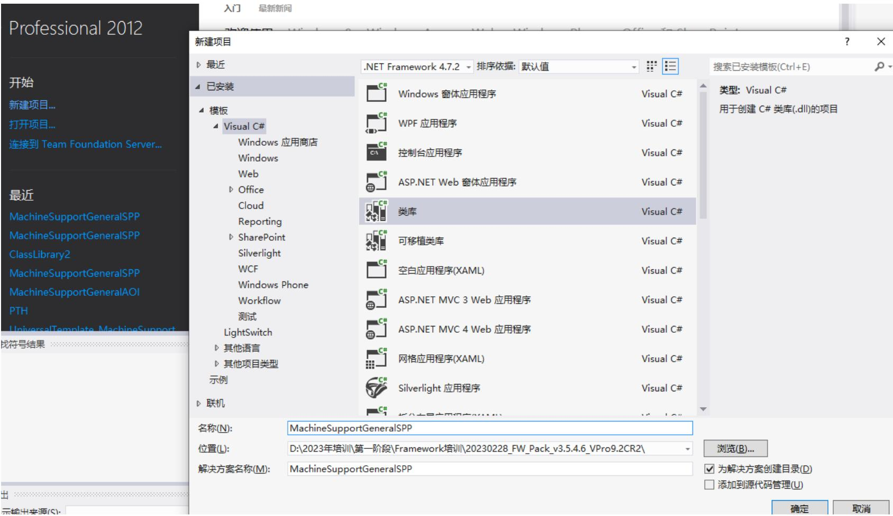

# 创建一个新的 MachineSupport

4. 对这个类也重命名为“MachineSupportGeneralSPP”

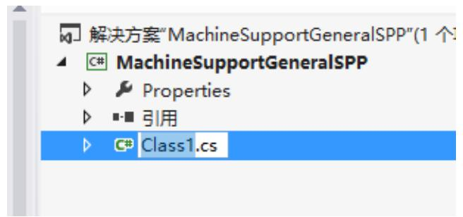

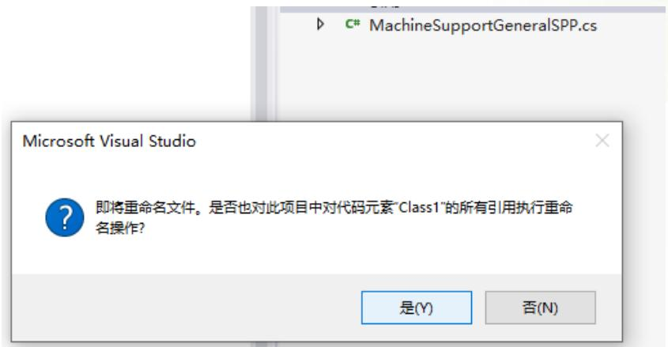

5. 添加 VisionPro、Utility 等相关引用，并引用对应 using 指令，将 namespace 和程序集名称都修改为

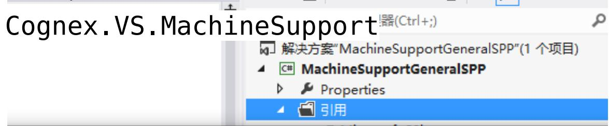

用管理器-MachineSupportGeneralSPP

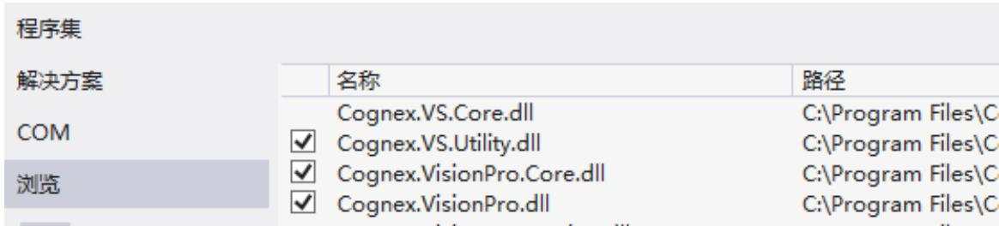

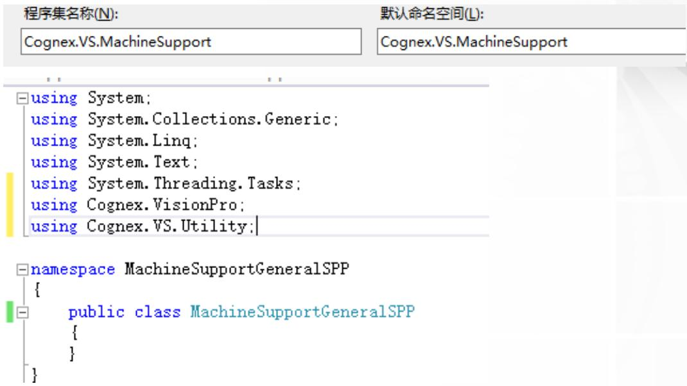

# 创建一个新的 MachineSupport

6. 让 MachineSupportGeneralSPP 继承 IMachineSupport 并实现接口,

并添加工厂类

```cs
using System.Text; using System. Threading. Tasks; using Cognex.VisionPro; using Cognex.VS; using Cognex.VS. Utility; using Cognex.VS.MachineSupport;   
public class Machine   
public static IM public class MachineSupportFactory return new M { public static IMachineSupport Create() { return new MachineSupportGeneralSPP(); } public void Forc public class MachineSupportGeneralSPP:IMachineSupport { private IFrameworkSupport m_framework; string IMachineSupport.MachineryName get { return "SPP"; } public void ForceRecordFlush() { public void ForceRecordFlush() { public void ForceRecordFlush() { public void Init GetAcquisitionSetupOverlayGraphics(int inspectionID, int inputID, int cameraID, int pr return null; public string ImageSavedToDisk(bool savedToDisk, string savedToDiskPath, bool movedOnce, ref CommandDestination des get{ throw public void Init(IFrameworkSupport framework) return : 
```

# 创建一个新的 MachineSupport

7. 更改调试和生成路径（外部程序、工作目录和输出路径）并生成解决方案，这个时候我们得到一个空的 Framework 程序

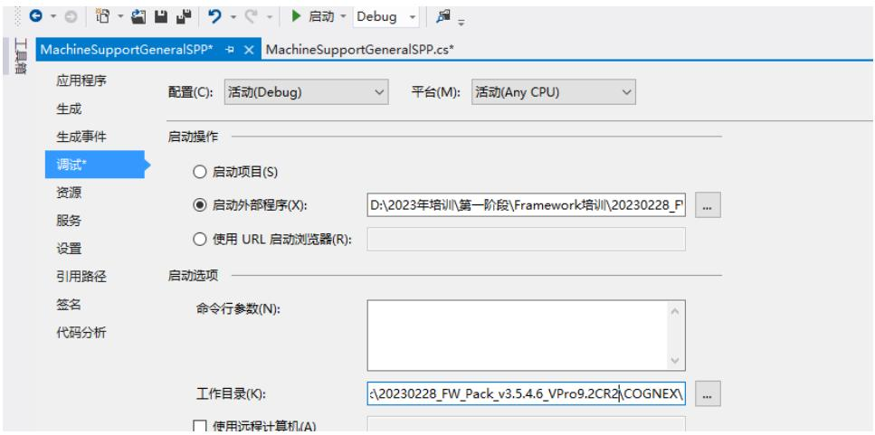

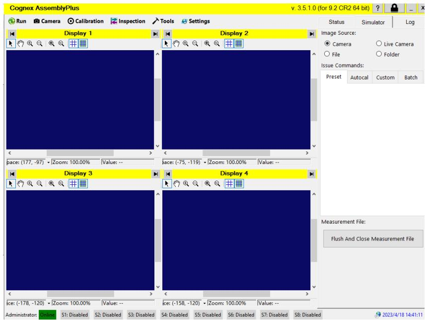

# 相机的调用

当需要对相机进行特殊设置时候需要对相机进行调用，一般一般

在“Prepare”中进行设置，不用写在Config中

m_framework Cameras[0].FrameGrabber.OwnedGigEAccess.SetDoubleFeat

ure("TriggerDelayAbs", Came1TriggerDelayAbs);

对该相机在（100,100）坐标取一个长800，宽600的像

```java
public void Prepare() { if (m_framework Cameras.Count != 0 && m_framework Cameras[0].AcqFifoOp != null) { m_framework Cameras[0].AcqFifoOp.OwnedROIParams.SetROIXYWidthHeight(100, 100, 800, 600); } return ; void ICogAcqROI.SetROIXYWidthHeight(int x, int y, int width, int height) Sets the ROI. public ProfinetUserData ProfinetJobParser(CommandAndInfo 异常: 
```

# 标定及 inspection 模块

Framework Setup

- -□ X

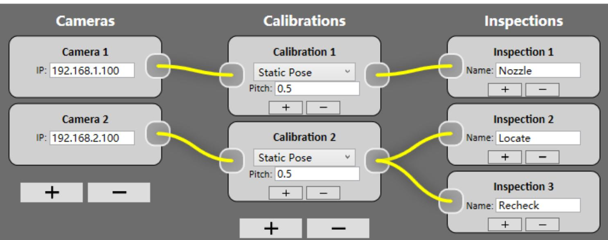


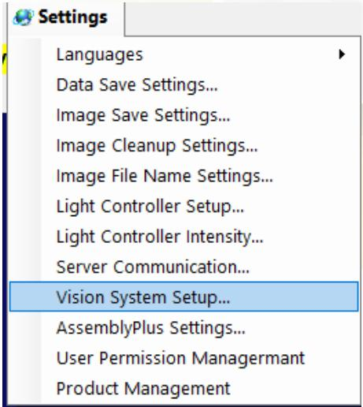

1. 打开程序后找到：视觉系统设置  
2. 点击添加

Cameras、Calibrations和Inspections并连线，最后确定，该名字就是在Inspection中显示的名

字

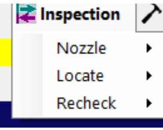

# 标定及 inspection 模块


VisionTool Configuration - Inspection 1 - Nozzle

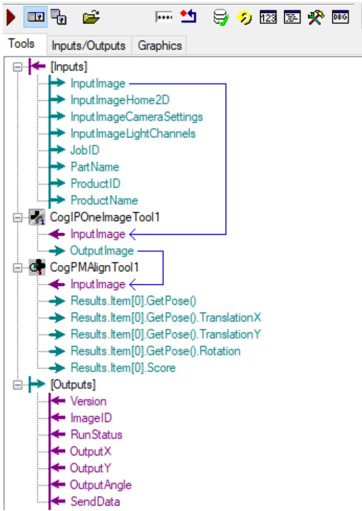

打开新添加的VPP，可以先添加个工具，比如PMAlign工具，保存并关闭

# 作业

根据给的升级框架，新建一个新的 MachineSupport，并添加上相机引导，下相机拍吸嘴，和上相机定位被贴合特征和复检的的 Inspection 和对应的 Calibration.（100 分，dll 文件等导出 10 分，新建类库并重命名 20 分，添加引用和程序集修改 20 分，实现接口并返回值 20 分，调试和生成程序可以正常打开 20 分，新建 Cal&Insp10 分）

# Thanks