# ID basic knowledge

# 议程

- 条码基础知识   
一维码与二维码的差异  
- 激光识读器和图像式识读器

# 基本码制

- 一维线性条码  
- DataMatrix   
QR-Code   
- PDF417   
UCC.EAN   
- Postal

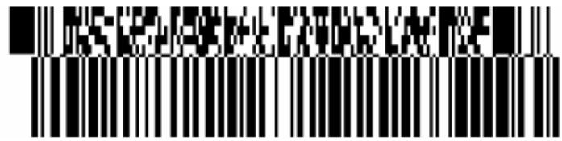

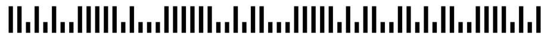

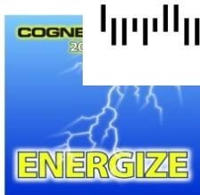

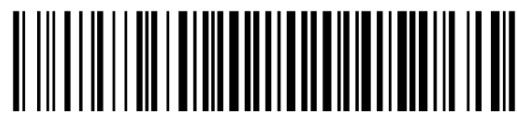

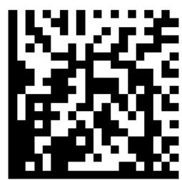

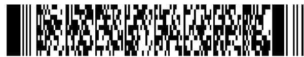

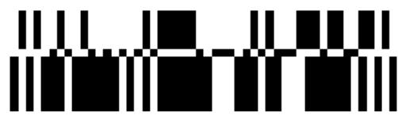

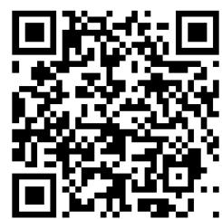

# 条和空的排列规则不同形成了不同的码制，常用的如：

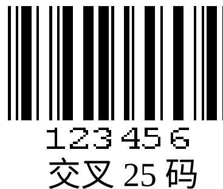

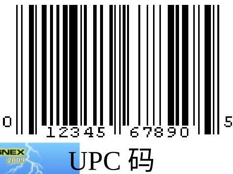

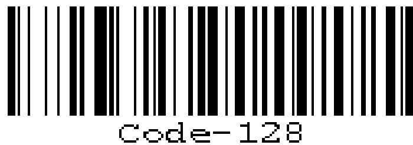  
128码

  
A1234B   
Codabar 码

# 常用的二维条码

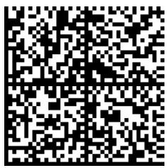  
Data Matrix

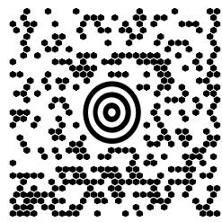  
Maxi Code

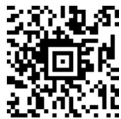  
Aztec Code

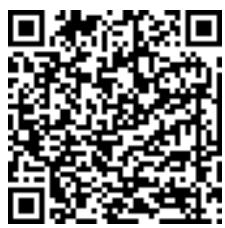  
QR Code

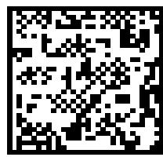  
Vericode

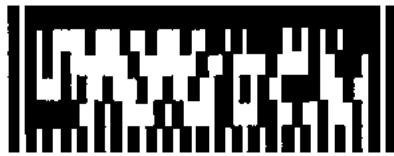  
Ultracode

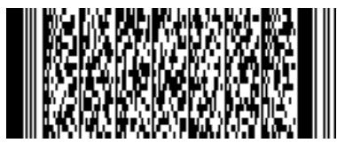  
PDF417

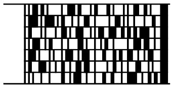  
Code 49

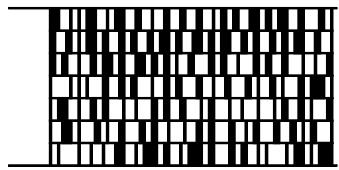  
Code 16K

# 条码符号的组成

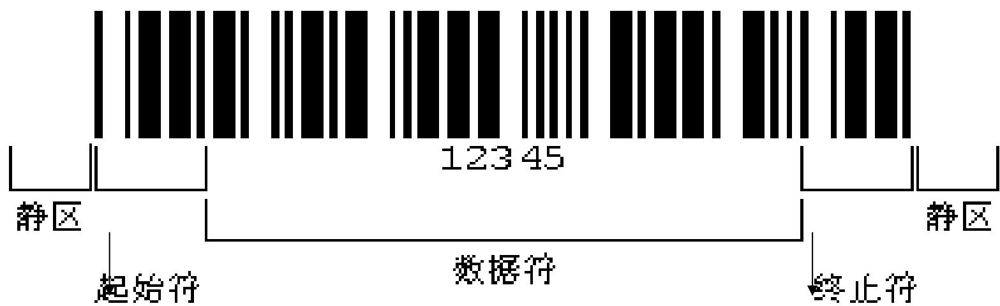

# 二维矩阵码符号的组成

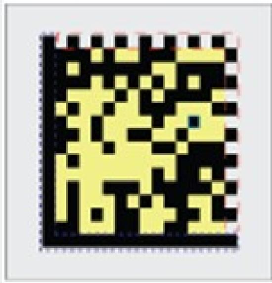

计时图录

数据区

非共或单元

L型号边区

#

# 直接元件标示（DPM）工艺

# 4种主要方法

  
激光

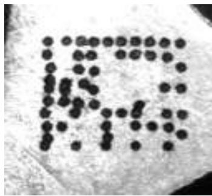  
喷墨

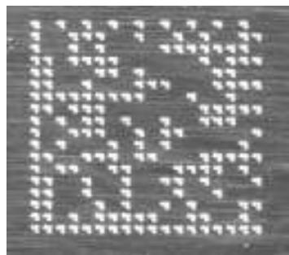  
打点阵和复刻

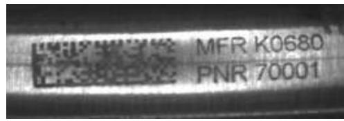  
电化蚀刻

# 选择时的要素

- 元件期待寿命  
- 材料成分  
- 环境磨损  
数量

- 表面质地  
编码数据量  
- 空间  
- 位置

# 直接元件标示 最佳实践：数据矩阵标示的放置

- 在清晰、无障碍的位置标示  
- 确保代码周围至少预留 3-4 个单元宽度的“静音区”   
- 在曲面上标示时，代码不得大于直径的 $16\%$ 或部件周长的 $5\%$ 。

  
低分辨率的小代码

  
在弯曲表面上标记

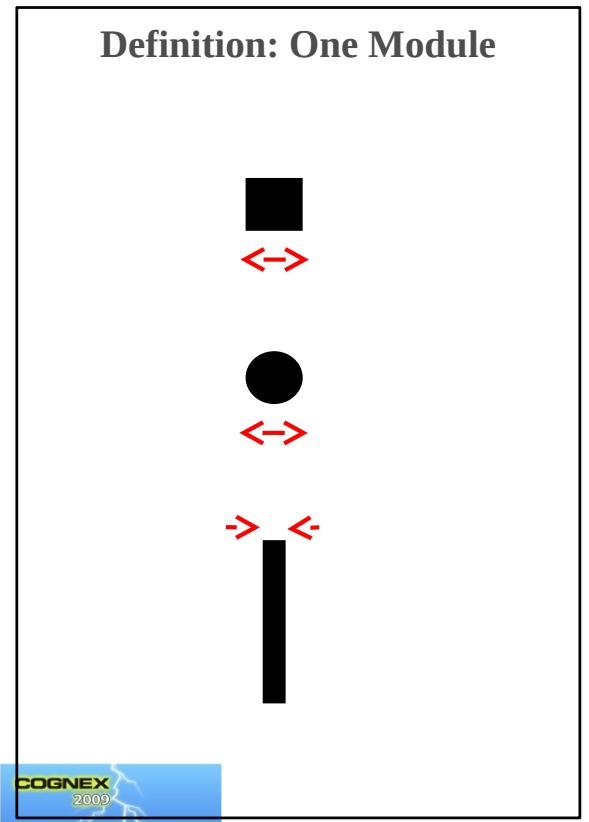

# Module Size Calculation:

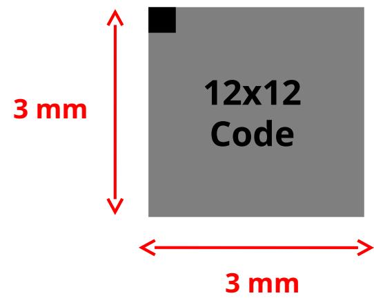

$$
1 \text {m o d u l e} = \frac {3 \mathrm {m m}}{1 2 \text {m o d u l e s}} = 0. 2 5 \mathrm {m m}
$$

$$
\left(\frac {0 . 2 5 m m}{m o d u l e}\right) \left(\frac {1 i n c h}{2 5 m m}\right) \left(\frac {1 0 0 0 m i l}{1 i n c h}\right) = 1 0 m i l / m o d u l e
$$

# 什么是 PPM? (Pixels per Module)

A: How many pixels on the sensor for each module, at a focal distance.

  
Example:

# 解码过程

# 名词：读码 / 未读取 / 错误解码

- Read: 正确解码  
- No-Read: 数据没有被提前  
- 多个原因：时间不够，没有把握,etc.  
- Misread: 确信的解码，但是数据错误

- 错误解码比未读取的危害更大  
Cognex 解码原则宁可不解也不错解.

# 读码过程

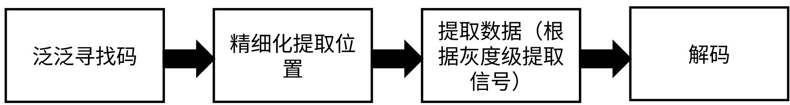

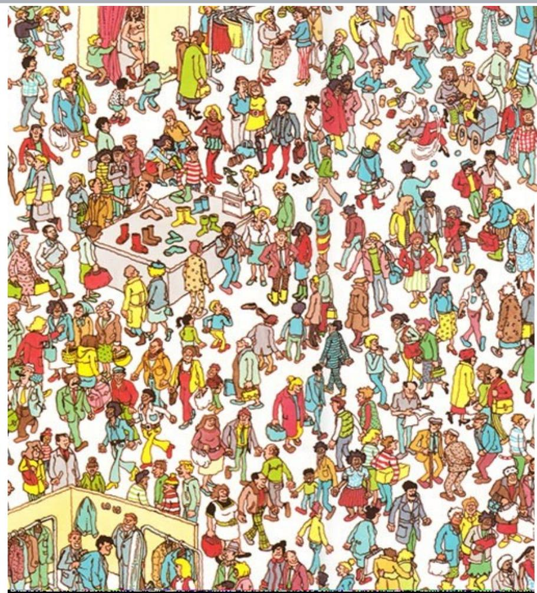

# - 限制寻找 & 解码

- 降低出错的几率 -> 提高  
常常（并不总是）能降低解码时间  
什么是学习/训练  
- 大概的尺寸 (PPM)  
- 极性  
- 反射状况  
- # 行数 /# 列数 (2D)  
- 纠错类型 (2D)  
数据大小 (1D)

# 二维码与一维码的区别

# 二维条码（2-D Barcode）

D

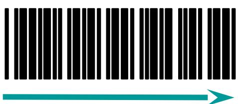

2D

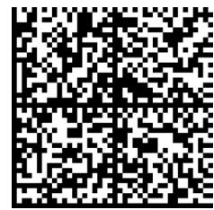

在水平和垂直方向的二维空间存储信息的条码，称为二维条码（2-dimensional bar code）。

# 二维条码（2-D Barcode）

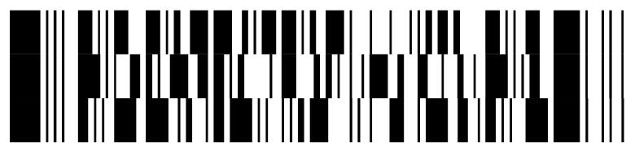

PDF417

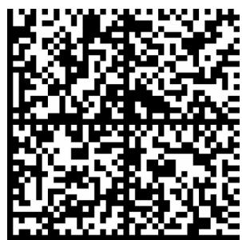  
线性堆叠式二维码  
Data Matrix   
矩阵式二维码

  
MR P KIMMENS   
BPO 4-State   
邮政码

# 二维码的优点 - 数据容量

一维条码的局限

较小的数据容量

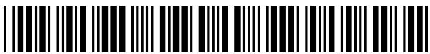

1234567890

二维条码的优点

更大的数据容量 (2-3 KB)

a-z, A-Z, 0-9

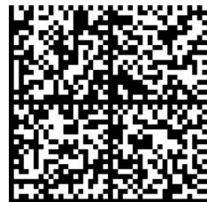

Xxx Year 2000 Compliance

Xxx certifies that the Scanteam 1200, 1325, 1350 Hardware and Quickload Software are Year 2000

Compliant in the following manner:

Correct Display and handling of mm/dd/yy and month/dd/yyyy for the Year 2000

1. Correct Year Rollover from December 31, 1999 to January 1, 2000   
2. Correct Leap Year Rollover from February 28, 2000 to February 29, 2000.   
3. Correct Date Rollover from February 29, 2000 to March 1, 2000.

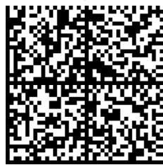

# 二维码的优点 - 超越数字 / 字母

<table><tr><td>一维条码的局限</td><td>二维条码的优点</td></tr><tr><td>通常只能表达字母、数字和一些符号有些可以表达128个ASCII字符</td><td>可以表达8位二进制数据，可以对图像、汉字等进行编码</td></tr></table>

# 小零件的标识 & 污损的标签

<table><tr><td>一维条码的局限</td><td>二维条码的优点</td></tr><tr><td>条码尺寸相对较大</td><td>条码尺寸相对较小</td></tr><tr><td>条码受损后不能阅读</td><td>条码受损后仍然可以阅读</td></tr></table>

# 激光读码器与图像识读器差异

# 激光扫描技术

  
目标反射光至光电

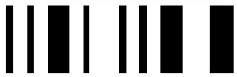  
条形码

  
光探测器信号

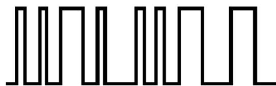  
数字信号

# 激光扫描仪的局限性

# - 难以扫描的条形码

- 印刷效果差  
- 存在缺陷 / 受损  
- 对比度低  
- 镜面反射   
- 高度窄

# - 单向扫描

• 无全方位扫描（360°）或正交（0°和90°）读码  
- 安装和定位受限

# - 活动部件容易出现故障

# - 不能读取 2 维代码

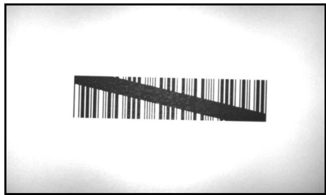

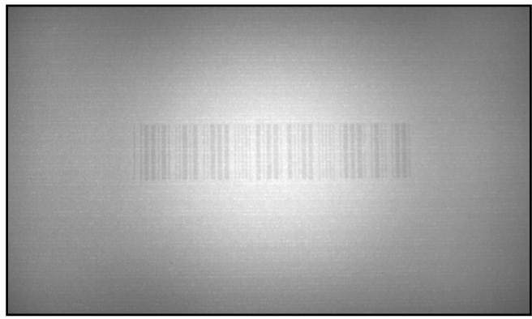

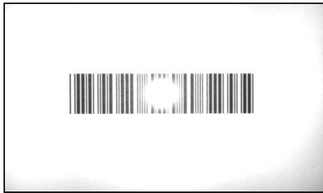

# 视觉识读器技术原理

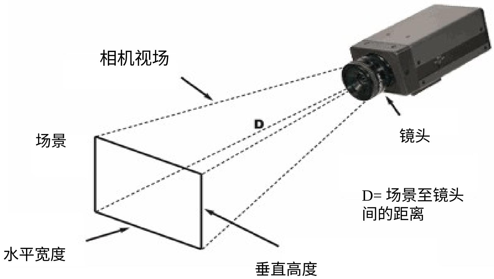

# 基于图像读取 1 维条形码的优点

- 可以轻松读取所有代码，从印刷好的到难读的受损的代码。

- 印刷效果差  
- 存在缺陷 / 受损 / 空洞  
- 对比度低  
- 镜面反射   
- 高度低  
- 过度透视

- 全向读码  
- 无机械元件

- 较激光扫描仪更可靠

- 可以读取 1 维和 2 维代码

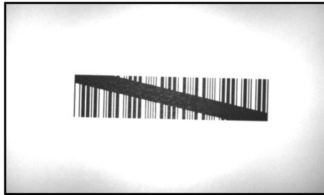

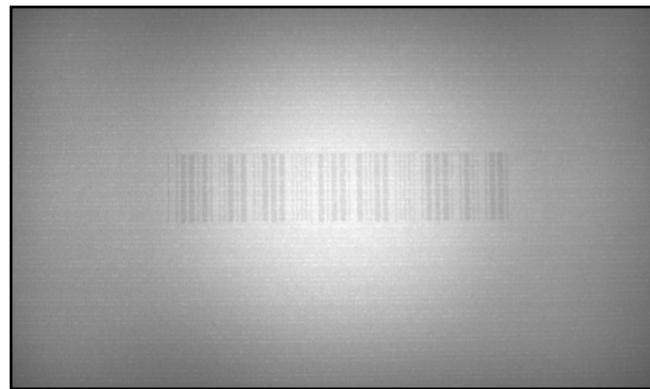

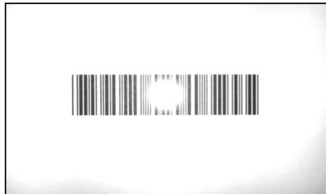

# 为什么早期，成像仪不能取代激光器？

# 成本

- 图像传感器和外围设备部件的成本降低。

# - 尺寸

- 如今可使用高密度和高集成的部件。  
- 如今可以使用火柴盒大小的基于图像的集成式读码器。

# - 性能

- 图像处理算法现已超越激光扫描仪的性能。

# 早期图像式识读器

- 速度 帧率不够  
- 景深（DOF）较小   
DM500 解决这些问题

# 从激光扫描到图像解码

- 激光扫描仪仍然占据在用的 1 维条形码读码器的最大份额  
- 不过，激光扫描仪正快速地被基于图像读码器取代。  
- 基于图像读码器具有优越的读码性能（对比度低、损坏、噪音等。）  
- 基于图像读码器还可以读取 2 维码 - 而现如今, 几乎所有主要行业均采用了 2 维码。

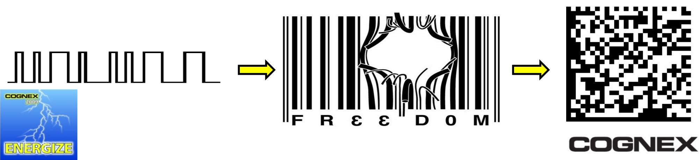