CogIPOneImageTool工具提供了一个图形用户界面，该工具实现了高斯平滑、高通滤波和图像量化等基本图像处理操作。

注:调整输出图像的坐标空间树，保留根空间与图像特征之间的关系。

# 一、Image Processing Operations

# 1、Add/Subtract Constant(加/减常数)

在灰度图像中的每个像素的灰度值中添加一个正值或负值，生成的图像人为地比原始图像亮或暗。对于CogImage24PlanarColor类型的输入图像，将值添加到平面0(红色)、平面1(绿色)和平面2(蓝色)。您可以添加一个值，使输出图像只包含输入图像中最暗的特征，如下例所示:

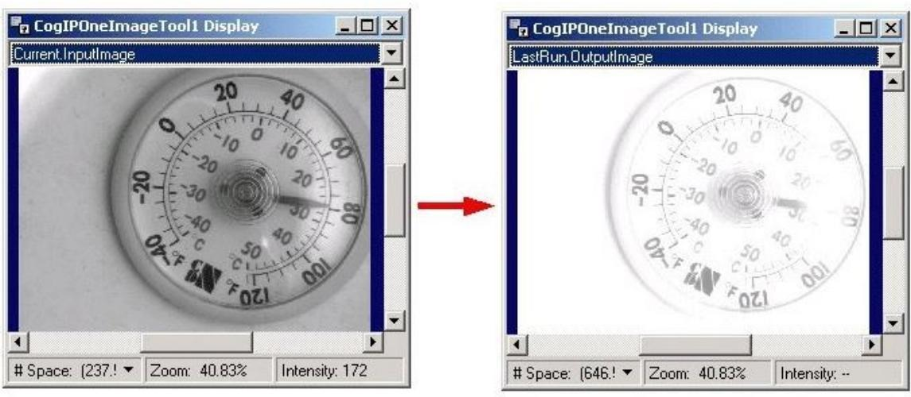

下图是一个例子，红色的分量被一个高的常数值所减少:

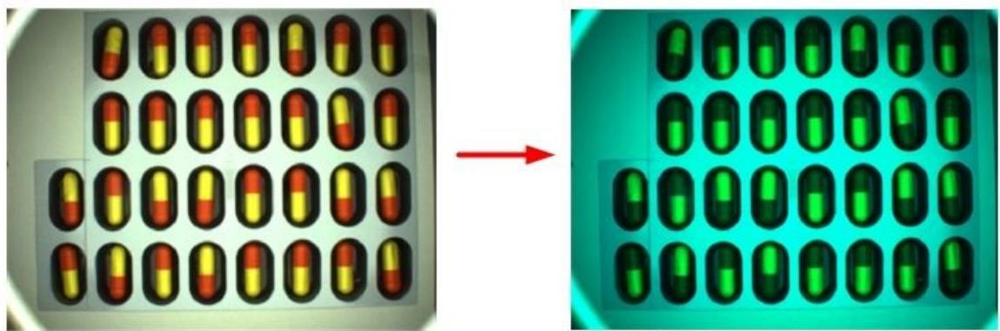

# Add/SubtractConstant

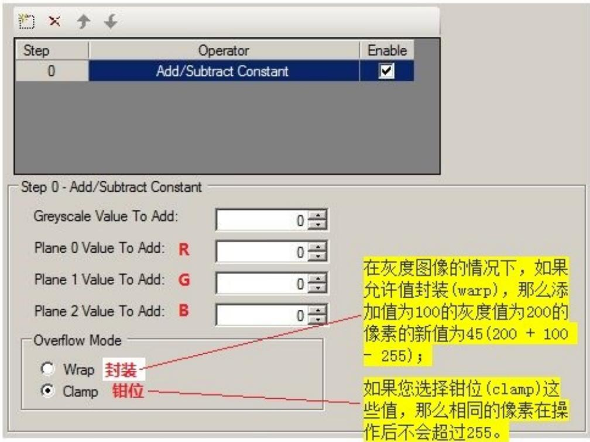

您还必须选择是否允许在操作之后将低于0或超过255的像素值包装或夹紧到这些限制。例如，在灰度图像的情况下，如果允许值包装(warp)，那么添加值为100的灰度值为200的像素的新值为45(200 + 100 - 255)。如果您选择钳位(clamp)这些值，那么相同的像素在操作后不会超过255。

# 2、 Convolve 3x3(卷积 3x3)

将输入图像与一个 $_ { 3 \times 3 }$ 的浮点值内核进行卷积。您可以使用这个函数，与其他图像处理操作符一起，实现自定义图像处理操作，如下例所示:

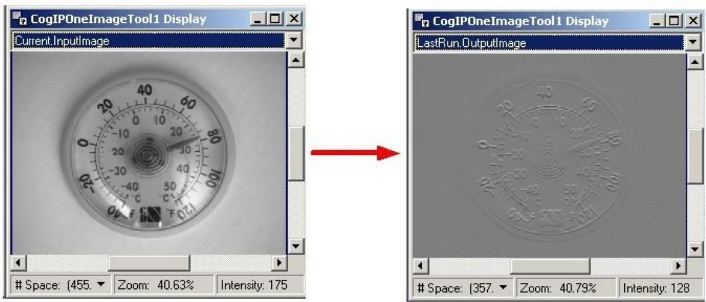

注意，这个操作符总是封装输出值，而不是夹紧它们。

<table><tr><td>-1</td><td>-1</td><td>-1</td></tr><tr><td>-1</td><td>9</td><td>-1</td></tr><tr><td>-1</td><td>-1</td><td>-1</td></tr></table>

该卷积利用的其实是图像中的边缘信息有着比周围像素更高的对比度，而经过卷积之后进步增强了这种对比度，从而使图像显得棱角分明、画面清晰，起到锐化图像的效果。

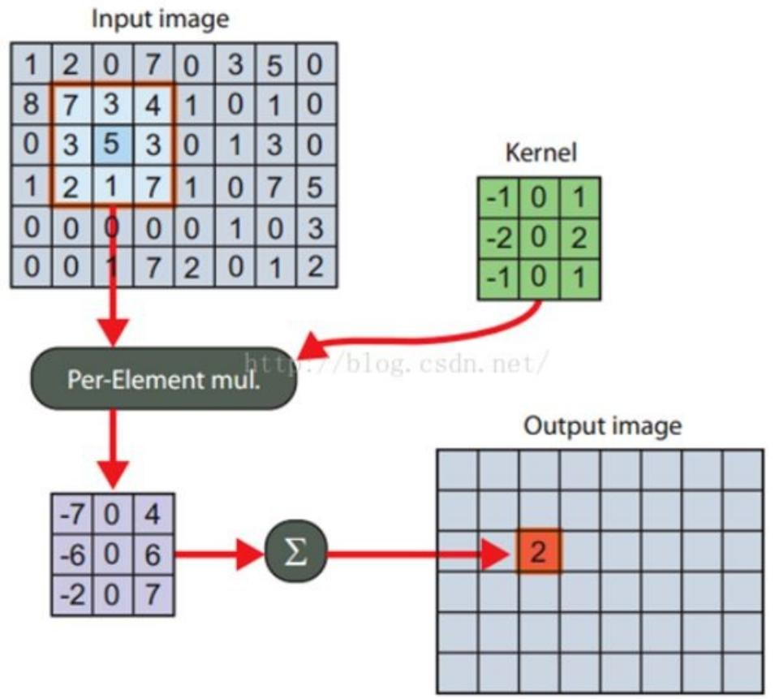

# 3、ConvolveNxM(卷积 NxM)

使用指定大小的浮点值内核处理图像。使用NxM filter执行各种图像处理操作，如边缘锐化、边缘检测、边缘软化等，如下例所示:

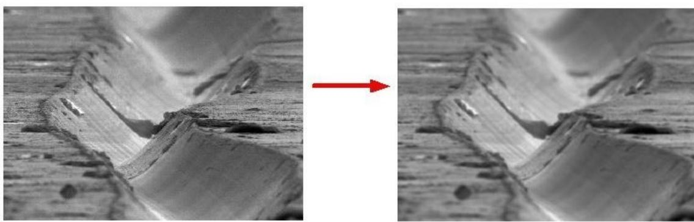

# ConvolveNxM

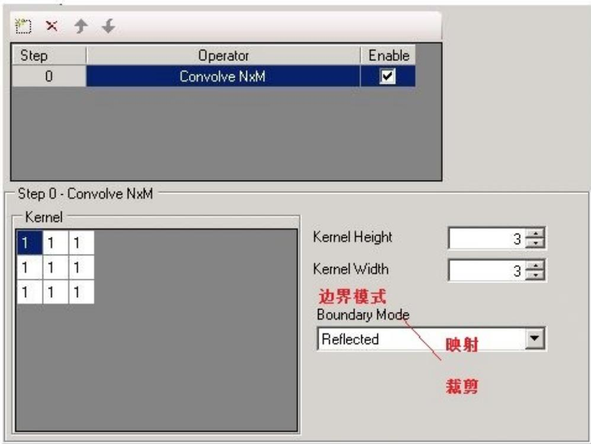

# 3、Equalize(均衡)

重新映射图像中的像素，使后续获得的图像具有相似的灰度值。当您的生产环境中的照明在不同的图像之间略有不同，或者当您正在检查的对象的某些方面(如颜色)允许略有不同时，请使用均衡操作。equalize操作有助于确保生产环境中的不相关更改不会影响视觉应用程序的整体结果。

# 4、Expand(扩展)

用指定的放大系数放大整个图像或整个图像的一部分。该操作接受x轴和y轴图像放大的单独参数，因此您可以使用该操作只沿一个方向放大输入图像。例如，下图显示的是一个输入图像，以及放大了5倍后的图像:

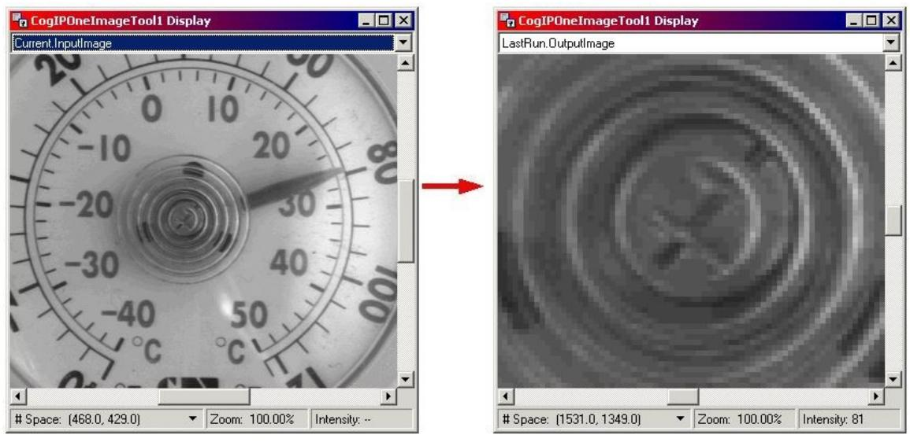

# 5、Flip/Rotate

对输入图像的全部或部分执行水平翻转或顺时针旋转。下图显示了输入图像的一部分是如何被旋转180度的:

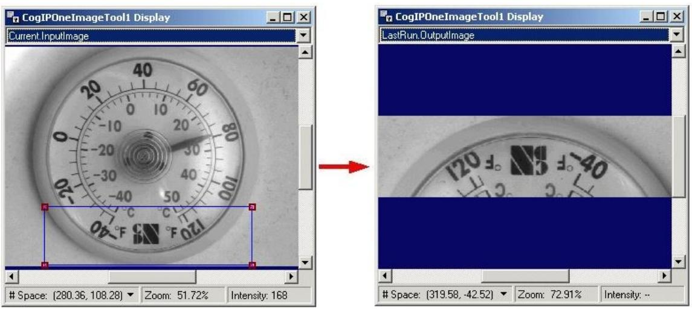

您可能需要翻转或旋转图像，以便视觉工具在每次执行应用程序时分析正确的特性，或者使用以前训练过的OCV工具的字体字符。

# 5、Gauss Sampler(高斯采样器)

取输入图像的一个子样本，使输出图像只包含原始像素的一小部分，并通过减少光和暗像素频繁变化造成的对比度来平滑输入图像。例如，下图所示的图像经过了分采样和平滑操作:

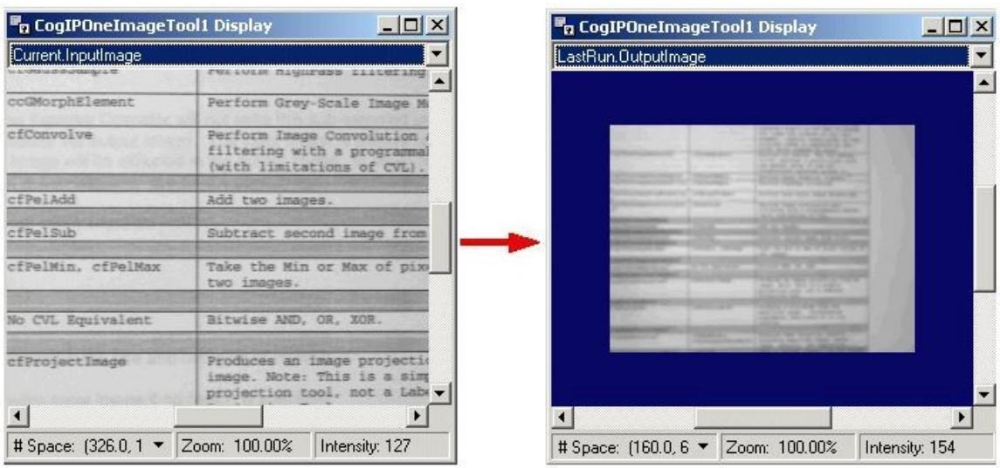

当您使用的视觉工具能够有效地处理缩小后的图像并希望提高应用程序的速度时，请使用采样操作。使用平滑操作，以减少负债的影响，如纹理，信号噪声，或精细打印在您的图像。

# GaussSampler

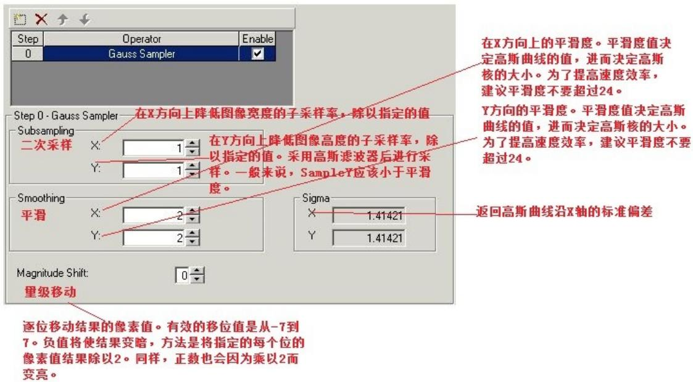

除了采样和平滑外，这个操作还允许您为输出图像包含一个量级位移，其范围从-7到7。对位移因子使用负值会产生较暗的输出图像，而使用正值会产生较亮的输出图像。

# 6、Grey Morphology(灰度形态调整)

对输入图像进行灰度形态学处理，根据图像的大小和方向选择性地增强或减少图像特征。 有关这个广泛的图像处理操作的背景信息，请参阅灰度形态学一节。下图是经过形态学操作的图像:

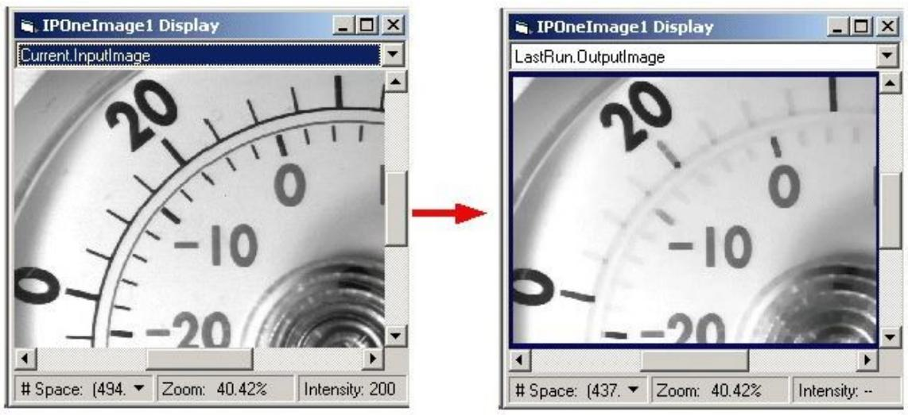

# GreyMorphology

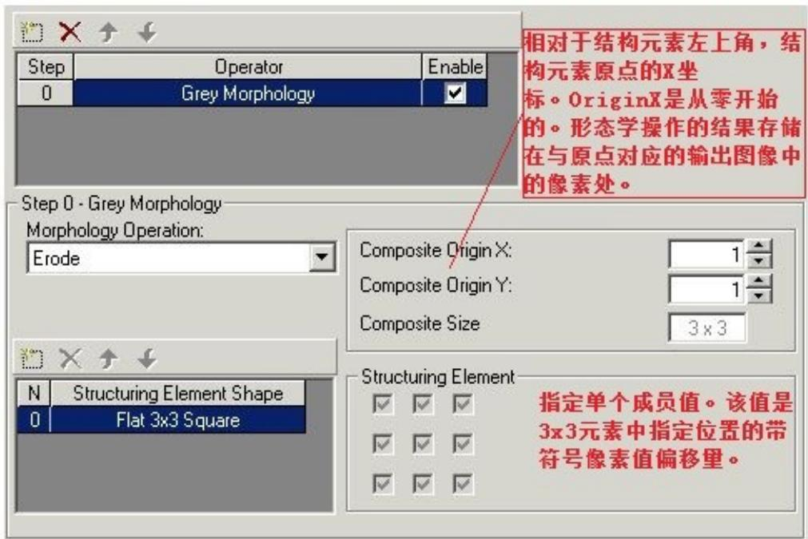

# 7、 Grey Morphology NxM(灰度形态调整 NxM)

以尺寸NxM为核心对输入图像进行灰度形态学处理，根据图像的大小和方向选择性地增强或减少图像特征。有关这个广泛的图像处理操作的背景信息，请参阅灰度形态学一节。

# 8、High Pass Filter(高斯过滤器)

您可以执行高斯、平均或中值平滑操作，然后从输入图像中减去结果图像。下图是应用高通滤波器后的图像:

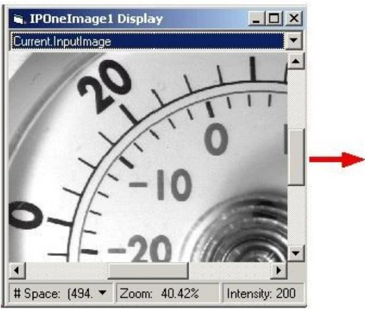

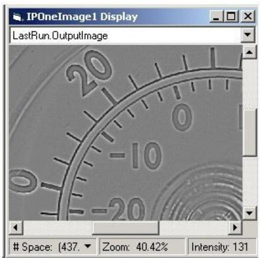

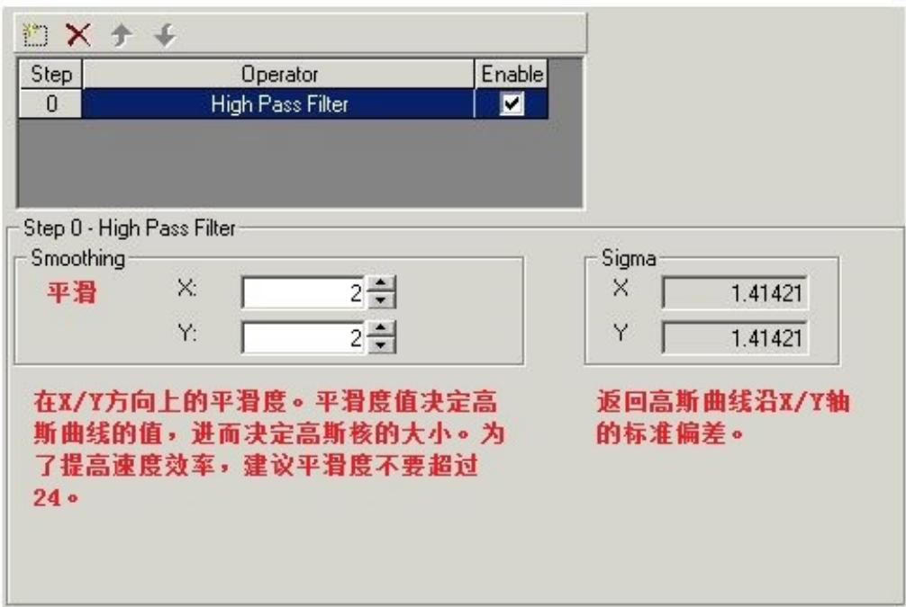  
使用高通滤波器来突出输入图像中的细微特征

# 9、Median 3x3(中值 3x3)

通过检查每个原始像素周围的3x3像素矩阵，按照灰度值的顺序对其进行排序，然后对输出图像取第五个或中间的灰度值，从而降低输入图像中的图像噪声的影响。下图显示了中值

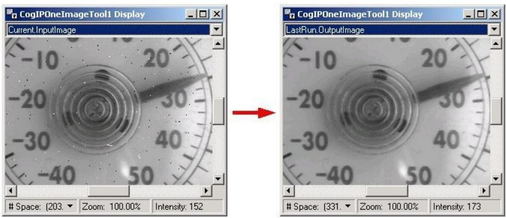  
3x3操作的效果:

3x3 的中值操作不带参数。但是要注意，这个操作将输入图像的大小减少了 2 行 2 列(修剪)，或者实际上是在输入图像的边界上减少了一个像素的条带。如果您在同一幅图像上使用多3x3的中值操作，这个约简的效果将成倍增加。例如，如果对图像使用5个3x3中值操作，输出图像将比原始图像小10行10列。

# 10、NxM Median(中值 NxM)

通过使用自定义大小的内核检查每个原始像素周围的像素矩阵，减少输入图像中的图像噪声的影响。较大的核在降低图像噪声方面有较大的效果，但会降低图像中特征的质量。

NxM中值过滤器支持Care和Don't Care像素屏蔽内核，允许您在为输出图像生成新的灰色值时指定不考虑矩阵中的哪些元素。启用Care像素如下图所示:

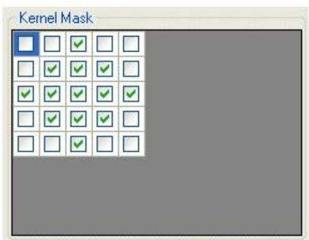

# 11、Missing Pixel(丢失像素)

将未知值的像素替换为固定值的像素或基于对周围像素分析的值的像素。基于如何获取像素值，像素值可能是未知的。例如，DS1000系列传感器的距离图像可能包含丢失的像素。

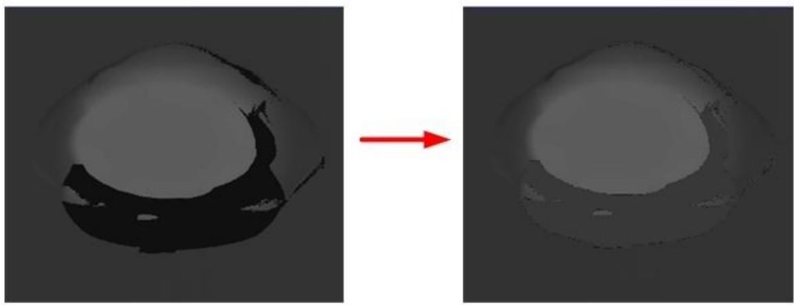

# 12、Multiply Constant(乘以常数)

将灰度图像中每个像素的灰度值乘以一个常数值。对于CogImage24PlanarColor类型的输入图像，平面0(红色)、平面1(绿色)和平面2(蓝色)的值乘以指定的乘数。如果您指定一个介于 0.0 和 1.0 之间的值，它的作用是将每个像素除以一个常量值，如下图所示:

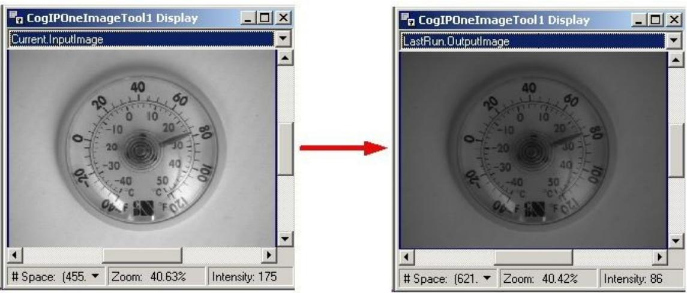

下图是红色分量乘以一个高值的例子:

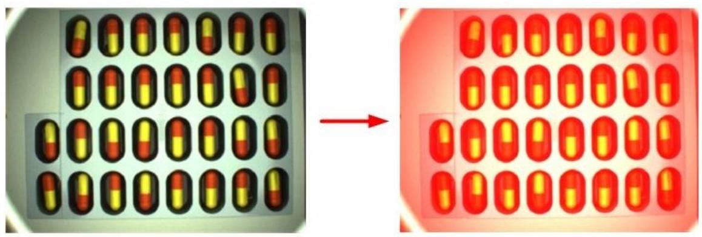

您还必须选择，在操作之后，结果像素值是低于0还是超过255，是允许封装还是钳位到这些限制。例如，如果允许值自动换行，那么灰色值200乘以2的像素的新值为145(2 * 200 -255)。如果您选择钳位这些值，那么相同的像素在操作后不会超过255。

# 13、Pixel Map(像素映射)

对输入图像应用像素映射。对于灰度输入图像，将输入图像中的每个像素替换为一个像素，该像素映射在索引处的值等于输入图像的像素值。对于CogImage24PlanarColor类型的图像，可以为平面0(红色)、平面1(绿色)和平面2(蓝色)指定单个像素映射。

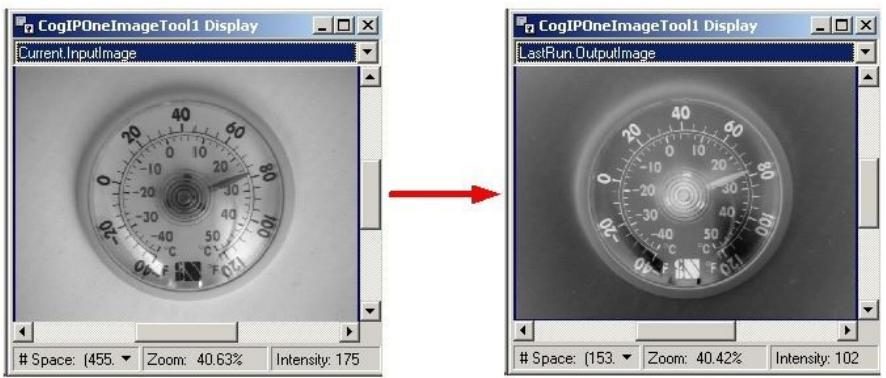

下图是应用反向平面0(红色)像素映射的效果，其中平面0像素映射包含255到0之间的值:

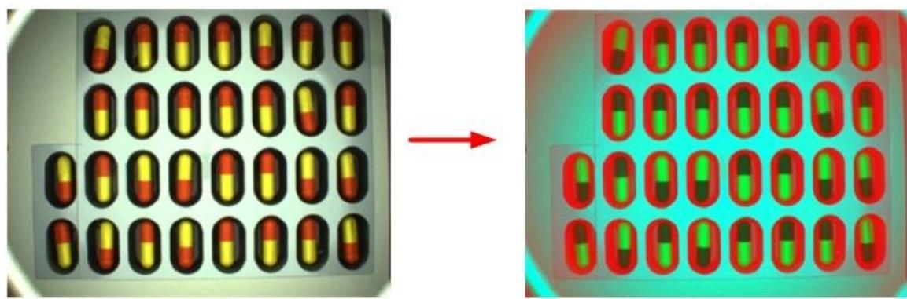

像素图的常见应用包括构造掩码图像和执行自定义图像均衡。

# 14、Quantize(量化)

减少输入图像中离散灰度值的数量。执行量化操作可以帮助分离具有相似灰度值的单个特征，或者将所需的特征减少为单个灰度值，从而使它们更易于使用其他视觉工具进行分析。

下图是量化操作的效果:

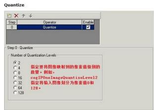

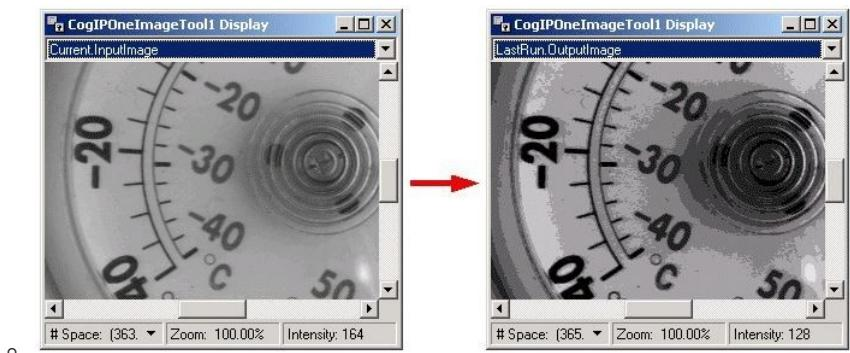

注：当您选择量化操作时，您必须选择输出图像将包含的离散灰度值的数量。

# 15、Sample Convolve(采样卷积)

同时执行可分离的卷积和采样。一个常见的用法是对高斯平滑的采样。下图显示了一个经过平滑操作的图像:

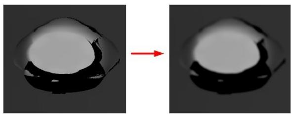

# 16、Subsampler(二次采样)

生成输出图像，其中输入图像的分辨率和大小已经降低。子采样可以让其他视觉工具更快地对缩小的图像进行操作，尽管缩小图像的大小会导致精度降低。子采样器操作提供了两种生成输出图像的算法。

第一种算法将输入图像分割为像素块，并将块中心的像素复制到输出图像中。如果块包含偶数行或偶数列，则操作复制最接近块中心的左上角像素。下图展示了3x3块的子采样:

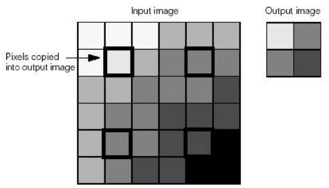

子采样器操作提供的第二种算法是空间平均，它将输入图像划分为像素块，确定每个块中像素的平均灰度值，并将该平均值放入输出图像。下图展示了一个2x2块的空间平均:

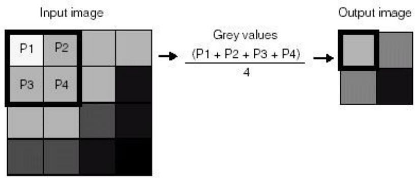

注：在两种算法之间，子采样操作执行速度更快，但空间平均算法具有更高的精度。

注意:如果您为子采样率指定了一个偶数，并且您不使用空间平均，那么该工具将选择位于采样区域中心左侧上方的像素。这在采样图像的特征位置引入了一个半像素的位移。该工具自动调整输出图像坐标空间树的坐标空间移动一个半像素。由于空间平均在采样区域内均匀地平均像素值，而不管其大小，因此在启用空间平均时不会执行此类调整。

# Subsampler

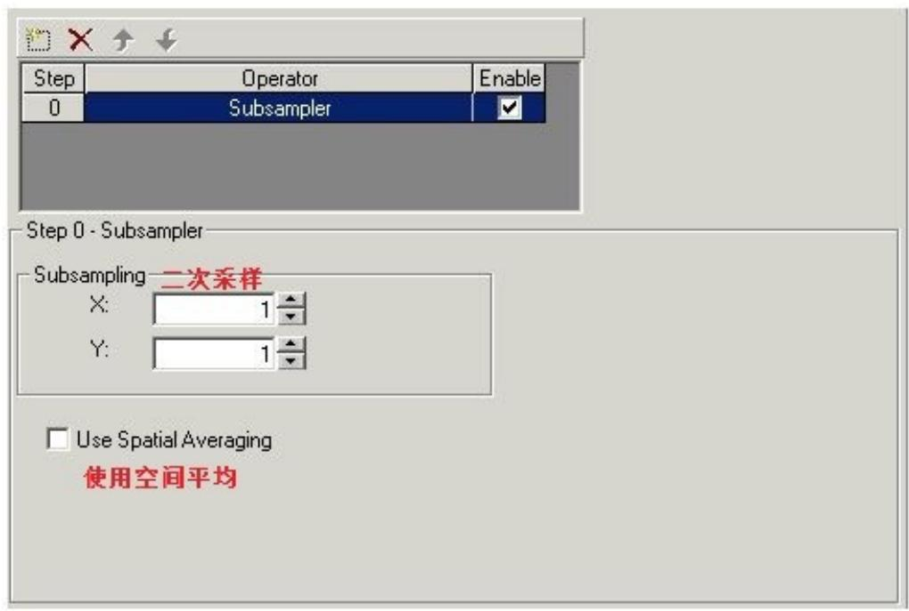

# 二、Supported Image Types

下表总结了图像处理工具所支持的输入图像类型。输出图像的类型与输入图像的类型相同。

SupportedImage Types   

<table><tr><td>Operation</td><td>Method</td><td>CogImage8Grey</td><td>CogImage16Grey</td><td>CogImage16Range</td><td>CogImage24PlanarColor</td></tr><tr><td>Add/Subtract Constant</td><td></td><td>✓</td><td>✓</td><td></td><td>✓</td></tr><tr><td>Convolve3x3</td><td></td><td>✓</td><td></td><td></td><td>✓</td></tr><tr><td>Convolve NxM</td><td></td><td>✓</td><td></td><td></td><td>✓</td></tr><tr><td>Equalize</td><td></td><td>✓</td><td>✓</td><td></td><td></td></tr><tr><td>Expand</td><td></td><td>✓</td><td>✓</td><td></td><td>✓</td></tr><tr><td>Flip/Rotate</td><td></td><td>✓</td><td>✓</td><td></td><td>✓</td></tr><tr><td>Gauss Sampler</td><td></td><td>✓</td><td></td><td></td><td>✓</td></tr><tr><td>Grey Morphology</td><td></td><td>✓</td><td></td><td></td><td></td></tr><tr><td>NxM Grey Morphology</td><td></td><td>✓</td><td></td><td></td><td></td></tr><tr><td>High Pass Filter</td><td></td><td></td><td></td><td></td><td></td></tr><tr><td></td><td>Gauss</td><td>✓</td><td>✓</td><td></td><td>✓</td></tr><tr><td></td><td>Mean</td><td>✓</td><td>✓</td><td>✓</td><td>✓</td></tr><tr><td></td><td>Median</td><td>✓</td><td>✓</td><td>✓</td><td>✓</td></tr><tr><td>3x3 Median</td><td></td><td>✓</td><td></td><td></td><td></td></tr><tr><td>Median NxM</td><td></td><td>✓</td><td>✓</td><td>✓</td><td></td></tr><tr><td>Missing Pixel</td><td></td><td></td><td></td><td>✓</td><td></td></tr><tr><td>Multiply Constant</td><td></td><td>✓</td><td>✓</td><td></td><td>✓</td></tr><tr><td>Pixel Map</td><td></td><td>✓</td><td></td><td></td><td>✓</td></tr><tr><td>Quantize</td><td></td><td>✓</td><td>✓</td><td></td><td></td></tr><tr><td>Sample Convolve</td><td></td><td>✓</td><td>✓</td><td></td><td></td></tr><tr><td>Subsampler</td><td></td><td>✓</td><td>✓</td><td></td><td>✓</td></tr></table>