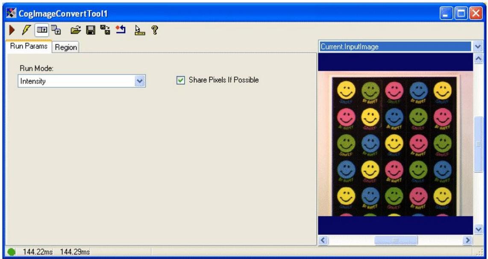
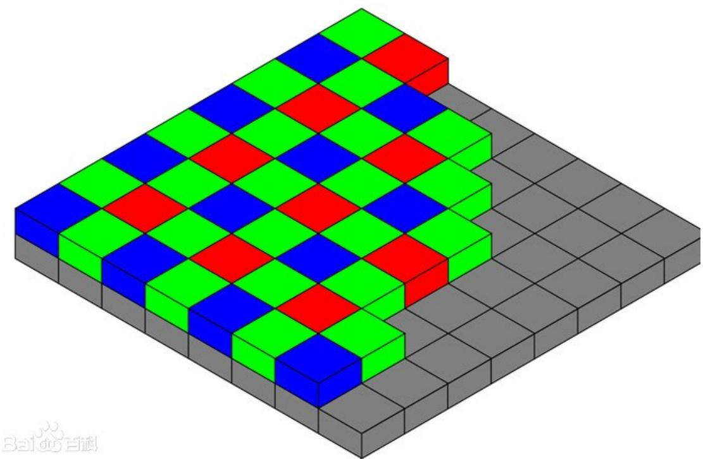
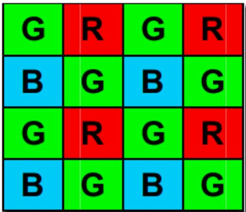
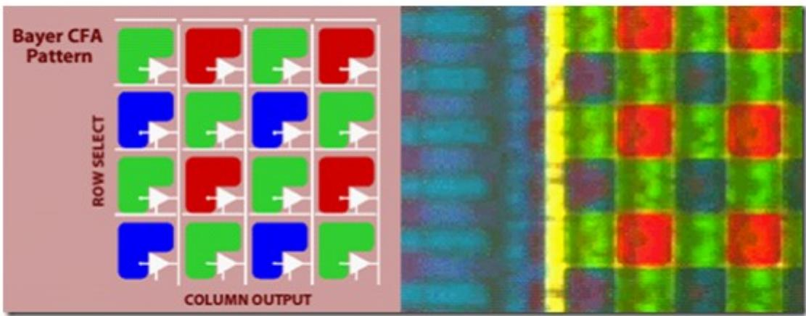
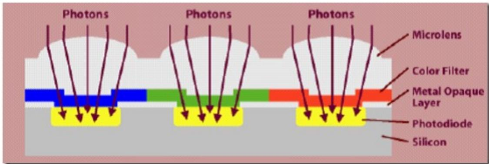
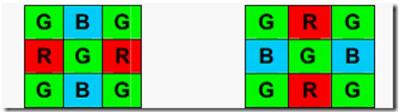
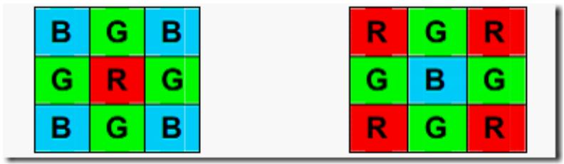
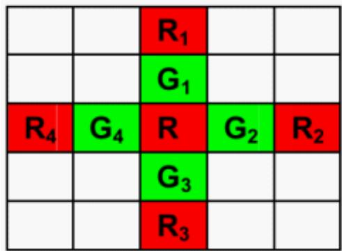
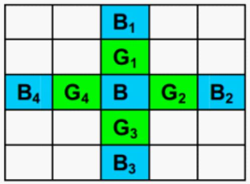

本主题包含以下章节。

Control Buttons ( 控件按钮 )   
Run Params Tab (Run Params 选项卡 )

Image Convert 工具编辑控件为 CogImageConvertTool 工具提供图形用户界面，此工具可将图像从一种格式转换为另一种格式。

Image Convert 工具编辑控件如下图所示：

# Run Params Tab (Run Params 选项卡)

Intensity 如 果 输 入 图 像 是 类 型 RGB 的 ICogImage24PlanarColor ， 则 输 出 计 算ICogImage8Grey，其代表此彩色图像的灰度强度。

如果输入图像是类型 HSI 的 ICogImag24PlanarColor，则输出代表其强度平面的ICogImage8Grey。

如果输入图像是 ICogImage16Grey，则根据 Encoding 属性右移每个像素以将 8个最重要的有效位置于输出图像中。

如 果 输 入 图 像 已 经 是 ICogImage8Grey ， 则 输 出 与 输 入 图 像 相 当 的ICogImage8Grey。

HIS 如果输入图像是类型 RGB 的 ICogImage24PlanarColor，则输出类型 HSI 的计算ICogImage24PlanarColor。

如果输入图像已经是类型 HSI 的 ICogImage24PlanarColor，则输出与输入图像相当的 ICogImage24PlanarColor。

如果输入图像为任何其他类型，运行时会引发异常。

IntensityFromBayer(来自拜耳算法的亮度)

输入图像必须为 ICogImage8Grey 且假定以 Bayer 方式管理输入图像。输出计算 ICogImage8Grey，其代表此输入图像的计算灰度强度。

RGBFromBayer(来自拜耳算法的 RGB)

输入图像必须为 ICogImage8Grey 且假定以 Bayer 方式管理输入图像。输出类型 RGB 的计算 ICogImage24PlanarColor。

HSIFromBayer(来自拜耳算法的 HIS)

输入图像必须为 ICogImage8Grey 且假定以 Bayer 方式管理输入图像。输出类型 HSI 的计算 ICogImage24PlanarColor。

Plane0(平面 0) 输入图像必须为 ICogImage24PlanarColor。输出 ICogImage8Grey

Plane1(平面 1) 输入图像必须为 ICogImage24PlanarColor。输出代表输入图像的平面 1 的ICogImage8Grey。

Plane2(平面 2) 输入图像必须为 ICogImage24PlanarColor。输出代表输入图像的平面 2 的ICogImage8Grey。

RGB 如果输入图像是类型 HSI 的 ICogImage24PlanarColor，则输出类型 RGB 的

计算 ICogImage24PlanarColor。

如果输入图像已经是类型 RGB 的 ICogImage24PlanarColor，则输出与输入图像相当的 ICogImage24PlanarColor。

如果输入图像为任何其他类型，运行时会引发异常。

IntensityFromWeightedRGB(来自 RGB 权重的亮度)

如 果 输 入 图 像 是 类 型 RGB 的 ICogImage24PlanarColor ， 则 输 出 计 算ICogImage8Grey，其代表此彩色图像的灰度强度，采用客户提供的 RGB 权重系数计算得出。

PixelFromRange(如下范围的像素)

如 果 输 入 图 像 是 CogImage16Range ， 则 输 出 对 应 于 高 度 数 据 的CogImage16Grey

MaskFromRange(如下范围的掩膜)

如 果 输 入 图 像 是 CogImage16Range ， 则 输 出 对 应 于 掩 模 数 据 的CogImage8Grey。

# 拜耳阵列

1、 概念：拜耳阵列是实现CCD 或CMOS 传感器拍摄彩色图像的主要技术之一。它是一个 $4 { \times } 4$ 阵列，由8个绿色、4个蓝色和4个红色像素组成，在将灰度图形转换为彩色图片时会以 $2 \times 2$ 矩阵进行9次运算，最后生成一幅彩色图形。  
2、 拜耳阵列模拟人眼对色彩的敏感程度，采用1红2绿1蓝的排列方式将灰度信息转换成彩色信息；

  
注：采用这种技术的传感器实际每个像素仅有一种颜色信息，需要利用反马赛克算法进行插值计算，最终获得一张图像。

# Bayer阵列及算法简析

1、拜耳阵列是实现 CCD 或CMOS 传感器拍摄彩色图像的主要技术之一  
2、对于彩色图像，需要采集多种最基本的颜色，如 rgb 三种颜色，最简单的方法就是用滤镜的方法，红色的滤镜透过红色的波长，绿色的滤镜透过绿色的波长，蓝色的滤镜透过蓝色的波长，如果要采集rgb三个基本色，则需要三块滤镜，这样价格昂贵，且不好制造。因为三块滤镜都必须保证每一个像素点都对齐，当用bayer格式的时候，很好的解决了这个问题，bayer 格式图片在一块滤镜上设置的不同的颜色，通过分析人眼对颜色的感知发现，人眼对绿色比较敏感，所以一般bayer格式的图片绿色格式的像素是r和g像素的和。

# 3、Bayer 色彩滤波阵列

拜耳色彩滤波阵列是非常有名的彩色图片的数字采集格式。

色彩滤波器的模式如上图所示，由一半的G，1/4的R，1/4的B组成。拜耳色彩滤波器的模式、序列、滤波器有很多种，但最常见的模式是由Kodak提出的 $2 \times 2$ 模式。

当 Image Sensor 往外逐行输出数据时，像素的序列为 GRGRGR.../BGBGBG...（顺序 RGB）。这样阵列的 Sensor 设计，使得 RGB 传感器减少到了全色传感器的1/3，如下所示。

$$
\frac {\frac {1}{2} + \frac {1}{4} + \frac {1}{4}}{1 + 1 + 1} = \frac {1}{3}
$$

图像传感器的结构如下所示，每一个感光像素之间都有金属隔离层，光纤通过显微镜头，在色彩滤波器过滤之后，投射到相应的漏洞式硅的感光元件上。

# 3、 白平衡调节（White Balance）

色彩传感器并不能像人眼那样直接感应图像，因此为了保证最终图像的真实性，必须经过一些白平衡处理以及色彩校正等算法来修正图像。

原始像素的第一步处理操作就是白平衡调节。一个白色物体每通道的白平衡都应该是相同的，即 $\mathsf { R } = \mathsf { G } = \mathsf { B } ,$ 。通过白色物体的采集以及直方图分析，拥有最高级别白平衡的通道被作为目标通道，而其他两个通道通过增益达到匹配。同时，随着光源的不同，白平衡也应该相应的调节。

# Bayer 插值补偿算法（Bayer Interpolation）

# 1) 插值红蓝算法实现

每一个像素仅仅包括了光谱的一部分，必须通过插值来实现每个像素的RGB值。为了从Bayer格式得到每个像素的RGB格式，我们需要通过插值填补缺失的2个色彩。

插值的方法有很多（包括领域、线性、 $3 \times 3$ 等），通过速度与质量权衡，最好的是线性插值补偿算法。其中算法如下：

R和B通过线性领域插值，但这有四种不同的分布，如下图所示：

  
  
(b）

在（a）与（b）中，R和B分别取领域的平均值。  
在（c）与（d）中，取领域的 4 个 B 或 R 的均值作为中间像素的 B 值。

# 2) 插值绿算法实现

由于人眼对绿光反应最敏感，对紫光和红光则反应较弱，因此为了达到更好的画质，需要对G特殊照顾。在上述（c）与（d）中，扩展开来就是上图的（e）与（f）中间像素G的取值，这也有一定的算法要求，不同的算法效果上会有差异。经过相关的研究，（e）中间像素G值的算法如下：

$$
G (R) = \left\{ \begin{array}{l l} \frac {G 1 + G 3}{2} & , | R 1 - R 3 | <   | R 2 - R 4 | \\ \frac {G 3 + G 4}{2} & , | R 1 - R 3 | > | R 2 - R 4 | \\ \frac {G 1 + G 2 + G 3 + G 4}{4} & , | R 1 - R 3 | = | R 2 - R 4 | \end{array} \right.
$$

（f）中间像素G值的算法如下：

$$
G (B) = \left\{ \begin{array}{l l} \frac {G 1 + G 3}{2} & , | B 1 - B 3 | <   | B 2 - B 4 | \\ \frac {G 3 + G 4}{2} & , | B 1 - B 3 | > | B 2 - B 4 | \\ \frac {G 1 + G 2 + G 3 + G 4}{4} & , | B 1 - B 3 | = | B 2 - B 4 | \end{array} \right.
$$

CMOS摄像头这部分转换是在内部用ADC或者ISP完成的，生产商为了降低成本必然会使得图像失真。当然用外部处理器来实现转换，如果处理器的速度足够NB，能够胜任像素的操作，用上面的算法来进行转换，皆大欢喜。不过上述算法将直接成倍提高了算法的复杂度，速度上将会有所限制。因此为了速度的提成，可以直接通过来4领域G取均值来中间像素的G值，将会降低一倍的速率，而在性能上差之甚微，算法如下：

$$
G (R) = \frac {G 1 + G 2 + G 3 + G 4}{4} \text {或} G (B) = \frac {G 1 + G 2 + G 3 + G 4}{4}
$$

如果能够通过损失图像的质量，来达到更快的速度，还可以取G1、G2的均值来实现，但是这样的做法会导致边沿以及跳变部分的失真。