# ImageSource

2019/12/19

Zhang Juan

# 学习目标

学员将学会正确地：

□ 创建并配置像源采集

# 像源

在 VisionPro 中用来从相机采集图像的工具是像源  
使用初始化按钮初始化采集

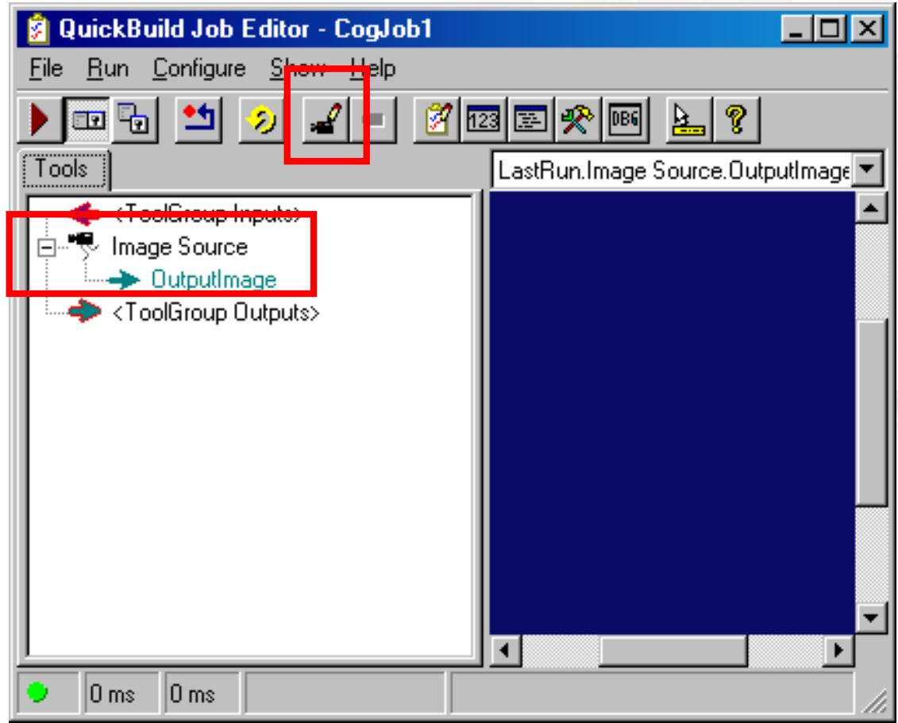

# 采集基础（板卡）

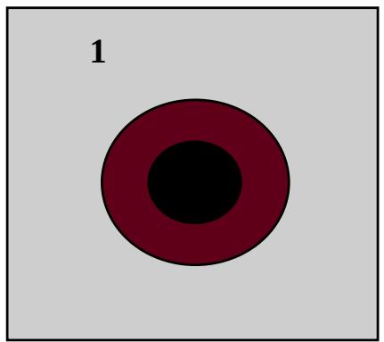

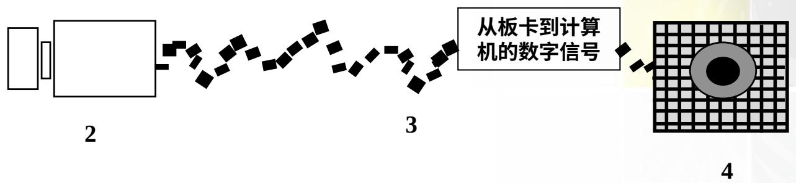

- 视场（FOV）也被称作场景，是相机和镜头能够看到的物理区域  
相机将光能转化为信号（模拟或者数字的）  
- 信号通过板卡传送到计算机进行分析  
灰度值以照片元素或像素的列和行进行再组合

# 图像表现

- 图像以光浓度的点数（称作像素）的2维数组（表格）保存  
- 每个像素的光浓度值或者灰度值以 0 和 255 之间的整数来表示

- 0 = 黑色  
• 255 = 白色

- 左手图像坐标系统

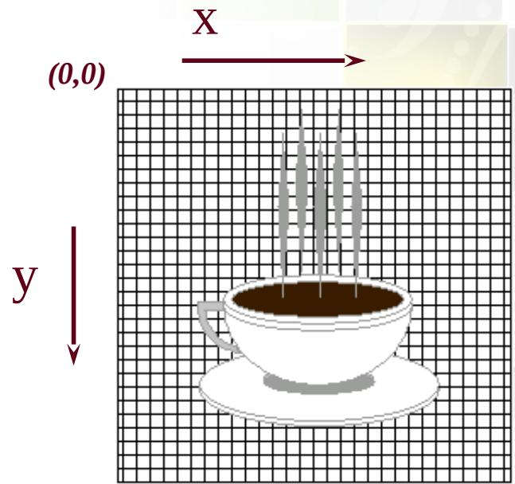

# 像源

首先，选择图像是来源于图像数据库还是相机  
您也可以加载一个图像文件或文件夹

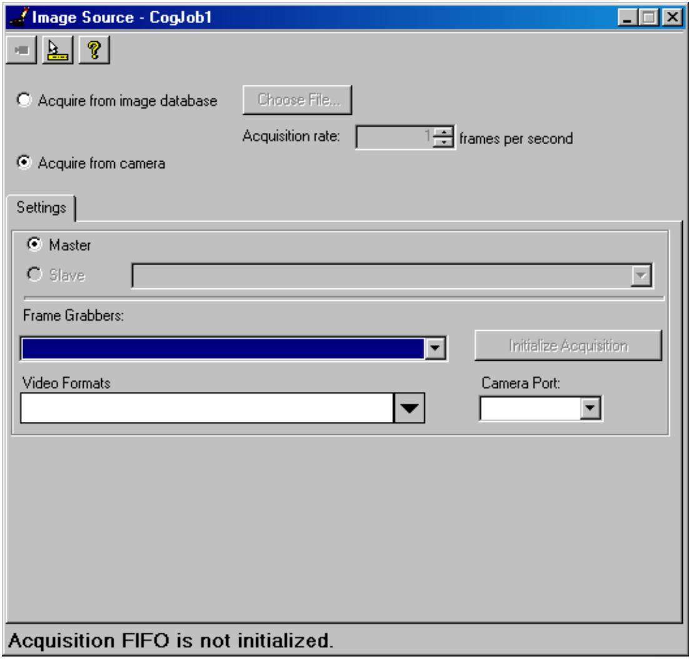

# 像源

# 板卡

采集图像的康耐视电路板

# 视频格式:

选择您要用来采集该图像的相机（及其格式）

# 相机端口

该相机连接到哪个端口

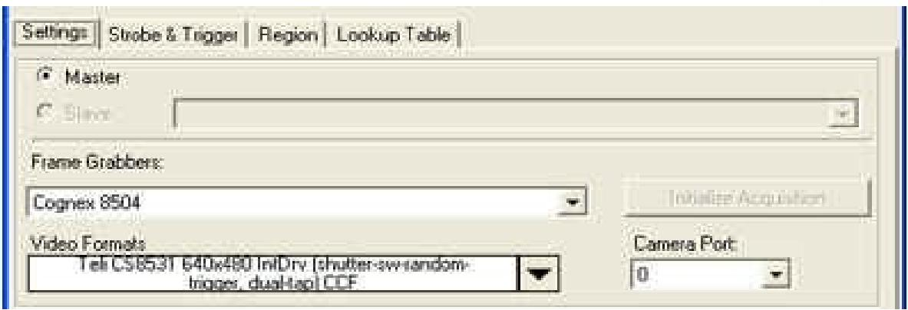

# 运行工作

在您运行工作时，它从相机采集图像并放入到LastRun.OutputImage

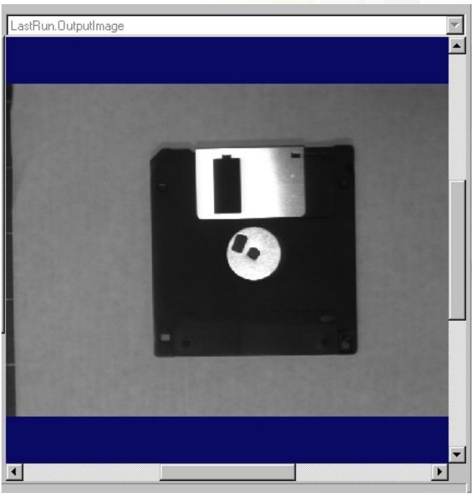

# 获取更佳的图像

修改采集的物理设置通常是您应该做的第一件事，以便尝试提高您的图像质量

灯光

焦点

光圈

在像源配置中有好几个参数也可能有助于提高图像的质量

# 获取更佳的图像

曝光

电子快门，相机的曝光时间

亮度和对比度

- 对比度确定图像灰度值的“扩展”  
- 亮度将整体灰度值调高或者调低

# 频闪和触发

在运行时在像源中有几种与触发采集相关的设置

触发已激活:

如果勾选，表示在每次触发时发出采集请求

- 手动

软件触发

• 采集图像并将其复制到输出图像（OutputImage）缓冲区和 AcqFifoRUN 一样

Settings

Strobe & Trigger

Region

Lookup Table

Ise Duration:

Pulse Polarity High

Trigger Mode

Manual

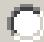

Free Run

Hardware Auto

Hardware Semi-Auto

Trigger Low To High

# 频闪和触发

# 硬件自动

当探测到外部触发线上有信号时开始采集

触发从低到高

- 勾选则触发信号从低到高地转变   
- 不勾选则从高到低地转变

如果取回图像的速率低于触发的速率，可能会发生超运行错误

Settings

Strobe & Trigger

Region

Lookup Table

lse Duration:

Pulse Polarity High

Trigger Mode

Manual

Free Run

Hardware Auto

Hardware Semi-Auto

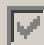

Trigger Low To High

# 频闪和触发

# 硬件半自动

当您执行运行时，AcqFifo 工具激活板卡，然后等待外部的触发

要采集另一个图像，再次执行运行；否则，可能会丢失下一个外部触发

Settings

Strobe & Trigger

Region

Lookup Table

Strobe Enabled

Pulse Duration:

ms

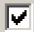

Pulse Polarity High

Trigger Mode

Manual

Free Run

Hardware Auto

Hardware Semi-Auto

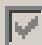

Trigger Low To High

# 像源设置

# 超时

以毫秒为单位设置在调用采集（Acquire）或者完整采集（CompleteAcquire）时使用的超时时间

超时时间通常用于处理不发生触发的情况

# 其他的参数

# 最后一组参数用于专业化采集设置

频闪采集

使用辅助灯光模块

使用渐进扫描相机采集部分图像

使用查找表单

# 显示直播视频

- 使用显示实时图象按钮打开直播视频显示窗口并显示活动图像

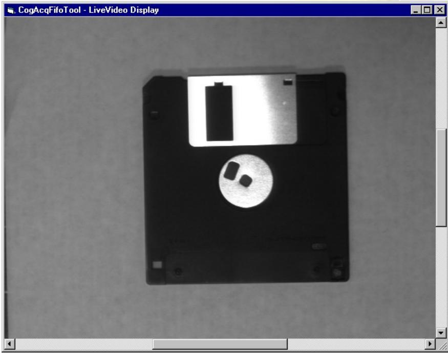

# 显示

可选项，使用浮动显示窗口打开不同的窗口来显示所采集的图像  
注意底部的确切信息。

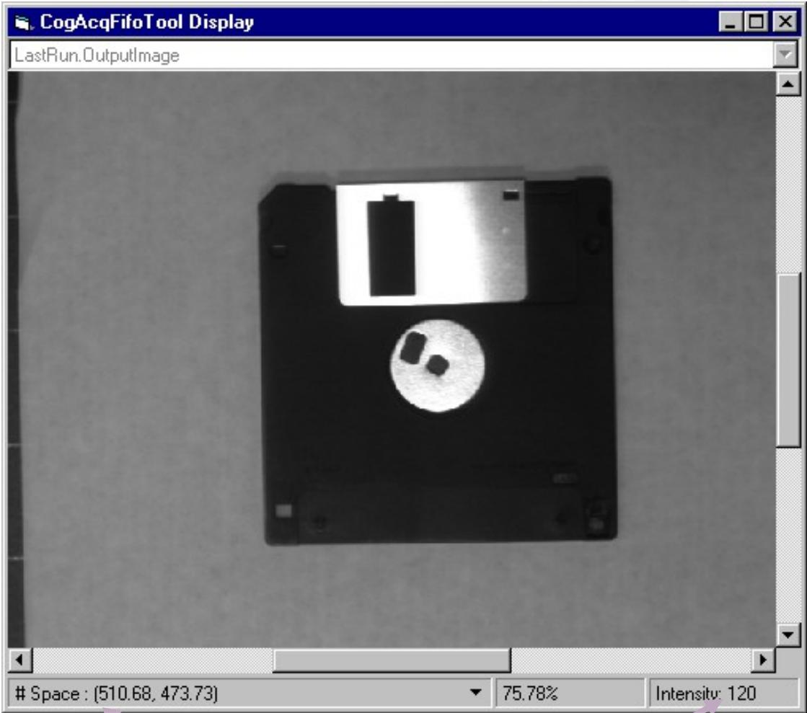  
位置  
灰度值

# 显示

在任何显示上，您可以右击并且选择放大、缩小、全图等等

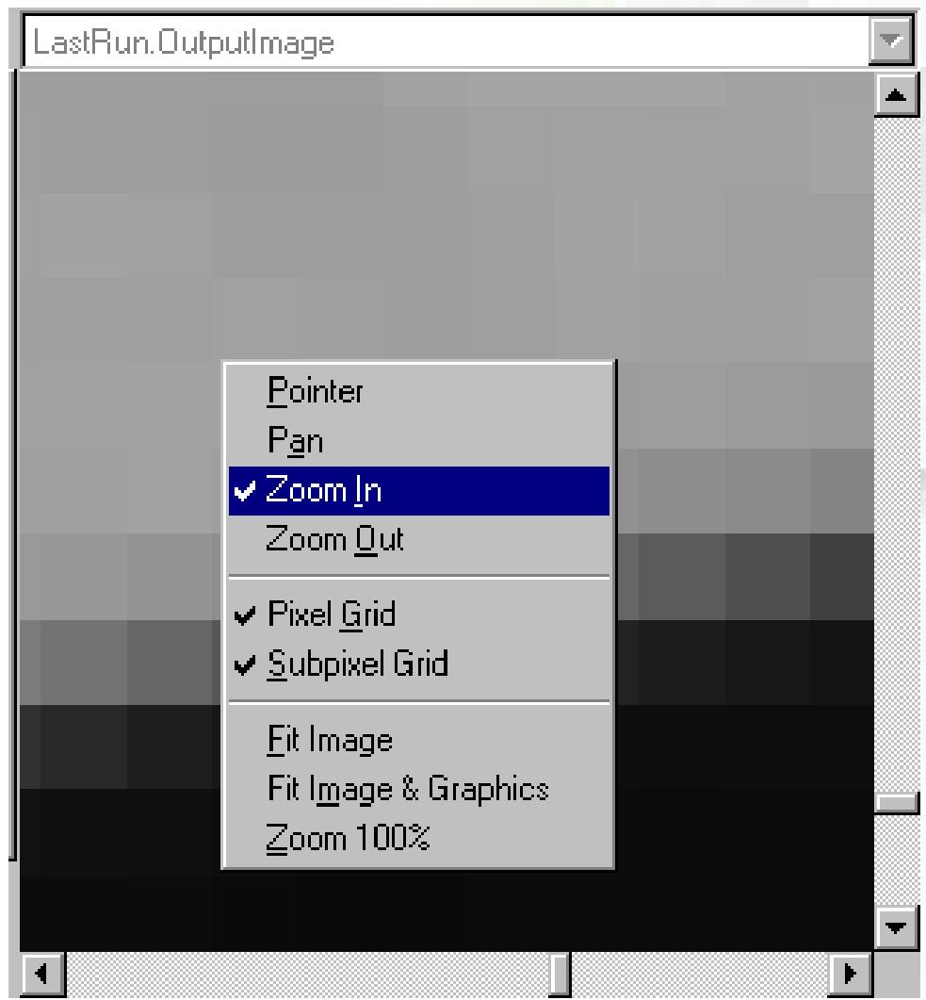

Thank you.