# 2023.6.18 日考试题目

#

1.机器视觉的四大功能为___引导、检测、测量、识别_  
2.输入___cogtool -p_ _可以在 Dos 窗口查询 Licence 信息 ：Dos 窗口就是黑色命令窗口  
3.光圈是控制镜头入光量的光学装置，光圈值越大，景深越__大___进光量越 _小  
4.视觉工具 CogFindCircleTool 作用_抓圆、获取圆、圆心坐标、半径_，CogFixtureTool 作用主要为_创建用户坐标系，产生坐标跟随_  
5.LED 二极管光源相比卤素灯/白炽灯/荧光灯优势有寿命长，发热少__体积小、亮度高、光电转化率高  
6.镜头的场畸变有桶形和 枕形畸变 _两种。  
7. 光根据波长范围分为可见光，紫外光，红外光,， 400nm~700nm 是 可见光_ _光。  
8.CCD 即是由一组矩阵式的感光元器件组成，它的功能是将光信号转换成___电信号  
9.基本码制包括一维线性条码/一维码、PDF417、 __QR-code Datamatrix _四种二．单项选择题。(每空 2 分，共 20 分)

1.在 8 位的灰度图像中，像素数值为 255 是什么颜色?( A )

A.白色B.黑色C.灰色偏白D.灰色偏黑   
2.关于 CogPMAlignTool 工具，以下说法错误的是( C )  
A. 搜索框要比模板框范围要大  
B.此工具是图案位置搜索工具  
C.不支持图像中特征的旋转与缩放  
D.可以在图像中找到训练的特征所在的位置

3.在 Gige 软件中配置相机时，相机的巨帧设置应为( B )

C.8704

D. 1024

A.9600

B.9014

4.如下图需要计算线段到圆的最短距离，选择哪个工具 ( C )

A. CoglntersectSegmentCircleTool   
B. CogDistanceSegmentCircleTool   
C. CogIntersectSegmentEillpseTool   
D. CogDistanceSegmentEllipseTool

5.CogPMAlignTool 图像训练正确顺序为( A )

A 获取图像一设置训练区域和原点一设置训练参数一训练图像一查看结果  
B，获取图像一训练图像一设置训练参数一查看结果  
c，获取图像一设置训练区域和原点一训练图像一设置训练参数一查看结果  
D，获取图像一设置训练区域和原点一训练图像一查看结果

6.以下哪种镜头的焦距不可能小于标准焦距 50mm( C )

A.定焦镜头 D，广角镜头 B，变焦镜头 C.远距镜头:焦距大于 50mm  
7.CogCaliperTool 在单个边缘模式下，不能设置的参数是( B )  
D.最大结果数 A.边缘极性 B.边缘对宽度 C.对比度闻值  
8.什么光源最适合用于物体轮廓检测?B  
A 暗场 Dark Field B.背光 Back Light C.亮场 Bright FieldD. Dome (Cloudy Day llumination/Dome)  
9.以下关于机器视觉根据不同应用选择合适工业相机，描述正确的是( B )  
A.CCD: 噪点多、图像效果较差、价格便宜   
B.CCD: 噪点少、图像效果好、价格高  
C.CMOS: 噪点少、速度快、价格便宜  
D.CMOS: 噪点多、速度快、价格高  
10.定焦镜头上光圈的作用是(A )

A.改变通光量的大小，从而获得所需亮度的视野图像  
B.清晰聚焦，达到很好的 FOV 图像效果  
C.平衡光路达到完美视野  
D.过滤光线，有偏振片的效果，使图像成像效果更佳

# 三、判断题。(每题 2 分，共 10 分)

1.标定就是通过创建一个标定对象来关联图像中的空间和物理空间。( Y )  
2.C 型相机能够匹配 CS 型镜头，但不能够匹配 CS 型镜头 $+ 5 \mathsf { m m }$ 接圈( X )  
3.在 Cognex 相机的参数上，相机标签 CAM-CIC-5000R-14-G，其中 G 代表的是黑白相机。( Y )  
4.LED 光源的优势在于绿色环保寿命长，但电光转化效率低。( X )

5，如果一个图像的效果太暗，我们可以通过调节光圈来进行设置。( Y )

# 四、简答题。(共 40 分)

1.请写出下列视觉专业名词的解释，视野/工作距离/焦距/像素/曝光时间。(10 分)  
视野：相机所能看到的现实世界的物理尺寸  
工作距离：被测物体到相机镜头的距离  
像素：图片的组成单位，芯片相对应像元产生的图片信息，对应在图片上称为像素。既相机识别到的图像上的最小单元曝光时间：光在感光器件表面使其感光的过程。电子感光器件一般称为光电转换即电子快门时间  
焦距：透镜中心到期焦点  
2 相机按照芯片材质分为哪两种? 请解释两者的原理以及对比差异。(15 分)  
CCD：电荷耦合器件，将从图像半导体中出来的电子有组织的存储起来的方法  
CMOS：互补金属氧化物半导体，可将光敏元件、放大器、A/D 转换器、存储器、数字信号处理器和计算机接口控制电路集成在一块硅片上的技术。  
3.解释 CogPMAlignTool 工具栏的选中的图标名称和功能。(15 分)

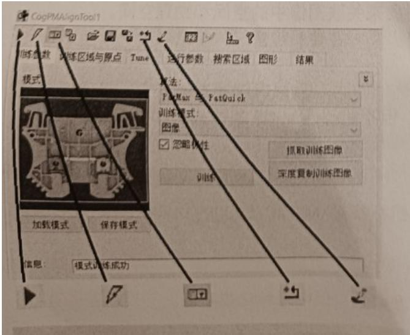

1.点击运行：运行PMAlign工具。  
2.电子模式：切换电动模式。选中后，如果某些参数已更改，则PMAlign工具将自动运行。  
3.本地显示：打开本地工具显示窗口，该窗口可以显示 Current.InputImage，Current.TrainImage 或 LastRun.InputImage 缓冲区。  
4.复位：将基础工具重置为默认状态。  
5.掩膜编辑器：打开图像掩膜编辑器以创建要添加到训练图像的模板。

# 2023.9.24 深圳 L1 部分考题

1.Cognex 相机 铭牌信息解释 eg：Cognex CIC-5000R-20-G

CAM-CIC-5000R-24-G

CIC：康耐视工业相机

5000：500W相机

R：卷帘快门相机 (G:全局快门)

24：帧率：表示24帧/秒

G：黑白相机 (C:彩色相机)

分辨率：2592*1944

通讯接口GigE

线阵相机：行频

2.简述相机常见的分类类型 并写出不同类型分类的相机分类

输出信号：模拟相机、数字相机

芯片类型：CCD相机、CMOS相机

像素排列方式：面阵相机、线阵相机

拍照颜色：黑白相机、彩色相机。

3.说明机器视觉一同有哪几部分构成，分别说明其作用

视野：被拍摄的物体

光源：使被拍摄的物体看起来处于最佳状态。(也可以把光源的3条作用写上。)

图像采集：相机拍摄照片。

信息传输：将相机拍好的图像传输到电脑

视觉工具：处理相机拍好的图像。

机试题：

机试上午L1. 第一个图

1.齿轮数量， Pmalign工具计算齿数。

2.圆到园距离。 圆到圆 DistanceCircleCircle

输出距离和半径到 outputs---这里 outputs 需要用 CogToolBlock 这个工具块来接收

第二个图，

1. 两个抓边，一个交点，两个元，一个圆心距，一个点到点连线，一个点到直线距离，一个输出

CogFindlineTool、IntersectionLineline CogCircleTool、CogFitlinetool 、DistancePointLineTool、

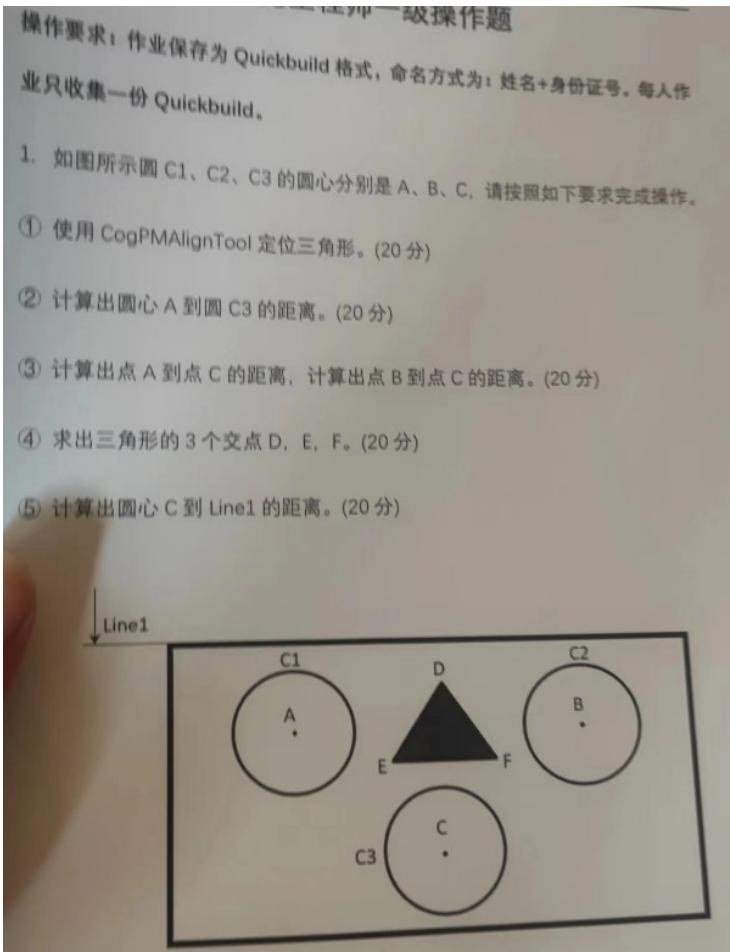

1. CogPMAlignTool 定位黑色三角形。  
2. 计算圆心 A 到圆 C3 距离：CogDistancePointCircleTool  
3. 计算点 A 到点 C 的距离，计算点 B 到点 C 的距离。CogFindCircleTool 抓圆、测距 CogDistancePointPointTool  
4. 求三角形三个交点 DE：CogFindLineTool 三个抓边，三个求交点 CogIntersectLineLineTool  
5. 计算圆心 C 到 Line1 的距离：CogFindLineTool 抓 1 个边，CogFindCircleTool 抓圆，测距 CogDistancePointLineTool

# 2021.3.20 考题

# 视觉工程师一级笔试

# 一、填空题。（每空 1.5 分，共 30 分）

1.光根据波长范围可分为___可见光__，__红外光__、紫外光_

2.相机和板卡的额定电压分别是 12 _和 12 _，相机电源线接线方式是 _棕色

正____白色_ _负，其中相机按照感光元件类型可分为 CCD _和 _CMOS_ _两种。Ps：相机：

红正黑负，棕正白负，扫码枪262是棕正蓝负，302是红正黑负

3. 分辨率是图像上单个像素所代表的实际尺寸，那么分辨率= 。 -像素分辨率

是图像上单个像素所代表的实际尺寸，像素分辨率 $\cdot$ 视野/分辨率

4. 视觉系统的五大组成部分分别是__光源、视野、图像采集、信息传输、视觉工具 c

5.名词解释

定焦镜头：_ 镜头的焦距不可以调节 。

变焦镜头： 镜头的焦距可以调节 。

广角镜头： 焦距小于标准焦距50mm的 。

远心镜头： 没有透视变形 。

二，不定向选择题。（每空 2 分，共 10 分）

1. CogCaliperTool 在单个边缘模式下，不能设置的参数是（ B ）

A、边缘极性  
B、边缘对宽度  
C、对比度阈值   
D、最大结果数  
2. 在拍摄同一物体时，以下哪种镜头可以配置 CS 型相机（ BC ）  
A、C型镜头  
B、C型镜头 $+ 5 \mathsf { m m }$ 接圈  
C、CS型镜头  
D、CS型镜头 $+ 5 \mathsf { m m }$ 接圈  
3. 什么光源最适合用于金属圆柱物体表面检测？（ D ）  
A、暗场 Dark Field  
B、背光 Back Light  
C、亮场 Bright Field  
D、Dome (Cloudy Day Illumination/Dome)

4.远心镜头的优点有（ ABC ）

A、超低畸变 B、高分辨率 C、超宽景深 D、价格便宜  
5. 以下说法错误的是（ D ）

A、光源的安装角度和方向直接决定图象的效果。  
B、机器视觉主要应用于引导、测量、检测、识别等领域。  
C、一维条码通常只能表达字母和数字，而二维条码可以对图 像、汉字等进行编码  
D、像素深度即每个像素数据的位数，一般常用的是 8Bit，对于数字工业相机一般还会有 12Bit，但是不会有 10Bit。

# 三、判断题。（每题 2 分，共 10 分）

1．红外光一般指红外线，其波长在 100nm~380nm 之间 （ N ）  
2．CCD最突出的优势是分辨率和动态范围，最弱的地方就是贵，耗电；CMOS最差的地方是分辨率，动态范围和噪声,优势就是便宜，省电 （ Y ）  
3. 工业镜头有三种接口型式，即 F 型、C 型、CS 型，C/CS 型接口一般适用于焦距大于 25mm 的镜头（N ）  
4．光圈大，则光圈值小，通光能力大，景深也大 （ N ）  
5、CogPMAlignTool工具训练图像的操作顺序是获取图像、设置训练区域和原点、设置训练参数、训练图像、查看结果 （Y ）

# 四．简答题（共50分）

1．如下图，请将读码器的7个标号与对应名词正确连线（14分）

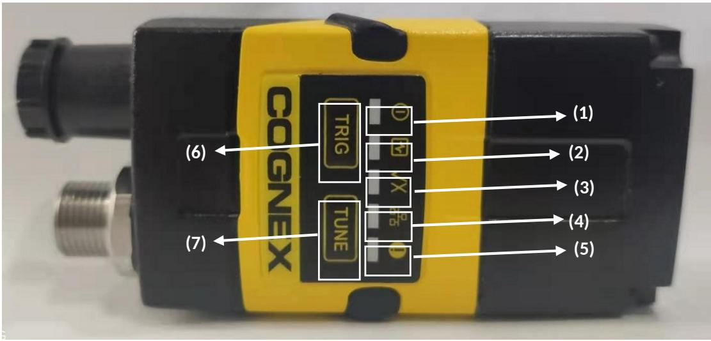

(1) （a）：训练灯  
(2) （b）：电源灯  
(3) （c）：报警灯  
(4) （d）：解码灯  
(5) （e）：网线灯  
(6) （e）：调谐键

(7) （e）：触发键

2．请说出下面光源示意图的名称、画出光源示意图并阐述它们的优点和应用场合。（16分）

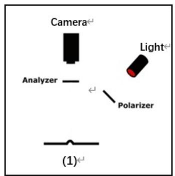

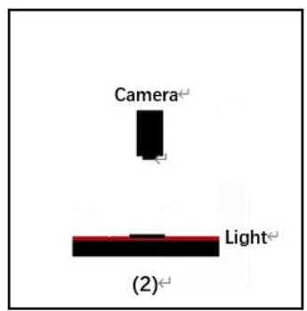

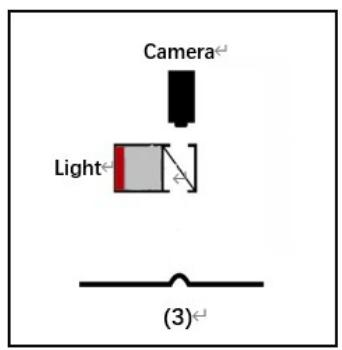

$\textcircled{1}$ 低角度光;主要用于边缘有倒角、圆角物体轮廓提取、冲压、浇筑、浮雕图案识别与检测，光滑表面划伤、裂痕检测

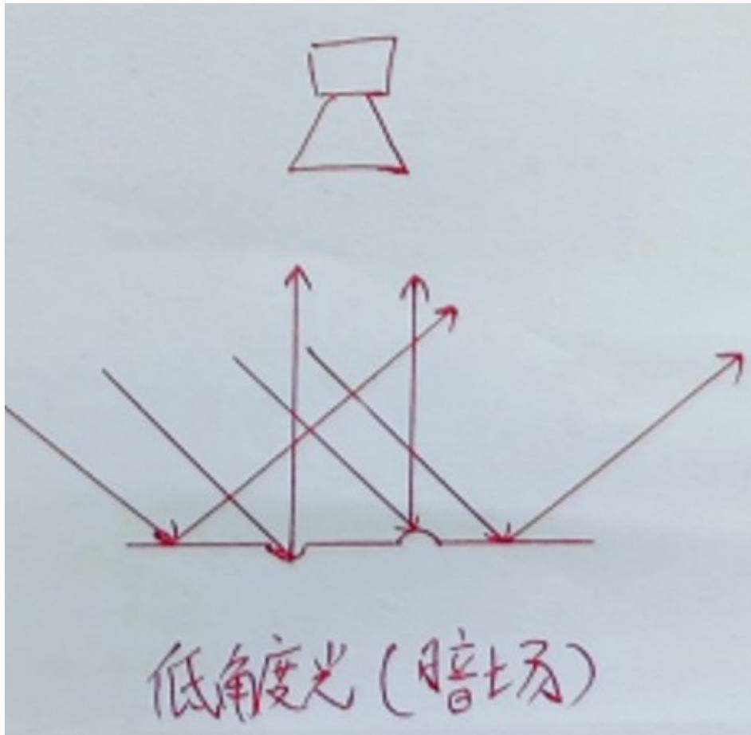

$\cdot$ 背光:1.用于轮廓和边缘检测，2.用于透明物体内不透明物体的检测

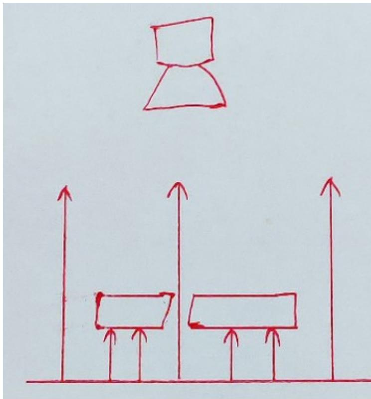

# 背光源光路图

$\cdot$ 同轴光：同轴光源能够凸显物体表面不平整，克服表面反光造成的干扰，主要用于检测物体平整光滑表面的碰伤、划伤、裂纹和异物。

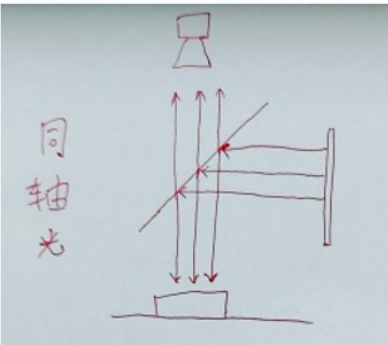

3．在同一物距、像距下，CCD芯片的尺寸和FOV的关系是怎么样的？请用文字以及画图表示出来（20分）

答：画图：

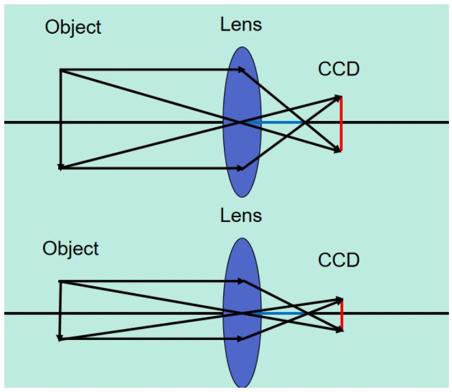

结论：同一物距，像距下：CCD越大，FOV越大,CCD越小，FOV越小

# 2023.5.23 题

# 视觉工程师一级笔试

# 二、填空题。（每空 1.5 分，共 30 分）

1. 光源可以做成各种形状，光源的 _安装角度 _和_ _安装方向 _直接决定图象的效果。  
2. 按照传感器的结构特性来分，工业相机可分为面阵相机和线阵相机两种，两种相机在采集图像的速率上会有所区别，面阵相机一般为每秒采集的__次数____，线阵相机为每秒采集的__行数____；工业相机按照感光元件类型可分为CCD和CMOS两种，其中价格比较贵的是 _CCD _芯片，我们常用的CAM-CIC-5000R-14-G 用的是 CMOS 芯片，它的分辨率是 _2592*1944 _。

3、下图是CogCaliperTool工具的应用 ，其中搜索框的空心箭头代表卡尺的 _投影方向_ ____，实心箭头代表卡尺的__搜索方向_ ___；在单个边缘模式下，CogCaliperTool的工作极性有___由明到暗、由暗到明、任意极性__。

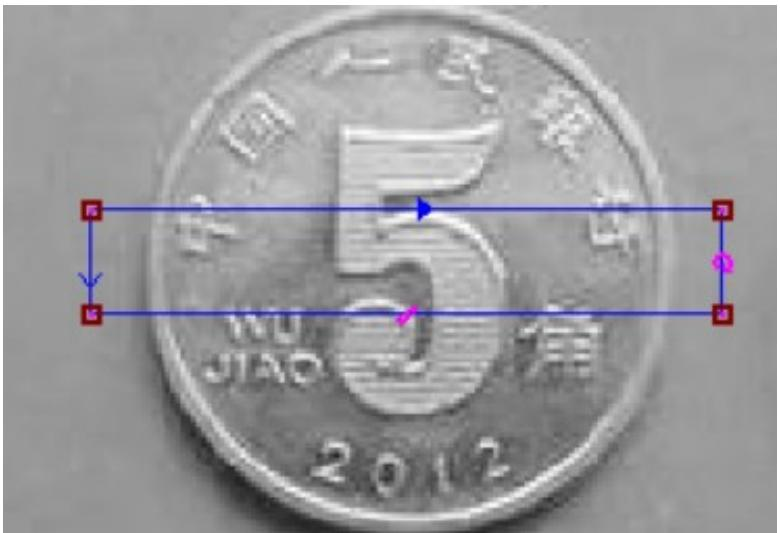

4、CogPMAlignTool图像训练的操作步骤有_获取图像、设置训练区域和原点、设置训练参数、训练图像、查看结果_ _。

5、解释以下参数的意义：

Pitch：_ _标定片的尺寸 有0.25mm、0.5mm、1mm、2mm C

Static pose：___ 标定时相机固定不动，机械手带着标定板移动 _。

Moving Camera：__ 标定时标定板固定不动，机械手带着相机移动 。

Passthrough： 标定时相机固定不动，机械手移动 。

# 二，不定向选择题。（每空 2 分，共 10 分）

1. 在工业镜头中，当物镜的焦距约小于（ C ）时，因物镜的尺寸不大，便采用C型或CS型接口。

A、5mm B、10mm C、25mm D、50mm

2、以下哪种镜头的焦距不可能小于标准焦距 50mm（ C ）

A、定焦镜头 B、变焦镜头 C、远距镜头 D、广角镜头

3、在下图白色背景中，仅需检测圈中的蓝色字符，请问使用什么光源？（ A ）

A、红光 B、绿光 C、蓝光 D、红外光

4、使用Gige配置相机包含以下哪些步骤？（ ABC ）

A、修改相机和电脑本地 IP  
B、设置巨帧包9014   
C、勾选 ebus   
D、打开防火墙

5、以下哪些光波波长的光属于紫外光（ABCD ）

A、50nm B、100nm C、200nm D、300nm

# 三、判断题。（每题 2 分，共 10 分）

1．视觉软件 【AlignVisSystem】系统包括“在线”与“离线”两种运行模式，在“Run”弹出菜单中选择 “ 在 线 ” （ Online ） 开 启 TCP Server 服 务 ， 选 择 “ 离 线 ” （ Offline ） 则 关 闭 TCP Server 服 务（ Y ）  
2 广角镜头是焦距大于标准焦距50mm的镜头 （ N ）  
3． C型相机能够匹配CS型镜头，但不能够匹配CS型镜头 $+ 5 \mathsf { m m }$ 接圈 （ N ）  
4． 定光圈镜头的光圈不可以调节，通常情况下聚焦也不能调节 （ Y ）  
5． LED二极管光源相比卤素灯/白炽灯/荧光灯优势有寿命长、亮度高、能耗低、价格高、适合长期照明的优缺点 （ N ）

# 四．简答题（共50分）

1．请写出下列视觉专业名词的中文并解释，Pixel/ Pixel Depth/ Resolution/ Depth of Focus（DOF）/

Focus。（15 分）

Pixel：像素/像元：感光器件上的基本感光单元，既相机识别到的图像上的最小单元

Pixel Depth：像素深度：即每个像素数据的位数，一般常用的是8Bit，对于数字工业相机机一般还会有

10Bit、12Bit 等

Resolution：分辨率：相机采集图像的像素点数

Depth of Focus（DOF）:景深-被测物体清晰成像的最上表面与最下表面之间的距离

Focus：焦距--透镜中心到其焦点的距离

2．请参考以下条码，将条码的 5 个区域与对应名词正确连线？（15 分）

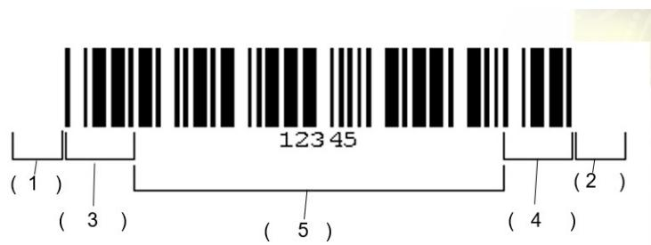

(1) （a）：静区  
(2) （b）：起始符  
(3) （c）：静区  
(4) （d）：数据符

(5) （e）：终止符

(b)：起始符  
(3) （c）静区   
4 （d)：数据符

(e)：终止符

3．在同一物距下，CCD 芯片的尺寸不变，像距和 FOV 的关系是怎么样的？请用文字以及画图表示出来（20 分）

答：

画图：

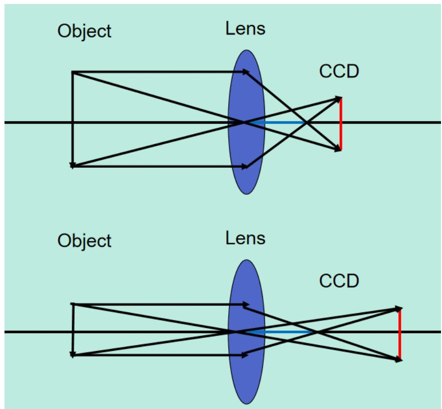

结论：同一物距，CCD尺寸不变：像距越大，FOV越小；像距越小，FOV越大。

1．请使用 L1 Image1 图片，按照如下要求完成如下操作。（100 分）

$\textcircled{1}$ 抓取工件的边缘 Line1、Line2。（25 分）  
$\textcircled{2}$ 通过模板匹配抓取中心 O 点。（25 分）  
$\textcircled{3}$ 抓取 Line1 与 Line2 的交点 P。（25 分）  
$\textcircled{4}$ 计算 O 点到 Line1 的距离。（25 分）

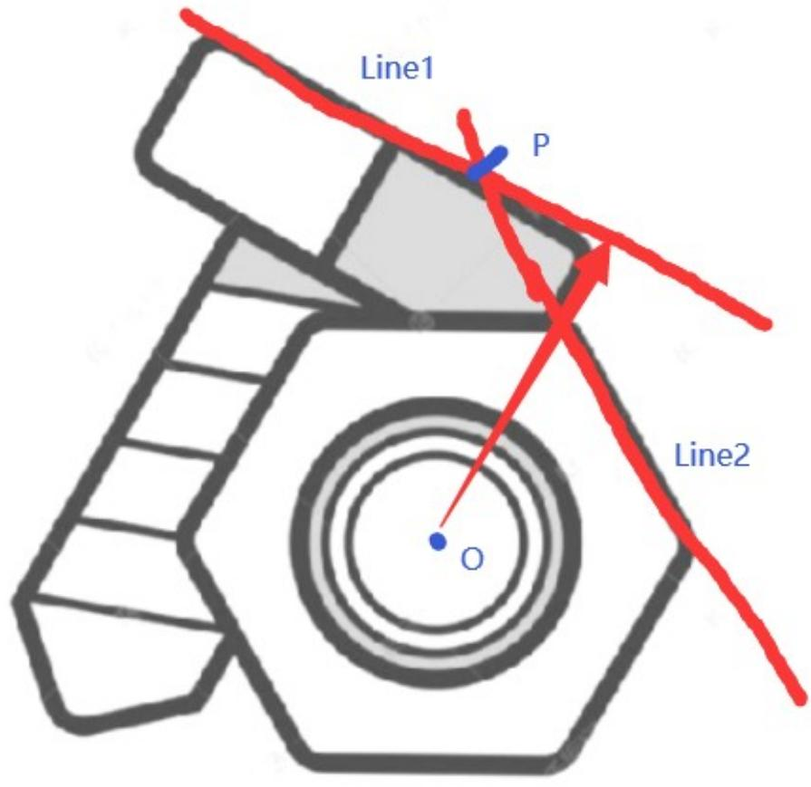

2021

# 视觉基础试题

# 一、填空题。（每空1分，共20分）

1、在工业相机的使用中，选择远心镜头的优势主要是__超高分辨率_、__超宽景深__、_低畸变_ _。  
2、光是一种电磁波，可见光的范围是 __380nm_到___700nm_。  
3、改变图像采集明暗度的方式有__调节光圈_ _调节曝光___、_换高亮度光源__、__换大像元相机__。  
4、名词解释   
5、帧率_相机一秒可以采集多少图像，通常表示相机采集单张图片的速度。  
6、 曝光时间__感光芯片的感光时间_。

7、像素深度 每个像素数据的位数，通常8bit。  
8、PPM 值 单个模块上的像素数。  
9、在 Patmax 中建模板的三大要素是：_特征唯一_、 _对比度明显__、_形状轮廓明显 _。  
10、请列举 Caliper Tool 的工作极性方法是_ _由明到暗__、_由暗到明__、 _任何极性 。  
11、在PMAlignTool中颗粒度决定了____用多少边缘点来表示图像中的特征。

# 二、不定项选择题（每空 2 分，共 10 分）

1. 以下选项中会影响景深的因素是( ABD )

A 镜头焦距和像元尺寸

B 光圈值大小

C 视野明暗度

D 接圈和扩倍器

2. 以下什么不是 DataMatrix 代码的特性（ BC ）

A、静区（Quiet Zone）

B、启始符/终止符

C、校验符

D、计时特征（Timing Pattern）

3. 在 Cognex 相机的参数上，相机标签 CAM-CIC-5000R-14-G,其中 R 代表的是什么意思？（ C ）

A、带返回值参数的相机

B、高转速相机

C、卷帘快门相机

D、全局快门相机

4. 具有较强对比度的标签和标记的最佳光源选择是（ B ）

A、漫射暗场照明

B、漫射亮场照明

C、红外光源

D、背景光源

5. 一幅高质量的图像需包含以下哪些因素（ ACE ）

A、大信噪比

B、大光圈 C、高对比度

D、高曝光

E、低噪音

# 三、判断题。（每题 2 分，共 14 分）

1、CS型镜头加5mm接圈匹配C型相机 （ N ）

2、景深是指在焦距固定，图像清晰时，被测物体离相机的前后变化距离，它受镜头上光圈的影响，光圈大景深大。（ N ）

3、一般短焦距镜头的畸变比长焦距镜头畸变更大。 （ Y ）

4、颗粒度的基本单位是Pixel。 （ Y ）

5、 学习过后的码在界面显示 train code （ N ）

6、液态镜头读码器无需手动调节镜头实现高速变焦 （ Y ）

7、2机台软件连接条码枪时，软件中 IP地址与应条码枪设置参数中的 IP地址完全一致，条码枪与电脑连接时，IP地址应在同一网段 （ Y ）

# 四．简答题（四题，共 41 分）

光圈值越大，光圈越小，要求：画出如上图的相关对照，并明确标注大光圈，小光圈

# 2.写出卡尺工具中箭头表示意思（16 分）

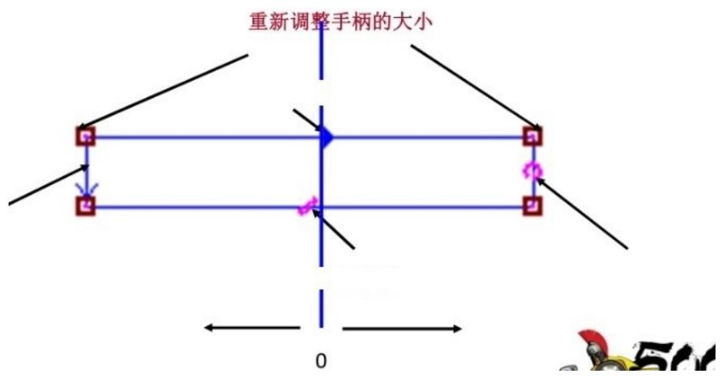

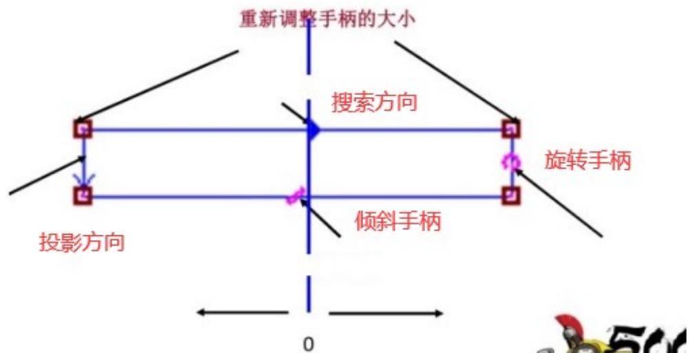

1

3. 对如下物品进行外观轮廓检查，推荐一套最佳的打光方案，并画出基本的光路原理图。（15分）

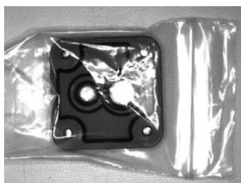

背光源 10 分

低角度光源 5分

带偏振低角度光 6分

Dome 光 0 分

同轴光 0分

用背光源：

  
背光源 光路图

优点：1.用于轮廓和边缘检测，2.用于透明物体内不透明物体的检测

# 五、计算题（15 分）

一.500w 相机，FOV 为 $2 4 ^ { \star } 1 8 \mathsf { m m }$ ，二维码为 $6 ^ { \star } 6 \mathsf { m m }$ ，16*16Code 码密度？PPM？

（以下的计算步骤大致理解就行，正常这种关于码密度和PPM的计算题在L3才会考，L1的等级考核大纲里是没有这个内容的）

码密度：表示二维码里单个模块的尺寸，单位密尔mil。

$$
6 / 1 6 * \frac {1 0 0 0}{2 5} = 1 5 \quad (\mathrm {m i l} / \mathrm {m o d u l e})
$$

6/16=0.375mm，每个模块的尺寸，此时单位是 mm，应该换算为 mil 才是码密度。

$$
1 \mathrm {m i l} = 0. 0 2 5 4 \mathrm {m m},
$$

6/16*0.0254=====或者是 6/16*1000= $6 / 1 6 ^ { \star } \frac { 1 0 0 0 } { 2 5 . 4 }$ (mil/module)

# PPM：表示二维码里单个模块里有多少个像素。

6/16=0.375mm，每个模块的尺寸。

分辨率为 2592*1944.视野为 24*18mm

2592/24=每毫米对应的像素数，再 $^ { \star } 0 . 3 7 5$ 就是0.375mm内(即一个模块)对应了多少个像素数。

# 2021.9.19 部分考试题

1.LED 灯的优势

光电转化率高、绿色环保、寿命长、工作电压低、体积小、

发热少、亮度高、光束集中稳定、色彩多样、易于调光、启动无延时

2.光源的作用

凸显出缺陷和背景的差异，提高图像对比度

形成最有利于图像处理的成像效果

照明目标，提高目标亮度，克服环境光干扰，保证图像的稳定性

3.CCD 和 CMOS 的优劣势

两种芯片都是利用感光二极管进行光电转换

CCD优势：感光度高、图像锐利度高、分辨率高、噪声低

CMOS优势：价格便宜、功耗低、片上集成化、速度快

4. PMAlign工具几个图标的意思

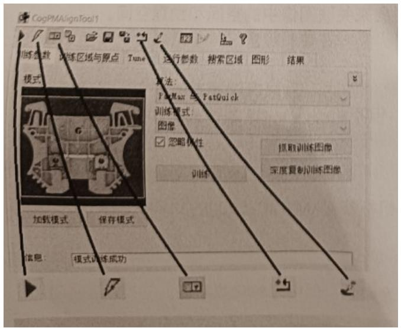

1.点击运行：运行PMAlign工具。  
2.电子模式：切换电动模式。选中后，如果某些参数已更改，则 PMAlign 工具将自动运行。  
3.本地显示：打开本地工具显示窗口，该窗口可以显示 Current.InputImage，Current.TrainImage 或 LastRun.InputImage 缓冲区。  
4.复位：将基础工具重置为默认状态。  
5.掩膜编辑器：打开图像掩膜编辑器以创建要添加到训练图像的模板。  
5.低角度光和高角度光的作用

高角度光：主要用于表面粗糙程度不同区域的区分、边缘或内部有垂直断差或者比较陡峭（超过60度）边

缘检测或测量

低角度光：主要用于边缘有倒角、圆角物体轮廓提取、冲压、浇筑、浮雕图案识别与检测，光滑表面划伤、裂痕检测

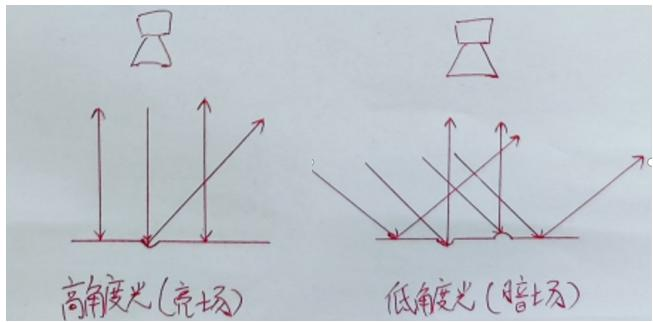

# 6.相机配置步骤

网线连接好相机和板卡的网口

打开GIGE软件，关闭防火墙 勾选eBus 更改巨帧数据包为9014

将相机IP和电脑端的IP地址改为前三段一致，第四段不一致，获取子网掩码

打开visionpro初始化相机确认相机是否配置成功能够取像