# 目录

一、Vision Basic.. 2  
二、VisionPro Tools..

1. Image Source：  
2.CogAcqFifo：...........   
3.CogImageFileTool.......... ....... 7   
4.1.CogCalibCheckerboardTool：  
4.2.CogCalibNPointToNPointTool：........ 8   
5.CogPMAlignTool：........... . 8   
6.1.Caliper：. 8  
6.2.Find/Fitline：............ 8

$\textcircled{1}$ 拟合工具操作步骤： .8  
$\textcircled{2}$ CogFindLineTool： 8  
$\textcircled{3}$ CogFindCircleTool： 9

7.CogCreation：..................... ........ 9   
8.1Measurement： 9  
8.2IntersectionTool： 9  
9.CogResultsAnalysisTool&DataAnalysis：........ ...... 9  
10.CogHistogramTool：........... 9   
11.CogBlobTool： . 10

三、DataMan.. . 11

1.2.3.4.5.参考 DataMan 资料.. . 11  
1.IP 设定.. . 11   
2.打光方式介绍.. . 11  
3.数据格式、读码类型介绍.. 11  
5.触发模式的介绍(Singal,Burst,Continue 等模式的使用场景)... 11  
6.PPM 值的介绍.. .11   
7.DataMatrix 码的介绍(Verify 相关标准)... .11  
8.精度计算.. . 12   
9.PPM 计算.. .13

四、Fixture debug.. 14

1.Inspection：.................... ........ 14   
2.标定：............ ..... 14

五、曾考内容.. 16

1.机试： .. 16   
2.曾考内容... . 16

$\textcircled{1}$ 基础大题： .. 16

2022.9.18L2 考试内容： .. 16

笔试： .. 16   
机试： . 18

# 一、Vision Basic

1.机器视觉的概念？

运用数字图像处理技术，处理数字图像，并应用于工业生产任务。

2.机器视觉的四大应用分别是？其中 GIGI 的两个 G 是？

引导、检测、测量、识别、 引导 测量

3.机器视觉的五大构成部分是？

视野、光源、图像采集、信息传输、视觉工具

视觉工具：用来评价照片

4.标定工具的作用？

标定工具作用：建立图像和机构的关联关系。

4.1相机的工作原理：通过传感芯片将光信号转换成电信号，进而转换成数字信号传输给计算机。

5.视野（FOV)：相机所能看到的现实世界的物理尺寸

工作距离（WD）：被测物到相机镜头的距离

焦距（Focus）：透镜中心到其焦点的距离。

感光器尺寸（CCD/CMOS Size）：感光片成像区域的尺寸（通常由感光片长边决定）

景深（DOF）:被测物体清晰成像的最上表面与最下表面之间的距离

放大倍率（MPAG）：感光器尺寸与FOV之间的比值

曝光时间:光在感光器件表面使其感光的过程，电子感光器件一般称为光电转换即电子快门时间

像素（Pixel)-像元:感光器件上的基本感光单元，既相机识别到的图像上的最小单元

像素深度(Pixel Depth):即每个像素数据的位数，一般常用的是8Bit，对于数字工业相机机一般还会有10Bit、12Bit等

分辨率（Resolution):相机采集图像的像素点数

像素分辨率（mm/pixel):每个像素代表的毫米值

6.像素分辨率=FOV/分辨率 eg：分辨率为 1600x1200pixel 视野为 64x48mm 像素分辨率 $= 6 4 / 1 6 0 0 { = } 0 . 0 4 \mathrm { m m }$

7.镜头最大兼容CCD尺寸≥相机芯片尺寸.

8.黑白相机的像素深度为_8__bit.灰度等级是_256_,即 0-_255__256 个等级，黑色为__0__,白色为_255__。

9.图像传感器是由行列组成的 矩阵式亮度感应元器件 _组成。

10.相机按照拍照颜色可分为：黑白相机、彩色相机。按照像素排列方式可分为：面阵相机、线阵相机

11.相机按照芯片类型可分为_CCD _相机和_ __CMOS 相机.二者的工作原理都是 都是利用感光二极管进行光电转换。 _。

12.工业首选的芯片类型是__CMOS___，这两种芯片的各自优势分别是：____，二者的材质分别是_

CMOS的优势：片上集成化、功耗低、价格便宜、速度快。

CCD的优势：图像锐利度高、感光度高、分辨率高、噪点少

二者的工作原理：都是利用感光二极管进行光电转换

CCD：电耦合器件光电传感器

CMOS：互补性金属氧化物半导体，

13.两种快门方式是：全局快门、滚动快门、

14.相机常用接口有：CameraLink、Gige、Usb(2.0 3.0 3.1)、1394(a b)：Gige 是康耐视相机在用的接口，CameraLink 传输

速度最快 255-680MB/s Gige：100MB/s

15.镜头就是实现__光束变换____的。

16.镜头的两个组成部分为：__光圈___,___对焦环_

17.镜头越厚，焦距越__小__.

18.影响视野大小的四个因素分别是？分别对视野有什么影响？以及第一幅图画图。

工作距离、镜头焦距、成像面大小、像距

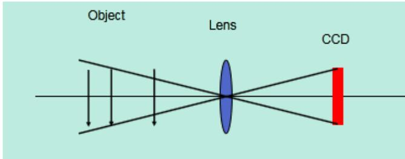  
在同一镜头下：  
WD越大，FOV越大。WD越小，FOV越小

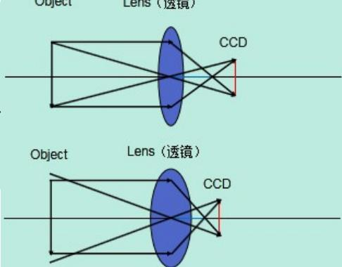

# FOV 与CCD的关系

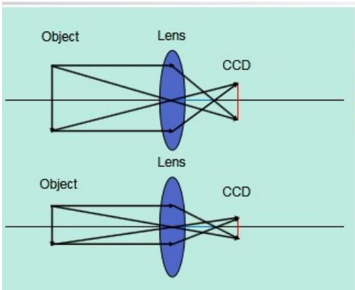

# FOV与像距的关系

#

同一物距，像距下： CCD越大，FOV越大 CCD越小，FOV越小。

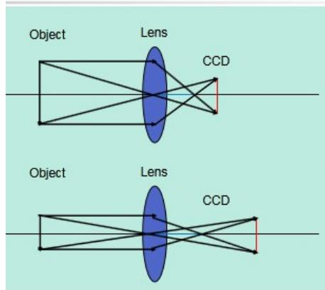

#

同一物距下：焦距越小，FOV越大焦距越大，FOV越小

#

同一物距，CCD尺寸不高变：

像距越大，FOV越小；

像距越小，FOV越大。

光圈：是一个用来控制光线透过镜头，进入机身内感光面的光量的装置，它通常是在镜头内。常见的光圈值有f1，f1.4，f2，f2.8，f4，f5.6，f8，f11，f16，f22

例如光圈从f8调整到f5.6，进光量便多一倍，我们也说光圈开大了一级。

19.光圈越大，光圈值越__小__。

# 20.光圈和光圈值的关系?画图+结论解释

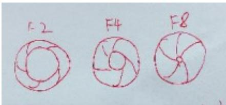

光圈越大，光圈值小，通光量越大，图片越亮光圈越小，光圈值大，通光量越小，图片越暗

21.影响景深的因素：焦距越_短__，景深越大；光圈越__小_，景深越大；工作距离越_远_，景深越大；相机芯片像元越__大_，景深越大；增加接圈或者扩倍器会使景深变_小___.  
22.改变图像采集亮度的四个方式：

调整光源亮度、调整光圈值、调整曝光时间、更换大像元相机

23.C型镜头匹配_C_型相机，CS型镜头匹配_CS_型相机；C型镜头 $+ 5 \mathsf { m m }$ 接圈匹配_CS_型相机；CS型镜头___不匹配_C 型相机.   
24.远心镜头的放大倍率可不可以调节？其优势是什么？，放大倍率=_CCD __FOV_

不可以调节。超低畸变、高分辨率、超宽景深

25.可见光的波长范围是：__380nm___到__780nm_ _.白光包含所有波长的光线  
26.紫外光（UV）：常用于检测UV胶  
27.有光线进入到相机里边，即为_亮__,没有光线进入到相机即为__暗__.  
28.光源按照形状分类可分为： 。

点光、条光、面光、环光、同轴光、非同轴漫射光(也叫Dome光)

29.光源的作用？

$\textcircled{1}$ 凸显出缺陷和背景的差异，提高图像对比度  
$\cdot$ 形成最有利于图像处理的成像效果  
$\textcircled{3}$ 照明目标，提高目标亮度，克服环境光干扰，保证图像的稳定性

30.判断图片质量的三大原则：

对比度好、均匀性好、色彩还原性好、

31.LED 光源的优势？(5 个以上)。

光电转化率高、绿色环保、寿命长、工作电压低、体积小、发热少、亮度高、光束集中稳定、色彩多样、易于调光、启动无延时

32.光源的__安装角度 _和 安装方向 直接决定图像成像效果。  
33.图片上的眩光可以通过在光源上加_偏振片__或者改用__偏振___光源来消除。  
34.同轴光含有 _50%的镀银镜   
35.同轴光、背光、非同轴漫射光、高角度光（亮场），低角度光（暗场）：

适用同轴光打光的场景：同轴光源能够凸显物体表面不平整，克服表面

反光造成的干扰，主要用于检测物体平整光滑

表面的碰伤、划伤、裂纹和异物。

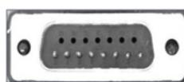

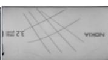

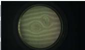

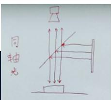

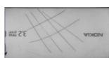

这张图 可用 同轴光或者高角度光

对透明玻璃上的划痕检测： 用同轴光

适用背光源的应用场景：

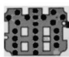

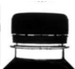

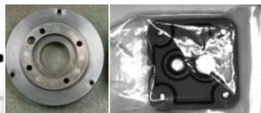

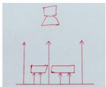

用于轮廓和边缘检测，用于透明物体内不透明物体的检测

适用非同轴漫射光(Dome 光)打光的应用场景：

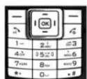

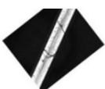

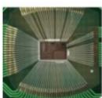

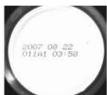

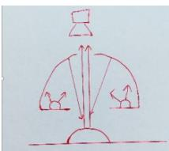

可以避免因弯曲表面导致的打光不均匀。

适合于曲面，表面凹凸，弧形表面检测金属、玻璃表面反光较强的物体表面检测

适用高角度光（亮场）打光的应用场景：

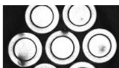

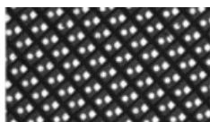

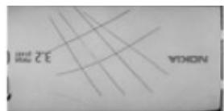

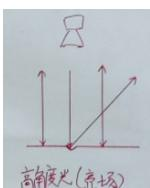

高角度光的优劣势：

# 适用低角度光（暗场）打光的应用场景：

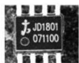

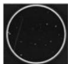

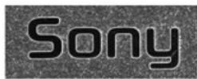

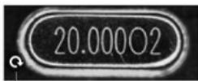

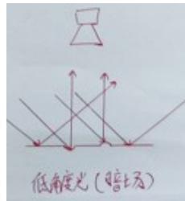

低角度光的优劣势：

优势：对于边缘有倒角、圆角物体轮廓提取、冲压、浇筑、浮雕图案识别与检测，光滑表面划伤、裂痕检测效果比较理想。

缺点：对于透明物体表面的划痕检测效果不理想。

36.彩色光源的三基色是：RGB red green blue

打物体颜色的相近色，使物体变亮。打物体颜色的互补色，使物体变暗。

37.一个白色瓶子，上面有红色和蓝色的字体，需要对蓝色的字体检测，此时选用__红色__颜色光来进行打光。  
38.红外光：特点：穿透力强用途：消除色差场合、需穿透采图场合  
39.紫外光：波长范围：10nm~380nm用途：常用于检测UV胶、金属表面划痕、部分农产品腐败等  
40.常见的基本码制有__一维线性条码__.__DataMatrix QR-Code PDF417  
41.DPM是： 直接元件标识 工艺  
42.一维线性条码的组成：静区、起始符、数据符、终止符、静区  
43.矩阵式二维码的组成：静区、L型寻边区、计时图案、模块/单元、数据区   
44.PPM:每个模块上的像素个数（Pixels per Module）  
45.Read：正确解码、No-Read：数据没有被提取，多个原因: 时间不够, 没有把握  
Misread: 确信的解码，但是数据错误，一般宁可不解也不错解  
46.一维码和二维码的不同点和共同点是：  
共同点： 都有 静区  
5个不同点：  
一维码是水平方向，二维码是水平竖直方向  
维码存储数据少，二维码存储数据多  
一维码体积大，二维码体积小  
一维码破损不能读取，二维码破损能够读取  
一维码只能表达字母数字符号等、二维码在此基础上可以表达8位二进制数据，可表达图像汉字等。  
47.读码过程：泛泛寻找码 $\cdot$ 精细化提取位置 $\cdot$ 提取数据（根据灰度级提取信号） 解码  
48. CAM-CIC-5000R-24-G:其中 5000 代表__500W 相机_，R 代表__卷帘快门___，24 代表__24 帧/秒___,G 代表__黑白相机_  
49.厂区进入车间要求__无铁 _管控。  
50.镜头的畸变类型：__ 枕形畸变 _,_桶形畸变   
51.镜头的场畸变类型：径向畸变，切向畸变   
52.相机按照像素排列方式分为 _线阵相机 、 面阵相机 。  
53.8704E 卡采用 4-Pin 电源连接器连接 12 V 电源。  
55.影响成像质量的因素包括：视野大小、镜头焦距、镜头光圈、光源的类型、光源的安装位置、曝光时间、物距、成像器类型  
56.成像质量：受 视野大小、镜头焦距、镜头光圈、光源的类型、光源的安装位置、曝光时间、物距、CCD 成像器类型、工作距离、景深等的影响。

$\textcircled{1}$ 镜头类型：

广角镜头：焦距小于标准焦距50mm的。例如：16mm

景深大，聚焦距离更近

远距照像镜头：焦距大于标准焦距 50mm 的。例如：75mm

景深浅，放大远距离物体

变焦镜头：镜头焦距可调节，焦距有范围，例如：35-70mm

定焦镜头：镜头焦距不可调节。例如：25mm

远心镜头：没有透视形变 即普通镜头导致的近大远小现象

畸变类型：包括径向畸变和切向畸变

径向畸变：桶形畸变，枕形畸变

切向畸变：镜头不完全平行于相机传感器产生的畸变

远心镜头：

优势：超低畸变、高分辨率、 超宽景深

放大倍率：CCD/FOV=倍率

普通镜头和远心镜头：

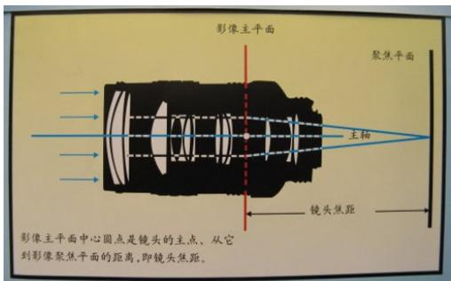

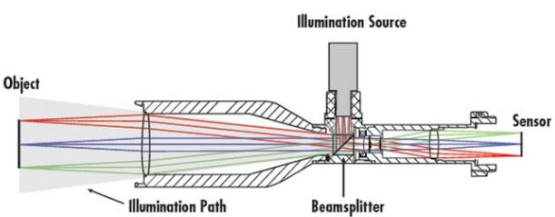

# 二、VisionPro Tools

# 1. Image Source：

采图方式：加载文件、加载文件夹、相机取像

支持的图像格式：.idb 、.cdb、.bmp、.tif、.jpg、.png

# 2.CogAcqFifo：配置相机取像

$\cdot$ 选择相机型号 $\textcircled{2}$ 选择相机格式(Mono、Mono12、Mono12Packed、YUV422Packed) $\textcircled{3}$ 修改曝光、对比度、亮度、超时期(这几项一般都为默认) $\textcircled{4}$ 触发方式：Manual(手动触发) 、Free Run(自由触发)、Hardware Auto(硬件触发-飞拍项目)、Hardware Semi-Auto(硬件半自动触发)

Hardware Auto：根据电压变化，需设置极性，由低到高或者由高到低去触发，此极性需和光源触发极性一致。

Hardware Semi-Auto：需要机构和视觉各自发送一个触发信号，先硬触发信号，再相机触发信号，

# 3.CogImageFileTool：从 idb 格式文件中读取图片(读取模式) 或者 添加图片(写入模式)

# 操作步骤：

读取模式：不需要输入图像，在工具中选择"打开ImageFile"按钮选择idb格式图片文件点击运行预览，并可以当做图像源给别的工具提供图像。

# 写入模式：

$\textcircled{1}$ 连接图像后 在工具中选择"打开 ImageFile"按钮，点开录制模式后点击工具外层的运行，

会将外部连接的图像录制进打开的idb格式的文件中

$\cdot$ 连接图像后 在工具中选择"创建新的 ImageFile"按钮 在需要的路径里创建一个新的 idb 格式文件，

点击工具外层的运行，开始在新创建的idb格式文件中添加图片

# 4.1.CogCalibCheckerboardTool：通过创建一个标定对象来关联图像中的空间和物理空间

作用：校正图形畸变 建立实际坐标与图像坐标的对应关系 直白点： 建立图像和机构的关联关系用棋盘格标定：

棋盘格标定是使用一个棋盘格来计算像素和真实单位之间的转换

可以计算线性或者非线性转换： 非线性转换用于说明光学 和/或 透视扭曲的情况

图像扭曲的产生及分类：

产生：是由于透镜制造精度以及组装工艺的偏差从而导致原始图像失真的现象

分类：线性扭曲：纵向失真(横向压缩) 横向失真(纵向压缩)

非线性扭曲：桶形畸变 枕形畸变

标定流程图：采集表定图像 棋盘格物理尺寸 标定工具计算标定结果(仅限非线性模式)

棋盘格标定原点获取：校准板有一个原点(比如两个交叉矩形的右下交点)

若没有：没有二维码的 原点则是图像左上角

有二维码的原点则是二维码

# 操作流程：

$\textcircled{1}$ 获取标定片图像：保证曝光合适 焦距清楚 标定片尽量布满视野 标定片不要翘曲  
$\textcircled{2}$ 添加标定工具：CogCalibCheckerBoardTool 工具 连接图像  
$\textcircled{3}$ 设置线性或非线性模式 输入标定片XY尺寸 $( 0 . 2 5 0 . 5 1 2 \mathrm { { m m } ) }$ 点抓取校正图像 按钮  
$\textcircled{4}$ 修改校正原点(可选项)：可以选择修改校准空间的原点，设置原点空间，X 轴旋转，X 轴旋转空间，交换左右手使用习惯

$\textcircled{5}$ 计算标定结果： 点击计算校正按钮，查看非扭曲的校正图像  
$\textcircled{6}$ 查看标定结果：查看磁块各个角的结果 未校正的 XY 和原始的已校正的 XY 坐标的差异

查看计算的非线性方程的系数：

纵横比：校正前后 XY 方向的纵横比 越接近 1 越好

RMS误差：越接近0越好 这个是像素坐标和标定片坐标差值的方

CheckerBoard 标定的工作原理：采集图像中的顶点-黑白相间的交点

原始校正空间中的顶点，基于所提供的的磁块尺寸信息 比较两组点

将标定结果输出：表示两个图像中一旦计算出转换，只要将校准的输出图像传递给检验工具的输入图像

校正的图像将被传递给该工具

# 4.2.CogCalibNPointToNPointTool：不能校正非线性畸变

操作步骤：连接图像 输入三组像素坐标和三组物理坐标 抓取计算校正

结果：XY 平移 缩放 纵横比 旋转 倾斜 RMS 误差(等同 checkboard)

# 5.CogPMAlignTool：图案位置搜索工具 可在图像中找到你训练的特征所在的位置

等信息

基于边缘特征的模板而不是基于像素的模板匹配，比像素格栅表现更快捷准确支持旋转和缩放

三种主要算法：PatMax（精度最高）, PatQuick（速度最快）, PatFlex（细节最佳）

建立模版的三大要素：位置、尺寸、角度

在匹配特征过程中:黄色表示粗糙特征，绿色表示精细特征

在使用模板工具进行模板建立的时候要注意遵循的三项原则 ：特征唯一、对比度明显、形状轮廓明显。

# 操作步骤：

$\cdot$ 输入图像 $\cdot$ 点击抓取图像，选择训练模式(建模掩膜)，选择合适的算法(patmax patquick)  
$\cdot$ 切换到当前训练图像，调整训练区域位置及形状，调整训练中心原点

$\textcircled{4}$ 在运行参数选择合适的查找概数(结果数)、接受阈值(允许结果的最低相似度)、是否考虑杂斑、角度及尺寸的缩放  
$\textcircled{5}$ 点击训练，运行查看结果

掩膜：分为将不需要的特征掩盖掉，或者将整幅图像掩掉，将需要的特征露出来。

建模：可以自动提取需要的特征或者手动添加具体的特征，需要设置极性 。

# 6.1.Caliper：能够辨别图像中的边线和边线对子 报告边线对子中的边线位置和边线之间的距离

工作极性方法是： 由暗到明 ，由明到暗 ，任意极性 。

两个工作模式：单个边缘、边缘对

Caliper 工具中： 代表卡尺的 搜索 方向 代表卡尺的 _投影 方向，在抓边过

程中， 投影 方向要与查找的边缘平行。

操作步骤： $\cdot$ 连接图像 $\textcircled{2}$ 定义目标区域(扫描方向与查找方向垂直，投影方向与查找方向平行)

$\cdot$ 设置基本参数 选择建立计分标准 测试评价结果

其中实心箭头是搜索方向空心箭头是投影方向

参数设置：边缘模式 极性 对比度阈值 过滤一半像素(设置为过渡像素个数的一半) 最大结果数 边缘对宽度(边缘对模式才有 会影响得分)

输出结果：分数 edge0(结果数的索引) 位置(抓的结果离卡尺中心的距离) xY 计分函数 对比度

应用：工具测量元件宽度 测量元件之间的距离

# 6.2.Find/Fitline：需掌握包含抓圆、抓拐角点、抓椭圆、抓边、拟合圆、拟合椭圆、拟合线工具。

$\textcircled{1}$ 拟合工具操作步骤：连接图像后输入需要的若干组坐标(两点拟合线、三点拟合圆、五点拟合椭圆)  
$\textcircled{2}$ CogFindLineTool：

# 使用和常见参数介绍：

是在图像指定区域运行一系列Caliper工具以定位多个边缘点，然后运行底层的FitLine工具将他们拟合成直线。相当于Caliper工具 $^ +$ FitLine 工具

要求输入图像

# 基本参数：

卡尺数量：需要找的点的数量

搜索长度：每个搜索卡尺的长度

投影长度：每个搜索卡尺的宽度

搜索方向：每个搜索卡尺从一端到另一端的方向

忽略点数：忽略找到的卡尺数量

极性设置: 由明到暗 由暗到明 任何极性

对比度阈值：边缘点所需的最小对比度

过滤一半像素：指定过滤器的半宽

③CogFindCircleTool：

使用和常见参数介绍：比起findline 多出半径限制和角度范围

半径限制：限制搜索圆的半径

角度范围：决定圆的角度

7.CogCreation：包含创造圆、创造椭圆、创造文本、创造点平分线、创造平行线、创造垂线、创造线、创造线段平分线、创造线段

PS：工具名按照 visionPro 工具集工具顺序排列

操作步骤：连接图像，连接工具需要的 XY坐标(起点 终点 圆心)、线段、线、半径、角度等信息给工具后点击运行查看结果

# 8.1Measurement：测量工具包含求角度和距离

角度：线线角度、点点角度、

操作步骤： $\textcircled{1}$ 连接图像 $\textcircled{2}$ 输入工具需要的点和角度参数 $\cdot$ 点击运行查看结果

求距离(最短距离)：圆到圆的距离、线到圆的距离、线到椭圆的距离、点到圆的距离、点到椭圆的距离、点到线的距离、点到点的距离、点到线段的距离、线段到圆的距离、线段到椭圆的距离、线段到线的距离、线段到线段之间的距离

操作步骤： $\textcircled{1}$ 连接图像 $\cdot$ 输入工具需要的点、线段、线、圆、椭圆等参数 $\cdot$ 点击运行查看结果

8.2IntersectionTool：交点工具包含求各种交点，圆圆、线圆、线椭圆、线线、线段圆、线段椭圆、线段线、线段线段交点。 操作步骤： $\textcircled{1}$ 连接图像 $\textcircled{2}$ 输入工具需要的点、线段、线、圆、椭圆等参数 $\textcircled{3}$ 点击运行查看结果

# 9.CogResultsAnalysisTool&DataAnalysis：

结果分析工具可提供一组表达式，将让工具组在最近运行时间以提供通过 警告级别 拒绝级别的结果 表达式中包含各种运算符(加减乘除等)

操作步骤：添加工具后打开工具点击"添加新值输入"后可在外部连接值进来

点击 "添加表达式"可对已经输入进来的值进行运算 并对结果进行判断

表达式：参数0是选择需要运算的值，

运算符：选择加减乘除、大于 小于等操作

参数 1：填入一个阈值，或者是某个输入的值，根据运算符来将参数 0 和参数 1 进行运算，

值：结果值

输出：勾选 可以输出此结果。

DataAnalysis：输入需要判定的值，根据需求勾选拒绝、警告的上限、下限。勾选后设定阈值。不符合要求时会提示得到拒绝的结果

数据分析工具，可定义公差范围，并将其应用于其它VisionPro工具生成的特定数值。数据分析工具还为每个输入值以及有限数量的最近输入值计算一组统计数据。

名称：提供唯一的文本字符串以标识要测试的输入值。

值：此字段显示由其他视觉工具生成和提供的当前输入值。如果此值自 DataAnalysis 工具最后一次执行后没有更新，或者此工具尚未执行。那么此值显示时将带有星号。

拒绝下限：输入一个容差值，输入值不可低于此值，否则通道将生成Reject Low结果。

警告下限：输入一个容差值，输入值不可低于此值，否则通道将生成 Warn Low 结果。

警告上限：输入一个容差值，输入值不可低于此值，否则通道将生成 Warn High 结果。

拒绝上限：输入一个容差值，输入值不可低于此值，否则通道将生成 Reject High 结果。

标值：与此通道所测试的实际输入值相比较而言，这是比较理想的值。此字段仅供参考，对通道的操作没有影响。

通道未更新时拒绝：如果选中此复选框，则任何通道的无效值都会导致 DataAnalysis工具生成Reject状态，如果未选中此复选框，则具有无效值的通道不会影响工具的总容差状态。

单独结果已启用：如果选中此复选框，工具的结果集合将包含各通道的结果对象，并且编辑控件会在Results选项卡中生成一个指示该结果的列。清除此复选框可防止工具为各通道生成单个结果，从而加快工具的执行速度。

缓冲区长度：您可修改工具将保存在缓冲区中的输入值的数量。

缓冲数：此字段指示当前被缓冲以生成缓冲统计信息的输入值的数量、

复位缓冲统计信息：放弃所有以缓冲的统计信息。：

复位运行统计信息：将所有正在运行的统计信息重置为零。

容差状态：当前的容差状态。

通过值数：查看输入值通过所有容差范围的测试数量计数。

拒绝数值：查看输入值超过拒绝容差范围的测试数量计数。

警告数值：查看输入值超过警告容差范围的测试数量计数。

无效值数：查看在DataAnalysis工具运行前，通道未接受新输入值的测试数量计数。

名称：本字符串用于标识输入值

值：DataAnalysis工具根据所有容差范围测试此值。

状态：显示此通道的容差状态

示例：工具会记录根据设置的容差范围所测试输入值的总数。

平均：工具会计算各通道的所有输入值的平均值。

标准差：工具会计算各通道的所有输入值的标准偏差或值范围。

最小：工具会记录作为输入值接受的最小值。

最大：工具会记录作为输入值接受的最大值。

当勾上显示Buffered统计信息时，结果通道会多出几项：

示例：工具会记录根据设置的容差范围所测试缓冲输入值的总数。

平均：工具会计算缓冲输入值的平均值。

标准差：工具会计算缓冲输入值的标准偏差或值范围。

最小：工具会记录最小的缓冲输入值。

最大：工具会记录最大的缓冲输入值。

10.CogHistogramTool：灰度直方图工具：用于计算图像中像素的基本统计度量，例如平均灰度值 灰度值中值，标准差 方差等

操作步骤：输入图像 框选需要检测灰度的区域 点击运行查看结果

minimum：最小值 Maximum：最大值 Mode：数量最多对应的灰阶值

Mean：灰度均值，即算数平均值 Std.Dev：平均方差Variance：方差

Samples：图像中 0-255 灰阶像素数量总和

Median：灰度值中值，即累计%首次超过 $\cdot$ 对应的灰阶值

Data：如 8 位图像，0-255 灰阶数据统计表格，GeryLevel 灰阶 Count 对应灰阶像素个数 Cumulative%累计%

# 11.CogBlobTool：求面积 求个数 求质心坐标 XY

应用场景：对象在尺寸形状方向上有很大差异 在背景中没有明显灰度阴影的对象 对象没有重叠或者连接

不推荐应用场景：低对比度 在两种灰阶范围内不能突出主要特征需要匹配模板

操作步骤： $\textcircled{1}$ 连接输入图像 $\textcircled{2}$ 选择极性若需要可以选择模式(硬阈值软阈值等并设置相关阈值等参数)

$\textcircled{3}$ 调整需要检测的区域 $\textcircled{4}$ 运行查看结果 $\textcircled{5}$ 根据实际情况在“测得尺寸”界面筛选出需要保留的斑点

# 三、DataMan

# 1.2.3.4.5.参考 DataMan 资料

# 1.IP 设定

参考相机 IP 配置原则，eg：网口 IP：192.168.123.123，扫码枪 IP：192.168.123.124. 扫码枪 IP 需在软件里设置。

# 2.打光方式介绍

DM262扫码枪有四个光源，两个普通光源，两个高亮光源，可以不开光源也可以四个光源自由搭配使用，通过训练(调谐)按钮设置自动调节光源，或者是在扫码枪缩略图位置手动开启关闭扫码枪的光源。

# 3.数据格式、读码类型介绍

Symbology Settings(码类型设置)：

General：选择勾选需要解的码的类型

Multicode Settings(多码)： Number of codes 设置允许读取到的码的数量 适用于一幅图里有多个码

allow Partial Results：勾选时可以将解出来的每一个码都输出

# 5.触发模式的介绍(Singal,Burst,Continue 等模式的使用场景)

Singal：拍摄单张图片进行解码，每个setup(通道)会拍一张，可以设置单个setup的超时时间

Burst：拍摄一组图片解码，并在首次成功解码时停止解码，我们可以设定每组图片拍摄数量，还有每次拍照的时间间隔，每次拍照都可以设定一个超时时间

Continue：在触发信号结束之前连续拍照，可以设定每次拍照时间间隔

# 6.PPM值的介绍

含义：码的每个module(模块)的平均像素值 每个模块占了几个像素

意义：它是判断扫码稳定性的一个重要依据，它不是越大越好也不是越小越好，需要控制在一个合理的范围，二维码般建议在5~8，一维码建议在3以上

# 7.DataMatrix 码的介绍(Verify 相关标准)

DataMatrix的组成：静区、L型寻边区、模块或单元、计时图案、数据区

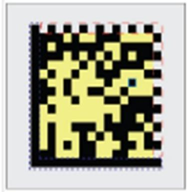

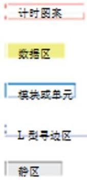

激光镭雕 喷码等方式出来的 DataMatrix 码质量不一，需要专门的仪器检测

Verifier：等级测试仪

等级测试仪是根据ISO15415或AIM DPM等标准来制定的，达到标准就说明这个码

具有可读性的，达不到标准就是可能存在读取失败的风险

常见低等级码：L边损坏，对比度不佳，模块化不佳，模块偏离，条码损坏，条码变形

eg：喷码机 喷的码需要测定码的质量等级，一般 ABCD 中 A 和 B 等级为合格

# 8.精度计算

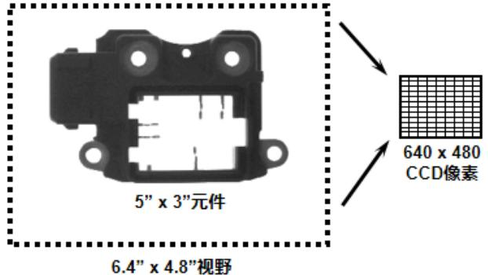  
精度计算

视野为 $6 . 4 \mathsf { m m } ^ { * } 4 . 8 \mathsf { m m }$ 分辨率为 $6 4 0 ^ { * } 4 8 0$

精确度视觉工具 $= \frac { 1 } { 1 0 }$ 像素

视觉精度计算： 单方向视野范围/相机单方向分辨率

相机精度：6.4mm/640像素=0.01mm

测量精度：0.01mm*视觉工具精度=0.01mm*0.1=0.001mm

eg：1.康耐视 500w 相机拍照，视野为 $5 0 \mathrm { m m } ^ { * } 4 0 \mathrm { m m }$ ，所使用的视觉工具精度为 ¼ 个像素，求测量精度？（500w 相机分辨率为 $2 5 9 2 ^ { * } 1 9 4 4 .$ ）400w 2048*2048

相机精度:(即像素分辨率) 相机精度 $= 5 0 \mathrm { m m } / 2 5 9 2 = 0 . 0 1 9 3 \mathrm { m m }$

测量精度：测量精度 $\cdot$ 相机精度*视觉工具精度=0.0193mm*¼=0.004825mm

# 9.PPM 计算

# 码PMM值计算

1.视野是 $7 8 m m ^ { \star } 5 0 m m$ 中间有个二维码尺寸为 $5 m m ^ { \star } 5 m m$ 二维码是12*12Code

(通俗来讲就是求此二维码每个模块包含几个像素)

用扫码枪DM50X(752*480)的长边计算

$\textcircled{1}$ 先算出视野里每个mm单位所包含的像素个数：  
$\_$ $= 9 . 6$ 表示每mm有9.6个像素  
$\textcircled{2}$ 再算出每个模块尺寸为多少mm：5/12=0.4166666667mm  
$\textcircled{3}$ 计算码密度：9.6*0.0.4166666667mm $\cdot$

另一种: $-$ 像素/12=4.017094017094017094017094017094

Fov:60mm*48mm

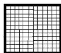  
5mm*5mm

code: 12*12

1200*960

黑色大框是扫码枪或者相机的视野：60mm*48mm，分辨率为1200*960

中间的小框是个二维码尺寸为：5mm*5mm

这个二维码的码值为12*12，也就是说二维码的是有144个模块儿(小格子)组成

此时计算码密度：

1.计算每个像表多长：60mm/1200=0.05mm这是每个小像表点的长宽  
2.计算这个二维码长或宽占用了几个像素：5mm/0.05mm=100

# 四、Fixture debug

1.Inspection：Inspection 功能、Vpp 基础功能详解、Vpp 调试。 根据所学设备描述

# 2.标定：

$\textcircled{1}$ 标定流程：所学设备标定流程

参考： $\textcircled{1}$ 确认相机的焦距，视野是否调整OK，镜头及相机是否松动；

$\textcircled{2}$ 运动机构是否调整 OK；  
$\textcircled{3}$ 软件和视觉软件是否正常，通信是否正常；  
$\textcircled{4}$ 标定所使用的工具是否准备 OK，标定工具是否破损，翘曲；  
$\cdot$ Configuration 中棋盘格的尺寸与实际是否匹配；  
$\textcircled{6}$ 机器人吸取或放下棋盘格时，棋盘格是否有滑动现象或者吸不起来；  
$\textcircled{7}$ 检查标定误差是否在正常范围；  
$\textcircled{2}$ 标定结果读取与分析  
$\textcircled{3}$ 确定标定结果：标定结束后，Cognex软件会自动计算结果，查看RMS值，查看是否在规定范围内，若过大，检查原因重新标定。  
$\textcircled{4}$ 标定的异常分析及注意事项

异常分析：

标定误差大：检查机构走位是否准确，旋转角度是否正确并且准确，标定片尺寸、图片清晰度、标定片标定过程中有没有滑动、标定片模糊、曝光是否合适

标定失败：通讯异常、拍照失败、软件损坏、旋转角度错误、旋转顺序错、

(1).视觉软件问题

1>软件数据未配置OK，重新调试，调试OK后重新标定

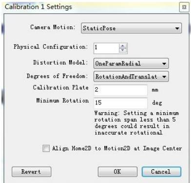

$^ { 2 > }$ 相机FOV或者焦距未调试OK，重新调试，OK后重新标定。  
$\mathsf { 3 > }$ 图片过曝或者过暗，调节曝光参数，OK后重新标定。  
$4 >$ 标定工具有磨损，或者翘边，更换标定工具重新标定。

(2).OEM 原因

$\ L _ { 1 > }$ 机械手走位误差较大，或者旋转角度误差大，让OEM调整后重新标定。  
$^ { 2 > }$ 机台未打地脚或者未測水平，至机台不平整，让OEM改善后重新标定。

$3 { \mathrm { > O E M } }$ 原因至标定无法正常运行，检查改善后重新标定。

注意事项：

1>检查焦距视野是否 OK

$^ { 2 > }$ 检查 OEM 机构是否 OK

$\mathsf { 3 > }$ 检查视觉软件与 OEM 软件之间的通讯是否 OK

$4 >$ 光源连接配置是否 OK

$5 >$ 需准备 1 片 2mm 菲林片，Graphite 标定板，1 张白纸

$_ { 6 > }$ 检查标定工具是否完好，不能有翘边，磨损。

# $\textcircled{1}$ 相机无法拍照或者连接失败：

确认相机网线是否连接正确

如果 VisionPro 可用，打开 Cognex GigE Vision Configuration，查看不拍照的相机是否在左侧的相机列表中。

确认机构是否发送了正确的触发信号。

可能由于主机卡顿，软件卡顿或BUG引起，将计算机关机，约十秒钟后，重新开启计算机

检查相机是否损坏，如坏的话更换相机。

相机配置参数设置不正确，重新查看并配置好正确参数

权限位丢失，检查8704E板卡权限

磁盘已满或者图片删除设置参数不合理，重新设置图片保存参数

# $\textcircled{2}$ 相机蓝屏：

主机 IP 或者相机 IP 有设置错误

巨帧数据包改为 9014、防火墙关闭、ebus 勾选

网口损坏更换别的网口 硬件损坏需更换硬件（网线、相机、图像采集卡）

$\textcircled{3}$ PMAlign：提高工具运行速度：

算法由 PatMax 改为 Patquick 会加快运行速度

搜索区域越小搜索速度越快 (宽)x(高)x(角度范围)x(缩放范围)

提高接受阈值搜索变快

减小搜素结果数量执行时间稍变快

精细颗粒度越高，时间越短

粗糙颗粒度越高，时间越短

考虑极性稍稍加快速度

提高对比度以便执行更快

④PMAlign

PMAlign

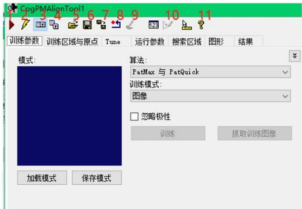  
⑤Histogram

图上按钮功能分别表示：

1.运行

2.电子模式

3.本地显示

4.浮动显示

5.打开

6.保存

7.另存

8.复位

9.图像掩膜编辑器

10.建模器

11.帮助

<table><tr><td colspan="2">统计信息</td></tr><tr><td>最小值</td><td>24</td></tr><tr><td>最大值</td><td>249</td></tr><tr><td>中值</td><td>239</td></tr><tr><td>模式</td><td>242</td></tr><tr><td>平均值</td><td>169.029</td></tr><tr><td>标准差</td><td>95.6033</td></tr><tr><td>方差</td><td>9140</td></tr><tr><td>示例</td><td>307200</td></tr></table>

<table><tr><td colspan="2">Statistics</td></tr><tr><td>Minimum</td><td>≥4</td></tr><tr><td>Maximum</td><td>249</td></tr><tr><td>Median</td><td>239</td></tr><tr><td>Mode</td><td>242</td></tr><tr><td>Mean</td><td>169.029</td></tr><tr><td>Std. Dev.</td><td>95.6033</td></tr><tr><td>Variance</td><td>9140</td></tr><tr><td>Samples</td><td>307200</td></tr></table>

Minimum：最小值灰度最大值

Maximum：最大值灰度最小值

Median:中值 比例刚过50%对应的灰度值

Mode:模式 灰度值占比最高的像秦的灰度值

Mean:平均值 灰度平均值

Std.Dev.:标准差灰度标准差

Variance:方差 灰度方差

Samples:示例 区域内总像素数

# 五、曾考内容

# 1.机试：

$\textcircled{1}$ 有无检测：模板工具的使用  
$\cdot$ 尺寸测量：模板定位工具以及测量工具的使用  
$\textcircled{3}$ 外观检查功能：Blob 工具以及结果分析工具(CogResultsAnalysisTool)/数据分析工具(CogDataAnalysisTool)。设定判断阈值，筛出良品不良品，

# 2.曾考内容

# $\textcircled{1}$ 基础大题：

1.影响景深的因素及之间的关系：物距越大景深越大、焦距越小景深越大、光圈越小景深越大、相机芯片像元越大景深越大、扩倍器和接圈会导致景深变小  
2.PMAlign匹配结果的三个颜色分别代表什么特征：绿色表示匹配良好，黄色表示匹配一般，红色表示匹配较差。  
3.HistogramTool 测量结果中的 Minimum、Maximum、Median、Mean 分别代表什么意思：最小值、最大值、中值、平均值  
4.模板匹配失败可以通过适当调整哪些参数来获取到结果：角度、缩放、接受阈值、对比度阈值

5.---- 一个 500w 相机，视野 $5 7 m m ^ { * } 4 2 . 7 5 m m$ ,相机分辨率是 $\_$ ，求精度：

有视野和分辨率可以求相机精度或者叫像素分辨率：

57/2592=0.0219907407407407 或者

42.75/1944=0.0219907407407407

6.Fitline 工具操作步骤：  
7.相机焦距怎么调节：  
8.同轴光光路图：  
9.拍照时图片上的拖影是什么原因造成的：拍照时相机或者物料平台或者机械手未停稳还在抖动，机台抖动，相机曝光时间设置偏大不合理。

$\textcircled{3}$ 机试题：测距，测夹角，求斑点个数。

脏污判定：需要设定一个阈值，满足则认为无脏污，不满足则认为有脏污。

建模的使用：

抓椭圆工具的使用：

# 笔试：

1. 普通镜头的畸变有 桶形畸变 、枕形畸变 两种。

畸变类型：

径向畸变：桶形畸变 、枕形畸变 切向畸变：相机和平台不完全平行导致

2. 工业相机触发方式根据触发信号，可分为 硬件触发 和 软件触发 。  
3. DM262 采用 24 V 电源连接器连接。  
4. 镜头光学放大倍率是 CCD尺寸 和 视野FOV 的比值  
5. CogCaliperTool 工作极性方法有 由明到暗 、 由暗到明 、 任何极性 。  
6. 相机曝光时间越 长 ，图像越亮，抗振动能力越差。  
7. 8位黑白相机的灰度等级位 256级  
8. 改变图像采集明暗度的方式有 光圈 、 曝光时间 、对比度、增益等，  
9. CogIntersectLineCircleTool 工具输入段需要输入 输入图像(InputImage) 、线(Line)、圆(InputCircle)才能正常运行。

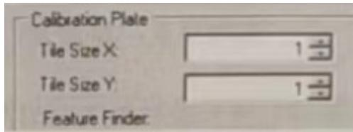

中数字 1 表示 标定片尺寸 1mm 。

11.FrameWork视觉系统包括 在线 和离线两种运行模式，在 run弹出菜单选择 在线 开启TCP Server服务，选择 离线则关闭 TCP Server 服务。

不定项选择题：

1. 下列关于感光元件描述正确的是( BC )A、CCD：噪点多，图像效果较差，价格便宜。B、CCD：噪点少、图像效果好、价格高 C、CMOS:噪点多、速度快、价格便宜 D、CMOS：噪点少、速度快、价格高  
2. 关于 CogFItLIneTool 说法正确的是（ BCD ）A.与 CogFindLineTool 工具功能一样。B.通过数据点拟合直线。C.至少需要两个数据点才可以拟合一条直线。D.在理想条件下，参与拟合的数据点越多，拟合结果越稳定。  
3. 如下图锯齿边缘轮廓检测，推荐合适光源，（C）A,带偏振环形光。B,同轴光，C背光源，D高角度直向型光源

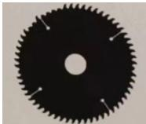

4. 在进行视觉对位引导项目中，需建立视觉坐标系与机械手坐标系之间的对应关系，而( B )就是来完成该作用的。

A、检测，B、标定。C、定位。 D、曝光。

5. VisionPro工具库中CogFixtureTool工具作用（C）A、抓圆工具B,计算距离，C建立坐标空间。D设定矩形搜索范围判断题：

1. PatMax（CogPMAlignTool）工具的接受阈值介于 0-1 之间( Y )  
2. CogCalibcheckerboardTool 矫正输入图片的畸变。( Y )  
3. CogIDTool同是支持一维码和二维码的读取。（N）  
4. CogBlobTool 更加适用于低对比度的图像。（N）  
5. CogCaliperTool 中 Edge Pair(边缘对)模式还可以测量边缘对之间的距离。（Y）

简答题：

1. 相机无法正常连接(拍照蓝屏)现象，试分析原因和对应的解决措施。

参考：

$\textcircled{1}$ IP不正确、eBus选项未勾选、防火墙未关闭、巨针数据包未设置，应当修改正确IP地址、勾选eBus选项、关闭防火墙、巨针数据表设置为9014。

$\cdot$ 相机网口或者板卡网口损坏，更换网口。  
$\cdot$ 网线损坏，更换网线。 相机损坏、更换相机。

2. 画背光源示意图，该视场适应的环境有哪些？优点有什么？

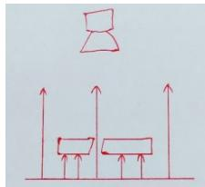

，适用于对物体的轮廓和边缘检测的环境、以及透明物体内不透明物体检测的环境。

优点：能够清晰的将物体的轮廓和边缘呈现出来，能够将透明物体内不透明物体和背景清晰的区分出来。

3. 如下图，零件尺寸 50mmx40mm，视野大小为 $6 4 \mathsf { m m } \times 4 8 \mathsf { m m }$ ，相机分辨率为 1600Pixel x 1200Pixel，此时像素分辨率是多少？

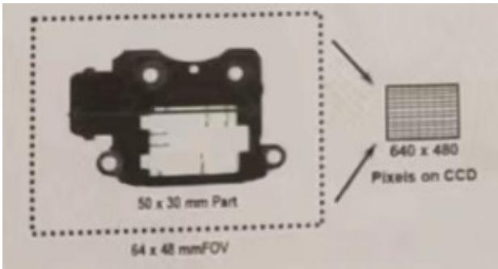

注意：零件尺寸只是用来迷惑，在这里毫无意义。

像素分辨率(相机精度)：

视野长边/芯片长边=64mm/1600Pixel=0.04mm

视野宽边/芯片宽边=48mm/1200Pixel=0.04mm

机试：一题一个 Job，job 重命名为 1 和 2.作业保存为 Quickbuild，命名方式：姓名+身份证号。

1. 如下图，文件夹中Blobs.bmp操作如下试题

$\textcircled{1}$ 用斑点 CogBlobTool 工具找到黑色大园内的黑色实心小斑点(黑色小椭圆环不计入)，并将个数输出到 Toolblock的输出端。  
$\textcircled{2}$ 用两个黑色的小椭圆创建一条直线 L1，用两个白色椭圆创建一条边 L2，求L1和L2的夹角并将角度输出到ToolBlock 的输出端。

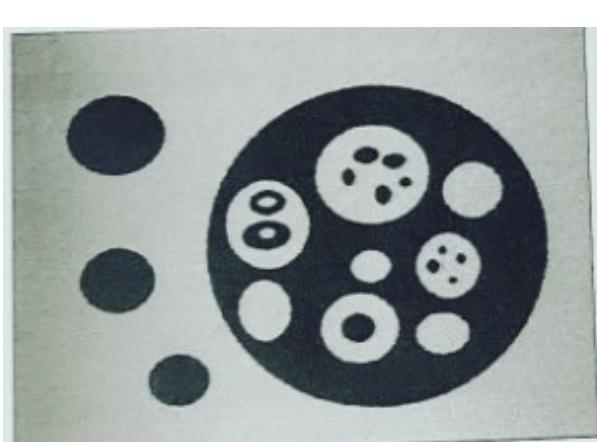

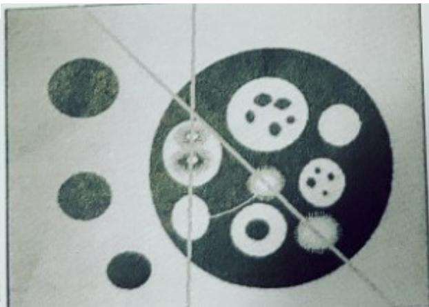

操作步骤：

$\textcircled{1}$ 因为是单张图像不需要模板及定位工具，可以直接添加斑点工具(Blob)，输入图像，选择圆形的检测区域，放在黑色大圆内，选择白底黑点，根据面积大小排出不需要的黑色小椭圆环。将斑点工具的 count 终端添加到CogToolBlock 中。  
$\cdot$ 添加抓椭圆工具(CogFindEllipseTool1),抓出需要的椭圆：连接图像，修改角度范围为 $3 6 0 ^ { \circ }$ ，修改XY半径，拖动到合适位置选择合适的极性。复制设置好的椭圆工具，抓取第二三四个椭圆。用Fitline工具拟合两条直线L1和L2，用 CogAngleLineLineTool 工具测量角度并输出到 CogToolBlock 中。

2. 如下图用图片 Bracket_std.Idb 操作如下试题

$\textcircled{1}$ 求下图圆 1 和圆 2 的连线，并求出圆 1 和圆 2 的距离，添加到输出端。  
$\textcircled{2}$ 求缺口 1 和缺口 2 的宽度并添加到输出端。

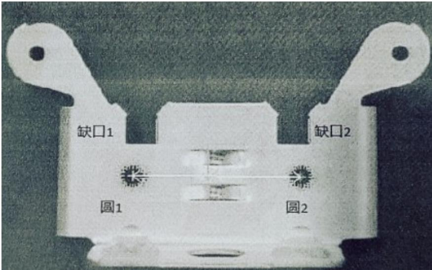

# 做题步骤：

$\cdot$ 多 张 图 像 ， 需 要 PMAlign 和 Fixture 工 具 建 立 坐 标 跟 随 ， 用 FindCircle 工 具 抓 出 圆 1 圆 2 ， 用CogDistancePointPointTool工具测量两个圆心之间的距离(这里根据题目要求来选择测量圆圆距离还是圆心圆心距离)添加到输出端，未要求可以用结果分析工具或者CogToolBlock都行  
$\cdot$ 添加卡尺工具CogCaliperTool分别抓取凹槽1.2位置的宽度，添加宽度终端并输出。

# 上午机试：

# 2、如下图，用文件夹中图片 bracket_mask.bmp 操作如下试题

$\textcircled{1}$ 求出如下图P1和P2点的连线，并求出P1和P2连线中点的坐标，并添加到输出端。 （20  
分）ps：线段才有中点)  
$\textcircled{2}$ 求下图区域 1 和区域 2 的中心点，通过两个中心点创造一条线段。（30）

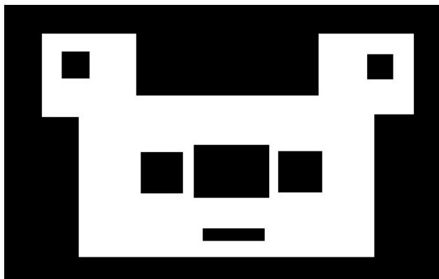

做题步骤：这张图是bmp单张图像，所以可以不用模板 $^ +$ 定位工具

$\cdot$ 和P2点可以用三个findline抓出三条直线，然后用intersection交点工具求出两个交点。

然后添加创造线段工具(CogCreateSegmentTool)将 P1P2 点连起来，并添加中点终端 MidPointX 和MidPointY

$\textcircled{2}$ 求区域1和区域2的中心（求矩形四条边（findline），四个交点intersection工具，两个对角线fitline，求中心 intersection 工具）

将两个中心点连接给创造线段工具 CogCreateSegmentTool 。

1、如下图，用文件夹中图片 dot.bmp 操作如下试题。

$\textcircled{1}$ 求如下图片中黑色斑点的个数并添加到输出端。（25 分）  
$\textcircled{2}$ 求圆 1 和圆 6 两个斑点的中心距离并添加到输出端。(25 分）

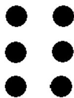

因为是单幅图像 所以不需要跟随，不需要 CogPMAlignTool 和 CogFixtureTool 工具。

做题步骤：第一问，用斑点工具选择正确极性 黑底白点。将斑点工具count终端(斑点数量)输出

$\cdot$ 两个抓圆工具得来圆1 6的中心，然后用点点测距工具测量圆心1到圆心6的距离并把Distance终端输出。