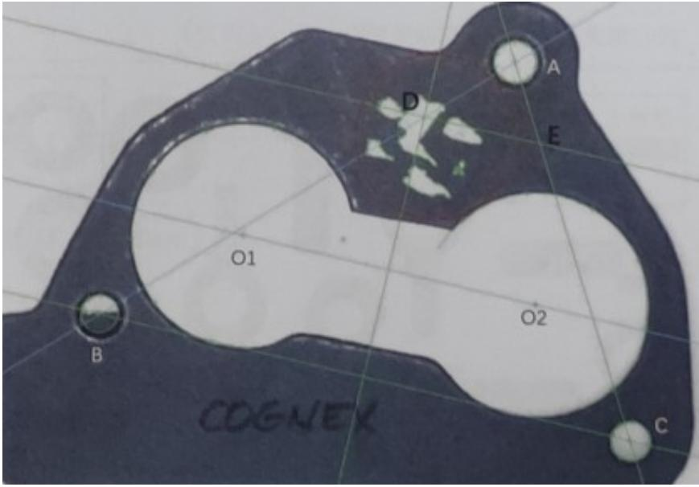
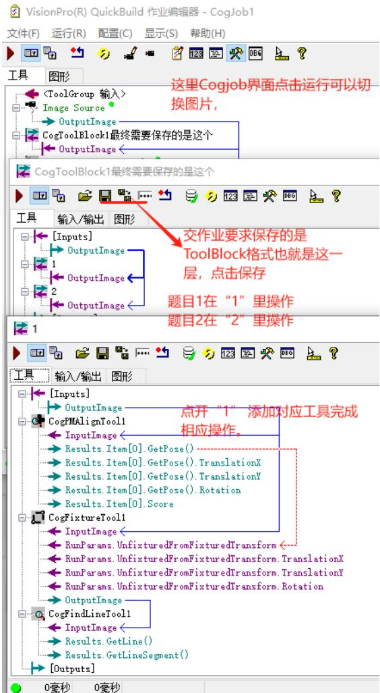
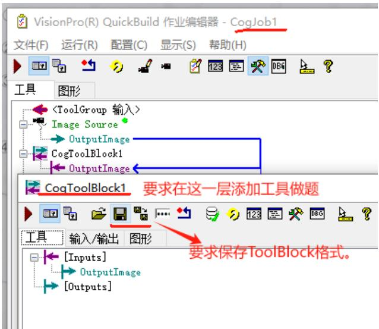

# L3 机试题

视觉工程师三级机试

操作要求:每题为一个 Block，Block 重命名为 1 和 2，作业保存为 Block 格式命名方式为:姓名 $^ +$ 身份证号，每人作业只收集一份整体的 Block。 (100 分)

1.请使用图片 1.idb 完成以下操作: 这个题目要求全在上图 命名为 “1” 的ToolBlock里添加工具操作！

1选择合适特征定位，抓取左右两个大圆并计算圆心距并输出;(15 分)2 抓取周边的3 个小圆 ABC 并将圆心互相连线;(18 分) 抓圆、测距、fitLine拟合线

3 做圆心 01、02 的中垂线于 AB 相交于 D，过 D 做 0102 的平行线 DE，与 AC 交于 E 点，求 DE 的距离并输出; (7 分)4 计算 D 点周边的最大白色斑点的面积并输出。(10 分)

这里可以用点平分线直接拿圆心01 02的点得到一条中垂线，然后又和线 AB相交与D(也可以，01 02先拟合一条直线，然后过点D做01 02连线的垂线。)

，再创造平行线平行于0102的连线。 测距、 斑点工具筛选最大的斑点并输出。

1. .这个题目要求全在上图 命名为 “2” 的ToolBlock里添加工具操作！最后操作完，在外层 ToolBlock 保存 ToolBlock 格式。