1. 我们今年使用的视觉软件与机构进行通讯，最常用的是 TCP 和 IO _，最多支持 8 _个服务器连接  
2.CheckerBoard 线性标定校正的五种自由度是平移、___缩放、纵横比、旋转、倾斜、平移   
3.使用Caliper 工具，在选择单边模式时，边缘0极性可选择___由暗到明、由明到暗、任何极性 _3 种方式  
4.图中是训练的模板，训练参数粗糙为 8，精细为 5，则模板训练的特征中黄色线条长度为 _8 _个像素 绿色线条的长度为 5 _个像素  
5.经过表达式 $a { = } 2 { + } 1 { > } 5 ? 0 { : } 1$ 的运算，变量 a 的最终值是__1_  
6，CogHistogramTool 的 LastRun.Histogram 里面 X 轴代表的是_ ___灰阶_

# Y轴代表的是 _像素数

# 二、不定项选择题， (每空 2 分，共 20.分)

1.关于 CogFindLineTool 工具说法正确的？( AC )

A.适当设置忽略点数可以抓边，更少收到图像噪音干扰。  
B.计分函数只有两种。  
C.对比度阈值设置小于边缘两侧的灰度差。  
D.过滤一半像素，捕捉的边缘越锐利，过滤一般像素的值要设置的越高。

# 2.下面哪些是镜头的配件（AB ）

A. 接圈 B.滤光镜、C.偏振片、D.感光芯片   
3.CogCalibCheckerboardTool 作用是 （ BC ）  
A.计算灰度、 B。校正畸变 C.建立物理坐标与像素坐标的对应关系。D.建立坐标空间。  
4.下列工具，那些可以旋转图像。（ A ）  
A.CogIPOneImage B.CogIMAGEConvertTool C.CogBlobTool D.CogCopyRegionTool   
5.模板工具运行参数中使用模式粒度限制，当颗粒度较大时（ BCD ）  
A.适合精确定位。 B.特征信息粗糙。 C.特征信息少。 D.运行速度相对较快。  
6.CogCaliper 工具实体箭头代表（ D ）  
A.旋转手柄、B。投影方向。C极性方向。D.扫描方向。  
7.在 CogLineMax 中，边缘极性有哪几种（ ABCD ）  
A.明到暗 B。暗到明 C..任意极性、D。混合。  
8.CogCalibCheckBoardTool 校正中的基准符号可以选择为( ABC D )  
A.None B.StandardRectangle C .DataMatrix D.DotGndAxes   
9.软件界面 CameraSetting 可以设定（ ABC ）  
A.相机亮度、 B相机对比度。、 C触发方式、 D。曝光时间。  
10.现场中影响图像质量的因素有哪些？ （ AB ）  
A. 光源亮度、 B.光源的入射角度。 C。机械手的精度。 D。选择的抓取工具。

# 三、判读题

1. 通过适当减少卡尺数量，调小搜索区域等方法降低处理时间。（ Y ）  
2. CoImageConvertTool 工具可以将彩色图转换为黑白图。（ Y ）  
3. 模板工具的颗粒度单位是 mm（ X ）  
4. 在 CogOneImageTool 工具，灰度学形态调整的宽和高只能设定为奇数（ N ）  
5. 图像亮度不够可以通过调大光圈、增加光源亮度、延长曝光时间等方式进行改善（Y ）

# 四、简答题

1. 简述相机连接失败的可能原因以及措施（至少4条）

参考以下几个方面：

硬件坏：网线、相机、板卡、网口

电脑端口：巨帧数据包、防火墙、杀毒软件、eBus选项

相机IP错 未供电 等

2. 现场维护车间设备贴装不稳定，试分析原因并写出找问题过程。（至少3点。）

参考以下几个方面：

拍照时机构未停稳，，拍照坐标不对、，机构轴松动 精度不够导致每次拍照位置都不一样、

曝光或打光不合适，抓边不稳定。 模板匹配不稳定，抓边不稳定。

排查相机或镜头是否松动等。

3. 简述下面代码中序号 1-5 的含义。 (15 分)

graphicCollection.Clear();1. 翻译：清除所有的显示（文本、点、圆等等）

mToolBlock.Outputs["CenterX"].Value ${ \it : \ } = 9 9 9 9 . 9$ ;

mToolBlock.Outputs["CenterX"].Value=999.9; 2. 翻译：将输入输出里输出端 centery 的值附为 999.9

CogIPOneImageTool processing_Fin=mToolBlock.Tonla["CogIPOneImageTool_Fine"]

processing_Fin.Run();3. 翻译：单次运行一下 CogIPONEimage 工具

CogCircularAnnulusSection hist_cir $=$ new CogCircularAnnulusSection();

hist_cir.SelectedSpaceName=” $@$ \\lCheckerboardCalibration\\Fixture_ImageUnify"; 4.

翻译：将 hist_cir 的命名空间改为@\\lCheckerboardCalibration\\Fixture_ImageUnify

hist_cir.CenterX=(double)pma_FlexMoudle.Results[j].Getpose().TranslationX;

hist_cir.CenterY=(double)pma_FlexMoudle.Results[j].Getpose().TranslationY;

hist_cir.Radius $\ d = 0 . 4 5 ;$ . 翻译：将 hist_cir.的半径赋值为 0.45

# 12.7 下午部分笔试题

填空题：

1.CogCalibCheckboardTool 工具主要校正__线性__ _畸变和 _非线性_____畸变。  
2.使用 Caliper 工具，在选择单边模式时可以使用的三种函数是：____对比度_ 位置 _PositionNeg  
3.下图是一个训练模板，Current.TrainImaeg 中绿色线条长度是___2___个像素，黄色线条长度是 _5__个像素。 粗糙值为 5精细值为 2  
4.解释 CogIpOneImageTool 中参数的含义：

翻转/旋转：翻转和旋转0-270°

加/减常亮：直接在当前图像的灰度值基础上去加减一个值后输出

乘以常数：整体变亮变暗等

机试题1：

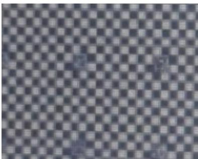

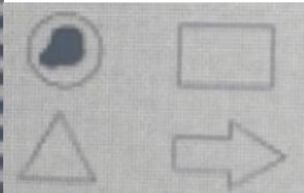

关于这个图的考点有：如果提供的有标定片的图片，需要先将标定片图片加载进去，添加

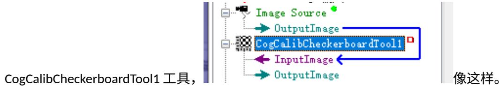

然后用标定片图片及标定工具进行”标定”，

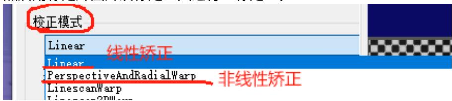

矫正模式：选第一个，第二个都可以。一般提供的图片是不存在切向畸变的， 选第一个就够用。

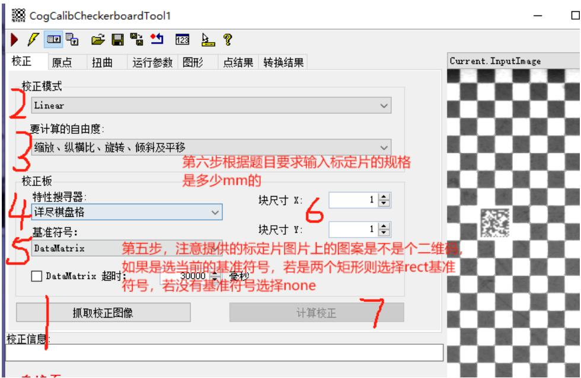

最后第七步点完计算矫正之后切换到转换结果选项，看看RMS误差，如果是零点几是正常的。若是比较大，考虑更换一下矫正模式改为非线性矫正。再点击计算矫正看 RMS 误差。

标定工具校正后，再加载要进行操作的机试图片。图片先进标定工具，再由CogCalibCheckerboardTool1工具输出的图像再给后边的工具用，注意后边的工具都要用标定工具输出的图像，这样图像的单位才是 mm 而不是像素。

例如：

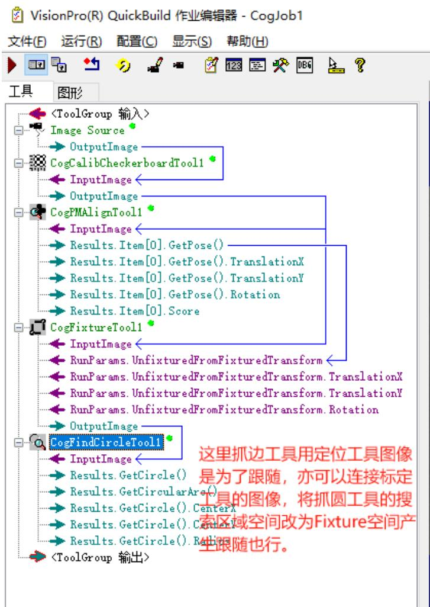

注意： 经过标定工具转换后图像是mm单位，所以模板的训练框尺寸、抓边圆工具的卡尺区域默认会很大， 进行修改下搜索长度、投影长度之类的就行。

接着，抓线、圆、椭圆、测距、求角度、求交点、半径、面积、灰度值等等。

# 机试题 2：

# 参考以下考核方向：

上机操作（作业保存为Job格式,将所求结果输出到一个block中，命名方式为：姓名 $^ +$ 身份证号。每人作业

只收集一份 Job。） 这里要求结果输出到一个 Block 指的是用 CogToolBlock 收集结果。，要求保存

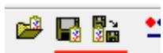

# Cogjob 格式的

1.请使用 Image1 图片完成以下操作：

求抓取内外 2 个圆，并求 2 个圆的圆心距 cc（20 分）

用 OCR 工具解析下方字幕并输出 ResultString（20 分）。

求大圆与“STABRUCKS”的上边线 L1 的距离 AB（20 分）

过大圆圆心 O 做 L1 的垂线 L2，L2 与小圆相交与点 C 过圆心 O 做 L2 的垂线 L3，L3 与小圆相交与点 D，求∠OCD 的角度 Angle（20 分）

用 CogResultsAnalysisTool 求▲OCD 的面积（面积=1/2 *长*宽）。（20 分）

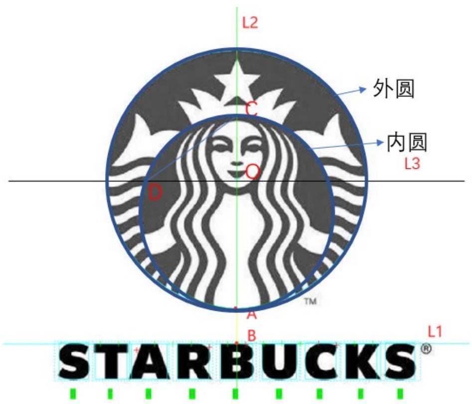

1.VisionPro 工具块 4 中运行状态，分别是：__运行___、_警告____、___禁用__、__接受_  
2.DS 相机，图像采样间距越大，图像数据量越___小__、图像质量_越好_  
3.Cognex Framework 支持和 SI 通信的方式有__TCP___、__IO__、当前 Framework3.3.1.0 版本支持__8__个端口  
4.VisionPro工具集中拟合线工具的全称是 _CogFitLineTool ___、创造线段工具全称_CogCreateSegmentTool  
5.灰度直方图工具经常在项目中被用到，灰度直方图的横轴(X轴)表示_灰阶____、纵轴(Y轴)表示__像素数__  
6.Checkboard 主要矫正_线性____、畸变和__非线性___、畸变。Npoint 标定校正___线性__、畸变。  
7.灰度直方图统计哪些信息最大值、最小值、__平均值___、_中值____、_方差____、__标准差___、等。

# 二、不定项选择题

1.调整哪儿些参数可以影响 CogPMAlignTool 运行时间( ABCD )

A.接受阈值 B 缩放 C 查找概数 D 极性

2.下列哪个是 Global Shutter(全局曝光)型号相机（A）

A.5000-20-G B. 5000R-14-G C.10MR-10-G D. 12MR-8-G

3.光学倍率公式正确的是（B）

A. 视野/像素数 B.CCD 芯片尺寸/FOV C.焦距/镜头通光孔径 D. Fov/焦距

4.影响检测精度的因素有？（ABCD）

A.视野 B相机像素 C图像质量 D视觉工具精度

5.一下工具用于测量类的是？AD

A.CogCaliperTool B.CogFitLineTool C. CogCreateLineTool D.CogDistanceSegmentSegmentTool

# 三、判断题

1.关于 Patmax 模式粒度，粗糙模式粒度必须小于等于精细模式粒度（X）  
2.Cognex 相机 CAM-CIC-5000-20-G，一秒内最多拍 20 张图片（Y）  
3.因物料上下表面存在 4mm 高度差，所以要选用高景深、低畸变远心镜头（Y）  
4.CogFIndCircleTool 在其他参数相同的情况下，增加忽略点数可以降低工具的运行时间（Y）  
5.消除图像中细小黑色斑点，可以采用形态学中的开运算（Y）

# 四、简答题

1.硬件触发飞拍过程出现个别图像黑屏现象如何分析？请从现象来整理排查思路，至少4点(15分)黑屏意味着相机拍照了，只是光源未亮、触发不同步或者镜头被遮挡等原因导致。

$\textcircled{1}$ 机构运行到某个穴位时，镜头被物体遮挡拍照导致。  
$\cdot$ 光源未亮导致拍照是黑的。  
$\textcircled{3}$ 光源触发和相机拍照不同步，拍照是黑的。  
$\textcircled{4}$ 光源触发线磨损或松动，导致个别穴位时线接触不良，光源未亮

2.简述 CogPMAlignTOol，CogFindlineTool，CogBlobTool 工具的作用及详细的使用步骤 15 分参考：

CogPMAlignTOol：可以计数、可以做模板匹配。

$\cdot$ 抓取训练图像，切换到训练图像。  
$\textcircled{2}$ 在训练图像内调整训练区域，框选出需要的特征作为模板，设定中心原点的位置。  
$\textcircled{3}$ 根据需求选择是否开启角度、缩放等参数。  
$\cdot$ 点击训练，点击运行查看结果。  
$\cdot$ 根据需求可以用掩膜、建模等方式做模板，没有结果可以修改、接受阈值、对比度阈值、角度、缩放、概数、极性等参数来获取结果。

CogFindlineTool：可以获取一个线段、一条直线。

$\cdot$ 调整卡尺区域，将抓边工具蓝线和抓取位置重合  
$\textcircled{2}$ 设定相应的卡尺数量、搜索长度、投影长度、搜索方向、搜索极性、忽略点数等。  
$\cdot$ 默认对比度计分、也可添加位置等计分。  
$\textcircled{4}$ 点击运行查看结果。

CogBlobTool：可以获取斑点的数量、面积等信息。

$\textcircled{1}$ 设定搜索区域(全图或部分区域)、  
$\textcircled{2}$ 设定图像分割模式eg：硬阈值固定、动态、软阈值等   
$\textcircled{3}$ 设定搜索极性：白底黑点、黑底白点

$\textcircled{4}$ 点击运行查看找到的斑点结果，根据需要做出斑点结果XY面积等的筛选

3.如下图，左边原始图像，转为右边图像，分辨使用了什么形态学操作，并说明形态学调整的作用？

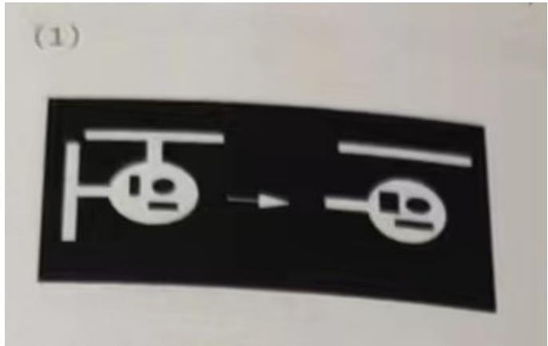

1.水平(宽度)方向腐蚀操作。

以结构元中所有像素灰度值的最低值，替换中心像素的灰度值。

作用：减小斑点，增大空洞。

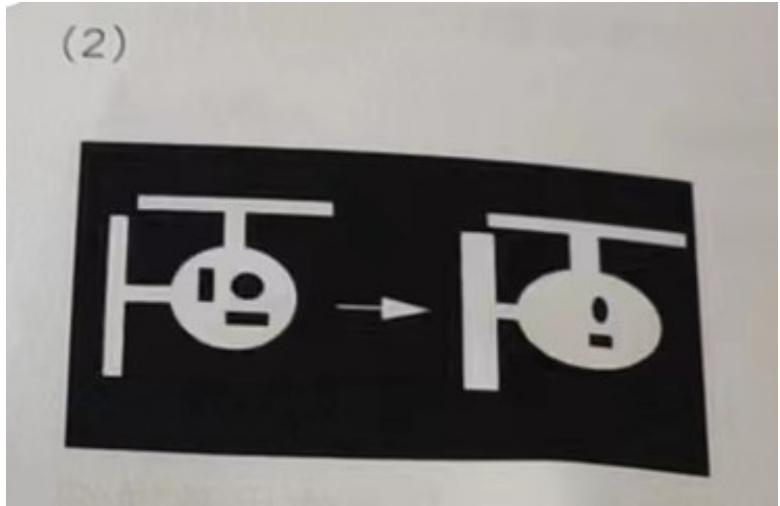

2.水平(宽度)方向膨胀操作

以结构元中所有像素灰度值的最高值，替换中心像素的灰度值。

作用：减小空洞，增大斑点。

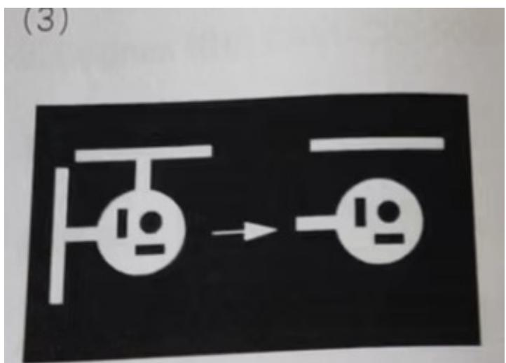

3.水平方向开运算。先进行腐蚀运算，再进行膨胀运算。

作用：维持空洞，去除斑点。

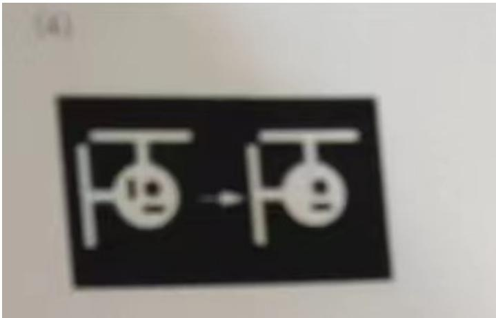

4.水平方向闭运算。先进行膨胀运算，再进行腐蚀运算。

作用：维持斑点，去除空洞。

# 一、填空

1.抓边工具的结果已使用列表的 True和False分别代表：找到并参与线拟合的点被忽略点数忽略的点或未找到的点  
2.Checkerboard五种自由度：平移 旋转 缩放倾斜纵横比  
3.PMAlign工具训练模板的特征中，弹性的单位是：像素。弹性 越大 对特征的形变容忍度越大  
4.卡尺工具的三个计分函数分别是：对比度 位置 PositionNeg 。  
5.抓边工具两种边缘模式是：单个边缘 边缘对  
6.CogIPoneImageTool中常用的几种操作：加/减常量 卷积3x3 翻转/旋转 3x3中值 丢失像素 乘以常数 像素映射  
7.CogHistogramTool 工具结果中部分数据含义：

Minimum：最小值 灰度最大值

Maximum：最大值 灰度最小值

Median：中值 比例刚过 $50 \%$ 对应的灰度值

Mode：模式 灰度值占比最高的像素的灰度值

Mean：平均值 灰度平均值

Std. Dev.:标准差 灰度标准差

Variance:方差 灰度方差

Samples:示例 区域内总像素数

# 二、选择

1. 关于卡尺工具说法正确的：

A. 适当设置忽略点数可以让抓边更少受到图像噪音的干扰  
B. 边缘极性有2种(由暗到明和由明到暗)   
C. 对比度阈值设置要小于目标边缘两侧的灰度值  
D. 过滤一般像素：捕捉的边缘越锐利，此值设置的越高

2. LineMax工具边缘极性有哪几种

A. 由暗到明 B。由明到暗 C。任意极性 D。混合  
3. Fixture 工具的作用：

A. 最小灰度值 B。建立坐标空间 C。解码信息 D。斑点面积  
4. 使用 CogCopyRegionTool 可对指定区域进行哪些操作  
A、灰度填充 B、像素复制C、空间转换 D、数据计算  
5. PmAlign 工具输出结果数据(X、Y、Angle)是在那个空间下 B  
A. 像素空间 B、输入图像空间C、训练区域选取空间、D、搜索区域选取空间

# 三、判断题

1. PMAlign工具可以通过建模、掩膜等方法创建模板

Y

2. Caliper 工具只有对比度、位置和 PositionNeg 三种计分函数

3. CogCalibNpointToNPointTool 可以校正线性畸变和非线性畸变 N   
4. 在 Blob 工具中，可以通过设置最小面积对斑点结果进行过滤  
5. 图像亮度不够可以通过减小光圈值，增加光源亮度，延长曝光，加大增益等方式进行Y四、简答题

1. PMAlign 工具中结果的 Fit Error(拟合误差)、Coverage(范围)、Clutter(杂斑) 的意义

Fit Error(拟合误差)：测量已找到的样板与已训练样板的特征的匹配度(不考虑缺失的特征)，范围为零(完美拟合)至无穷大(拟合很差)。

Coverage(范围)：在搜索结果中找到的已训练样板中特征的百分比，范围为 0.0~1.0，仅用于PatMax 算法。

Clutter(杂斑)：结果中显示的无关特征数除以已训练模板中的特征数，范围为零至无穷大，仅用于 Patmax 算法。

2. Caliper 工具中，使用对比度计分时，X0X1Y0Y1 分别有什么作用，如下图设置，如果某个边缘对比度为 100，他的得分是多少？

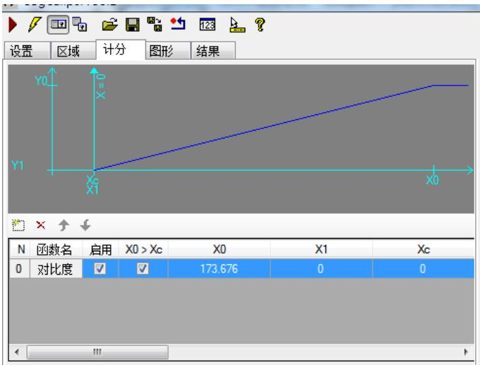

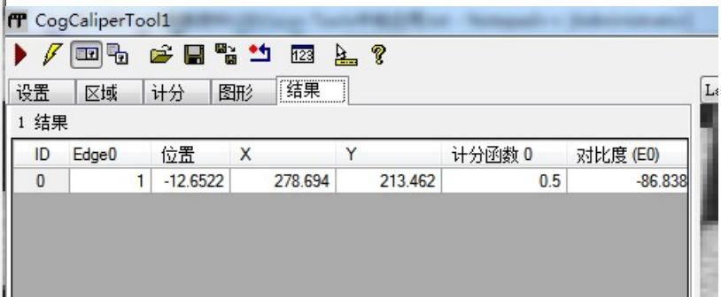

对比度计分时：X0表示最高得分1对应的对比度差值，X1表示最低得分0对应的对比度差值

Y0表示得分为1，Y1表示得分为0。

得分计算方式： 对比度值/设定的X0的值 $\cdot$ 得分 除出来的值大于1则按1

Eg：X0 设置为 100，

当对比度差值为 $\cdot$ 时得分为0.5，

当对比度差值为 $\cdot$ 时得分为0.8，

当对比度差值为 $\pm 2 0$ 时得分为0.2，

当对比度差值为0时得分为0，

当对比度差值为110时得分为1，

3. 下面所示代码片段的 Count 和 Area 分别代表什么意思？

double count $\mathtt { = 0 }$ ;

double area $\mathtt { = 0 }$ ;

CogBlobTool blobtool $=$ mToolBlock.Tools[“CogBlobTool1”] as CogBlobTool;

Foreach(ICogTool tool in mToolBlock.Tools)

mToolBlock.RunTool(tool,ref message,ref result);

count=blobtool.Results.GetBlobs().Count;

area=blobtool.Results.GetBlobs()[0].Area;

Count 表示 CogBlobTool1 结果的斑点个数

Area 表示 CogBlobTool1 第 1 个(序号为 0)结果的面积，也是最大的斑点的面积。

4.简述相机标定中 MotionScaling、CameraRMS、MotionSkew 的意义。

MotionScaling:XY 缩放误差

CameraRMS：标定误差，指所有的像素点和实际点的距离开平方跟的值 单位是像素

MotionSkew：倾斜角度

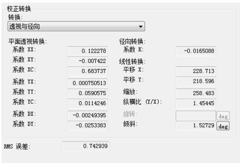

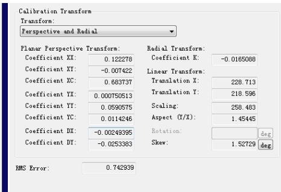

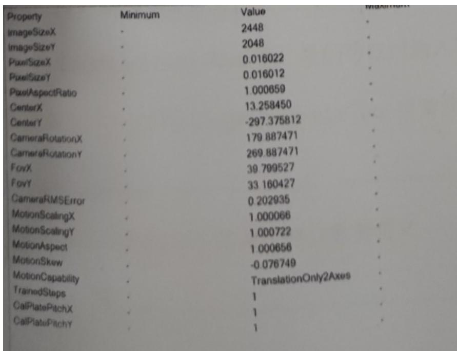

上题一个作业作

1.请使用以下组图PatMax_Counter_Demo.idb完成以下操作：

如下图所示，抓取轴承的滚轮数。（25分）  
②选择合适的工具，判定滚轮数是否有15个。（25分）

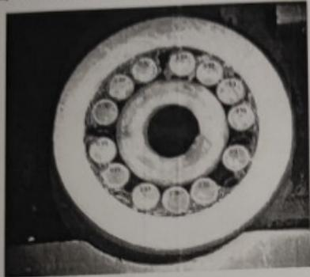

2.请使用图片L3F.idb完成以下操作：

①如下图求出物体和右边框的距离并添加到输出端。（15分） $\textcircled{1}$   
②计算灰色物体的面积和质心并输出到输出端。（15分） $\textcircled{2}$   
③检查灰色零件内部是否有黑色孔洞，如果有黑色空洞选择合适的工具将结果 $\textcircled{3}$

输出为拒绝；（20分）

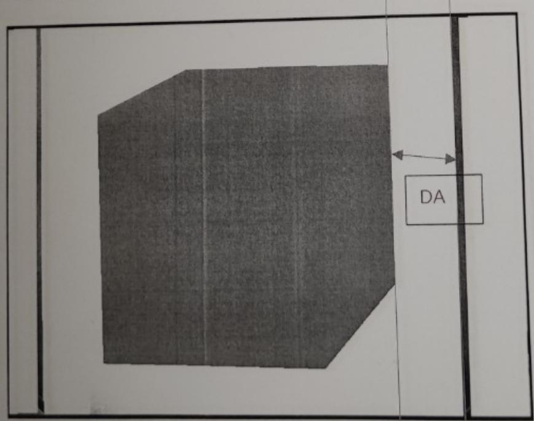

机试2题，没图，解题思路： 做模板，定位。Findline抓2边，Distancelineline测距并输出。斑点工具筛选灰色物体的面积及质心输出。

$\textcircled{3}$ 问：斑点工具设定多边形区域获取灰色物体内斑点信息，用结果分析工具根据斑点个数是否 ${ \bf > } 0$ 来判定结果为拒绝，反正则接受。 也可以 histogram 工具检测平均灰度值/标准差信息在通过结果分析工具来判定结果为接受、拒绝。

PS：结果分析工具使用方法可以参考 机试题1例子