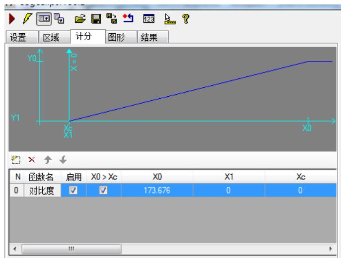
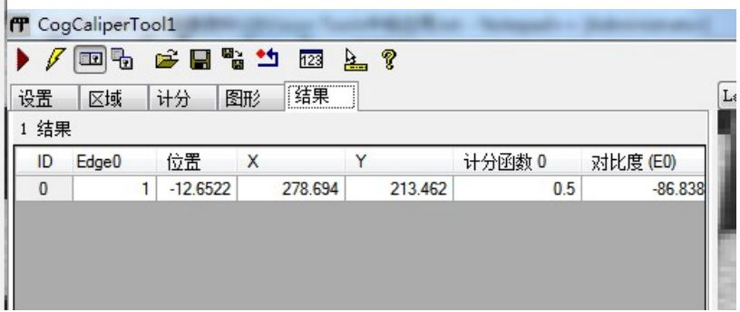
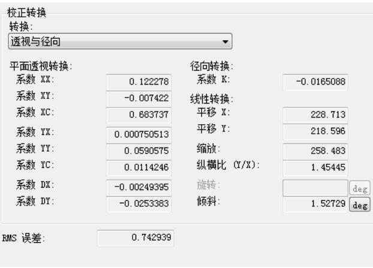
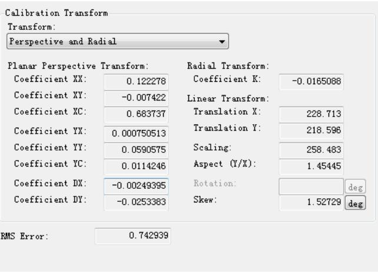
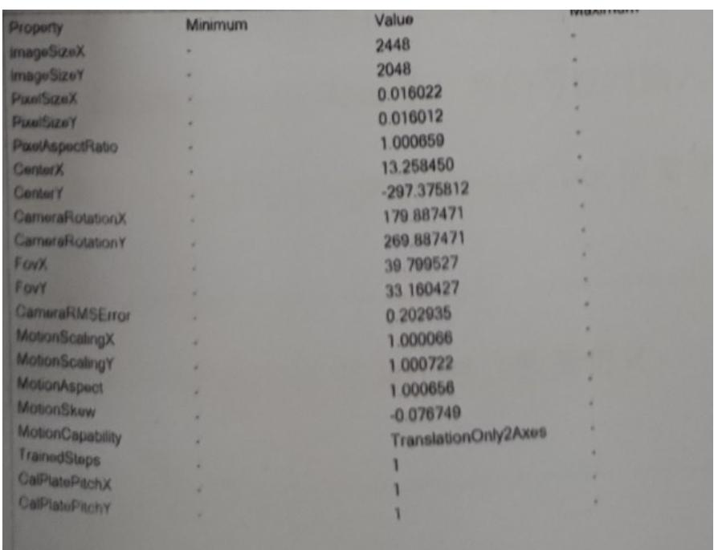
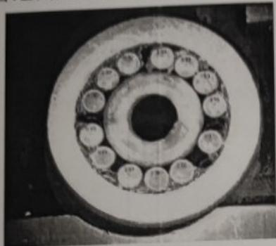
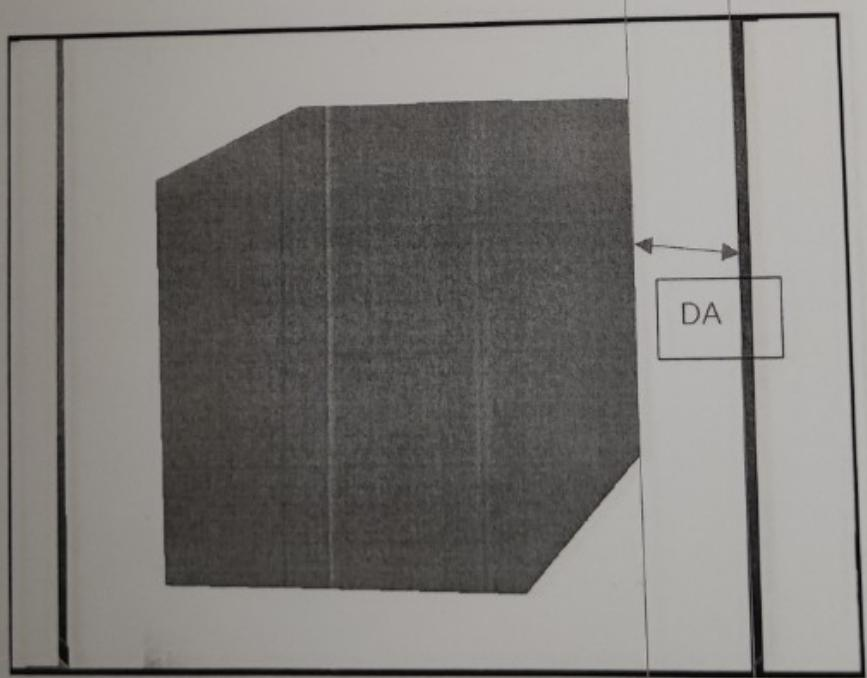

# 一、填空

1.抓边工具的结果 已使用列表的 True和False分别代表：找到并参与线拟合的点被忽略点数忽略的点或未找到的点

2.Checkerboard 五种自由度： 平移 旋转 缩放 倾斜 纵横比

3.PMAlign工具训练模板的特征中，弹性的单位是：像素。弹性 越大 对特征的形变容忍度越大

4.卡尺工具的三个计分函数分别是：对比度 位置 PositionNeg 。

5.抓边工具两种边缘模式是：单个边缘 边缘对

6.CogIPoneImageTool 中常用的几种操作：加/减常量 卷积 3x3 翻转/旋转 3x3 中值 丢失像素 乘以常数 像素映射

7.CogHistogramTool 工具结果中部分数据含义：

Minimum：最小值 灰度最大值

Maximum：最大值 灰度最小值

Median：中值 比例刚过 $\cdot$ 对应的灰度值

Mode：模式 灰度值占比最高的像素的灰度值

Mean：平均值 灰度平均值

Std. Dev.:标准差 灰度标准差

Variance:方差 灰度方差

Samples:示例 区域内总像素数

# 二、选择

1. 关于卡尺工具说法正确的：

A. 适当设置忽略点数可以让抓边更少受到图像噪音的干扰  
B. 边缘极性有2种(由暗到明和由明到暗)   
C. 对比度阈值设置要小于目标边缘两侧的灰度值  
D. 过滤一般像素：捕捉的边缘越锐利，此值设置的越高

2. LineMax工具边缘极性有哪几种

A. 由暗到明 B。由明到暗 C。任意极性 D。混合  
3. Fixture 工具的作用：  
A. 最小灰度值 B。建立坐标空间 C。解码信息 D。斑点面积  
4. 使用 CogCopyRegionTool 可对指定区域进行哪些操作  
A、灰度填充 B、像素复制C、空间转换 D、数据计算  
5. PmAlign 工具输出结果数据(X、Y、Angle)是在那个空间下 B  
A. 像素空间 B、输入图像空间C、训练区域选取空间、D、搜索区域选取空间

# 三、判断题

1. PMAlign工具可以通过建模、掩膜等方法创建模板 Y  
2. Caliper 工具只有对比度、位置和 PositionNeg 三种计分函数 N  
3. CogCalibNpointToNPointTool 可以校正线性畸变和非线性畸变 N   
4. 在Blob工具中，可以通过设置最小面积对斑点结果进行过滤 V  
5. 图像亮度不够可以通过减小光圈值，增加光源亮度，延长曝光，加大增益等方式进行Y

# 四、简答题

1. PMAlign 工具中结果的 Fit Error(拟合误差)、Coverage(范围)、Clutter(杂斑) 的意义

Fit Error(拟合误差)：测量已找到的样板与已训练样板的特征的匹配度(不考虑缺失的特征)，范围为零(完美拟合)至无穷大(拟合很差)。

Coverage(范围)：在搜索结果中找到的已训练样板中特征的百分比，范围为 0.0~1.0，仅用于PatMax 算法。

Clutter(杂斑)：结果中显示的无关特征数除以已训练模板中的特征数，范围为零至无穷大，仅用于 Patmax 算法。

2. Caliper 工具中，使用对比度计分时，X0X1Y0Y1 分别有什么作用，如下图设置，如果某个边缘对比度为 100，他的得分是多少？

对比度计分时：X0表示最高得分1对应的对比度差值，X1表示最低得分0对应的对比度差值Y0 表示得分为 1，Y1 表示得分为 0。

得分计算方式： 对比度值/设定的X0的值 $\cdot$ 得分 除出来的值大于1则按1

Eg：X0 设置为 100，

当对比度差值为 $\cdot$ 时得分为 0.5，

当对比度差值为 $\cdot$ 时得分为0.8，

当对比度差值为 $\pm 2 0$ 时得分为0.2，

当对比度差值为0时得分为0，

当对比度差值为110时得分为1，

3. 下面所示代码片段的 Count 和 Area 分别代表什么意思？

double count $\mathtt { = 0 }$ ;

double area $\mathtt { = 0 }$ ;

CogBlobTool blobtool $=$ mToolBlock.Tools[“CogBlobTool1”] as CogBlobTool;

Foreach(ICogTool tool in mToolBlock.Tools)

mToolBlock.RunTool(tool,ref message,ref result);

count=blobtool.Results.GetBlobs().Count;

area=blobtool.Results.GetBlobs()[0].Area;

Count 表示 CogBlobTool1 结果的斑点个数

Area 表示 CogBlobTool1 第 1 个(序号为 0)结果的面积，也是最大的斑点的面积。

4.简述相机标定中 MotionScaling、CameraRMS、MotionSkew 的意义。

MotionScaling:XY 缩放误差

CameraRMS：标定误差，指所有的像素点和实际点的距离开平方跟的值 单位是像素

MotionSkew：倾斜角度

上机势每题为一证人作和

1、请使用以下组图PatMax_Counter_Demo.idb完成以下操作：

1如下图所示、抓取轴承的滚轮数。（25分）  
②选择合适的工具，判定滚轮数是否有15个。（25分）

2.请使用图片L3F.idb完成以下操作：

①如下图求出物体和右边框的距离并添加到输出端。（15分） $\textcircled{1}$   
②计算灰色物体的面积和质心并输出到输出端。（15分） $\textcircled{2}$   
③检查灰色零件内部是否有黑色孔洞，如果有黑色空洞选择合适的工具将结果 $\textcircled{3}$

输出为拒绝；（20分）

机试 2 题，没图，解题思路： 做模板，定位。Findline 抓 2 边，Distancelineline 测距并输出。斑点工具筛选灰色物体的面积及质心输出。

$\textcircled{3}$ 问：斑点工具设定多边形区域获取灰色物体内斑点信息，用结果分析工具根据斑点个数是否 ${ > } 0$ 来判定结果为拒绝，反正则接受。 也可以histogram工具检测平均灰度值/标准差信息在通过结果分析工具来判定结果为接受、拒绝。

PS：结果分析工具使用方法可以参考 机试题1例子