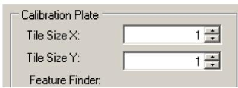
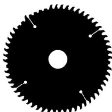
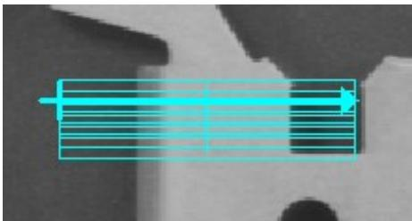
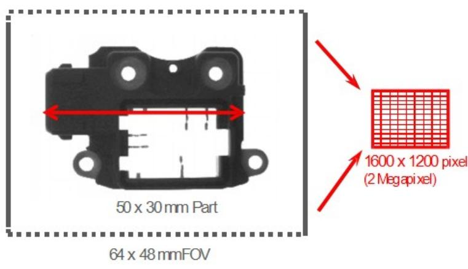

# 填空题

1. 在工业相机的使用中，选择远心镜头的优势主要是__超高分辨率_、__超宽景深__、_低畸变 _。  
2. 光是一种电磁波，可见光的范围是 __380nm_到___760nm_。  
3. 改变图像采集明暗度的方式有__调节光圈 _调节曝光___、_换高亮度光源__、__换大像元相机__对比度、增益。  
4. 名词解释

视野__相机所能看到现实世界的物理尺寸_。

曝光时间 _感光芯片感光的时间_。

像素深度 _每个像素数据的位数，一般常用的是 8Bit__。

测量精度 测量值与真实值之间的差别 。

像素分辨率 _单个像素所能代表的实际尺寸_。

帧率_相机一秒可以采集多少图像，通常表示相机采集单张图片的速度。

PPM 值 单个模块上的像素数。

像素分辨率 单个像素所能代表的实际尺寸。

放大倍率 CCD/FOV 之间的比值_ _。

景深__在对焦点前后能够清晰成像的距离叫做景深。

5. 在 Patmax 中建模板的三大要素是：_位置_、___尺寸__、_角度__。  
6. 请列举 Caliper Tool 的工作极性方法是_ _由明到暗__、_由暗到明_ _任何极性 。  
7. 在 PMAlignTool 中颗粒度决定了____用多少边缘点来表示图像中的特征。  
8. 镜头的畸变有 径向畸变____和_ _切向畸变 _两种。  
9. 工业相机触发方式根据触发信号，可分为 _手动触发 _和 _硬件触发 。  
10. DM262 采用 __220_ _V电源连接器连接。  
11. 镜头的光学放大倍率是 感光器尺寸 _和 _FOV_ _的比值。  
12. 请列举 Caliper Tool 的工作极性方法是 由明到暗_ _由暗到明

_任何极性 。

13. 相机曝光时间越_____长_____，图像越亮，抗震动能力越差。  
14. 8 位黑白相机的灰度等级为 _256____ 级。  
15. CogIntersectLineCircleTool 工具输入端需要输入：_ _采集图像源 _已知直线_已知圆 _才能正常运行此工具。  
16. 中数字 1 表示_ _1mm 。  
17. Framework 视觉系统包括“在线”与“离线”两种运行模式，在“Run”弹出菜单中选择_online_ _开启 TCP Server 服务，选择_ _offline _则关闭 TCP Server 服务。  
18. 在机器视觉系统中，系统是由_视野_、_光源_、_图像采集_、_视觉工具_、_通讯_五大部分构成。  
19. CCD即感光元器件是由一组矩阵式的 感光芯片 组成，它的功能是将光信号转换成_电信号_   
20. CogCaliperTool 的边缘模式有 _单个边缘_和___边缘对__。  
21. 在 PMAlignTool 中建模主要获取的是目标物的 _特征和轮廓 _。  
22. CMOS作为工业相机感光芯片的首选，它的优势有哪些，请写出三条。__耗电量低_ _速度快___、 _价格便宜_ 。  
23. 在工业相机的使用中，选择远心镜头的优势主要是___高分辨率_、__宽景深_、___低畸变_。  
24. 光是一种电磁波，可见光的范围是 _380nm__到___760nm_。  
25. 改变图像采集明暗度的方式有__调节光圈_、__调节曝光__、_调整光源亮度__、___换大像元相机   
26. VisionPro 工具库中 CogFixtureTool 作用主要为 创建用户坐标系，产生坐标的跟随。  
27. 在 CogBlobTool 中，当目标物与背景有明显灰度值变化，我们为了凸显特征面积，一般会调整阈值 从而获取更精确的目标大小。  
28. 在工业相机中，镜头的基本功能是 _实现光束转换  
29. 视觉视觉的四大功能 _引导_ 检测 _测量 _识别 。  
30. 相机按照像素排列方式分为 线阵相机 面阵相机 。

31. 相机感光器件上的基本感光单元/相机识别到的图像上的最小单元是 _像元_ 。  
32. 视野英文缩写为___FOV_ ____，定义是_ 相机所能看到现实世界的物理尺寸 。  
33. 常见的曝光方式有 _全局曝光 _和 _卷帘曝光 。  
34. 8704E 卡采用 4-Pin 电源连接器连接 12 V 电源。  
35. Cognex QuickBuild 视觉保存 Appliaction、Job、Tool 项目文件的格式/后缀为：____.vpp_ _。  
36. 在 CMD 窗口输入_ _cogtool -p_ _命令可以查看板卡信息。  
37. 在 Gige 配置相机时需要设置：___IP_ 1 _防火墙_____、_ebus____、__巨帧数据包__。  
38. 机器视觉是 用数字图像处理技术处理数字图像，并应用于工业生产任务。  
39. CCD 即感光元器件是由一组矩阵式的 组成，它的功能是将光信号转换成 电信号  
40. 相机所能看到的最小特征即为一个 像素  
41. 光源的 安装位置 和 角度 直接决定图像的效果。  
42. 光源的视场分为 亮场和 暗场 两种。  
43. 基本码制包括 一维线性条码 、DataMatrix 、QR-Code 、PDF417 四种。  
44. 焦距是 透镜中心 到成像面的距离，焦距越小，景深 越大 ，光圈越大，景深 越小  
45. 8704E 卡的信息提取时，在 CMD 命令行黑色窗口中输入： cogtool -p 会提取出 8704E  
46. 卡的所有信息，包括 8704E 卡的 SN、工具集 、支持相机数 、相机的型号和 SN 等信息。  
47. 机台有两张 8704 卡的需要特别注意，如果双击后，升级没有成功，就右击选中文件点击  
48. 编辑bat 文件，进行修改顺序编号，即把“0”改为 1 ，修改顺序编号后，在进行升  
49. 级，如果还不成功，就把升级后的 tool list 发送给DRI 进行检查 。  
50. Setup Tool是用于方便调节相机位置、视野、倾斜、聚焦的工具这样在调机是能更加方便快捷和准确。  
51. 型号 CAM-CIC-5000R-14-G 的相机像素分辨率为 2592*1944  
52. Windows 64 位操作系统应安装 VisionPro_ _x64 (R) 9.2 CR2  
53. Cognex 目前使用的用户程序均是在.NET Framework 基础上运行的，故想保证程序正常运

行，首先需要确认 .NET 版本号在 4.6.2 以上

54. 在进行视觉对位引导项目中，需建立视觉坐标系与机械手坐标系之间的对应关系，而标定__就是来完成该作用。  
55. 点击“Light Intensity”进入光源设置界面，这里可以为每个 Inspection 设定对应的光源及其强度。勾选__D__，可以使光源常亮。不勾选，则光源处于触发模式。单击 Save，保存设置。单击_C__，保存设置后退出光源配置界面。单击__A__，不保存，退出光源配置界面。A“Cancel” B“Save” C“Save and Close” D“Live Preview  
56. 在“Image Save Options”对话框中，在___C__ _栏目中，可以对每个 VPP 分别设置是否保存.bmp 图像；在___A _栏目中可以对每个 VPP 分别设置是否保存.jpg 图像。  
A“Annotated Image Sources” B“Browse”   
C“Raw Image Sources” D“Annotated Image Save Path”

# 不定项选择题

1. 以下选项中会影响景深的因素是( ABD )

A 镜头焦距和像元尺寸

B 光圈值大小

C 视野明暗度

D 接圈和扩倍器

2. 以下什么不是 DataMatrix 代码的特性（ BC ）

A、静区（Quiet Zone）

B、启始符/终止符

C、校验符

D、计时特征（Timing Pattern）

3. 在 Cognex 相机的参数上，相机标签 CAM-CIC-5000R-14-G,其中 R 代表的是什么意思？（ C ）

A、带返回值参数的相机

B、高转速相机

C、卷帘快门相机

D、全局快门相机

4. 在 Cognex 相机的参数上，相机标签 CAM-CIC-5000R-14-G,其中 G 代表的是什么意思？（ D ）

A、Cognex G 级相机

B、Cognex G 系列相机

C、Cognex 工业相机 D、Cognex 工业黑白相机

5. 具有较强对比度的标签和标记的最佳光源选择是（ B ）

A、漫射暗场照明 B、漫射亮场照明

C、红外光源 D、背景光源

6. 一幅高质量的图像需包含以下哪些因素（ ACE ）

A、大信噪比 B、大光圈 C、高对比度 D、高曝光 E、低噪音

7.以下关于感光元件描述正确的事：（ BC ）

A、CCD：噪点多、图像效果较差、价格便宜

B、CCD：噪点少、图像效果好、价格高

C、CMOS：噪点多、速度快、价格便宜

D、CMOS：噪点少、速度快、价格高

8. 关于 CogFitLineTool 说法正确的（ BC ）。

A．与 CogFindLineTool 功能一样

B．通过数据点拟合直线

C．至少需要两个数据点才可以拟合一条直线

D．在理想条件下，参与拟合的数据点越多,拟合结果越稳定

9. 如下图锯齿边缘轮廓检测，请推荐一款适合的光源（ C ）

A、带偏振环形光 B、同轴光 C、背光源 D、高角度直向型光源

10. 在进行视觉对位引导项目中，需建立视觉坐标系与机械手坐标系之间的对应关系，而 _就是来完成该作用。 （ B ）

A 检测 B 标定 C 定位 D 曝光

11. Visionpro 工具库中 CogFixtureTool 作用。（ C ）

A．抓圆工具

B．计算距离.

C．建立坐标空间

D．设定矩形搜索范围

12. 以下哪种行为违反 FSE 厂区管理条例（ ABC）

A. 帮助机械厂商操作机械手

B. 操作机构软件

C. 在车间使用工控机看小说或打游戏

D. 携带水杯进入车间

13. 什么样的光源带有漫射和均匀光线，是弧面、反光和不平整表面的最佳选择（ A ）

A、CDI/Dome

B、亮场

C、暗场

D、背景光

14.决定视野的因素主要是( C )

A 镜头和增益

B 工作距离和增益

C 镜头焦距和工作距离

D 镜头放大倍率和景深

15. 以下什么不是 DataMatrix 代码的特性（ B ）

A、静区（Quiet Zone）

B、启始符/终止符和校验符

C、查找特征（Finder Pattern/L Pattern）

D、计时特征（Timing Pattern）

16. 影响成像质量的因素包括（ ABCDE ）

A. 视野大小、镜头焦距、镜头光圈

B.光源的类型、光源的安装位置

C. 曝光时间 D. 物距

E.成像器类型

17.对于 Windows 64 位操作系统应安装哪种 VisionPro（ BD ）

A. Cognex VisionPro x32(R) 9.0 CR1

B. Cognex VisionPro x64 (R) 9.0 CR1

C. Cognex VisionPro x32(R) 9.0 CR2

D. Cognex VisionPro x64 (R) 9.0 CR2

18. 在 Gige 软件中配置相机时，相机的巨帧设置应为（ B ）

A.9600

B.9014

C.8704

D.1024

19. 如图所示，使用 CogFindLineTool 抓边缘对，其极性设置为（ C ）

A. 由明到暗，由暗到明  
B. 由明到暗，由明到暗  
C. 由暗到明，由明到暗  
D. 由暗到明，由暗到明

20. 在 8 位的灰度图像中，像素数值为 255 是什么颜色？ （ A ）

A、白色

B、黑色

C、灰色偏白

D、灰色偏黑

21. 一维码和二维码 DataMatrix 组成区域相同的有（A ）

A．静区

B.起始符

C. 数据符

D.终止符

22.在 Framekwork 更新到 2.1 版本以后，新增加了一个很重要的功能，即______ B ____三者的关系可以通过连线的方式进行设置。

A 视野，曝光，图像， B 取相，标定，检测

C 相机 IP，主机 IP，光源控制器 IP D 相机初始化，增益，延迟

23.__ D _参数的意义：棋盘格每个单元格的尺寸大小

B _：标定时相机固定不动，机械手带着标定板移动

A _：标定时标定板固定不动，机械手带着相机移动   
___ C___： 不执行该标定文件，相机输出图片直接赋给 Inspection 使用

A Moving Camera

B Static pose

C Passthrough

D Pitch

24.图片保存路径：__ B 桌面创建_ C _文件，用于存放当天 NG Image，便于工程师查看分析 NG 原因和数据。 共享路径设置： A 复制视觉软件: D:/Cognex/Program/ 软件备份路径：D _备份日期-备份人姓名

A D:/Cognex/Share/ B D:/Cognex/Images/

C NG-Image D D:/Cognex/Backup/

25.设置相机界面正确打开方式是：_ C

A.[开始菜单] [ 所有程序] [Cognex] [Utilties] [VisionPro] [Gige Cogfiguration Tool]  
B. [开始菜单] [  所有程序] [Cognex]→ [VisionPro] [Gige Cogfiguration Tool]   
C. [开始菜单] [ 所有程序] [Cognex]→ [VisionPro] [Utilties] [Gige Cogfiguration Tool]  → →   
D. [开始菜单] $\mid $ [  所有程序] [Cognex] [Utilties] [Gige Cogfiguration Tool]

26.相机巨帧设置应为 B

A .9600 B.9014 C.8704 D.1024

27.对于 Windows 64 位操作系统应安装哪种 VisionPro_ D_

A.Cognex VisionPro x32(R) 9.0 CR1 B. Cognex VisionPro x64 (R) 9.0 CR1

C.Cognex VisionPro x32(R) 9.0 CR2 D. Cognex VisionPro x64 (R) 9.0 CR2

28.图像训练正确顺序为 A

A.获取图像 设置训练区域和原点 设置训练参数 训练图像 查看结果  
B.获取图像 训练图像 设置训练参数 查看结果  
C. 获取图像 设置训练参数 设置训练区域和原点 训练图像 查看结果  
D. 获取图像 设置训练区域和原点 训练图像 查看结果

29.在“Image Save Options”对话框中，在____C_____栏目中，可以对每个 VPP 分别设置是否保存.bmp 图像；在____A _栏目中可以对每个 VPP 分别设置是否保存.jpg 图像。

A“Annotated Image Sources” B“Browse”

C“Raw Image Sources” D“Annotated Image Save Path”

# 判断题

1. CS 型镜头加 5mm 接圈匹配 C 型相机 （ N ）  
2. C 型镜头+5mm 接圈匹配 CS 型相机。 （ Y ）  
3. 景深是指在焦距固定，图像清晰时，被测物体离相机的前后变化距离，它受镜头上光圈的影响，光圈大景深大。 （ N ）  
4. 一般短焦距镜头的畸变比长焦距镜头畸变更大。 （ Y ）  
5. 颗粒度的基本单位是 Pixel。 （ Y ）  
6. CogPMAlignTool 工具中降低接受阀值，可以提高粗糙得分。 （ Y ）  
7. CogPMAlignTool 工具中提高接受阀值，可以提高精细得分。 （ Y ）  
8. PatMax工具的接受阈值介于0-1之间。 （ Y ）  
9. CogCalibCheckerboardTool 矫正输入图片的畸变。 （ Y ）  
10. CogIDTool 同时支持一维码和二维码的读取。 （ Y ）  
11. CogBlobTool 更加适用于低对比度的图像。 （ N ）  
12. CogCaliperTool 中的 Edge Pair(边缘对) 模式还可以测量边缘对之间的距离。 （ Y ）  
13. 硬件选型时，镜头的最大兼容芯片尺寸可以小于相机芯片尺寸。 （ N ）  
14. 定焦镜头的焦距是可以微调的。 （ N ）  
15. 定焦镜头的焦距不可以调节，变焦镜头的焦距可以调节 （ Y ）  
16. 远心镜头的放大倍率是可调的。 （ N ）  
17. 目标物前后的距离叫做最大最小工作距离。 （ N ）  
18. 景深的大小会影响到最大最小工作距离。 （ Y ）  
19. CMOS 在采集图片的时候，噪声是指的采集图像时候产生的声音 （ N ）  
20. LED光源的优势在于绿色环保寿命长，但电光转化效率低。 （ V ）  
21. 镜头的光圈值越大，通光孔径越大。f/2比f/2.8的孔径要小。 （ X ）

22. 相机分辨的单位是像素。 （ V ）

# 简答题

1. 简述所学项目的标定流程及注意事项。  
2.请按照所学项目 Bringup 逐步写出 COXNEX 调机步骤。

1、确认对应各工位的相机的镜头的光圈值是否合适，调解光圈调解圈至合适的光圈值，确认完毕后需要锁紧光圈的紧固螺钉；  
2、调整物距至合适值。调整焦距，获得清晰的图像，焦距合适后，需要锁紧焦距的紧固螺钉；  
4、OPT打光完毕后，对相机进行自动标定；  
5、粗/精调Vpp程序；  
6、通过CPK，GRR验证；

3.相机无法正常连接（拍照蓝屏）现象，试分析原因和对应的解决措施？（15’）

1. 主机 IP 或者相机 IP 有设置错误  
2. 巨帧包 9014、防火墙关闭、ebus 驱动勾选   
3. 硬件损害（网线、相机、8704卡）

4.像素分辨率和 测量精度

$$
\mathrm {F O V} _ {\text {h o r i z o n t a l}} = 6 4 \mathrm {m m}
$$

$$
\text {A c c u r a c y} _ {\text {V i s i o n - T o o l}} = \frac {1}{4} \text {p i x e l}
$$

$$
\# \text {P i x e l s} _ {\text {h o r i z o n t a l}} = 1 6 0 0 \text {p i x e l s}
$$

$$
\text {A c c u r a c y} _ {\text {h o r i z o n t a l}} = \frac {\text {F O V} \times \text {A c c u r a c y} _ {\text {V i s i o n - T o o l}}}{\# \text {P i x e l s}}
$$

$$
\text {A c c u r a c y} _ {\text {h o r i z o n t a l}} = \frac {6 4 \times (1 \times 2) \text {p i x e l}}{4}
$$

Accuracy 0.02mm

测量精度=相机精度*视觉工具的精度=0.04mm*¼=0.01mm

两个视觉工具的测量精度：0.01mm*2=0.02mm

影响相机测量精度的因素： $\textcircled{1}$ 视野大小 $\textcircled{2}$ 相机分辨率 $\textcircled{3}$ 图像质量 $\cdot$ 视觉工具精度

Ps：比如 PMAlign 视觉工具精度是四十分之一

5.边线筛子: 过滤一半像素为 1 时, -1,0,1

过滤一半像素为 2 时, -1,-1,0,1,1

过滤一半像素为 3 时,-1,-1,-1,0,1,1,1

过滤一半像素为1时（-1,0,1）计算下列灰度值转换后的结果

-10 -5 -3 -2 0 2 3 5 8 10

$$
- 3 - - 1 0 = 7 \quad - 2 - - 5 = 3 \quad 0 - - 3 = 3 \quad 2 - - 2 = 4 \quad 3 - 0 = 3 \quad 5 - 2 = 3 \quad 8 - 3 = 5 \quad 1 0 - 5 = 5
$$

7 3 3 4 3 3 5 5

过滤一半像素为 1 时（ -1,-1,0,1,1）计算下列灰度值转换后的结果

-10 -3 -2 2 5 10

$$
2 + 5 - - 3 - - 1 0 = 2 0 \quad 5 + 1 0 - - 3 - - 2 = 2 -
$$

20 20